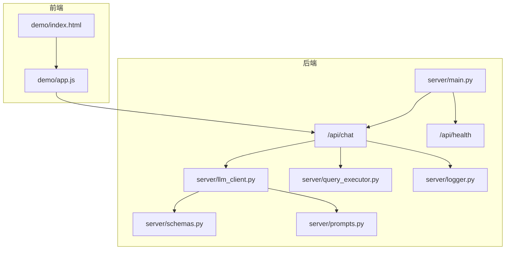
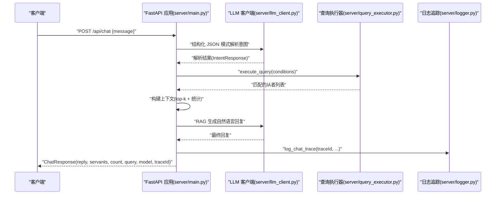
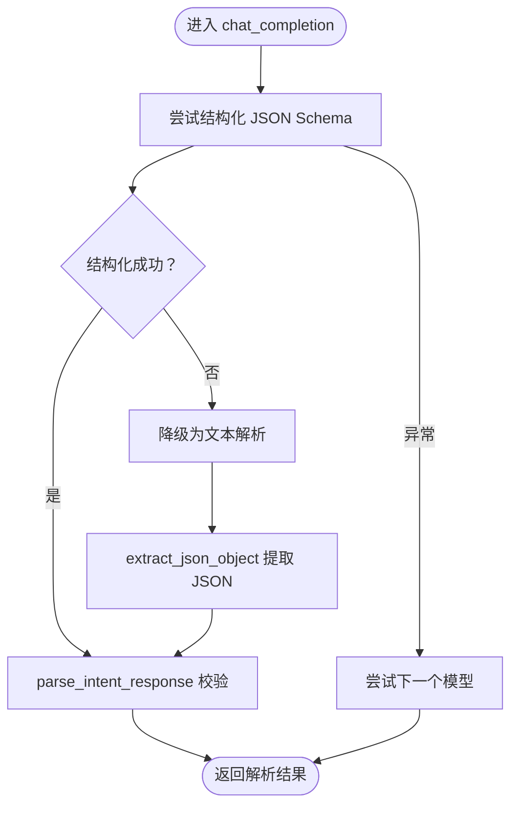
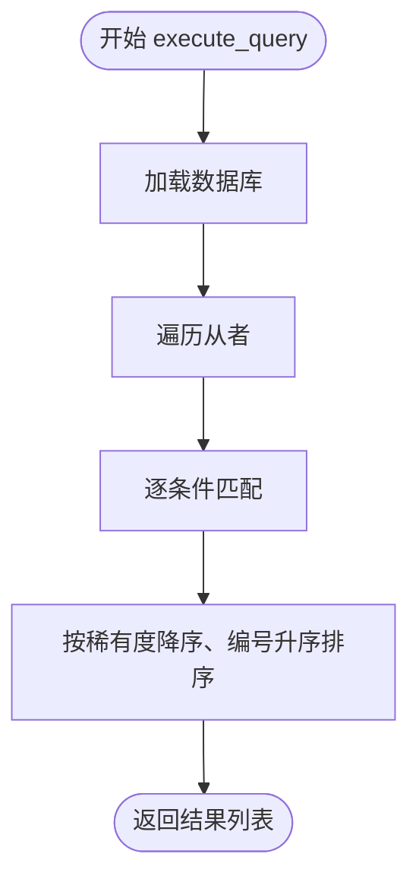
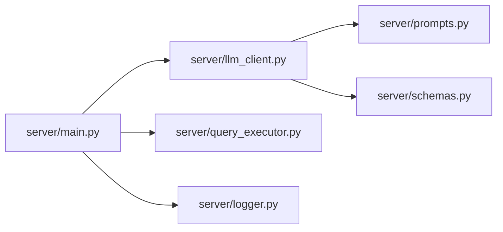

# API参考

<cite>
**本文引用的文件**
- [server/main.py](file://server/main.py)
- [server/llm_client.py](file://server/llm_client.py)
- [server/schemas.py](file://server/schemas.py)
- [server/prompts.py](file://server/prompts.py)
- [server/query_executor.py](file://server/query_executor.py)
- [server/logger.py](file://server/logger.py)
- [server/individuality.py](file://server/individuality.py)
- [demo/app.js](file://demo/app.js)
- [demo/index.html](file://demo/index.html)
- [tests/test_llm_client.py](file://tests/test_llm_client.py)
- [tests/test_query_executor.py](file://tests/test_query_executor.py)
- [README.md](file://README.md)
</cite>

## 目录
1. [简介](#简介)
2. [项目结构](#项目结构)
3. [核心组件](#核心组件)
4. [架构总览](#架构总览)
5. [详细组件分析](#详细组件分析)
6. [依赖分析](#依赖分析)
7. [性能考虑](#性能考虑)
8. [故障排查指南](#故障排查指南)
9. [结论](#结论)
10. [附录](#附录)

## 简介
本文件为 Laplace API 的完整参考文档，覆盖 REST API 规范、端点说明、请求/响应模式、认证方式、错误处理、健康检查、示例与客户端实现指南、性能优化建议、错误码与速率限制策略、版本管理以及测试与调试工具使用方法。

Laplace 是一个基于 FastAPI 的对话式 FGO 数据查询助手，采用两阶段 RAG 架构：第一阶段由 LLM 将自然语言解析为结构化查询意图，第二阶段在检索到的上下文基础上生成自然语言回复。系统内置意图解析 JSON Schema 与严格的校验流程，确保输出稳定可靠。

## 项目结构
- 后端服务入口位于 server/main.py，定义了 /api/chat 与 /api/health 两个核心端点。
- LLM 客户端位于 server/llm_client.py，负责与外部模型网关通信，具备结构化输出降级与多模型回退机制。
- 意图解析与查询条件模型位于 server/schemas.py，定义了 JSON Schema 与 Pydantic 校验模型。
- Prompt 管理位于 server/prompts.py，包含系统 Prompt 与生成阶段 Prompt。
- 查询执行器位于 server/query_executor.py，负责在本地数据库上执行筛选与排序。
- 日志追踪位于 server/logger.py，记录完整查询链路，便于排障。
- 前端演示位于 demo/，包含基础的聊天界面与调用示例。

图表来源
- [server/main.py:87-224](file://server/main.py#L87-L224)
- [server/llm_client.py:35-247](file://server/llm_client.py#L35-L247)
- [server/schemas.py:16-81](file://server/schemas.py#L16-L81)
- [server/prompts.py:46-208](file://server/prompts.py#L46-L208)
- [server/query_executor.py:53-305](file://server/query_executor.py#L53-L305)
- [server/logger.py:38-55](file://server/logger.py#L38-L55)
- [demo/app.js:30-74](file://demo/app.js#L30-L74)

章节来源
- [README.md:93-116](file://README.md#L93-L116)
- [server/main.py:51-228](file://server/main.py#L51-L228)

## 核心组件
- FastAPI 应用与路由
  - /api/chat：POST，接收用户消息，返回自然语言回复与从者列表。
  - /api/health：GET，健康检查。
- LLM 客户端
  - 支持结构化 JSON Schema 输出与文本回退，自动尝试多个模型。
- 意图解析与查询条件
  - 通过 JSON Schema 约束 LLM 输出，确保后续查询执行器可直接消费。
- 查询执行器
  - 在本地数据库上执行多条件筛选、排序与昵称映射。
- 日志追踪
  - 记录 traceId、用户查询、解析意图、结果数量、最终回复与上下文，便于问题定位。

章节来源
- [server/main.py:87-224](file://server/main.py#L87-L224)
- [server/llm_client.py:35-247](file://server/llm_client.py#L35-L247)
- [server/schemas.py:16-81](file://server/schemas.py#L16-L81)
- [server/query_executor.py:53-305](file://server/query_executor.py#L53-L305)
- [server/logger.py:38-55](file://server/logger.py#L38-L55)

## 架构总览
下图展示 /api/chat 的端到端调用序列，从前端发起请求到后端完成检索与生成回复的全过程。

图表来源
- [server/main.py:87-218](file://server/main.py#L87-L218)
- [server/llm_client.py:35-126](file://server/llm_client.py#L35-L126)
- [server/query_executor.py:53-87](file://server/query_executor.py#L53-L87)
- [server/logger.py:38-55](file://server/logger.py#L38-L55)

## 详细组件分析

### /api/chat REST API 规范
- 方法与路径
  - POST /api/chat
- 请求体
  - 参数：message（字符串，必填）
  - 示例路径：[请求体定义:66-78](file://server/main.py#L66-L78)
- 成功响应
  - 返回字段：
    - reply：字符串，自然语言回复
    - servants：数组，最多返回 50 条（前端可进一步限制展示）
    - count：整数，检索到的总数
    - query：对象，解析出的查询条件
    - model：字符串，实际使用的模型标识
    - traceId：字符串或 null，用于追踪
  - 示例路径：[响应模型定义:71-78](file://server/main.py#L71-L78)
- 错误处理
  - LLM 解析失败或网络异常：返回错误占位回复与 model="error"，并记录 traceId
  - 非查询意图：直接返回 LLM 原始回复
  - 生成阶段异常：降级为模板化回复
  - 示例路径：[意图解析与错误分支:94-126](file://server/main.py#L94-L126)、[生成阶段异常降级:178-196](file://server/main.py#L178-L196)
- 认证方式
  - 未启用认证（CORS 允许任意来源）
- 速率限制
  - 未实现服务端限流（建议在网关层或反向代理层配置）

章节来源
- [server/main.py:87-218](file://server/main.py#L87-L218)
- [server/main.py:66-78](file://server/main.py#L66-L78)
- [server/main.py:71-78](file://server/main.py#L71-L78)

### /api/health 健康检查
- 方法与路径
  - GET /api/health
- 响应
  - 返回 {"status": "ok", "service": "laplace"}
- 使用场景
  - 前端或运维监控可用性

章节来源
- [server/main.py:221-224](file://server/main.py#L221-L224)

### LLM 客户端与意图解析
- 结构化输出与回退
  - 优先使用 response_format=json_schema；若网关不支持，自动降级为文本解析并提取 JSON
  - 支持多模型回退（主模型 + 备用模型列表）
- 关键行为
  - chat_completion(system_prompt, user_message, model, max_tokens, temperature, json_mode)
  - parse_intent_response(content)：校验并解析为 IntentResponse
  - _post_chat_completion(...)：构造 OpenAI 兼容请求，处理 response_format 错误
- 示例路径
  - [chat_completion 主流程:35-126](file://server/llm_client.py#L35-L126)
  - [回退与错误处理:129-168](file://server/llm_client.py#L129-L168)
  - [JSON 提取与校验:171-178](file://server/llm_client.py#L171-L178)

图表来源
- [server/llm_client.py:35-126](file://server/llm_client.py#L35-L126)
- [server/llm_client.py:171-178](file://server/llm_client.py#L171-L178)

章节来源
- [server/llm_client.py:35-247](file://server/llm_client.py#L35-L247)
- [tests/test_llm_client.py:89-125](file://tests/test_llm_client.py#L89-L125)

### 查询执行器与条件模型
- 查询条件模型（QueryConditions）
  - 支持字段：npCharge、rarity、className、name、skillEffect、skillEffects、skillEffectsOp、targetType、traits、excludeTraits、gender、attribute、cards、npCard、npTarget
  - 字段校验：空字符串/空数组/空字典统一转为 null
  - 示例路径：[模型定义:25-66](file://server/schemas.py#L25-L66)
- 执行逻辑
  - 加载本地数据库（首次启动预加载）
  - 逐条匹配：NP 充能、稀有度、职阶、名称（含昵称映射）、效果（单/多）、特性（含符号特性）、性别、阵营、配卡、宝具颜色与目标类型
  - 排序：按稀有度降序、collectionNo 升序
  - 示例路径：[execute_query:53-87](file://server/query_executor.py#L53-L87)、[昵称映射与名称匹配:133-191](file://server/query_executor.py#L133-L191)、[特性匹配:221-227](file://server/query_executor.py#L221-L227)

图表来源
- [server/query_executor.py:53-87](file://server/query_executor.py#L53-L87)

章节来源
- [server/schemas.py:25-66](file://server/schemas.py#L25-L66)
- [server/query_executor.py:53-305](file://server/query_executor.py#L53-L305)
- [tests/test_query_executor.py:123-171](file://tests/test_query_executor.py#L123-L171)

### Prompt 与两阶段生成
- 系统 Prompt（意图解析）
  - 严格 JSON Schema 输出要求，包含效果分类、字段说明与示例
  - 示例路径：[系统 Prompt 构建:46-160](file://server/prompts.py#L46-L160)
- 生成 Prompt（RAG）
  - 基于检索上下文生成自然语言回复，强调“直接回答、基于上下文、不编造”
  - 示例路径：[生成 Prompt:175-207](file://server/prompts.py#L175-L207)

章节来源
- [server/prompts.py:46-208](file://server/prompts.py#L46-L208)

### 日志追踪与排障
- 日志字段
  - traceId、query、intent、results_count、reply、context、error
- 使用方式
  - 通过 traceId 回溯解析状态与检索上下文，定位问题
- 示例路径：[日志记录函数:38-55](file://server/logger.py#L38-L55)

章节来源
- [server/logger.py:38-55](file://server/logger.py#L38-L55)

### 前端集成与示例
- 前端页面
  - demo/index.html：聊天界面与示例提示
  - demo/app.js：调用 /api/chat，渲染回复与从者卡片
- 示例路径
  - [前端入口与事件绑定:32-67](file://demo/index.html#L32-L67)
  - [发送消息与渲染:30-123](file://demo/app.js#L30-123)

章节来源
- [demo/index.html:1-72](file://demo/index.html#L1-L72)
- [demo/app.js:30-123](file://demo/app.js#L30-L123)

## 依赖分析
- 组件耦合
  - /api/chat 依赖 LLM 客户端与查询执行器，二者通过明确的输入输出契约解耦
  - LLM 客户端依赖 Prompt 与 Schema 模型，形成稳定的意图解析链路
  - 查询执行器依赖本地数据库与昵称映射，具备良好的内聚性
- 外部依赖
  - LLM 网关（通过环境变量配置 Base URL 与 API Key）
  - 前端静态资源挂载于根路径，便于本地调试

图表来源
- [server/main.py:87-218](file://server/main.py#L87-L218)
- [server/llm_client.py:35-126](file://server/llm_client.py#L35-L126)
- [server/query_executor.py:53-87](file://server/query_executor.py#L53-L87)
- [server/prompts.py:46-160](file://server/prompts.py#L46-L160)
- [server/schemas.py:78-81](file://server/schemas.py#L78-L81)
- [server/logger.py:38-55](file://server/logger.py#L38-L55)

章节来源
- [server/main.py:87-218](file://server/main.py#L87-L218)
- [server/llm_client.py:35-126](file://server/llm_client.py#L35-L126)
- [server/query_executor.py:53-87](file://server/query_executor.py#L53-L87)

## 性能考虑
- 响应大小控制
  - /api/chat 对返回的 servants 数量进行上限控制（最多 50），避免响应过大
- 上下文裁剪
  - 仅将 top-k 结果注入生成阶段，减少 Token 消耗
- 预加载与缓存
  - 启动时预加载数据库，避免重复 IO
- 生成阶段温度与长度
  - 生成阶段使用较低 temperature，提高稳定性
- 建议优化
  - 在网关层启用压缩与连接复用
  - 对热点查询增加内存缓存（如按条件哈希）
  - 对前端分页加载从者卡片，降低首屏压力

章节来源
- [server/main.py:208-218](file://server/main.py#L208-L218)
- [server/main.py:134-173](file://server/main.py#L134-L173)
- [server/main.py:81-84](file://server/main.py#L81-L84)

## 故障排查指南
- 常见问题
  - LLM 无法连接或解析失败：检查 LLM_BASE_URL、LLM_API_KEY、LLM_MODEL 与 LLM_FALLBACK_MODELS 是否正确配置
  - /api/chat 返回 model="error"：查看后端日志中的 traceId 并回溯
  - 生成阶段异常导致降级：确认网关是否支持 response_format/json_schema
- 定位步骤
  - 查看后端日志文件（默认 server/logs/query_trace.jsonl），按 traceId 过滤
  - 使用 /api/health 确认服务可用
  - 前端控制台查看网络错误与状态码
- 相关路径
  - [日志记录:38-55](file://server/logger.py#L38-L55)
  - [健康检查:221-224](file://server/main.py#L221-L224)
  - [LLM 回退与错误处理:129-168](file://server/llm_client.py#L129-L168)

章节来源
- [server/logger.py:38-55](file://server/logger.py#L38-L55)
- [server/main.py:221-224](file://server/main.py#L221-L224)
- [server/llm_client.py:129-168](file://server/llm_client.py#L129-L168)

## 结论
Laplace API 通过清晰的意图解析与稳健的查询执行链路，实现了从自然语言到结构化数据的高效转换。其两阶段 RAG 架构在保证准确性的同时兼顾了可解释性与可维护性。建议在生产环境中配合网关层限流、缓存与可观测性体系，持续优化用户体验与系统稳定性。

## 附录

### API 使用示例
- 发送消息到 /api/chat
  - 方法：POST
  - 头部：Content-Type: application/json
  - 请求体：{"message": "30 自充的从者有哪些"}
  - 响应：包含 reply、servants、count、query、model、traceId
  - 示例路径：[前端调用示例:44-74](file://demo/app.js#L44-L74)、[后端响应模型:71-78](file://server/main.py#L71-L78)

章节来源
- [demo/app.js:44-74](file://demo/app.js#L44-L74)
- [server/main.py:71-78](file://server/main.py#L71-L78)

### 客户端实现指南
- 前端
  - 使用 fetch 调用 /api/chat，解析 JSON 并渲染回复与卡片
  - 建议：对输入进行去重与节流，避免频繁请求
  - 示例路径：[消息发送与渲染:30-123](file://demo/app.js#L30-123)
- 后端
  - 可直接复用 /api/chat 的响应模型进行二次封装
  - 示例路径：[响应模型定义:71-78](file://server/main.py#L71-L78)

章节来源
- [demo/app.js:30-123](file://demo/app.js#L30-L123)
- [server/main.py:71-78](file://server/main.py#L71-L78)

### 错误码与错误处理
- HTTP 状态码
  - 200：成功
  - 5xx：服务端异常（如 LLM 网关不可达）
  - 4xx：客户端错误（如请求体格式错误）
- 业务错误
  - /api/chat 返回 model="error" 时，表示 LLM 解析或网络失败
  - 生成阶段异常时，系统会降级为模板化回复
- 示例路径
  - [意图解析异常分支:94-111](file://server/main.py#L94-L111)
  - [生成阶段异常降级:178-196](file://server/main.py#L178-L196)

章节来源
- [server/main.py:94-111](file://server/main.py#L94-L111)
- [server/main.py:178-196](file://server/main.py#L178-L196)

### 速率限制与版本管理
- 速率限制
  - 未实现服务端限流，建议在网关层或反向代理层配置
- 版本管理
  - FastAPI 应用版本号：0.2.0
  - 示例路径：[应用版本:51-55](file://server/main.py#L51-L55)

章节来源
- [server/main.py:51-55](file://server/main.py#L51-L55)

### API 测试与调试工具
- 回归测试
  - 使用 pytest 运行默认测试，不访问网络
  - 示例路径：[测试入口:1-8](file://tests/conftest.py#L1-L8)
- LLM JSON Schema 测试
  - 运行真实 LLM 测试（会消耗少量配额）
  - 示例路径：[LLM 客户端测试:89-125](file://tests/test_llm_client.py#L89-L125)
- 查询执行器测试
  - 验证多条件筛选与排序逻辑
  - 示例路径：[查询执行器测试:123-171](file://tests/test_query_executor.py#L123-L171)

章节来源
- [tests/conftest.py:1-8](file://tests/conftest.py#L1-L8)
- [tests/test_llm_client.py:89-125](file://tests/test_llm_client.py#L89-L125)
- [tests/test_query_executor.py:123-171](file://tests/test_query_executor.py#L123-L171)