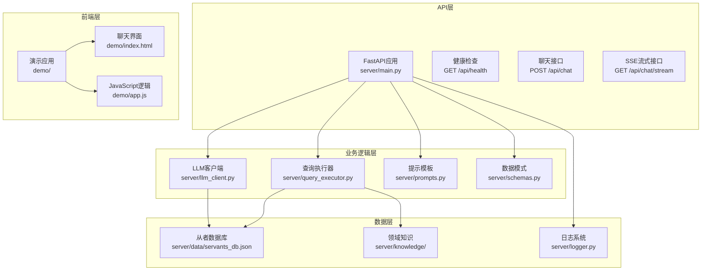
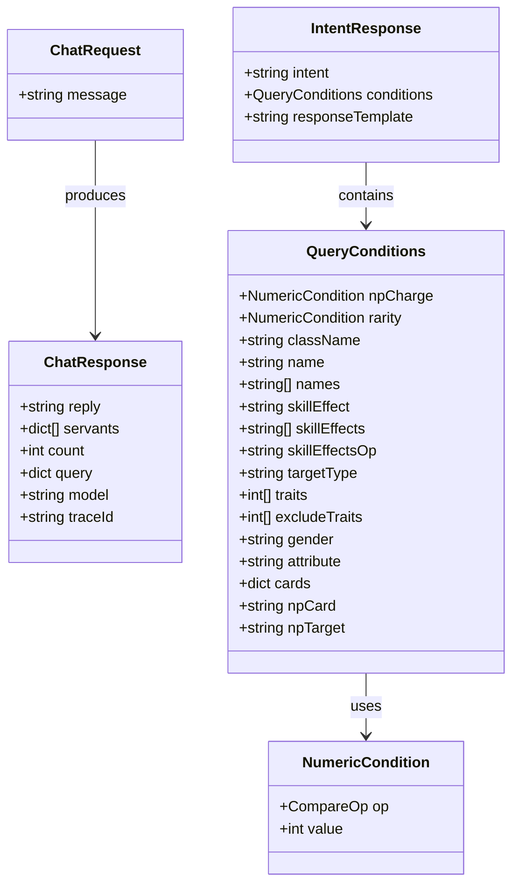
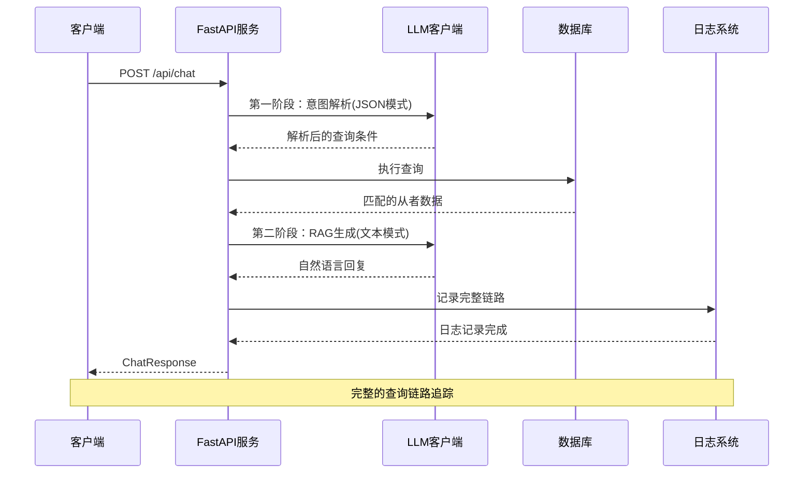
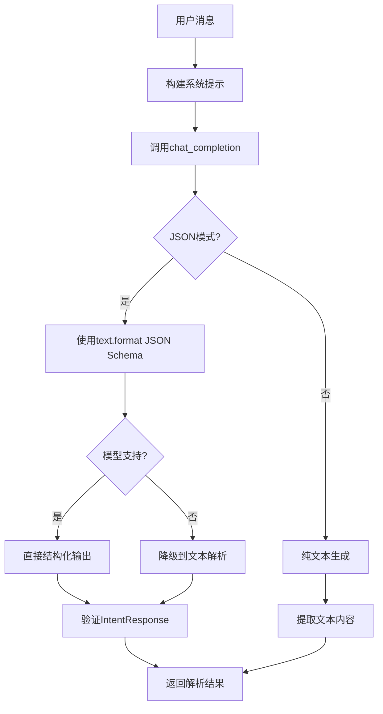
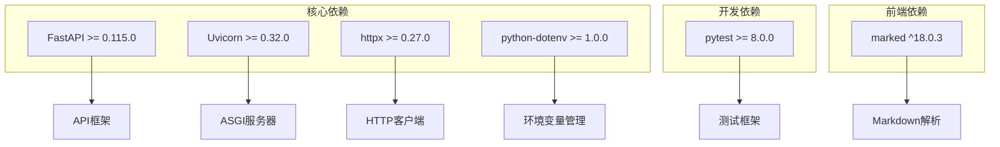
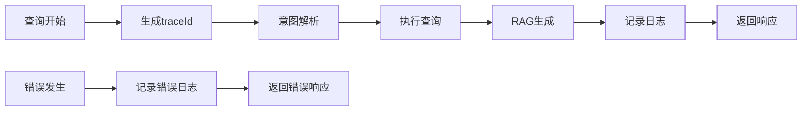

# API参考

<cite>
**本文档引用的文件**
- [server/main.py](file://server/main.py)
- [server/schemas.py](file://server/schemas.py)
- [server/llm_client.py](file://server/llm_client.py)
- [server/prompts.py](file://server/prompts.py)
- [server/query_executor.py](file://server/query_executor.py)
- [server/logger.py](file://server/logger.py)
- [demo/app.js](file://demo/app.js)
- [demo/package.json](file://demo/package.json)
- [README.md](file://README.md)
- [docs/CHANGELOG.md](file://docs/CHANGELOG.md)
- [server/requirements.txt](file://server/requirements.txt)
- [server/knowledge/effect_schema.json](file://server/knowledge/effect_schema.json)
</cite>

## 目录
1. [简介](#简介)
2. [项目结构](#项目结构)
3. [核心组件](#核心组件)
4. [架构概览](#架构概览)
5. [详细组件分析](#详细组件分析)
6. [依赖关系分析](#依赖关系分析)
7. [性能考量](#性能考量)
8. [故障排除指南](#故障排除指南)
9. [结论](#结论)
10. [附录](#附录)

## 简介

Laplace是一个AI原生的对话式FGO数据助手API，基于FastAPI框架构建。该项目利用大语言模型（LLM）的意图识别能力，将传统的FGO工具软件转化为对话式智能助手。用户只需用自然语言提问，即可获得精确的游戏数据查询结果。

### 主要功能特性
- 自然语言对话交互界面
- AI原生生成式响应（Two-Step RAG架构）
- LLM意图解析（自然语言→结构化JSON查询指令）
- Schema Mirror架构（同步提取Chaldea的领域知识）
- 全面从者查询（支持30% NP自充、55种复杂技能效果）
- 从者别名系统和特性深度解析
- SSE流式交互（Thinking Steps）

## 项目结构



**图表来源**
- [server/main.py:114-365](file://server/main.py#L114-L365)
- [server/llm_client.py:1-254](file://server/llm_client.py#L1-L254)
- [server/query_executor.py:1-343](file://server/query_executor.py#L1-L343)

**章节来源**
- [README.md:104-127](file://README.md#L104-L127)
- [server/main.py:114-365](file://server/main.py#L114-L365)

## 核心组件

### API端点概述

Laplace提供三个主要的HTTP端点：

1. **POST /api/chat** - 标准JSON响应接口
2. **GET /api/chat/stream** - SSE流式响应接口  
3. **GET /api/health** - 健康检查接口

### 数据模型



**图表来源**
- [server/main.py:129-142](file://server/main.py#L129-L142)
- [server/schemas.py:16-46](file://server/schemas.py#L16-L46)
- [server/schemas.py:79-87](file://server/schemas.py#L79-L87)

**章节来源**
- [server/main.py:129-142](file://server/main.py#L129-L142)
- [server/schemas.py:16-87](file://server/schemas.py#L16-L87)

## 架构概览

Laplace采用AI原生架构，实现了Two-Step RAG（Retrieval-Augmented Generation）流程：



**图表来源**
- [server/main.py:150-242](file://server/main.py#L150-L242)
- [server/llm_client.py:41-132](file://server/llm_client.py#L41-L132)
- [server/query_executor.py:53-116](file://server/query_executor.py#L53-L116)

**章节来源**
- [server/main.py:150-242](file://server/main.py#L150-L242)
- [server/prompts.py:186-218](file://server/prompts.py#L186-L218)

## 详细组件分析

### POST /api/chat 接口

#### 请求规范

**HTTP方法**: POST
**路径**: `/api/chat`
**内容类型**: `application/json`

**请求体参数**:
- `message` (string, 必填): 用户的自然语言查询

**请求示例**:
```json
{
  "message": "30自充的从者有哪些"
}
```

#### 响应规范

**响应体结构**:
- `reply` (string): LLM生成的自然语言回复
- `servants` (array): 匹配的从者数据数组
- `count` (integer): 匹配的从者总数
- `query` (object): 解析后的查询条件
- `model` (string): 使用的模型名称
- `traceId` (string, 可选): 查询追踪ID

**响应示例**:
```json
{
  "reply": "为您找到了以下拥有30%自充的从者：...",
  "servants": [
    {
      "name": "吉尔伽美什",
      "aliasCN": "金闪闪",
      "className": "saber",
      "rarity": 5,
      "totalSelfCharge": 30,
      "npCard": "buster",
      "npTarget": "all",
      "skillEffects": ["invincible", "pierceInvincible"],
      "npEffects": ["upNpdamage"]
    }
  ],
  "count": 15,
  "query": {
    "intent": "query_servants",
    "conditions": {
      "npCharge": {"op": "eq", "value": 30},
      "rarity": null,
      "className": null
    }
  },
  "model": "claude-sonnet-4-6",
  "traceId": "abc123de"
}
```

#### 错误处理

当LLM解析失败或生成失败时，API会返回标准的错误响应：
- 返回`reply`字段包含友好的错误提示
- `servants`为空数组
- `count`为0
- `model`设置为"error"
- `traceId`包含8位追踪ID

**章节来源**
- [server/main.py:150-242](file://server/main.py#L150-L242)
- [server/main.py:129-142](file://server/main.py#L129-L142)

### GET /api/chat/stream 接口

#### 请求规范

**HTTP方法**: GET
**路径**: `/api/chat/stream`
**查询参数**:
- `message` (string, 必填): 用户的自然语言查询

**响应类型**: `text/event-stream`

#### SSE事件类型

API支持四种SSE事件：

1. **thinking**: 展示AI的思考过程
   - `phase`: 思考阶段 (parsing, parsed, querying, generating)
   - `message`: 阶段说明文本
   - `conditions`: 解析的查询条件（仅在parsed阶段）

2. **servants**: 返回匹配的从者数据
   - `servants`: 从者数组
   - `count`: 返回的从者数量
   - `total`: 总匹配数量

3. **delta**: 流式返回的回复文本片段
   - `text`: Markdown格式的回复内容

4. **done**: 流程结束
   - `model`: 使用的模型名称
   - `traceId`: 查询追踪ID

**章节来源**
- [server/main.py:245-355](file://server/main.py#L245-L355)

### GET /api/health 接口

#### 请求规范

**HTTP方法**: GET
**路径**: `/api/health`

**响应体**:
```json
{
  "status": "ok",
  "service": "laplace"
}
```

**章节来源**
- [server/main.py:358-361](file://server/main.py#L358-L361)

### LLM客户端和意图解析

#### LLM调用流程



**图表来源**
- [server/llm_client.py:41-132](file://server/llm_client.py#L41-L132)
- [server/llm_client.py:176-183](file://server/llm_client.py#L176-L183)

#### 支持的查询条件

| 条件类型 | 参数名 | 可选值 | 描述 |
|---------|--------|--------|------|
| 数值比较 | `npCharge` | `{"op": "eq"|"gte"|"lte"|"gt"|"lt", "value": 整数}` | NP自充百分比条件 |
| 数值比较 | `rarity` | `{"op": "eq"|"gte"|"lte"|"gt"|"lt", "value": 整数}` | 稀有度条件 |
| 字符串 | `className` | "saber","archer","lancer","rider","caster","assassin","berserker","ruler","avenger","moonCancer","alterEgo","foreigner","pretender","shielder","beast" | 职阶筛选 |
| 字符串 | `name` | 任意字符串 | 单个从者名称搜索 |
| 数组 | `names` | ["从者1","从者2",...] | 多从者对比查询 |
| 字符串 | `skillEffect` | 效果名称 | 单个技能效果筛选 |
| 数组 | `skillEffects` | ["效果1","效果2",...] | 多个技能效果组合 |
| 字符串 | `skillEffectsOp` | "and"|"or" | 多效果逻辑关系 |
| 字符串 | `targetType` | "self"|"party"|"enemy" | 效果目标类型 |
| 数组 | `traits` | [特性ID,...] | 必须拥有的特性 |
| 数组 | `excludeTraits` | [特性ID,...] | 不能拥有的特性 |
| 字符串 | `gender` | "male"|"female"|"unknown" | 性别筛选 |
| 字符串 | `attribute` | "earth"|"sky"|"human"|"star"|"beast" | 阵营筛选 |
| 对象 | `cards` | {"buster":数量,"arts":数量,"quick":数量} | 指令卡配卡要求 |
| 字符串 | `npCard` | "buster"|"arts"|"quick" | 宝具颜色筛选 |
| 字符串 | `npTarget` | "one"|"all"|"support" | 宝具目标类型 |

**章节来源**
- [server/schemas.py:25-46](file://server/schemas.py#L25-L46)
- [server/prompts.py:110-128](file://server/prompts.py#L110-L128)

## 依赖关系分析

### 外部依赖



**图表来源**
- [server/requirements.txt:1-7](file://server/requirements.txt#L1-L7)
- [demo/package.json:2-4](file://demo/package.json#L2-L4)

### 环境配置

API运行需要以下环境变量：

| 环境变量 | 默认值 | 描述 |
|---------|--------|------|
| `LLM_BASE_URL` | `https://x.obao.cloud/v1` | LLM服务基础URL |
| `LLM_API_KEY` | 空字符串 | LLM访问密钥 |
| `LLM_MODEL` | `claude-sonnet-4-6` | 主要使用的模型 |
| `LLM_FALLBACK_MODELS` | `Deepseek-V4-Flash,gpt-5.4` | 备用模型列表 |

**章节来源**
- [server/llm_client.py:27-34](file://server/llm_client.py#L27-L34)
- [server/llm_client.py:25-25](file://server/llm_client.py#L25-L25)

## 性能考量

### 查询优化

1. **上下文预消化**: API会限制返回的从者数量，避免响应过大
   - `MAX_CONTEXT_SIZE = 5` - 上下文展示数量
   - `MAX_RESULTS = 50` - 最大返回结果数

2. **数据库预加载**: 应用启动时预加载从者数据库，减少首次查询延迟

3. **缓存机制**: 
   - 系统提示模板缓存
   - 效果名称映射缓存
   - 从者数据库缓存

### 流式处理

SSE接口支持分阶段流式传输：
- 意图解析阶段
- 数据检索阶段  
- RAG生成阶段

这样可以提供更好的用户体验，让用户及时看到查询进度。

**章节来源**
- [server/main.py:56-58](file://server/main.py#L56-L58)
- [server/main.py:245-355](file://server/main.py#L245-L355)

## 故障排除指南

### 常见错误及解决方案

#### LLM连接失败
**症状**: API返回错误响应，reply包含"网络问题或模型暂时不可用"
**原因**: LLM服务不可达或配置错误
**解决方案**:
1. 检查`LLM_API_KEY`环境变量
2. 验证`LLM_BASE_URL`可达性
3. 确认备用模型配置正确

#### JSON模式解析失败
**症状**: 意图解析阶段抛出JSON模式错误
**原因**: LLM输出不符合预期的JSON Schema
**解决方案**:
1. 检查系统提示模板完整性
2. 验证`intent_response_json_schema()`正确性
3. 查看日志中的具体错误信息

#### 数据库加载失败
**症状**: 应用启动时报错，无法加载从者数据
**原因**: `servants_db.json`文件缺失或格式错误
**解决方案**:
1. 确认数据文件存在
2. 验证JSON格式有效性
3. 重新运行数据加载脚本

### 日志追踪

API提供完整的查询链路追踪功能：



**图表来源**
- [server/logger.py:38-55](file://server/logger.py#L38-L55)
- [server/main.py:154-174](file://server/main.py#L154-L174)

**章节来源**
- [server/logger.py:38-55](file://server/logger.py#L38-L55)
- [server/main.py:154-174](file://server/main.py#L154-L174)

## 结论

Laplace API提供了一个完整的AI原生对话式FGO数据查询解决方案。其核心优势包括：

1. **自然语言友好**: 用户无需学习复杂的筛选界面，直接用自然语言提问
2. **高精度查询**: 基于55种技能效果的完整知识库，支持复杂的多条件组合查询
3. **实时反馈**: SSE流式接口提供分阶段的思考过程展示
4. **可靠架构**: Two-Step RAG架构确保回答的准确性和可解释性
5. **完整监控**: 全链路日志追踪支持问题诊断和性能优化

该API适合集成到各种FGO相关的应用中，为用户提供智能化的数据查询体验。

## 附录

### API版本控制策略

根据项目文档，当前API版本为`0.2.0`。项目采用语义化版本控制策略：

- **主版本号**: 重大架构变更
- **次版本号**: 新功能添加
- **修订号**: 错误修复和小改进

### 向后兼容性保证

项目通过以下方式保证向后兼容性：

1. **稳定的JSON Schema**: LLM意图解析输出格式保持稳定
2. **渐进式功能添加**: 新功能通过可选参数实现
3. **错误处理标准化**: 统一的错误响应格式
4. **版本化API**: 通过URL路径或头部版本标识

### 使用限制和最佳实践

#### 性能最佳实践
- 合理使用查询条件，避免过于复杂的组合
- 利用SSE接口获取更好的用户体验
- 适当使用`names`参数进行多从者对比查询

#### 安全考虑
- API未实现认证机制，建议在生产环境中添加适当的访问控制
- 注意保护LLM API密钥，避免泄露
- 监控API使用情况，防止滥用

#### 集成指南

**客户端集成步骤**:
1. 设置正确的环境变量
2. 初始化API客户端
3. 发送查询请求
4. 处理响应数据
5. 实现错误处理逻辑

**SDK使用示例**:
```javascript
// 基础查询
fetch('http://localhost:8000/api/chat', {
  method: 'POST',
  headers: {'Content-Type': 'application/json'},
  body: JSON.stringify({message: '30自充的从者'})
})

// 流式查询
const eventSource = new EventSource('/api/chat/stream?message=30自充的从者');
eventSource.onmessage = (event) => {
  const data = JSON.parse(event.data);
  // 处理SSE事件
};
```

**章节来源**
- [demo/app.js:39-87](file://demo/app.js#L39-L87)
- [docs/CHANGELOG.md:1-19](file://docs/CHANGELOG.md#L1-L19)