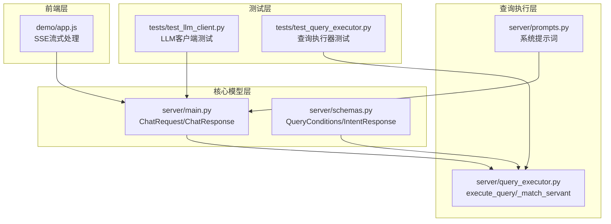
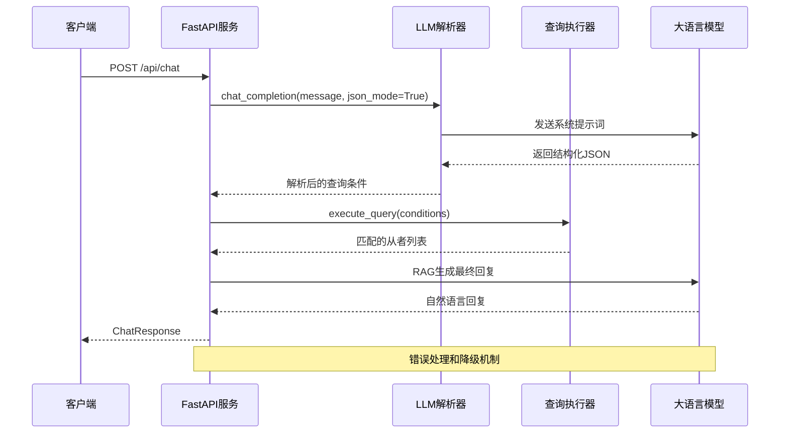
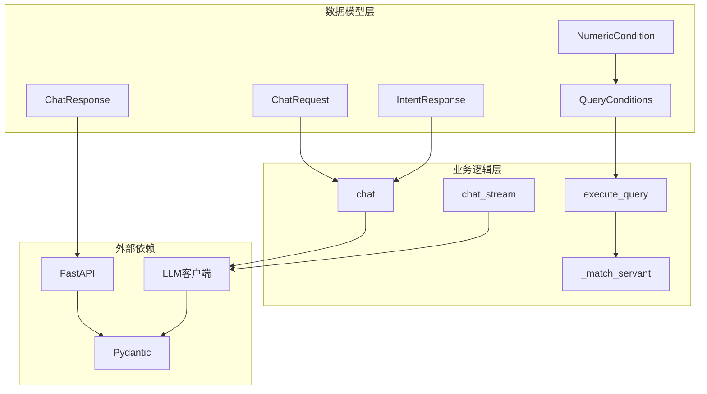

# 数据模型

<cite>
**本文档引用的文件**
- [server/main.py](file://server/main.py)
- [server/schemas.py](file://server/schemas.py)
- [server/prompts.py](file://server/prompts.py)
- [server/query_executor.py](file://server/query_executor.py)
- [tests/test_llm_client.py](file://tests/test_llm_client.py)
- [tests/test_query_executor.py](file://tests/test_query_executor.py)
- [demo/app.js](file://demo/app.js)
</cite>

## 目录
1. [简介](#简介)
2. [项目结构](#项目结构)
3. [核心组件](#核心组件)
4. [架构概览](#架构概览)
5. [详细组件分析](#详细组件分析)
6. [依赖关系分析](#依赖关系分析)
7. [性能考虑](#性能考虑)
8. [故障排除指南](#故障排除指南)
9. [结论](#结论)

## 简介

Laplace项目采用Pydantic模型驱动的数据验证架构，通过严格的JSON Schema定义实现LLM与查询执行器之间的结构化通信。本项目专注于FGO（Fate/Grand Order）从者数据查询，通过两阶段的意图解析和RAG生成实现智能化问答体验。

项目采用FastAPI框架构建RESTful API，支持传统JSON端点和SSE流式端点两种交互模式。数据模型设计遵循以下核心原则：
- **强类型验证**：使用Pydantic确保输入输出数据的完整性
- **结构化Schema**：通过JSON Schema约束LLM输出格式
- **可扩展性**：支持多从者对比和复杂查询条件组合
- **错误处理**：完善的异常捕获和降级机制

## 项目结构

Laplace项目的数据模型相关文件组织结构如下：



**图表来源**
- [server/main.py:128-142](file://server/main.py#L128-L142)
- [server/schemas.py:16-92](file://server/schemas.py#L16-L92)
- [server/query_executor.py:53-343](file://server/query_executor.py#L53-L343)

**章节来源**
- [server/main.py:1-365](file://server/main.py#L1-L365)
- [server/schemas.py:1-92](file://server/schemas.py#L1-L92)

## 核心组件

### ChatRequest请求模型

ChatRequest是用户输入的简化模型，专门用于对话式查询接口：

| 字段名 | 数据类型 | 是否可选 | 默认值 | 描述 |
|--------|----------|----------|--------|------|
| message | str | 必填 | 无 | 用户的自然语言查询文本 |

**验证规则**：
- 字符串类型强制验证
- 不能为空字符串
- 支持任意长度的UTF-8文本

### ChatResponse响应模型

ChatResponse是完整的响应模型，包含所有查询结果和元数据：

| 字段名 | 数据类型 | 是否可选 | 默认值 | 描述 |
|--------|----------|----------|--------|------|
| reply | str | 必填 | 无 | LLM生成的自然语言回复文本 |
| servants | list[dict] | 必填 | [] | 匹配的从者数据列表 |
| count | int | 必填 | 0 | 匹配的从者总数 |
| query | dict | 必填 | {} | 解析后的查询条件 |
| model | str | 必填 | "" | 使用的LLM模型名称 |
| traceId | str | 可选 | None | 请求追踪ID |

**业务含义**：
- **reply**：最终呈现给用户的自然语言回答
- **servants**：实际匹配的从者数据（最多50条）
- **count**：数据库中符合条件的从者总数
- **query**：LLM解析出的结构化查询条件
- **model**：实际使用的模型标识
- **traceId**：用于日志追踪的唯一标识符

**章节来源**
- [server/main.py:129-142](file://server/main.py#L129-L142)

## 架构概览

Laplace的数据模型架构采用分层设计，通过严格的Schema约束确保各组件间的协作一致性：



**图表来源**
- [server/main.py:150-242](file://server/main.py#L150-L242)
- [server/prompts.py:178-184](file://server/prompts.py#L178-L184)

## 详细组件分析

### QueryConditions查询条件模型

QueryConditions是复杂的查询条件集合，支持多维度从者筛选：

```mermaid
classDiagram
class QueryConditions {
+NumericCondition npCharge
+NumericCondition rarity
+str className
+str name
+str[] names
+str skillEffect
+str[] skillEffects
+str skillEffectsOp
+str targetType
+int[] traits
+int[] excludeTraits
+str gender
+str attribute
+dict cards
+str npCard
+str npTarget
+_blank_to_none()
+_validate_names()
+_empty_list_to_none()
+_empty_dict_to_none()
}
class NumericCondition {
+CompareOp op
+int value
}
class CompareOp {
<<enumeration>>
"eq"
"gte"
"lte"
"gt"
"lt"
}
QueryConditions --> NumericCondition : "包含"
QueryConditions --> CompareOp : "使用"
```

**图表来源**
- [server/schemas.py:16-77](file://server/schemas.py#L16-L77)

**字段详细说明**：

#### 数值条件字段
- **npCharge**: NP自充百分比条件，支持等于、大于等于、小于等于、大于比较
- **rarity**: 稀有度条件，范围1-5星

#### 文本匹配字段
- **className**: 职阶名称（如saber、archer等）
- **name**: 单个从者名称搜索（向后兼容）
- **names**: 多从者对比列表（新增功能）

#### 技能效果字段
- **skillEffect**: 单个技能效果名称
- **skillEffects**: 多个技能效果数组
- **skillEffectsOp**: 多效果逻辑关系（and/or）

#### 属性筛选字段
- **targetType**: 效果目标类型（self/party/enemy）
- **traits**: 必须拥有的特性ID列表
- **excludeTraits**: 不能拥有的特性ID列表
- **gender**: 性别筛选（male/female/unknown）
- **attribute**: 阵营筛选（earth/sky/human/star/beast）

#### 指令卡和宝具字段
- **cards**: 指令卡配卡要求（buster/arts/quick数量）
- **npCard**: 宝具颜色筛选
- **npTarget**: 宝具目标类型（one/all/support）

**章节来源**
- [server/schemas.py:25-77](file://server/schemas.py#L25-L77)

### IntentResponse意图响应模型

IntentResponse定义了LLM的第一阶段响应格式：

```mermaid
classDiagram
class IntentResponse {
+Literal~"query_servants"~ intent
+QueryConditions conditions
+str responseTemplate
}
class Literal {
<<enumeration>>
"query_servants"
}
IntentResponse --> QueryConditions : "包含"
IntentResponse --> Literal : "使用"
```

**图表来源**
- [server/schemas.py:79-87](file://server/schemas.py#L79-L87)

**字段说明**：
- **intent**: 固定为"query_servants"，表示从者查询意图
- **conditions**: 解析出的查询条件对象
- **responseTemplate**: 自定义回复模板（可选）

**章节来源**
- [server/schemas.py:79-92](file://server/schemas.py#L79-L92)

### Pydantic验证机制

Laplace项目采用多层次的Pydantic验证机制：

#### 字段级验证
- **类型强制**：每个字段都有明确的类型声明
- **默认值处理**：使用Field(default_factory=...)提供默认值
- **可选性控制**：通过Union类型支持None值

#### 自定义验证器
- **空白字符串处理**：自动将空白字符串转换为None
- **列表清理**：过滤空字符串和空列表
- **字典验证**：确保空字典转换为None

#### JSON Schema集成
- **结构化输出**：LLM必须返回符合Schema的JSON
- **错误恢复**：支持fenced JSON和文本混合格式
- **模型降级**：当结构化响应不受支持时自动降级

**章节来源**
- [server/schemas.py:47-77](file://server/schemas.py#L47-L77)
- [tests/test_llm_client.py:79-150](file://tests/test_llm_client.py#L79-L150)

## 依赖关系分析



**图表来源**
- [server/main.py:129-242](file://server/main.py#L129-L242)
- [server/query_executor.py:53-343](file://server/query_executor.py#L53-L343)

**章节来源**
- [server/main.py:114-142](file://server/main.py#L114-L142)
- [server/query_executor.py:1-50](file://server/query_executor.py#L1-L50)

## 性能考虑

### 查询优化策略

1. **早期过滤**：在执行查询前进行条件验证和清理
2. **索引利用**：通过稀有度和collectionNo进行排序优化
3. **结果限制**：默认最多返回50条结果，避免响应过大
4. **缓存机制**：数据库和昵称映射采用全局缓存

### 内存管理

- **渐进式处理**：SSE流式响应避免一次性加载大量数据
- **批量处理**：多从者对比查询采用分批处理策略
- **资源释放**：异步客户端正确关闭连接

### 错误处理优化

- **快速失败**：无效输入立即返回错误响应
- **降级机制**：LLM不可用时提供基础回复
- **超时控制**：合理的请求超时设置

## 故障排除指南

### 常见问题及解决方案

#### LLM解析失败
**症状**：返回错误的JSON格式或空响应
**原因**：模型不支持结构化输出或网络问题
**解决**：启用文本格式降级和备用模型

#### 查询条件无效
**症状**：查询返回空结果但无错误提示
**原因**：条件过于严格或输入格式不正确
**解决**：检查条件字段的有效性并提供默认值

#### 性能问题
**症状**：响应时间过长或内存占用过高
**解决**：启用结果限制和缓存机制

#### 字段验证错误
**症状**：Pydantic ValidationError异常
**解决**：检查字段类型和必填性要求

**章节来源**
- [server/main.py:157-175](file://server/main.py#L157-L175)
- [server/main.py:214-221](file://server/main.py#L214-L221)

## 结论

Laplace项目的数据模型设计体现了现代AI应用的最佳实践：

### 设计优势
- **强类型保障**：Pydantic确保数据完整性
- **Schema驱动**：通过JSON Schema约束LLM输出
- **可扩展性**：支持复杂查询条件和多从者对比
- **用户体验**：SSE流式响应提供实时反馈

### 技术特色
- **双阶段处理**：意图解析和RAG生成分离
- **错误恢复**：完善的降级机制
- **性能优化**：多层缓存和结果限制
- **监控追踪**：完整的traceId日志系统

### 最佳实践建议
1. **模型扩展**：新增字段时保持向后兼容
2. **验证增强**：添加更严格的输入验证
3. **性能监控**：建立查询性能指标
4. **错误分类**：区分不同类型的错误场景

这个数据模型体系为Laplace项目提供了坚实的技术基础，支持从简单的从者查询到复杂的多条件组合查询，为用户提供智能化的FGO数据查询体验。