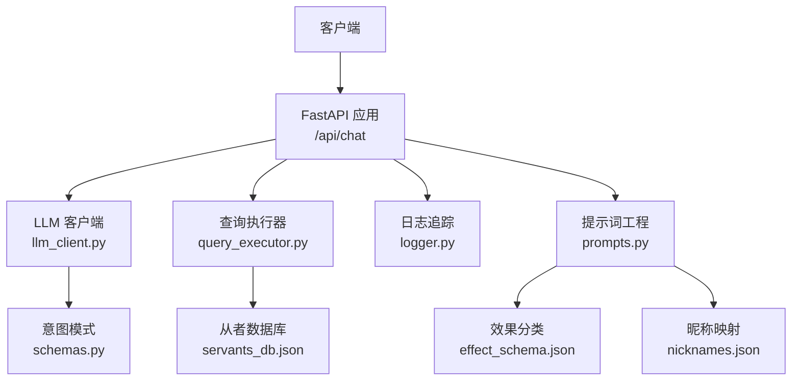
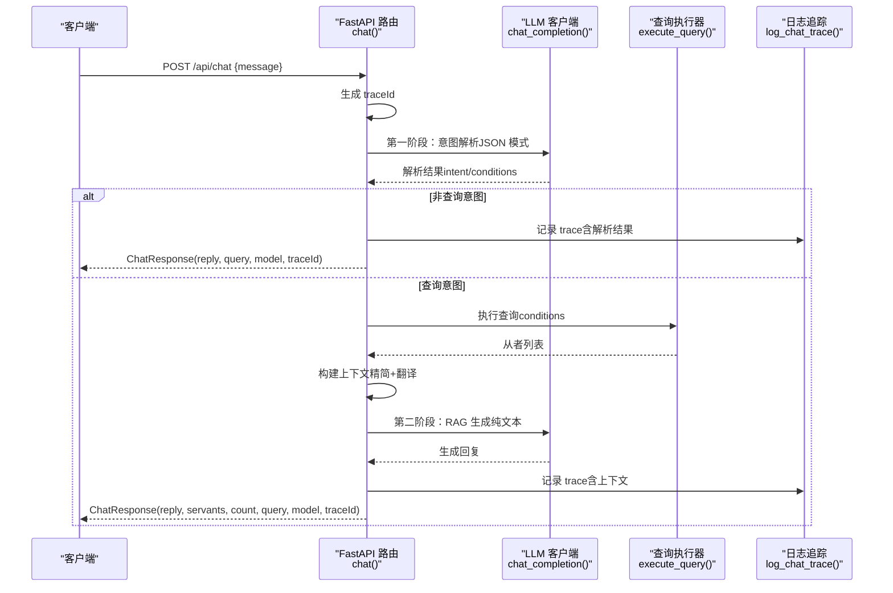
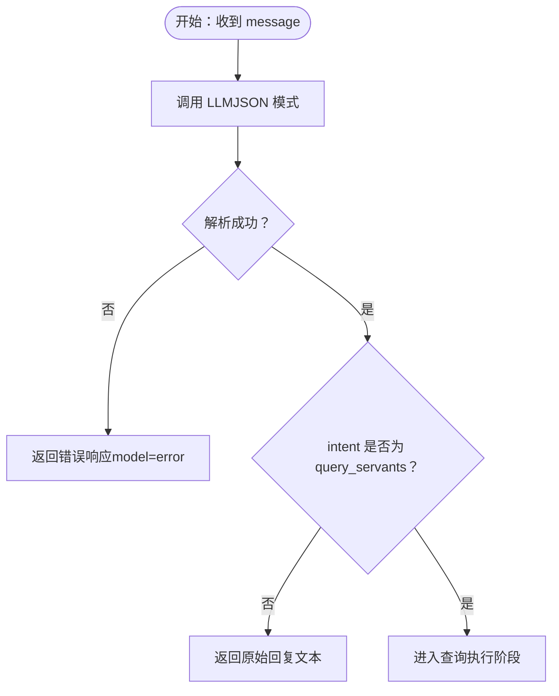
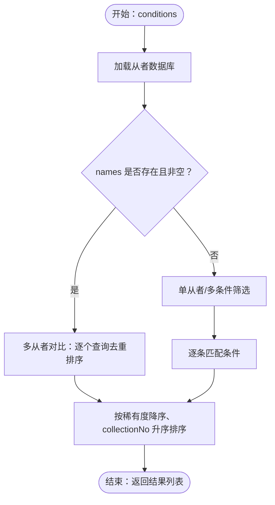
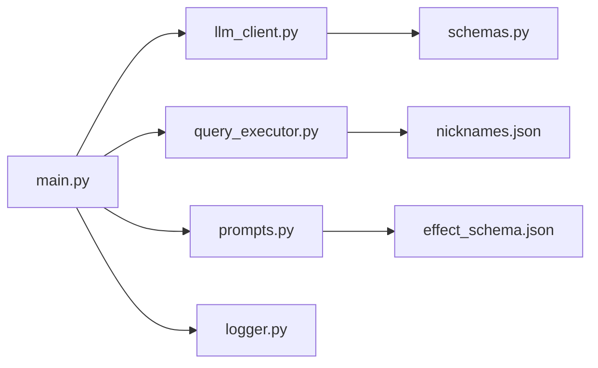

# 聊天接口

<cite>
**本文引用的文件**
- [server/main.py](file://server/main.py)
- [server/schemas.py](file://server/schemas.py)
- [server/prompts.py](file://server/prompts.py)
- [server/query_executor.py](file://server/query_executor.py)
- [server/llm_client.py](file://server/llm_client.py)
- [server/logger.py](file://server/logger.py)
- [server/knowledge/nicknames.json](file://server/knowledge/nicknames.json)
- [tests/test_llm_client.py](file://tests/test_llm_client.py)
- [tests/test_query_executor.py](file://tests/test_query_executor.py)
</cite>

## 目录
1. [简介](#简介)
2. [项目结构](#项目结构)
3. [核心组件](#核心组件)
4. [架构总览](#架构总览)
5. [详细组件分析](#详细组件分析)
6. [依赖关系分析](#依赖关系分析)
7. [性能考量](#性能考量)
8. [故障排查指南](#故障排查指南)
9. [结论](#结论)
10. [附录](#附录)

## 简介
本文件为 POST /api/chat 聊天接口的权威技术文档，面向开发者与运维人员，覆盖请求体 ChatRequest 的 message 字段格式与校验规则、响应体 ChatResponse 的结构与语义、接口完整工作流程（意图解析阶段、查询执行阶段、上下文构建、自然语言生成阶段 RAG）、请求响应示例（成功与错误）、traceId 的作用与日志追踪机制，以及参数验证、错误处理与性能优化的最佳实践。

## 项目结构
- 后端服务采用 FastAPI，核心路由位于 server/main.py。
- LLM 调用封装在 server/llm_client.py，负责 Responses API 请求、结构化输出与降级处理。
- 意图解析与提示词工程在 server/prompts.py，包含系统提示与生成提示。
- 查询执行在 server/query_executor.py，负责将结构化条件映射到本地从者数据库。
- 数据模型与校验在 server/schemas.py，定义 JSON 模式与 Pydantic 校验。
- 日志追踪在 server/logger.py，记录 traceId、查询、意图、结果与上下文。
- 昵称映射在 server/knowledge/nicknames.json，用于名称规范化与多从者对比。

图表来源
- [server/main.py:114-365](file://server/main.py#L114-L365)
- [server/llm_client.py:1-254](file://server/llm_client.py#L1-L254)
- [server/prompts.py:1-219](file://server/prompts.py#L1-L219)
- [server/query_executor.py:1-343](file://server/query_executor.py#L1-L343)
- [server/schemas.py:1-92](file://server/schemas.py#L1-L92)
- [server/logger.py:1-55](file://server/logger.py#L1-L55)

章节来源
- [server/main.py:114-365](file://server/main.py#L114-L365)

## 核心组件
- ChatRequest：请求体，包含 message 字段，用于用户输入的自然语言。
- ChatResponse：响应体，包含 reply（回复文本）、servants（从者列表）、count（总数）、query（查询条件）、model（所用模型）、traceId（可选）。
- 意图解析：通过 LLM 的 JSON 模式输出，将自然语言解析为结构化查询条件。
- 查询执行：将结构化条件映射到本地从者数据库，进行筛选与排序。
- 上下文构建：对查询结果进行精简与翻译，构造 RAG 输入上下文。
- 自然语言生成：基于上下文生成自然语言回复，遵循严格的“禁绝先验知识”原则。

章节来源
- [server/main.py:129-142](file://server/main.py#L129-L142)
- [server/schemas.py:16-92](file://server/schemas.py#L16-L92)
- [server/prompts.py:186-219](file://server/prompts.py#L186-L219)

## 架构总览
POST /api/chat 的完整工作流如下：

图表来源
- [server/main.py:150-242](file://server/main.py#L150-L242)
- [server/llm_client.py:41-132](file://server/llm_client.py#L41-L132)
- [server/query_executor.py:53-116](file://server/query_executor.py#L53-L116)
- [server/logger.py:38-55](file://server/logger.py#L38-L55)

## 详细组件分析

### 请求体 ChatRequest 与 message 字段
- 结构
  - message: string，必填。用户输入的自然语言问题。
- 校验规则
  - 由 FastAPI 的 Pydantic 模型自动校验，确保 message 字段存在且为字符串。
  - 若 message 为空或缺失，将触发 FastAPI 的请求校验错误。
- 使用建议
  - 建议客户端在发送前进行基本长度与字符集校验，避免超长或异常字符导致服务端拒绝。
  - 对于多从者对比需求，应使用 names 字段而非 name 字段，详见“意图解析阶段”。

章节来源
- [server/main.py:129-132](file://server/main.py#L129-L132)

### 响应体 ChatResponse 结构与语义
- 结构字段
  - reply: string，最终回复文本。
  - servants: array，最多返回 MAX_RESULTS 条从者详情（默认 50）。
  - count: integer，查询命中总数（可能超过返回条数）。
  - query: object，解析出的查询条件（conditions）。
  - model: string，实际使用的模型标识。
  - traceId: string | null，本次请求的追踪 ID，便于日志定位。
- 语义说明
  - reply：严格基于检索上下文生成，遵循“禁绝先验知识”原则，不捏造未在上下文中出现的信息。
  - servants：返回精简后的代表数据（最多 MAX_CONTEXT_SIZE 条，用于上下文构建），以及最终返回给前端的 servants（最多 MAX_RESULTS 条）。
  - count：用于在回复中报告“完整总数”，避免误导用户以为返回条数即总数。
  - query：用于回溯解析结果，便于调试与审计。
  - model：用于监控与计费追踪。
  - traceId：用于端到端日志追踪与问题定位。

章节来源
- [server/main.py:134-142](file://server/main.py#L134-L142)
- [server/main.py:232-242](file://server/main.py#L232-L242)

### 意图解析阶段（JSON 模式）
- 触发条件
  - 调用 LLM 的 Responses API，启用结构化输出（text.format + json_schema）。
- 输出结构
  - intent: 固定为 "query_servants"（当前版本仅支持从者查询）。
  - conditions: 结构化查询条件对象，详见“查询条件模型”。
  - responseTemplate: 可选，用于生成阶段的模板文本。
- 错误处理
  - 若 LLM 返回结构化失败或不可用，将抛出异常并降级为错误响应。
  - 若解析结果 intent 非 "query_servants"，直接返回原始回复文本。
- 降级与回退
  - 若模型不支持 text.format，将自动降级为纯文本解析，并尝试备用模型。

图表来源
- [server/main.py:156-189](file://server/main.py#L156-L189)
- [server/llm_client.py:41-132](file://server/llm_client.py#L41-L132)

章节来源
- [server/llm_client.py:41-132](file://server/llm_client.py#L41-L132)
- [server/prompts.py:46-171](file://server/prompts.py#L46-L171)

### 查询执行阶段
- 输入
  - conditions：由意图解析阶段生成的结构化查询条件。
- 处理流程
  - 加载本地从者数据库（首次启动预加载）。
  - 支持多从者对比（names 字段）与单从者查询（name 字段）。
  - 多条件组合筛选：NP 充能、稀有度、职阶、名称、技能效果、特性、性别、阵营、指令卡、宝具颜色与目标类型。
  - 名称匹配：支持英文、日文、中文翻译与昵称映射，采用分级匹配策略（精确 → 子串 → 反向子串）。
  - 排序：按稀有度降序、collectionNo 升序。
- 输出
  - 从者列表，按条件筛选并排序。

图表来源
- [server/query_executor.py:53-116](file://server/query_executor.py#L53-L116)
- [server/query_executor.py:119-299](file://server/query_executor.py#L119-L299)
- [server/knowledge/nicknames.json:1-51](file://server/knowledge/nicknames.json#L1-L51)

章节来源
- [server/query_executor.py:53-116](file://server/query_executor.py#L53-L116)
- [server/query_executor.py:119-299](file://server/query_executor.py#L119-L299)
- [server/knowledge/nicknames.json:1-51](file://server/knowledge/nicknames.json#L1-L51)

### 上下文构建
- 目的
  - 将查询结果精简为适合 RAG 的上下文，包含 total_found、query_conditions 与 top_results_details。
- 精简策略
  - 仅保留前 MAX_CONTEXT_SIZE 条（默认 5）代表数据。
  - 对效果名称进行翻译，对卡 buff 状态进行汇总。
- 输出
  - context_data：包含 total_found、query_conditions、top_results_details。
  - top_results：用于生成阶段的上下文 JSON。

章节来源
- [server/main.py:60-105](file://server/main.py#L60-L105)

### 自然语言生成阶段（RAG）
- 触发条件
  - 在查询执行完成后，若第二阶段 LLM 调用失败，将降级为旧版回复模板。
- 提示词工程
  - 基于检索上下文生成回复，严格遵循“禁绝先验知识”原则。
  - 回复需包含“完整总数”，不得将代表数量当作总数。
- 输出
  - reply：最终回复文本。
  - model：实际使用的模型标识。

章节来源
- [server/main.py:200-230](file://server/main.py#L200-L230)
- [server/prompts.py:186-219](file://server/prompts.py#L186-L219)

### traceId 与日志追踪
- 生成
  - 每次请求生成一个 8 位十六进制 traceId。
- 记录
  - 意图解析失败、查询执行、RAG 生成、最终回复均会记录 trace。
  - 日志格式包含 timestamp、level、traceId、query、intent、results_count、reply、context、error（如有）。
- 使用
  - 前端/客户端可将 traceId 附加到反馈与工单中，便于后端快速定位。

章节来源
- [server/main.py:154](file://server/main.py#L154)
- [server/logger.py:38-55](file://server/logger.py#L38-L55)

## 依赖关系分析

图表来源
- [server/main.py:17-21](file://server/main.py#L17-L21)
- [server/llm_client.py:22](file://server/llm_client.py#L22)
- [server/query_executor.py:15-16](file://server/query_executor.py#L15-L16)
- [server/prompts.py:12](file://server/prompts.py#L12)

章节来源
- [server/main.py:17-21](file://server/main.py#L17-L21)
- [server/llm_client.py:22](file://server/llm_client.py#L22)
- [server/query_executor.py:15-16](file://server/query_executor.py#L15-L16)
- [server/prompts.py:12](file://server/prompts.py#L12)

## 性能考量
- 限流与并发
  - FastAPI 默认并发处理请求，建议在网关层设置速率限制与队列。
- LLM 调用
  - 使用 Responses API 并启用结构化输出，减少后处理开销。
  - 主备模型轮询，提高可用性与稳定性。
- 数据库与查询
  - 预加载数据库，避免每次请求重复 IO。
  - 查询结果按稀有度与编号排序，保证稳定输出顺序。
- 响应裁剪
  - 返回给前端的 servants 限制为 MAX_RESULTS（默认 50），避免响应过大。
  - 上下文构建仅保留前 MAX_CONTEXT_SIZE（默认 5）条代表数据。
- 日志
  - JSONL 格式日志，便于异步处理与分析。

章节来源
- [server/main.py:56-58](file://server/main.py#L56-L58)
- [server/main.py:232-233](file://server/main.py#L232-L233)
- [server/llm_client.py:66-84](file://server/llm_client.py#L66-L84)

## 故障排查指南
- 意图解析失败
  - 现象：返回 model=error，reply 为网络或模型不可用提示。
  - 排查：检查 LLM_BASE_URL、LLM_API_KEY、LLM_MODEL 与 LLM_FALLBACK_MODELS 配置；确认网络连通性。
- LLM 返回结构化失败
  - 现象：抛出 JSON schema 校验错误或响应格式不受支持。
  - 排查：确认模型是否支持 text.format；查看降级逻辑是否生效。
- 非查询意图
  - 现象：直接返回原始回复文本，不执行查询。
  - 排查：检查用户输入是否符合当前意图范围。
- 查询无结果
  - 现象：count=0，reply 为“未找到匹配从者”的委婉提示。
  - 排查：核对 conditions 是否过于严格；检查昵称映射与名称匹配策略。
- RAG 生成失败
  - 现象：降级为旧版回复模板。
  - 排查：检查生成阶段提示词与上下文完整性。
- 日志定位
  - 使用 traceId 在日志文件中检索完整链路，定位问题节点。

章节来源
- [server/main.py:164-174](file://server/main.py#L164-L174)
- [server/llm_client.py:108-132](file://server/llm_client.py#L108-L132)
- [server/logger.py:38-55](file://server/logger.py#L38-L55)

## 结论
POST /api/chat 接口通过“意图解析 + 查询执行 + 上下文构建 + RAG 生成”的四阶段流水线，实现了从自然语言到结构化查询再到自然语言回复的闭环。其设计强调“禁绝先验知识”与“严格遵循上下文”，并通过 traceId 与结构化日志提供强大的可观测性。配合合理的参数校验、错误处理与性能优化策略，可在保证准确性的同时提升用户体验与系统稳定性。

## 附录

### 请求与响应示例

- 成功查询示例
  - 请求
    - POST /api/chat
    - Content-Type: application/json
    - Body:
      - message: "有无敌或回避技能的从者有哪些"
  - 响应
    - Status: 200 OK
    - Body:
      - reply: "根据你的条件，为你找到了 X 位从者..."
      - servants: [{...}, ...]（最多 50 条）
      - count: X
      - query: { "intent": "query_servants", "conditions": { ... } }
      - model: "claude-sonnet-4-6"
      - traceId: "abcd1234"

- 错误处理示例
  - 意图解析失败
    - Status: 200 OK
    - Body:
      - reply: "抱歉，我遇到了网络问题或模型暂时不可用，请稍后再试。"
      - servants: []
      - count: 0
      - query: {}
      - model: "error"
      - traceId: "abcd1234"
  - 非查询意图
    - Status: 200 OK
    - Body:
      - reply: "抱歉，我目前只能回答 FGO 从者相关的问题。"
      - servants: []
      - count: 0
      - query: { "intent": "query_servants", "conditions": { ... } }
      - model: "claude-sonnet-4-6"
      - traceId: "abcd1234"

- SSE 流式接口示例
  - GET /api/chat/stream?message=...
  - 事件流：
    - thinking: { phase: "parsing", message: "正在理解你的问题..." }
    - thinking: { phase: "parsed", intent, conditions }
    - servants: { servants, count, total }
    - thinking: { phase: "generating", message: "正在生成分析..." }
    - delta: { text: "最终回复内容" }
    - done: { model, traceId }

章节来源
- [server/main.py:150-242](file://server/main.py#L150-L242)
- [server/main.py:245-355](file://server/main.py#L245-L355)

### 参数验证与最佳实践
- 参数验证
  - message 字段必填且为字符串，由 FastAPI 自动校验。
  - 意图解析阶段使用 JSON 模式与 Pydantic 校验，确保 conditions 符合预期结构。
- 错误处理
  - LLM 调用失败时返回统一错误响应，traceId 便于定位。
  - 非查询意图直接返回友好提示，避免无效查询。
- 性能优化
  - 预加载数据库与缓存昵称映射。
  - 控制返回条数与上下文大小，避免响应过大。
  - 使用主备模型与降级策略，提升可用性。

章节来源
- [server/main.py:129-132](file://server/main.py#L129-L132)
- [server/schemas.py:79-92](file://server/schemas.py#L79-L92)
- [server/llm_client.py:66-84](file://server/llm_client.py#L66-L84)