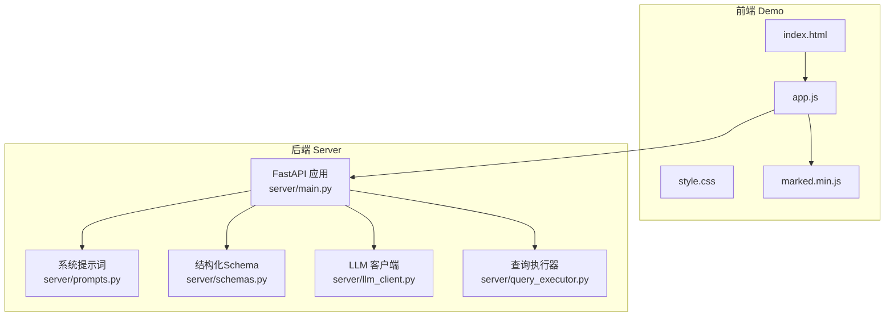
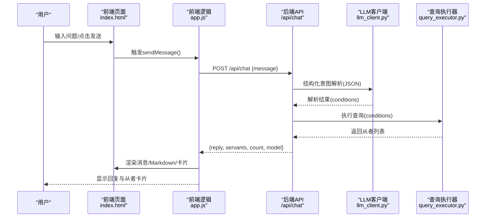
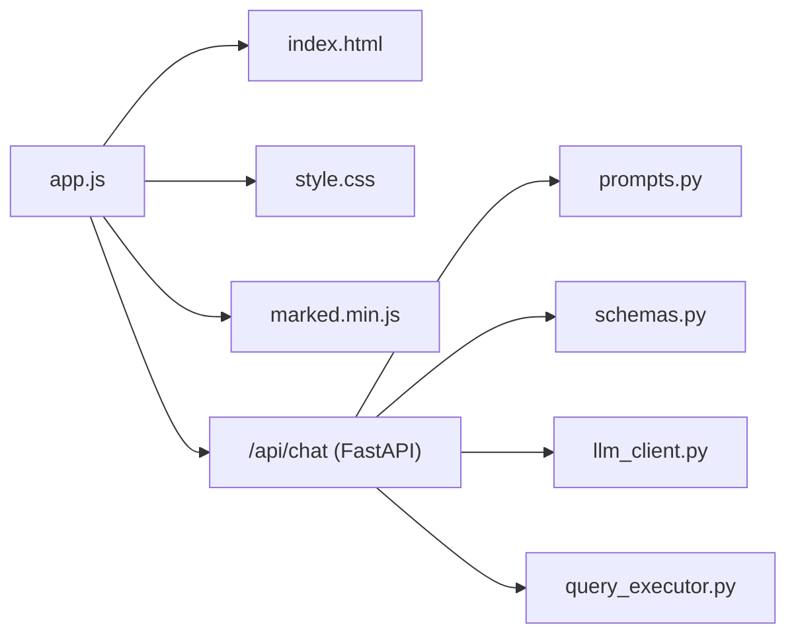

# 前端界面

<cite>
**本文引用的文件**
- [index.html](file://demo/index.html)
- [app.js](file://demo/app.js)
- [style.css](file://demo/style.css)
- [marked.min.js](file://demo/marked.min.js)
- [package.json](file://demo/package.json)
- [main.py](file://server/main.py)
- [prompts.py](file://server/prompts.py)
- [schemas.py](file://server/schemas.py)
- [llm_client.py](file://server/llm_client.py)
- [query_executor.py](file://server/query_executor.py)
</cite>

## 目录
1. [简介](#简介)
2. [项目结构](#项目结构)
3. [核心组件](#核心组件)
4. [架构总览](#架构总览)
5. [组件详解](#组件详解)
6. [依赖关系分析](#依赖关系分析)
7. [性能考量](#性能考量)
8. [故障排查指南](#故障排查指南)
9. [结论](#结论)
10. [附录](#附录)

## 简介
本文件面向Laplace前端界面，聚焦聊天交互体验与实现细节，覆盖设计理念、用户体验与交互模式、JavaScript实现、实时通信与响应处理机制、Markdown渲染与样式定制、跨浏览器兼容性、组件状态管理、动画与过渡设计、响应式布局与无障碍支持、性能优化与最佳实践。文档同时给出与后端FastAPI服务的集成流程与数据契约说明，便于开发者快速理解与扩展。

## 项目结构
前端Demo位于demo目录，采用静态HTML+CSS+JS的单页应用形式，通过本地HTTP服务挂载；后端服务位于server目录，提供REST API与LLM对接、查询执行与RAG生成。

图表来源
- [index.html:1-72](file://demo/index.html#L1-L72)
- [app.js:1-219](file://demo/app.js#L1-L219)
- [style.css:1-544](file://demo/style.css#L1-L544)
- [marked.min.js:1-7](file://demo/marked.min.js#L1-L7)
- [main.py:1-228](file://server/main.py#L1-L228)
- [prompts.py:1-208](file://server/prompts.py#L1-L208)
- [schemas.py:1-81](file://server/schemas.py#L1-L81)
- [llm_client.py:1-247](file://server/llm_client.py#L1-L247)
- [query_executor.py:1-305](file://server/query_executor.py#L1-L305)

章节来源
- [index.html:1-72](file://demo/index.html#L1-L72)
- [app.js:1-219](file://demo/app.js#L1-L219)
- [style.css:1-544](file://demo/style.css#L1-L544)
- [main.py:1-228](file://server/main.py#L1-L228)

## 核心组件
- 页面骨架与布局：头部、聊天消息区、输入区与底部信息。
- 交互逻辑：发送消息、渲染用户/助手消息、打字指示器、建议按钮、滚动至底部。
- Markdown渲染：使用marked库进行富文本渲染，回退到安全转义。
- 样式系统：基于CSS自定义属性的主题变量、网格卡片布局、动画与过渡、响应式断点。
- 后端集成：通过fetch调用后端/chat接口，接收结构化响应并渲染从者卡片。

章节来源
- [index.html:13-71](file://demo/index.html#L13-L71)
- [app.js:29-123](file://demo/app.js#L29-L123)
- [style.css:6-544](file://demo/style.css#L6-L544)

## 架构总览
前端通过app.js与后端FastAPI服务交互，后端完成两阶段处理：意图解析（JSON Schema）与RAG生成，最终返回包含回复文本与从者列表的结构化响应。前端负责渲染消息、Markdown与卡片，并提供流畅的交互反馈。

图表来源
- [app.js:30-74](file://demo/app.js#L30-L74)
- [main.py:87-218](file://server/main.py#L87-L218)
- [llm_client.py:35-126](file://server/llm_client.py#L35-L126)
- [query_executor.py:53-87](file://server/query_executor.py#L53-L87)

## 组件详解

### 页面结构与布局
- 头部区域包含品牌标识与模型状态徽章，用于展示当前使用的模型名称。
- 聊天消息区采用flex布局，支持自动滚动至最新消息。
- 输入区包含文本框与发送按钮，支持回车发送与建议按钮点击填充。
- 底部信息包含数据来源链接，增强透明度。

章节来源
- [index.html:14-67](file://demo/index.html#L14-L67)
- [style.css:84-544](file://demo/style.css#L84-L544)

### 交互与状态管理
- 状态标志isProcessing控制并发发送与按钮禁用，避免重复提交。
- 发送消息流程：清空输入、渲染用户消息、显示打字指示器、发起fetch请求、移除打字指示器、更新模型徽章、渲染助手回复与卡片。
- 错误处理：捕获网络与解析异常，显示友好提示并恢复交互状态。
- 自动滚动：使用requestAnimationFrame确保DOM更新后再滚动到底部。

章节来源
- [app.js:26-74](file://demo/app.js#L26-L74)
- [app.js:191-195](file://demo/app.js#L191-L195)

### Markdown渲染与样式定制
- 渲染策略：若marked可用则解析Markdown，否则回退到安全转义的p标签包裹文本。
- 样式系统：通过CSS自定义属性统一主题色、阴影、圆角、字体与间距；消息气泡、列表、标题、强调等元素均有专门样式。
- 卡片网格：使用CSS Grid实现自适应列数，支持移动端单列布局。
- 动画与过渡：消息与卡片入场动画、打字指示器动画、输入框焦点与悬停过渡。

章节来源
- [app.js:108-123](file://demo/app.js#L108-L123)
- [style.css:218-544](file://demo/style.css#L218-L544)

### 从者卡片渲染
- 卡片字段：头像、名称、星级、职阶、自充百分比或组合表达。
- 图片容错：图片加载失败时回退为内联SVG占位。
- 动画延迟：卡片按索引递增延迟入场，营造分批出现的视觉节奏。
- 边框与稀有度：根据星级设置不同边框颜色与阴影。

章节来源
- [app.js:125-156](file://demo/app.js#L125-L156)
- [style.css:288-391](file://demo/style.css#L288-L391)

### 建议按钮与快捷入口
- 建议按钮集合：提供常见查询模板，点击即填充输入并自动发送。
- 交互事件：通过document级click监听处理chip点击，提升引导效率。

章节来源
- [index.html:41-46](file://demo/index.html#L41-L46)
- [app.js:208-213](file://demo/app.js#L208-L213)

### 实时通信与响应处理机制
- 前端：使用fetch发起POST请求，设置超时与错误处理，成功后解析JSON并更新UI。
- 后端：FastAPI路由/api/chat接收消息，调用LLM客户端进行意图解析，再执行查询，最后返回结构化响应。
- 数据契约：前端期望reply、servants、count、model等字段；后端ChatResponse模型严格定义这些字段。

章节来源
- [app.js:44-74](file://demo/app.js#L44-L74)
- [main.py:66-79](file://server/main.py#L66-L79)
- [main.py:87-218](file://server/main.py#L87-L218)

### 动画效果与过渡设计
- 消息入场：淡入+轻微位移动画，增强阅读节奏。
- 卡片入场：淡入+微位移，配合延迟序列，形成有序出现。
- 打字指示器：三点弹跳动画，强调“正在思考”状态。
- 输入框与按钮：悬停缩放与发光阴影，激活态按压反馈，禁用态半透明。

章节来源
- [style.css:184-187](file://demo/style.css#L184-L187)
- [style.css:308-311](file://demo/style.css#L308-L311)
- [style.css:410-413](file://demo/style.css#L410-L413)
- [style.css:468-482](file://demo/style.css#L468-L482)

### 响应式设计指南
- 断点：768px以下调整消息区内外边距、消息最大宽度、卡片网格为单列。
- 滚动条：自定义浅色轨道与悬停高亮，提升暗色主题下的可视性。
- 交互尺寸：输入区高度、按钮尺寸、间距均使用变量，便于统一调整。

章节来源
- [style.css:526-543](file://demo/style.css#L526-L543)

### 无障碍访问支持
- 文本对比度：主题色与文本色搭配保证可读性。
- 键盘交互：输入框支持回车发送，建议按钮具备可点击语义。
- 屏幕阅读器友好：语义化HTML结构，图标使用语义化字符而非装饰性图片。
- 焦点可见性：输入框聚焦时边框高亮，按钮悬停与激活状态清晰可辨。

章节来源
- [index.html:14-67](file://demo/index.html#L14-L67)
- [style.css:445-447](file://demo/style.css#L445-L447)

### 跨浏览器兼容性
- CSS变量：现代浏览器广泛支持，配合降级策略（如内联SVG占位）。
- Flexbox/Grid：主流浏览器支持良好，移动端断点适配。
- Fetch API：现代浏览器原生支持，建议在需要时添加polyfill以兼容旧环境。
- 字体加载：通过预连接与CDN资源提升首屏渲染稳定性。

章节来源
- [index.html:8-11](file://demo/index.html#L8-L11)
- [app.js:142-144](file://demo/app.js#L142-L144)

## 依赖关系分析

图表来源
- [app.js:1-219](file://demo/app.js#L1-L219)
- [index.html:1-72](file://demo/index.html#L1-L72)
- [style.css:1-544](file://demo/style.css#L1-L544)
- [marked.min.js:1-7](file://demo/marked.min.js#L1-L7)
- [main.py:1-228](file://server/main.py#L1-L228)
- [prompts.py:1-208](file://server/prompts.py#L1-L208)
- [schemas.py:1-81](file://server/schemas.py#L1-L81)
- [llm_client.py:1-247](file://server/llm_client.py#L1-L247)
- [query_executor.py:1-305](file://server/query_executor.py#L1-L305)

## 性能考量
- DOM更新与滚动：使用requestAnimationFrame确保在下一帧滚动，减少重排抖动。
- 图片懒加载：卡片头像使用loading="lazy"，降低初始渲染压力。
- Markdown解析：仅在marked可用时启用，避免不必要的解析开销。
- 限流与去抖：isProcessing避免重复请求，提升交互稳定性。
- 响应大小控制：后端限制返回卡片数量上限，前端亦限制渲染数量，避免长列表导致的性能问题。
- 主题变量：集中管理颜色与尺寸，减少重复计算与样式切换成本。

章节来源
- [app.js:191-195](file://demo/app.js#L191-L195)
- [app.js:142-144](file://demo/app.js#L142-L144)
- [main.py:207-218](file://server/main.py#L207-L218)

## 故障排查指南
- 后端未启动：前端会收到错误提示，确认后端服务已运行并监听8000端口。
- CORS问题：后端已开启CORS，若仍跨域失败，检查前端请求域名与后端允许范围。
- LLM不可用：LLM客户端具备主备模型与降级逻辑，若全部失败，后端返回错误提示。
- Markdown渲染异常：若marked未正确加载，前端会回退到安全转义渲染。
- 卡片图片加载失败：前端已内置SVG占位，确保卡片可正常显示。

章节来源
- [app.js:66-73](file://demo/app.js#L66-L73)
- [main.py:57-63](file://server/main.py#L57-L63)
- [llm_client.py:60-78](file://server/llm_client.py#L60-L78)
- [app.js:142-144](file://demo/app.js#L142-L144)

## 结论
Laplace前端界面以简洁、深色、科技感为主题，围绕“对话—查询—展示”的闭环交互展开。通过结构化的前后端协作、Markdown渲染与卡片网格展示，实现了高效的信息传达与良好的用户体验。建议在后续迭代中进一步完善错误边界与可访问性细节，并考虑引入更完善的动画与过渡体系以增强沉浸感。

## 附录

### 数据契约与字段说明
- 前端期望后端返回字段：reply（字符串）、servants（从者数组）、count（总数）、model（模型名）。
- 后端ChatResponse模型严格定义上述字段，确保前后端一致性。

章节来源
- [main.py:71-79](file://server/main.py#L71-L79)
- [app.js:53-64](file://demo/app.js#L53-L64)

### 后端两阶段处理流程
- 第一阶段：LLM结构化意图解析，提取查询条件。
- 第二阶段：RAG生成自然语言回复，结合检索结果上下文。

章节来源
- [main.py:87-218](file://server/main.py#L87-L218)
- [prompts.py:175-207](file://server/prompts.py#L175-L207)