# 前端界面

<cite>
**本文档引用的文件**
- [index.html](file://demo/index.html)
- [app.js](file://demo/app.js)
- [style.css](file://demo/style.css)
- [marked.min.js](file://demo/marked.min.js)
- [package.json](file://demo/package.json)
- [package-lock.json](file://demo/package-lock.json)
- [servants_np_charge.json](file://demo/data/servants_np_charge.json)
- [README.md](file://README.md)
</cite>

## 目录
1. [引言](#引言)
2. [项目结构](#项目结构)
3. [核心组件](#核心组件)
4. [架构概览](#架构概览)
5. [详细组件分析](#详细组件分析)
6. [依赖关系分析](#依赖关系分析)
7. [性能考虑](#性能考虑)
8. [故障排除指南](#故障排除指南)
9. [结论](#结论)
10. [附录](#附录)

## 引言

Laplace是一个AI原生的对话式FGO数据助手，采用HTML、CSS和JavaScript构建的轻量级前端界面。该界面实现了自然语言对话交互，用户可以通过简单的文本输入与AI助手进行交互，获取FGO游戏数据的智能查询结果。

该项目的核心设计理念是"零学习成本"的对话式交互体验，用户无需掌握复杂的筛选UI，只需用自然语言提问即可获得精确的游戏数据。前端界面采用了现代化的设计系统，结合FGO主题元素，提供了沉浸式的用户体验。

## 项目结构

Laplace前端界面采用极简的单页应用架构，所有资源都位于demo目录中：

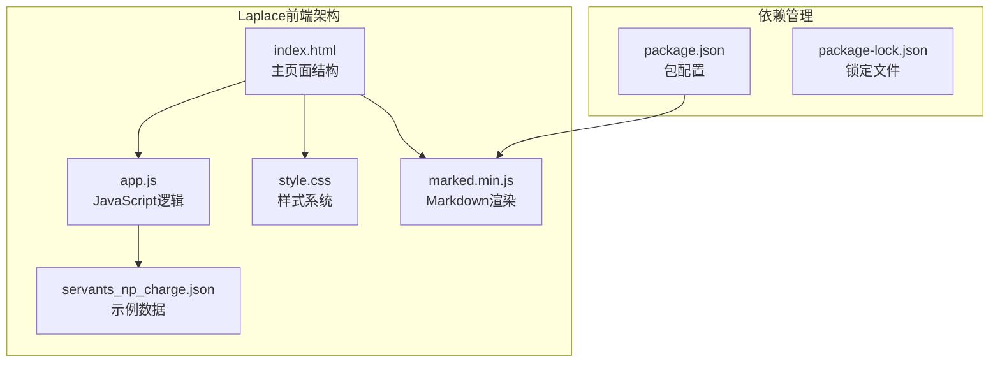

**图表来源**
- [index.html:1-72](file://demo/index.html#L1-L72)
- [app.js:1-219](file://demo/app.js#L1-L219)
- [style.css:1-544](file://demo/style.css#L1-L544)

**章节来源**
- [index.html:1-72](file://demo/index.html#L1-L72)
- [app.js:1-219](file://demo/app.js#L1-L219)
- [style.css:1-544](file://demo/style.css#L1-L544)
- [package.json:1-6](file://demo/package.json#L1-L6)

## 核心组件

### 1. 聊天界面组件

前端界面由三个主要区域组成：

- **头部区域**：包含Logo、标语和模型状态指示器
- **聊天消息区域**：显示用户和AI助手的消息历史
- **输入区域**：包含文本输入框和发送按钮

### 2. 主题系统

界面采用深色主题设计，融合了FGO游戏元素：

- **主色调**：深蓝色背景 (#0a0b1a)
- **强调色**：金色 (#d4a843) 和紫色 (#8b5cf6)
- **字体系统**：Noto Sans SC (正文) 和 Orbitron (标题)

### 3. 响应式设计

界面针对移动设备进行了优化，支持768px以下屏幕尺寸的自适应布局。

**章节来源**
- [index.html:14-67](file://demo/index.html#L14-L67)
- [style.css:6-57](file://demo/style.css#L6-L57)
- [style.css:526-544](file://demo/style.css#L526-L544)

## 架构概览

Laplace前端采用客户端-服务器架构，通过HTTP请求与后端API进行通信：

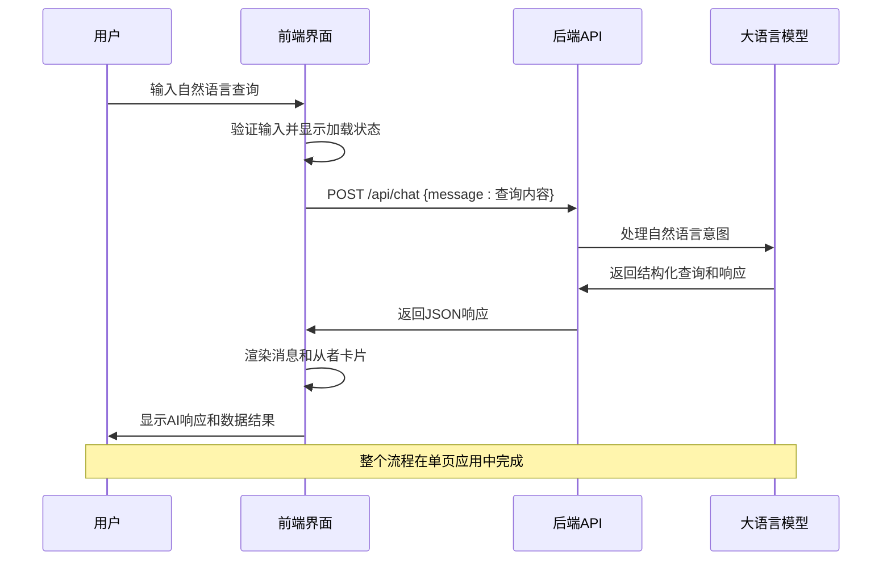

**图表来源**
- [app.js:29-74](file://demo/app.js#L29-L74)
- [app.js:44-64](file://demo/app.js#L44-L64)

## 详细组件分析

### 1. HTML结构设计

#### 页面骨架
页面采用语义化的HTML5结构，包含完整的文档结构：

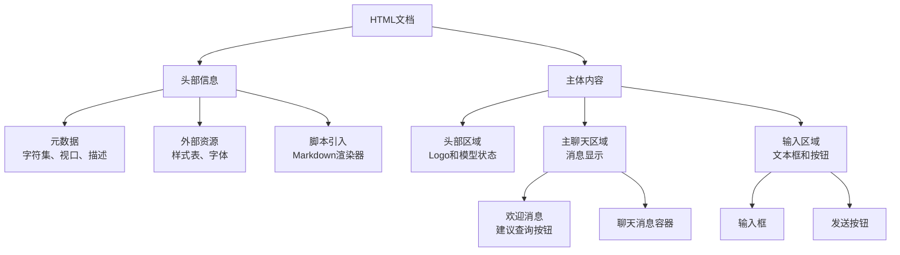

**图表来源**
- [index.html:13-71](file://demo/index.html#L13-L71)

#### 消息系统结构
消息采用统一的结构模式，支持用户消息和AI助手消息：

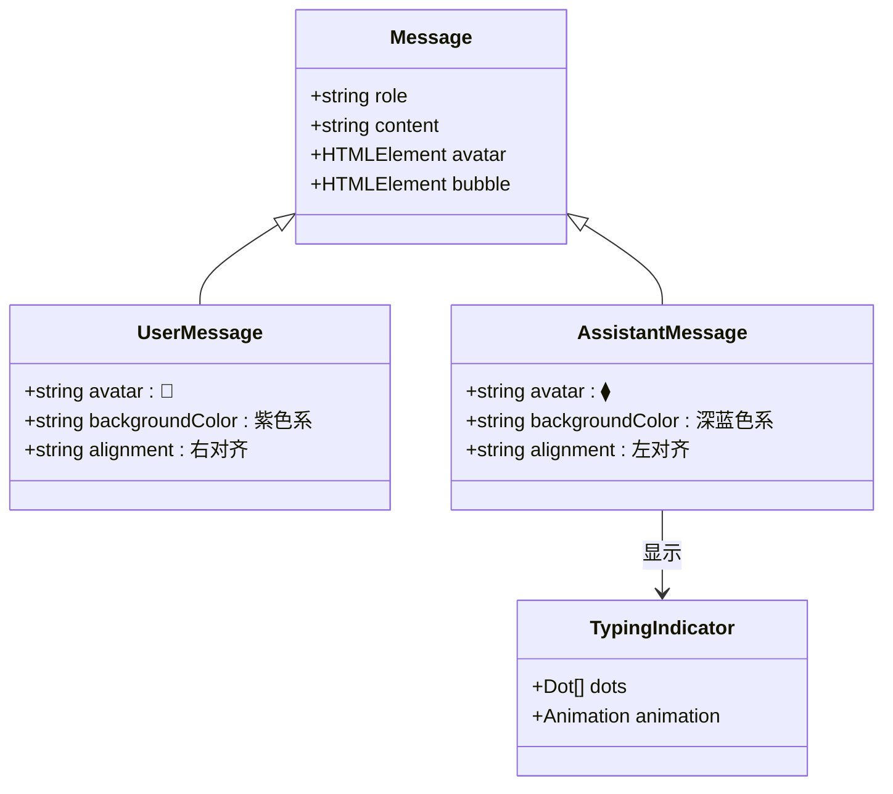

**图表来源**
- [index.html:34-49](file://demo/index.html#L34-L49)
- [app.js:76-94](file://demo/app.js#L76-L94)
- [app.js:158-177](file://demo/app.js#L158-L177)

**章节来源**
- [index.html:14-67](file://demo/index.html#L14-L67)

### 2. JavaScript实现核心功能

#### 消息发送和接收机制
前端通过异步函数处理消息的发送和接收：

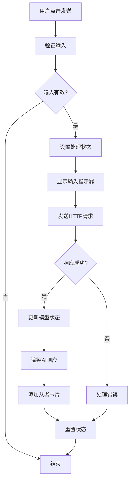

**图表来源**
- [app.js:29-74](file://demo/app.js#L29-L74)
- [app.js:44-64](file://demo/app.js#L44-L64)

#### 从者卡片渲染系统
AI助手可以返回多个从者数据，前端会动态生成卡片网格：

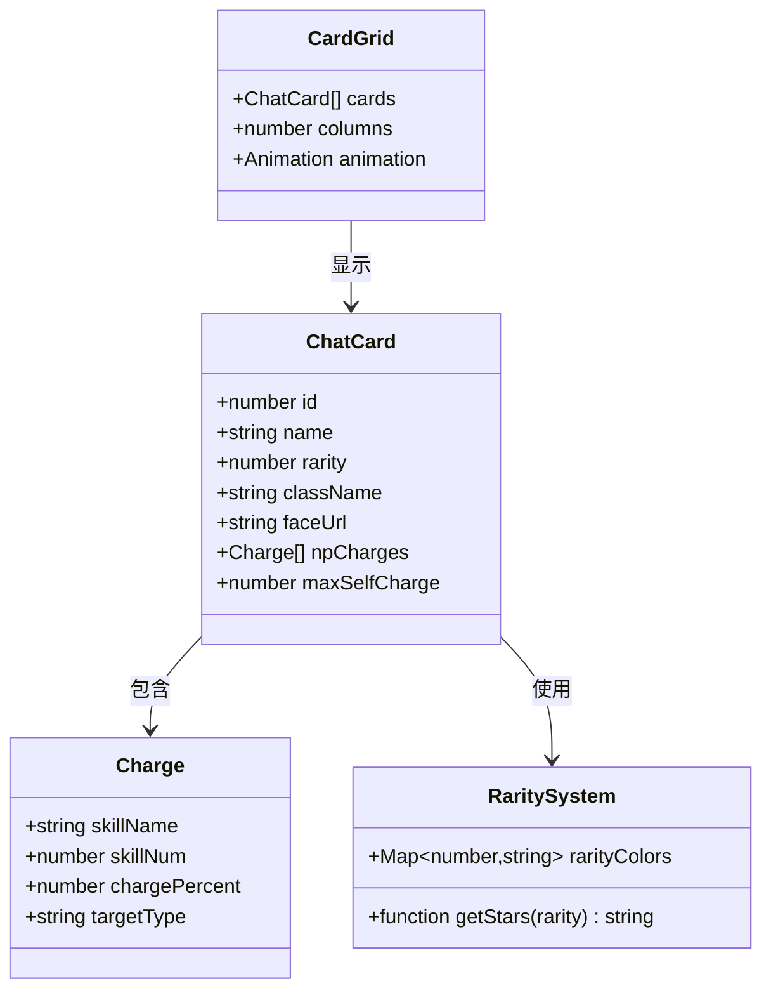

**图表来源**
- [app.js:125-156](file://demo/app.js#L125-L156)
- [app.js:180-183](file://demo/app.js#L180-L183)

#### 事件处理机制
前端采用事件驱动的交互模式：

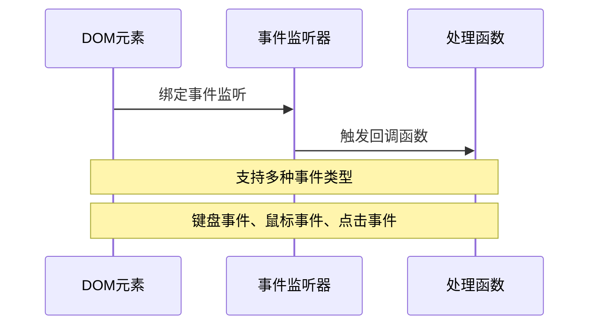

**图表来源**
- [app.js:197-218](file://demo/app.js#L197-L218)

**章节来源**
- [app.js:29-74](file://demo/app.js#L29-L74)
- [app.js:96-123](file://demo/app.js#L96-L123)
- [app.js:125-156](file://demo/app.js#L125-L156)
- [app.js:197-218](file://demo/app.js#L197-L218)

### 3. CSS样式系统

#### 设计系统架构
界面采用CSS自定义属性构建完整的设计系统：

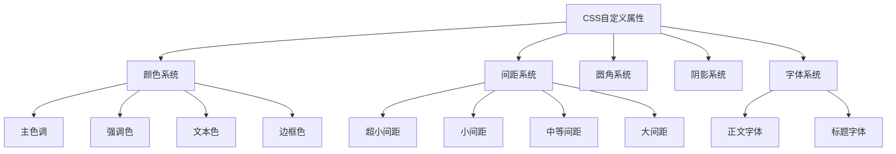

**图表来源**
- [style.css:6-57](file://demo/style.css#L6-L57)

#### 响应式布局系统
针对不同屏幕尺寸的自适应设计：

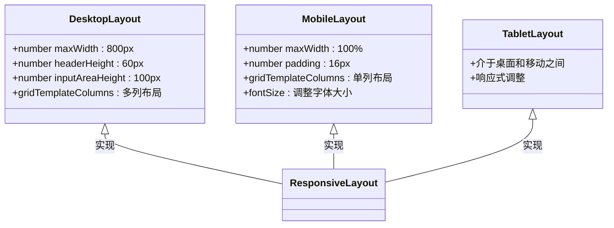

**图表来源**
- [style.css:526-544](file://demo/style.css#L526-L544)

**章节来源**
- [style.css:6-57](file://demo/style.css#L6-L57)
- [style.css:526-544](file://demo/style.css#L526-L544)

### 4. Markdown渲染功能

#### Markdown集成架构
前端集成了Marked.js库来支持Markdown渲染：

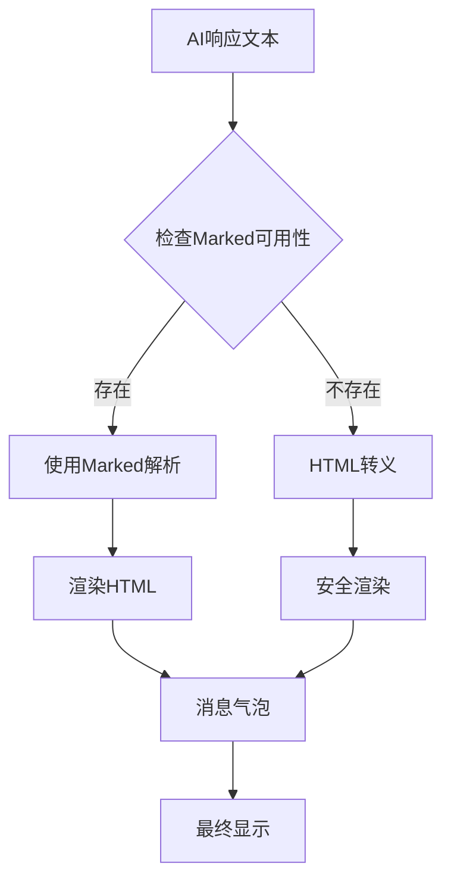

**图表来源**
- [app.js:108-110](file://demo/app.js#L108-L110)
- [marked.min.js:1-7](file://demo/marked.min.js#L1-L7)

#### Markdown语法支持
支持标准的Markdown语法，包括：
- 标题、段落、列表
- 粗体、斜体、删除线
- 链接、图片
- 代码块、表格

**章节来源**
- [app.js:108-110](file://demo/app.js#L108-L110)
- [marked.min.js:1-7](file://demo/marked.min.js#L1-L7)

## 依赖关系分析

### 1. 外部依赖管理

前端项目使用npm管理依赖，目前只依赖Marked.js库：

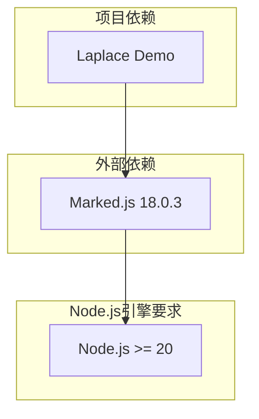

**图表来源**
- [package.json:1-6](file://demo/package.json#L1-L6)
- [package-lock.json:11-22](file://demo/package-lock.json#L11-L22)

### 2. 内部模块依赖

前端模块之间的依赖关系相对简单，主要体现在文件间的引用关系：

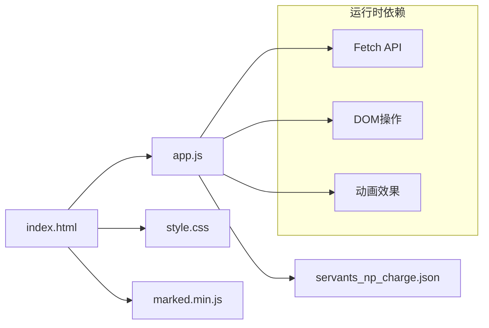

**图表来源**
- [index.html:10](file://demo/index.html#L10)
- [index.html:69](file://demo/index.html#L69)
- [app.js:44-49](file://demo/app.js#L44-L49)

**章节来源**
- [package.json:1-6](file://demo/package.json#L1-L6)
- [package-lock.json:1-25](file://demo/package-lock.json#L1-L25)

## 性能考虑

### 1. 加载性能优化

- **资源预连接**：通过`<link rel="preconnect">`预连接Google Fonts
- **懒加载图片**：从者头像使用`loading="lazy"`属性
- **CSS变量缓存**：使用CSS自定义属性减少重复计算

### 2. 运行时性能优化

- **请求动画帧**：使用`requestAnimationFrame`优化滚动性能
- **防抖处理**：避免重复提交相同请求
- **渐进式渲染**：消息和卡片采用渐进式动画效果

### 3. 内存管理

- **事件监听器清理**：合理管理DOM事件绑定
- **DOM节点复用**：避免频繁创建和销毁DOM元素
- **垃圾回收友好**：避免循环引用和闭包泄漏

## 故障排除指南

### 1. 常见问题诊断

#### 网络请求问题
- **症状**：发送按钮禁用，无响应
- **原因**：后端API不可用或跨域问题
- **解决方案**：检查后端服务状态，确认API端点可达

#### Markdown渲染问题
- **症状**：AI响应未正确渲染，显示原始Markdown
- **原因**：Marked.js库加载失败
- **解决方案**：检查网络连接，重新加载页面

#### 图片加载问题
- **症状**：从者头像显示问号图标
- **原因**：图片URL无效或网络问题
- **解决方案**：检查图片链接，确认服务器可达

### 2. 调试工具使用

#### 浏览器开发者工具
- **Network面板**：监控API请求和响应
- **Console面板**：查看JavaScript错误和警告
- **Elements面板**：检查DOM结构和样式应用

#### 性能分析
- **Performance面板**：分析页面渲染性能
- **Memory面板**：检测内存泄漏
- **Lighthouse**：评估Web应用质量

**章节来源**
- [app.js:66-73](file://demo/app.js#L66-L73)

## 结论

Laplace前端界面展现了现代Web应用的最佳实践，通过简洁的架构设计实现了强大的功能。界面采用深色主题和FGO元素相结合的设计风格，提供了优秀的视觉体验。

该界面的主要优势包括：
- **简洁直观**：零学习成本的对话式交互
- **响应迅速**：优化的性能和流畅的动画效果
- **主题丰富**：完整的CSS设计系统和响应式布局
- **扩展性强**：模块化的代码结构便于功能扩展

未来可以考虑的功能增强包括：
- WebSocket连接支持实时双向通信
- 更丰富的Markdown语法支持
- 离线缓存机制
- 多语言支持

## 附录

### 1. 浏览器兼容性

#### 支持的浏览器版本
- Chrome 80+
- Firefox 74+
- Safari 13+
- Edge 80+

#### 不支持的特性
- IE浏览器
- 旧版移动浏览器

### 2. 移动端适配策略

#### 触摸友好的交互
- 按钮尺寸优化：最小44px触摸目标
- 触摸反馈：点击状态和激活状态
- 虚拟键盘适配：输入框位置调整

#### 屏幕尺寸适配
- 最小宽度：320px
- 最大宽度：800px
- 断点：768px
- 字体缩放：根据屏幕密度调整

### 3. 界面定制指南

#### 主题定制
1. 修改CSS自定义属性值
2. 更新颜色系统映射
3. 调整字体和间距参数

#### 功能扩展
1. 添加新的消息类型
2. 扩展Markdown语法支持
3. 集成更多第三方库

#### 响应式设计
1. 添加新的断点
2. 调整网格布局
3. 优化触摸交互