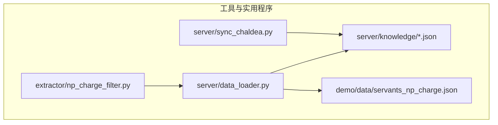
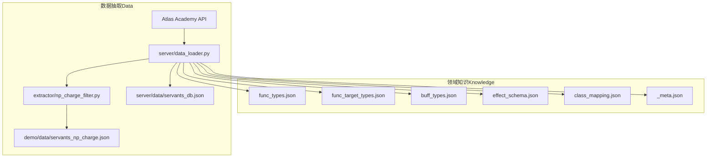
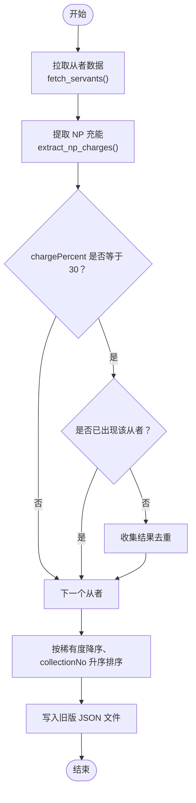
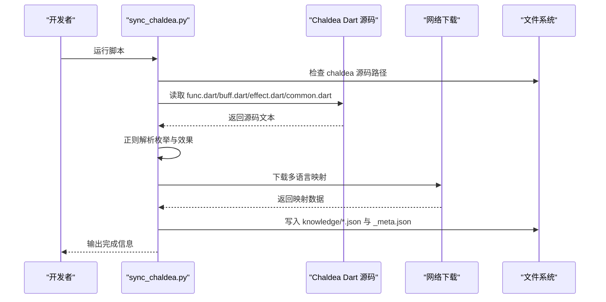
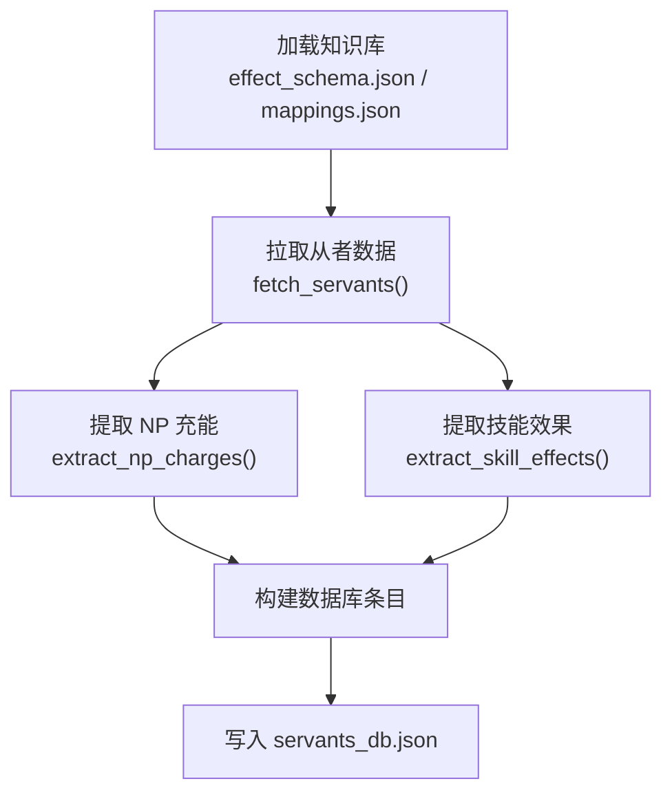
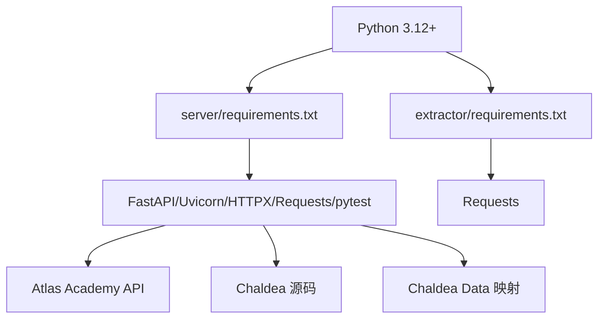

# 工具与实用程序

<cite>
**本文引用的文件**
- [np_charge_filter.py](file://extractor/np_charge_filter.py)
- [sync_chaldea.py](file://server/sync_chaldea.py)
- [data_loader.py](file://server/data_loader.py)
- [requirements.txt（抽取器）](file://extractor/requirements.txt)
- [requirements.txt（服务端）](file://server/requirements.txt)
- [servants_np_charge.json](file://demo/data/servants_np_charge.json)
- [README.md](file://README.md)
- [test_sync_chaldea.py](file://tests/test_sync_chaldea.py)
- [_meta.json（知识库元数据）](file://server/knowledge/_meta.json)
</cite>

## 目录
1. [简介](#简介)
2. [项目结构](#项目结构)
3. [核心组件](#核心组件)
4. [架构总览](#架构总览)
5. [详细组件分析](#详细组件分析)
6. [依赖分析](#依赖分析)
7. [性能考量](#性能考量)
8. [故障排查指南](#故障排查指南)
9. [结论](#结论)
10. [附录](#附录)

## 简介
本章节面向项目维护者与使用者，系统化说明两类工具与实用程序：
- NP 充能筛选器：用于筛选“精确 30% 自充”的从者，支持批量数据处理与旧格式输出，已迁移至新架构并保留向后兼容。
- Chaldea 同步脚本：从 Chaldea Dart 源码中解析枚举与效果分类，生成 JSON 知识库，支撑 LLM 的意图解析与查询执行。

同时提供安装配置、使用示例、扩展与定制选项、命令行参数与配置文件格式、最佳实践与注意事项，以及在项目维护中的作用与价值。

## 项目结构
围绕工具与实用程序的关键目录与文件如下：
- extractor/np_charge_filter.py：NP 充能筛选器（旧版包装器，复用 data_loader 的能力）
- server/sync_chaldea.py：Chaldea 同步脚本（领域知识镜像）
- server/data_loader.py：通用从者数据加载器（核心数据提取与构建）
- server/knowledge/*：由同步脚本生成的知识库 JSON
- demo/data/servants_np_charge.json：NP 充能筛选器的旧格式输出样例
- tests/test_sync_chaldea.py：同步脚本的单元测试
- server/requirements.txt 与 extractor/requirements.txt：依赖清单

**图表来源**
- [np_charge_filter.py:1-115](file://extractor/np_charge_filter.py#L1-L115)
- [sync_chaldea.py:1-429](file://server/sync_chaldea.py#L1-L429)
- [data_loader.py:1-363](file://server/data_loader.py#L1-L363)

**章节来源**
- [README.md:104-131](file://README.md#L104-L131)

## 核心组件
- NP 充能筛选器（extractor/np_charge_filter.py）
  - 目标：筛选“精确 30% 自充”的从者，按稀有度降序、collectionNo 升序排序，输出旧版 JSON。
  - 数据来源：复用 server/data_loader 的 fetch_servants 与 extract_np_charges。
  - 输出：demo/data/servants_np_charge.json（向后兼容）。
- Chaldea 同步脚本（server/sync_chaldea.py）
  - 目标：从 Chaldea Dart 源码解析枚举与效果分类，生成 JSON 知识库。
  - 输出：server/knowledge/ 下的多个 JSON 文件，含 _meta.json 元数据。
- 通用数据加载器（server/data_loader.py）
  - 目标：从 Atlas Academy API 拉取全量从者数据，结合知识库提取技能效果，构建通用数据库。
  - 输出：server/data/servants_db.json。

**章节来源**
- [np_charge_filter.py:1-115](file://extractor/np_charge_filter.py#L1-L115)
- [sync_chaldea.py:1-429](file://server/sync_chaldea.py#L1-L429)
- [data_loader.py:1-363](file://server/data_loader.py#L1-L363)

## 架构总览
NP 充能筛选器与 Chaldea 同步脚本共同服务于“领域知识 + 数据抽取”的双轴架构：
- 领域知识（Knowledge）：由 sync_chaldea.py 生成，供 data_loader 与上层系统使用。
- 数据抽取（Data）：由 data_loader 从外部 API 拉取并构建通用数据库；np_charge_filter 复用其能力输出特定筛选结果。

**图表来源**
- [sync_chaldea.py:321-418](file://server/sync_chaldea.py#L321-L418)
- [data_loader.py:332-359](file://server/data_loader.py#L332-L359)
- [np_charge_filter.py:34-110](file://extractor/np_charge_filter.py#L34-L110)

## 详细组件分析

### NP 充能筛选器（Legacy Wrapper）
- 设计要点
  - 保持向后兼容：输出旧版 JSON 结构，便于历史前端或工具链使用。
  - 复用新架构：通过导入 server/data_loader 的函数完成数据拉取与筛选。
  - 精确匹配：仅保留“chargePercent == 30”的技能，按从者去重。
  - 排序规则：先按稀有度降序，再按 collectionNo 升序。
- 批量处理与格式转换
  - 批量：遍历所有从者，逐个提取技能中的 NP 充能效果。
  - 格式：将内部结构转换为旧版 query/servants/count 结构。
- 使用方法
  - 在项目根目录运行脚本，自动输出到 demo/data/servants_np_charge.json。
  - 若导入失败，提示在项目根目录运行。
- 输出样例
  - 参见 demo/data/servants_np_charge.json 的结构与字段。

**图表来源**
- [np_charge_filter.py:42-110](file://extractor/np_charge_filter.py#L42-L110)
- [data_loader.py:91-137](file://server/data_loader.py#L91-L137)

**章节来源**
- [np_charge_filter.py:1-115](file://extractor/np_charge_filter.py#L1-L115)
- [servants_np_charge.json:1-2055](file://demo/data/servants_np_charge.json#L1-L2055)

### Chaldea 同步脚本（Schema Mirror）
- 设计原则
  - 纯正则解析，不依赖 Dart SDK。
  - 幂等操作，重复运行覆盖旧文件。
  - 生成 _meta.json 追踪版本与文件统计。
- 解析流程
  - 解析 Dart 枚举：FuncType、FuncTargetType、BuffType、SvtClass。
  - 解析 SkillEffect 效果分类：从 effect.dart 提取静态字段与分类。
  - 下载多语言映射：svt_names.json、trait.json。
  - 写入知识库与元数据：_meta.json 记录同步时间、Chaldea 提交号与文件统计。
- 关键正则与模式
  - 枚举块匹配、枚举项捕获（name/value/label/baseClassId）。
  - Effect 分类列表与具体效果的多种构造形式。
  - 中文别名映射表，自动为效果添加 aliases_zh 字段。
- 使用方法
  - 确保 chaldea-center/chaldea 存在（或设置 CHALDEA_SRC_PATH）。
  - 运行脚本生成 server/knowledge 下的 JSON 文件。
- 输出文件
  - func_types.json、func_target_types.json、buff_types.json、effect_schema.json、class_mapping.json、_meta.json。

**图表来源**
- [sync_chaldea.py:308-418](file://server/sync_chaldea.py#L308-L418)

**章节来源**
- [sync_chaldea.py:1-429](file://server/sync_chaldea.py#L1-L429)
- [_meta.json（知识库元数据）:1-12](file://server/knowledge/_meta.json#L1-L12)

### 通用数据加载器（Data Loader）
- 设计要点
  - 从 Atlas Academy API 拉取全量从者数据，过滤正常从者并保留 collectionNo > 0。
  - 基于 effect_schema.json 构建效果匹配索引，提取技能与宝具的效果。
  - 构建通用数据库，包含 NP 充能统计、卡色构成、宝具目标与效果等。
- 关键函数
  - fetch_servants：拉取并过滤从者。
  - extract_np_charges：提取 NP 充能效果（Lv.10 值）。
  - extract_skill_effects：提取技能效果并进行二次精炼（避免卡色通用枚举污染）。
  - build_database：汇总构建通用数据库条目。
- 输出
  - server/data/servants_db.json（通用数据库）。

**图表来源**
- [data_loader.py:332-359](file://server/data_loader.py#L332-L359)

**章节来源**
- [data_loader.py:1-363](file://server/data_loader.py#L1-L363)

## 依赖分析
- 运行环境与依赖
  - Python 3.12+（项目要求）
  - 服务端依赖：FastAPI、Uvicorn、HTTPX、python-dotenv、Requests、pytest
  - 抽取器依赖：Requests（>=2.31.0）
- 外部数据源
  - Atlas Academy API：提供从者全量数据。
  - Chaldea 源码：提供领域知识（Dart 枚举与效果定义）。
  - Chaldea Data：提供多语言映射（svt_names.json、trait.json）。
- 依赖关系图

**图表来源**
- [requirements.txt（服务端）:1-7](file://server/requirements.txt#L1-L7)
- [requirements.txt（抽取器）:1-2](file://extractor/requirements.txt#L1-L2)

**章节来源**
- [README.md:38-80](file://README.md#L38-L80)
- [requirements.txt（服务端）:1-7](file://server/requirements.txt#L1-L7)
- [requirements.txt（抽取器）:1-2](file://extractor/requirements.txt#L1-L2)

## 性能考量
- 网络请求超时与稳定性
  - Atlas Academy API 请求设置较长超时（>120s），避免偶发网络抖动导致失败。
- 数据规模与内存占用
  - 全量从者数据量较大，建议在本地磁盘充足、内存充足的环境中运行。
- 正则解析效率
  - 同步脚本采用纯正则解析 Dart 源码，对大文件解析需注意正则复杂度与匹配范围。
- 输出文件大小
  - effect_schema.json 含 55 个效果，class_mapping.json 含 78 个职阶，属于中等规模 JSON 文件，读写性能良好。

[本节为通用性能讨论，不直接分析具体文件，故无“章节来源”]

## 故障排查指南
- 同步脚本找不到 Chaldea 源码
  - 现象：提示未找到 chaldea 源码路径。
  - 处理：克隆 Chaldea 源码到 chaldea-center/chaldea，或设置 CHALDEA_SRC_PATH 指向自定义路径。
- 未生成知识库文件
  - 现象：缺少 knowledge/*.json 或 _meta.json。
  - 处理：确认同步脚本运行成功，检查 Dart 源码路径与文件是否存在。
- 数据加载器缺少知识库
  - 现象：提示 effect_schema.json 不存在。
  - 处理：先运行同步脚本生成知识库，再运行数据加载器。
- 抽取器导入失败
  - 现象：提示导入失败并建议在项目根目录运行。
  - 处理：确保在项目根目录执行脚本，使 sys.path 能正确导入 server/data_loader。
- 测试验证
  - 可参考 tests/test_sync_chaldea.py 的断言，验证同步脚本对 Dart 枚举与效果分类的解析正确性。

**章节来源**
- [sync_chaldea.py:313-318](file://server/sync_chaldea.py#L313-L318)
- [data_loader.py:44-52](file://server/data_loader.py#L44-L52)
- [np_charge_filter.py:22-27](file://extractor/np_charge_filter.py#L22-L27)
- [test_sync_chaldea.py:1-58](file://tests/test_sync_chaldea.py#L1-L58)

## 结论
- NP 充能筛选器通过复用新架构实现了向后兼容，简化了维护成本。
- Chaldea 同步脚本以纯正则方式稳定产出高质量领域知识，是 LLM 意图解析与查询执行的基础。
- 通用数据加载器将外部数据与领域知识整合，形成可扩展的通用数据库，支撑上层应用。
- 通过明确的依赖与运行环境要求、完善的测试与元数据追踪，工具链具备良好的可维护性与可扩展性。

[本节为总结性内容，不直接分析具体文件，故无“章节来源”]

## 附录

### 安装与配置
- 环境要求
  - Python 3.12+
- 安装步骤
  - 创建并激活虚拟环境。
  - 安装服务端依赖：pip install -r server/requirements.txt
  - 安装抽取器依赖：pip install -r extractor/requirements.txt
- 配置 API Key
  - 复制 .env.example 为 .env，并填入模型 API 密钥。
- 运行后端服务
  - python3 -m uvicorn server.main:app --reload
- 运行前端
  - 在浏览器中直接打开 demo/index.html 即可使用。

**章节来源**
- [README.md:42-61](file://README.md#L42-L61)

### 使用示例
- 同步领域知识
  - python3 server/sync_chaldea.py
- 生成通用数据库
  - python3 -m server.data_loader
- 生成 30% 自充筛选结果（向后兼容）
  - python3 extractor/np_charge_filter.py
- 运行测试
  - python -m pytest
  - 编译检查：python -m compileall -q server extractor
  - 实际 LLM JSON Schema smoke test：RUN_LIVE_LLM_TESTS=1 python -m pytest tests/test_llm_client_live.py -s

**章节来源**
- [README.md:63-100](file://README.md#L63-L100)

### 命令行参数与配置文件
- 命令行参数
  - 同步脚本：无显式命令行参数，通过路径与环境变量控制（如 CHALDEA_SRC_PATH）。
  - 数据加载器与筛选器：无命令行参数，行为由内部常量与配置决定。
- 配置文件
  - .env：存放模型 API 密钥等环境变量。
  - 知识库元数据：server/knowledge/_meta.json 记录同步时间、Chaldea 提交号与文件统计。

**章节来源**
- [README.md:52-57](file://README.md#L52-L57)
- [_meta.json（知识库元数据）:1-12](file://server/knowledge/_meta.json#L1-L12)

### 扩展与定制选项
- 自定义筛选条件
  - 在 np_charge_filter.py 中修改 TARGET_CHARGE_PERCENT 常量，即可切换目标自充百分比。
- 定制输出格式
  - 在 np_charge_filter.py 的输出段落调整输出字段与结构，以满足不同前端或工具链需求。
- 扩展领域知识
  - 在 sync_chaldea.py 中新增 Dart 源文件解析逻辑，或扩展正则以支持新的枚举/效果定义。
- 优化性能
  - 对大数据量场景，可在 data_loader.py 中增加分页或增量更新策略（需评估上游 API 支持情况）。

**章节来源**
- [np_charge_filter.py:29-31](file://extractor/np_charge_filter.py#L29-L31)
- [sync_chaldea.py:308-418](file://server/sync_chaldea.py#L308-L418)
- [data_loader.py:332-359](file://server/data_loader.py#L332-L359)

### 最佳实践与注意事项
- 先同步领域知识，再构建数据库，最后导出筛选结果，确保知识库最新。
- 在 CI/CD 中加入编译检查与回归测试，保障工具链稳定性。
- 对外发布或分享数据时，注意版权与合规声明（项目已注明来源与许可）。
- 当上游 API 或 Chaldea 源码发生变更时，及时更新知识库与数据抽取逻辑。

**章节来源**
- [README.md:77-85](file://README.md#L77-L85)