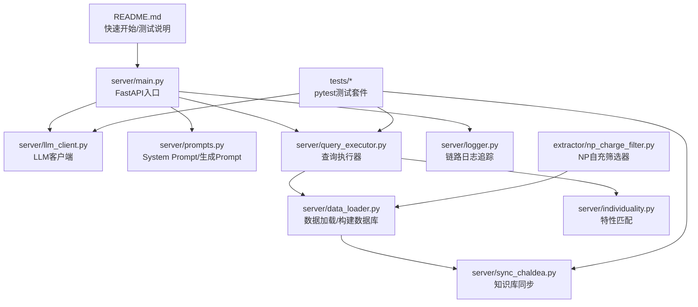
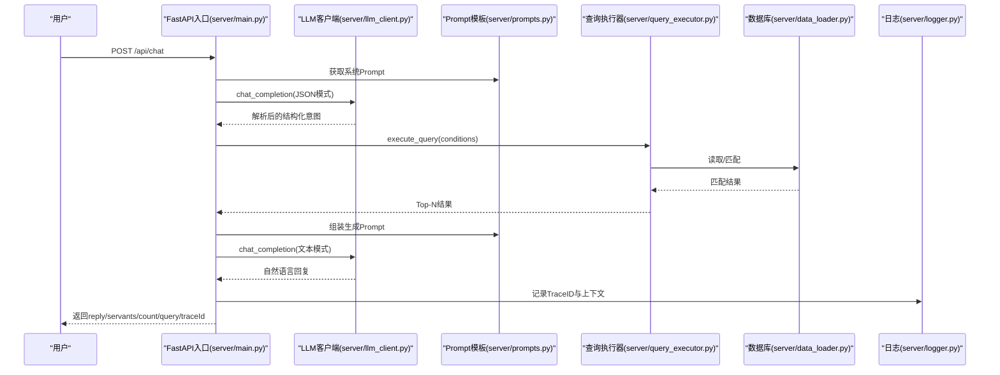
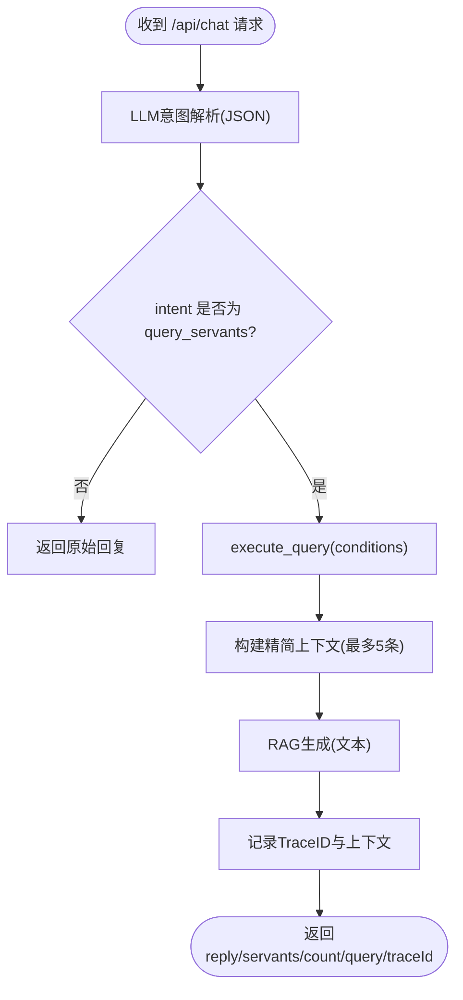
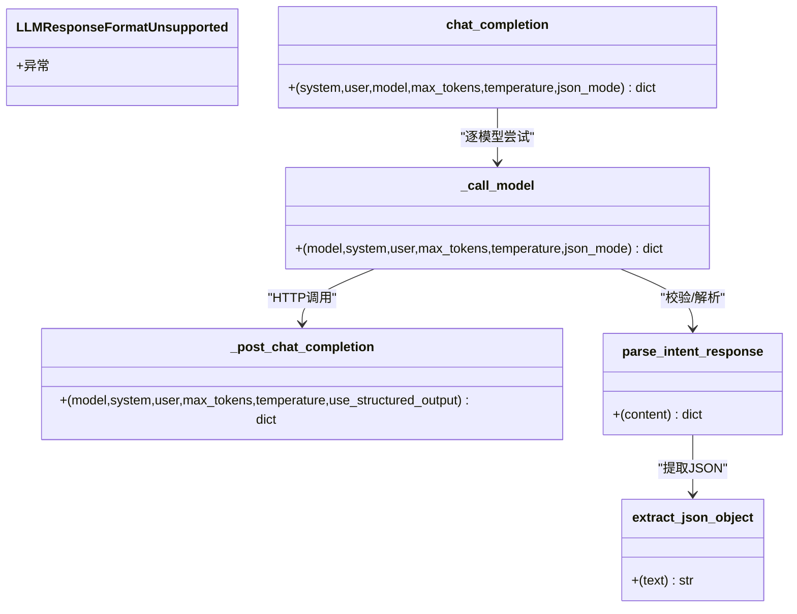
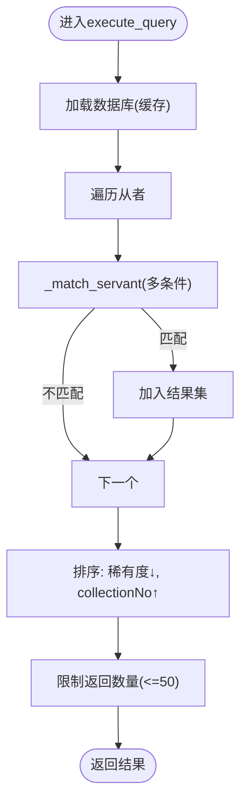
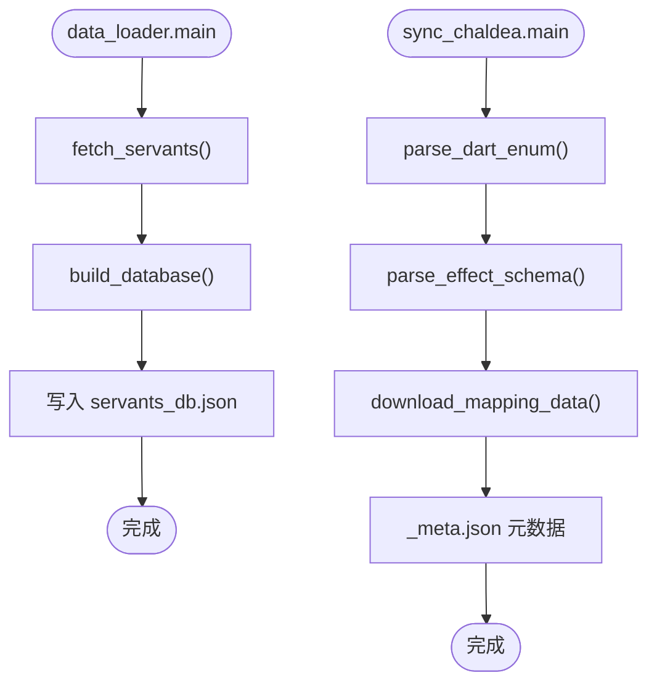
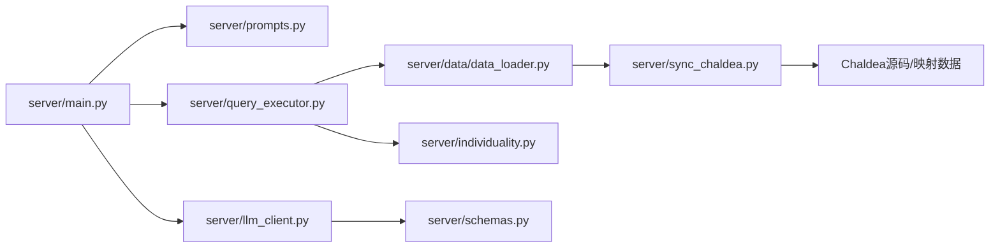

# 开发指南

<cite>
**本文引用的文件**
- [README.md](file://README.md)
- [server/main.py](file://server/main.py)
- [server/llm_client.py](file://server/llm_client.py)
- [server/prompts.py](file://server/prompts.py)
- [server/schemas.py](file://server/schemas.py)
- [server/query_executor.py](file://server/query_executor.py)
- [server/data_loader.py](file://server/data_loader.py)
- [server/sync_chaldea.py](file://server/sync_chaldea.py)
- [server/logger.py](file://server/logger.py)
- [server/individuality.py](file://server/individuality.py)
- [extractor/np_charge_filter.py](file://extractor/np_charge_filter.py)
- [tests/conftest.py](file://tests/conftest.py)
- [tests/test_llm_client.py](file://tests/test_llm_client.py)
- [tests/test_query_executor.py](file://tests/test_query_executor.py)
- [tests/test_sync_chaldea.py](file://tests/test_sync_chaldea.py)
</cite>

## 目录
1. [简介](#简介)
2. [项目结构](#项目结构)
3. [核心组件](#核心组件)
4. [架构总览](#架构总览)
5. [详细组件分析](#详细组件分析)
6. [依赖分析](#依赖分析)
7. [性能考虑](#性能考虑)
8. [故障排查指南](#故障排查指南)
9. [结论](#结论)
10. [附录](#附录)

## 简介
本指南面向Laplace项目的开发者，提供从代码规范、测试策略、开发流程到CI/CD与部署的全流程说明。Laplace以FastAPI提供REST API，结合两阶段RAG与Schema Mirror架构，将自然语言解析为结构化查询，再在预构建的从者数据库上执行筛选，最终以自然语言生成回复。

## 项目结构
- 顶层README提供快速开始、技术栈、项目结构与测试说明
- server目录为核心后端：API入口、LLM客户端、Prompt模板、意图解析Schema、查询执行器、数据加载与同步、日志追踪
- extractor目录提供独立的NP自充筛选工具
- tests目录提供pytest回归测试
- demo目录提供前端静态页面

图表来源
- [README.md:35-116](file://README.md#L35-L116)
- [server/main.py:1-228](file://server/main.py#L1-L228)
- [server/llm_client.py:1-247](file://server/llm_client.py#L1-L247)
- [server/prompts.py:1-208](file://server/prompts.py#L1-L208)
- [server/query_executor.py:1-305](file://server/query_executor.py#L1-L305)
- [server/data_loader.py:1-363](file://server/data_loader.py#L1-L363)
- [server/sync_chaldea.py:1-429](file://server/sync_chaldea.py#L1-L429)
- [server/logger.py:1-55](file://server/logger.py#L1-L55)
- [server/individuality.py:1-78](file://server/individuality.py#L1-L78)
- [extractor/np_charge_filter.py:1-191](file://extractor/np_charge_filter.py#L1-L191)

章节来源
- [README.md:35-116](file://README.md#L35-L116)

## 核心组件
- FastAPI入口与路由：负责CORS、启动预加载数据库、对外提供/chat与/health接口
- LLM客户端：统一调用与降级、结构化输出校验、响应格式探测
- Prompt模板：注入效果分类、中文映射与输出约束，保证LLM严格JSON
- 查询执行器：多条件AND/OR组合、昵称映射、特性匹配、排序与裁剪
- 数据加载与同步：从Atlas Academy抓取数据、基于effect_schema构建数据库；从Chaldea抽取领域知识
- 日志追踪：以TraceID记录完整链路，便于问题回溯
- NP自充筛选器：独立CLI工具，按30%自充精确筛选并输出JSON

章节来源
- [server/main.py:81-228](file://server/main.py#L81-L228)
- [server/llm_client.py:35-247](file://server/llm_client.py#L35-L247)
- [server/prompts.py:46-208](file://server/prompts.py#L46-L208)
- [server/query_executor.py:53-305](file://server/query_executor.py#L53-L305)
- [server/data_loader.py:332-363](file://server/data_loader.py#L332-L363)
- [server/sync_chaldea.py:308-429](file://server/sync_chaldea.py#L308-L429)
- [server/logger.py:38-55](file://server/logger.py#L38-L55)
- [extractor/np_charge_filter.py:125-191](file://extractor/np_charge_filter.py#L125-L191)

## 架构总览
Laplace采用“意图解析（JSON）+检索增强（RAG）+自然语言生成”的两阶段流程。系统通过Schema Mirror将Chaldea领域知识注入Prompt，确保LLM输出严格JSON并具备强约束；随后在预构建数据库上执行高效筛选，并以自然语言生成最终回复。

图表来源
- [server/main.py:87-218](file://server/main.py#L87-L218)
- [server/llm_client.py:35-127](file://server/llm_client.py#L35-L127)
- [server/prompts.py:175-208](file://server/prompts.py#L175-L208)
- [server/query_executor.py:53-87](file://server/query_executor.py#L53-L87)
- [server/logger.py:38-55](file://server/logger.py#L38-L55)

## 详细组件分析

### FastAPI入口与路由
- 启动事件预加载数据库
- /api/chat：两阶段处理（意图解析→RAG生成），返回回复、Top结果、查询条件与TraceID
- /api/health：健康检查
- 静态挂载demo目录，直接提供前端页面

图表来源
- [server/main.py:87-218](file://server/main.py#L87-L218)

章节来源
- [server/main.py:81-228](file://server/main.py#L81-L228)

### LLM客户端与JSON模式契约
- 支持主模型与备用模型轮询调用
- 优先使用response_format=json_schema；若网关不支持则自动降级为文本解析并提取JSON
- 使用Pydantic模型IntentResponse进行严格校验
- 错误处理：模型失败、响应格式不支持、JSON解析失败均抛出异常

图表来源
- [server/llm_client.py:35-247](file://server/llm_client.py#L35-L247)
- [server/schemas.py:68-81](file://server/schemas.py#L68-L81)

章节来源
- [server/llm_client.py:35-247](file://server/llm_client.py#L35-L247)
- [server/schemas.py:13-81](file://server/schemas.py#L13-L81)

### Prompt模板与效果注入
- 动态从knowledge目录加载effect_schema，生成效果分类清单
- 明确输出格式要求与字段说明，确保LLM严格返回JSON
- 提供示例与中文映射，降低歧义

章节来源
- [server/prompts.py:15-208](file://server/prompts.py#L15-L208)

### 查询执行器
- 多条件组合：NP自充、稀有度、职阶、名称、单/多效果、目标类型、特性、性别、阵营、配卡、宝具颜色与目标
- 支持AND/OR逻辑；名称支持昵称映射与规范化匹配
- 特性匹配支持必须拥有与排除（含负特性语义）
- 结果按稀有度降序、collectionNo升序排序，限制返回数量

图表来源
- [server/query_executor.py:53-87](file://server/query_executor.py#L53-L87)
- [server/query_executor.py:90-262](file://server/query_executor.py#L90-L262)

章节来源
- [server/query_executor.py:53-305](file://server/query_executor.py#L53-L305)
- [server/individuality.py:58-78](file://server/individuality.py#L58-L78)

### 数据加载与知识库同步
- data_loader：从Atlas Academy抓取全量从者，基于effect_schema提取技能效果与NP自充，构建通用数据库
- sync_chaldea：从Chaldea Dart源码抽取枚举与效果分类，生成JSON知识库，并下载多语言映射

图表来源
- [server/data_loader.py:332-363](file://server/data_loader.py#L332-L363)
- [server/sync_chaldea.py:308-429](file://server/sync_chaldea.py#L308-L429)

章节来源
- [server/data_loader.py:91-363](file://server/data_loader.py#L91-L363)
- [server/sync_chaldea.py:43-429](file://server/sync_chaldea.py#L43-L429)

### 日志追踪与调试
- 以TraceID贯穿一次查询的意图解析、检索与生成阶段
- 采用JSONL格式记录，便于后续分析与回放

章节来源
- [server/logger.py:38-55](file://server/logger.py#L38-L55)

### NP自充筛选器
- 独立CLI工具，精确筛选30%自充从者，输出JSON
- 适合作为演示数据或离线验证

章节来源
- [extractor/np_charge_filter.py:125-191](file://extractor/np_charge_filter.py#L125-L191)

## 依赖分析
- 组件内聚与耦合
  - main.py依赖prompts、llm_client、query_executor、logger，形成清晰的控制流
  - query_executor依赖data目录数据库与knowledge目录昵称映射
  - llm_client依赖schemas进行JSON模式校验
  - data_loader依赖knowledge目录的effect_schema
  - sync_chaldea依赖外部Chaldea源码与远程映射数据
- 外部依赖
  - FastAPI、httpx、pydantic、requests、pytest等

图表来源
- [server/main.py:14-18](file://server/main.py#L14-L18)
- [server/llm_client.py:16-19](file://server/llm_client.py#L16-L19)
- [server/query_executor.py:12-15](file://server/query_executor.py#L12-L15)
- [server/data_loader.py:20-23](file://server/data_loader.py#L20-L23)
- [server/sync_chaldea.py:26-30](file://server/sync_chaldea.py#L26-L30)

## 性能考虑
- 数据库预加载：应用启动时一次性加载，避免每次请求重复IO
- 结果裁剪：前端返回上限限制，减少响应体积
- 精简上下文：RAG阶段仅传递Top-N代表与统计信息
- 查询优化：使用集合与字典快速判断效果存在性，避免重复扫描
- I/O分离：数据加载与LLM调用异步化，提高吞吐

## 故障排查指南
- LLM调用失败
  - 检查LLM_BASE_URL、LLM_API_KEY、LLM_MODEL与备用模型配置
  - 观察是否触发response_format降级（json_schema → text_fallback）
- JSON模式校验失败
  - 确认Prompt中效果分类与字段说明完整
  - 使用最小样例验证IntentResponse模型
- 查询无结果或结果异常
  - 核对conditions字段是否符合QueryConditions约束
  - 检查昵称映射与特性ID是否正确
- 数据库为空
  - 确认已执行sync_chaldea与data_loader流程
  - 检查knowledge与data目录文件完整性

章节来源
- [server/llm_client.py:31-79](file://server/llm_client.py#L31-L79)
- [server/schemas.py:68-81](file://server/schemas.py#L68-L81)
- [server/query_executor.py:53-305](file://server/query_executor.py#L53-L305)
- [server/data_loader.py:44-52](file://server/data_loader.py#L44-L52)

## 结论
Laplace通过严格的意图解析与Schema契约、完善的领域知识注入与高效查询执行，实现了从自然语言到结构化结果再到自然语言回复的闭环。建议在开发中坚持“先契约（Schema）后实现（查询）”的原则，配合完备的测试与日志追踪，确保系统稳定性与可维护性。

## 附录

### 代码规范
- Python
  - 使用类型注解与Pydantic模型约束输入输出
  - 避免魔法字符串，集中管理常量（如API地址、阈值）
  - 函数单一职责，长流程拆分为子函数
- Prompt
  - 明确输出格式与字段约束，避免歧义
  - 提供示例与中文映射，降低理解成本
- 前后端
  - CORS允许跨域访问，静态资源直接挂载
  - 健康检查接口便于运维监控

章节来源
- [server/schemas.py:13-81](file://server/schemas.py#L13-L81)
- [server/prompts.py:78-161](file://server/prompts.py#L78-L161)
- [server/main.py:57-63](file://server/main.py#L57-L63)

### 测试策略与覆盖率
- 单元测试
  - llm_client：结构化输出、降级逻辑、模型轮询、JSON提取与校验
  - query_executor：多条件AND/OR、昵称映射、特性匹配、排序与裁剪
  - sync_chaldea：Dart枚举与效果分类解析
- 集成测试
  - 端到端：/api/chat在mock环境下验证两阶段流程
  - 数据管线：sync_chaldea → data_loader → query_executor链路
- 覆盖率
  - 建议对关键路径（LLM响应解析、查询条件匹配、特性过滤）达到高覆盖率
  - 对异常分支（降级、空结果、无效输入）重点覆盖

章节来源
- [tests/test_llm_client.py:1-126](file://tests/test_llm_client.py#L1-L126)
- [tests/test_query_executor.py:1-172](file://tests/test_query_executor.py#L1-L172)
- [tests/test_sync_chaldea.py:1-58](file://tests/test_sync_chaldea.py#L1-L58)
- [tests/conftest.py:1-8](file://tests/conftest.py#L1-L8)

### 开发流程与提交规范
- 分支管理
  - develop：日常开发
  - feature/*：新功能开发
  - hotfix/*：紧急修复
  - release/*：发布准备
- 提交规范
  - 标题：类型(范围): 描述（参考Angular风格）
  - 类型：feat/fix/docs/style/refactor/test/build/ci
  - 说明：简述变更，必要时补充动机与影响
- 代码审查
  - 关注：Schema一致性、查询性能、错误处理、日志完整性
  - 必须：新增/修改逻辑配套测试

### 本地开发环境搭建
- 环境要求：Python 3.12+
- 步骤
  - 创建并激活虚拟环境
  - 安装后端依赖
  - 复制.env.example为.env并填入LLM密钥
  - 启动FastAPI服务
  - 打开demo/index.html使用前端
- 数据同步
  - 先运行sync_chaldea.py生成知识库
  - 再运行data_loader.py生成数据库

章节来源
- [README.md:37-89](file://README.md#L37-L89)

### 调试技巧与性能分析
- 调试
  - 使用TraceID在日志中定位一次完整请求链路
  - 在LLM客户端启用降级模式验证文本解析路径
  - 在query_executor中打印中间结果（条件、匹配项）进行断点式验证
- 性能
  - 使用uvicorn --reload进行热更新开发
  - 对查询热点（效果集合、昵称映射）建立缓存
  - 控制RAG上下文大小与返回结果数量

章节来源
- [server/logger.py:38-55](file://server/logger.py#L38-L55)
- [server/llm_client.py:81-127](file://server/llm_client.py#L81-L127)
- [server/query_executor.py:41-51](file://server/query_executor.py#L41-L51)

### 持续集成、自动化测试与部署
- CI建议
  - 安装依赖与编译检查
  - 运行pytest默认套件
  - 可选：运行真实LLM JSON模式smoke test（受配额限制）
- 部署
  - 使用uvicorn运行FastAPI应用
  - 前端静态资源挂载至根路径
  - 生产环境建议固定模型与超时参数

章节来源
- [README.md:76-89](file://README.md#L76-L89)

### 新功能开发与Bug修复流程
- 新功能
  - 设计Schema与Prompt约束，确保LLM输出稳定
  - 实现查询执行器条件分支，补充测试用例
  - 更新知识库同步逻辑（如需新增枚举/效果）
- Bug修复
  - 通过测试用例复现问题
  - 定位到具体模块（LLM/Prompt/查询/数据）
  - 修复后回归测试，补充边界用例