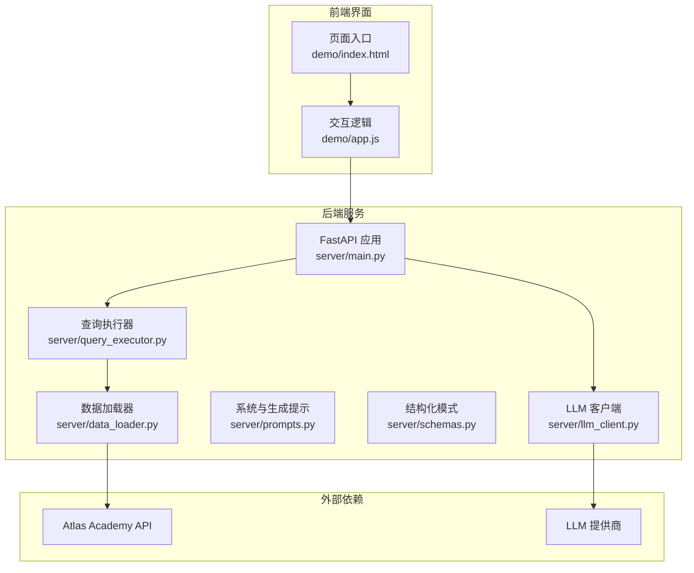
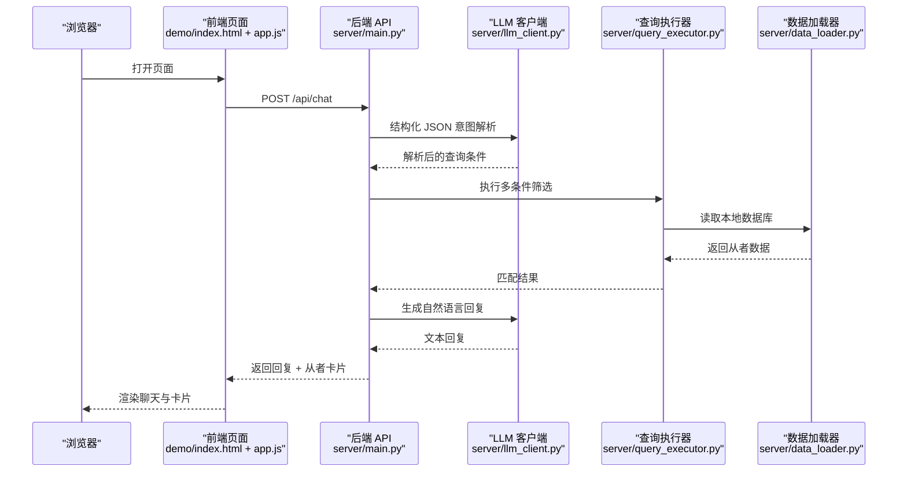
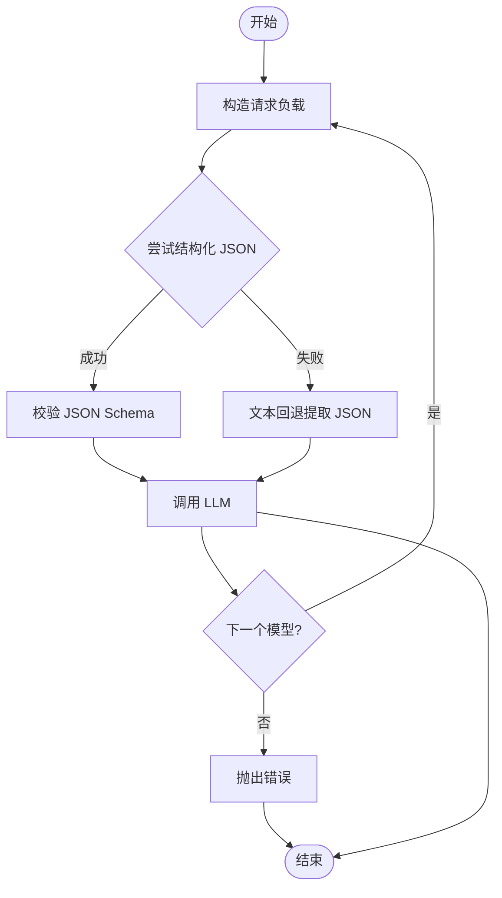
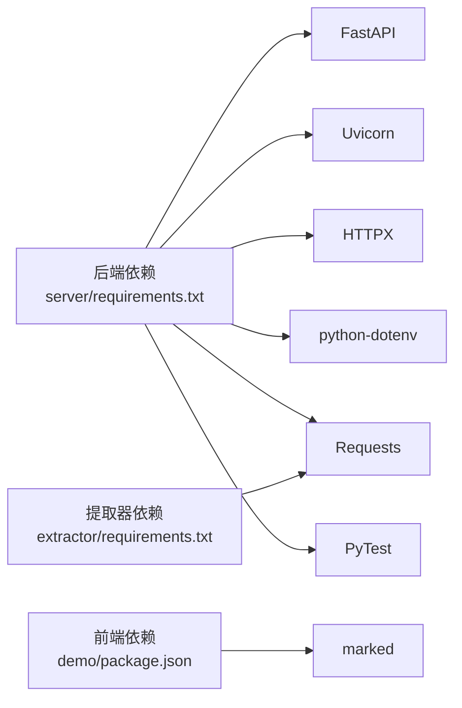

# 快速开始

<cite>
**本文引用的文件**
- [server/main.py](file://server/main.py)
- [server/llm_client.py](file://server/llm_client.py)
- [server/prompts.py](file://server/prompts.py)
- [server/schemas.py](file://server/schemas.py)
- [server/query_executor.py](file://server/query_executor.py)
- [server/data_loader.py](file://server/data_loader.py)
- [server/requirements.txt](file://server/requirements.txt)
- [extractor/requirements.txt](file://extractor/requirements.txt)
- [demo/package.json](file://demo/package.json)
- [demo/index.html](file://demo/index.html)
- [demo/app.js](file://demo/app.js)
</cite>

## 目录
1. [简介](#简介)
2. [项目结构](#项目结构)
3. [核心组件](#核心组件)
4. [架构总览](#架构总览)
5. [详细组件分析](#详细组件分析)
6. [依赖分析](#依赖分析)
7. [性能注意事项](#性能注意事项)
8. [故障排除指南](#故障排除指南)
9. [结论](#结论)
10. [附录](#附录)

## 简介
本指南面向首次接触 Laplace 的用户，帮助你在最短时间内完成环境准备、依赖安装、LLM API 设置，并成功启动后端服务与前端界面。完成后，你将能够通过自然语言与系统交互，查询 FGO 从者数据，并获得带有从者卡片的直观回复。

## 项目结构
Laplace 采用前后端分离的结构：
- 后端服务：基于 FastAPI，提供 /api/chat 对话接口与健康检查 /api/health，并挂载前端静态资源。
- 前端界面：位于 demo 目录，提供聊天界面与从者卡片展示。
- 数据与知识库：后端内置知识库与数据加载脚本，用于构建从者数据库。
- LLM 客户端：封装 OpenAI 兼容的聊天接口，支持多模型回退与结构化 JSON 输出。

图表来源
- [server/main.py:1-228](file://server/main.py#L1-L228)
- [server/llm_client.py:1-247](file://server/llm_client.py#L1-L247)
- [server/prompts.py:1-208](file://server/prompts.py#L1-L208)
- [server/schemas.py:1-81](file://server/schemas.py#L1-L81)
- [server/query_executor.py:1-305](file://server/query_executor.py#L1-L305)
- [server/data_loader.py:1-363](file://server/data_loader.py#L1-L363)
- [demo/index.html:1-72](file://demo/index.html#L1-L72)
- [demo/app.js:1-219](file://demo/app.js#L1-L219)

章节来源
- [server/main.py:1-228](file://server/main.py#L1-L228)
- [demo/index.html:1-72](file://demo/index.html#L1-L72)

## 核心组件
- FastAPI 应用与路由
  - 提供 /api/chat 接口，负责意图解析、查询执行与自然语言回复生成。
  - 提供 /api/health 健康检查。
  - 挂载 demo 目录为静态资源，直接提供前端页面。
- LLM 客户端
  - 通过环境变量配置 LLM 基础地址、API Key、主模型与回退模型。
  - 支持结构化 JSON 输出与文本回退，自动选择最佳响应格式。
- 系统与生成提示
  - 动态加载知识库，构建严格的系统提示，确保 LLM 输出符合结构化模式。
- 查询执行器
  - 在本地数据库上执行多条件筛选，支持效果、自充、职阶、稀有度、特性、性别、阵营、配卡、宝具颜色与目标类型等。
- 数据加载器
  - 从 Atlas Academy API 拉取数据，结合知识库生成通用从者数据库。
- 前端界面
  - 提供聊天输入、发送按钮、建议词条、从者卡片网格与 Markdown 渲染。

章节来源
- [server/main.py:87-228](file://server/main.py#L87-L228)
- [server/llm_client.py:35-169](file://server/llm_client.py#L35-L169)
- [server/prompts.py:46-161](file://server/prompts.py#L46-L161)
- [server/schemas.py:68-81](file://server/schemas.py#L68-L81)
- [server/query_executor.py:53-305](file://server/query_executor.py#L53-L305)
- [server/data_loader.py:332-363](file://server/data_loader.py#L332-L363)
- [demo/index.html:1-72](file://demo/index.html#L1-L72)
- [demo/app.js:30-123](file://demo/app.js#L30-L123)

## 架构总览
下图展示了从浏览器到后端服务、LLM 与数据源的整体流程。

图表来源
- [server/main.py:87-218](file://server/main.py#L87-L218)
- [server/llm_client.py:35-169](file://server/llm_client.py#L35-L169)
- [server/query_executor.py:53-87](file://server/query_executor.py#L53-L87)
- [server/data_loader.py:332-363](file://server/data_loader.py#L332-L363)
- [demo/app.js:30-74](file://demo/app.js#L30-L74)

## 详细组件分析

### 后端服务启动与路由
- 启动方式
  - 使用 uvicorn 运行应用入口，挂载静态资源以便直接访问前端页面。
- 关键路由
  - POST /api/chat：接收用户消息，进行意图解析与查询执行，返回回复与从者列表。
  - GET /api/health：健康检查。
- 静态资源
  - 挂载 demo 目录，HTML 页面可直接打开。

章节来源
- [server/main.py:81-228](file://server/main.py#L81-L228)

### LLM 客户端与多模型回退
- 环境变量
  - LLM_BASE_URL、LLM_API_KEY、LLM_MODEL、LLM_FALLBACK_MODELS。
- 调用流程
  - 首次尝试结构化 JSON 输出（response_format=json_schema）。
  - 若模型不支持结构化输出，自动回退为文本并提取 JSON。
  - 多模型依次尝试，失败则切换下一个模型。
- 结构化模式
  - 使用 Pydantic 模型校验 LLM 输出，确保后续查询执行稳定。

图表来源
- [server/llm_client.py:35-169](file://server/llm_client.py#L35-L169)
- [server/schemas.py:68-81](file://server/schemas.py#L68-L81)

章节来源
- [server/llm_client.py:18-79](file://server/llm_client.py#L18-L79)
- [server/schemas.py:13-81](file://server/schemas.py#L13-L81)

### 系统提示与生成提示
- 系统提示
  - 动态加载 effect_schema.json，构建效果分类清单，限定 LLM 输出为严格 JSON。
- 生成提示
  - 基于检索到的上下文生成自然语言回复，强调“基于上下文回答、不捏造、简洁明了”。

章节来源
- [server/prompts.py:15-173](file://server/prompts.py#L15-L173)
- [server/prompts.py:175-208](file://server/prompts.py#L175-L208)

### 查询执行器
- 条件支持
  - NP 自充（含比较运算）、稀有度、职阶、名称、单/多效果、目标类型、特性（含排除）、性别、阵营、配卡、宝具颜色、宝具目标类型。
- 匹配策略
  - 使用集合与详细数据双重匹配，支持“或/与”多效果组合。
  - 名称匹配支持昵称映射与多语言归一化。
- 排序
  - 按稀有度降序、Collection No 升序。

章节来源
- [server/query_executor.py:53-305](file://server/query_executor.py#L53-L305)

### 数据加载器
- 数据源
  - Atlas Academy API（nice_servant_lang_en.json）。
- 处理流程
  - 提取技能与宝具效果，构建效果匹配索引。
  - 计算自充统计、卡色构成、宝具颜色与目标类型。
  - 生成通用从者数据库并持久化为 JSON 文件。

章节来源
- [server/data_loader.py:91-363](file://server/data_loader.py#L91-L363)

### 前端界面
- 页面结构
  - 顶部模型徽章、聊天区域、输入框与发送按钮、建议词条。
- 交互逻辑
  - 发送消息到 /api/chat，渲染回复与从者卡片网格。
  - 支持 Markdown 渲染与错误提示。

章节来源
- [demo/index.html:1-72](file://demo/index.html#L1-L72)
- [demo/app.js:30-123](file://demo/app.js#L30-L123)

## 依赖分析
- 后端依赖
  - FastAPI、Uvicorn、HTTPX、python-dotenv、Requests、PyTest。
- 提取器依赖
  - Requests。
- 前端依赖
  - marked（Markdown 渲染）。

图表来源
- [server/requirements.txt:1-7](file://server/requirements.txt#L1-L7)
- [extractor/requirements.txt:1-2](file://extractor/requirements.txt#L1-L2)
- [demo/package.json:1-6](file://demo/package.json#L1-L6)

章节来源
- [server/requirements.txt:1-7](file://server/requirements.txt#L1-L7)
- [extractor/requirements.txt:1-2](file://extractor/requirements.txt#L1-L2)
- [demo/package.json:1-6](file://demo/package.json#L1-L6)

## 性能注意事项
- 响应大小控制
  - 后端对返回的从者数量进行上限控制，避免响应过大。
- 上下文裁剪
  - 仅向生成提示传递前若干条代表结果，保证生成阶段的上下文可控。
- 模型回退
  - 当结构化输出失败时自动回退，减少重试成本。
- 数据库缓存
  - 查询执行器与 LLM 客户端均具备缓存机制，减少重复加载与请求。

章节来源
- [server/main.py:208-218](file://server/main.py#L208-L218)
- [server/llm_client.py:60-79](file://server/llm_client.py#L60-L79)
- [server/query_executor.py:41-50](file://server/query_executor.py#L41-L50)

## 故障排除指南
- 启动后端服务失败
  - 确认已安装依赖并使用 uvicorn 运行应用入口。
  - 检查端口占用情况，默认监听端口为 8000。
- LLM 无法连接或解析失败
  - 检查 LLM_BASE_URL、LLM_API_KEY、LLM_MODEL 与 LLM_FALLBACK_MODELS 是否正确配置。
  - 若模型不支持结构化输出，客户端会自动回退，但可能影响稳定性。
- 未找到从者或结果为空
  - 确认已生成本地数据库文件（由数据加载器生成）。
  - 检查知识库文件是否存在（effect_schema.json、mappings.json 等）。
- 前端无法访问
  - 确保后端已挂载 demo 目录为静态资源。
  - 浏览器访问后端服务根路径，而非单独打开 demo/index.html。
- 环境变量与配置
  - LLM 客户端从项目根目录加载 .env，确保配置项齐全。

章节来源
- [server/main.py:81-228](file://server/main.py#L81-L228)
- [server/llm_client.py:18-29](file://server/llm_client.py#L18-L29)
- [server/data_loader.py:44-52](file://server/data_loader.py#L44-L52)
- [demo/index.html:1-72](file://demo/index.html#L1-L72)

## 结论
通过本指南，你已经完成了环境准备、依赖安装与 LLM API 设置，并成功启动了后端服务与前端界面。现在你可以使用自然语言查询 FGO 从者数据，并获得带有从者卡片的直观回复。若遇到问题，可依据故障排除指南逐项排查。

## 附录

### 环境搭建步骤（通用）
- 准备 Python 环境
  - 建议使用 Python 3.10+。
- 安装后端依赖
  - 在 server 目录执行安装命令，安装 FastAPI、Uvicorn、HTTPX、python-dotenv、Requests、PyTest。
- 安装提取器依赖
  - 在 extractor 目录执行安装命令，安装 Requests。
- 生成本地数据库
  - 运行数据加载器脚本，从 Atlas Academy API 拉取并生成从者数据库文件。
- 配置 LLM API
  - 在项目根目录创建 .env 文件，设置 LLM_BASE_URL、LLM_API_KEY、LLM_MODEL、LLM_FALLBACK_MODELS。
- 启动后端服务
  - 使用 uvicorn 运行应用入口，监听端口默认为 8000。
- 启动前端界面
  - 通过浏览器访问后端服务根路径，即可看到聊天界面。

章节来源
- [server/requirements.txt:1-7](file://server/requirements.txt#L1-L7)
- [extractor/requirements.txt:1-2](file://extractor/requirements.txt#L1-L2)
- [server/data_loader.py:332-363](file://server/data_loader.py#L332-L363)
- [server/llm_client.py:18-29](file://server/llm_client.py#L18-L29)
- [server/main.py:81-228](file://server/main.py#L81-L228)
- [demo/index.html:1-72](file://demo/index.html#L1-L72)

### 基本使用示例
- 通过浏览器访问后端服务根路径，进入聊天界面。
- 输入自然语言问题，例如“30 自充的从者有哪些”、“大于 50 自充的从者有哪些”、“五星 Caster 自充”、“四星以上狂阶”。
- 查看系统返回的回复与从者卡片网格。

章节来源
- [demo/index.html:40-49](file://demo/index.html#L40-L49)
- [demo/app.js:30-74](file://demo/app.js#L30-L74)