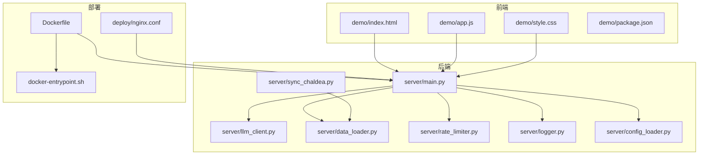
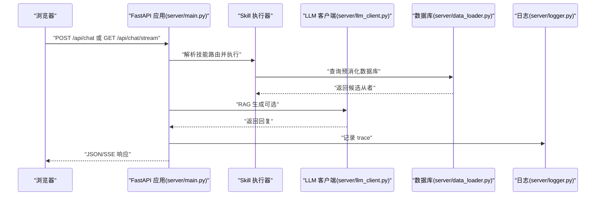
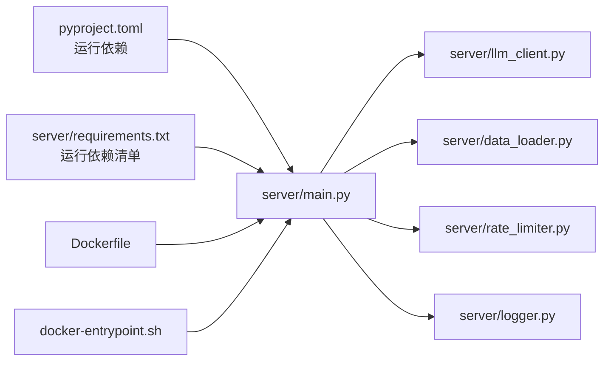

# 快速开始

<cite>
**本文引用的文件**
- [README.md](file://README.md)
- [Dockerfile](file://Dockerfile)
- [docker-entrypoint.sh](file://docker-entrypoint.sh)
- [pyproject.toml](file://pyproject.toml)
- [server/main.py](file://server/main.py)
- [server/requirements.txt](file://server/requirements.txt)
- [server/data_loader.py](file://server/data_loader.py)
- [server/sync_chaldea.py](file://server/sync_chaldea.py)
- [server/rate_limiter.py](file://server/rate_limiter.py)
- [server/logger.py](file://server/logger.py)
- [deploy/nginx.conf](file://deploy/nginx.conf)
- [.dockerignore](file://.dockerignore)
- [.gitignore](file://.gitignore)
- [server/config_loader.py](file://server/config_loader.py)
- [demo/package.json](file://demo/package.json)
</cite>

## 目录
1. [简介](#简介)
2. [项目结构](#项目结构)
3. [核心组件](#核心组件)
4. [架构总览](#架构总览)
5. [详细组件分析](#详细组件分析)
6. [依赖关系分析](#依赖关系分析)
7. [性能考虑](#性能考虑)
8. [故障排除指南](#故障排除指南)
9. [结论](#结论)
10. [附录](#附录)

## 简介
本指南面向初学者与进阶用户，提供 Laplace 项目的完整快速开始流程：环境准备、虚拟环境与依赖安装、API Key 配置、从者数据下载、开发与生产环境差异、Docker 部署与 Nginx 反代、常见环境变量配置示例、以及故障排除建议。Laplace 是一个基于 FastAPI 的 AI Native 对话式 FGO 数据助手，支持自然语言查询、两阶段 RAG 与 SSE 流式交互。

## 项目结构
Laplace 采用前后端分离的结构：前端为静态页面（demo/），后端为 FastAPI 应用（server/），包含 LLM 客户端、技能路由框架、速率限制、日志追踪、数据加载与知识库同步等功能模块。

图表来源
- [server/main.py:133-157](file://server/main.py#L133-L157)
- [Dockerfile:1-35](file://Dockerfile#L1-L35)
- [docker-entrypoint.sh:1-27](file://docker-entrypoint.sh#L1-L27)
- [deploy/nginx.conf:1-49](file://deploy/nginx.conf#L1-L49)

章节来源
- [README.md: 213-242:213-242](file://README.md#L213-L242)

## 核心组件
- FastAPI 应用与路由：提供 /api/chat（JSON）与 /api/chat/stream（SSE）两个核心接口，支持预设与两阶段 LLM 路由。
- LLM 客户端：支持多提供商降级链与向后兼容旧变量，统一 OpenAI Responses API 风格。
- 速率限制中间件：双层滑动窗口（Per-IP 与全站），保护 LLM 配额。
- 日志追踪：异步写入 JSONL 查询轨迹，支持按 traceId 查询与列表读取。
- 数据加载与知识库：从 Atlas Academy 拉取全量从者数据，结合 Chaldea 效果知识库生成预消化数据库；支持增量同步与映射下载。
- Docker 入口脚本：容器启动时自动下载从者数据（若不存在），支持强制刷新与多 worker。

章节来源
- [server/main.py: 133-157:133-157](file://server/main.py#L133-L157)
- [server/main.py: 380-465:380-465](file://server/main.py#L380-L465)
- [server/main.py: 468-690:468-690](file://server/main.py#L468-L690)
- [server/llm_client.py: 41-77:41-77](file://server/llm_client.py#L41-L77)
- [server/rate_limiter.py: 23-132:23-132](file://server/rate_limiter.py#L23-L132)
- [server/logger.py: 46-106:46-106](file://server/logger.py#L46-L106)
- [server/data_loader.py: 556-587:556-587](file://server/data_loader.py#L556-L587)
- [server/sync_chaldea.py: 366-504:366-504](file://server/sync_chaldea.py#L366-L504)
- [docker-entrypoint.sh: 6-26:6-26](file://docker-entrypoint.sh#L6-L26)

## 架构总览
下图展示了从浏览器到后端、LLM 与数据层的整体交互：

图表来源
- [server/main.py: 244-377:244-377](file://server/main.py#L244-L377)
- [server/main.py: 468-690:468-690](file://server/main.py#L468-L690)
- [server/data_loader.py: 556-587:556-587](file://server/data_loader.py#L556-L587)
- [server/logger.py: 46-106:46-106](file://server/logger.py#L46-L106)

## 详细组件分析

### 环境要求与安装步骤
- 环境要求：Python 3.12+（项目元数据与工具链均要求 3.12）。
- 安装步骤（开发环境）：
  1) 创建并激活虚拟环境
  2) 安装后端依赖（包含运行所需依赖）
  3) 可选：安装开发依赖（lint/test）
  4) 配置 .env（复制示例并填入 LLM API Key）
  5) 首次运行：下载从者数据
  6) 启动服务端（FastAPI/Uvicorn）
  7) 打开前端 demo/index.html 使用
- 部署环境：仅需 requirements.txt 中的运行依赖，无需开发依赖。

章节来源
- [README.md: 40-71:40-71](file://README.md#L40-L71)
- [pyproject.toml: 1-L20:1-20](file://pyproject.toml#L1-L20)
- [server/requirements.txt: 1-7:1-7](file://server/requirements.txt#L1-L7)

### API Key 配置与 LLM 多提供商
- 复制示例环境文件为 .env，并填入 LLM API Key。
- 支持多提供商降级链（LLM_PROVIDERS），按顺序尝试不同提供商与模型。
- 向后兼容旧变量（LLM_BASE_URL/LLM_API_KEY/LLM_MODEL/LLM_FALLBACK_MODELS）。

章节来源
- [README.md: 123-151:123-151](file://README.md#L123-L151)
- [server/llm_client.py: 41-77:41-77](file://server/llm_client.py#L41-L77)

### 从者数据下载与知识库同步
- 首次运行必须下载从者数据（Atlas Academy API），生成 server/data/servants_db.json。
- 知识库（effect_schema.json、class_mapping.json、mappings.json 等）由 sync_chaldea.py 从 Chaldea 源码解析生成，支持自定义 Chaldea 源码路径（CHALDEA_SRC_PATH）。
- 容器首次启动也会自动下载数据（若不存在）。

章节来源
- [README.md: 73-98:73-98](file://README.md#L73-L98)
- [server/data_loader.py: 556-587:556-587](file://server/data_loader.py#L556-L587)
- [server/sync_chaldea.py: 290-326:290-326](file://server/sync_chaldea.py#L290-L326)
- [docker-entrypoint.sh: 6-13:6-13](file://docker-entrypoint.sh#L6-L13)

### CORS 与速率限制
- CORS 白名单默认仅本地开发地址，生产环境需将前端域名加入 CORS_ORIGINS。
- 速率限制中间件支持双层限流（Per-IP 与全站），默认针对 /api/chat 与 /api/chat/stream 路径生效。

章节来源
- [README.md: 153-165:153-165](file://README.md#L153-L165)
- [server/main.py: 139-157:139-157](file://server/main.py#L139-L157)
- [server/rate_limiter.py: 23-132:23-132](file://server/rate_limiter.py#L23-L132)

### Docker 部署流程
- 构建镜像：docker build -t laplace .
- 启动容器：挂载 .env，映射 8000 端口，挂载日志卷，设置重启策略。
- 常用操作：查看日志、强制刷新数据、更新部署。
- 容器环境变量补充：REFRESH_DATA_ON_START（启动时强制刷新）、UVICORN_WORKERS（worker 数）。

章节来源
- [README.md: 167-212:167-212](file://README.md#L167-L212)
- [Dockerfile:1-35](file://Dockerfile#L1-L35)
- [docker-entrypoint.sh: 6-26:6-26](file://docker-entrypoint.sh#L6-L26)

### Nginx 反向代理
- 生产环境建议前置 Nginx，处理 SSL 与静态文件托管。
- 注意 SSE 流式响应需关闭代理缓冲（proxy_buffering off）。

章节来源
- [README.md: 204](file://README.md#L204)
- [deploy/nginx.conf: 1-L49:1-49](file://deploy/nginx.conf#L1-L49)

### 前端与静态资源
- demo/ 目录包含前端页面与脚本，入口为 index.html；package.json 仅包含 marked 依赖。
- FastAPI 在启动时挂载 demo 为静态目录，便于直接访问。

章节来源
- [README.md: 220-224:220-224](file://README.md#L220-L224)
- [demo/package.json: 1-L6:1-6](file://demo/package.json#L1-L6)
- [server/main.py: 699-701:699-701](file://server/main.py#L699-L701)

## 依赖关系分析
- 运行时依赖：FastAPI、Uvicorn、httpx、python-dotenv、requests。
- 开发依赖：pytest、ruff（lint/format）。
- Docker 构建：基于 python:3.12-slim，仅拷贝 server/ 与 demo/，入口脚本负责数据下载与启动 uvicorn。

图表来源
- [pyproject.toml: 1-L20:1-20](file://pyproject.toml#L1-L20)
- [server/requirements.txt: 1-7:1-7](file://server/requirements.txt#L1-L7)
- [Dockerfile:1-35](file://Dockerfile#L1-L35)
- [docker-entrypoint.sh:1-27](file://docker-entrypoint.sh#L1-L27)

章节来源
- [pyproject.toml: 1-L20:1-20](file://pyproject.toml#L1-L20)
- [server/requirements.txt: 1-7:1-7](file://server/requirements.txt#L1-L7)
- [.dockerignore: 1-L40:1-40](file://.dockerignore#L1-L40)
- [.gitignore: 1-L52:1-52](file://.gitignore#L1-L52)

## 性能考虑
- SSE 流式响应：前端可逐步接收“思考中/从者卡片/最终回复”，零额外 Token 消耗。
- 预消化数据库：大幅减少 LLM 上下文与推理负担，提高响应速度与准确性。
- 速率限制：双层限流保护配额，避免突发流量导致服务不可用。
- Docker：单阶段构建，镜像体积小，启动快；可通过 UVICORN_WORKERS 调整并发。

章节来源
- [server/main.py: 468-690:468-690](file://server/main.py#L468-L690)
- [server/data_loader.py: 556-587:556-587](file://server/data_loader.py#L556-L587)
- [server/rate_limiter.py: 23-132:23-132](file://server/rate_limiter.py#L23-L132)
- [Dockerfile:1-35](file://Dockerfile#L1-L35)

## 故障排除指南
- 无法访问前端页面
  - 确认已启动 FastAPI 服务并在浏览器打开 demo/index.html。
  - 若使用 Nginx，确保静态文件路径正确、反代配置生效。
- CORS 跨域错误
  - 将前端访问地址加入 CORS_ORIGINS（如 192.168.x.x 地址）。
- LLM 请求失败或配额不足
  - 检查 .env 中 LLM_* 变量是否正确；多提供商链是否配置完整。
  - 使用旧变量回退（LLM_BASE_URL/LLM_API_KEY/LLM_MODEL/LLM_FALLBACK_MODELS）。
- 数据未下载或为空
  - 首次运行需执行数据下载；容器启动时若缺少 server/data/servants_db.json 会自动下载。
  - 强制刷新：设置 REFRESH_DATA_ON_START=1 后重启容器。
- 速率限制 429
  - 调整 RATE_LIMIT_PER_MINUTE 或 RATE_LIMIT_GLOBAL_PER_MINUTE；或降低请求频率。
- 日志定位问题
  - 本地访问 /api/traces 与 /api/traces/{trace_id}（仅本机可访问）查看最近查询轨迹。
- Docker 相关
  - 查看日志：docker logs -f laplace
  - 更新部署：重新构建镜像并替换容器。

章节来源
- [README.md: 153-165:153-165](file://README.md#L153-L165)
- [README.md: 167-212:167-212](file://README.md#L167-L212)
- [server/main.py: 186-204:186-204](file://server/main.py#L186-L204)
- [server/logger.py: 74-106:74-106](file://server/logger.py#L74-L106)
- [docker-entrypoint.sh: 6-19:6-19](file://docker-entrypoint.sh#L6-L19)
- [server/rate_limiter.py: 77-97:77-97](file://server/rate_limiter.py#L77-L97)

## 结论
通过本快速开始指南，您可以在本地快速搭建 Laplace，完成环境准备、依赖安装、API Key 配置与数据下载，并掌握开发与生产环境的差异。Docker 与 Nginx 的配合可满足生产部署需求；多提供商 LLM 配置与速率限制策略有助于稳定服务与控制成本。遇到问题时，可借助日志与容器命令快速定位与修复。

## 附录

### 常见环境变量配置示例
- LLM 多提供商配置：LLM_PROVIDERS、LLM_{NAME}_URL/KEY/MODELS
- 其他常用变量：CORS_ORIGINS、RATE_LIMIT_PER_MINUTE、RATE_LIMIT_GLOBAL_PER_MINUTE、CHALDEA_SRC_PATH
- Docker 补充变量：REFRESH_DATA_ON_START、UVICORN_WORKERS

章节来源
- [README.md: 131-165:131-165](file://README.md#L131-L165)
- [README.md: 206-212:206-212](file://README.md#L206-L212)