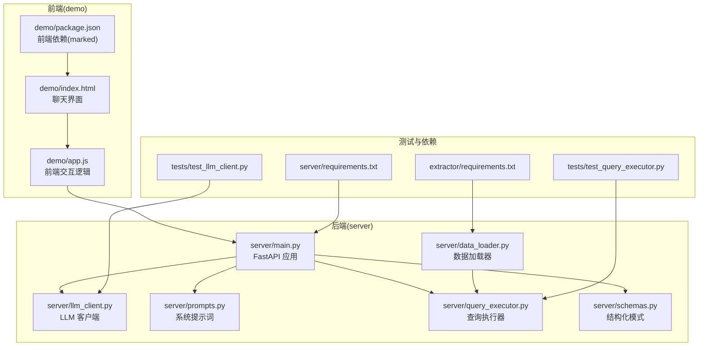
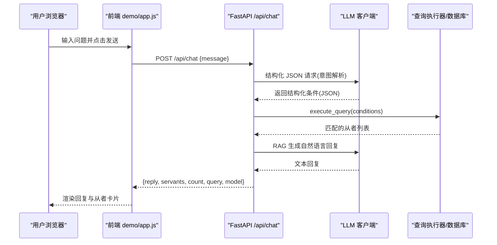
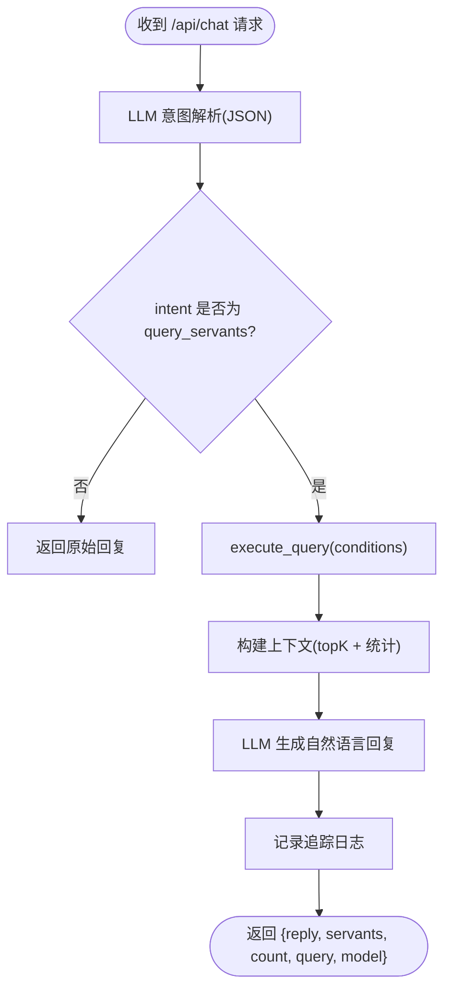
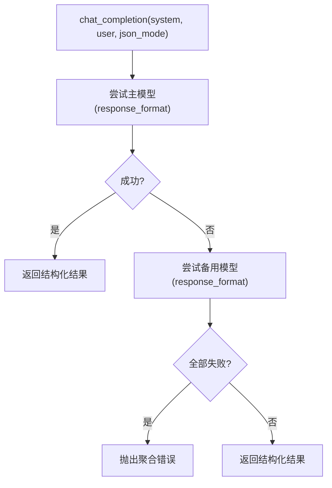
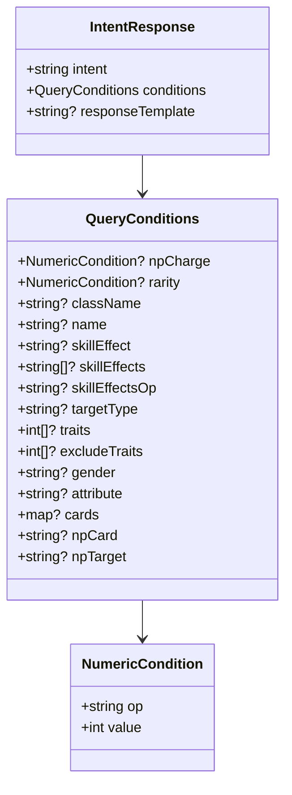
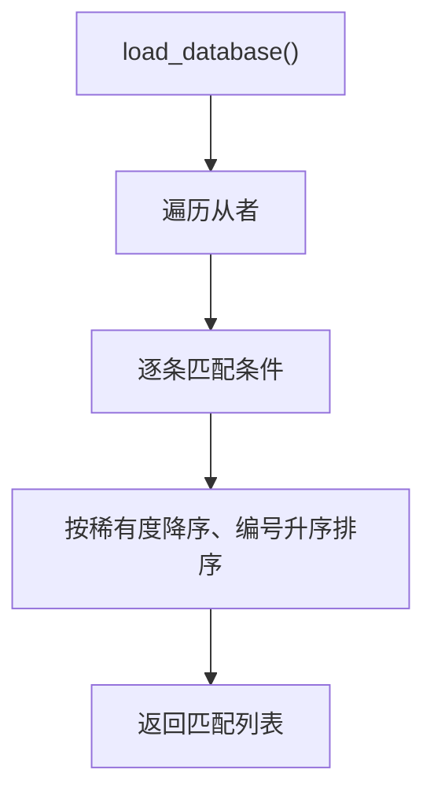
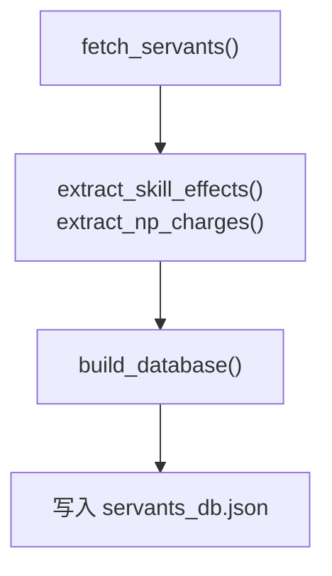
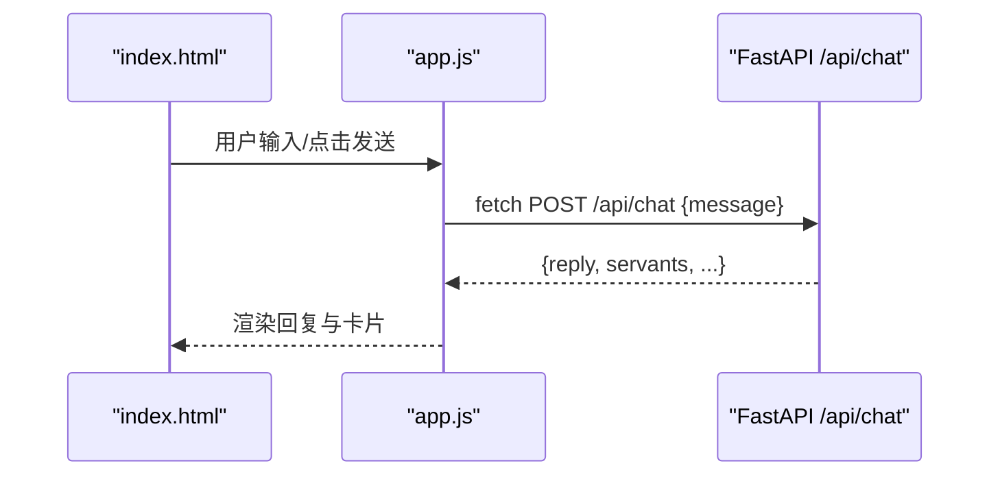
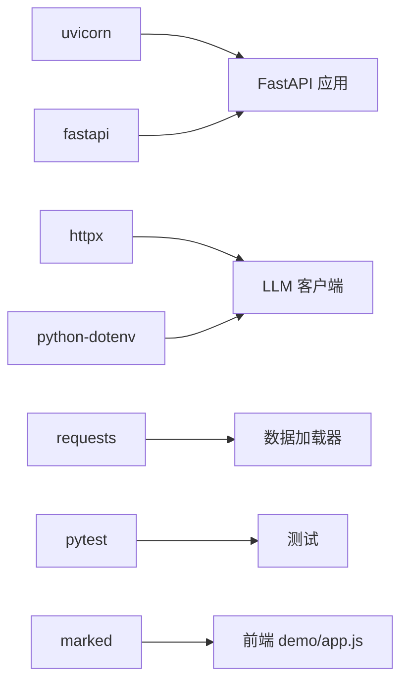

# 快速开始

<cite>
**本文引用的文件**
- [server/main.py](file://server/main.py)
- [server/llm_client.py](file://server/llm_client.py)
- [server/prompts.py](file://server/prompts.py)
- [server/query_executor.py](file://server/query_executor.py)
- [server/schemas.py](file://server/schemas.py)
- [server/data_loader.py](file://server/data_loader.py)
- [demo/index.html](file://demo/index.html)
- [demo/app.js](file://demo/app.js)
- [demo/package.json](file://demo/package.json)
- [server/requirements.txt](file://server/requirements.txt)
- [extractor/requirements.txt](file://extractor/requirements.txt)
- [tests/test_llm_client.py](file://tests/test_llm_client.py)
- [tests/test_query_executor.py](file://tests/test_query_executor.py)
</cite>

## 目录
1. [简介](#简介)
2. [项目结构](#项目结构)
3. [核心组件](#核心组件)
4. [架构总览](#架构总览)
5. [详细组件分析](#详细组件分析)
6. [依赖分析](#依赖分析)
7. [性能考虑](#性能考虑)
8. [故障排除指南](#故障排除指南)
9. [结论](#结论)
10. [附录](#附录)

## 简介
本指南面向首次接触 Laplace 的用户，帮助你在约 30 分钟内完成环境准备、依赖安装、LLM 密钥配置、数据准备、服务启动与前端访问，并通过聊天界面完成一次从者查询。Laplace 是一个“对话式 FGO 数据助手”，基于 FastAPI 提供 REST 接口，前端采用静态页面，后端通过 LLM 将自然语言解析为结构化查询，再在本地从者数据库中检索并生成自然语言回复。

## 项目结构
- 后端服务位于 server/，包含 FastAPI 应用、LLM 客户端、提示词工程、查询执行器、数据加载器与知识库。
- 前端位于 demo/，包含静态 HTML、CSS、JS 与 Markdown 渲染依赖。
- 测试位于 tests/，覆盖 LLM 客户端与查询执行器。
- 提取器位于 extractor/，用于拉取外部数据（如 Atlas Academy）并生成本地数据库。

图表来源
- [server/main.py:1-228](file://server/main.py#L1-L228)
- [server/llm_client.py:1-247](file://server/llm_client.py#L1-L247)
- [server/prompts.py:1-208](file://server/prompts.py#L1-L208)
- [server/query_executor.py:1-305](file://server/query_executor.py#L1-L305)
- [server/schemas.py:1-81](file://server/schemas.py#L1-L81)
- [server/data_loader.py:1-363](file://server/data_loader.py#L1-L363)
- [demo/index.html:1-72](file://demo/index.html#L1-L72)
- [demo/app.js:1-219](file://demo/app.js#L1-L219)
- [demo/package.json:1-6](file://demo/package.json#L1-L6)
- [server/requirements.txt:1-7](file://server/requirements.txt#L1-L7)
- [extractor/requirements.txt:1-2](file://extractor/requirements.txt#L1-L2)
- [tests/test_llm_client.py:1-126](file://tests/test_llm_client.py#L1-L126)
- [tests/test_query_executor.py:1-172](file://tests/test_query_executor.py#L1-L172)

章节来源
- [server/main.py:1-228](file://server/main.py#L1-L228)
- [demo/index.html:1-72](file://demo/index.html#L1-L72)
- [demo/app.js:1-219](file://demo/app.js#L1-L219)
- [server/requirements.txt:1-7](file://server/requirements.txt#L1-L7)
- [extractor/requirements.txt:1-2](file://extractor/requirements.txt#L1-L2)

## 核心组件
- FastAPI 应用与路由
  - 提供 /api/chat 对话接口与 /api/health 健康检查。
  - 在启动事件中预加载数据库。
- LLM 客户端
  - 支持主模型与备用模型轮询，自动降级 response_format。
  - 通过 .env 读取 LLM_BASE_URL、LLM_API_KEY、LLM_MODEL、LLM_FALLBACK_MODELS。
- 提示词工程
  - 动态注入 effect_schema.json 的效果分类，构建严格的 JSON Schema 约束。
- 查询执行器
  - 在本地 servants_db.json 上执行多条件筛选，支持昵称映射、效果 AND/OR、特性过滤、指令卡与宝具属性等。
- 数据加载器
  - 从 Atlas Academy API 拉取数据，基于 effect_schema.json 与 mappings.json 生成本地数据库。
- 前端聊天界面
  - 静态页面，通过 POST /api/chat 与后端交互，渲染 Markdown 与从者卡片。

章节来源
- [server/main.py:51-228](file://server/main.py#L51-L228)
- [server/llm_client.py:18-79](file://server/llm_client.py#L18-L79)
- [server/prompts.py:15-208](file://server/prompts.py#L15-L208)
- [server/query_executor.py:41-305](file://server/query_executor.py#L41-L305)
- [server/data_loader.py:332-363](file://server/data_loader.py#L332-L363)
- [demo/index.html:31-72](file://demo/index.html#L31-L72)
- [demo/app.js:30-124](file://demo/app.js#L30-L124)

## 架构总览
下图展示了从浏览器到后端服务、LLM 与数据库的整体调用链路。

图表来源
- [demo/app.js:30-74](file://demo/app.js#L30-L74)
- [server/main.py:87-218](file://server/main.py#L87-L218)
- [server/llm_client.py:35-126](file://server/llm_client.py#L35-L126)
- [server/query_executor.py:53-87](file://server/query_executor.py#L53-L87)

## 详细组件分析

### 后端应用与路由
- 应用初始化
  - 设置标题、描述、版本。
  - 添加 CORS 中间件允许跨域。
- 启动事件
  - 预加载本地从者数据库，减少首次查询延迟。
- /api/chat
  - 第一阶段：调用 LLM 将用户输入解析为结构化条件（JSON）。
  - 意图校验：仅支持 query_servants。
  - 第二阶段：基于检索结果生成自然语言回复（RAG）。
  - 返回字段：reply、servants、count、query、model、traceId。
- /api/health
  - 健康检查接口。

图表来源
- [server/main.py:87-218](file://server/main.py#L87-L218)

章节来源
- [server/main.py:51-228](file://server/main.py#L51-L228)

### LLM 客户端与密钥配置
- 环境变量
  - LLM_BASE_URL：LLM 网关地址，默认值见源码。
  - LLM_API_KEY：访问令牌。
  - LLM_MODEL：主模型名称。
  - LLM_FALLBACK_MODELS：备用模型列表（逗号分隔）。
- 调用流程
  - 优先使用 response_format=json_schema 的结构化输出。
  - 若模型不支持结构化输出，自动降级为文本并提取 JSON。
  - 多模型轮询，失败则切换下一个。
- 错误处理
  - 统一捕获网络与解析异常，抛出聚合错误。

图表来源
- [server/llm_client.py:35-126](file://server/llm_client.py#L35-L126)

章节来源
- [server/llm_client.py:18-79](file://server/llm_client.py#L18-L79)

### 提示词工程与结构化模式
- 系统提示词
  - 动态注入 effect_schema.json 的效果分类，确保 LLM 输出严格 JSON Schema。
  - 提供字段说明、示例与中文映射规则。
- 结构化模式
  - IntentResponse：固定 intent=query_servants，conditions 为 QueryConditions。
  - QueryConditions：支持 NP 自充、稀有度、职阶、名称、技能效果、特性、性别、阵营、指令卡、宝具颜色与目标类型等。

图表来源
- [server/schemas.py:16-81](file://server/schemas.py#L16-L81)
- [server/prompts.py:46-161](file://server/prompts.py#L46-L161)

章节来源
- [server/prompts.py:15-208](file://server/prompts.py#L15-L208)
- [server/schemas.py:16-81](file://server/schemas.py#L16-L81)

### 查询执行器与数据库
- 数据库加载
  - 从 server/data/servants_db.json 加载，带缓存。
- 查询条件
  - 支持 NP 自充比较、稀有度比较、职阶、名称（含昵称映射）、技能效果（AND/OR）、特性（包含/排除）、性别、阵营、指令卡、宝具颜色与目标类型。
- 排序规则
  - 按稀有度降序、collectionNo 升序。

图表来源
- [server/query_executor.py:41-87](file://server/query_executor.py#L41-L87)

章节来源
- [server/query_executor.py:41-305](file://server/query_executor.py#L41-L305)

### 数据加载器与知识库
- 知识库来源
  - effect_schema.json：效果分类与 funcType/buffType 映射。
  - mappings.json：从者原名到中文译名的映射。
- 数据提取
  - 从 Atlas Academy API 拉取 nice_servant_lang_en.json。
  - 提取技能效果、NP 充能、指令卡构成、宝具颜色与目标类型。
- 输出
  - 生成 server/data/servants_db.json，供查询执行器使用。

图表来源
- [server/data_loader.py:91-359](file://server/data_loader.py#L91-L359)

章节来源
- [server/data_loader.py:44-359](file://server/data_loader.py#L44-L359)

### 前端聊天界面
- 页面结构
  - 顶部模型徽章显示当前使用的模型名称。
  - 聊天区域展示欢迎语与建议问题。
  - 输入框支持回车发送。
- 交互逻辑
  - 发送 POST /api/chat，解析响应后渲染 Markdown 与从者卡片。
  - 错误时提示后端未启动。

图表来源
- [demo/index.html:31-72](file://demo/index.html#L31-L72)
- [demo/app.js:30-124](file://demo/app.js#L30-L124)

章节来源
- [demo/index.html:1-72](file://demo/index.html#L1-L72)
- [demo/app.js:1-219](file://demo/app.js#L1-L219)

## 依赖分析
- 后端依赖
  - FastAPI、Uvicorn、HTTPX、python-dotenv、Requests、Pytest。
- 提取器依赖
  - Requests。
- 前端依赖
  - marked（Markdown 渲染）。

图表来源
- [server/requirements.txt:1-7](file://server/requirements.txt#L1-L7)
- [extractor/requirements.txt:1-2](file://extractor/requirements.txt#L1-L2)
- [demo/package.json:1-6](file://demo/package.json#L1-L6)

章节来源
- [server/requirements.txt:1-7](file://server/requirements.txt#L1-L7)
- [extractor/requirements.txt:1-2](file://extractor/requirements.txt#L1-L2)
- [demo/package.json:1-6](file://demo/package.json#L1-L6)

## 性能考虑
- 预热数据库：应用启动时加载本地数据库，降低首次查询延迟。
- 限制返回数量：前端最多展示 50 个从者，避免响应过大。
- 两阶段 LLM 调用：先结构化解析，再 RAG 生成，兼顾准确性与稳定性。
- 模型降级：当 response_format 不受支持时自动回退文本模式，保证可用性。

## 故障排除指南
- 启动后端服务
  - 使用 uvicorn 启动应用入口，确保端口未被占用。
  - 健康检查：访问 /api/health。
- LLM 无法连接或解析失败
  - 检查 .env 中 LLM_BASE_URL、LLM_API_KEY、LLM_MODEL、LLM_FALLBACK_MODELS。
  - 若 response_format 报错，LLM 客户端会自动降级；若仍失败，确认网关支持结构化输出。
- 无从者数据
  - 确认 server/data/servants_db.json 存在；如缺失，运行数据加载器生成数据库。
- 前端无法显示卡片
  - 确保后端已挂载静态文件，前端通过 http://localhost:8000 访问。
  - 检查浏览器控制台是否有跨域或资源加载错误。
- 测试验证
  - 使用 pytest 运行测试，验证 LLM 客户端与查询执行器的行为符合预期。

章节来源
- [server/main.py:221-228](file://server/main.py#L221-L228)
- [server/llm_client.py:35-126](file://server/llm_client.py#L35-L126)
- [server/data_loader.py:332-363](file://server/data_loader.py#L332-L363)
- [tests/test_llm_client.py:89-126](file://tests/test_llm_client.py#L89-L126)
- [tests/test_query_executor.py:123-172](file://tests/test_query_executor.py#L123-L172)

## 结论
按照本指南，你可以在 30 分钟内完成从 Python 环境准备、依赖安装、LLM 密钥配置、数据生成与服务启动，并通过前端聊天界面完成一次从者查询。后续可根据需要调整 LLM 参数、扩展提示词与查询条件，或接入更多知识库。

## 附录

### 环境搭建与安装步骤
- Python 3.8+
  - 建议使用虚拟环境隔离依赖。
- 安装后端依赖
  - 在项目根目录执行安装命令，安装 server/requirements.txt。
- 安装提取器依赖
  - 在项目根目录执行安装命令，安装 extractor/requirements.txt。
- 安装前端依赖
  - 在 demo/ 目录执行安装命令，安装 demo/package.json。
- 创建 .env 文件
  - 在项目根目录创建 .env，设置 LLM_BASE_URL、LLM_API_KEY、LLM_MODEL、LLM_FALLBACK_MODELS。
- 生成本地数据库
  - 在项目根目录运行数据加载器脚本，生成 server/data/servants_db.json。
- 启动后端服务
  - 使用 uvicorn 启动 server/main.py。
- 启动前端
  - 通过浏览器打开 demo/index.html，或使用静态服务器托管 demo/ 目录。
- 健康检查
  - 访问 /api/health 确认服务正常。

章节来源
- [server/requirements.txt:1-7](file://server/requirements.txt#L1-L7)
- [extractor/requirements.txt:1-2](file://extractor/requirements.txt#L1-L2)
- [demo/package.json:1-6](file://demo/package.json#L1-L6)
- [server/data_loader.py:332-363](file://server/data_loader.py#L332-L363)
- [server/main.py:221-228](file://server/main.py#L221-L228)

### 默认配置与可调整参数
- LLM 客户端默认值
  - LLM_BASE_URL：默认网关地址。
  - LLM_MODEL：主模型名称。
  - LLM_FALLBACK_MODELS：备用模型列表。
- 查询执行器
  - 支持的条件字段详见结构化模式与提示词说明。
- 前端
  - API_URL：默认指向 http://localhost:8000/api/chat。
  - 模型徽章显示当前使用的模型名称。

章节来源
- [server/llm_client.py:21-28](file://server/llm_client.py#L21-L28)
- [server/schemas.py:25-44](file://server/schemas.py#L25-L44)
- [server/prompts.py:104-161](file://server/prompts.py#L104-L161)
- [demo/app.js:7-24](file://demo/app.js#L7-L24)

### 基本使用示例
- 通过聊天界面提问
  - 示例问题：30 自充的从者有哪些、大于 50 自充的从者有哪些、五星 Caster 自充、四星以上狂阶。
- 查看响应
  - 后端返回 reply（自然语言回复）、servants（从者列表）、count（总数）、query（解析的条件）、model（使用的模型）。

章节来源
- [demo/index.html:40-46](file://demo/index.html#L40-L46)
- [demo/app.js:44-74](file://demo/app.js#L44-L74)
- [server/main.py:87-218](file://server/main.py#L87-L218)