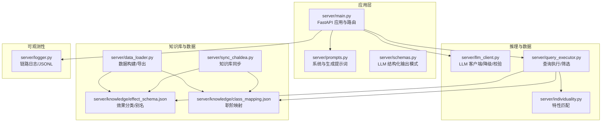
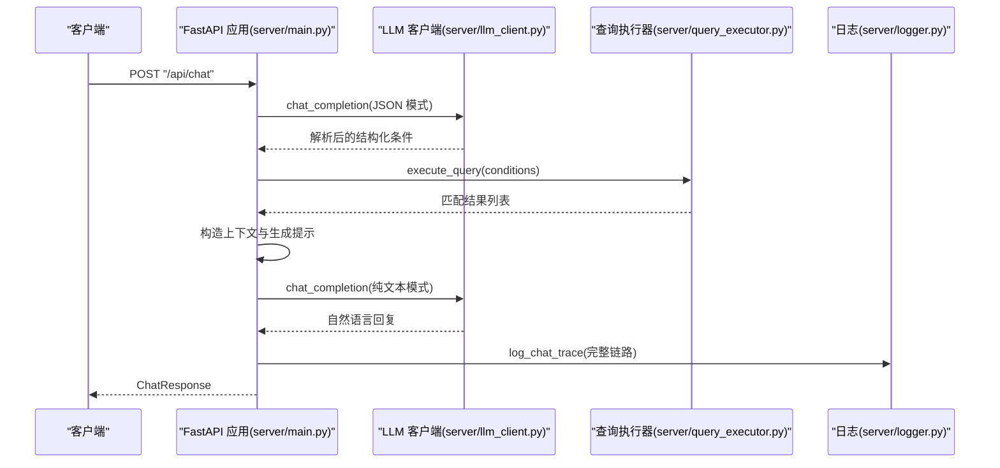
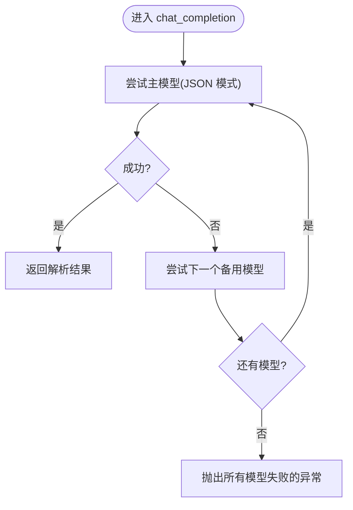
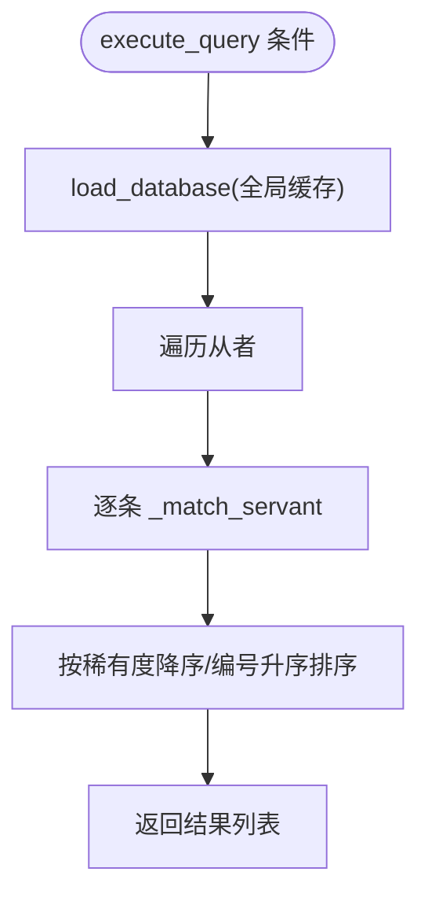
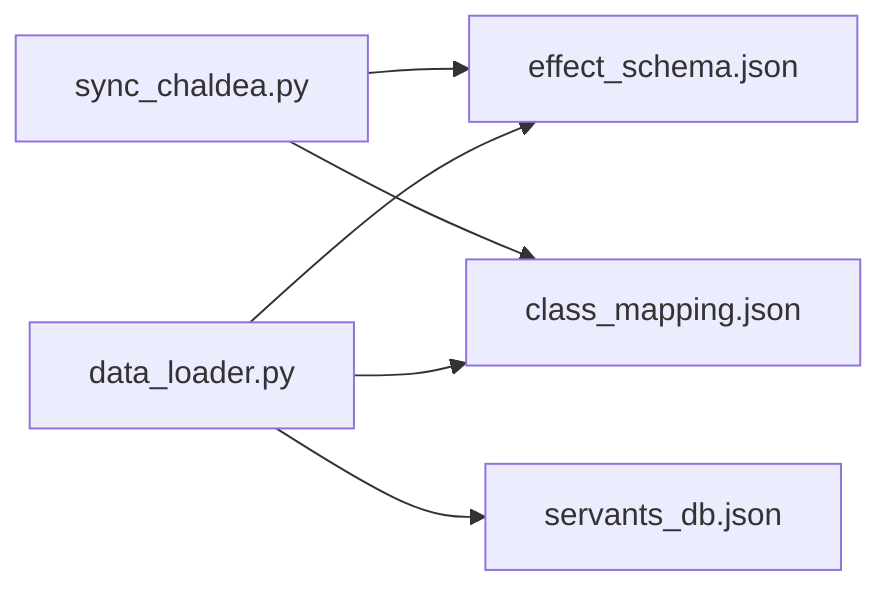
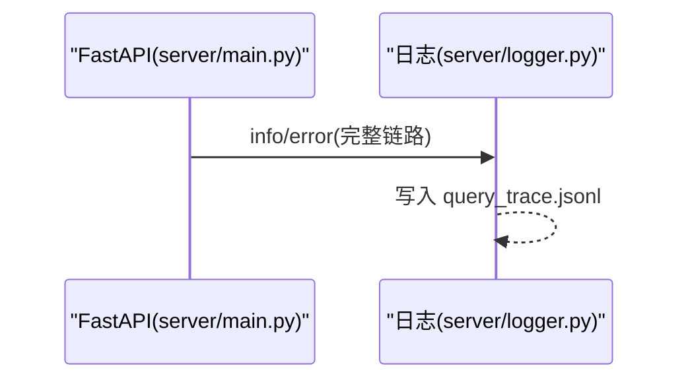
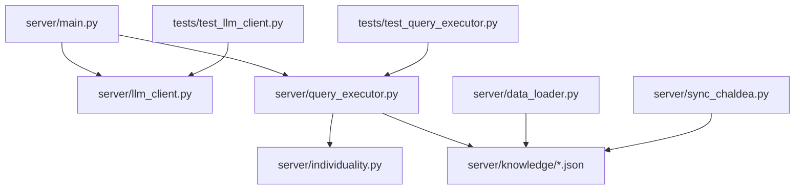
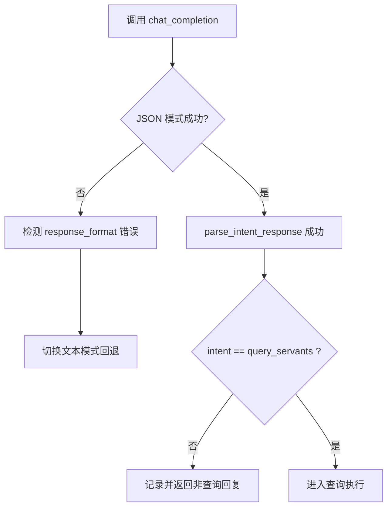

# 故障排除

<cite>
**本文引用的文件**
- [server/main.py](file://server/main.py)
- [server/logger.py](file://server/logger.py)
- [server/llm_client.py](file://server/llm_client.py)
- [server/query_executor.py](file://server/query_executor.py)
- [server/data_loader.py](file://server/data_loader.py)
- [server/sync_chaldea.py](file://server/sync_chaldea.py)
- [server/prompts.py](file://server/prompts.py)
- [server/schemas.py](file://server/schemas.py)
- [server/individuality.py](file://server/individuality.py)
- [server/knowledge/effect_schema.json](file://server/knowledge/effect_schema.json)
- [server/knowledge/class_mapping.json](file://server/knowledge/class_mapping.json)
- [tests/test_llm_client.py](file://tests/test_llm_client.py)
- [tests/test_query_executor.py](file://tests/test_query_executor.py)
- [tests/conftest.py](file://tests/conftest.py)
</cite>

## 目录
1. [简介](#简介)
2. [项目结构](#项目结构)
3. [核心组件](#核心组件)
4. [架构总览](#架构总览)
5. [详细组件分析](#详细组件分析)
6. [依赖分析](#依赖分析)
7. [性能考虑](#性能考虑)
8. [故障排除指南](#故障排除指南)
9. [结论](#结论)
10. [附录](#附录)

## 简介
本指南面向运维与开发人员，聚焦 Laplace 项目的常见故障场景与系统化排查方法。内容覆盖 LLM 连接问题、数据加载失败、查询异常、系统日志分析、错误追踪技术、性能瓶颈识别、调试工具使用、监控指标解读、告警处理流程、网络问题、内存泄漏与并发冲突的解决方案，以及预防性维护与应急响应预案。

## 项目结构
Laplace 采用分层架构：FastAPI 应用层负责路由与业务编排；LLM 客户端封装外部模型调用；查询执行器负责本地数据库筛选；知识库与数据加载器提供领域知识与数据源；日志模块记录链路追踪；测试模块验证关键路径。

**图表来源**
- [server/main.py:1-228](file://server/main.py#L1-L228)
- [server/prompts.py:1-208](file://server/prompts.py#L1-L208)
- [server/schemas.py:1-81](file://server/schemas.py#L1-L81)
- [server/llm_client.py:1-247](file://server/llm_client.py#L1-L247)
- [server/query_executor.py:1-305](file://server/query_executor.py#L1-L305)
- [server/individuality.py:1-78](file://server/individuality.py#L1-L78)
- [server/knowledge/effect_schema.json:1-200](file://server/knowledge/effect_schema.json#L1-L200)
- [server/knowledge/class_mapping.json:1-200](file://server/knowledge/class_mapping.json#L1-L200)
- [server/data_loader.py:1-363](file://server/data_loader.py#L1-L363)
- [server/sync_chaldea.py:1-429](file://server/sync_chaldea.py#L1-L429)
- [server/logger.py:1-55](file://server/logger.py#L1-L55)

**章节来源**
- [server/main.py:1-228](file://server/main.py#L1-L228)
- [server/prompts.py:1-208](file://server/prompts.py#L1-L208)
- [server/schemas.py:1-81](file://server/schemas.py#L1-L81)
- [server/llm_client.py:1-247](file://server/llm_client.py#L1-L247)
- [server/query_executor.py:1-305](file://server/query_executor.py#L1-L305)
- [server/individuality.py:1-78](file://server/individuality.py#L1-L78)
- [server/knowledge/effect_schema.json:1-200](file://server/knowledge/effect_schema.json#L1-L200)
- [server/knowledge/class_mapping.json:1-200](file://server/knowledge/class_mapping.json#L1-L200)
- [server/data_loader.py:1-363](file://server/data_loader.py#L1-L363)
- [server/sync_chaldea.py:1-429](file://server/sync_chaldea.py#L1-L429)
- [server/logger.py:1-55](file://server/logger.py#L1-L55)

## 核心组件
- 应用入口与路由：负责启动预加载数据库、健康检查、聊天接口与静态资源挂载。
- LLM 客户端：统一调用外部模型，支持结构化 JSON 输出、降级模型与响应格式回退。
- 查询执行器：在本地数据库上执行多条件筛选，支持效果、特性、职阶、稀有度、指令卡、宝具等。
- 知识库与数据加载：从上游 API 与 Chaldea 源码抽取领域知识，生成效果分类、职阶映射与通用数据库。
- 日志模块：记录查询链路的完整轨迹，便于问题复盘与审计。

**章节来源**
- [server/main.py:81-228](file://server/main.py#L81-L228)
- [server/llm_client.py:35-126](file://server/llm_client.py#L35-L126)
- [server/query_executor.py:53-87](file://server/query_executor.py#L53-L87)
- [server/data_loader.py:332-363](file://server/data_loader.py#L332-L363)
- [server/sync_chaldea.py:308-429](file://server/sync_chaldea.py#L308-L429)
- [server/logger.py:38-55](file://server/logger.py#L38-L55)

## 架构总览
下图展示一次典型聊天请求的端到端流程，包括意图解析、查询执行与自然语言生成阶段。

**图表来源**
- [server/main.py:87-218](file://server/main.py#L87-L218)
- [server/llm_client.py:35-126](file://server/llm_client.py#L35-L126)
- [server/query_executor.py:53-87](file://server/query_executor.py#L53-L87)
- [server/logger.py:38-55](file://server/logger.py#L38-L55)

## 详细组件分析

### LLM 客户端（意图解析与生成）
- 结构化 JSON 模式优先，失败时自动回退到文本模式；支持主备模型轮询。
- 对响应格式不支持的情况进行识别与降级，保证稳定性。
- 对 JSON Schema 校验失败抛出明确错误，便于定位 LLM 输出异常。

**图表来源**
- [server/llm_client.py:60-78](file://server/llm_client.py#L60-L78)
- [server/llm_client.py:102-126](file://server/llm_client.py#L102-L126)

**章节来源**
- [server/llm_client.py:35-126](file://server/llm_client.py#L35-L126)
- [server/llm_client.py:171-215](file://server/llm_client.py#L171-L215)
- [tests/test_llm_client.py:89-126](file://tests/test_llm_client.py#L89-L126)

### 查询执行器（条件筛选）
- 支持 NP 充能、稀有度、职阶、名称、效果、特性、性别、阵营、指令卡、宝具颜色与目标类型等多维条件。
- 名称匹配包含昵称映射与规范化处理，避免大小写与空字符差异导致的误判。
- 效果匹配支持单个与多个效果的 AND/OR 组合，目标类型可选 self/party/enemy。

**图表来源**
- [server/query_executor.py:53-87](file://server/query_executor.py#L53-L87)
- [server/query_executor.py:90-261](file://server/query_executor.py#L90-L261)

**章节来源**
- [server/query_executor.py:53-87](file://server/query_executor.py#L53-L87)
- [server/query_executor.py:90-261](file://server/query_executor.py#L90-L261)
- [server/individuality.py:58-78](file://server/individuality.py#L58-L78)
- [tests/test_query_executor.py:123-172](file://tests/test_query_executor.py#L123-L172)

### 知识库与数据加载
- effect_schema.json 提供效果分类与中文别名，支撑 LLM 系统提示与用户自然语言到结构化条件的映射。
- class_mapping.json 提供职阶枚举与可用职阶集合，保障查询条件合法。
- data_loader.py 从上游 API 拉取全量数据，基于知识库构建通用数据库；sync_chaldea.py 从 Chaldea 源码抽取领域知识并生成 JSON。

**图表来源**
- [server/sync_chaldea.py:308-429](file://server/sync_chaldea.py#L308-L429)
- [server/data_loader.py:332-363](file://server/data_loader.py#L332-L363)
- [server/knowledge/effect_schema.json:1-200](file://server/knowledge/effect_schema.json#L1-L200)
- [server/knowledge/class_mapping.json:1-200](file://server/knowledge/class_mapping.json#L1-L200)

**章节来源**
- [server/sync_chaldea.py:308-429](file://server/sync_chaldea.py#L308-L429)
- [server/data_loader.py:332-363](file://server/data_loader.py#L332-L363)
- [server/knowledge/effect_schema.json:1-200](file://server/knowledge/effect_schema.json#L1-L200)
- [server/knowledge/class_mapping.json:1-200](file://server/knowledge/class_mapping.json#L1-L200)

### 应用入口与链路日志
- 应用启动时预加载数据库；/api/chat 路由串联意图解析、查询执行与自然语言生成；/api/health 健康检查。
- 日志模块以 JSONL 格式记录 traceId、查询、意图、结果数、回复与上下文，便于离线分析与告警触发。

**图表来源**
- [server/main.py:87-218](file://server/main.py#L87-L218)
- [server/logger.py:38-55](file://server/logger.py#L38-L55)

**章节来源**
- [server/main.py:81-228](file://server/main.py#L81-L228)
- [server/logger.py:38-55](file://server/logger.py#L38-L55)

## 依赖分析
- 组件内聚高、耦合低：应用层仅依赖 LLM 客户端与查询执行器；查询执行器依赖知识库与特性模块；数据侧通过独立脚本维护。
- 外部依赖：HTTP 客户端、环境变量、JSON Schema 校验、静态文件挂载。
- 测试覆盖：针对 LLM 客户端的结构化输出、降级与回退逻辑，以及查询执行器的多条件筛选。

**图表来源**
- [server/main.py:14-18](file://server/main.py#L14-L18)
- [server/llm_client.py:16](file://server/llm_client.py#L16)
- [server/query_executor.py:12-19](file://server/query_executor.py#L12-L19)
- [server/individuality.py:1-78](file://server/individuality.py#L1-L78)
- [server/data_loader.py:44-61](file://server/data_loader.py#L44-L61)
- [server/sync_chaldea.py:43-84](file://server/sync_chaldea.py#L43-L84)
- [tests/test_llm_client.py:62-126](file://tests/test_llm_client.py#L62-L126)
- [tests/test_query_executor.py:123-172](file://tests/test_query_executor.py#L123-L172)

**章节来源**
- [server/main.py:14-18](file://server/main.py#L14-L18)
- [server/llm_client.py:16](file://server/llm_client.py#L16)
- [server/query_executor.py:12-19](file://server/query_executor.py#L12-L19)
- [server/individuality.py:1-78](file://server/individuality.py#L1-L78)
- [server/data_loader.py:44-61](file://server/data_loader.py#L44-L61)
- [server/sync_chaldea.py:43-84](file://server/sync_chaldea.py#L43-L84)
- [tests/test_llm_client.py:62-126](file://tests/test_llm_client.py#L62-L126)
- [tests/test_query_executor.py:123-172](file://tests/test_query_executor.py#L123-L172)

## 性能考虑
- 数据库预热：应用启动时加载本地 JSON 数据库，避免每次请求重复 IO。
- 查询排序：按稀有度降序与编号升序排序，兼顾结果质量与一致性。
- 上下文截断：返回给前端的结果数量限制，避免响应过大影响吞吐。
- LLM 调用超时：客户端设置超时，防止阻塞；结构化输出失败自动回退。
- 缓存策略：效果翻译映射与昵称映射在进程内缓存，减少重复读取。

**章节来源**
- [server/main.py:81-84](file://server/main.py#L81-L84)
- [server/main.py:134-135](file://server/main.py#L134-L135)
- [server/main.py:208-209](file://server/main.py#L208-L209)
- [server/llm_client.py:162-168](file://server/llm_client.py#L162-L168)
- [server/llm_client.py:37-48](file://server/llm_client.py#L37-L48)

## 故障排除指南

### 一、LLM 连接与意图解析问题
- 现象
  - /api/chat 返回错误提示或空回复。
  - 意图解析失败，返回非结构化 JSON 或空内容。
- 诊断步骤
  - 检查 LLM_BASE_URL、LLM_API_KEY、LLM_MODEL、LLM_FALLBACK_MODELS 是否正确配置。
  - 观察应用日志与链路日志，确认是否触发了“LLM Parse Error”或“RAG Generate Error”分支。
  - 使用测试用例思路验证结构化输出与回退逻辑是否正常工作。
- 解决方案
  - 更新 .env 中的模型参数，确保主模型可用；备用模型列表按需补充。
  - 若模型不支持结构化输出，确认客户端已自动回退到文本模式。
  - 对 JSON Schema 校验失败的 LLM 输出，修正系统提示词或调整模型温度。

**图表来源**
- [server/llm_client.py:60-78](file://server/llm_client.py#L60-L78)
- [server/llm_client.py:102-126](file://server/llm_client.py#L102-L126)
- [server/main.py:94-111](file://server/main.py#L94-L111)
- [server/main.py:178-196](file://server/main.py#L178-L196)

**章节来源**
- [server/llm_client.py:21-28](file://server/llm_client.py#L21-L28)
- [server/llm_client.py:162-168](file://server/llm_client.py#L162-L168)
- [server/main.py:94-111](file://server/main.py#L94-L111)
- [server/main.py:178-196](file://server/main.py#L178-L196)
- [tests/test_llm_client.py:89-126](file://tests/test_llm_client.py#L89-L126)

### 二、数据加载失败与知识库缺失
- 现象
  - /api/chat 返回空结果或部分结果。
  - knowledge 目录缺少 effect_schema.json 或 class_mapping.json。
- 诊断步骤
  - 确认 knowledge 目录存在且包含所需文件。
  - 运行同步脚本生成最新知识库；或运行数据加载脚本生成 servants_db.json。
  - 检查上游 API 可达性与超时设置。
- 解决方案
  - 执行知识库同步：python3 server/sync_chaldea.py。
  - 执行数据加载：python3 server/data_loader.py。
  - 如上游 API 不可用，准备离线数据或临时替代方案。

**章节来源**
- [server/data_loader.py:44-52](file://server/data_loader.py#L44-L52)
- [server/sync_chaldea.py:313-318](file://server/sync_chaldea.py#L313-L318)
- [server/query_executor.py:14-15](file://server/query_executor.py#L14-L15)

### 三、查询异常与结果不一致
- 现象
  - 查询条件正确但无匹配；或匹配结果与预期不符。
- 诊断步骤
  - 检查条件字段是否符合 QueryConditions 约束（如 skillEffectsOp、cards 等）。
  - 核对效果名称与中文别名是否一致；确认 effect_schema.json 是否更新。
  - 使用测试用例对照期望行为，逐步缩小范围。
- 解决方案
  - 修正条件字段与值；必要时调整 skillEffectsOp 为 "or"。
  - 更新知识库后重新生成数据库。
  - 对昵称查询，确认昵称映射与规范化处理逻辑。

**章节来源**
- [server/schemas.py:25-66](file://server/schemas.py#L25-L66)
- [server/knowledge/effect_schema.json:1-200](file://server/knowledge/effect_schema.json#L1-L200)
- [tests/test_query_executor.py:123-172](file://tests/test_query_executor.py#L123-L172)

### 四、系统日志分析与错误追踪
- 日志位置与格式
  - 日志文件：server/logs/query_trace.jsonl，每行一条 JSON 对象，包含 traceId、query、intent、results_count、reply、context、error 等字段。
- 分析方法
  - 使用时间戳与 traceId 关联同一请求链路。
  - 重点排查 error 字段与意图解析失败、查询为空、生成阶段异常等情况。
- 建议
  - 在生产环境采集并集中存储 JSONL 文件，接入日志平台进行聚合与告警。

**章节来源**
- [server/logger.py:7-11](file://server/logger.py#L7-L11)
- [server/logger.py:22-36](file://server/logger.py#L22-L36)
- [server/logger.py:38-55](file://server/logger.py#L38-L55)
- [server/main.py:101-111](file://server/main.py#L101-L111)
- [server/main.py:189-196](file://server/main.py#L189-L196)

### 五、性能瓶颈识别
- 可能瓶颈
  - LLM 调用延迟与超时。
  - 查询执行器在大数据集上的筛选与排序。
  - 静态资源与前端页面加载。
- 识别手段
  - 通过链路日志统计各阶段耗时（意图解析、查询执行、生成阶段）。
  - 压测 /api/chat，观察 P95/P99 延迟与错误率。
  - 监控数据库加载耗时与内存占用。
- 优化建议
  - 合理设置 LLM 超时与重试；必要时引入缓存与异步队列。
  - 对查询条件进行合理性校验，减少无效扫描。
  - 前端分页与懒加载，控制返回结果规模。

**章节来源**
- [server/llm_client.py:162-168](file://server/llm_client.py#L162-L168)
- [server/main.py:134-135](file://server/main.py#L134-L135)
- [server/main.py:208-209](file://server/main.py#L208-L209)

### 六、调试工具与监控指标
- 调试工具
  - Python 测试：利用 tests/test_llm_client.py 与 tests/test_query_executor.py 验证关键路径。
  - 环境隔离：通过 tests/conftest.py 将项目根路径加入 sys.path，确保导入正确。
- 监控指标
  - 请求量、错误率、P95/P99 延迟、LLM 调用成功率、查询命中率、数据库加载耗时。
- 告警流程
  - 链路日志中出现 error 字段即触发告警；结合 traceId 进行快速定位。

**章节来源**
- [tests/test_llm_client.py:49-56](file://tests/test_llm_client.py#L49-L56)
- [tests/conftest.py:5-8](file://tests/conftest.py#L5-L8)

### 七、网络问题
- 现象
  - LLM 调用超时或返回 4xx/5xx。
  - 上游 API 不可达。
- 处理
  - 检查代理与防火墙；调整超时与重试策略。
  - 对上游 API 不稳定时，启用备用模型或降级策略。

**章节来源**
- [server/llm_client.py:162-168](file://server/llm_client.py#L162-L168)
- [server/data_loader.py:94-96](file://server/data_loader.py#L94-L96)

### 八、内存泄漏与并发冲突
- 风险点
  - 全局缓存（数据库、昵称映射、效果翻译）在长生命周期进程中的增长。
  - 并发请求下的共享状态竞争。
- 预防
  - 控制全局缓存大小与失效策略；定期重启服务释放内存。
  - 使用线程安全的数据结构；避免在请求间共享可变状态。

**章节来源**
- [server/query_executor.py:17-19](file://server/query_executor.py#L17-L19)
- [server/main.py:35-48](file://server/main.py#L35-L48)

### 九、预防性维护与应急响应
- 预防性维护
  - 定期同步知识库与数据加载，确保 effect_schema.json 与 servants_db.json 最新。
  - 健康检查接口 /api/health 例行巡检。
- 应急响应
  - LLM 不可用：启用备用模型；若仍失败，降级为非 RAG 的模板回复。
  - 数据库损坏：回滚至上次备份；重新执行数据加载脚本。
  - 日志异常：检查磁盘空间与权限；启用日志切割与归档。

**章节来源**
- [server/main.py:221-224](file://server/main.py#L221-L224)
- [server/main.py:189-196](file://server/main.py#L189-L196)
- [server/data_loader.py:332-363](file://server/data_loader.py#L332-L363)

## 结论
通过结构化的故障排除流程、完善的日志与测试体系、合理的性能与并发策略，Laplace 能够在复杂场景下保持稳定与可维护性。建议持续完善知识库与数据管道，加强监控与告警，形成闭环的运维保障机制。

## 附录
- 常用命令
  - 运行知识库同步：python3 server/sync_chaldea.py
  - 运行数据加载：python3 server/data_loader.py
  - 运行测试：pytest tests/test_llm_client.py tests/test_query_executor.py
- 关键文件清单
  - server/main.py、server/llm_client.py、server/query_executor.py、server/logger.py、server/data_loader.py、server/sync_chaldea.py、server/prompts.py、server/schemas.py、server/individuality.py、server/knowledge/effect_schema.json、server/knowledge/class_mapping.json、tests/test_llm_client.py、tests/test_query_executor.py、tests/conftest.py