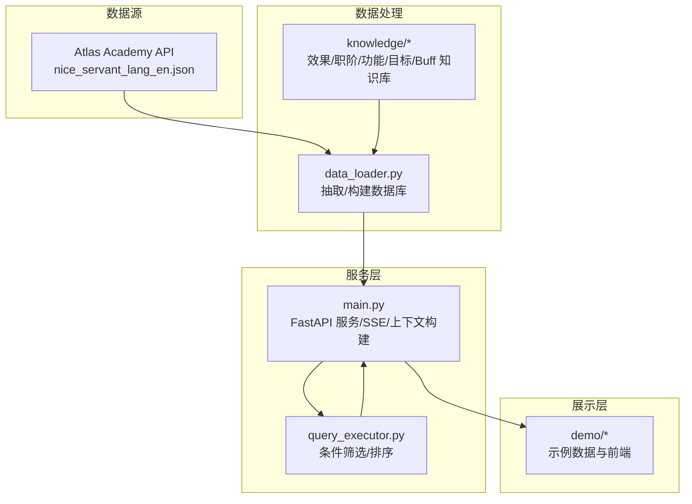
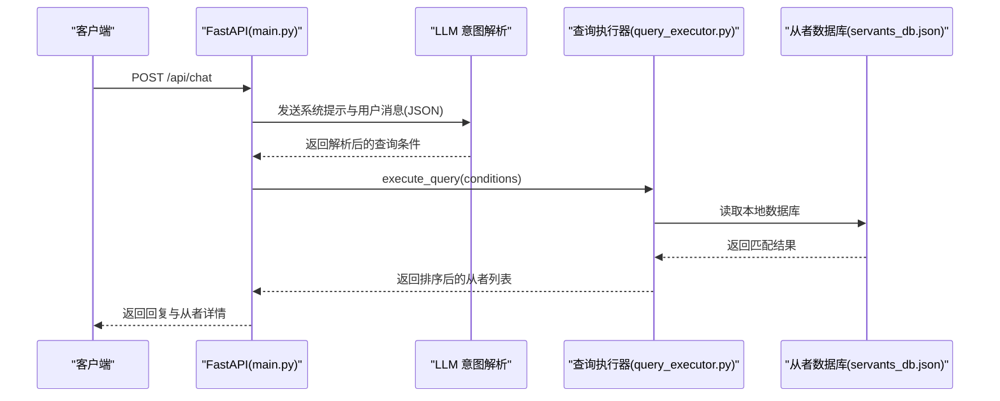
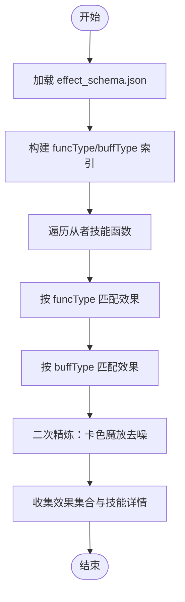
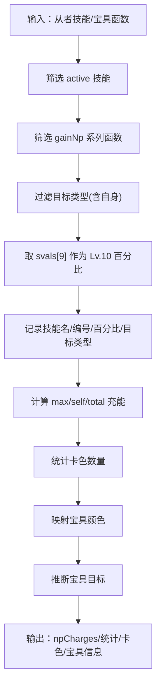
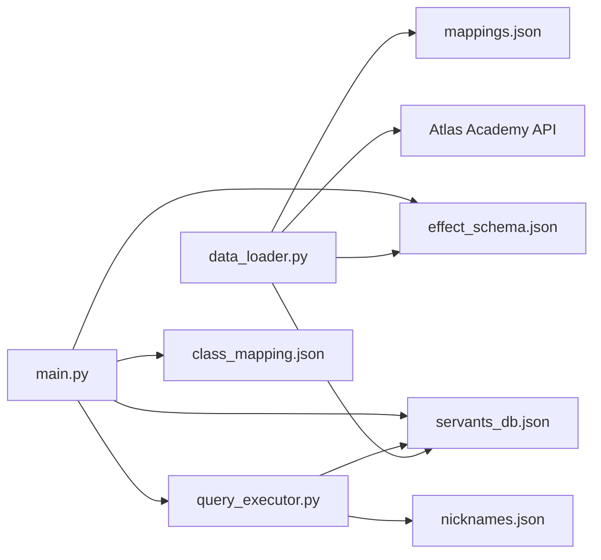

# 从者数据模型

<cite>
**本文引用的文件**
- [server/schemas.py](file://server/schemas.py)
- [server/data_loader.py](file://server/data_loader.py)
- [server/query_executor.py](file://server/query_executor.py)
- [server/main.py](file://server/main.py)
- [server/knowledge/effect_schema.json](file://server/knowledge/effect_schema.json)
- [server/knowledge/mappings.json](file://server/knowledge/mappings.json)
- [server/knowledge/class_mapping.json](file://server/knowledge/class_mapping.json)
- [server/knowledge/func_types.json](file://server/knowledge/func_types.json)
- [server/knowledge/func_target_types.json](file://server/knowledge/func_target_types.json)
- [server/knowledge/buff_types.json](file://server/knowledge/buff_types.json)
- [demo/data/servants_np_charge.json](file://demo/data/servants_np_charge.json)
- [tests/test_query_executor.py](file://tests/test_query_executor.py)
</cite>

## 目录
1. [简介](#简介)
2. [项目结构](#项目结构)
3. [核心组件](#核心组件)
4. [架构总览](#架构总览)
5. [详细组件分析](#详细组件分析)
6. [依赖关系分析](#依赖关系分析)
7. [性能考量](#性能考量)
8. [故障排查指南](#故障排查指南)
9. [结论](#结论)
10. [附录](#附录)

## 简介
本文件系统性梳理 Laplace 项目中的“从者数据模型”，覆盖基础属性、技能效果映射、NP 充能与配卡信息、数据来源与获取流程、JSON 示例与字段说明、数据验证规则与约束、以及数据转换与映射的实现细节。目标是帮助开发者与使用者快速理解并正确使用从者数据。

## 项目结构
Laplace 的服务端围绕“从者数据库 + LLM 意图解析 + 查询执行器”的模式组织：
- 数据层：从 Atlas Academy API 拉取全量从者数据，经清洗与抽取后生成本地通用数据库。
- 知识层：效果分类、职阶映射、功能类型、目标类型、Buff 类型等知识库。
- 服务层：FastAPI 提供聊天与流式接口；查询执行器负责条件筛选与排序。
- 展示层：前端 demo 提供示例数据与交互界面。

图表来源
- [server/data_loader.py:91-359](file://server/data_loader.py#L91-L359)
- [server/main.py:144-365](file://server/main.py#L144-L365)
- [server/query_executor.py:41-116](file://server/query_executor.py#L41-L116)

章节来源
- [server/data_loader.py:1-363](file://server/data_loader.py#L1-L363)
- [server/main.py:1-365](file://server/main.py#L1-L365)
- [server/query_executor.py:1-343](file://server/query_executor.py#L1-L343)

## 核心组件
- 从者基础属性：ID、收藏编号、名称（英文/中文/日文）、稀有度、职阶、性别、阵营、头像 URL、特性 ID 列表。
- 技能效果：技能效果集合与技能详情（含效果类型、目标类型）。
- NP 充能：自充/群充百分比、最大自充/群充、总自充、是否存在充能。
- 配卡与宝具：卡色构成（Arts/Buster/Quick 数量）、宝具颜色（Buster/Arts/Quick）、宝具目标（单体/全体/辅助）。
- 查询条件：数值比较、字符串匹配、效果集合、特性、性别、阵营、配卡、宝具颜色与目标等。

章节来源
- [server/data_loader.py:231-329](file://server/data_loader.py#L231-L329)
- [server/schemas.py:25-46](file://server/schemas.py#L25-L46)
- [server/query_executor.py:53-116](file://server/query_executor.py#L53-L116)

## 架构总览
从者数据从外部 API 拉取，经知识库映射与效果匹配，生成统一的内部数据库；服务端通过 LLM 意图解析得到查询条件，交由查询执行器进行筛选与排序，最终返回给前端或 SSE 客户端。

图表来源
- [server/main.py:150-242](file://server/main.py#L150-L242)
- [server/query_executor.py:53-116](file://server/query_executor.py#L53-L116)

## 详细组件分析

### 1) 基础属性与来源
- 来源：Atlas Academy API 的 nice_servant_lang_en.json，过滤 type=normal 且 collectionNo>0 的从者。
- 字段要点：
  - 基础标识：id、collectionNo、name、originalName、aliasCN、faceUrl
  - 基础属性：rarity、className、gender、attribute、traits
  - 配卡：cards（Arts/Buster/Quick 数量）
  - 宝具：npCard（Buster/Arts/Quick）、npTarget（one/all/support）

章节来源
- [server/data_loader.py:91-102](file://server/data_loader.py#L91-L102)
- [server/data_loader.py:296-321](file://server/data_loader.py#L296-L321)

### 2) 技能效果映射机制
- 效果来源：effect_schema.json 定义了效果名称、分类、funcTypes、buffTypes、中文别名。
- 匹配策略：
  - 通过 funcType 与 buffType 双通道匹配，构建效果索引。
  - 对“卡色魔放”进行二次精炼，避免通用枚举污染，确保“Arts/Quick/Buster”效果与具体卡色名称一致。
- 服务端翻译：main.py 内置效果代码到中文别名的映射，用于上下文构建与展示。

图表来源
- [server/data_loader.py:44-84](file://server/data_loader.py#L44-L84)
- [server/data_loader.py:181-228](file://server/data_loader.py#L181-L228)
- [server/data_loader.py:151-178](file://server/data_loader.py#L151-L178)
- [server/main.py:38-51](file://server/main.py#L38-L51)

章节来源
- [server/knowledge/effect_schema.json:1-694](file://server/knowledge/effect_schema.json#L1-L694)
- [server/data_loader.py:64-84](file://server/data_loader.py#L64-L84)
- [server/data_loader.py:181-228](file://server/data_loader.py#L181-L228)
- [server/data_loader.py:151-178](file://server/data_loader.py#L151-L178)
- [server/main.py:38-51](file://server/main.py#L38-L51)

### 3) NP 充能数据结构与配卡信息
- NP 充能抽取：
  - 仅统计 active 技能中的 gainNp 系列函数，目标类型限定为 self/ptAll/ptOne（含自身）。
  - 从 svals[9]（Lv.10）取值，单位百分比，记录技能名、技能编号、充能百分比与目标类型。
- 统计聚合：
  - maxSelfCharge/maxPartyCharge/totalSelfCharge/hasNpCharge
- 配卡与宝具：
  - cards：统计 Arts/Buster/Quick 的数量。
  - npCard：依据宝具卡色映射（1/2/3→Arts/Buster/Quick）。
  - npTarget：依据宝具函数的 funcTargetType 推断（enemyAll→all，enemy→one，否则→support）。

图表来源
- [server/data_loader.py:113-137](file://server/data_loader.py#L113-L137)
- [server/data_loader.py:231-329](file://server/data_loader.py#L231-L329)

章节来源
- [server/data_loader.py:113-137](file://server/data_loader.py#L113-L137)
- [server/data_loader.py:231-329](file://server/data_loader.py#L231-L329)

### 4) 数据来源与获取方式
- Atlas Academy API：NICE 从者导出数据，按地区语言版本提供。
- 本地构建：data_loader.py 拉取并构建本地 servants_db.json，同时加载 effect_schema.json、mappings.json 等知识库。
- 服务启动：main.py 在 startup 时预加载数据库，保证查询性能。

章节来源
- [server/data_loader.py:20-22](file://server/data_loader.py#L20-L22)
- [server/data_loader.py:332-359](file://server/data_loader.py#L332-L359)
- [server/main.py:144-147](file://server/main.py#L144-L147)

### 5) 查询条件与验证规则
- 查询条件定义于 schemas.py，包含：
  - 数值比较：npCharge、rarity
  - 字符串匹配：className、name、names（多从者对比）
  - 效果筛选：skillEffect、skillEffects（支持 and/or）
  - 目标类型：targetType（self/party/enemy）
  - 特性：traits/excludeTraits
  - 性别/阵营：gender、attribute
  - 配卡：cards（字典）
  - 宝具：npCard、npTarget
- 字段校验：
  - 空字符串转 None、空列表/字典转 None、多从者 names 去空过滤。
- 执行器规则：
  - 多从者对比：逐个 name 查询，去重并按 rarity/collectionNo 排序。
  - 名称匹配：支持英文/中文/日文与昵称映射，分级模糊匹配。
  - 效果匹配：先集合快速判断，再按技能详情与目标类型二次确认。
  - 充能匹配：精确百分比或范围比较(hasNpCharge 为前提)。

章节来源
- [server/schemas.py:25-77](file://server/schemas.py#L25-L77)
- [server/query_executor.py:53-116](file://server/query_executor.py#L53-L116)
- [server/query_executor.py:119-299](file://server/query_executor.py#L119-L299)
- [tests/test_query_executor.py:123-171](file://tests/test_query_executor.py#L123-L171)

### 6) 数据转换与映射实现细节
- 效果翻译：effect_schema.json 中的 aliases_zh 作为效果中文别名，main.py 构建效果代码到中文的映射表。
- 职阶映射：class_mapping.json 提供职阶枚举与标签，main.py 提供中文展示映射。
- 名称映射：mappings.json 提供原名到中文的多语言映射；nicknames.json 提供昵称到正式名与职阶的映射。
- 功能/目标/Buff 类型：func_types.json、func_target_types.json、buff_types.json 提供枚举值，用于效果匹配与分类。

章节来源
- [server/main.py:27-34](file://server/main.py#L27-L34)
- [server/main.py:38-51](file://server/main.py#L38-L51)
- [server/knowledge/class_mapping.json:1-478](file://server/knowledge/class_mapping.json#L1-L478)
- [server/knowledge/mappings.json:1-800](file://server/knowledge/mappings.json#L1-L800)
- [server/knowledge/func_types.json:1-527](file://server/knowledge/func_types.json#L1-L527)
- [server/knowledge/func_target_types.json:1-147](file://server/knowledge/func_target_types.json#L1-L147)
- [server/knowledge/buff_types.json:1-991](file://server/knowledge/buff_types.json#L1-L991)

### 7) JSON 示例与字段说明
- 示例文件：demo/data/servants_np_charge.json 展示了按充能百分比查询的结果结构（包含 query 描述、计数、从者列表等）。
- 从者条目字段（来自本地数据库）：
  - 基础：id、collectionNo、name、originalName、aliasCN、faceUrl、rarity、className、gender、attribute、traits
  - 技能：skillEffects（效果集合）、skillDetails（技能名/编号/效果列表）
  - NP：npCharges（技能充能详情）、maxSelfCharge、maxPartyCharge、totalSelfCharge、hasNpCharge
  - 配卡与宝具：cards（Arts/Buster/Quick 数量）、npCard、npTarget

章节来源
- [demo/data/servants_np_charge.json:1-800](file://demo/data/servants_np_charge.json#L1-L800)
- [server/data_loader.py:296-321](file://server/data_loader.py#L296-L321)

## 依赖关系分析
- data_loader 依赖 effect_schema.json、mappings.json、Atlas API。
- main.py 依赖 knowledge 下的效果/职阶/翻译知识库，以及 query_executor 的数据库。
- query_executor 依赖本地 servants_db.json 与 knowledge 的昵称映射。
- 测试覆盖了查询执行器的关键行为，包括多从者对比、效果 AND/OR、特性与配卡筛选等。

图表来源
- [server/data_loader.py:44-61](file://server/data_loader.py#L44-L61)
- [server/main.py:144-147](file://server/main.py#L144-L147)
- [server/query_executor.py:41-50](file://server/query_executor.py#L41-L50)

章节来源
- [server/data_loader.py:44-61](file://server/data_loader.py#L44-L61)
- [server/query_executor.py:41-50](file://server/query_executor.py#L41-L50)
- [server/main.py:144-147](file://server/main.py#L144-L147)

## 性能考量
- 预加载数据库：服务启动时一次性加载本地数据库，避免每次查询重复 IO。
- 查询优化：
  - 先用集合快速判断 skillEffects 是否包含目标效果，再进入技能详情与目标类型匹配。
  - 多从者对比采用去重与排序，控制返回规模。
- 限制返回数量：前端默认最多返回 50 条结果，避免响应过大。

章节来源
- [server/main.py:144-147](file://server/main.py#L144-L147)
- [server/query_executor.py:302-327](file://server/query_executor.py#L302-L327)
- [server/main.py:56-57](file://server/main.py#L56-L57)
- [server/main.py:233-234](file://server/main.py#L233-L234)

## 故障排查指南
- 无法连接 LLM 或解析失败：chat 接口捕获异常并返回降级提示；检查模型配置与网络。
- 未找到效果翻译：effect_schema.json 缺失或未加载，检查 knowledge 目录与路径。
- 未加载数据库：startup 未触发或文件不存在，检查 data_loader 是否成功生成 servants_db.json。
- 查询结果为空：
  - 检查 npCharge 的 op/value 与 hasNpCharge 条件。
  - 检查 skillEffect/targetType 是否与 skillDetails 中的实际效果一致。
  - 检查 names 与昵称映射是否正确。
- 配卡/宝具筛选不生效：确认 cards 字典键（arts/buster/quick）与 npCard/npTarget 的取值。

章节来源
- [server/main.py:157-174](file://server/main.py#L157-L174)
- [server/main.py:204-221](file://server/main.py#L204-L221)
- [server/query_executor.py:122-146](file://server/query_executor.py#L122-L146)
- [server/query_executor.py:302-327](file://server/query_executor.py#L302-L327)
- [tests/test_query_executor.py:123-171](file://tests/test_query_executor.py#L123-L171)

## 结论
Laplace 的从者数据模型以“效果映射 + NP 充能 + 配卡/宝具”为核心，结合 Atlas Academy API 与本地知识库，形成稳定、可扩展的数据结构。通过严格的字段校验、多级匹配与预加载策略，既保证了查询效率，也提升了用户体验。建议在扩展新功能时遵循现有映射与校验规则，确保数据一致性与可维护性。

## 附录

### A. 从者基础属性字段清单
- 标识：id、collectionNo
- 名称：name、originalName、aliasCN、faceUrl
- 基础属性：rarity、className、gender、attribute、traits
- 技能：skillEffects、skillDetails
- NP：npCharges、maxSelfCharge、maxPartyCharge、totalSelfCharge、hasNpCharge
- 配卡与宝具：cards、npCard、npTarget

章节来源
- [server/data_loader.py:296-321](file://server/data_loader.py#L296-L321)

### B. 技能效果映射字段说明
- 效果名称：effect_schema.json 中的 name
- 分类：attack/defence/debuff/others
- funcTypes/buffTypes：用于匹配的类型集合
- 中文别名：aliases_zh，用于展示与上下文构建

章节来源
- [server/knowledge/effect_schema.json:1-694](file://server/knowledge/effect_schema.json#L1-L694)
- [server/main.py:38-51](file://server/main.py#L38-L51)

### C. NP 充能与配卡字段说明
- npCharges：技能充能详情数组（技能名、技能编号、百分比、目标类型）
- maxSelfCharge/maxPartyCharge/totalSelfCharge：聚合统计
- hasNpCharge：是否存在充能
- cards：Arts/Buster/Quick 数量
- npCard：宝具颜色
- npTarget：宝具目标（one/all/support）

章节来源
- [server/data_loader.py:113-137](file://server/data_loader.py#L113-L137)
- [server/data_loader.py:231-329](file://server/data_loader.py#L231-L329)

### D. 查询条件与示例
- 数值比较：npCharge、rarity（op: eq/gte/lte/gt/lt）
- 字符串匹配：className、name、names
- 效果筛选：skillEffect、skillEffects（and/or）
- 目标类型：targetType
- 特性：traits/excludeTraits
- 性别/阵营：gender、attribute
- 配卡：cards（如 {"arts": 3}）
- 宝具：npCard、npTarget

章节来源
- [server/schemas.py:25-46](file://server/schemas.py#L25-L46)
- [tests/test_query_executor.py:123-171](file://tests/test_query_executor.py#L123-L171)