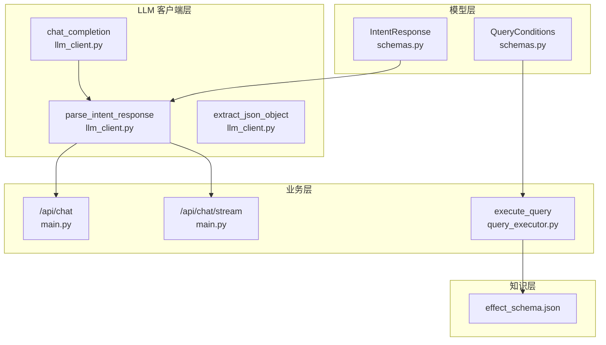
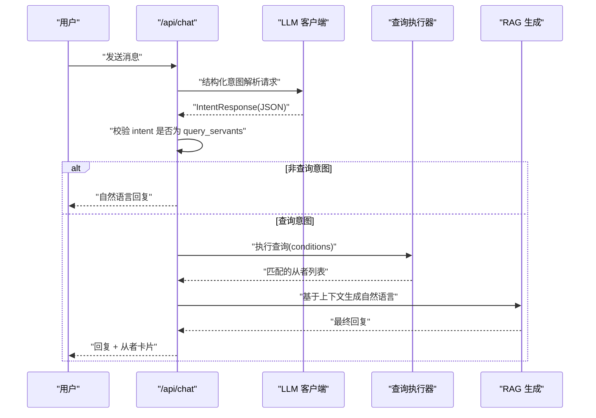
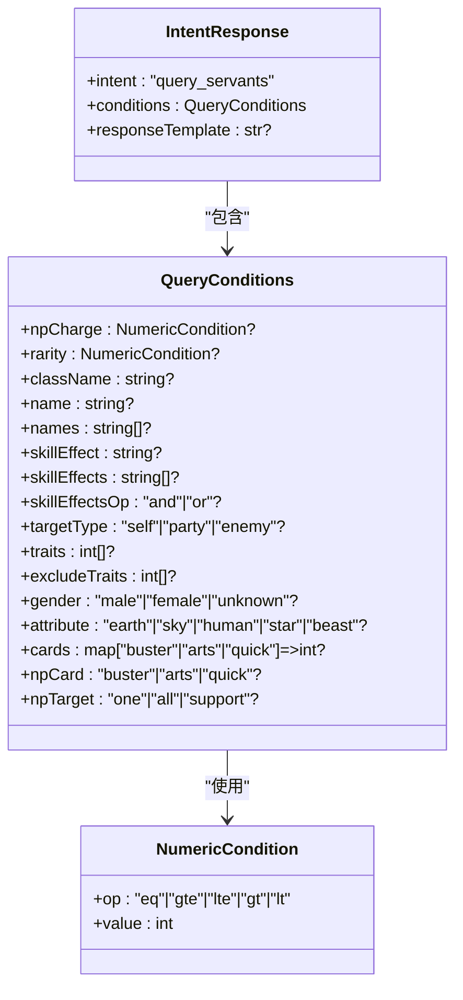
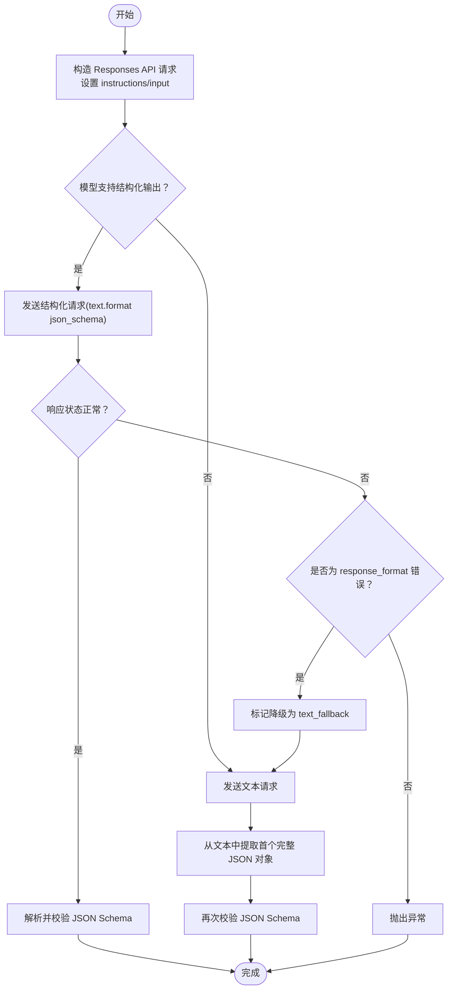
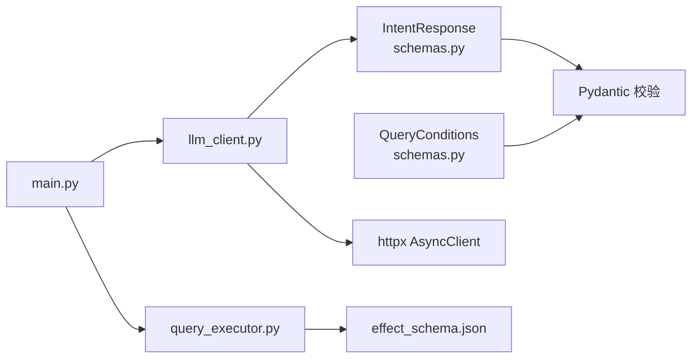

# 意图解析响应模型

<cite>
**本文引用的文件**
- [schemas.py](file://server/schemas.py)
- [llm_client.py](file://server/llm_client.py)
- [prompts.py](file://server/prompts.py)
- [main.py](file://server/main.py)
- [query_executor.py](file://server/query_executor.py)
- [logger.py](file://server/logger.py)
- [effect_schema.json](file://server/knowledge/effect_schema.json)
- [test_llm_client.py](file://tests/test_llm_client.py)
</cite>

## 目录
1. [简介](#简介)
2. [项目结构](#项目结构)
3. [核心组件](#核心组件)
4. [架构总览](#架构总览)
5. [详细组件分析](#详细组件分析)
6. [依赖分析](#依赖分析)
7. [性能考量](#性能考量)
8. [故障排查指南](#故障排查指南)
9. [结论](#结论)
10. [附录](#附录)

## 简介
本文件围绕 Laplace 项目的“意图解析响应模型”进行系统化说明，重点覆盖 IntentResponse 类的结构、LLM 意图解析的输出格式与验证机制、responseTemplate 字段的用途与使用场景、JSON Schema 验证规则与 OpenAI 兼容响应格式、意图解析示例与最佳实践、模型扩展性与版本控制机制，以及错误处理与降级策略。文档旨在帮助开发者与产品人员快速理解并正确使用该模型，同时为后续演进提供参考。

## 项目结构
Laplace 的服务端采用分层设计：
- 模型层：定义 IntentResponse 与 QueryConditions 的 Pydantic 模型，用于结构化意图解析与条件校验。
- LLM 客户端层：封装 Responses API 调用、结构化输出与降级流程，负责将 LLM 输出解析为结构化 JSON。
- 业务层：主路由与流式接口，负责意图解析、查询执行、RAG 生成与降级回退。
- 知识层：效果词典、职阶映射、昵称映射等，支撑条件解析与自然语言生成。

图表来源
- [schemas.py:79-91](file://server/schemas.py#L79-L91)
- [llm_client.py:41-132](file://server/llm_client.py#L41-L132)
- [main.py:150-242](file://server/main.py#L150-L242)
- [query_executor.py:53-116](file://server/query_executor.py#L53-L116)
- [effect_schema.json:1-694](file://server/knowledge/effect_schema.json#L1-L694)

章节来源
- [schemas.py:1-92](file://server/schemas.py#L1-L92)
- [llm_client.py:1-254](file://server/llm_client.py#L1-L254)
- [main.py:1-365](file://server/main.py#L1-L365)
- [query_executor.py:1-343](file://server/query_executor.py#L1-L343)
- [effect_schema.json:1-694](file://server/knowledge/effect_schema.json#L1-L694)

## 核心组件
- IntentResponse：LLM 第一阶段意图解析的结构化输出模型，包含固定 intent 字段、conditions 条件对象与可选 responseTemplate。
- QueryConditions：查询条件集合，涵盖 NP 自充、稀有度、职阶、名称、技能效果、特性、性别、阵营、指令卡、宝具颜色与目标类型等。
- LLM 客户端：通过 Responses API 发起请求，优先使用结构化输出（text.format json_schema），并在不支持时自动降级为文本模式。
- 主路由与流式接口：负责意图解析、查询执行、RAG 生成与降级回退，记录链路日志。

章节来源
- [schemas.py:79-91](file://server/schemas.py#L79-L91)
- [schemas.py:25-77](file://server/schemas.py#L25-L77)
- [llm_client.py:41-132](file://server/llm_client.py#L41-L132)
- [main.py:150-242](file://server/main.py#L150-L242)

## 架构总览
意图解析与查询执行的整体流程如下：
1. 用户输入经系统提示词与用户消息构造 Responses API 请求。
2. LLM 返回结构化 JSON（首选 json_schema），客户端解析并校验。
3. 若 intent 不为 query_servants，则直接返回自然语言回复。
4. 若 intent 为 query_servants，则将 conditions 交由查询执行器筛选数据。
5. 基于检索结果生成自然语言回复，若 LLM 生成失败则回退到模板化回复。

图表来源
- [main.py:150-242](file://server/main.py#L150-L242)
- [llm_client.py:41-132](file://server/llm_client.py#L41-L132)
- [query_executor.py:53-116](file://server/query_executor.py#L53-L116)

## 详细组件分析

### IntentResponse 类结构与字段语义
- intent：固定值为 "query_servants"，表示当前只支持从者查询意图。
- conditions：QueryConditions 对象，承载所有查询条件。
- responseTemplate：可选字符串，用于在 RAG 生成失败时回退的模板化回复片段。

图表来源
- [schemas.py:79-91](file://server/schemas.py#L79-L91)
- [schemas.py:25-77](file://server/schemas.py#L25-L77)
- [schemas.py:16-23](file://server/schemas.py#L16-L23)

章节来源
- [schemas.py:79-91](file://server/schemas.py#L79-L91)
- [schemas.py:25-77](file://server/schemas.py#L25-L77)
- [schemas.py:16-23](file://server/schemas.py#L16-L23)

### LLM 意图解析输出格式与验证机制
- 输出格式：系统提示词要求严格 JSON，包含 intent 与 conditions 两部分；可选 responseTemplate。
- 验证机制：
  - 使用 JSON Schema（IntentResponse.model_json_schema）进行结构化校验。
  - 若模型不支持结构化输出，客户端会检测错误信息中的“response_format/json_schema/structured/schema”等关键字，触发降级。
  - 降级策略：切换为非结构化文本模式，再从返回文本中提取第一个完整 JSON 对象，进行二次校验。
- 错误处理：
  - 当 JSON 解析失败或 Schema 校验失败时抛出异常，上层捕获后进行降级或错误提示。

图表来源
- [llm_client.py:135-173](file://server/llm_client.py#L135-L173)
- [llm_client.py:176-183](file://server/llm_client.py#L176-L183)
- [llm_client.py:186-220](file://server/llm_client.py#L186-L220)
- [prompts.py:84-171](file://server/prompts.py#L84-L171)

章节来源
- [llm_client.py:135-173](file://server/llm_client.py#L135-L173)
- [llm_client.py:176-183](file://server/llm_client.py#L176-L183)
- [llm_client.py:186-220](file://server/llm_client.py#L186-L220)
- [prompts.py:84-171](file://server/prompts.py#L84-L171)

### responseTemplate 字段的用途与使用场景
- 用途：在 RAG 生成阶段失败时，作为模板化的回复片段，拼接检索结果总数与可选提示，保证用户体验。
- 使用场景：
  - 当 LLM 生成文本为空或异常时，主路由与流式接口会读取 responseTemplate（若存在），否则使用默认模板。
  - 在流式接口中，先推送卡片，再推送最终回复；若生成失败，同样回退到模板化回复。

章节来源
- [main.py:217-221](file://server/main.py#L217-L221)
- [main.py:326-330](file://server/main.py#L326-L330)
- [prompts.py:144-169](file://server/prompts.py#L144-L169)

### JSON Schema 验证规则与 OpenAI 兼容响应格式
- JSON Schema：由 IntentResponse.model_json_schema 生成，用于 Responses API 的 text.format json_schema。
- OpenAI 兼容：Responses API 使用 text.format 而非 response_format；客户端在请求中设置 strict: true，确保输出严格符合 schema。
- 字段约束：
  - intent 固定为 "query_servants"。
  - conditions 中各字段均为可选，空值统一转换为 null。
  - NumericCondition.op 支持 eq/gte/lte/gt/lt。
  - 多值字段（如 names、skillEffects、traits、excludeTraits、cards）在空集合时转换为 null。
  - 字段校验器对空白字符串、空集合、空字典进行规范化处理。

章节来源
- [schemas.py:89-91](file://server/schemas.py#L89-L91)
- [schemas.py:47-76](file://server/schemas.py#L47-L76)
- [llm_client.py:156-165](file://server/llm_client.py#L156-L165)

### 意图解析示例与最佳实践
- 示例来源：系统提示词中提供了多条用户输入与期望输出的示例，涵盖 NP 自充、技能效果、特性、指令卡、多从者对比等场景。
- 最佳实践：
  - 多从者对比使用 names 字段，单从者使用 name 字段，二者不可同时使用。
  - 当用户未提供某条件时，对应字段应设为 null，避免误判。
  - 使用 skillEffectsOp 控制多效果的逻辑关系（and/or），默认为 and。
  - 在生成阶段严格基于检索上下文回答，避免臆造数据。

章节来源
- [prompts.py:144-169](file://server/prompts.py#L144-L169)
- [prompts.py:78-82](file://server/prompts.py#L78-L82)
- [prompts.py:110-128](file://server/prompts.py#L110-L128)

### 模型扩展性与版本控制机制
- 扩展性：
  - 新增条件字段：在 QueryConditions 中添加新字段，并在系统提示词中补充说明与示例。
  - 新增意图：在 IntentResponse 中新增 intent 固定值，并在主路由中增加分支处理。
- 版本控制：
  - Responses API 已从 Chat Completions API 迁移至 Responses API，参数与结构发生变化，需在客户端适配。
  - 通过环境变量控制主模型与备用模型列表，便于灰度与回滚。
  - 日志记录包含使用的模型名与响应格式类型，便于追踪与审计。

章节来源
- [llm_client.py:7-12](file://server/llm_client.py#L7-L12)
- [llm_client.py:27-34](file://server/llm_client.py#L27-L34)
- [main.py:176-177](file://server/main.py#L176-L177)

## 依赖分析
- IntentResponse 依赖 Pydantic 的模型校验与 JSON Schema 生成。
- LLM 客户端依赖 httpx 进行异步请求，依赖环境变量配置模型与端点。
- 主路由依赖 LLM 客户端与查询执行器，日志模块记录链路信息。
- 查询执行器依赖知识库（效果词典、昵称映射）进行效果与名称匹配。

图表来源
- [schemas.py:79-91](file://server/schemas.py#L79-L91)
- [llm_client.py:22-22](file://server/llm_client.py#L22-L22)
- [main.py:18-19](file://server/main.py#L18-L19)
- [query_executor.py:14-15](file://server/query_executor.py#L14-L15)

章节来源
- [schemas.py:79-91](file://server/schemas.py#L79-L91)
- [llm_client.py:22-22](file://server/llm_client.py#L22-L22)
- [main.py:18-19](file://server/main.py#L18-L19)
- [query_executor.py:14-15](file://server/query_executor.py#L14-L15)

## 性能考量
- 结构化输出优先：通过 Responses API 的 text.format json_schema 减少后处理成本，提高稳定性。
- 降级策略：在不支持结构化输出时自动切换为文本模式，避免长时间等待。
- 查询优化：查询执行器对条件进行逐项匹配，注意避免不必要的全表扫描；可通过索引或预处理优化（当前实现为内存遍历）。
- 流式接口：SSE 分阶段推送，提升用户体验，减少首屏等待时间。

[本节为一般性指导，无需具体文件来源]

## 故障排查指南
- LLM 返回空内容或不含 JSON 对象：检查 extract_json_object 的容错逻辑，确认返回文本中是否存在 JSON。
- JSON Schema 校验失败：核对系统提示词与字段类型，确保输出严格符合 IntentResponse。
- 结构化输出不被支持：观察响应状态码与错误文本是否包含 response_format/json_schema 关键字，确认降级流程是否触发。
- RAG 生成失败：主路由与流式接口会回退到模板化回复；可在日志中查看最终回复与上下文。
- 健康检查：/api/health 返回服务状态，可用于快速判断服务可用性。

章节来源
- [llm_client.py:186-220](file://server/llm_client.py#L186-L220)
- [llm_client.py:176-183](file://server/llm_client.py#L176-L183)
- [llm_client.py:243-246](file://server/llm_client.py#L243-L246)
- [main.py:214-221](file://server/main.py#L214-L221)
- [main.py:324-330](file://server/main.py#L324-L330)
- [main.py:358-361](file://server/main.py#L358-L361)

## 结论
IntentResponse 作为 Laplace 意图解析的核心模型，通过严格的 JSON Schema 与系统提示词约束，确保 LLM 输出的结构化与一致性。配合 LLM 客户端的结构化输出与降级策略，以及主路由与查询执行器的稳健实现，形成了从意图解析到结果生成的完整闭环。未来可在结构化输出的稳定性、查询性能与日志可观测性方面持续优化。

[本节为总结性内容，无需具体文件来源]

## 附录
- 测试用例覆盖：
  - parse_intent_response：支持纯 JSON、带代码块围栏与前后文本的 JSON。
  - chat_completion：结构化输出优先、降级回退、备用模型轮询。
- 知识库：
  - effect_schema.json 提供效果名称与中文别名映射，支撑系统提示词与查询执行器的效果匹配。

章节来源
- [test_llm_client.py:79-150](file://tests/test_llm_client.py#L79-L150)
- [effect_schema.json:1-694](file://server/knowledge/effect_schema.json#L1-L694)