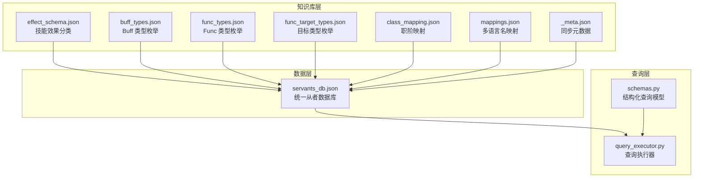
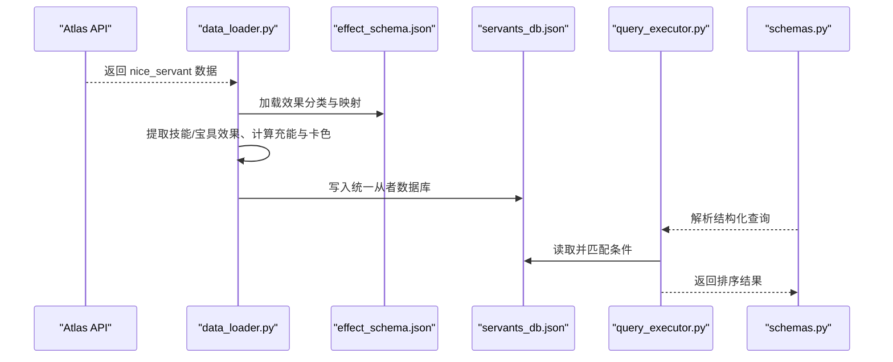
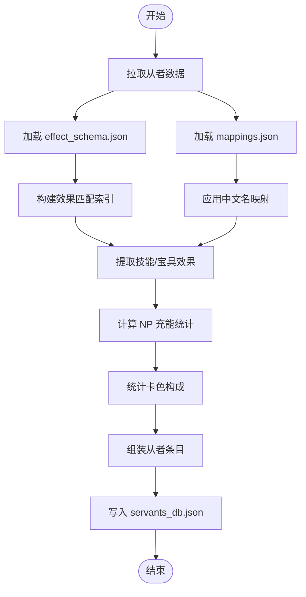
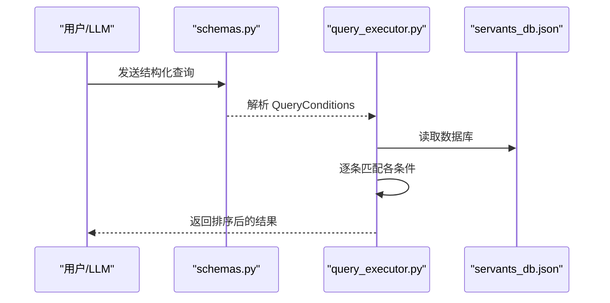
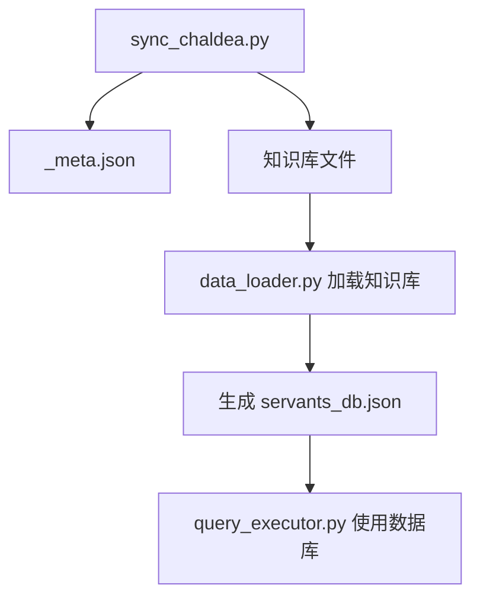
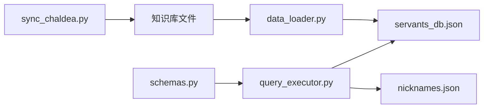

# 数据模型

<cite>
**本文引用的文件**
- [server/data_loader.py](file://server/data_loader.py)
- [server/sync_chaldea.py](file://server/sync_chaldea.py)
- [server/schemas.py](file://server/schemas.py)
- [server/query_executor.py](file://server/query_executor.py)
- [server/knowledge/_meta.json](file://server/knowledge/_meta.json)
- [server/knowledge/effect_schema.json](file://server/knowledge/effect_schema.json)
- [server/knowledge/buff_types.json](file://server/knowledge/buff_types.json)
- [server/knowledge/func_types.json](file://server/knowledge/func_types.json)
- [server/knowledge/func_target_types.json](file://server/knowledge/func_target_types.json)
- [server/knowledge/class_mapping.json](file://server/knowledge/class_mapping.json)
- [server/knowledge/mappings.json](file://server/knowledge/mappings.json)
- [server/knowledge/nicknames.json](file://server/knowledge/nicknames.json)
- [server/data/servants_db.json](file://server/data/servants_db.json)
- [demo/data/servants_np_charge.json](file://demo/data/servants_np_charge.json)
- [tests/test_query_executor.py](file://tests/test_query_executor.py)
</cite>

## 目录
1. [简介](#简介)
2. [项目结构](#项目结构)
3. [核心组件](#核心组件)
4. [架构总览](#架构总览)
5. [详细组件分析](#详细组件分析)
6. [依赖关系分析](#依赖关系分析)
7. [性能考量](#性能考量)
8. [故障排查指南](#故障排查指南)
9. [结论](#结论)
10. [附录](#附录)

## 简介
本文件系统性梳理 Laplace 项目的数据模型，围绕以下主题展开：
- 从者数据结构：基础属性、技能效果映射、配卡信息、宝具目标与颜色等
- 查询条件的数据模型：结构化查询格式、校验规则与执行策略
- 知识库的数据模型：技能效果分类体系、职阶映射系统、中文别名对照
- 数据验证机制与约束条件
- 数据的生命周期管理与版本控制
- 数据转换与映射的实现细节
- 数据模型之间的关系与依赖

## 项目结构
Laplace 的数据模型由三层组成：
- 知识库层：从 Chaldea 源码镜像抽取的枚举与效果分类，生成稳定的 JSON 知识库
- 数据层：从 Atlas Academy API 拉取的全量从者数据，经清洗与特征提取后生成统一的 servants_db.json
- 查询层：基于 Pydantic 的结构化查询模型，配合执行器进行条件筛选与排序



图表来源
- [server/sync_chaldea.py:308-418](file://server/sync_chaldea.py#L308-L418)
- [server/data_loader.py:44-52](file://server/data_loader.py#L44-L52)
- [server/schemas.py:16-65](file://server/schemas.py#L16-L65)
- [server/query_executor.py:53-87](file://server/query_executor.py#L53-L87)

章节来源
- [server/sync_chaldea.py:308-418](file://server/sync_chaldea.py#L308-L418)
- [server/data_loader.py:44-52](file://server/data_loader.py#L44-L52)
- [server/schemas.py:16-65](file://server/schemas.py#L16-L65)
- [server/query_executor.py:53-87](file://server/query_executor.py#L53-L87)

## 核心组件
- 从者数据模型（servants_db.json）
  - 基础属性：id、collectionNo、name、originalName、aliasCN、rarity、className、faceUrl、traits、gender、attribute
  - 卡牌与宝具：cards（三色数量）、npCard（宝具颜色）、npTarget（宝具目标类型）
  - NP 充能：npCharges（技能触发的自充/群充明细）、maxSelfCharge、maxPartyCharge、totalSelfCharge、hasNpCharge
  - 技能与效果：skillEffects（去重的效果集合）、npEffects（宝具附带效果）、skillDetails（按技能聚合的效果明细）
- 查询条件模型（schemas.py）
  - 数值比较条件 NumericCondition（op: eq/gte/lte/gt/lt, value）
  - 查询条件 QueryConditions：npCharge、rarity、className、name、skillEffect、skillEffects、skillEffectsOp、targetType、traits、excludeTraits、gender、attribute、cards、npCard、npTarget
  - 字段校验：空白字符串转 None、空数组/空字典转 None
- 查询执行器（query_executor.py）
  - 加载本地数据库与昵称映射
  - 逐条匹配：NP 充能、稀有度、职阶、名称（含昵称映射与规范化）、单/多效果、特性、性别、阵营、配卡、宝具颜色、宝具目标
  - 排序：按稀有度降序、collectionNo 升序

章节来源
- [server/data/servants_db.json:1-200](file://server/data/servants_db.json#L1-L200)
- [server/schemas.py:16-65](file://server/schemas.py#L16-L65)
- [server/query_executor.py:53-87](file://server/query_executor.py#L53-L87)

## 架构总览
下图展示了从者数据从抓取、清洗、知识库映射到查询执行的完整链路。



图表来源
- [server/data_loader.py:91-102](file://server/data_loader.py#L91-L102)
- [server/data_loader.py:231-329](file://server/data_loader.py#L231-L329)
- [server/sync_chaldea.py:354-363](file://server/sync_chaldea.py#L354-L363)
- [server/query_executor.py:53-87](file://server/query_executor.py#L53-L87)
- [server/schemas.py:68-80](file://server/schemas.py#L68-L80)

## 详细组件分析

### 从者数据结构（servants_db.json）
- 关键字段说明
  - 基础信息：id、collectionNo、name、originalName、aliasCN、rarity、className、faceUrl、traits、gender、attribute
  - 卡牌与宝具：cards（arts/buster/quick 数量）、npCard（buster/arts/quick）、npTarget（one/all/support）
  - NP 充能：npCharges（含技能名、技能编号、百分比、数值、目标类型）、maxSelfCharge、maxPartyCharge、totalSelfCharge、hasNpCharge
  - 技能与效果：skillEffects（效果名集合）、npEffects（宝具效果集合）、skillDetails（按技能分组的效果明细，含 funcType、targetType）
- 数据来源与生成流程
  - 从 Atlas API 拉取全量从者数据
  - 加载 effect_schema.json 与 mappings.json
  - 提取技能/宝具效果，构建效果匹配索引
  - 计算 NP 充能统计与卡色构成
  - 生成统一的 servants_db.json



图表来源
- [server/data_loader.py:91-102](file://server/data_loader.py#L91-L102)
- [server/data_loader.py:44-52](file://server/data_loader.py#L44-L52)
- [server/data_loader.py:64-84](file://server/data_loader.py#L64-L84)
- [server/data_loader.py:181-228](file://server/data_loader.py#L181-L228)
- [server/data_loader.py:231-329](file://server/data_loader.py#L231-L329)

章节来源
- [server/data_loader.py:91-102](file://server/data_loader.py#L91-L102)
- [server/data_loader.py:44-52](file://server/data_loader.py#L44-L52)
- [server/data_loader.py:64-84](file://server/data_loader.py#L64-L84)
- [server/data_loader.py:181-228](file://server/data_loader.py#L181-L228)
- [server/data_loader.py:231-329](file://server/data_loader.py#L231-L329)

### 查询条件数据模型（schemas.py）
- NumericCondition：数值比较条件，支持 op 与 value
- QueryConditions：结构化查询字段
  - npCharge、rarity：NumericCondition
  - className、name：字符串
  - skillEffect：单效果名
  - skillEffects：效果名列表，配合 skillEffectsOp（and/or）
  - targetType：目标类型（self/party/enemy）
  - traits、excludeTraits：特性 ID 列表
  - gender：枚举（male/female/unknown）
  - attribute：枚举（earth/sky/human/star/beast）
  - cards：字典（如 {"buster": 3}）
  - npCard、npTarget：宝具相关枚举
- 校验规则
  - 空字符串转 None
  - 空数组/空字典转 None

```mermaid
classDiagram
class NumericCondition {
+op : "eq|gte|lte|gt|lt"
+value : int
}
class QueryConditions {
+npCharge : NumericCondition?
+rarity : NumericCondition?
+className : string?
+name : string?
+skillEffect : string?
+skillEffects : string[]?
+skillEffectsOp : "and|or"?
+targetType : "self|party|enemy"?
+traits : int[]?
+excludeTraits : int[]?
+gender : "male|female|unknown"?
+attribute : "earth|sky|human|star|beast"?
+cards : {"buster|arts|quick" : int}?
+npCard : "buster|arts|quick"?
+npTarget : "one|all|support"?
}
class IntentResponse {
+intent : "query_servants"
+conditions : QueryConditions
+responseTemplate : string?
}
```

图表来源
- [server/schemas.py:16-65](file://server/schemas.py#L16-L65)
- [server/schemas.py:68-80](file://server/schemas.py#L68-L80)

章节来源
- [server/schemas.py:16-65](file://server/schemas.py#L16-L65)
- [server/schemas.py:68-80](file://server/schemas.py#L68-L80)

### 查询执行器（query_executor.py）
- 加载本地数据库与昵称映射，全局缓存
- 条件匹配顺序
  - NP 充能：exact/gte/gt/lte
  - 稀有度：比较运算
  - 职阶：大小写无关相等
  - 名称：支持昵称映射与规范化（去除空格/符号、小写）
  - 单/多效果：支持按 targetType 过滤
  - 特性：支持包含与排除
  - 性别/阵营：直接相等
  - 配卡：按类型与数量下限
  - 宝具颜色/目标：直接相等
- 排序：rarity 降序、collectionNo 升序



图表来源
- [server/schemas.py:68-80](file://server/schemas.py#L68-L80)
- [server/query_executor.py:53-87](file://server/query_executor.py#L53-L87)
- [server/query_executor.py:90-261](file://server/query_executor.py#L90-L261)

章节来源
- [server/query_executor.py:53-87](file://server/query_executor.py#L53-L87)
- [server/query_executor.py:90-261](file://server/query_executor.py#L90-L261)

### 知识库数据模型
- effect_schema.json：技能效果分类体系
  - categories：attack、defence、debuff、others
  - effects：每个效果包含 name、category、funcTypes、buffTypes、aliases_zh
- buff_types.json：Buff 类型枚举
- func_types.json：Func 类型枚举
- func_target_types.json：目标类型枚举
- class_mapping.json：职阶映射（含 playable/all、label/baseClassId 等）
- mappings.json：多语言名映射（svt_names、traits）
- nicknames.json：昵称映射（用于名称模糊匹配）

```mermaid
erDiagram
EFFECT_SCHEMA {
string name
string category
string[] funcTypes
string[] buffTypes
string[] aliases_zh
}
BUFF_TYPES {
string name
int value
}
FUNC_TYPES {
string name
int value
}
FUNC_TARGET_TYPES {
string name
int value
}
CLASS_MAPPING {
string enumName
string source
int totalCount
int playableCount
string[] playable
string[] all
}
MAPPINGS {
map svt_names
map traits
}
NICKNAMES {
string[] keys
string|map values
}
EFFECT_SCHEMA ||--o{ BUFF_TYPES : "buffTypes"
EFFECT_SCHEMA ||--o{ FUNC_TYPES : "funcTypes"
```

图表来源
- [server/knowledge/effect_schema.json:1-694](file://server/knowledge/effect_schema.json#L1-L694)
- [server/knowledge/buff_types.json:1-200](file://server/knowledge/buff_types.json#L1-L200)
- [server/knowledge/func_types.json:1-200](file://server/knowledge/func_types.json#L1-L200)
- [server/knowledge/func_target_types.json:1-147](file://server/knowledge/func_target_types.json#L1-L147)
- [server/knowledge/class_mapping.json:1-478](file://server/knowledge/class_mapping.json#L1-L478)
- [server/knowledge/mappings.json:1-800](file://server/knowledge/mappings.json#L1-L800)
- [server/knowledge/nicknames.json:1-51](file://server/knowledge/nicknames.json#L1-L51)

章节来源
- [server/knowledge/effect_schema.json:1-694](file://server/knowledge/effect_schema.json#L1-L694)
- [server/knowledge/buff_types.json:1-200](file://server/knowledge/buff_types.json#L1-L200)
- [server/knowledge/func_types.json:1-200](file://server/knowledge/func_types.json#L1-L200)
- [server/knowledge/func_target_types.json:1-147](file://server/knowledge/func_target_types.json#L1-L147)
- [server/knowledge/class_mapping.json:1-478](file://server/knowledge/class_mapping.json#L1-L478)
- [server/knowledge/mappings.json:1-800](file://server/knowledge/mappings.json#L1-L800)
- [server/knowledge/nicknames.json:1-51](file://server/knowledge/nicknames.json#L1-L51)

### 数据验证机制与约束
- Pydantic 校验
  - 空字符串/空数组/空字典自动归并为 None
  - 枚举字段严格限定取值范围
- 执行期校验
  - 名称匹配前进行规范化（去空白/符号、小写）
  - 昵称映射支持字符串或对象（可同时设置 name 与 className 等）
  - 多效果 AND/OR 组合
  - 特性包含/排除策略
- 数据完整性
  - effect_schema.json 缺失时仍可提取 NP 充能数据
  - mappings.json 缺失不影响基本流程，但会丢失中文名映射

章节来源
- [server/schemas.py:46-65](file://server/schemas.py#L46-L65)
- [server/query_executor.py:133-191](file://server/query_executor.py#L133-L191)
- [server/query_executor.py:193-227](file://server/query_executor.py#L193-L227)
- [server/data_loader.py:44-52](file://server/data_loader.py#L44-L52)

### 数据生命周期与版本控制
- 同步脚本（sync_chaldea.py）
  - 从 Chaldea 源码解析枚举与效果分类，生成知识库文件
  - 下载多语言映射与特性映射
  - 生成 _meta.json 记录同步时间、Chaldea 提交号与文件清单
- 数据加载（data_loader.py）
  - 依赖知识库进行效果匹配与中文名映射
  - 生成 servants_db.json
- 版本追踪
  - _meta.json 记录 syncedAt、chaldeaCommit、chaldeaPath、files
  - 便于审计与回滚



图表来源
- [server/sync_chaldea.py:308-418](file://server/sync_chaldea.py#L308-L418)
- [server/knowledge/_meta.json:1-12](file://server/knowledge/_meta.json#L1-L12)
- [server/data_loader.py:332-359](file://server/data_loader.py#L332-L359)

章节来源
- [server/sync_chaldea.py:308-418](file://server/sync_chaldea.py#L308-L418)
- [server/knowledge/_meta.json:1-12](file://server/knowledge/_meta.json#L1-L12)
- [server/data_loader.py:332-359](file://server/data_loader.py#L332-L359)

### 数据转换与映射
- 效果匹配
  - 通过 effect_schema.json 构建 funcType/buffType 到效果名的索引
  - 对卡色效果进行二次精炼，避免通用枚举污染
- 目标类型分类
  - 将 FuncTargetType 归类为 self/party/enemy/other
- 中文别名与多语言映射
  - effect_schema.json 内置 aliases_zh
  - mappings.json 提供多语言名映射
  - nicknames.json 提供昵称映射
- 配卡与宝具
  - cards：将数字编码映射为三色数量
  - npCard：将数字编码映射为颜色
  - npTarget：根据伤害函数推断（damage 系列）

章节来源
- [server/data_loader.py:64-84](file://server/data_loader.py#L64-L84)
- [server/data_loader.py:140-148](file://server/data_loader.py#L140-L148)
- [server/data_loader.py:248-288](file://server/data_loader.py#L248-L288)
- [server/knowledge/effect_schema.json:1-694](file://server/knowledge/effect_schema.json#L1-L694)
- [server/knowledge/mappings.json:1-800](file://server/knowledge/mappings.json#L1-L800)
- [server/knowledge/nicknames.json:1-51](file://server/knowledge/nicknames.json#L1-L51)

### 示例数据与用法
- 从者示例（servants_db.json）
  - 展示了基础属性、卡色、NP 充能、技能效果与技能明细
- 查询示例（demo/data/servants_np_charge.json）
  - 展示了按 NP 充能百分比与目标类型的查询结构
- 测试用例（tests/test_query_executor.py）
  - 展示了名称、稀有度、职阶、效果、特性、配卡、宝具目标等查询场景

章节来源
- [server/data/servants_db.json:1-200](file://server/data/servants_db.json#L1-L200)
- [demo/data/servants_np_charge.json:1-800](file://demo/data/servants_np_charge.json#L1-L800)
- [tests/test_query_executor.py:1-172](file://tests/test_query_executor.py#L1-L172)

## 依赖关系分析
- data_loader.py 依赖知识库文件进行效果匹配与中文名映射
- query_executor.py 依赖本地 servants_db.json 与 nicknames.json
- schemas.py 为查询层提供结构化契约，确保输入合法性
- sync_chaldea.py 生成知识库文件并记录 _meta.json



图表来源
- [server/sync_chaldea.py:308-418](file://server/sync_chaldea.py#L308-L418)
- [server/data_loader.py:44-52](file://server/data_loader.py#L44-L52)
- [server/query_executor.py:14-19](file://server/query_executor.py#L14-L19)
- [server/schemas.py:68-80](file://server/schemas.py#L68-L80)

章节来源
- [server/sync_chaldea.py:308-418](file://server/sync_chaldea.py#L308-L418)
- [server/data_loader.py:44-52](file://server/data_loader.py#L44-L52)
- [server/query_executor.py:14-19](file://server/query_executor.py#L14-L19)
- [server/schemas.py:68-80](file://server/schemas.py#L68-L80)

## 性能考量
- 缓存策略
  - query_executor.py 对数据库与昵称映射进行全局缓存，避免重复 IO
- 匹配优化
  - 先用 skillEffects 集合快速过滤，再按需检查 skillDetails
  - 目标类型筛选仅在需要时进行
- 排序成本
  - 结果集按 rarity/collectionNo 排序，建议在大规模数据下限制返回条数或增加分页

## 故障排查指南
- 知识库缺失
  - 若 effect_schema.json 不存在，data_loader.py 会提示并仅提取 NP 充能数据
- 名称匹配失败
  - 检查 mappings.json 与 nicknames.json 是否存在
  - 确认名称是否经过规范化（去空白/符号、小写）
- 效果匹配异常
  - 确认 effect_schema.json 中是否存在对应 funcTypes/buffTypes
  - 检查卡色效果的二次精炼逻辑是否符合预期
- 查询结果为空
  - 检查 QueryConditions 的 op/value 是否合理
  - 确认枚举字段（如 gender、attribute、npTarget）取值是否正确

章节来源
- [server/data_loader.py:44-52](file://server/data_loader.py#L44-L52)
- [server/query_executor.py:133-191](file://server/query_executor.py#L133-L191)
- [server/query_executor.py:264-289](file://server/query_executor.py#L264-L289)

## 结论
Laplace 的数据模型以稳定的知识库为基础，通过结构化的查询模型与高效的执行器，实现了对从者数据的多维度检索。其设计强调：
- 知识库与数据分离，便于版本控制与增量更新
- 查询模型强约束，保障输入合法性
- 执行器具备缓存与快速路径，兼顾易用性与性能
- 中文名映射与昵称系统提升用户体验

## 附录
- JSON Schema 定义（基于 Pydantic 模型导出）
  - IntentResponse.model_json_schema() 可作为 LLM 响应格式约束
- 示例数据
  - 从者样例：见 [server/data/servants_db.json:1-200](file://server/data/servants_db.json#L1-L200)
  - 充能查询样例：见 [demo/data/servants_np_charge.json:1-800](file://demo/data/servants_np_charge.json#L1-L800)
  - 测试用例：见 [tests/test_query_executor.py:1-172](file://tests/test_query_executor.py#L1-L172)