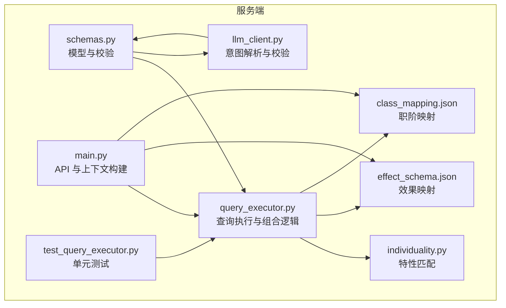
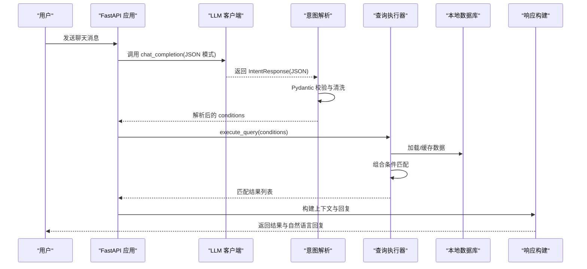
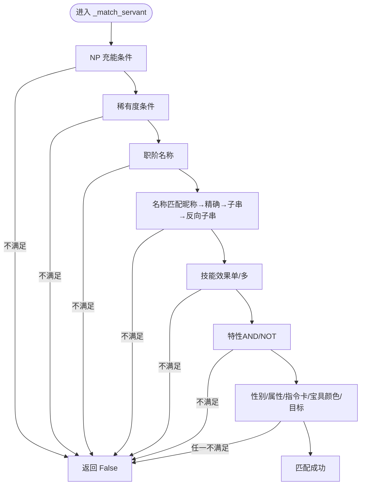
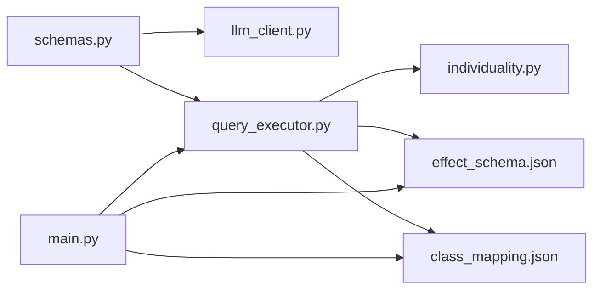

# 查询条件模型

<cite>
**本文引用的文件**
- [schemas.py](file://server/schemas.py)
- [query_executor.py](file://server/query_executor.py)
- [main.py](file://server/main.py)
- [test_query_executor.py](file://tests/test_query_executor.py)
- [effect_schema.json](file://server/knowledge/effect_schema.json)
- [class_mapping.json](file://server/knowledge/class_mapping.json)
- [individuality.py](file://server/individuality.py)
- [llm_client.py](file://server/llm_client.py)
</cite>

## 目录
1. [简介](#简介)
2. [项目结构](#项目结构)
3. [核心组件](#核心组件)
4. [架构总览](#架构总览)
5. [详细组件分析](#详细组件分析)
6. [依赖关系分析](#依赖关系分析)
7. [性能考量](#性能考量)
8. [故障排查指南](#故障排查指南)
9. [结论](#结论)
10. [附录](#附录)

## 简介
本文件系统化梳理 Laplace 项目的查询条件模型，重点围绕 QueryConditions 类及其字段定义，解释数值比较条件、字符串匹配、列表过滤等查询能力，并说明查询操作符 CompareOp 的使用方法。同时覆盖字段验证规则、空值处理机制、JSON Schema 定义与使用示例、查询条件的组合逻辑与优先级规则，帮助开发者与使用者快速理解并正确使用查询条件。

## 项目结构
查询条件模型主要分布在以下模块：
- 模型定义与校验：server/schemas.py
- 查询执行与组合逻辑：server/query_executor.py
- API 层对接与上下文构建：server/main.py
- 效果与职阶映射：server/knowledge/effect_schema.json、server/knowledge/class_mapping.json
- 特性匹配工具：server/individuality.py
- LLM 意图解析与校验：server/llm_client.py
- 单元测试：tests/test_query_executor.py

图表来源
- [schemas.py:13-91](file://server/schemas.py#L13-L91)
- [query_executor.py:53-342](file://server/query_executor.py#L53-L342)
- [main.py:60-105](file://server/main.py#L60-L105)
- [individuality.py:58-77](file://server/individuality.py#L58-L77)
- [effect_schema.json:1-694](file://server/knowledge/effect_schema.json#L1-L694)
- [class_mapping.json:1-478](file://server/knowledge/class_mapping.json#L1-L478)
- [llm_client.py:176-183](file://server/llm_client.py#L176-L183)
- [test_query_executor.py:1-172](file://tests/test_query_executor.py#L1-L172)

章节来源
- [schemas.py:13-91](file://server/schemas.py#L13-L91)
- [query_executor.py:53-342](file://server/query_executor.py#L53-L342)
- [main.py:60-105](file://server/main.py#L60-L105)

## 核心组件
- CompareOp：查询操作符枚举，支持 eq、gte、lte、gt、lt。
- NumericCondition：数值比较条件，包含 op 与 value 字段。
- QueryConditions：查询条件集合，包含 NP 充能、稀有度、职阶名称、名称、技能效果、目标类型、特性、性别、属性、指令卡数量、宝具颜色、宝具目标等字段。
- IntentResponse：LLM 意图解析响应模型，包含 intent、conditions、responseTemplate。
- JSON Schema：通过 IntentResponse.model_json_schema() 输出，用于 OpenAI-compatible response_format。

章节来源
- [schemas.py:13-91](file://server/schemas.py#L13-L91)
- [llm_client.py:176-183](file://server/llm_client.py#L176-L183)

## 架构总览
查询流程从 LLM 意图解析开始，经由 Pydantic 校验生成 QueryConditions，随后由查询执行器在本地数据库上进行筛选与排序，最终返回结果并构建上下文。

图表来源
- [main.py:150-242](file://server/main.py#L150-L242)
- [llm_client.py:176-183](file://server/llm_client.py#L176-L183)
- [query_executor.py:53-116](file://server/query_executor.py#L53-L116)

## 详细组件分析

### QueryConditions 结构与字段定义
- 数值比较条件
  - npCharge: NumericCondition | None：NP 充能百分比条件，支持 eq/gte/gt/lte。
  - rarity: NumericCondition | None：稀有度条件，支持 eq/gte/gt/lte。
- 字符串匹配条件
  - className: str | None：职阶名称（大小写不敏感）。
  - name: str | None：单从者名称（向后兼容），支持昵称映射与分级匹配。
  - names: list[str] | None：多从者对比（新增），自动过滤空字符串。
  - skillEffect: str | None：单效果筛选，可结合 targetType。
  - skillEffects: list[str] | None：多效果 AND/OR 组合筛选，配合 skillEffectsOp。
  - targetType: Literal["self","party","enemy"] | None：目标类型筛选。
- 列表过滤条件
  - traits: list[int] | None：必须具备的特性 ID 列表（AND）。
  - excludeTraits: list[int] | None：排斥特性 ID 列表（NOT）。
- 其他字段
  - gender: Literal["male","female","unknown"] | None：性别筛选。
  - attribute: Literal["earth","sky","human","star","beast"] | None：阵营/属性筛选。
  - cards: dict[Literal["buster","arts","quick"], int] | None：指令卡数量阈值（键为卡色，值为数量）。
  - npCard: Literal["buster","arts","quick"] | None：宝具颜色筛选。
  - npTarget: Literal["one","all","support"] | None：宝具目标/类型筛选。

字段验证与空值处理
- 字段清洗
  - className/name/skillEffect 在解析前将空白字符串转为 None。
  - names 列表过滤空字符串，若清理后为空则转为 None。
  - skillEffects/traits/excludeTraits 为空列表时转为 None。
  - cards 为空字典时转为 None。
- 多从者对比 names
  - 若提供 names，执行器会逐个 name 查询并去重，按 rarity 降序、collectionNo 升序排序。

章节来源
- [schemas.py:16-77](file://server/schemas.py#L16-L77)
- [query_executor.py:80-116](file://server/query_executor.py#L80-L116)

### NumericCondition 与 CompareOp
- NumericCondition
  - op: CompareOp，默认 eq。
  - value: int，默认 0。
- CompareOp
  - 支持 "eq"、"gte"、"lte"、"gt"、"lt"。
- 通用比较器
  - _compare(actual, op, expected) 实现五种比较关系。

章节来源
- [schemas.py:13-23](file://server/schemas.py#L13-L23)
- [query_executor.py:330-342](file://server/query_executor.py#L330-L342)

### 查询执行与组合逻辑
- 主入口 execute_query
  - 支持 names 多从者对比：逐个 name 查询，合并去重，按 rarity/collectionNo 排序。
  - 单从者查询或多条件筛选：遍历数据库，逐条匹配。
- 匹配顺序与优先级
  - NP 充能（hasNpCharge 为 False 直接剔除）
  - 稀有度
  - 职阶名称
  - 名称（昵称映射 → 精确匹配 → 子串模糊 → 反向子串）
  - 技能效果（单效果 OR 多效果 AND/OR）
  - 特性（AND：必须拥有；NOT：不能拥有）
  - 性别、属性、指令卡、宝具颜色、宝具目标
- 目标类型筛选
  - skillEffect 与 skillEffects 可指定 targetType，未命中则不匹配。
- 排序
  - 最终结果按 rarity 降序、collectionNo 升序排序。

图表来源
- [query_executor.py:119-299](file://server/query_executor.py#L119-L299)

章节来源
- [query_executor.py:53-299](file://server/query_executor.py#L53-L299)

### 特性匹配工具
- filter_by_traits(servant_traits, traits, exclude_traits)
  - 必须拥有（AND）：traits 中每个 ID 必须出现在 servant_traits。
  - 不能拥有（NOT）：excludeTraits 中任意 ID 出现在 servant_traits 则不匹配。
- divide_unsigned_and_signed 与 check_signed_individualities
  - 支持带符号特性（负数表示排斥）的更细粒度匹配。

章节来源
- [individuality.py:58-77](file://server/individuality.py#L58-L77)

### 名称匹配与昵称映射
- 规范化策略
  - 去除空白与常见分隔符，统一小写，便于匹配。
- 匹配策略
  - 阶段 1：昵称映射 → 精确匹配英文/中文/日文名称。
  - 阶段 2：长度≥2 时进行子串模糊匹配。
  - 阶段 3：反向子串匹配（特殊情况处理）。
- 额外过滤
  - 昵称映射支持附加过滤（如 className），用于限定匹配范围。

章节来源
- [query_executor.py:22-26](file://server/query_executor.py#L22-L26)
- [query_executor.py:162-229](file://server/query_executor.py#L162-L229)

### 技能效果与目标类型
- 单效果匹配
  - 先检查 skillEffects 集合，再按 targetType 进行细节匹配。
- 多效果组合
  - skillEffectsOp 默认 "and"（必须全部满足）；设置为 "or" 时只需满足其一。

章节来源
- [query_executor.py:231-257](file://server/query_executor.py#L231-L257)
- [query_executor.py:302-327](file://server/query_executor.py#L302-L327)

### JSON Schema 定义与使用
- IntentResponse JSON Schema
  - 通过 IntentResponse.model_json_schema() 输出，用于 OpenAI-compatible response_format。
  - 字段：intent（固定为 "query_servants"）、conditions（QueryConditions）、responseTemplate（可选）。
- LLM 意图解析
  - llm_client.parse_intent_response 对 LLM 返回进行 JSON 提取与 Pydantic 校验，失败抛出错误。

章节来源
- [schemas.py:79-91](file://server/schemas.py#L79-L91)
- [llm_client.py:176-183](file://server/llm_client.py#L176-L183)

### 使用示例（基于测试用例）
- NP 充能精确与大于等于
  - npCharge: {"op":"eq","value":30} 或 {"op":"gte","value":50}
- 稀有度与职阶
  - rarity: {"op":"eq","value":5}, className:"saber"
- 名称与昵称
  - name:"呆毛" → Altria Pendragon
  - name:"小教授" → James Moriarty
  - name:"水C呆"/"泳装阿尔托莉雅" → Altria Caster
- 单效果与目标类型
  - skillEffect:"upAtk", targetType:"party"
- 多效果 AND/OR
  - skillEffects:["avoidance","guts"]（AND）
  - skillEffects:["invincible","guts"], skillEffectsOp:"or"（OR）
- 特性与指令卡/宝具
  - traits:[300,303], excludeTraits:[1002]
  - cards:{"arts":3}, npCard:"arts"
  - npTarget:"support"

章节来源
- [test_query_executor.py:123-171](file://tests/test_query_executor.py#L123-L171)

## 依赖关系分析
- 模块耦合
  - schemas.py 与 llm_client.py 通过 IntentResponse 交互，前者定义结构，后者负责校验。
  - query_executor.py 依赖 knowledge 下的效果与职阶映射，以及 individuality.py 的特性匹配。
  - main.py 作为 API 入口，协调 LLM、查询执行与上下文构建。
- 外部依赖
  - Pydantic 用于模型定义与字段校验。
  - JSON 文件提供效果与职阶映射，影响查询语义与展示。

图表来源
- [schemas.py:13-91](file://server/schemas.py#L13-L91)
- [query_executor.py:12-19](file://server/query_executor.py#L12-L19)
- [main.py:60-105](file://server/main.py#L60-L105)

章节来源
- [schemas.py:13-91](file://server/schemas.py#L13-L91)
- [query_executor.py:12-19](file://server/query_executor.py#L12-L19)
- [main.py:60-105](file://server/main.py#L60-L105)

## 性能考量
- 圈复杂度与扩展性
  - 当前 _match_servant 圈复杂度较高，建议采用 Filter Registry/Strategy Pattern，将各维度过滤拆分为独立函数，主匹配函数仅遍历注册表执行，以降低复杂度并支持未来扩展。
- 缓存与预加载
  - 数据库与昵称映射采用全局缓存，避免重复 IO。
- 排序与结果上限
  - 查询结果按 rarity/collectionNo 排序，API 层限制返回数量，避免响应过大。

章节来源
- [query_executor.py:17-50](file://server/query_executor.py#L17-L50)
- [main.py:56-57](file://server/main.py#L56-L57)
- [main.py:233-234](file://server/main.py#L233-L234)

## 故障排查指南
- LLM JSON 校验失败
  - 现象：parse_intent_response 抛出校验错误。
  - 排查：确认 LLM 返回的 JSON 符合 IntentResponse 结构；检查 response_format 是否正确。
- 名称匹配不到
  - 现象：name 查询无结果。
  - 排查：确认输入是否为昵称映射项；检查规范化处理（空白、分隔符）；确认目标语言字段（英文/中文/日文）是否一致。
- 技能效果未命中
  - 现象：skillEffect/skillEffects 未匹配。
  - 排查：确认效果名称是否在 effect_schema.json 中存在；若需按 targetType 筛选，确保目标类型一致。
- 特性筛选异常
  - 现象：traits/excludeTraits 未生效。
  - 排查：确认特性 ID 正确；AND/NOT 逻辑是否符合预期；必要时使用带符号特性（negative）。
- 多从者对比 names
  - 现象：names 查询结果为空或重复。
  - 排查：确认 names 列表已清理空字符串；检查每个 name 是否能唯一匹配到从者。

章节来源
- [llm_client.py:176-183](file://server/llm_client.py#L176-L183)
- [query_executor.py:162-229](file://server/query_executor.py#L162-L229)
- [query_executor.py:231-257](file://server/query_executor.py#L231-L257)
- [individuality.py:58-77](file://server/individuality.py#L58-L77)
- [test_query_executor.py:104-117](file://tests/test_query_executor.py#L104-L117)

## 结论
QueryConditions 提供了覆盖 NP 充能、稀有度、职阶、名称、技能效果、特性、性别、属性、指令卡、宝具颜色与目标等多维查询能力。通过 Pydantic 的字段清洗与校验，结合查询执行器的组合匹配与排序，形成稳定可靠的查询链路。建议在未来引入 Filter Registry 模式以进一步降低复杂度并增强扩展性。

## 附录

### 字段验证规则与空值处理清单
- 字段清洗
  - className/name/skillEffect：空白字符串 → None
  - names：过滤空字符串，若为空 → None
  - skillEffects/traits/excludeTraits：空列表 → None
  - cards：空字典 → None
- 多从者 names
  - 提供 names 时，逐个 name 查询并去重，按 rarity 降序、collectionNo 升序排序。

章节来源
- [schemas.py:47-77](file://server/schemas.py#L47-L77)
- [query_executor.py:80-116](file://server/query_executor.py#L80-L116)

### 查询条件组合逻辑与优先级
- 组合逻辑
  - 多效果：默认 AND；设置 skillEffectsOp:"or" 时为 OR。
  - 特性：AND（必须拥有）+ NOT（不能拥有）。
  - 名称：昵称映射 → 精确 → 子串 → 反向子串。
- 优先级
  - NP 充能（含 hasNpCharge）最先剔除不满足者。
  - 稀有度、职阶、名称、技能效果、特性、性别/属性/指令卡/宝具颜色/目标依次匹配。
  - 最终排序：rarity 降序 → collectionNo 升序。

章节来源
- [query_executor.py:119-299](file://server/query_executor.py#L119-L299)