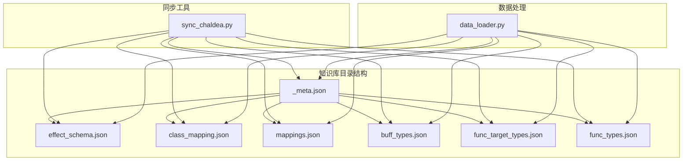
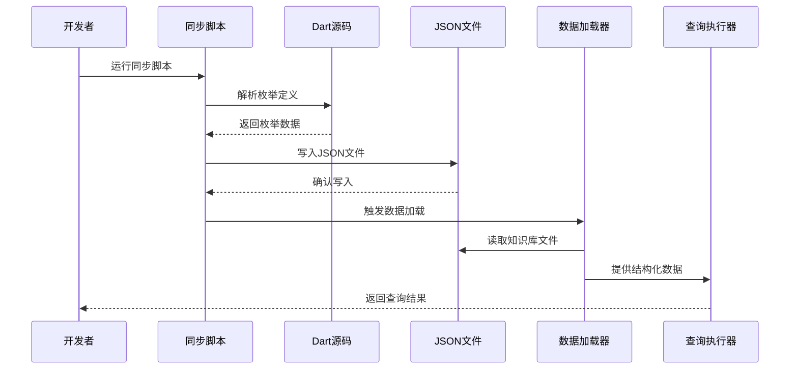
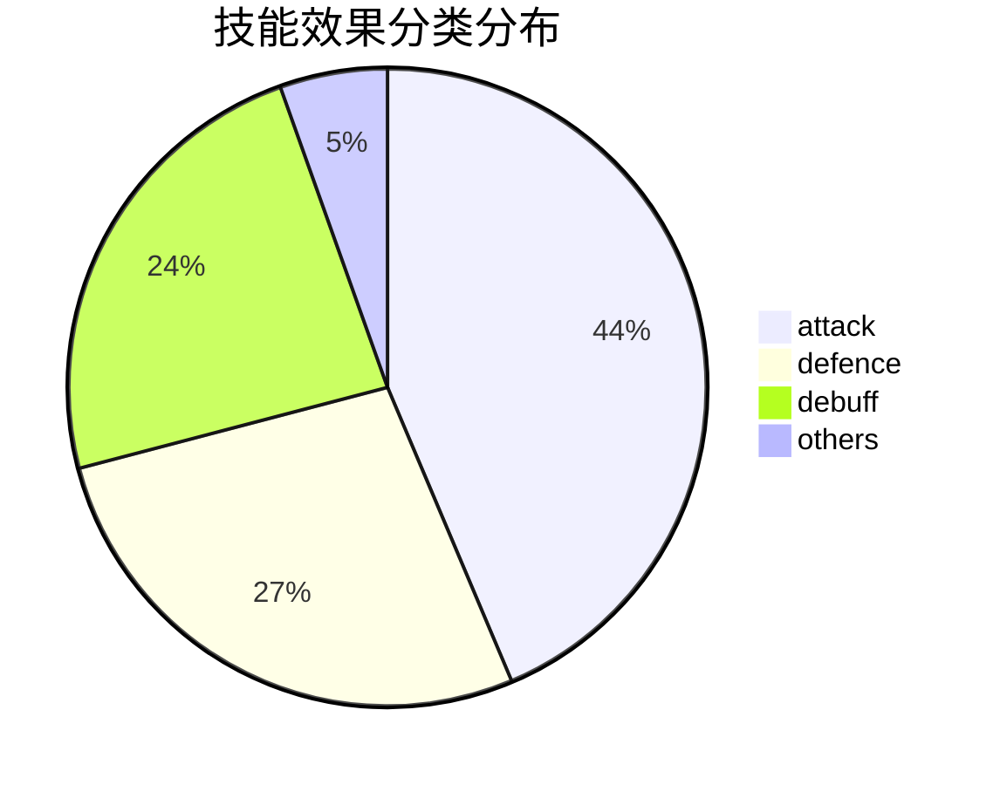
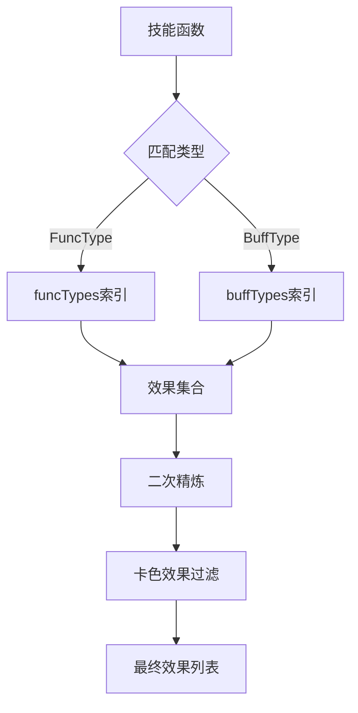
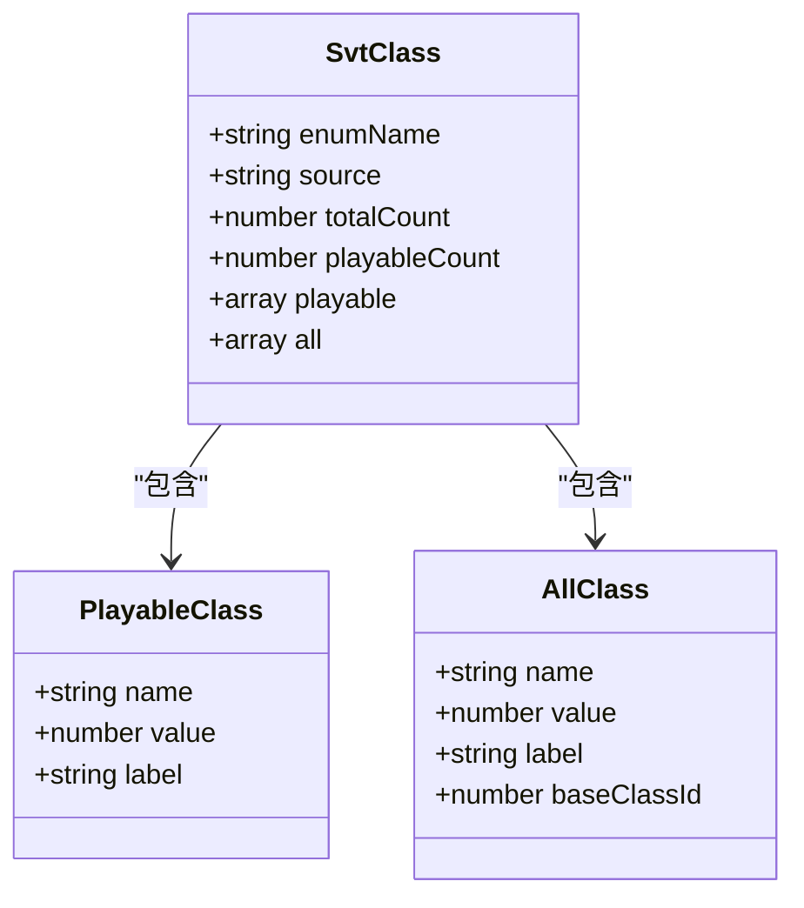
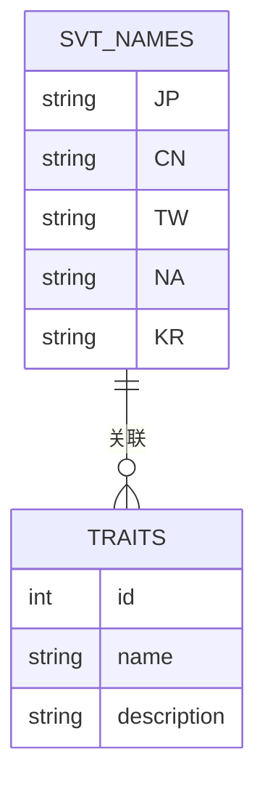
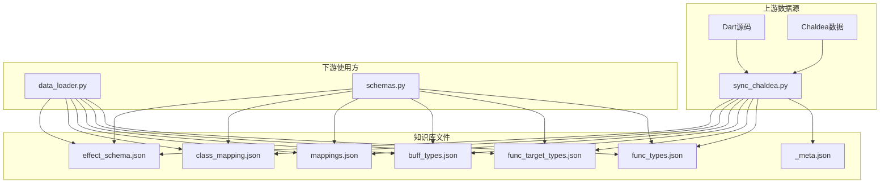

# 知识库数据模型

<cite>
**本文档引用的文件**
- [effect_schema.json](file://server/knowledge/effect_schema.json)
- [class_mapping.json](file://server/knowledge/class_mapping.json)
- [mappings.json](file://server/knowledge/mappings.json)
- [buff_types.json](file://server/knowledge/buff_types.json)
- [func_target_types.json](file://server/knowledge/func_target_types.json)
- [func_types.json](file://server/knowledge/func_types.json)
- [_meta.json](file://server/knowledge/_meta.json)
- [sync_chaldea.py](file://server/sync_chaldea.py)
- [data_loader.py](file://server/data_loader.py)
- [schemas.py](file://server/schemas.py)
</cite>

## 目录
1. [简介](#简介)
2. [项目结构](#项目结构)
3. [核心组件](#核心组件)
4. [架构概览](#架构概览)
5. [详细组件分析](#详细组件分析)
6. [依赖关系分析](#依赖关系分析)
7. [性能考虑](#性能考虑)
8. [故障排除指南](#故障排除指南)
9. [结论](#结论)
10. [附录](#附录)

## 简介

Laplace项目的知识库数据模型是整个系统的核心基础，负责存储和管理Fate/Grand Order游戏中的技能效果分类、职阶映射、多语言名称映射等关键数据。该知识库采用JSON格式存储，提供了完整的数据结构定义和版本管理机制。

知识库系统的主要目标是：
- 提供标准化的技能效果分类体系
- 维护职阶枚举和中文名称映射
- 支持多语言名称对照
- 实现版本控制和同步机制
- 为查询执行器提供结构化数据支持

## 项目结构

知识库相关文件位于`server/knowledge/`目录下，包含以下核心文件：

**图表来源**
- [sync_chaldea.py:32-38](file://server/sync_chaldea.py#L32-L38)
- [data_loader.py:20-24](file://server/data_loader.py#L20-L24)

**章节来源**
- [sync_chaldea.py:32-38](file://server/sync_chaldea.py#L32-L38)
- [data_loader.py:20-24](file://server/data_loader.py#L20-L24)

## 核心组件

### 技能效果分类体系

技能效果分类是知识库的核心组件，定义了55种不同的技能效果类型及其分类关系。

#### 数据结构特征
- **总数**: 55种技能效果
- **分类体系**: attack、defence、debuff、others四个主要类别
- **映射关系**: 每个效果关联到具体的FuncType和BuffType枚举

#### 关键字段说明
- `name`: 效果的唯一标识符
- `category`: 效果所属的分类（attack/defence/debuff/others）
- `funcTypes`: 关联的功能类型列表
- `buffTypes`: 关联的缓冲类型列表
- `aliases_zh`: 中文别名数组

**章节来源**
- [effect_schema.json:10-694](file://server/knowledge/effect_schema.json#L10-L694)

### 职阶映射系统

职阶映射系统提供了完整的职阶枚举和中文名称对照，支持78种不同的职阶类型。

#### 结构组成
- **enumName**: "SvtClass"
- **source**: "common.dart"
- **totalCount**: 78（总职阶数）
- **playableCount**: 14（可玩职阶数）

#### 职阶分类
- **可玩职阶**: 14个标准职阶（Saber、Archer、Lancer等）
- **完整列表**: 78个职阶，包含特殊变体和派生职阶

**章节来源**
- [class_mapping.json:1-478](file://server/knowledge/class_mapping.json#L1-L478)

### 中文别名对照表

中文别名对照表提供了技能效果的中文翻译和常用别名，增强用户体验。

#### 设计特点
- **自动添加**: 通过正则表达式从Dart源码提取
- **手动维护**: 部分效果的中文别名需要人工维护
- **多语言支持**: 支持简体中文、繁体中文、英文等多种语言

**章节来源**
- [sync_chaldea.py:206-270](file://server/sync_chaldea.py#L206-L270)

## 架构概览

知识库系统的整体架构采用分层设计，实现了数据提取、转换和加载的完整流程。

**图表来源**
- [sync_chaldea.py:308-429](file://server/sync_chaldea.py#L308-L429)
- [data_loader.py:332-363](file://server/data_loader.py#L332-L363)

## 详细组件分析

### 技能效果分类系统

#### 类别分布
系统将55种技能效果按照功能特性分为四大类别：

**图表来源**
- [effect_schema.json:4-694](file://server/knowledge/effect_schema.json#L4-L694)

#### 效果匹配机制

系统通过双重匹配机制确保效果识别的准确性：

**图表来源**
- [data_loader.py:64-84](file://server/data_loader.py#L64-L84)
- [data_loader.py:151-178](file://server/data_loader.py#L151-L178)

**章节来源**
- [data_loader.py:64-84](file://server/data_loader.py#L64-L84)
- [data_loader.py:151-178](file://server/data_loader.py#L151-L178)

### 职阶映射系统

#### 职阶枚举解析

职阶映射系统能够从Dart源码中准确解析职阶枚举：

**图表来源**
- [class_mapping.json:1-478](file://server/knowledge/class_mapping.json#L1-L478)

**章节来源**
- [class_mapping.json:1-478](file://server/knowledge/class_mapping.json#L1-L478)

### 多语言名称映射

#### 映射数据结构

多语言名称映射系统支持四种语言的名称对照：

**图表来源**
- [mappings.json:2-800](file://server/knowledge/mappings.json#L2-L800)

**章节来源**
- [mappings.json:2-800](file://server/knowledge/mappings.json#L2-L800)

## 依赖关系分析

知识库系统各组件之间的依赖关系如下：

**图表来源**
- [sync_chaldea.py:32-38](file://server/sync_chaldea.py#L32-L38)
- [data_loader.py:44-61](file://server/data_loader.py#L44-L61)

**章节来源**
- [sync_chaldea.py:32-38](file://server/sync_chaldea.py#L32-L38)
- [data_loader.py:44-61](file://server/data_loader.py#L44-L61)

## 性能考虑

### 数据加载优化

系统采用了多种性能优化策略：

1. **索引构建**: 通过build_effect_matcher函数构建效果匹配索引
2. **内存管理**: 使用生成器和迭代器避免大量数据驻留内存
3. **缓存机制**: 利用JSON文件的持久化特性减少重复解析

### 同步效率

同步脚本实现了幂等操作，支持重复运行而不会产生冲突：

- **正则解析**: 不依赖Dart SDK，提高解析效率
- **增量更新**: 仅在数据变化时更新相关文件
- **并发处理**: 支持同时下载多个映射文件

## 故障排除指南

### 常见问题及解决方案

#### 知识库文件缺失
**症状**: 运行data_loader.py时报错提示缺少effect_schema.json
**解决方法**: 
1. 确保已运行sync_chaldea.py生成知识库文件
2. 检查server/knowledge/目录权限
3. 验证文件完整性

#### 职阶映射不完整
**症状**: 查询时发现某些职阶无法识别
**解决方法**:
1. 检查class_mapping.json文件是否完整
2. 确认Dart源码中SvtClass枚举定义
3. 重新运行同步脚本

#### 效果识别错误
**症状**: 技能效果匹配结果不准确
**解决方法**:
1. 检查effect_schema.json中的funcTypes和buffTypes映射
2. 验证data_loader.py中的匹配逻辑
3. 更新中文别名映射

**章节来源**
- [data_loader.py:44-52](file://server/data_loader.py#L44-L52)
- [sync_chaldea.py:313-318](file://server/sync_chaldea.py#L313-L318)

## 结论

Laplace项目的知识库数据模型是一个设计精良、结构清晰的数据管理系统。它成功地将复杂的技能效果分类、职阶映射和多语言名称对照整合到统一的JSON格式中，为整个系统的查询和分析功能提供了坚实的基础。

系统的主要优势包括：
- **完整性**: 覆盖了游戏中主要的技能效果和职阶类型
- **可扩展性**: 支持新的效果类型和职阶的添加
- **易维护性**: 通过自动化脚本实现数据同步和更新
- **用户友好**: 提供了丰富的中文别名和多语言支持

未来可以考虑的改进方向：
- 增加更多的数据验证规则
- 实现更细粒度的版本控制
- 添加数据质量监控机制

## 附录

### 数据验证和一致性检查

系统实现了多层次的数据验证机制：

1. **结构验证**: 每个JSON文件都遵循预定义的schema结构
2. **枚举验证**: 确保所有引用的枚举值都在定义范围内
3. **完整性检查**: 验证所有必需字段的存在性和有效性
4. **一致性检查**: 确保不同文件间的引用关系保持一致

### 集成方式

知识库数据通过以下方式与其他模块集成：

- **查询执行器**: 直接读取JSON文件进行数据查询
- **LLM系统**: 作为结构化提示的基础数据
- **API接口**: 为外部应用提供标准化的数据访问
- **数据分析**: 支持复杂的数据挖掘和统计分析