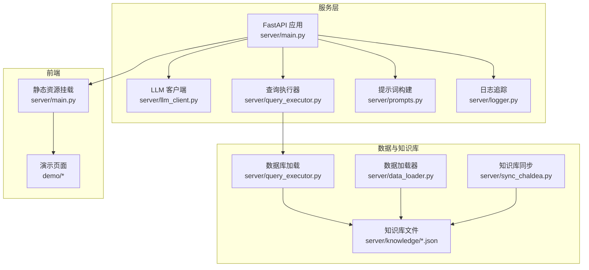
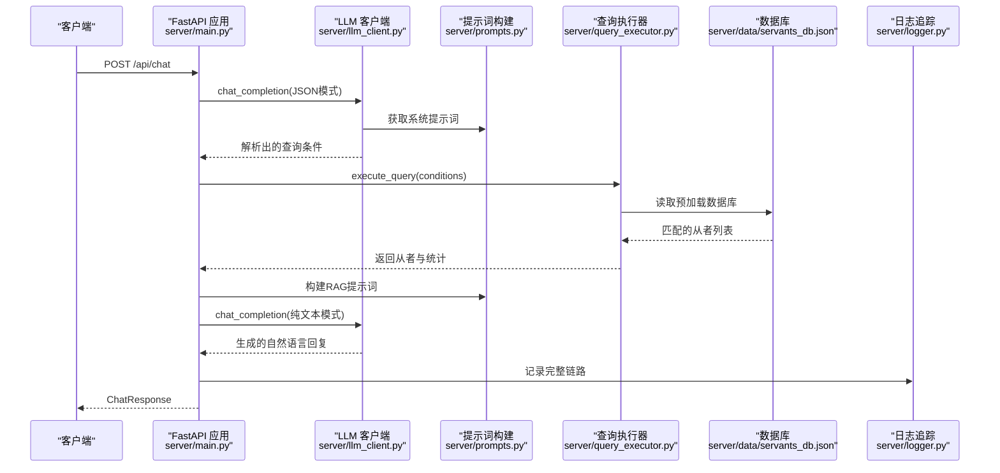
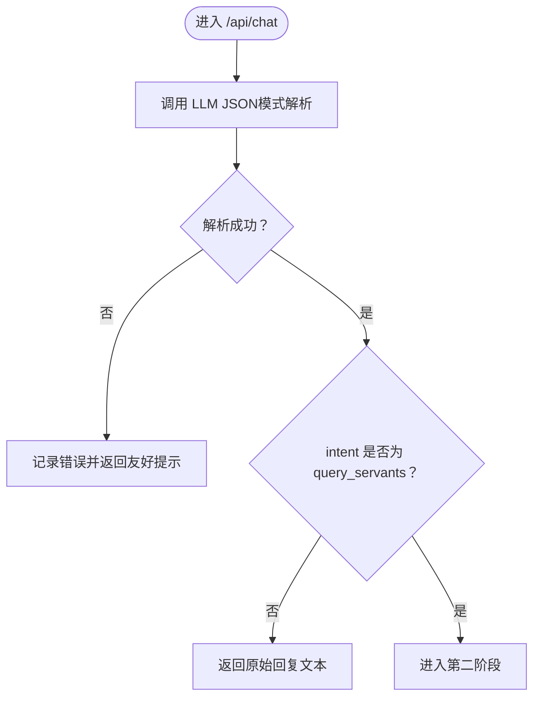
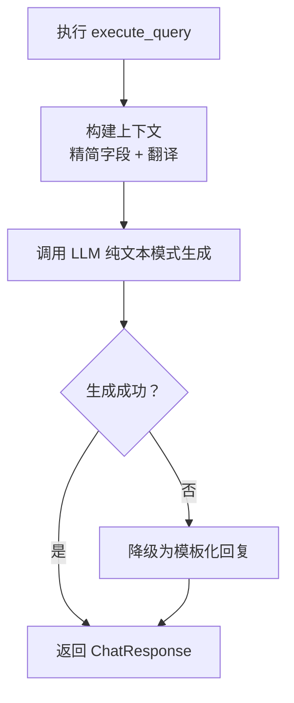
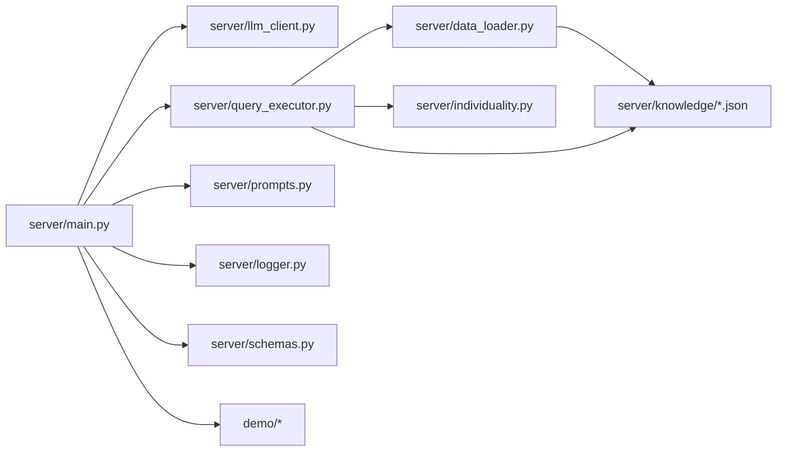

# FastAPI服务架构

<cite>
**本文引用的文件**
- [server/main.py](file://server/main.py)
- [server/schemas.py](file://server/schemas.py)
- [server/llm_client.py](file://server/llm_client.py)
- [server/query_executor.py](file://server/query_executor.py)
- [server/prompts.py](file://server/prompts.py)
- [server/data_loader.py](file://server/data_loader.py)
- [server/sync_chaldea.py](file://server/sync_chaldea.py)
- [server/logger.py](file://server/logger.py)
- [server/individuality.py](file://server/individuality.py)
- [server/requirements.txt](file://server/requirements.txt)
- [tests/test_llm_client.py](file://tests/test_llm_client.py)
- [tests/test_query_executor.py](file://tests/test_query_executor.py)
- [demo/package.json](file://demo/package.json)
</cite>

## 目录
1. [简介](#简介)
2. [项目结构](#项目结构)
3. [核心组件](#核心组件)
4. [架构总览](#架构总览)
5. [详细组件分析](#详细组件分析)
6. [依赖关系分析](#依赖关系分析)
7. [性能考量](#性能考量)
8. [故障排查指南](#故障排查指南)
9. [结论](#结论)
10. [附录](#附录)

## 简介
本文件面向Laplace项目的FastAPI服务，系统性梳理其初始化配置、中间件与静态文件挂载、路由定义、两阶段处理流程（意图解析与自然语言生成）、错误处理与降级策略、健康检查端点，以及扩展点与自定义配置选项。文档同时提供API使用示例与最佳实践，帮助开发者快速理解并安全地集成与扩展该服务。

## 项目结构
Laplace服务位于server目录，采用“功能分层 + 知识库驱动”的组织方式：
- 应用入口与路由：server/main.py
- LLM客户端与提示词：server/llm_client.py、server/prompts.py
- 查询执行器：server/query_executor.py
- 数据加载与知识库：server/data_loader.py、server/sync_chaldea.py、server/knowledge/*
- 日志追踪：server/logger.py
- 类型与Schema：server/schemas.py
- 前端静态资源挂载：server/main.py中mount静态目录
- 测试：tests/*（验证LLM客户端与查询执行器）

图表来源
- [server/main.py:114-365](file://server/main.py#L114-L365)
- [server/llm_client.py:1-254](file://server/llm_client.py#L1-254)
- [server/query_executor.py:1-343](file://server/query_executor.py#L1-L343)
- [server/prompts.py:1-219](file://server/prompts.py#L1-L219)
- [server/logger.py:1-55](file://server/logger.py#L1-L55)
- [server/data_loader.py:1-363](file://server/data_loader.py#L1-L363)
- [server/sync_chaldea.py:1-429](file://server/sync_chaldea.py#L1-L429)

章节来源
- [server/main.py:114-365](file://server/main.py#L114-L365)
- [server/requirements.txt:1-7](file://server/requirements.txt#L1-L7)

## 核心组件
- FastAPI应用与中间件
  - CORS中间件：允许任意来源、方法与头部，便于前后端分离部署与跨域访问。
  - 静态文件挂载：将demo目录作为静态资源根目录，HTML默认启用。
- 路由定义
  - POST /api/chat：标准JSON响应，包含回复文本、匹配从者、计数、查询条件与模型信息。
  - GET /api/chat/stream：SSE流式响应，分阶段推送“思考中”、“解析结果”、“从者卡片”、“生成文本”、“完成”事件。
  - GET /api/health：健康检查端点，返回服务状态。
- 请求与响应模型
  - ChatRequest：message字段，用于输入用户问题。
  - ChatResponse：reply、servants、count、query、model、traceId。
- 两阶段处理流程
  - 第一阶段：LLM意图解析（JSON模式），输出标准化查询条件。
  - 第二阶段：RAG生成（纯文本模式），基于检索上下文生成自然语言回复。
- 错误处理与降级
  - LLM调用失败时返回友好提示，并记录traceId以便追踪。
  - RAG生成失败时降级为模板化回复，保证用户体验。
- 数据库预加载
  - 应用启动时加载从者数据库，后续查询无需IO阻塞。
- 日志追踪
  - 记录完整链路：traceId、原始查询、解析意图、结果数量、最终回复、上下文、错误信息。

章节来源
- [server/main.py:120-148](file://server/main.py#L120-L148)
- [server/main.py:144-242](file://server/main.py#L144-L242)
- [server/main.py:245-355](file://server/main.py#L245-L355)
- [server/main.py:358-361](file://server/main.py#L358-L361)
- [server/main.py:363-365](file://server/main.py#L363-L365)
- [server/schemas.py:13-92](file://server/schemas.py#L13-L92)
- [server/logger.py:38-55](file://server/logger.py#L38-L55)

## 架构总览
下图展示FastAPI应用与各子系统的交互关系，包括LLM调用、数据库查询、提示词构建与日志追踪。

图表来源
- [server/main.py:150-242](file://server/main.py#L150-L242)
- [server/llm_client.py:41-132](file://server/llm_client.py#L41-L132)
- [server/prompts.py:178-218](file://server/prompts.py#L178-L218)
- [server/query_executor.py:53-116](file://server/query_executor.py#L53-L116)
- [server/logger.py:38-55](file://server/logger.py#L38-L55)

## 详细组件分析

### FastAPI应用初始化与中间件
- CORS中间件设置
  - 允许任意来源、方法与头部，便于本地开发与跨域访问。
- 静态文件挂载
  - 将demo目录作为静态资源根目录，HTML默认启用，便于直接访问演示页面。
- 应用元信息
  - 标题、描述与版本号，便于自动生成OpenAPI文档。

章节来源
- [server/main.py:120-126](file://server/main.py#L120-L126)
- [server/main.py:363-365](file://server/main.py#L363-L365)

### 路由定义与控制流
- POST /api/chat
  - 输入：ChatRequest.message
  - 处理：两阶段处理（意图解析 + RAG生成）
  - 输出：ChatResponse
- GET /api/chat/stream
  - 流式输出：thinking、parsed、servants、delta、done事件
  - 适合实时反馈与用户体验优化
- GET /api/health
  - 返回服务状态，便于容器编排与监控

章节来源
- [server/main.py:150-242](file://server/main.py#L150-L242)
- [server/main.py:245-355](file://server/main.py#L245-L355)
- [server/main.py:358-361](file://server/main.py#L358-L361)

### 请求与响应模型
- ChatRequest
  - message：用户输入的自然语言问题
- ChatResponse
  - reply：最终回复文本
  - servants：匹配的从者列表（受MAX_RESULTS限制）
  - count：总匹配数量
  - query：解析出的查询条件
  - model：实际使用的模型标识
  - traceId：本次请求的追踪ID

章节来源
- [server/main.py:129-142](file://server/main.py#L129-L142)
- [server/main.py:235-242](file://server/main.py#L235-L242)

### 两阶段处理流程详解

#### 第一阶段：意图解析（JSON模式）
- 触发时机：收到用户消息后立即进行
- 关键步骤
  - 构建系统提示词（包含效果分类、字段说明、示例）
  - 调用LLM Responses API，使用text.format的json_schema结构化输出
  - 解析并校验IntentResponse，提取conditions与intent
- 错误处理
  - LLM调用异常：记录traceId与错误信息，返回友好提示
  - 非查询意图：直接返回原始回复文本

图表来源
- [server/main.py:156-189](file://server/main.py#L156-L189)
- [server/llm_client.py:41-132](file://server/llm_client.py#L41-L132)
- [server/prompts.py:178-171](file://server/prompts.py#L178-L171)

章节来源
- [server/main.py:156-189](file://server/main.py#L156-L189)
- [server/llm_client.py:41-132](file://server/llm_client.py#L41-L132)
- [server/prompts.py:178-171](file://server/prompts.py#L178-L171)

#### 第二阶段：自然语言生成（RAG）
- 触发时机：当intent为query_servants时
- 关键步骤
  - 执行execute_query，得到匹配从者
  - 构建上下文（精简字段、翻译效果名、统计信息）
  - 调用LLM Responses API，使用纯文本模式生成回复
  - 若生成失败，降级为模板化回复
- 上下文构建
  - 限制返回数量（MAX_CONTEXT_SIZE）
  - 翻译效果名与卡色、目标类型等
  - 记录查询条件与统计信息

图表来源
- [server/main.py:191-242](file://server/main.py#L191-L242)
- [server/query_executor.py:53-116](file://server/query_executor.py#L53-L116)
- [server/main.py:60-106](file://server/main.py#L60-L106)

章节来源
- [server/main.py:191-242](file://server/main.py#L191-L242)
- [server/query_executor.py:53-116](file://server/query_executor.py#L53-L116)
- [server/main.py:60-106](file://server/main.py#L60-L106)

### 错误处理策略与降级机制
- LLM调用失败
  - 记录traceId与错误详情
  - 返回统一的友好提示，避免泄露底层细节
- RAG生成失败
  - 降级为模板化回复，包含总数与必要提示
  - 仍记录完整链路，便于事后审计
- SSE流式场景
  - 在解析阶段失败时发送error事件
  - 在生成阶段失败时发送thinking事件并回退模板化文本

章节来源
- [server/main.py:164-174](file://server/main.py#L164-L174)
- [server/main.py:214-221](file://server/main.py#L214-L221)
- [server/main.py:263-267](file://server/main.py#L263-L267)
- [server/main.py:324-330](file://server/main.py#L324-L330)

### 健康检查端点
- GET /api/health
  - 返回服务状态与标识，便于Kubernetes、Docker等编排工具进行存活探针与就绪探针

章节来源
- [server/main.py:358-361](file://server/main.py#L358-L361)

### 数据库预加载机制
- 应用启动事件
  - 在startup事件中调用load_database，将从者数据库加载到内存
- 查询执行器
  - 从本地JSON文件读取，带全局缓存，避免重复IO
- 数据加载器
  - 从Atlas Academy API抓取全量从者数据，抽取技能效果、NP充能、卡色、宝具目标等特征
  - 生成servants_db.json供查询执行器使用
- 知识库同步
  - 从Chaldea源码提取枚举与效果分类，生成effect_schema.json等知识库文件
  - 支持多语言映射与特性ID映射

章节来源
- [server/main.py:144-147](file://server/main.py#L144-L147)
- [server/query_executor.py:41-50](file://server/query_executor.py#L41-L50)
- [server/data_loader.py:332-362](file://server/data_loader.py#L332-L362)
- [server/sync_chaldea.py:308-418](file://server/sync_chaldea.py#L308-L418)

### 日志追踪与审计
- 日志格式
  - JSONL格式，包含时间戳、级别、traceId、查询、意图、结果数量、回复、上下文、错误等
- 记录时机
  - 成功与失败均记录，便于问题定位与性能分析
- 使用建议
  - 结合traceId进行端到端追踪
  - 对生产环境建议配置日志轮转与保留策略

章节来源
- [server/logger.py:13-37](file://server/logger.py#L13-L37)
- [server/logger.py:38-55](file://server/logger.py#L38-L55)

### 扩展点与自定义配置
- LLM客户端
  - 支持主模型与备用模型列表，自动降级
  - 支持响应格式降级（json_schema → text_fallback）
  - 可通过环境变量配置基础URL、API Key、模型名称与备用模型
- 提示词
  - 动态加载知识库，注入效果分类与示例
  - 支持多从者对比、昵称映射等高级规则
- 查询执行器
  - 支持多条件组合（NP充能、稀有度、职阶、名称、效果、特性、性别、阵营、配卡、宝具颜色与目标）
  - 支持多从者对比（names字段）
- 前端静态资源
  - 可替换demo目录内容，或调整挂载路径
- 日志
  - 可调整日志文件路径与格式化器

章节来源
- [server/llm_client.py:27-34](file://server/llm_client.py#L27-L34)
- [server/llm_client.py:66-84](file://server/llm_client.py#L66-L84)
- [server/prompts.py:15-43](file://server/prompts.py#L15-L43)
- [server/query_executor.py:53-116](file://server/query_executor.py#L53-L116)
- [server/main.py:363-365](file://server/main.py#L363-L365)
- [server/logger.py:7-36](file://server/logger.py#L7-L36)

## 依赖关系分析

图表来源
- [server/main.py:17-22](file://server/main.py#L17-L22)
- [server/main.py:18-21](file://server/main.py#L18-L21)
- [server/query_executor.py:12-19](file://server/query_executor.py#L12-L19)
- [server/data_loader.py:20-24](file://server/data_loader.py#L20-L24)

章节来源
- [server/main.py:17-22](file://server/main.py#L17-L22)
- [server/query_executor.py:12-19](file://server/query_executor.py#L12-L19)
- [server/data_loader.py:20-24](file://server/data_loader.py#L20-L24)

## 性能考量
- 数据库预加载
  - 启动时一次性加载，避免每次查询IO开销
  - 建议在容器启动阶段完成预热，缩短首次查询延迟
- LLM调用
  - JSON模式优先使用结构化输出，提高稳定性
  - 采用主备模型自动降级，提升可用性
- 上下文构建
  - 限制返回数量（MAX_CONTEXT_SIZE/MAX_RESULTS），避免响应过大
- SSE流式
  - 分阶段推送，改善用户体验，降低首屏等待时间
- 日志
  - JSONL格式便于异步写入与外部采集

[本节为通用性能建议，不直接分析具体文件]

## 故障排查指南
- LLM调用失败
  - 检查环境变量：LLM_BASE_URL、LLM_API_KEY、LLM_MODEL、LLM_FALLBACK_MODELS
  - 查看traceId对应的日志条目，确认错误原因
  - 如遇响应格式不支持，确认模型网关是否支持text.format
- RAG生成失败
  - 检查上下文构建是否正确（conditions、total_found、top_results_details）
  - 确认知识库文件是否齐全（effect_schema.json、mappings.json等）
- 数据库加载失败
  - 确认servants_db.json是否存在且可读
  - 如缺失，运行数据加载器或知识库同步脚本
- 健康检查失败
  - 检查服务进程状态与端口占用
  - 确认CORS配置与静态资源挂载路径

章节来源
- [server/llm_client.py:27-34](file://server/llm_client.py#L27-L34)
- [server/logger.py:38-55](file://server/logger.py#L38-L55)
- [server/data_loader.py:332-362](file://server/data_loader.py#L332-L362)
- [server/sync_chaldea.py:308-418](file://server/sync_chaldea.py#L308-L418)

## 结论
Laplace的FastAPI服务通过清晰的两阶段处理流程、稳健的错误处理与降级策略、完善的日志追踪与健康检查，实现了从自然语言到结构化查询再到自然语言回复的闭环。其模块化设计与丰富的扩展点，使得服务易于集成、维护与演进。建议在生产环境中配合容器编排、日志采集与监控告警体系，进一步提升稳定性与可观测性。

[本节为总结性内容，不直接分析具体文件]

## 附录

### API使用示例与最佳实践
- 使用POST /api/chat
  - 请求体：包含message字段的JSON
  - 响应：包含reply、servants、count、query、model、traceId
  - 最佳实践：在客户端记录traceId，便于问题追踪
- 使用GET /api/chat/stream
  - 浏览器端使用EventSource订阅SSE
  - 事件类型：thinking、parsed、servants、delta、done
  - 最佳实践：在UI中分阶段渲染，提升交互体验
- 健康检查
  - GET /api/health：用于存活与就绪探针
- 环境变量
  - LLM_BASE_URL、LLM_API_KEY、LLM_MODEL、LLM_FALLBACK_MODELS
  - 建议在部署时通过配置管理工具注入

章节来源
- [server/main.py:150-242](file://server/main.py#L150-L242)
- [server/main.py:245-355](file://server/main.py#L245-L355)
- [server/main.py:358-361](file://server/main.py#L358-L361)
- [server/llm_client.py:27-34](file://server/llm_client.py#L27-L34)

### 测试参考
- LLM客户端测试
  - 验证JSON提取、响应格式降级、备用模型切换
- 查询执行器测试
  - 验证NP充能、稀有度、职阶、名称、效果、特性、配卡、宝具等多条件组合

章节来源
- [tests/test_llm_client.py:106-150](file://tests/test_llm_client.py#L106-L150)
- [tests/test_query_executor.py:123-172](file://tests/test_query_executor.py#L123-L172)