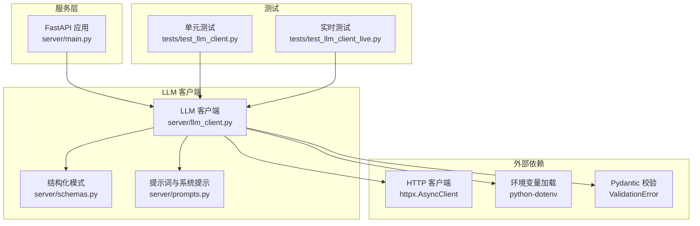
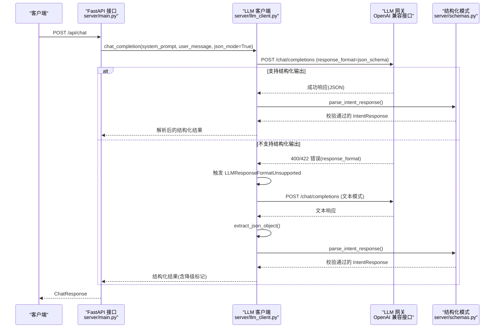
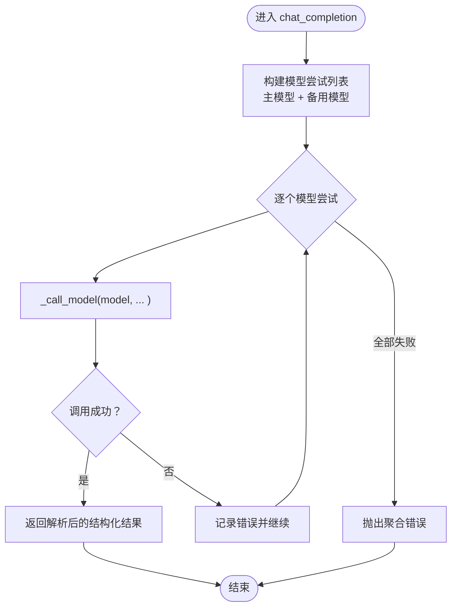
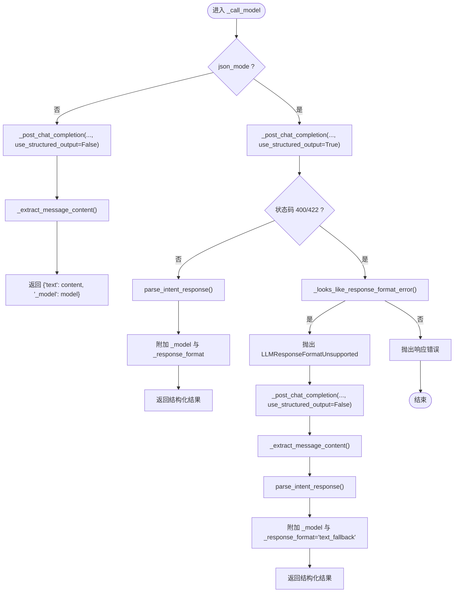
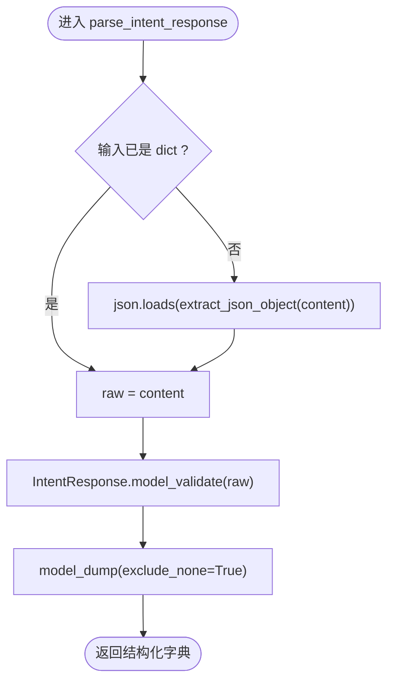
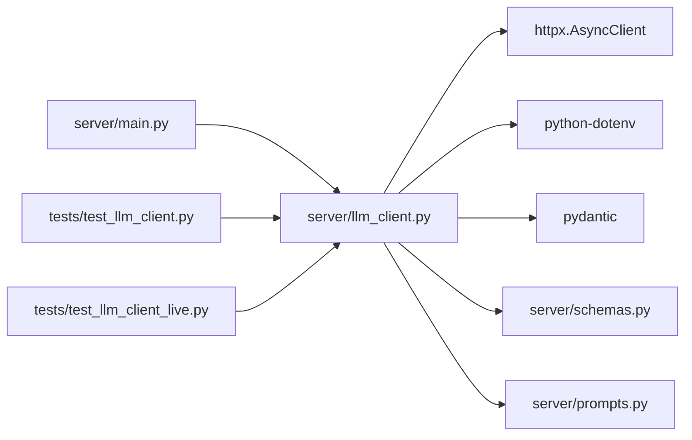

# LLM 客户端模块

<cite>
**本文引用的文件**
- [server/llm_client.py](file://server/llm_client.py)
- [server/schemas.py](file://server/schemas.py)
- [server/prompts.py](file://server/prompts.py)
- [server/main.py](file://server/main.py)
- [tests/test_llm_client.py](file://tests/test_llm_client.py)
- [tests/test_llm_client_live.py](file://tests/test_llm_client_live.py)
- [server/requirements.txt](file://server/requirements.txt)
- [server/knowledge/effect_schema.json](file://server/knowledge/effect_schema.json)
</cite>

## 目录
1. [简介](#简介)
2. [项目结构](#项目结构)
3. [核心组件](#核心组件)
4. [架构总览](#架构总览)
5. [详细组件分析](#详细组件分析)
6. [依赖关系分析](#依赖关系分析)
7. [性能考虑](#性能考虑)
8. [故障排查指南](#故障排查指南)
9. [结论](#结论)
10. [附录](#附录)

## 简介
本文件面向 Laplace 的 LLM 客户端模块，聚焦 OpenAI 兼容的聊天接口封装，提供多模型轮询、结构化输出(JSON 模式)、响应格式验证与故障转移策略。文档将深入解释 chat_completion 的工作流程、JSON 模式调用、响应提取与校验、错误处理与降级路径，并给出意图解析与结构化查询的使用示例、性能优化建议与最佳实践。

## 项目结构
- LLM 客户端位于 server/llm_client.py，负责与 OpenAI 兼容的聊天接口交互，封装多模型轮询、结构化输出与错误降级。
- 结构化模式定义位于 server/schemas.py，提供 IntentResponse 与 QueryConditions 的 Pydantic 模型及 JSON Schema。
- 提示词与系统提示构建位于 server/prompts.py，动态注入效果分类，确保 LLM 输出严格 JSON。
- 服务入口 server/main.py 将 LLM 客户端集成到 FastAPI 接口，完成两阶段处理：意图解析与自然语言生成。
- 测试位于 tests/，包含单元测试与可选的实时调用测试，覆盖结构化输出、降级与多模型轮询场景。
- 依赖声明位于 server/requirements.txt，包含 httpx、python-dotenv、pydantic 等。

图表来源
- [server/main.py:87-218](file://server/main.py#L87-L218)
- [server/llm_client.py:35-247](file://server/llm_client.py#L35-L247)
- [server/schemas.py:68-81](file://server/schemas.py#L68-L81)
- [server/prompts.py:46-172](file://server/prompts.py#L46-L172)
- [tests/test_llm_client.py:12-126](file://tests/test_llm_client.py#L12-L126)
- [tests/test_llm_client_live.py:15-36](file://tests/test_llm_client_live.py#L15-L36)

章节来源
- [server/llm_client.py:1-247](file://server/llm_client.py#L1-L247)
- [server/schemas.py:1-81](file://server/schemas.py#L1-L81)
- [server/prompts.py:1-208](file://server/prompts.py#L1-L208)
- [server/main.py:1-228](file://server/main.py#L1-L228)
- [tests/test_llm_client.py:1-126](file://tests/test_llm_client.py#L1-L126)
- [tests/test_llm_client_live.py:1-36](file://tests/test_llm_client_live.py#L1-L36)
- [server/requirements.txt:1-7](file://server/requirements.txt#L1-L7)

## 核心组件
- chat_completion：对外暴露的异步聊天接口，支持结构化 JSON 模式与文本模式，内置多模型轮询与故障转移。
- _call_model：内部调用单个模型，优先尝试 response_format=json_schema，失败则降级为文本模式。
- _post_chat_completion：发送一次聊天请求，处理 response_format 不受支持的错误并抛出自定义异常。
- parse_intent_response：解析并校验 LLM 返回的 JSON，使用 IntentResponse 模型进行严格验证。
- extract_json_object：从可能包含多余文本的模型输出中提取第一个完整 JSON 对象。
- _extract_message_content：从 OpenAI 兼容响应中提取助手内容，兼容字符串与多片段列表。
- LLMResponseFormatUnsupported：当模型网关拒绝结构化 response_format 时触发的异常，用于触发降级。
- 环境变量：LLM_BASE_URL、LLM_API_KEY、LLM_MODEL、LLM_FALLBACK_MODELS 控制基础 URL、鉴权、主模型与备用模型列表。
- 结构化模式：IntentResponse 与 QueryConditions，配合 JSON Schema 确保 LLM 输出符合预期结构。

章节来源
- [server/llm_client.py:35-247](file://server/llm_client.py#L35-L247)
- [server/schemas.py:68-81](file://server/schemas.py#L68-L81)

## 架构总览
下图展示了从 FastAPI 请求到 LLM 客户端再到 OpenAI 兼容接口的整体调用链，以及结构化输出与降级路径。

图表来源
- [server/main.py:87-218](file://server/main.py#L87-L218)
- [server/llm_client.py:35-247](file://server/llm_client.py#L35-L247)
- [server/schemas.py:68-81](file://server/schemas.py#L68-L81)

## 详细组件分析

### chat_completion：多模型轮询与结构化输出
- 输入参数：system_prompt、user_message、model（可空）、max_tokens、temperature、json_mode。
- 行为：
  - 组合主模型与备用模型列表，按顺序尝试调用。
  - 每次调用通过 _call_model 执行，若失败记录错误并继续下一个模型。
  - 所有模型均失败时抛出聚合错误。
- 输出：结构化 IntentResponse（包含 intent 与 conditions），或文本模式下的 {"text": "..."}，并附带使用的模型与响应格式信息。

图表来源
- [server/llm_client.py:60-78](file://server/llm_client.py#L60-L78)
- [server/llm_client.py:81-126](file://server/llm_client.py#L81-L126)

章节来源
- [server/llm_client.py:35-78](file://server/llm_client.py#L35-L78)

### _call_model：结构化输出优先与降级策略
- 逻辑：
  - 若 json_mode=False：直接以文本模式调用，提取助手内容返回 {"text": "..."}。
  - 若 json_mode=True：优先尝试 response_format=json_schema；若收到 400/422 且错误文本包含 response_format/json_schema 关键字，则抛出 LLMResponseFormatUnsupported，触发降级为文本模式。
  - 降级后再次调用，解析文本中的 JSON 对象并进行结构化校验。
- 输出：包含 "_model" 与 "_response_format" 的字典，便于追踪与调试。

图表来源
- [server/llm_client.py:81-126](file://server/llm_client.py#L81-L126)
- [server/llm_client.py:129-168](file://server/llm_client.py#L129-L168)
- [server/llm_client.py:236-247](file://server/llm_client.py#L236-L247)

章节来源
- [server/llm_client.py:81-126](file://server/llm_client.py#L81-L126)
- [server/llm_client.py:129-168](file://server/llm_client.py#L129-L168)

### _post_chat_completion：OpenAI 兼容请求与错误处理
- 构造请求：URL、头部 Authorization、消息列表、max_tokens、temperature、response_format（可选）。
- 错误处理：
  - 当启用结构化输出且状态码为 400/422 时，检查错误文本是否包含 response_format/json_schema 等关键字，若是则抛出 LLMResponseFormatUnsupported。
  - 其他错误统一 raise_for_status。
- 超时：使用 httpx.AsyncClient(timeout=30.0)。

章节来源
- [server/llm_client.py:129-168](file://server/llm_client.py#L129-L168)

### parse_intent_response 与 extract_json_object：结构化输出解析与校验
- extract_json_object：从模型输出中提取第一个完整 JSON 对象，支持去除多余文本与代码块包裹。
- parse_intent_response：将内容解析为 dict 后，使用 IntentResponse.model_validate 进行严格校验，失败抛出 ValueError。

图表来源
- [server/llm_client.py:171-179](file://server/llm_client.py#L171-L179)
- [server/llm_client.py:181-215](file://server/llm_client.py#L181-L215)
- [server/schemas.py:68-81](file://server/schemas.py#L68-L81)

章节来源
- [server/llm_client.py:171-179](file://server/llm_client.py#L171-L179)
- [server/llm_client.py:181-215](file://server/llm_client.py#L181-L215)
- [server/schemas.py:68-81](file://server/schemas.py#L68-L81)

### _extract_message_content：OpenAI 兼容响应内容提取
- 支持 content 为字符串或包含多个片段的列表，拼接文本后返回。
- 若无法提取文本内容，抛出 ValueError。

章节来源
- [server/llm_client.py:217-234](file://server/llm_client.py#L217-L234)

### 结构化模式与系统提示
- IntentResponse：固定 intent="query_servants"，conditions 为 QueryConditions。
- QueryConditions：包含数值比较、字符串匹配、效果集合、目标类型、特性、性别、属性、指令卡与宝具等字段，支持空值与逻辑关系。
- 系统提示：动态注入 effect_schema.json 中的效果分类，确保 LLM 输出严格 JSON，并提供丰富的示例与字段说明。

章节来源
- [server/schemas.py:16-81](file://server/schemas.py#L16-L81)
- [server/prompts.py:46-172](file://server/prompts.py#L46-L172)
- [server/knowledge/effect_schema.json:1-694](file://server/knowledge/effect_schema.json#L1-L694)

### 在服务中的集成与两阶段处理
- 第一阶段：chat_completion(system_prompt=get_system_prompt(), json_mode=True) 解析用户意图，得到结构化条件。
- 第二阶段：chat_completion(system_prompt=RAG 提示, json_mode=False) 生成自然语言回复。
- 错误处理：捕获 LLM 解析失败与生成失败，记录 trace 并返回降级回复。

章节来源
- [server/main.py:87-218](file://server/main.py#L87-L218)
- [server/prompts.py:175-207](file://server/prompts.py#L175-L207)

## 依赖关系分析
- 外部依赖：
  - httpx.AsyncClient：异步 HTTP 客户端，负责与 LLM 网关通信。
  - python-dotenv：从项目根目录加载 .env，读取 LLM_BASE_URL、LLM_API_KEY、LLM_MODEL、LLM_FALLBACK_MODELS。
  - pydantic：结构化模式校验，ValidationError 用于错误传播。
- 内部依赖：
  - server/schemas.py：提供 IntentResponse 与 JSON Schema。
  - server/prompts.py：构建系统提示与第二阶段生成提示。
  - server/main.py：集成 LLM 客户端，完成两阶段处理与错误降级。

图表来源
- [server/llm_client.py:8-16](file://server/llm_client.py#L8-L16)
- [server/main.py:14-16](file://server/main.py#L14-L16)
- [tests/test_llm_client.py:3-6](file://tests/test_llm_client.py#L3-L6)
- [tests/test_llm_client_live.py:6](file://tests/test_llm_client_live.py#L6)

章节来源
- [server/llm_client.py:8-16](file://server/llm_client.py#L8-L16)
- [server/requirements.txt:1-7](file://server/requirements.txt#L1-L7)

## 性能考虑
- 超时设置：默认 30 秒，可根据网关延迟调整，避免长时间阻塞。
- 多模型轮询：主模型优先，备用模型按顺序尝试，缩短整体失败时间。
- 结构化输出优先：优先使用 response_format=json_schema，减少后处理开销；不支持时再降级为文本模式。
- 响应提取：extract_json_object 仅扫描首个 JSON 对象，避免全量解析带来的额外成本。
- 服务端两阶段处理：第一阶段严格 JSON，第二阶段文本生成，兼顾准确性与可读性。
- 建议：
  - 为不同网关设置合理的超时阈值。
  - 将高频可用模型置于主模型位置，降低平均等待时间。
  - 在系统提示中明确字段边界，减少 LLM 生成冗余内容，提高 extract_json_object 的命中率。
  - 对于长文本生成，控制 max_tokens 与 temperature，平衡质量与速度。

[本节为通用性能建议，无需具体文件引用]

## 故障排查指南
- 结构化输出失败：
  - 现象：状态码 400/422 且错误文本包含 response_format/json_schema。
  - 处理：触发 LLMResponseFormatUnsupported，自动降级为文本模式并重试。
  - 检查：确认 LLM 网关支持 response_format=json_schema；必要时更新备用模型。
- JSON 解析失败：
  - 现象：parse_intent_response 抛出 ValueError。
  - 处理：检查系统提示是否足够清晰；确认 LLM 输出严格遵循 JSON Schema。
- 空内容或无文本：
  - 现象：_extract_message_content 抛出 ValueError。
  - 处理：检查网关响应格式；确认 messages 列表正确构造。
- 实时测试：
  - 使用 RUN_LIVE_LLM_TESTS=1 运行实时测试，验证真实网关行为与输出格式。

章节来源
- [server/llm_client.py:162-168](file://server/llm_client.py#L162-L168)
- [server/llm_client.py:171-179](file://server/llm_client.py#L171-L179)
- [server/llm_client.py:217-234](file://server/llm_client.py#L217-L234)
- [tests/test_llm_client_live.py:9-36](file://tests/test_llm_client_live.py#L9-L36)

## 结论
Laplace 的 LLM 客户端模块通过 OpenAI 兼容接口实现了稳健的多模型轮询、结构化输出与故障转移。其设计将“结构化优先、文本降级”的策略与严格的 JSON Schema 校验相结合，既保证了意图解析的确定性，又能在网关不支持结构化输出时平滑降级。配合系统提示与两阶段处理，能够稳定地完成从自然语言到结构化查询再到自然语言回复的完整链路。

[本节为总结性内容，无需具体文件引用]

## 附录

### 使用示例：意图解析与结构化查询
- 场景：用户输入“30 自充的从者有哪些”，期望得到结构化条件。
- 步骤：
  - 准备系统提示：get_system_prompt() 动态注入效果分类。
  - 调用 chat_completion(system_prompt, user_message, json_mode=True)。
  - 获取结果中的 intent 与 conditions，执行查询并生成回复。
- 参考路径：
  - [server/main.py:94-126](file://server/main.py#L94-L126)
  - [server/prompts.py:167-172](file://server/prompts.py#L167-L172)
  - [tests/test_llm_client_live.py:15-36](file://tests/test_llm_client_live.py#L15-L36)

章节来源
- [server/main.py:94-126](file://server/main.py#L94-L126)
- [server/prompts.py:167-172](file://server/prompts.py#L167-L172)
- [tests/test_llm_client_live.py:15-36](file://tests/test_llm_client_live.py#L15-L36)

### 配置与环境变量
- LLM_BASE_URL：LLM 网关基础 URL，默认值见源码。
- LLM_API_KEY：API 密钥，用于 Authorization。
- LLM_MODEL：主模型名称。
- LLM_FALLBACK_MODELS：备用模型列表，逗号分隔。
- 参考路径：
  - [server/llm_client.py:21-28](file://server/llm_client.py#L21-L28)

章节来源
- [server/llm_client.py:21-28](file://server/llm_client.py#L21-L28)

### 测试用例要点
- 结构化输出：验证 response_format=json_schema 是否被发送。
- 降级路径：模拟 response_format 不受支持，验证自动降级为文本模式。
- 多模型轮询：验证主模型失败后尝试备用模型。
- 参考路径：
  - [tests/test_llm_client.py:89-126](file://tests/test_llm_client.py#L89-L126)

章节来源
- [tests/test_llm_client.py:89-126](file://tests/test_llm_client.py#L89-L126)