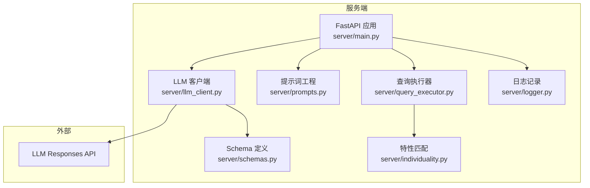
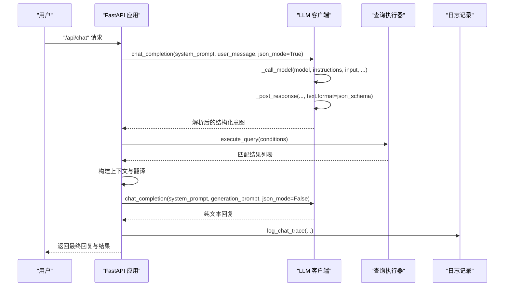
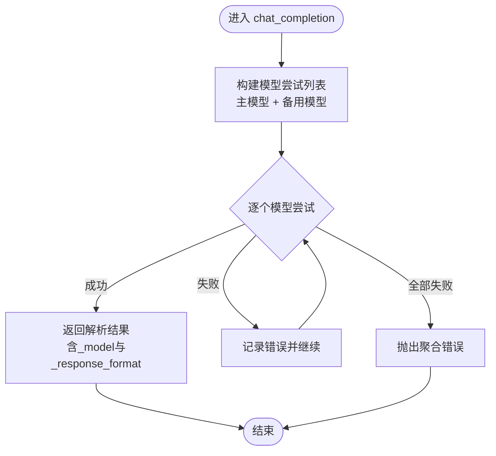
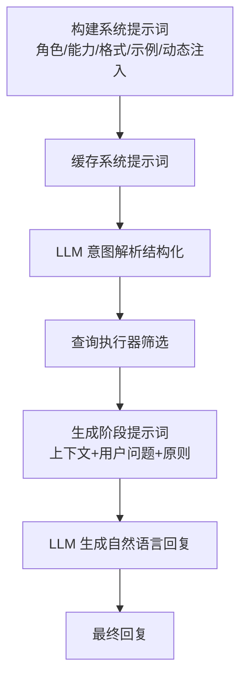
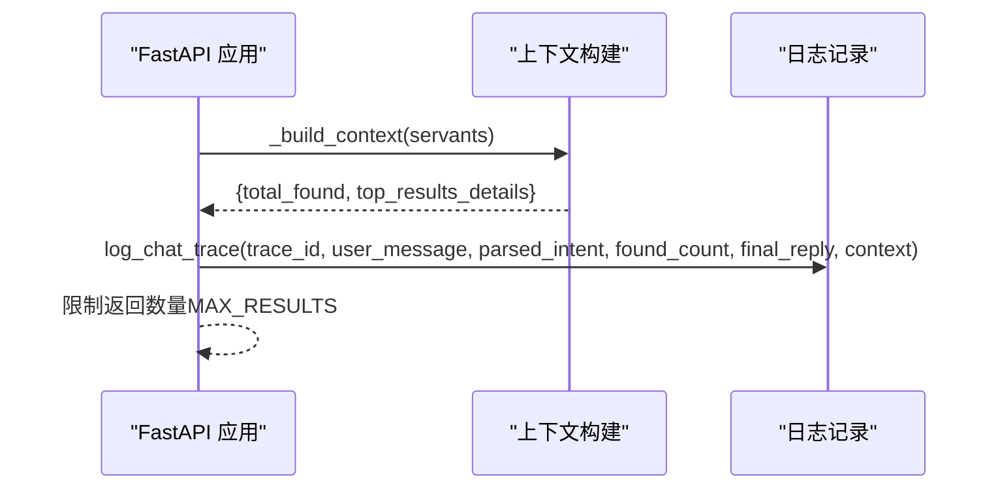
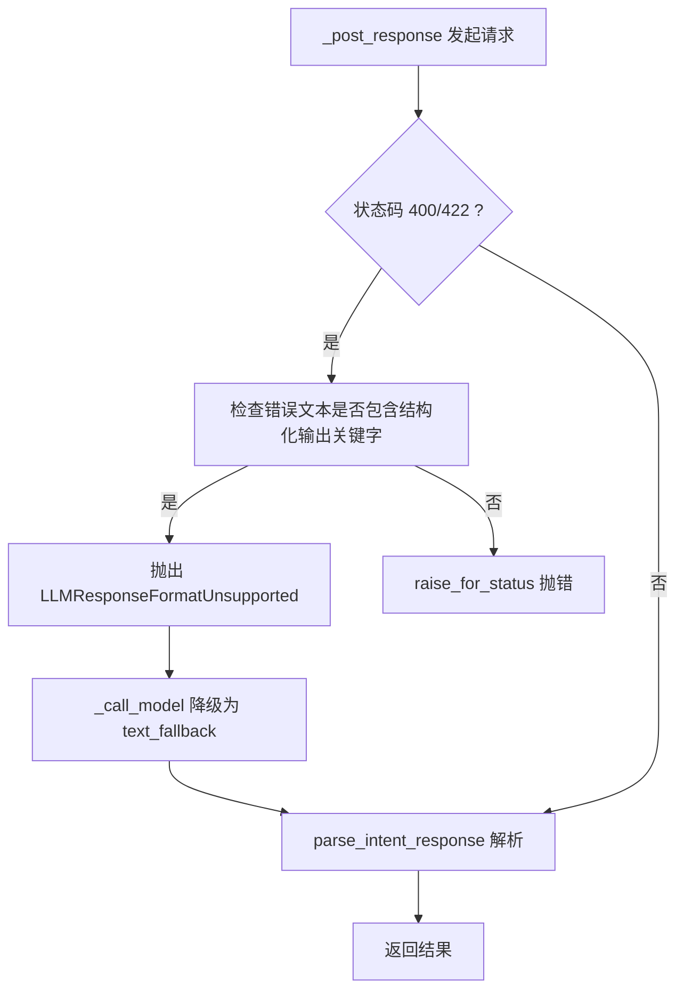
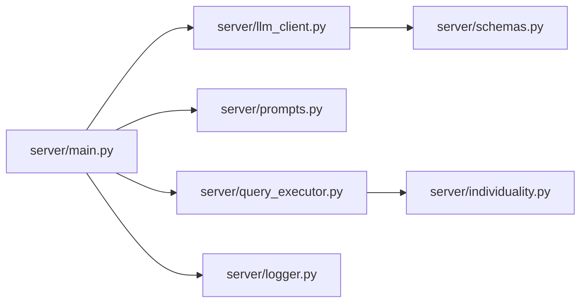

# LLM客户端系统

<cite>
**本文引用的文件**
- [llm_client.py](file://server/llm_client.py)
- [prompts.py](file://server/prompts.py)
- [main.py](file://server/main.py)
- [schemas.py](file://server/schemas.py)
- [query_executor.py](file://server/query_executor.py)
- [logger.py](file://server/logger.py)
- [individuality.py](file://server/individuality.py)
- [test_llm_client.py](file://tests/test_llm_client.py)
- [test_query_executor.py](file://tests/test_query_executor.py)
- [test_llm_client_live.py](file://tests/test_llm_client_live.py)
</cite>

## 目录
1. [简介](#简介)
2. [项目结构](#项目结构)
3. [核心组件](#核心组件)
4. [架构总览](#架构总览)
5. [详细组件分析](#详细组件分析)
6. [依赖关系分析](#依赖关系分析)
7. [性能考量](#性能考量)
8. [故障排查指南](#故障排查指南)
9. [结论](#结论)
10. [附录](#附录)

## 简介
本文件面向Laplace项目的LLM客户端系统，系统采用两阶段对话流程：第一阶段通过结构化JSON模式解析用户意图，第二阶段基于检索到的上下文生成自然语言回复。LLM客户端负责异步HTTP请求、响应解析、模型回退、错误处理与重试、以及与提示词工程和查询执行器的协作。本文将深入解释chat_completion函数的设计、参数配置、温度设置与JSON模式支持；阐述提示词工程（系统提示词与生成提示词）的构建；说明多轮对话的上下文管理与状态保持；描述错误处理与重试机制；并给出不同AI模型的集成方式、配置选项、性能优化建议与扩展新AI服务提供商的最佳实践。

## 项目结构
- server/llm_client.py：LLM客户端核心，封装Responses API调用、结构化解析、模型回退与错误处理
- server/prompts.py：提示词工程，构建系统提示词与生成阶段提示词
- server/main.py：FastAPI入口，串联意图解析、查询执行与自然语言生成
- server/schemas.py：Pydantic模型与JSON Schema，定义意图解析的结构化契约
- server/query_executor.py：查询执行器，基于LLM解析的条件在本地数据库上筛选
- server/logger.py：查询链路追踪日志
- server/individuality.py：特性匹配逻辑（用于查询条件中的特性过滤）
- tests/：单元测试与实时测试，覆盖LLM客户端、查询执行器与端到端行为

图表来源
- [main.py:114-365](file://server/main.py#L114-L365)
- [llm_client.py:41-254](file://server/llm_client.py#L41-L254)
- [prompts.py:46-219](file://server/prompts.py#L46-L219)
- [query_executor.py:53-343](file://server/query_executor.py#L53-L343)
- [schemas.py:79-92](file://server/schemas.py#L79-L92)
- [logger.py:38-55](file://server/logger.py#L38-L55)
- [individuality.py:58-78](file://server/individuality.py#L58-L78)

章节来源
- [main.py:114-365](file://server/main.py#L114-L365)
- [llm_client.py:41-254](file://server/llm_client.py#L41-L254)
- [prompts.py:46-219](file://server/prompts.py#L46-L219)
- [query_executor.py:53-343](file://server/query_executor.py#L53-L343)
- [schemas.py:79-92](file://server/schemas.py#L79-L92)
- [logger.py:38-55](file://server/logger.py#L38-L55)
- [individuality.py:58-78](file://server/individuality.py#L58-L78)

## 核心组件
- LLM客户端（server/llm_client.py）
  - chat_completion：统一入口，负责参数校验、模型选择、结构化输出与回退、错误聚合
  - _call_model：单模型调用，优先尝试结构化输出，失败则降级为纯文本
  - _post_response：发送Responses API请求，处理结构化输出与错误识别
  - parse_intent_response：解析并验证JSON响应，支持从文本中提取JSON对象
  - 提示词格式与错误处理：识别结构化输出不支持的错误并触发回退
- 提示词工程（server/prompts.py）
  - 系统提示词：定义角色、能力、输出格式、字段说明与示例，动态注入效果分类
  - 生成提示词：基于检索上下文生成自然语言回复，强调严格遵循上下文与简洁表达
- 查询执行器（server/query_executor.py）
  - execute_query：根据条件在本地数据库上筛选从者，支持多条件组合、昵称映射、多从者对比
  - _match_servant：逐条匹配，包含效果、特性、配卡、宝具类型等复杂逻辑
- FastAPI应用（server/main.py）
  - /api/chat：同步对话端点，串联意图解析、查询执行与自然语言生成
  - /api/chat/stream：SSE流式端点，分阶段推送思考过程与结果
  - 上下文构建与结果裁剪：限制返回数量，避免响应过大
- Schema与日志（server/schemas.py、server/logger.py）
  - IntentResponse与QueryConditions：定义结构化契约，确保LLM输出可被可靠解析
  - 日志记录：记录完整链路，便于排障与审计
- 特性匹配（server/individuality.py）
  - 支持正负特性分离与AND/OR组合，满足复杂查询需求

章节来源
- [llm_client.py:41-254](file://server/llm_client.py#L41-L254)
- [prompts.py:46-219](file://server/prompts.py#L46-L219)
- [query_executor.py:53-343](file://server/query_executor.py#L53-L343)
- [main.py:150-242](file://server/main.py#L150-L242)
- [schemas.py:79-92](file://server/schemas.py#L79-L92)
- [logger.py:38-55](file://server/logger.py#L38-L55)
- [individuality.py:58-78](file://server/individuality.py#L58-L78)

## 架构总览
系统采用“意图解析 + 检索增强生成”的两阶段架构：
- 第一阶段：chat_completion调用LLM Responses API，使用结构化输出（JSON Schema）解析用户意图，得到标准化查询条件
- 第二阶段：execute_query在本地数据库上执行筛选，构建上下文；随后再次调用chat_completion进行自然语言生成，严格遵循上下文输出

图表来源
- [main.py:150-242](file://server/main.py#L150-L242)
- [llm_client.py:41-132](file://server/llm_client.py#L41-L132)
- [query_executor.py:53-116](file://server/query_executor.py#L53-L116)
- [logger.py:38-55](file://server/logger.py#L38-L55)

## 详细组件分析

### LLM客户端与chat_completion设计
- 参数配置
  - system_prompt：系统指令（对应Responses API的instructions）
  - user_message：用户输入（对应Responses API的input）
  - model：模型名称，默认使用主模型；若未指定则自动回退到备用模型列表
  - max_tokens：最大输出token数
  - temperature：采样温度，越低越确定
  - json_mode：是否启用结构化输出（默认开启）
- 温度设置
  - 默认temperature=0.1，保证意图解析的确定性与一致性
- JSON模式支持
  - 优先使用Responses API的text.format（json_schema）进行结构化输出
  - 若模型不支持结构化输出，自动降级为纯文本模式，并通过parse_intent_response从文本中提取JSON对象
- 错误处理与回退
  - 对每个候选模型逐一尝试调用，捕获异常并记录
  - 若结构化输出失败，识别错误特征（如包含response_format/json_schema等关键字），抛出LLMResponseFormatUnsupported并触发回退
  - 所有模型均失败时，抛出聚合错误

图表来源
- [llm_client.py:66-84](file://server/llm_client.py#L66-L84)
- [llm_client.py:108-132](file://server/llm_client.py#L108-L132)

章节来源
- [llm_client.py:41-132](file://server/llm_client.py#L41-L132)
- [llm_client.py:135-174](file://server/llm_client.py#L135-L174)
- [llm_client.py:176-220](file://server/llm_client.py#L176-L220)
- [llm_client.py:243-254](file://server/llm_client.py#L243-L254)

### 提示词工程：系统提示词与生成提示词
- 系统提示词（get_system_prompt）
  - 角色与能力：帮助用户将自然语言转换为结构化查询
  - 输出格式：严格JSON Schema，包含intent与conditions字段
  - 字段说明：涵盖NP自充、稀有度、职阶、名称、技能效果、特性、性别、阵营、指令卡、宝具颜色与目标类型等
  - 示例：提供典型查询与期望输出的JSON示例，确保LLM理解输出格式
  - 动态注入：从knowledge目录加载效果分类，将中文描述映射到effectName
- 生成提示词（get_generation_prompt）
  - 原则：直接回答问题、严格遵循上下文、不编造信息、简洁明了
  - 上下文：包含检索结果的元信息（total_found）与前N条详情（翻译后的关键字段）
  - 输出：Markdown格式，突出关键数据，合理分类（skillEffects、npEffects、totalSelfCharge）

图表来源
- [prompts.py:46-184](file://server/prompts.py#L46-L184)
- [prompts.py:186-219](file://server/prompts.py#L186-L219)

章节来源
- [prompts.py:46-184](file://server/prompts.py#L46-L184)
- [prompts.py:186-219](file://server/prompts.py#L186-L219)

### 多轮对话的上下文管理与状态保持
- 上下文构建
  - 在执行查询后，构建包含total_found与top_results_details的上下文，限制展示数量（MAX_CONTEXT_SIZE=5），避免响应过大
  - 对关键字段进行本地化翻译（如职阶、宝具类型、指令卡），提升可读性
- 状态保持
  - FastAPI端点通过log_chat_trace记录完整链路，包含traceId、用户问题、解析意图、结果数量、最终回复与上下文
  - SSE流式端点分阶段推送：thinking（解析/查询/生成）、servants（卡片数据）、delta（回复文本）、done（完成）
- 限制与降级
  - 返回给前端的结果数量限制（MAX_RESULTS=50），防止超大数据量
  - 生成阶段失败时，降级为模板化回复（基于responseTemplate或默认模板）

图表来源
- [main.py:60-106](file://server/main.py#L60-L106)
- [main.py:223-230](file://server/main.py#L223-L230)
- [logger.py:38-55](file://server/logger.py#L38-L55)

章节来源
- [main.py:60-106](file://server/main.py#L60-L106)
- [main.py:150-242](file://server/main.py#L150-L242)
- [main.py:245-355](file://server/main.py#L245-L355)
- [logger.py:38-55](file://server/logger.py#L38-L55)

### 错误处理与重试机制
- 结构化输出不支持的回退
  - _post_response在收到400/422且错误文本包含response_format/json_schema等关键字时，抛出LLMResponseFormatUnsupported
  - _call_model捕获该异常，切换到text_fallback模式，使用纯文本输出并解析
- 模型回退
  - chat_completion对主模型与备用模型逐一尝试，记录最后一次错误，全部失败时抛出聚合异常
- 生成阶段降级
  - 若生成失败，使用responseTemplate或默认模板生成回复，并提示用户查看更多详情
- 日志与可观测性
  - log_chat_trace记录错误信息，便于定位问题

图表来源
- [llm_client.py:135-174](file://server/llm_client.py#L135-L174)
- [llm_client.py:108-132](file://server/llm_client.py#L108-L132)
- [llm_client.py:243-254](file://server/llm_client.py#L243-L254)

章节来源
- [llm_client.py:108-132](file://server/llm_client.py#L108-L132)
- [llm_client.py:135-174](file://server/llm_client.py#L135-L174)
- [llm_client.py:243-254](file://server/llm_client.py#L243-L254)
- [main.py:164-174](file://server/main.py#L164-L174)
- [main.py:214-221](file://server/main.py#L214-L221)

### 不同AI模型的集成方式与配置选项
- 配置项
  - LLM_BASE_URL：LLM服务基础URL（默认指向obao云）
  - LLM_API_KEY：认证密钥
  - LLM_MODEL：主模型（默认claude-sonnet-4-6）
  - LLM_FALLBACK_MODELS：备用模型列表（逗号分隔）
- 集成要点
  - Responses API端点：/v1/responses
  - 参数映射：messages→input，system role→instructions
  - 结构化输出：使用text.format（json_schema）替代response_format
- 扩展新AI服务提供商
  - 修改BASE_URL与认证头（如需）
  - 在环境变量中配置主/备用模型
  - 如新服务不支持结构化输出，需在错误识别与回退逻辑中适配其错误格式

章节来源
- [llm_client.py:27-34](file://server/llm_client.py#L27-L34)
- [llm_client.py:144-173](file://server/llm_client.py#L144-L173)

### 性能优化建议与最佳实践
- 结构化输出优先
  - 使用text.format（json_schema）减少后处理开销，提高解析稳定性
- 温度与确定性
  - 意图解析阶段使用低温度（如0.1），保证一致性
- 上下文裁剪
  - 限制返回数量（MAX_RESULTS=50），避免响应过大
  - 仅展示前N条详情（MAX_CONTEXT_SIZE=5），并在回复中提示查看更多
- 并发与超时
  - 使用httpx.AsyncClient，合理设置超时（默认30秒）
- 日志与监控
  - 通过log_chat_trace记录traceId与关键指标，便于定位问题
- 测试与验证
  - 单元测试覆盖结构化解析、错误回退与模型回退
  - 实时测试需显式开启RUN_LIVE_LLM_TESTS=1

章节来源
- [main.py:56-57](file://server/main.py#L56-L57)
- [main.py:233-234](file://server/main.py#L233-L234)
- [llm_client.py:167-173](file://server/llm_client.py#L167-L173)
- [logger.py:38-55](file://server/logger.py#L38-L55)
- [test_llm_client.py:106-150](file://tests/test_llm_client.py#L106-L150)
- [test_llm_client_live.py:9-36](file://tests/test_llm_client_live.py#L9-L36)

### 扩展支持新的AI服务提供商
- 适配步骤
  - 确认服务端点与认证方式（修改BASE_URL与Authorization头）
  - 映射参数：将system role映射为服务端的系统提示字段，messages映射为用户输入
  - 结构化输出：若服务不支持response_format，参考错误识别逻辑，准备text_fallback分支
  - 配置主/备用模型，确保回退链路可用
- 验证方法
  - 单元测试：模拟HTTP响应，验证结构化解析与回退逻辑
  - 实时测试：设置RUN_LIVE_LLM_TESTS=1，运行实时端到端测试

章节来源
- [llm_client.py:135-174](file://server/llm_client.py#L135-L174)
- [llm_client.py:243-254](file://server/llm_client.py#L243-L254)
- [test_llm_client.py:106-150](file://tests/test_llm_client.py#L106-L150)
- [test_llm_client_live.py:9-36](file://tests/test_llm_client_live.py#L9-L36)

## 依赖关系分析
- 组件耦合
  - main.py依赖llm_client、prompts、query_executor与logger，形成清晰的控制流
  - llm_client依赖schemas进行结构化输出验证
  - query_executor依赖individuality进行特性匹配
- 外部依赖
  - httpx：异步HTTP客户端
  - pydantic：结构化契约与JSON Schema
  - dotenv：环境变量加载
- 循环依赖
  - 无循环依赖，模块间职责清晰

图表来源
- [main.py:17-21](file://server/main.py#L17-L21)
- [llm_client.py:22](file://server/llm_client.py#L22)
- [query_executor.py:12](file://server/query_executor.py#L12)

章节来源
- [main.py:17-21](file://server/main.py#L17-L21)
- [llm_client.py:22](file://server/llm_client.py#L22)
- [query_executor.py:12](file://server/query_executor.py#L12)

## 性能考量
- I/O与并发
  - 使用异步HTTP客户端，降低等待时间
  - 控制上下文大小与返回数量，避免大响应导致延迟
- 解析与验证
  - 结构化输出减少后处理成本；若回退到文本解析，需确保JSON提取稳健
- 温度与稳定性
  - 低温度提升意图解析的一致性，减少无效重试
- 缓存与预热
  - 系统提示词与知识库在进程内缓存，减少重复加载

[本节为通用性能讨论，无需具体文件引用]

## 故障排查指南
- 意图解析失败
  - 检查系统提示词是否正确注入，确认模型支持结构化输出
  - 查看log_chat_trace中的错误字段，定位具体失败阶段
- 生成阶段失败
  - 确认上下文构建是否正确，检查total_found与top_results_details
  - 降级逻辑会回退到模板化回复，确认responseTemplate是否存在
- 模型回退
  - 检查LLM_FALLBACK_MODELS配置，确保备用模型可用
- 实时测试
  - 设置RUN_LIVE_LLM_TESTS=1，运行实时测试，观察实际响应格式与模型使用情况

章节来源
- [logger.py:38-55](file://server/logger.py#L38-L55)
- [main.py:164-174](file://server/main.py#L164-L174)
- [main.py:214-221](file://server/main.py#L214-L221)
- [test_llm_client_live.py:9-36](file://tests/test_llm_client_live.py#L9-L36)

## 结论
Laplace的LLM客户端系统通过两阶段对话流程实现了从自然语言到结构化查询再到自然语言回复的完整闭环。系统在结构化输出、错误回退、模型回退、上下文管理与日志追踪方面具备完善的机制。通过合理的参数配置（如温度、最大token、结构化输出）与性能优化（上下文裁剪、异步I/O、缓存），系统在准确性与稳定性之间取得了良好平衡。对于新AI服务提供商的接入，只需适配端点、认证与结构化输出策略，并通过测试验证回退与降级逻辑即可快速集成。

[本节为总结性内容，无需具体文件引用]

## 附录
- 关键测试用例
  - 结构化解析：验证parse_intent_response对纯JSON、带代码块与前后文本的提取能力
  - 回退机制：验证结构化输出不支持时的降级流程
  - 模型回退：验证主模型失败后自动尝试备用模型
  - 实时测试：在开启RUN_LIVE_LLM_TESTS=1时，验证真实API行为

章节来源
- [test_llm_client.py:79-150](file://tests/test_llm_client.py#L79-L150)
- [test_query_executor.py:123-172](file://tests/test_query_executor.py#L123-L172)
- [test_llm_client_live.py:9-36](file://tests/test_llm_client_live.py#L9-L36)