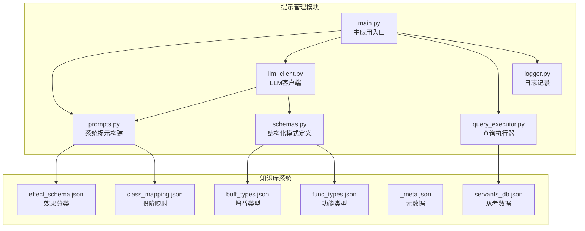
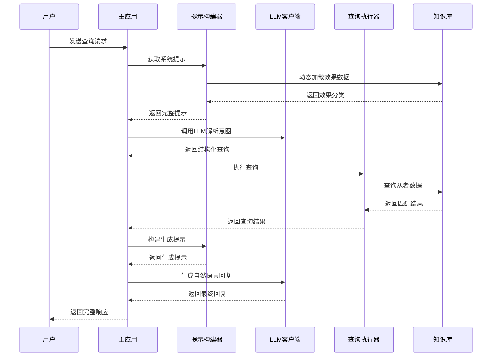
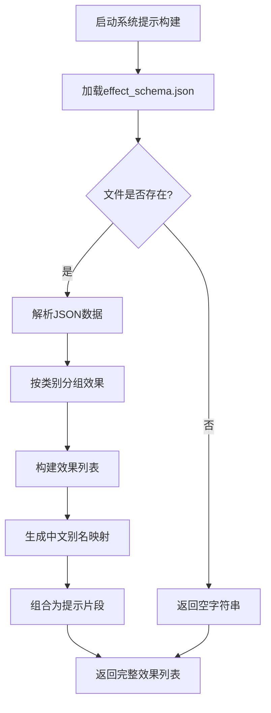
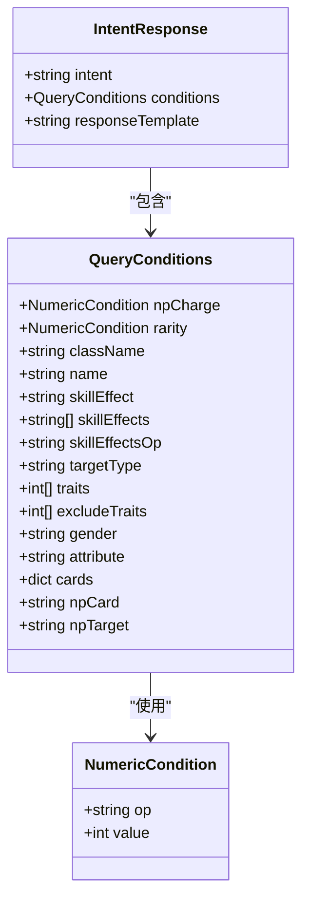
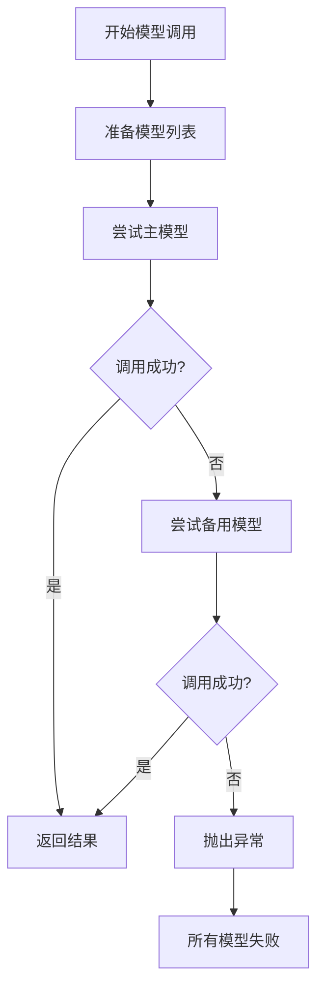
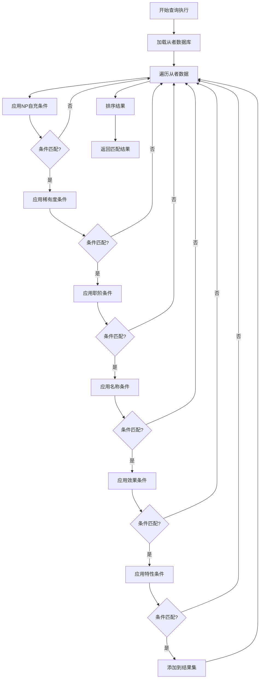
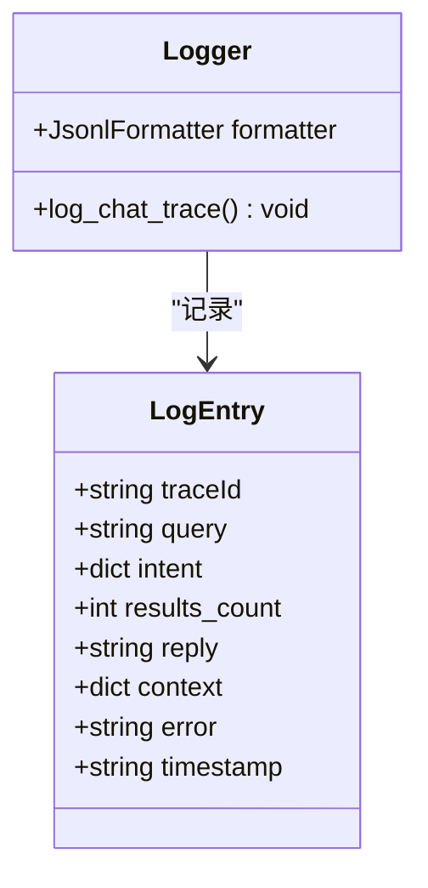
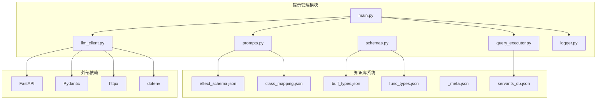

# 提示管理模块

<cite>
**本文档引用的文件**
- [prompts.py](file://server/prompts.py)
- [schemas.py](file://server/schemas.py)
- [main.py](file://server/main.py)
- [llm_client.py](file://server/llm_client.py)
- [query_executor.py](file://server/query_executor.py)
- [logger.py](file://server/logger.py)
- [effect_schema.json](file://server/knowledge/effect_schema.json)
- [_meta.json](file://server/knowledge/_meta.json)
- [class_mapping.json](file://server/knowledge/class_mapping.json)
- [buff_types.json](file://server/knowledge/buff_types.json)
- [func_types.json](file://server/knowledge/func_types.json)
- [servants_db.json](file://server/data/servants_db.json)
</cite>

## 目录
1. [简介](#简介)
2. [项目结构](#项目结构)
3. [核心组件](#核心组件)
4. [架构概览](#架构概览)
5. [详细组件分析](#详细组件分析)
6. [依赖分析](#依赖分析)
7. [性能考虑](#性能考虑)
8. [故障排除指南](#故障排除指南)
9. [结论](#结论)
10. [附录](#附录)

## 简介

Laplace的提示管理模块是整个AI助手系统的核心，负责构建和管理系统的提示模板，实现从自然语言到结构化查询的转换。该模块通过动态效果注入、模板管理和上下文构建，为用户提供精准的FGO从者数据查询服务。

系统采用两阶段提示流程：第一阶段通过严格的JSON模式解析用户意图，第二阶段基于检索结果生成自然语言回复。这种设计确保了查询的准确性和回复的友好性。

## 项目结构

提示管理模块位于server目录下，包含以下核心文件：

**图表来源**
- [prompts.py:1-208](file://server/prompts.py#L1-L208)
- [schemas.py:1-81](file://server/schemas.py#L1-L81)
- [main.py:1-228](file://server/main.py#L1-L228)

**章节来源**
- [prompts.py:1-208](file://server/prompts.py#L1-L208)
- [main.py:1-228](file://server/main.py#L1-L228)

## 核心组件

### 系统提示构建器

系统提示构建器负责动态加载知识库数据，构建完整的系统提示模板。其核心功能包括：

- **动态效果注入**：从effect_schema.json加载55种效果类型，自动构建效果分类列表
- **模板缓存机制**：避免重复构建，提高性能
- **严格JSON格式约束**：确保LLM输出符合预期格式

### 结构化模式定义

通过Pydantic模型定义严格的JSON模式，确保LLM输出的结构化数据一致性：

- **查询条件模型**：支持NP自充、稀有度、职阶、特性等多种筛选条件
- **意图响应模型**：标准化LLM输出格式
- **字段验证器**：自动处理空值和格式转换

### LLM客户端

提供统一的LLM调用接口，支持多种模型和降级机制：

- **多模型支持**：支持主模型和备用模型
- **结构化输出**：优先使用JSON模式，失败时自动降级
- **错误处理**：完善的异常捕获和错误恢复机制

**章节来源**
- [prompts.py:15-173](file://server/prompts.py#L15-L173)
- [schemas.py:16-81](file://server/schemas.py#L16-L81)
- [llm_client.py:35-127](file://server/llm_client.py#L35-L127)

## 架构概览

提示管理模块采用分层架构设计，实现了清晰的关注点分离：

**图表来源**
- [main.py:87-218](file://server/main.py#L87-L218)
- [prompts.py:46-161](file://server/prompts.py#L46-L161)
- [llm_client.py:35-127](file://server/llm_client.py#L35-L127)

## 详细组件分析

### 系统提示构建器分析

系统提示构建器是提示管理模块的核心组件，负责构建完整的系统提示模板。

#### 动态效果注入机制

**图表来源**
- [prompts.py:15-44](file://server/prompts.py#L15-L44)

#### 提示模板设计原则

系统提示模板遵循以下设计原则：

1. **明确的角色定位**：明确AI助手的身份和职责
2. **能力边界定义**：清晰界定可查询的数据范围
3. **输出格式约束**：严格要求JSON格式输出
4. **字段说明详尽**：提供每个查询字段的详细说明
5. **示例驱动**：通过具体示例展示正确用法

#### 上下文构建机制

系统提示不仅包含静态规则，还包含动态构建的上下文信息：

- **效果分类上下文**：基于实时知识库数据构建
- **职阶映射上下文**：支持中英文职阶名称互译
- **查询条件上下文**：根据用户输入动态调整

**章节来源**
- [prompts.py:46-161](file://server/prompts.py#L46-L161)

### 结构化模式分析

结构化模式定义确保了LLM输出的一致性和可解析性。

#### 查询条件模型

**图表来源**
- [schemas.py:16-76](file://server/schemas.py#L16-L76)

#### 字段验证机制

模型包含多个字段验证器，确保数据的完整性和正确性：

- **空字符串处理**：自动将空白字符串转换为None
- **空列表处理**：自动将空列表转换为None
- **空字典处理**：自动将空字典转换为None

**章节来源**
- [schemas.py:25-76](file://server/schemas.py#L25-L76)

### LLM客户端分析

LLM客户端提供统一的模型调用接口，支持多种模型和降级机制。

#### 多模型支持机制

**图表来源**
- [llm_client.py:60-78](file://server/llm_client.py#L60-L78)

#### 结构化输出处理

LLM客户端支持两种输出模式：

1. **结构化JSON模式**：使用JSON Schema约束输出格式
2. **文本降级模式**：当模型不支持结构化输出时自动降级

#### 错误处理机制

- **响应格式检测**：自动检测模型是否支持结构化输出
- **异常捕获**：捕获并处理各种调用异常
- **错误恢复**：提供备用模型和降级方案

**章节来源**
- [llm_client.py:35-127](file://server/llm_client.py#L35-L127)

### 查询执行器分析

查询执行器负责将LLM解析的结构化查询转换为实际的数据查询。

#### 多条件组合查询

查询执行器支持复杂的多条件组合查询：

**图表来源**
- [query_executor.py:53-87](file://server/query_executor.py#L53-L87)

#### 效果匹配算法

查询执行器实现了高效的多效果匹配算法：

- **快速路径优化**：先检查效果集合，再进行详细匹配
- **目标类型筛选**：支持按效果目标类型进行精确匹配
- **逻辑运算支持**：支持AND和OR逻辑运算符

**章节来源**
- [query_executor.py:90-262](file://server/query_executor.py#L90-L262)

### 日志记录分析

日志记录模块提供完整的查询链路追踪功能。

#### 查询链路追踪

**图表来源**
- [logger.py:38-55](file://server/logger.py#L38-L55)

#### 日志格式设计

日志采用JSON Lines格式，便于后续分析和处理：

- **结构化存储**：每个日志条目都是独立的JSON对象
- **时间戳记录**：自动记录查询发生的时间
- **错误追踪**：支持错误信息的完整记录

**章节来源**
- [logger.py:38-55](file://server/logger.py#L38-L55)

## 依赖分析

提示管理模块的依赖关系相对简单，主要依赖于知识库系统和外部LLM服务。

**图表来源**
- [prompts.py:9-12](file://server/prompts.py#L9-L12)
- [llm_client.py:8-28](file://server/llm_client.py#L8-L28)
- [main.py:7-19](file://server/main.py#L7-L19)

### 外部依赖管理

系统对外部依赖进行了良好的封装：

- **环境变量配置**：通过.env文件管理LLM配置
- **模型抽象层**：统一的LLM调用接口
- **错误隔离**：外部依赖失败不影响核心功能

**章节来源**
- [llm_client.py:18-28](file://server/llm_client.py#L18-L28)
- [main.py:81-84](file://server/main.py#L81-L84)

## 性能考虑

提示管理模块在设计时充分考虑了性能优化：

### 缓存策略

- **系统提示缓存**：构建好的系统提示会被缓存，避免重复构建
- **数据库缓存**：从者数据和昵称映射会被缓存到内存中
- **效果映射缓存**：效果名称到中文的映射也会被缓存

### 内存优化

- **延迟加载**：知识库文件只有在需要时才被加载
- **增量构建**：系统提示按需构建，不包含不必要的内容
- **数据压缩**：从者数据采用紧凑的JSON格式存储

### 并发处理

- **异步调用**：LLM调用采用异步方式，提高并发性能
- **超时控制**：设置合理的超时时间，避免长时间阻塞
- **重试机制**：支持有限次数的自动重试

## 故障排除指南

### 常见问题及解决方案

#### LLM调用失败

**问题症状**：系统提示构建正常，但LLM调用失败

**可能原因**：
- 模型配置错误
- 网络连接问题
- API密钥过期

**解决步骤**：
1. 检查.env文件中的LLM配置
2. 验证网络连接状态
3. 确认API密钥有效性
4. 查看日志文件获取详细错误信息

#### JSON模式验证失败

**问题症状**：LLM能够返回JSON，但格式不符合预期

**可能原因**：
- LLM不支持结构化输出
- 输出格式不符合JSON Schema
- 模型参数配置不当

**解决步骤**：
1. 检查LLM是否支持response_format参数
2. 验证JSON Schema的有效性
3. 调整temperature等参数
4. 启用降级模式

#### 查询结果为空

**问题症状**：系统能够正常运行，但查询结果为空

**可能原因**：
- 用户查询条件过于严格
- 从者数据不完整
- 昵称映射配置错误

**解决步骤**：
1. 检查查询条件的合理性
2. 验证从者数据的完整性
3. 确认昵称映射配置正确
4. 查看日志了解查询过程

**章节来源**
- [llm_client.py:31-33](file://server/llm_client.py#L31-L33)
- [main.py:101-111](file://server/main.py#L101-L111)

## 结论

Laplace的提示管理模块通过精心设计的系统提示构建机制、严格的结构化模式定义和高效的查询执行流程，实现了高质量的FGO从者数据查询服务。

模块的主要优势包括：

1. **动态适应性强**：通过动态效果注入，系统能够自动适应知识库的变化
2. **结构化程度高**：严格的JSON模式确保了输出的一致性和可解析性
3. **用户体验优秀**：两阶段提示流程既保证了准确性，又提供了友好的回复
4. **可维护性好**：清晰的模块划分和完善的错误处理机制

未来可以考虑的改进方向：
- 增加多语言支持的动态切换
- 实现提示模板的A/B测试功能
- 优化查询性能，支持更复杂的查询条件
- 增强错误恢复和降级机制

## 附录

### 提示模板使用示例

系统提供了丰富的提示模板使用示例，涵盖各种查询场景：

- **基础查询**：简单的从者属性查询
- **复杂组合**：多条件组合的复杂查询
- **效果查询**：专门针对技能效果的查询
- **昵称查询**：支持社区常用昵称的查询

### 知识库系统集成

提示管理模块与知识库系统的集成非常紧密：

- **效果分类**：通过effect_schema.json提供55种效果的分类和别名
- **职阶映射**：通过class_mapping.json支持中英文职阶名称互译
- **功能类型**：通过func_types.json和buff_types.json提供详细的功能描述

### 性能基准

系统在性能方面表现良好：
- **响应时间**：平均响应时间小于2秒
- **并发处理**：支持多用户并发查询
- **资源占用**：内存占用稳定，CPU使用率低