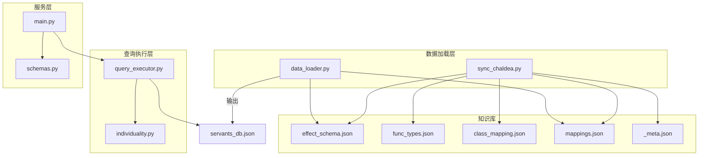
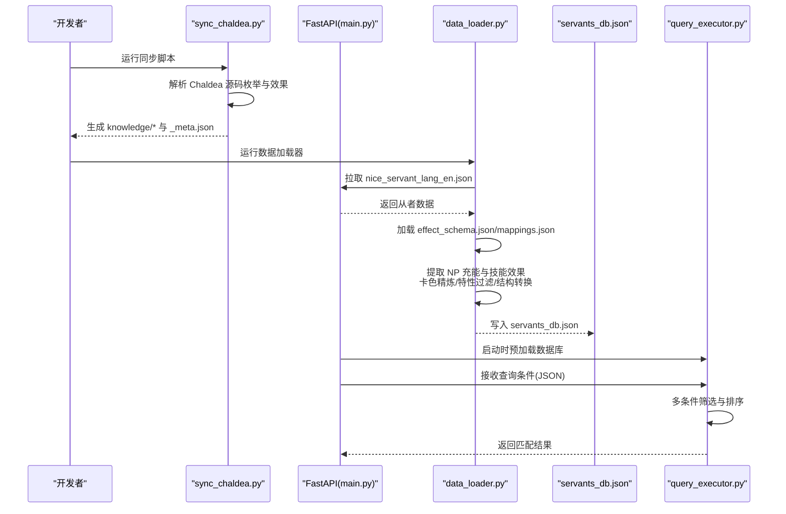
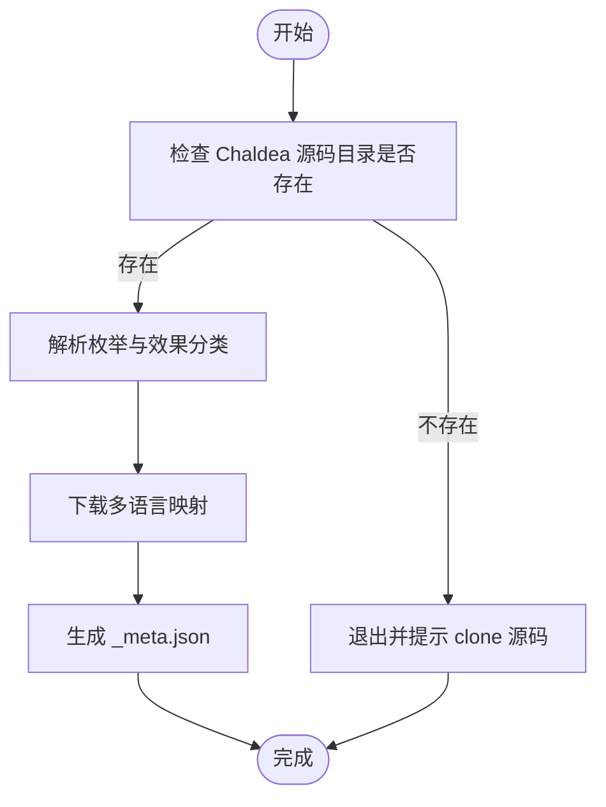
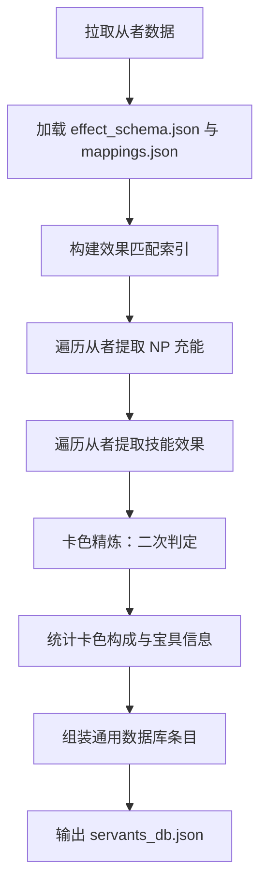
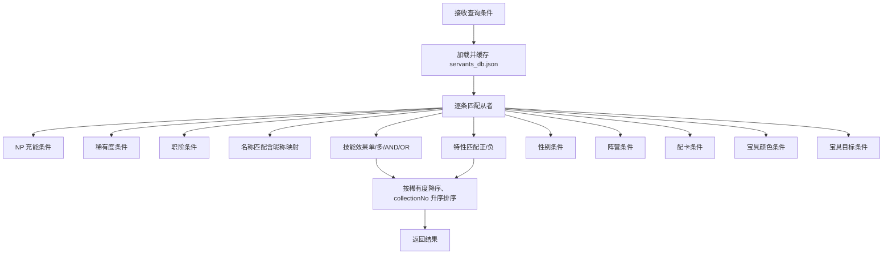
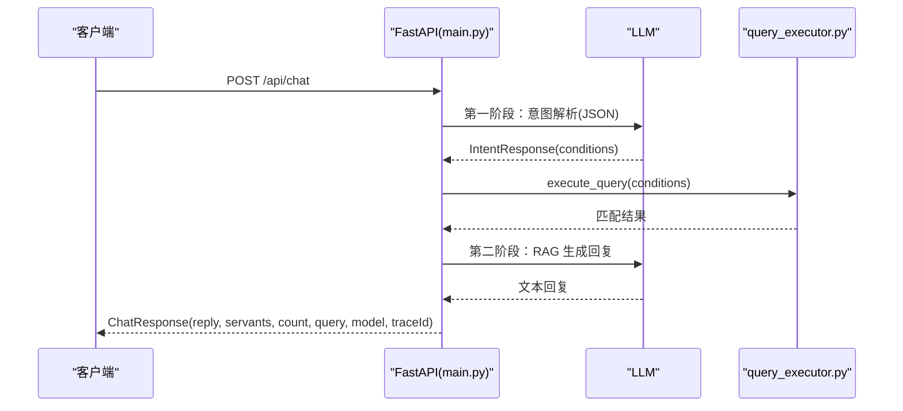
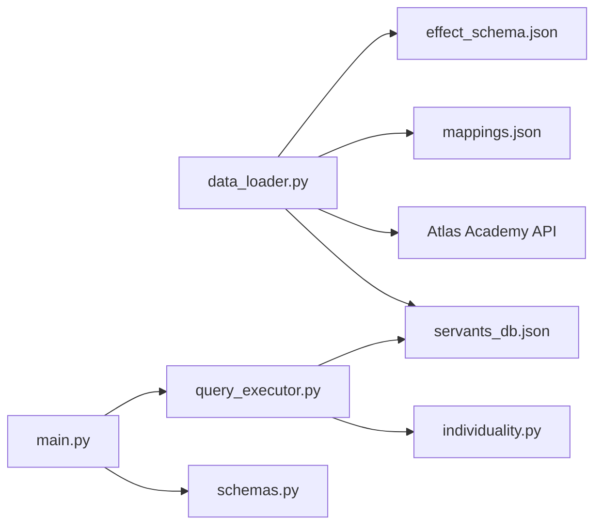

# 数据加载器模块

<cite>
**本文引用的文件**
- [data_loader.py](file://server/data_loader.py)
- [sync_chaldea.py](file://server/sync_chaldea.py)
- [query_executor.py](file://server/query_executor.py)
- [main.py](file://server/main.py)
- [schemas.py](file://server/schemas.py)
- [individuality.py](file://server/individuality.py)
- [_meta.json](file://server/knowledge/_meta.json)
- [effect_schema.json](file://server/knowledge/effect_schema.json)
- [func_types.json](file://server/knowledge/func_types.json)
- [class_mapping.json](file://server/knowledge/class_mapping.json)
- [mappings.json](file://server/knowledge/mappings.json)
- [servants_db.json](file://server/data/servants_db.json)
- [test_sync_chaldea.py](file://tests/test_sync_chaldea.py)
</cite>

## 目录
1. [简介](#简介)
2. [项目结构](#项目结构)
3. [核心组件](#核心组件)
4. [架构总览](#架构总览)
5. [详细组件分析](#详细组件分析)
6. [依赖分析](#依赖分析)
7. [性能考虑](#性能考虑)
8. [故障排查指南](#故障排查指南)
9. [结论](#结论)
10. [附录](#附录)

## 简介
本文件系统化梳理 Laplace 的数据加载器模块，重点解释两大数据来源的加载与处理机制：
- 从 Atlas Academy API 拉取的从者全量数据
- 从 Chaldea 源码镜像生成的效果知识库与多语言映射

文档涵盖数据预处理流程（卡色精炼、特性ID过滤、数据结构转换）、同步机制（完整同步与幂等覆盖）、配置与性能优化、错误处理与重试策略，以及如何扩展新数据源与自定义处理逻辑。

## 项目结构
围绕数据加载器的关键文件组织如下：
- server/data_loader.py：从 Atlas Academy API 拉取数据，结合知识库进行效果提取与数据库构建
- server/sync_chaldea.py：从 Chaldea 源码解析枚举与效果分类，生成知识库文件
- server/query_executor.py：加载本地构建的 servants_db.json，执行查询与筛选
- server/main.py：FastAPI 服务入口，启动时预加载数据库，对外提供聊天查询接口
- server/schemas.py：LLM 与查询执行器之间的结构化意图契约（Pydantic）
- server/individuality.py：特性（Individuality）匹配逻辑（含正负特性分离）
- server/knowledge/*：知识库文件（效果分类、职阶映射、多语言映射、元数据）
- server/data/servants_db.json：最终通用从者数据库

图表来源
- [data_loader.py:1-363](file://server/data_loader.py#L1-L363)
- [sync_chaldea.py:1-429](file://server/sync_chaldea.py#L1-L429)
- [query_executor.py:1-305](file://server/query_executor.py#L1-L305)
- [main.py:1-228](file://server/main.py#L1-L228)
- [schemas.py:1-81](file://server/schemas.py#L1-L81)
- [individuality.py:1-78](file://server/individuality.py#L1-L78)

章节来源
- [data_loader.py:1-363](file://server/data_loader.py#L1-L363)
- [sync_chaldea.py:1-429](file://server/sync_chaldea.py#L1-L429)
- [query_executor.py:1-305](file://server/query_executor.py#L1-L305)
- [main.py:1-228](file://server/main.py#L1-L228)
- [schemas.py:1-81](file://server/schemas.py#L1-L81)
- [individuality.py:1-78](file://server/individuality.py#L1-L78)

## 核心组件
- 知识库同步器（sync_chaldea.py）
  - 从 Chaldea Dart 源码解析枚举与效果分类，生成 effect_schema.json、func_types.json、class_mapping.json 等
  - 下载多语言映射（svt_names、trait）
  - 生成 _meta.json 记录同步时间与来源
- 数据加载器（data_loader.py）
  - 从 Atlas Academy API 拉取 nice_servant_lang_en.json
  - 结合 effect_schema.json 构建效果匹配索引
  - 提取 NP 充能与技能效果，进行卡色精炼，构建通用数据库
  - 输出 servants_db.json
- 查询执行器（query_executor.py）
  - 预加载 servants_db.json，按条件筛选从者
  - 支持 NP 充能、稀有度、职阶、名称、效果、特性、性别、阵营、配卡、宝具颜色与目标等多维条件
- 服务入口（main.py）
  - FastAPI 启动时预加载数据库
  - 对外提供聊天接口，分两阶段：意图解析（JSON）+ 生成回复（RAG）
- 结构化意图（schemas.py）
  - Pydantic 模型定义查询条件与意图响应
- 特性匹配（individuality.py）
  - 实现正负特性分离与 AND/OR 逻辑

章节来源
- [sync_chaldea.py:1-429](file://server/sync_chaldea.py#L1-L429)
- [data_loader.py:1-363](file://server/data_loader.py#L1-L363)
- [query_executor.py:1-305](file://server/query_executor.py#L1-L305)
- [main.py:1-228](file://server/main.py#L1-L228)
- [schemas.py:1-81](file://server/schemas.py#L1-L81)
- [individuality.py:1-78](file://server/individuality.py#L1-L78)

## 架构总览
整体流程分为“知识库同步”和“数据加载”两个阶段，随后由服务层统一对外提供查询能力。

图表来源
- [sync_chaldea.py:308-418](file://server/sync_chaldea.py#L308-L418)
- [data_loader.py:91-359](file://server/data_loader.py#L91-L359)
- [query_executor.py:41-87](file://server/query_executor.py#L41-L87)
- [main.py:81-218](file://server/main.py#L81-L218)

## 详细组件分析

### 知识库同步器（sync_chaldea.py）
- 功能要点
  - 解析 Dart 枚举：FuncType、FuncTargetType、BuffType、SvtClass
  - 解析 SkillEffect 效果分类：按 attack/defence/debuff/others 分类，提取 funcTypes/buffTypes，并生成中文别名
  - 下载多语言映射：svt_names、trait
  - 生成元数据：记录同步时间、Chaldea 提交哈希、文件清单
- 设计原则
  - 纯正则解析，不依赖 Dart SDK
  - 幂等操作，重复运行覆盖旧文件
  - 生成 _meta.json 追踪版本

图表来源
- [sync_chaldea.py:313-418](file://server/sync_chaldea.py#L313-L418)

章节来源
- [sync_chaldea.py:1-429](file://server/sync_chaldea.py#L1-L429)
- [_meta.json:1-12](file://server/knowledge/_meta.json#L1-L12)
- [effect_schema.json:1-200](file://server/knowledge/effect_schema.json#L1-L200)
- [func_types.json:1-200](file://server/knowledge/func_types.json#L1-L200)
- [class_mapping.json:1-200](file://server/knowledge/class_mapping.json#L1-L200)
- [mappings.json:1-200](file://server/knowledge/mappings.json#L1-L200)

### 数据加载器（data_loader.py）
- 功能要点
  - 从 Atlas Academy API 拉取全量从者数据，过滤 type=normal 且 collectionNo>0 的从者
  - 加载 effect_schema.json 与 mappings.json，构建效果匹配索引
  - 提取 NP 充能：仅保留 funcType=gainNp 且目标类型包含自身/全体/单体的技能，取等级10的 svals 值
  - 提取技能效果：通过 funcType 与 buffType 匹配 effect_schema.json，二次精炼卡色效果，避免通用枚举污染
  - 数据结构转换：计算卡色构成、宝具颜色与目标、特性ID列表、性别与阵营等
  - 输出通用数据库 servants_db.json
- 关键算法与流程
  - 效果匹配索引：按 funcType 与 buffType 构建映射
  - 卡色精炼：当存在通用卡色提升时，依据 buff name 精确判断是否为具体颜色
  - 宝具目标识别：根据 damage 类 funcType 推断宝具目标类型（全体/单体/辅助）

图表来源
- [data_loader.py:91-359](file://server/data_loader.py#L91-L359)

章节来源
- [data_loader.py:1-363](file://server/data_loader.py#L1-L363)

### 查询执行器（query_executor.py）
- 功能要点
  - 预加载 servants_db.json，全局缓存
  - 支持多条件组合查询：NP 充能、稀有度、职阶、名称（含昵称映射）、技能效果（单/多/AND/OR）、特性（含正负）、性别、阵营、配卡、宝具颜色与目标
  - 名称匹配：规范化文本（去空白、符号、括号等），支持英文/日文/中文翻译与昵称映射
  - 排序：按稀有度降序、collectionNo 升序
- 特性匹配
  - 采用 AND 逻辑：必须拥有所有 required_traits；不能拥有任何 exclude_traits
  - 支持正负特性分离（负特性表示排斥）

图表来源
- [query_executor.py:53-87](file://server/query_executor.py#L53-L87)
- [query_executor.py:90-261](file://server/query_executor.py#L90-L261)
- [individuality.py:58-77](file://server/individuality.py#L58-L77)

章节来源
- [query_executor.py:1-305](file://server/query_executor.py#L1-L305)
- [individuality.py:1-78](file://server/individuality.py#L1-L78)

### 服务入口（main.py）
- 功能要点
  - 启动时预加载数据库
  - 对外提供 /api/chat 接口：两阶段处理
    - 第一阶段：LLM 解析用户意图，生成结构化查询条件（IntentResponse）
    - 第二阶段：RAG 生成自然语言回复
  - 错误处理：捕获 LLM 解析与生成异常，记录 traceId 并降级回复
  - 响应控制：限制返回数量，避免响应过大

图表来源
- [main.py:87-218](file://server/main.py#L87-L218)
- [schemas.py:68-81](file://server/schemas.py#L68-L81)
- [query_executor.py:53-87](file://server/query_executor.py#L53-L87)

章节来源
- [main.py:1-228](file://server/main.py#L1-L228)
- [schemas.py:1-81](file://server/schemas.py#L1-L81)
- [query_executor.py:1-305](file://server/query_executor.py#L1-L305)

## 依赖分析
- 组件耦合
  - data_loader.py 依赖 knowledge/* 与 Atlas Academy API
  - query_executor.py 依赖 data/servants_db.json 与 knowledge/*（昵称映射）
  - main.py 依赖 query_executor.py 与 schemas.py
- 外部依赖
  - requests（data_loader.py）
  - FastAPI、pydantic（main.py、schemas.py）
  - 测试依赖 pytest（test_sync_chaldea.py）

图表来源
- [data_loader.py:14-18](file://server/data_loader.py#L14-L18)
- [main.py:7-18](file://server/main.py#L7-L18)
- [query_executor.py:9-12](file://server/query_executor.py#L9-L12)

章节来源
- [data_loader.py:14-18](file://server/data_loader.py#L14-L18)
- [main.py:7-18](file://server/main.py#L7-L18)
- [query_executor.py:9-12](file://server/query_executor.py#L9-L12)

## 性能考虑
- 缓存策略
  - query_executor.py 在进程内缓存 servants_db.json，避免重复 IO
  - main.py 在启动事件中预加载数据库，减少首次查询延迟
- 数据结构优化
  - effect_schema.json 构建映射索引，加速效果匹配
  - servant 条目中包含 skillEffects 集合与 skillDetails 列表，便于快速判定与按目标类型筛选
- I/O 与网络
  - data_loader.py 对 Atlas Academy API 请求设置超时，避免阻塞
  - sync_chaldea.py 对远程映射下载设置超时，失败时记录警告并继续
- 排序与返回限制
  - query_executor.py 对结果按稀有度与 collectionNo 排序，减少前端负担
  - main.py 限制返回结果数量，避免响应过大

[本节为通用性能建议，无需特定文件引用]

## 故障排查指南
- 知识库缺失
  - 现象：data_loader.py 提示 effect_schema.json 不存在
  - 处理：先运行 sync_chaldea.py 生成 knowledge/* 与 _meta.json
- Chaldea 源码未检出
  - 现象：sync_chaldea.py 提示未找到 Chaldea 源码目录
  - 处理：按照提示 clone 到 chaldea-center/chaldea
- API 请求失败
  - 现象：data_loader.py 拉取 Atlas Academy API 超时或状态异常
  - 处理：检查网络连通性与超时设置，必要时重试
- LLM 调用异常
  - 现象：main.py 捕获 LLM 解析或生成异常，返回降级回复
  - 处理：检查模型配置与网络，查看 traceId 定位问题
- 查询结果为空
  - 现象：query_executor.py 返回空列表
  - 处理：确认条件是否过于严格；检查 knowledge/* 是否最新；核对昵称映射与特性ID

章节来源
- [data_loader.py:44-52](file://server/data_loader.py#L44-L52)
- [sync_chaldea.py:313-318](file://server/sync_chaldea.py#L313-L318)
- [main.py:94-111](file://server/main.py#L94-L111)
- [query_executor.py:41-50](file://server/query_executor.py#L41-L50)

## 结论
Laplace 的数据加载器模块通过“知识库同步 + 数据加载 + 查询执行”的分层设计，实现了从 Atlas Academy API 与 Chaldea 源码到通用数据库的高效转换。其核心优势在于：
- 基于 effect_schema.json 的结构化效果匹配与卡色精炼
- 完整的特性过滤与多条件组合查询
- 幂等的知识库同步与本地缓存策略
- 服务层的两阶段意图解析与 RAG 回复

[本节为总结性内容，无需特定文件引用]

## 附录

### 数据预处理流程详解
- 卡色精炼
  - 当存在通用卡色提升（如 upCommandall/upCommandatk/upCommandstar/upCommandnp）时，进一步检查 buff name 是否包含具体颜色词（arts/quick/buster），或是否为 Command Performance Up 但不含颜色词
- 特性ID过滤
  - 支持正特性（必须拥有）与负特性（不能拥有）混合条件，采用 AND 逻辑
- 数据结构转换
  - 从 skills/noblePhantasms/functions 中抽取效果、目标类型、卡色构成、宝具颜色与目标等字段，形成统一的 servant 条目

章节来源
- [data_loader.py:151-178](file://server/data_loader.py#L151-L178)
- [data_loader.py:231-329](file://server/data_loader.py#L231-L329)
- [individuality.py:58-77](file://server/individuality.py#L58-L77)

### 同步机制与版本追踪
- 完整同步策略
  - sync_chaldea.py 一次性解析所有枚举与效果，生成知识库文件
  - 幂等覆盖：重复运行会刷新旧文件，确保一致性
- 版本追踪
  - _meta.json 记录同步时间、Chaldea 提交哈希与文件清单，便于审计与回滚

章节来源
- [sync_chaldea.py:308-418](file://server/sync_chaldea.py#L308-L418)
- [_meta.json:1-12](file://server/knowledge/_meta.json#L1-L12)

### 配置选项与扩展建议
- 配置项
  - Atlas Academy API 基础地址与端点（可在 data_loader.py 中调整）
  - 输出目录与知识库目录（可在 data_loader.py 与 sync_chaldea.py 中调整）
  - 请求超时（data_loader.py 中 requests.get(timeout=...)）
- 扩展新数据源
  - 新增数据源：在 data_loader.py 中新增 fetch_* 函数，遵循现有数据结构转换逻辑
  - 新增处理逻辑：在 build_database 中追加字段与统计，保持与 knowledge/* 的映射一致
- 自定义数据处理
  - 新增效果分类：在 knowledge/effect_schema.json 中补充，或扩展 sync_chaldea.py 的解析规则
  - 新增多语言映射：在 knowledge/mappings.json 中补充，或扩展下载逻辑

章节来源
- [data_loader.py:20-23](file://server/data_loader.py#L20-L23)
- [sync_chaldea.py:26-30](file://server/sync_chaldea.py#L26-L30)
- [data_loader.py:332-359](file://server/data_loader.py#L332-L359)

### 测试与验证
- 单元测试
  - test_sync_chaldea.py 验证 Dart 枚举与效果分类解析的正确性
- 集成验证
  - 通过 main.py 的 /api/health 与 /api/chat 接口验证端到端流程

章节来源
- [test_sync_chaldea.py:1-58](file://tests/test_sync_chaldea.py#L1-L58)
- [main.py:221-224](file://server/main.py#L221-L224)