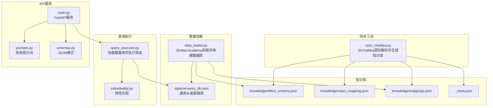
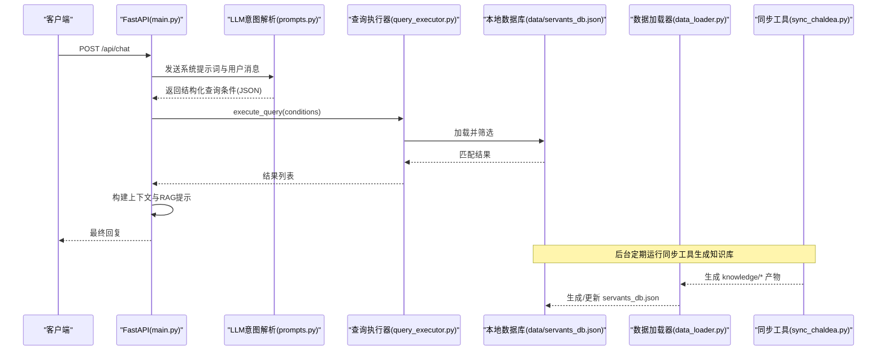
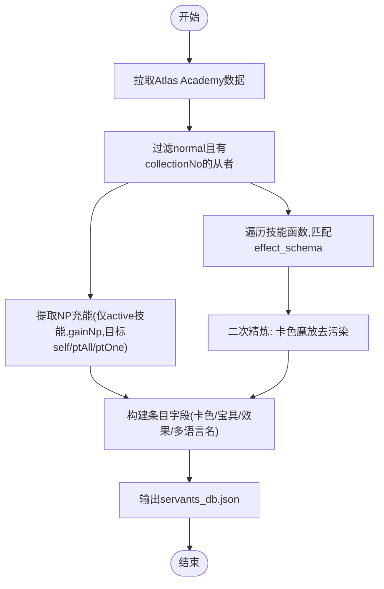
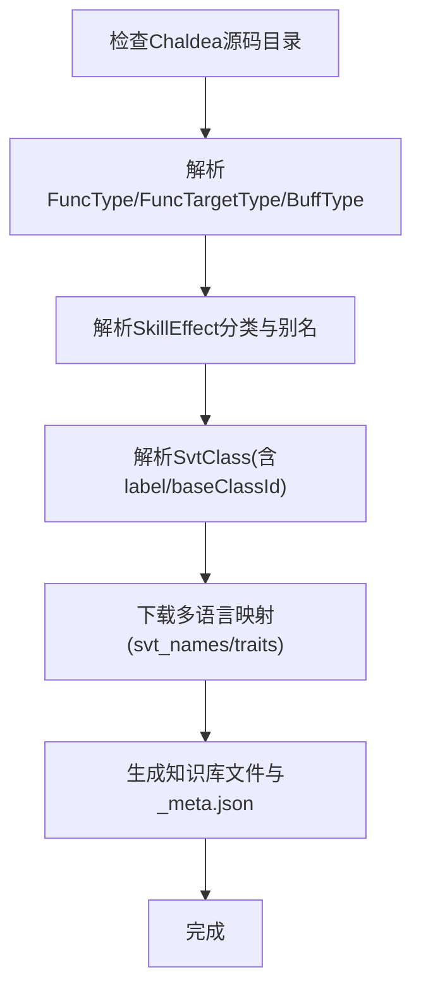
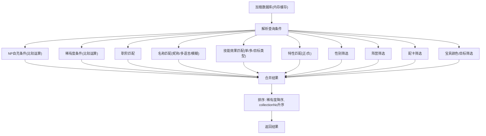
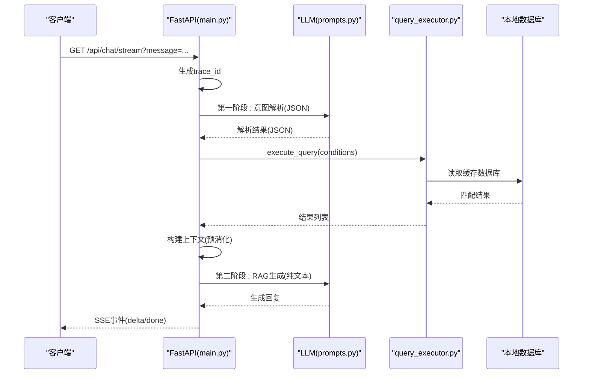
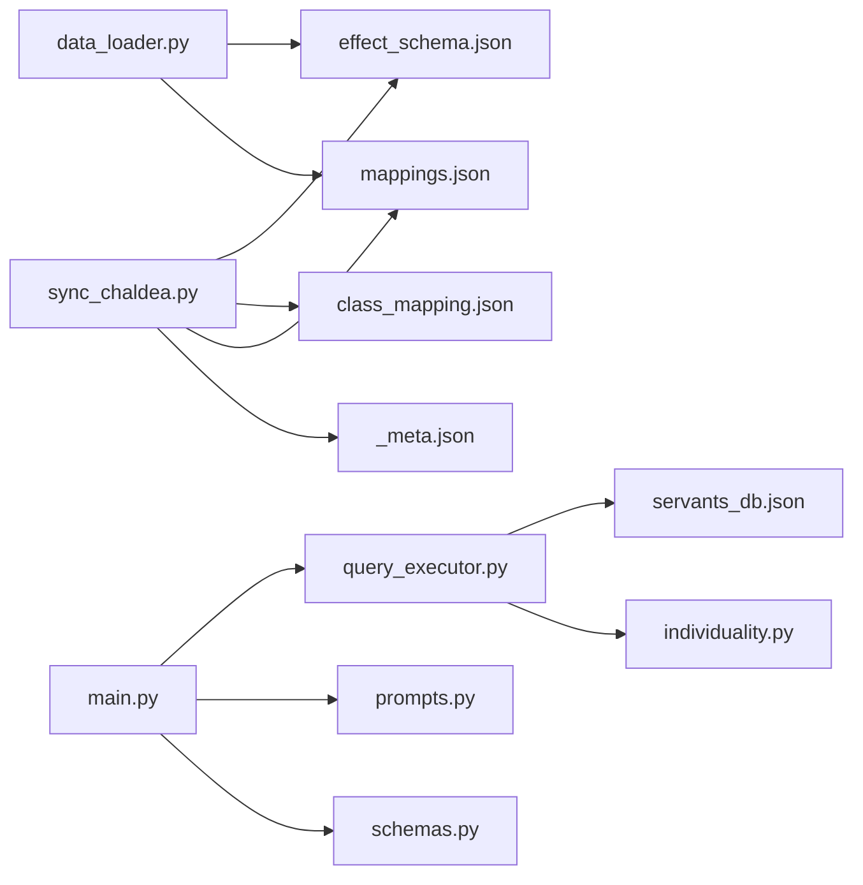

# 数据加载系统

<cite>
**本文引用的文件**
- [server/data_loader.py](file://server/data_loader.py)
- [server/sync_chaldea.py](file://server/sync_chaldea.py)
- [server/query_executor.py](file://server/query_executor.py)
- [server/main.py](file://server/main.py)
- [server/prompts.py](file://server/prompts.py)
- [server/schemas.py](file://server/schemas.py)
- [server/individuality.py](file://server/individuality.py)
- [server/knowledge/_meta.json](file://server/knowledge/_meta.json)
- [server/knowledge/effect_schema.json](file://server/knowledge/effect_schema.json)
- [server/knowledge/class_mapping.json](file://server/knowledge/class_mapping.json)
- [server/knowledge/mappings.json](file://server/knowledge/mappings.json)
- [tests/test_sync_chaldea.py](file://tests/test_sync_chaldea.py)
</cite>

## 目录
1. [简介](#简介)
2. [项目结构](#项目结构)
3. [核心组件](#核心组件)
4. [架构总览](#架构总览)
5. [详细组件分析](#详细组件分析)
6. [依赖关系分析](#依赖关系分析)
7. [性能考量](#性能考量)
8. [故障排查指南](#故障排查指南)
9. [结论](#结论)
10. [附录](#附录)

## 简介
本文件面向Laplace项目的“数据加载系统”，系统性阐述从数据采集、知识库同步、数据预处理与清洗、缓存与更新、版本管理与一致性、质量校验与验证、故障转移与降级、扩展新数据源、以及性能优化与最佳实践。重点覆盖：
- Atlas Academy API的集成与数据获取流程
- 基于Chaldea源码的Schema镜像同步工具
- 从者数据库构建、字段映射与格式标准化
- 缓存策略与增量更新机制
- 版本管理与一致性保障
- 数据质量检查与验证规则
- 故障转移与降级策略
- 扩展新数据源的方法论
- 性能优化与最佳实践

## 项目结构
Laplace服务端采用“知识库驱动 + 数据加载 + 查询执行 + API服务”的分层架构：
- 知识库（server/knowledge）：存放Chaldea解析产物与多语言映射
- 数据加载器（server/data_loader.py）：从Atlas Academy API抓取并构建通用从者数据库
- 同步工具（server/sync_chaldea.py）：从Chaldea源码解析枚举与效果分类，生成知识库
- 查询执行器（server/query_executor.py）：加载本地数据库并执行条件筛选
- API入口（server/main.py）：FastAPI服务，提供聊天与流式SSE接口
- 提示词与模式（server/prompts.py, server/schemas.py）：约束LLM输出结构
- 特性匹配（server/individuality.py）：实现特性ID的正负特性分离与匹配
- 测试（tests/test_sync_chaldea.py）：验证同步工具解析逻辑

图表来源
- [server/data_loader.py:1-363](file://server/data_loader.py#L1-L363)
- [server/sync_chaldea.py:1-429](file://server/sync_chaldea.py#L1-L429)
- [server/query_executor.py:1-343](file://server/query_executor.py#L1-L343)
- [server/main.py:1-365](file://server/main.py#L1-L365)
- [server/prompts.py:1-219](file://server/prompts.py#L1-L219)
- [server/schemas.py:1-92](file://server/schemas.py#L1-L92)
- [server/individuality.py:1-78](file://server/individuality.py#L1-L78)
- [server/knowledge/effect_schema.json:1-694](file://server/knowledge/effect_schema.json#L1-L694)
- [server/knowledge/class_mapping.json:1-478](file://server/knowledge/class_mapping.json#L1-L478)
- [server/knowledge/mappings.json:1-800](file://server/knowledge/mappings.json#L1-L800)
- [server/knowledge/_meta.json:1-12](file://server/knowledge/_meta.json#L1-L12)

章节来源
- [server/data_loader.py:1-363](file://server/data_loader.py#L1-L363)
- [server/sync_chaldea.py:1-429](file://server/sync_chaldea.py#L1-L429)
- [server/query_executor.py:1-343](file://server/query_executor.py#L1-L343)
- [server/main.py:1-365](file://server/main.py#L1-L365)
- [server/prompts.py:1-219](file://server/prompts.py#L1-L219)
- [server/schemas.py:1-92](file://server/schemas.py#L1-L92)
- [server/individuality.py:1-78](file://server/individuality.py#L1-L78)
- [server/knowledge/effect_schema.json:1-694](file://server/knowledge/effect_schema.json#L1-L694)
- [server/knowledge/class_mapping.json:1-478](file://server/knowledge/class_mapping.json#L1-L478)
- [server/knowledge/mappings.json:1-800](file://server/knowledge/mappings.json#L1-L800)
- [server/knowledge/_meta.json:1-12](file://server/knowledge/_meta.json#L1-L12)

## 核心组件
- Atlas Academy API数据采集器：负责从外部API拉取全量从者数据，并进行基础过滤与字段抽取
- Chaldea知识库同步器：从Chaldea源码解析枚举与效果分类，生成effect_schema.json、class_mapping.json、func_types.json、buff_types.json、mappings.json等
- 通用从者数据库构建器：基于知识库与原始数据，构建统一的servants_db.json，包含效果、NP充能、卡色、宝具等标准化字段
- 查询执行器：加载本地数据库，按条件筛选，支持多效果AND/OR、特性匹配、昵称映射、排序等
- API服务：FastAPI提供REST与SSE接口，集成LLM意图解析与RAG生成，支持错误降级与追踪

章节来源
- [server/data_loader.py:91-102](file://server/data_loader.py#L91-L102)
- [server/sync_chaldea.py:308-418](file://server/sync_chaldea.py#L308-L418)
- [server/query_executor.py:41-116](file://server/query_executor.py#L41-L116)
- [server/main.py:144-242](file://server/main.py#L144-L242)

## 架构总览
数据流从外部API进入，经由知识库与数据加载器，形成本地数据库；查询执行器从本地数据库检索，API服务整合LLM与提示词，最终返回结果。

图表来源
- [server/main.py:150-242](file://server/main.py#L150-L242)
- [server/prompts.py:178-184](file://server/prompts.py#L178-L184)
- [server/query_executor.py:53-116](file://server/query_executor.py#L53-L116)
- [server/data_loader.py:332-362](file://server/data_loader.py#L332-L362)
- [server/sync_chaldea.py:308-418](file://server/sync_chaldea.py#L308-L418)

## 详细组件分析

### 组件A：Atlas Academy API数据采集与数据库构建
- 数据采集：从固定URL拉取全量nice_servant数据，过滤type为normal且collectionNo>0的从者
- 字段抽取与标准化：
  - NP充能：仅保留active技能中funcType属于gainNp且目标类型为self/ptAll/ptOne的记录，按等级10的sval计算百分比
  - 技能效果：通过effect_schema.json的funcType/buffType匹配，二次精炼防止通用卡色枚举污染
  - 宝具效果：复用技能提取逻辑，识别伤害函数以确定宝具目标类型（all/one/support）
  - 卡色统计：将cards数组映射为arts/buster/quick计数
  - 多语言名：通过mappings.json的svt_names映射中文别名
- 输出：生成servants_db.json，包含id、collectionNo、name、originalName、aliasCN、rarity、className、faceUrl、traits、gender、attribute、cards、npCard、npTarget、npCharges、maxSelfCharge、maxPartyCharge、totalSelfCharge、hasNpCharge、skillEffects、npEffects、skillDetails等字段

图表来源
- [server/data_loader.py:91-102](file://server/data_loader.py#L91-L102)
- [server/data_loader.py:113-137](file://server/data_loader.py#L113-L137)
- [server/data_loader.py:181-228](file://server/data_loader.py#L181-L228)
- [server/data_loader.py:231-329](file://server/data_loader.py#L231-L329)

章节来源
- [server/data_loader.py:91-102](file://server/data_loader.py#L91-L102)
- [server/data_loader.py:113-137](file://server/data_loader.py#L113-L137)
- [server/data_loader.py:181-228](file://server/data_loader.py#L181-L228)
- [server/data_loader.py:231-329](file://server/data_loader.py#L231-L329)

### 组件B：Chaldea源码同步工具（Schema镜像）
- 功能：从Chaldea Dart源码解析枚举与效果分类，生成知识库文件
- 解析范围：
  - FuncType、FuncTargetType、BuffType枚举
  - SkillEffect分类（attack/defence/debuff/others），并生成funcTypes/buffTypes及中文别名
  - SvtClass枚举（含label与baseClassId），并筛选可用职阶
  - 多语言映射（svt_names、traits）下载
- 元数据：生成_meta.json记录同步时间、Chaldea提交哈希、文件计数等
- 设计原则：纯正则解析、幂等覆盖、可重复运行

图表来源
- [server/sync_chaldea.py:313-318](file://server/sync_chaldea.py#L313-L318)
- [server/sync_chaldea.py:321-341](file://server/sync_chaldea.py#L321-L341)
- [server/sync_chaldea.py:343-352](file://server/sync_chaldea.py#L343-L352)
- [server/sync_chaldea.py:354-366](file://server/sync_chaldea.py#L354-L366)
- [server/sync_chaldea.py:368-394](file://server/sync_chaldea.py#L368-L394)
- [server/sync_chaldea.py:396-418](file://server/sync_chaldea.py#L396-L418)

章节来源
- [server/sync_chaldea.py:308-418](file://server/sync_chaldea.py#L308-L418)
- [tests/test_sync_chaldea.py:1-58](file://tests/test_sync_chaldea.py#L1-L58)

### 组件C：查询执行器与缓存策略
- 缓存：首次加载时将servants_db.json缓存在内存中，后续请求直接从内存检索
- 条件筛选：支持NP自充、稀有度、职阶、名称（含昵称映射与多语言）、技能效果（单/多/AND/OR/目标类型）、特性（正/负）、性别、阵营、配卡、宝具颜色与目标等
- 排序：按稀有度降序、collectionNo升序
- 多从者对比：names参数支持对比多个从者，自动去重并排序

图表来源
- [server/query_executor.py:41-50](file://server/query_executor.py#L41-L50)
- [server/query_executor.py:53-116](file://server/query_executor.py#L53-L116)
- [server/query_executor.py:119-299](file://server/query_executor.py#L119-L299)
- [server/query_executor.py:302-327](file://server/query_executor.py#L302-L327)

章节来源
- [server/query_executor.py:41-116](file://server/query_executor.py#L41-L116)
- [server/query_executor.py:119-299](file://server/query_executor.py#L119-L299)
- [server/query_executor.py:302-327](file://server/query_executor.py#L302-L327)

### 组件D：API服务与LLM集成
- 启动时预加载数据库
- /api/chat：一次性对话，返回回复与结果列表
- /api/chat/stream：SSE流式接口，分阶段推送解析、检索、生成阶段
- 错误降级：LLM解析失败或生成失败时，回退到模板化回复
- 上下文构建：将结果翻译为中文效果名与预消化字段，限制返回数量

图表来源
- [server/main.py:245-355](file://server/main.py#L245-L355)
- [server/main.py:144-242](file://server/main.py#L144-L242)
- [server/prompts.py:186-218](file://server/prompts.py#L186-L218)

章节来源
- [server/main.py:144-242](file://server/main.py#L144-L242)
- [server/main.py:245-355](file://server/main.py#L245-L355)
- [server/prompts.py:178-184](file://server/prompts.py#L178-L184)
- [server/prompts.py:186-218](file://server/prompts.py#L186-L218)

### 组件E：数据预处理与清洗（字段映射与格式标准化）
- 字段映射：
  - 从者名：英文名、中文别名、日文原名
  - 职阶：通过class_mapping.json映射中文标签
  - 效果：通过effect_schema.json的aliases_zh进行中文翻译
  - 目标类型：funcTargetType分类为self/party/enemy/other
- 格式标准化：
  - 技能效果集合与列表统一排序
  - NP充能百分比与数值标准化
  - 卡色映射为arts/buster/quick
  - 宝具目标类型映射为one/all/support

章节来源
- [server/data_loader.py:140-148](file://server/data_loader.py#L140-L148)
- [server/main.py:38-51](file://server/main.py#L38-L51)
- [server/knowledge/class_mapping.json:1-77](file://server/knowledge/class_mapping.json#L1-L77)
- [server/knowledge/effect_schema.json:1-694](file://server/knowledge/effect_schema.json#L1-L694)

### 组件F：版本管理与一致性保证
- 版本元数据：_meta.json记录同步时间、Chaldea提交哈希、文件计数
- 一致性保障：
  - effect_schema.json提供效果分类与别名，确保LLM与后端一致
  - mappings.json提供多语言名映射，避免不同语言名导致的漏检
  - class_mapping.json限定可用职阶，避免未知职阶影响筛选
- 更新机制：同步工具幂等覆盖，重复运行不影响一致性

章节来源
- [server/knowledge/_meta.json:1-12](file://server/knowledge/_meta.json#L1-L12)
- [server/sync_chaldea.py:396-418](file://server/sync_chaldea.py#L396-L418)
- [server/knowledge/effect_schema.json:1-10](file://server/knowledge/effect_schema.json#L1-L10)
- [server/knowledge/mappings.json:1-800](file://server/knowledge/mappings.json#L1-L800)
- [server/knowledge/class_mapping.json:1-77](file://server/knowledge/class_mapping.json#L1-L77)

### 组件G：数据质量检查与验证规则
- 同步工具单元测试：验证枚举解析、效果分类解析、别名生成
- LLM模式约束：通过schemas.py的IntentResponse与QueryConditions确保输出结构化
- 查询执行器校验：空值清理、空列表/字典转None、比较运算符校验

章节来源
- [tests/test_sync_chaldea.py:1-58](file://tests/test_sync_chaldea.py#L1-L58)
- [server/schemas.py:16-77](file://server/schemas.py#L16-L77)
- [server/query_executor.py:330-342](file://server/query_executor.py#L330-L342)

### 组件H：故障转移与降级策略
- LLM解析失败：返回错误提示，记录traceId
- RAG生成失败：回退到模板化回复，提示用户查看卡片详情
- API健康检查：/api/health返回服务状态
- 数据库缺失：查询执行器加载失败时返回空结果并记录统计

章节来源
- [server/main.py:164-174](file://server/main.py#L164-L174)
- [server/main.py:214-221](file://server/main.py#L214-L221)
- [server/main.py:358-361](file://server/main.py#L358-L361)
- [server/query_executor.py:44-49](file://server/query_executor.py#L44-L49)

### 组件I：扩展支持新的数据源
- 新数据源接入步骤：
  1) 在data_loader.py中新增fetch_*函数，负责拉取与基础过滤
  2) 定义extract_*函数，将原始字段映射为统一schema
  3) 在build_database中聚合新数据源字段
  4) 如需效果分类，可在知识库中补充或调整effect_schema.json
  5) 更新API与提示词，确保LLM能正确解析新字段
- 注意事项：
  - 保持字段命名与现有schema一致
  - 通过mappings.json扩展多语言映射
  - 通过测试验证字段映射与筛选逻辑

章节来源
- [server/data_loader.py:91-102](file://server/data_loader.py#L91-L102)
- [server/data_loader.py:181-228](file://server/data_loader.py#L181-L228)
- [server/data_loader.py:231-329](file://server/data_loader.py#L231-L329)

## 依赖关系分析
- data_loader.py依赖knowledge目录下的effect_schema.json与mappings.json
- query_executor.py依赖data/servants_db.json与knowledge目录下的nicknames.json
- main.py依赖knowledge目录下的effect_schema.json进行效果翻译
- sync_chaldea.py依赖chaldea-center/chaldea源码与GitHub远程映射数据
- tests/test_sync_chaldea.py验证同步工具解析逻辑

图表来源
- [server/data_loader.py:44-61](file://server/data_loader.py#L44-L61)
- [server/query_executor.py:14-19](file://server/query_executor.py#L14-L19)
- [server/main.py:42-51](file://server/main.py#L42-L51)
- [server/sync_chaldea.py:321-394](file://server/sync_chaldea.py#L321-L394)

章节来源
- [server/data_loader.py:44-61](file://server/data_loader.py#L44-L61)
- [server/query_executor.py:14-19](file://server/query_executor.py#L14-L19)
- [server/main.py:42-51](file://server/main.py#L42-L51)
- [server/sync_chaldea.py:321-394](file://server/sync_chaldea.py#L321-L394)

## 性能考量
- 内存缓存：查询执行器在启动时加载数据库至内存，避免重复IO
- 早期短路：名称匹配与效果匹配先做集合快速判断，再做详细匹配
- 限制返回：API限制返回数量，避免响应过大
- 正则解析：同步工具使用正则解析Dart源码，避免引入外部依赖
- 并发友好：FastAPI异步SSE流式接口，提升用户体验

章节来源
- [server/query_executor.py:41-50](file://server/query_executor.py#L41-L50)
- [server/query_executor.py:119-146](file://server/query_executor.py#L119-L146)
- [server/main.py:233-233](file://server/main.py#L233-L233)

## 故障排查指南
- 同步失败：确认chaldea-center/chaldea源码目录存在，网络可达
- 效果翻译缺失：检查effect_schema.json是否存在且包含aliases_zh
- 数据库为空：确认data_loader.py已成功生成servants_db.json
- LLM解析失败：检查模型配置与网络连通性
- SSE流中断：检查CORS配置与代理设置

章节来源
- [server/sync_chaldea.py:313-318](file://server/sync_chaldea.py#L313-L318)
- [server/main.py:164-174](file://server/main.py#L164-L174)
- [server/main.py:263-267](file://server/main.py#L263-L267)

## 结论
Laplace的数据加载系统通过“知识库驱动 + 外部API采集 + 本地缓存 + LLM集成”的架构，实现了从者数据的自动化、标准化与智能化查询。同步工具确保知识库与上游源码保持一致，数据加载器将多源数据统一为通用数据库，查询执行器提供高性能筛选，API服务结合LLM实现自然语言交互与流式体验。整体方案具备良好的扩展性与稳定性，适合持续演进与维护。

## 附录
- 关键文件清单与职责概览
  - server/data_loader.py：从Atlas Academy抓取并构建通用数据库
  - server/sync_chaldea.py：从Chaldea源码解析并生成知识库
  - server/query_executor.py：加载数据库并执行条件筛选
  - server/main.py：FastAPI服务与LLM集成
  - server/prompts.py：系统提示词与RAG提示
  - server/schemas.py：LLM输出结构约束
  - server/individuality.py：特性匹配逻辑
  - server/knowledge/*：知识库产物与元数据
  - tests/test_sync_chaldea.py：同步工具解析测试