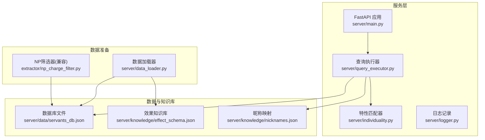
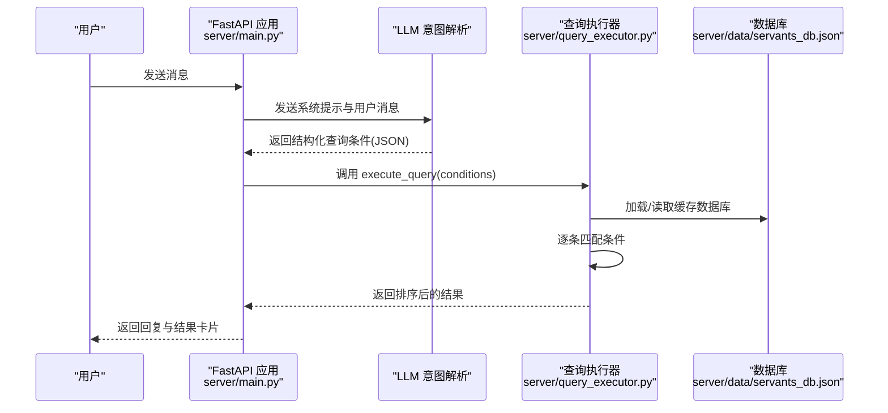
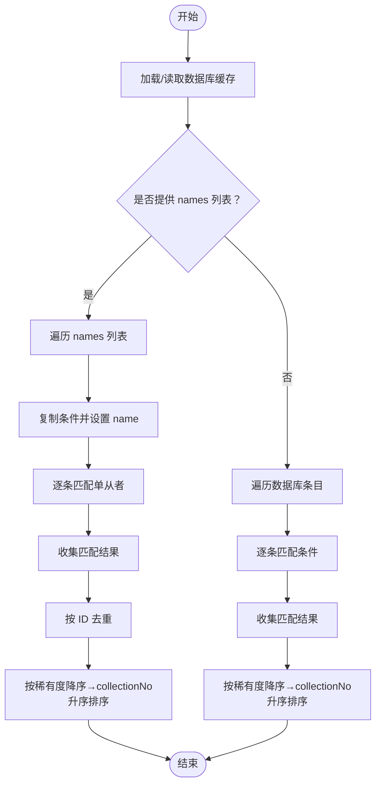
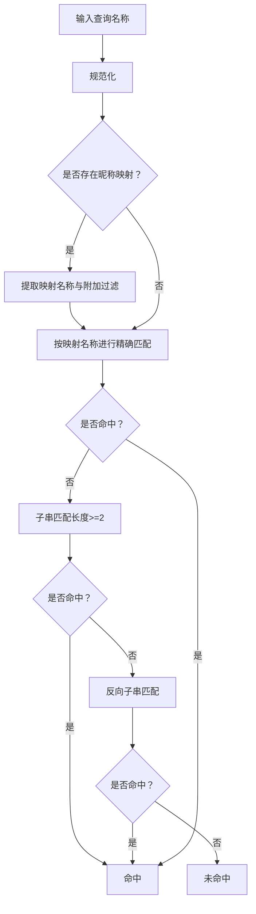
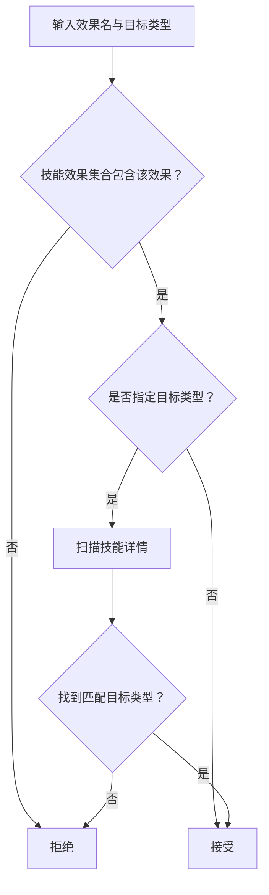
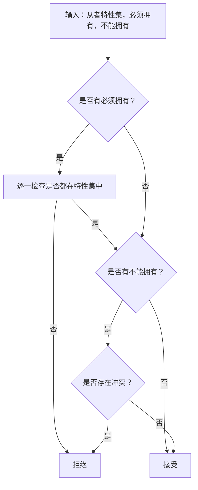
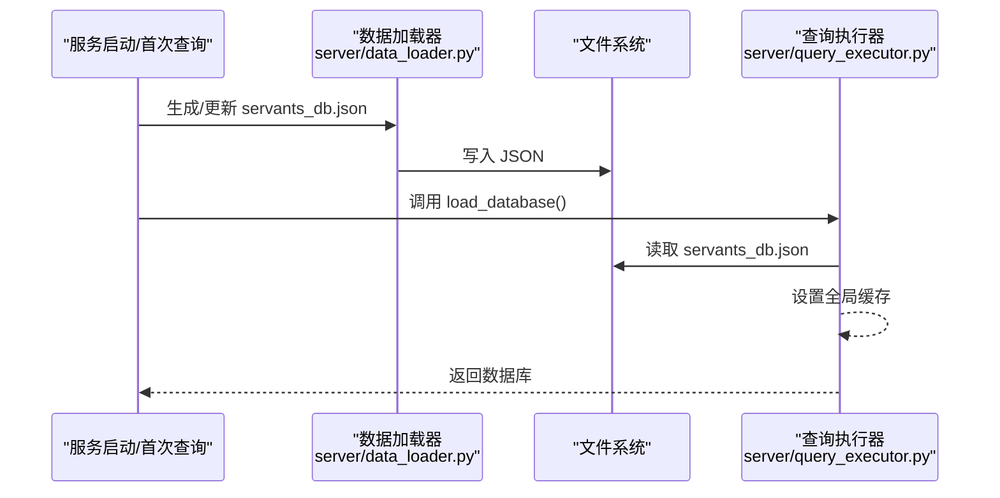
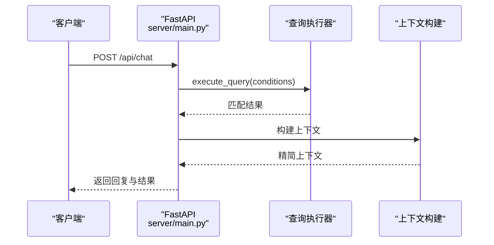
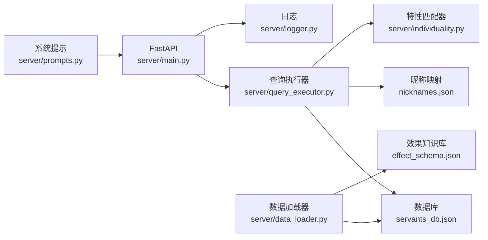

# 查询执行器

<cite>
**本文引用的文件**
- [server/query_executor.py](file://server/query_executor.py)
- [server/main.py](file://server/main.py)
- [server/data_loader.py](file://server/data_loader.py)
- [server/individuality.py](file://server/individuality.py)
- [server/schemas.py](file://server/schemas.py)
- [server/prompts.py](file://server/prompts.py)
- [server/logger.py](file://server/logger.py)
- [server/knowledge/effect_schema.json](file://server/knowledge/effect_schema.json)
- [server/knowledge/nicknames.json](file://server/knowledge/nicknames.json)
- [tests/test_query_executor.py](file://tests/test_query_executor.py)
- [extractor/np_charge_filter.py](file://extractor/np_charge_filter.py)
</cite>

## 目录
1. [简介](#简介)
2. [项目结构](#项目结构)
3. [核心组件](#核心组件)
4. [架构总览](#架构总览)
5. [详细组件分析](#详细组件分析)
6. [依赖关系分析](#依赖关系分析)
7. [性能考量](#性能考量)
8. [故障排查指南](#故障排查指南)
9. [结论](#结论)
10. [附录](#附录)

## 简介
本文件面向Laplace项目的“查询执行器”，系统性阐述其设计与实现，重点覆盖：
- 多条件筛选算法与组合逻辑
- NP充能、职阶、稀有度、技能效果、特性、性别/阵营、配卡与宝具等查询条件的实现
- 数据库加载与缓存机制
- 查询结果的排序与去重策略
- 复杂查询的执行流程与性能优化
- 查询条件扩展的开发指南
- 实际查询示例与调试技巧

## 项目结构
Laplace采用“LLM意图解析 + 结构化查询执行 + API服务”的分层架构。查询执行器位于服务层，负责在预加载的从者数据库上执行筛选与排序。

图表来源
- [server/main.py:144-242](file://server/main.py#L144-L242)
- [server/query_executor.py:41-116](file://server/query_executor.py#L41-L116)
- [server/data_loader.py:332-362](file://server/data_loader.py#L332-L362)
- [extractor/np_charge_filter.py:34-111](file://extractor/np_charge_filter.py#L34-L111)

章节来源
- [server/main.py:144-242](file://server/main.py#L144-L242)
- [server/query_executor.py:41-116](file://server/query_executor.py#L41-L116)
- [server/data_loader.py:332-362](file://server/data_loader.py#L332-L362)
- [extractor/np_charge_filter.py:34-111](file://extractor/np_charge_filter.py#L34-L111)

## 核心组件
- 查询执行器：接收LLM解析出的结构化查询条件，对预加载的从者数据库进行筛选、排序与去重。
- 数据加载器：从Atlas Academy API抓取原始数据，基于效果知识库提取技能/宝具效果、计算NP充能、配卡与宝具信息，生成统一的servants_db.json。
- 特性匹配器：实现特性ID的“必须拥有/不能拥有”组合逻辑。
- 知识库与映射：效果名称别名、昵称映射、职阶/宝具/目标类型映射等。
- API服务：FastAPI入口，负责意图解析、调用查询执行器、构建上下文并返回结果。

章节来源
- [server/query_executor.py:53-116](file://server/query_executor.py#L53-L116)
- [server/data_loader.py:231-329](file://server/data_loader.py#L231-L329)
- [server/individuality.py:58-77](file://server/individuality.py#L58-L77)
- [server/prompts.py:15-43](file://server/prompts.py#L15-L43)
- [server/knowledge/nicknames.json:1-51](file://server/knowledge/nicknames.json#L1-L51)

## 架构总览
查询执行器的控制流分为两阶段：
- 第一阶段：LLM解析用户自然语言为结构化JSON，包含查询意图与条件。
- 第二阶段：服务端调用查询执行器，执行筛选与排序，返回结果与上下文。

图表来源
- [server/main.py:150-242](file://server/main.py#L150-L242)
- [server/query_executor.py:53-116](file://server/query_executor.py#L53-L116)

## 详细组件分析

### 查询执行器：execute_query 与条件匹配
- 数据加载与缓存
  - 首次访问时从本地JSON加载数据库，后续使用全局缓存。
  - 支持多从者对比模式：names数组触发逐名查询，合并后按ID去重并排序。
- 条件匹配顺序
  - NP充能：支持精确匹配与范围比较；若无充能则直接排除。
  - 稀有度：通用比较运算符(eq/gte/lte/gt/lt)。
  - 职阶：大小写无关的字符串匹配。
  - 名称：支持昵称映射、英文/中文/日文名称的分级匹配（精确→子串→反向子串）。
  - 技能效果：单效果与多效果AND/OR组合；支持按目标类型过滤。
  - 特性：必须拥有与不能拥有组合；委托特性匹配器。
  - 性别/阵营：字符串匹配。
  - 配卡：字典计数匹配（至少达到指定数量）。
  - 宝具颜色/目标：字符串匹配。
- 排序与去重
  - 单查询：按稀有度降序、collectionNo升序。
  - 多从者对比：先去重（按ID），再按相同规则排序。

图表来源
- [server/query_executor.py:80-116](file://server/query_executor.py#L80-L116)
- [server/query_executor.py:119-299](file://server/query_executor.py#L119-L299)

章节来源
- [server/query_executor.py:41-116](file://server/query_executor.py#L41-L116)
- [server/query_executor.py:119-299](file://server/query_executor.py#L119-L299)

### 名称匹配与昵称映射
- 规范化策略：去除空白与常见分隔符，统一小写，便于模糊匹配。
- 昵称映射：优先尝试昵称→真实名称的映射，支持附加过滤（如自动补充职阶）。
- 多语言匹配：对英文、中文、日文名称分别规范化后进行精确/子串/反向子串匹配。

图表来源
- [server/query_executor.py:162-230](file://server/query_executor.py#L162-L230)
- [server/knowledge/nicknames.json:1-51](file://server/knowledge/nicknames.json#L1-L51)

章节来源
- [server/query_executor.py:162-230](file://server/query_executor.py#L162-L230)
- [server/knowledge/nicknames.json:1-51](file://server/knowledge/nicknames.json#L1-L51)

### 技能效果匹配与目标类型过滤
- 快速路径：先检查技能效果集合，若不在集合内直接排除。
- 目标类型过滤：若指定目标类型（self/party/enemy），进一步检查技能详情中的效果目标类型。
- 多效果组合：支持AND/OR两种逻辑，默认AND；OR时只需满足任一效果。

图表来源
- [server/query_executor.py:302-327](file://server/query_executor.py#L302-L327)

章节来源
- [server/query_executor.py:302-327](file://server/query_executor.py#L302-L327)

### 特性筛选与组合逻辑
- 必须拥有（AND）：查询条件中的所有ID均需存在于从者特性集中。
- 不能拥有（NOT）：查询条件中的任意ID出现在从者特性集中则拒绝。
- 带符号特性：支持正负号编码的特性ID（正数必须拥有，负数不能拥有），内部拆分后分别校验。

图表来源
- [server/individuality.py:58-77](file://server/individuality.py#L58-L77)

章节来源
- [server/individuality.py:58-77](file://server/individuality.py#L58-L77)

### 数据库加载与缓存机制
- 预加载：应用启动时或首次查询前加载数据库，打印统计信息。
- 全局缓存：进程内全局变量保存数据库与昵称映射，避免重复IO。
- 数据来源：由数据加载器生成的servants_db.json，包含NP充能、技能效果、特性、配卡、宝具等字段。

图表来源
- [server/data_loader.py:332-362](file://server/data_loader.py#L332-L362)
- [server/query_executor.py:41-50](file://server/query_executor.py#L41-L50)

章节来源
- [server/data_loader.py:332-362](file://server/data_loader.py#L332-L362)
- [server/query_executor.py:41-50](file://server/query_executor.py#L41-L50)

### API集成与上下文构建
- FastAPI路由：/api/chat（同步）与/stream（SSE）。
- 上下文构建：抽取关键字段并进行中文映射（职阶、宝具颜色、目标类型、效果别名），限制展示数量。
- 日志追踪：记录完整链路，便于调试与审计。

图表来源
- [server/main.py:150-242](file://server/main.py#L150-L242)
- [server/main.py:60-105](file://server/main.py#L60-L105)

章节来源
- [server/main.py:150-242](file://server/main.py#L150-L242)
- [server/main.py:60-105](file://server/main.py#L60-L105)

## 依赖关系分析
- 查询执行器依赖：
  - 数据库：servants_db.json
  - 昵称映射：nicknames.json
  - 特性匹配器：individuality.py
  - 效果知识库：effect_schema.json（间接影响效果名称与别名）
- API服务依赖：
  - LLM意图解析：prompts.py
  - 查询执行器：query_executor.py
  - 日志：logger.py

图表来源
- [server/query_executor.py:14-19](file://server/query_executor.py#L14-L19)
- [server/main.py:19-21](file://server/main.py#L19-L21)
- [server/data_loader.py:44-52](file://server/data_loader.py#L44-L52)

章节来源
- [server/query_executor.py:14-19](file://server/query_executor.py#L14-L19)
- [server/main.py:19-21](file://server/main.py#L19-L21)
- [server/data_loader.py:44-52](file://server/data_loader.py#L44-L52)

## 性能考量
- 时间复杂度
  - 单查询：O(N)遍历数据库，每条记录执行常数时间的条件判断。
  - 多从者对比：O(K×N)，K为names长度；建议names长度控制在合理范围。
- 空间复杂度
  - 数据库缓存：一次性加载至内存，避免重复IO。
  - 结果集：按需返回，服务端限制最大返回数量。
- 优化建议
  - 优先使用高选择性的条件（如稀有度、职阶、特性）靠前过滤。
  - 对NP充能使用范围条件（gte/lte）可减少全表扫描命中。
  - 多效果AND时，先筛更少见的效果，有助于早期短路。
  - 避免不必要的目标类型过滤，仅在必要时指定targetType。
  - 控制names长度，避免大规模对比导致的线性放大。

[本节为通用性能讨论，无需章节来源]

## 故障排查指南
- 数据库未加载
  - 现象：首次查询无结果或缓慢。
  - 排查：确认数据加载器已生成servants_db.json；检查文件权限与路径。
  - 参考：[server/data_loader.py:332-362](file://server/data_loader.py#L332-L362)
- 昵称映射不生效
  - 现象：使用昵称无法匹配到期望从者。
  - 排查：确认nicknames.json存在且格式正确；检查规范化规则是否覆盖输入形式。
  - 参考：[server/knowledge/nicknames.json:1-51](file://server/knowledge/nicknames.json#L1-L51)
- 技能效果名称不匹配
  - 现象：效果名称无法识别。
  - 排查：确认effect_schema.json存在；效果名称应使用英文标识符（如invincible），别名仅用于展示。
  - 参考：[server/prompts.py:15-43](file://server/prompts.py#L15-L43)
- 多从者对比结果异常
  - 现象：重复或排序不符合预期。
  - 排查：确认names数组清洗逻辑；检查去重与排序规则。
  - 参考：[server/query_executor.py:80-116](file://server/query_executor.py#L80-L116)
- 日志追踪
  - 使用logger记录完整链路，定位意图解析与生成阶段错误。
  - 参考：[server/logger.py:38-55](file://server/logger.py#L38-L55)

章节来源
- [server/data_loader.py:332-362](file://server/data_loader.py#L332-L362)
- [server/knowledge/nicknames.json:1-51](file://server/knowledge/nicknames.json#L1-L51)
- [server/prompts.py:15-43](file://server/prompts.py#L15-L43)
- [server/query_executor.py:80-116](file://server/query_executor.py#L80-L116)
- [server/logger.py:38-55](file://server/logger.py#L38-L55)

## 结论
查询执行器以“结构化条件 + 预加载数据库 + 有序短路匹配”为核心，实现了对NP充能、职阶、稀有度、技能效果、特性、性别/阵营、配卡与宝具等多维度条件的高效筛选。通过昵称映射、效果别名与目标类型过滤，兼顾了易用性与准确性。配合FastAPI与上下文构建，形成从意图解析到结果呈现的完整链路。未来可在条件索引、增量更新与并发安全等方面进一步演进。

[本节为总结，无需章节来源]

## 附录

### 查询条件扩展开发指南
- 新增条件字段
  - 在查询执行器中添加对应分支与校验逻辑。
  - 若涉及外部映射（如效果别名、职阶映射），在相应模块中维护。
- 新增比较运算符
  - 在通用比较函数中扩展支持。
- 新增目标类型
  - 在效果匹配与上下文构建处同步更新映射。
- 新增数据字段
  - 在数据加载器中提取并写入数据库；在查询执行器中读取并使用。

章节来源
- [server/query_executor.py:53-116](file://server/query_executor.py#L53-L116)
- [server/schemas.py:25-46](file://server/schemas.py#L25-L46)
- [server/data_loader.py:231-329](file://server/data_loader.py#L231-L329)

### 实际查询示例与调试技巧
- 示例参考
  - 单效果与目标类型：参见测试用例对skillEffect/targetType的断言。
  - 多效果AND/OR：参见测试用例对skillEffects/skillEffectsOp的断言。
  - 多从者对比：参见测试用例对names的断言。
  - NP充能精确与范围：参见测试用例对npCharge的断言。
- 调试技巧
  - 使用最小条件快速定位问题，逐步增加复杂度。
  - 利用日志追踪记录的intent与context，核对LLM解析是否符合预期。
  - 在上下文构建处打印关键字段，确认效果别名与映射是否正确。
  - 对昵称映射与名称匹配进行边界测试（空格、特殊字符、大小写）。

章节来源
- [tests/test_query_executor.py:123-171](file://tests/test_query_executor.py#L123-L171)
- [server/main.py:60-105](file://server/main.py#L60-L105)
- [server/logger.py:38-55](file://server/logger.py#L38-L55)