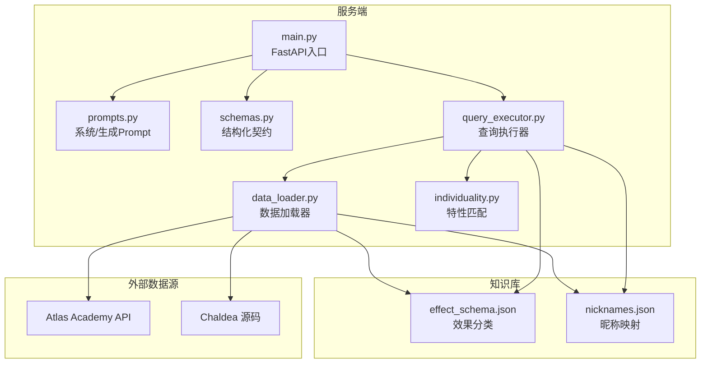
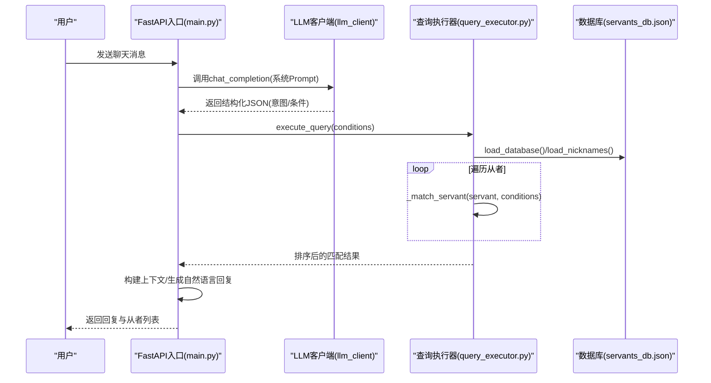
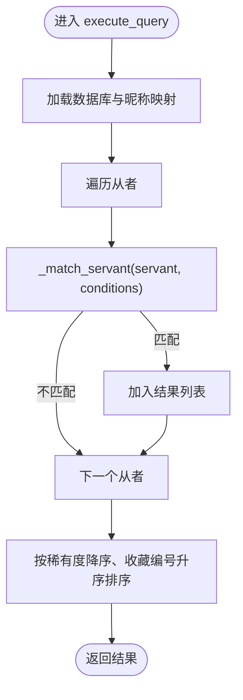
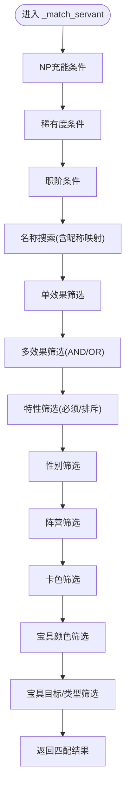
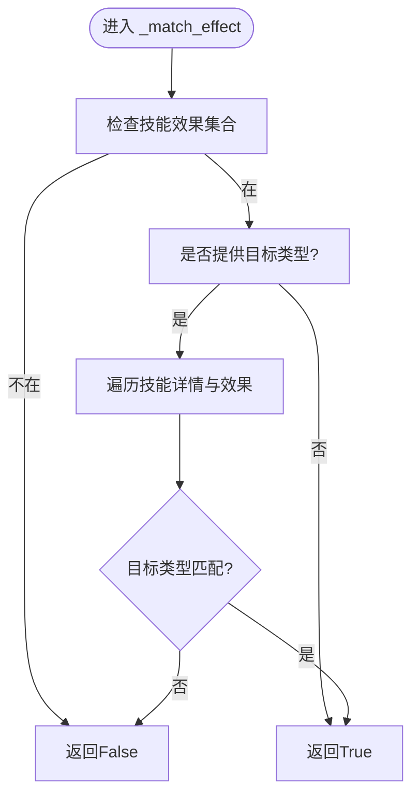
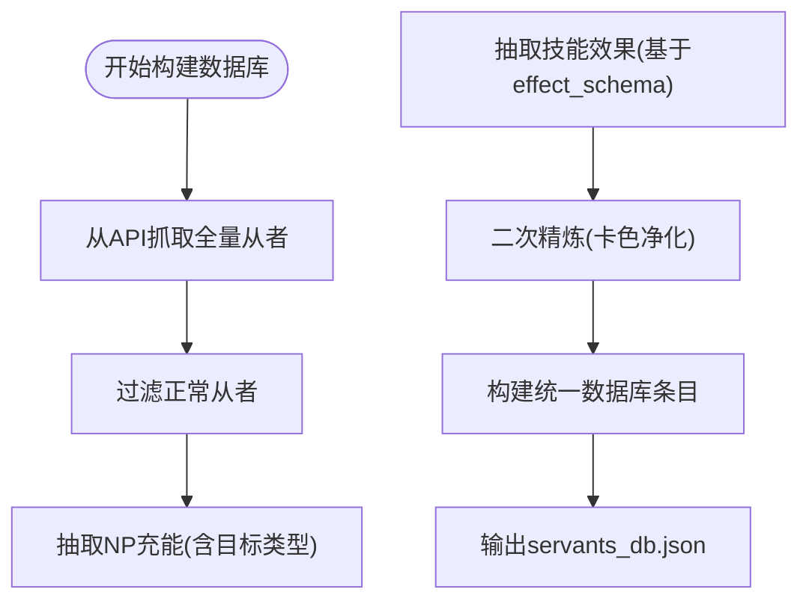
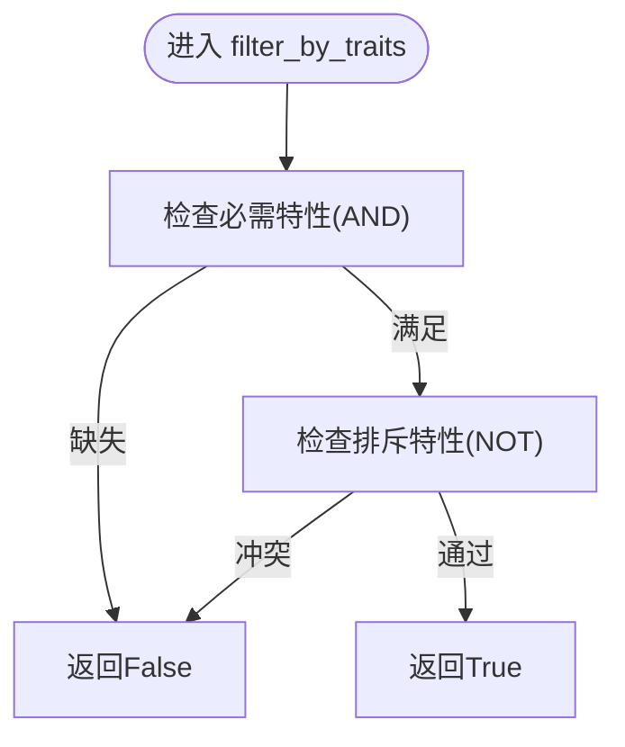
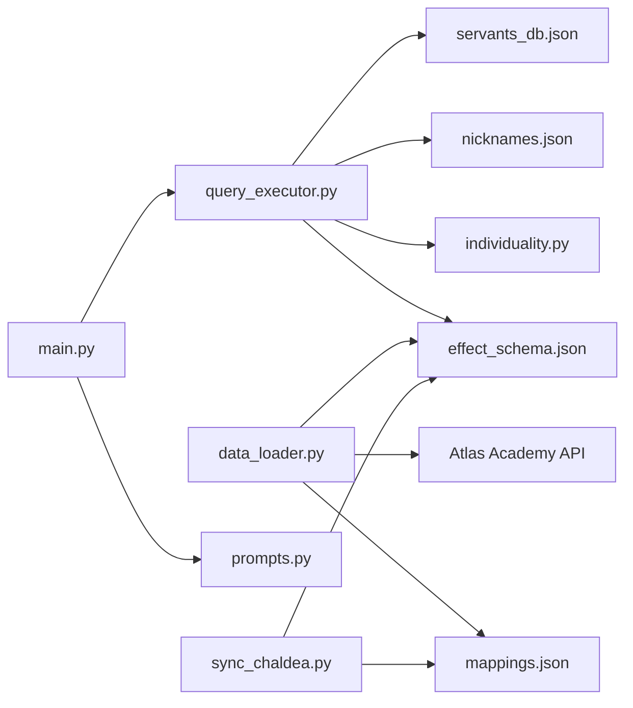

# 查询执行器模块

<cite>
**本文引用的文件**
- [server/query_executor.py](file://server/query_executor.py)
- [server/data_loader.py](file://server/data_loader.py)
- [server/schemas.py](file://server/schemas.py)
- [server/individuality.py](file://server/individuality.py)
- [server/knowledge/nicknames.json](file://server/knowledge/nicknames.json)
- [server/knowledge/effect_schema.json](file://server/knowledge/effect_schema.json)
- [server/main.py](file://server/main.py)
- [server/prompts.py](file://server/prompts.py)
- [server/sync_chaldea.py](file://server/sync_chaldea.py)
- [tests/test_query_executor.py](file://tests/test_query_executor.py)
</cite>

## 目录
1. [简介](#简介)
2. [项目结构](#项目结构)
3. [核心组件](#核心组件)
4. [架构总览](#架构总览)
5. [详细组件分析](#详细组件分析)
6. [依赖关系分析](#依赖关系分析)
7. [性能考量](#性能考量)
8. [故障排查指南](#故障排查指南)
9. [结论](#结论)
10. [附录](#附录)

## 简介
本文件面向Laplace的查询执行器模块，系统性阐述其多条件查询的实现机制，包括从者数据筛选逻辑、效果匹配算法与查询优化策略。文档解释查询执行器如何处理复杂的查询条件组合，涵盖属性过滤、技能效果匹配、职阶筛选、特性筛选、昵称映射、卡色与宝具目标筛选等，并提供具体查询示例与使用模式，说明与数据加载器的协作关系与数据流转过程。同时给出性能考虑与查询缓存策略，帮助读者高效构建查询语句并理解系统行为。

## 项目结构
查询执行器位于服务端模块中，围绕“意图解析 → 查询执行 → 结果生成”的链路工作。核心文件与职责如下：
- server/query_executor.py：查询执行器主体，负责加载数据库、执行条件筛选、排序与返回结果。
- server/data_loader.py：数据加载器，负责从Atlas Academy API抓取数据、抽取技能效果与NP充能、构建通用数据库。
- server/schemas.py：LLM与查询执行器之间的结构化契约（Pydantic模型），定义查询条件与意图响应格式。
- server/individuality.py：特性（Trait）匹配逻辑，支持必须拥有与排斥特性组合。
- server/knowledge/nicknames.json：昵称映射表，支持中文昵称到正式名称与职阶的映射。
- server/knowledge/effect_schema.json：效果分类知识库，提供效果名称与功能/状态类型映射。
- server/main.py：FastAPI入口，集成LLM意图解析、查询执行与自然语言回复生成。
- server/prompts.py：系统Prompt与生成Prompt，驱动LLM输出结构化JSON并生成自然语言回复。
- server/sync_chaldea.py：知识库同步脚本，从Chaldea源码提取枚举与效果分类，生成知识库文件。
- tests/test_query_executor.py：查询执行器单元测试，验证各类查询条件与组合。

图表来源
- [server/main.py:81-218](file://server/main.py#L81-L218)
- [server/prompts.py:15-161](file://server/prompts.py#L15-L161)
- [server/schemas.py:25-66](file://server/schemas.py#L25-L66)
- [server/query_executor.py:53-87](file://server/query_executor.py#L53-L87)
- [server/data_loader.py:91-359](file://server/data_loader.py#L91-L359)
- [server/individuality.py:58-77](file://server/individuality.py#L58-L77)

章节来源
- [server/main.py:81-218](file://server/main.py#L81-L218)
- [server/prompts.py:15-161](file://server/prompts.py#L15-L161)
- [server/schemas.py:25-66](file://server/schemas.py#L25-L66)
- [server/query_executor.py:53-87](file://server/query_executor.py#L53-L87)
- [server/data_loader.py:91-359](file://server/data_loader.py#L91-L359)
- [server/individuality.py:58-77](file://server/individuality.py#L58-L77)

## 核心组件
- 查询执行器（execute_query）：接收LLM解析出的结构化查询条件，遍历预加载的从者数据库，逐条匹配并返回排序后的结果。
- 条件匹配器（_match_servant）：实现多条件组合的匹配逻辑，包括NP充能、稀有度、职阶、名称（含昵称映射）、技能效果（单/多）、特性（必须/排斥）、性别、阵营、卡色、宝具颜色与目标类型。
- 效果匹配器（_match_effect）：在技能效果集合基础上快速判断是否存在某效果，必要时进一步按目标类型进行细粒度匹配。
- 数据加载器（data_loader）：从Atlas Academy API抓取全量从者数据，抽取技能效果与NP充能，构建通用数据库（包含效果集合、技能详情、卡色、宝具信息等）。
- 特性匹配器（individuality.filter_by_traits）：实现特性必须拥有与排斥的AND逻辑，支持正负特性分离与部分匹配。
- 知识库与映射：effect_schema.json提供效果分类与别名，nicknames.json提供昵称到正式名称与职阶的映射。
- 结构化契约（schemas.QueryConditions）：定义LLM输出与查询执行器输入的字段与校验规则。

章节来源
- [server/query_executor.py:53-305](file://server/query_executor.py#L53-L305)
- [server/data_loader.py:91-359](file://server/data_loader.py#L91-L359)
- [server/schemas.py:25-66](file://server/schemas.py#L25-L66)
- [server/individuality.py:58-77](file://server/individuality.py#L58-L77)

## 架构总览
查询执行器在整体系统中的位置与交互如下：
- LLM通过系统Prompt将自然语言意图解析为结构化JSON（IntentResponse），其中包含查询条件（QueryConditions）。
- FastAPI入口接收请求，调用LLM进行意图解析，随后调用查询执行器执行筛选。
- 查询执行器加载数据库（全局缓存），对每个从者应用条件匹配器，最后按稀有度降序、收藏编号升序排序返回。
- 生成阶段（RAG）基于查询结果生成自然语言回复，避免先验知识，严格依据检索到的数据。

图表来源
- [server/main.py:87-218](file://server/main.py#L87-L218)
- [server/query_executor.py:53-87](file://server/query_executor.py#L53-L87)
- [server/query_executor.py:90-261](file://server/query_executor.py#L90-L261)

章节来源
- [server/main.py:87-218](file://server/main.py#L87-L218)
- [server/query_executor.py:53-87](file://server/query_executor.py#L53-L87)
- [server/query_executor.py:90-261](file://server/query_executor.py#L90-L261)

## 详细组件分析

### 查询执行器（execute_query）
- 输入：结构化查询条件（来自LLM解析）。
- 处理流程：
  - 加载数据库与昵称映射（全局缓存）。
  - 遍历从者，逐一调用条件匹配器。
  - 对匹配结果按稀有度降序、收藏编号升序排序。
- 输出：排序后的从者列表。

图表来源
- [server/query_executor.py:53-87](file://server/query_executor.py#L53-L87)
- [server/query_executor.py:90-261](file://server/query_executor.py#L90-L261)

章节来源
- [server/query_executor.py:53-87](file://server/query_executor.py#L53-L87)

### 条件匹配器（_match_servant）
- NP充能条件：支持精确匹配与范围比较（>=、>、<=），并区分“存在自充”与“充能百分比”。
- 稀有度条件：通用比较操作（eq、gte、gt、lte、lt）。
- 职阶条件：大小写无关的字符串匹配。
- 名称搜索：支持英文、中文、日文名称与昵称映射，采用规范化处理（去空白、统一字符）。
- 单效果筛选：先在效果集合中快速判断，再按目标类型进行细节匹配。
- 多效果筛选：支持“AND/OR”组合，默认AND；目标类型可选。
- 特性筛选：必须拥有与排斥特性组合（AND逻辑）。
- 性别与阵营：字符串匹配。
- 卡色与宝具：卡色数量阈值与宝具颜色/目标类型匹配。
- 返回：布尔值，决定是否保留该从者。

图表来源
- [server/query_executor.py:90-261](file://server/query_executor.py#L90-L261)

章节来源
- [server/query_executor.py:90-261](file://server/query_executor.py#L90-L261)

### 效果匹配器（_match_effect）
- 快速路径：先检查技能效果集合，若不在集合内直接返回不匹配。
- 目标类型筛选：若提供目标类型（self/party/enemy），需在技能详情中进一步核对。
- 返回：布尔值。

图表来源
- [server/query_executor.py:264-289](file://server/query_executor.py#L264-L289)

章节来源
- [server/query_executor.py:264-289](file://server/query_executor.py#L264-L289)

### 数据加载器（data_loader）
- 从Atlas Academy API抓取全量从者数据，过滤正常从者并保留收藏编号。
- 抽取NP充能：识别技能函数类型为“gainNp”且目标类型包含自身/全体的技能，计算最大自充、最大群充与总自充。
- 抽取技能效果：基于effect_schema.json的知识库，通过funcType/buffType匹配效果名称，并进行二次精炼以避免卡色通用枚举污染。
- 构建数据库：生成包含效果集合、技能详情、卡色统计、宝具颜色与目标类型的统一数据结构。
- 输出：servants_db.json。

图表来源
- [server/data_loader.py:91-359](file://server/data_loader.py#L91-L359)

章节来源
- [server/data_loader.py:91-359](file://server/data_loader.py#L91-L359)

### 特性匹配器（individuality.filter_by_traits）
- 必须拥有（AND）：从者必须具备所有必需特性。
- 排斥特性（NOT）：从者不得具备任一排斥特性。
- 返回：布尔值。

图表来源
- [server/individuality.py:58-77](file://server/individuality.py#L58-L77)

章节来源
- [server/individuality.py:58-77](file://server/individuality.py#L58-L77)

### 结构化契约（schemas.QueryConditions）
- 定义查询条件字段与默认值，提供字段校验（空字符串/空列表/空字典转None）。
- 与LLM输出严格对齐，保证意图解析的确定性。

章节来源
- [server/schemas.py:25-66](file://server/schemas.py#L25-L66)

## 依赖关系分析
- 查询执行器依赖：
  - 数据库（servants_db.json）与昵称映射（nicknames.json）。
  - 特性匹配模块（individuality）。
  - 效果分类知识库（effect_schema.json）用于效果名称与分类。
- 数据加载器依赖：
  - Atlas Academy API与Chaldea源码，生成effect_schema.json、class_mapping.json、mappings.json等知识库文件。
- FastAPI入口依赖：
  - LLM客户端与Prompts模块，负责意图解析与自然语言生成。

图表来源
- [server/query_executor.py:14-19](file://server/query_executor.py#L14-L19)
- [server/data_loader.py:20-23](file://server/data_loader.py#L20-L23)
- [server/main.py:14-18](file://server/main.py#L14-L18)
- [server/sync_chaldea.py:32-36](file://server/sync_chaldea.py#L32-L36)

章节来源
- [server/query_executor.py:14-19](file://server/query_executor.py#L14-L19)
- [server/data_loader.py:20-23](file://server/data_loader.py#L20-L23)
- [server/main.py:14-18](file://server/main.py#L14-L18)
- [server/sync_chaldea.py:32-36](file://server/sync_chaldea.py#L32-L36)

## 性能考量
- 全局缓存：
  - 数据库与昵称映射采用全局变量缓存，首次加载后重复使用，避免重复IO开销。
- 算法复杂度：
  - execute_query对每个从者执行一次条件匹配，时间复杂度O(N×M)，N为从者数量，M为条件数量。
  - 效果匹配在集合中快速判断，平均O(1)，目标类型匹配为线性扫描技能详情。
- 排序成本：
  - 最终排序按稀有度降序、收藏编号升序，时间复杂度O(K log K)，K为匹配结果数量。
- 优化建议：
  - 若查询条件较多，可考虑在数据层预构建索引（如按效果、职阶、稀有度分桶）以减少遍历成本。
  - 对高频查询可引入Redis缓存查询结果（按条件哈希），命中则直接返回。
  - 在LLM侧尽量减少冗余字段，缩短JSON解析与执行器处理时间。
  - 对大规模数据可分页返回，前端控制展示数量，避免响应过大。

章节来源
- [server/query_executor.py:17-19](file://server/query_executor.py#L17-L19)
- [server/query_executor.py:85-87](file://server/query_executor.py#L85-L87)

## 故障排查指南
- 无效果数据：
  - 确认effect_schema.json存在且已同步；若缺失，数据加载器会仅提取NP充能数据。
- 昵称映射无效：
  - 检查nicknames.json是否存在且包含对应昵称；确认查询名称大小写与规范化处理一致。
- 效果名称不匹配：
  - 确认LLM输出的效果名称与effect_schema.json中的名称一致；中文别名需映射到标准效果名。
- 查询结果为空：
  - 检查查询条件是否过于严格；尝试放宽NP充能、稀有度或目标类型筛选。
- 性能问题：
  - 确认数据库已预加载；检查是否有不必要的多效果OR组合；减少卡色与宝具目标的复杂筛选。
- 测试验证：
  - 使用单元测试覆盖典型场景，如精确NP充能、多效果AND/OR、昵称映射、特性筛选等。

章节来源
- [server/data_loader.py:44-52](file://server/data_loader.py#L44-L52)
- [server/sync_chaldea.py:308-419](file://server/sync_chaldea.py#L308-L419)
- [tests/test_query_executor.py:123-171](file://tests/test_query_executor.py#L123-L171)

## 结论
查询执行器通过严格的结构化契约与清晰的条件匹配流程，实现了对多条件从者查询的高效筛选。配合数据加载器与知识库同步机制，系统能够稳定地从大量从者数据中提取关键特征并进行快速匹配。通过全局缓存、集合快速判断与排序优化，系统在保证准确性的同时兼顾了性能。建议在生产环境中引入索引与查询缓存策略，并在LLM侧优化输出字段，以进一步提升用户体验与响应速度。

## 附录

### 查询示例与使用模式
- 精确NP自充：npCharge = {"op": "eq", "value": 30}
- 大于等于自充：npCharge = {"op": "gte", "value": 50}
- 稀有度筛选：rarity = {"op": "eq", "value": 5}
- 职阶筛选：className = "saber"
- 名称搜索（含昵称）：name = "呆毛"
- 单效果筛选：skillEffect = "invincible"，可选targetType = "self"/"party"/"enemy"
- 多效果AND：skillEffects = ["avoidance", "guts"]
- 多效果OR：skillEffects = ["invincible", "guts"], skillEffectsOp = "or"
- 特性筛选：traits = [300, 303], excludeTraits = [1]
- 性别与阵营：gender = "female"，attribute = "earth"
- 卡色与宝具：cards = {"buster": 3}，npCard = "quick"，npTarget = "all"

章节来源
- [server/schemas.py:25-66](file://server/schemas.py#L25-L66)
- [tests/test_query_executor.py:123-171](file://tests/test_query_executor.py#L123-L171)