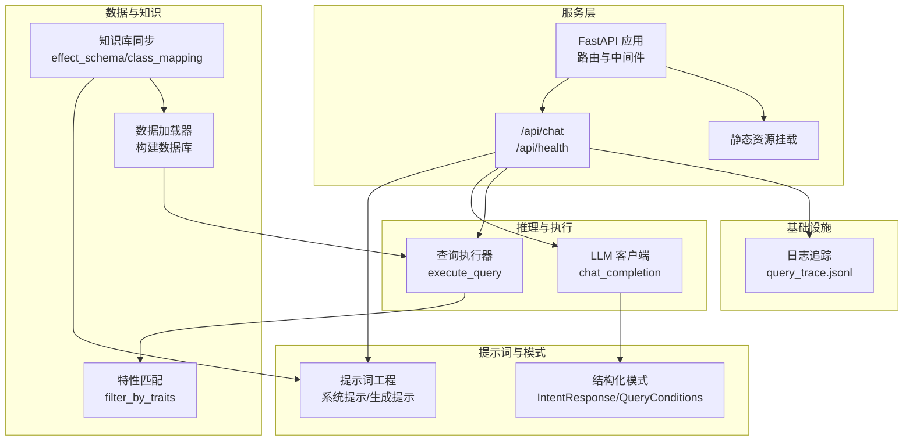
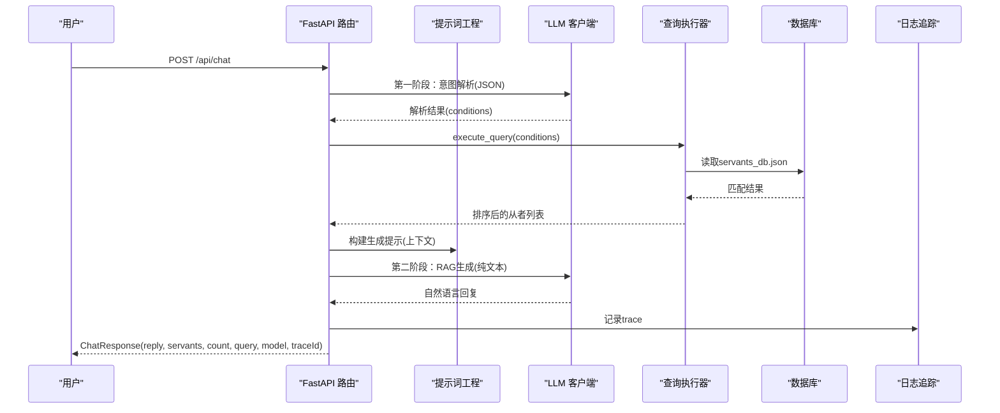
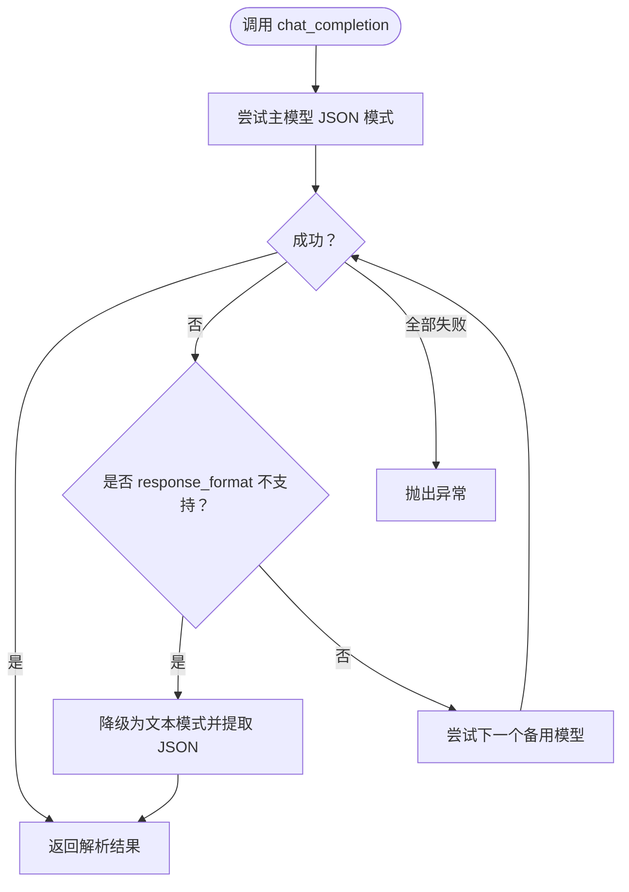
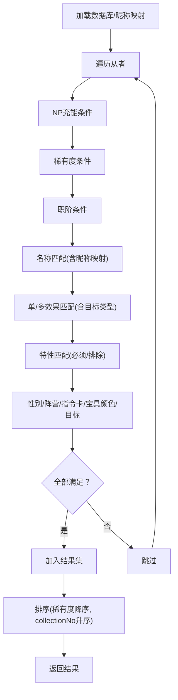
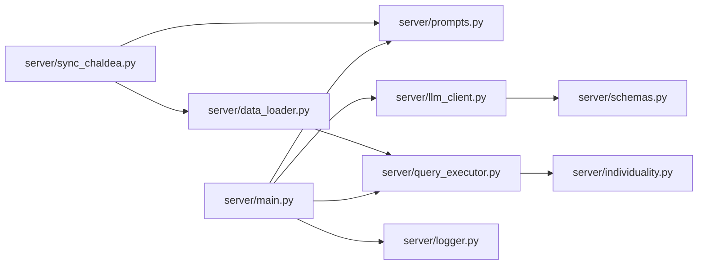

# 核心模块

<cite>
**本文引用的文件**
- [server/main.py](file://server/main.py)
- [server/llm_client.py](file://server/llm_client.py)
- [server/prompts.py](file://server/prompts.py)
- [server/schemas.py](file://server/schemas.py)
- [server/query_executor.py](file://server/query_executor.py)
- [server/data_loader.py](file://server/data_loader.py)
- [server/sync_chaldea.py](file://server/sync_chaldea.py)
- [server/individuality.py](file://server/individuality.py)
- [server/logger.py](file://server/logger.py)
- [tests/test_llm_client.py](file://tests/test_llm_client.py)
- [tests/test_query_executor.py](file://tests/test_query_executor.py)
- [tests/conftest.py](file://tests/conftest.py)
</cite>

## 目录
1. [简介](#简介)
2. [项目结构](#项目结构)
3. [核心组件](#核心组件)
4. [架构总览](#架构总览)
5. [详细组件分析](#详细组件分析)
6. [依赖关系分析](#依赖关系分析)
7. [性能考量](#性能考量)
8. [故障排查指南](#故障排查指南)
9. [结论](#结论)
10. [附录](#附录)

## 简介
本文件面向Laplace项目的核心模块，围绕FastAPI应用的路由与中间件、LLM客户端、查询执行器、数据加载器与提示词工程进行系统化说明。文档涵盖各模块的职责边界、接口定义、参数说明、处理流程、性能优化策略、扩展点与自定义选项，并提供模块间交互图与典型使用示例，帮助开发者快速理解与扩展系统。

## 项目结构
Laplace采用分层与功能模块化组织：
- 服务入口与路由：FastAPI应用定义健康检查、聊天接口与静态资源挂载
- LLM集成：统一的异步客户端封装，支持结构化输出与降级回退
- 提示词工程：系统提示与生成提示的模板化与知识库注入
- 查询执行器：多条件筛选、排序与特性匹配
- 数据加载器：从Atlas Academy API抓取并清洗，生成通用数据库
- 知识库同步：从Chaldea源码抽取领域知识，生成effect_schema等
- 日志追踪：统一记录查询链路，便于排障与审计

图表来源
- [server/main.py:81-228](file://server/main.py#L81-L228)
- [server/prompts.py:167-208](file://server/prompts.py#L167-L208)
- [server/llm_client.py:35-126](file://server/llm_client.py#L35-L126)
- [server/schemas.py:16-81](file://server/schemas.py#L16-L81)
- [server/query_executor.py:53-87](file://server/query_executor.py#L53-L87)
- [server/data_loader.py:332-358](file://server/data_loader.py#L332-L358)
- [server/sync_chaldea.py:308-418](file://server/sync_chaldea.py#L308-L418)
- [server/individuality.py:58-77](file://server/individuality.py#L58-L77)
- [server/logger.py:38-55](file://server/logger.py#L38-L55)

章节来源
- [server/main.py:51-228](file://server/main.py#L51-L228)

## 核心组件
- FastAPI应用与路由
  - 定义CORS中间件、健康检查端点、聊天接口与静态资源挂载
  - 聊天接口负责意图解析、查询执行、上下文构建与自然语言回复生成
- LLM客户端
  - 统一的异步调用封装，支持结构化JSON模式与文本回退
  - 多模型回退策略，自动识别response_format不支持并降级
- 提示词工程
  - 动态加载effect_schema构建系统提示，约束输出格式与能力范围
  - 生成阶段提示基于检索上下文，确保严格依据数据生成回复
- 查询执行器
  - 多条件筛选：NP充能、稀有度、职阶、名称、效果、特性、性别、阵营、指令卡、宝具颜色与目标
  - 排序：按稀有度降序、collectionNo升序
  - 特性匹配：支持必须拥有与排除特性
- 数据加载器
  - 从Atlas Academy API拉取nice_servant_lang_en.json
  - 基于effect_schema提取技能效果、计算NP充能、构建通用数据库
- 知识库同步
  - 从Chaldea源码抽取FuncType、BuffType、SkillEffect分类与职阶映射
  - 生成effect_schema.json、class_mapping.json、mappings.json等
- 日志追踪
  - 记录完整查询链路，包含traceId、用户问题、解析意图、结果数量、最终回复与上下文

章节来源
- [server/main.py:87-218](file://server/main.py#L87-L218)
- [server/llm_client.py:35-126](file://server/llm_client.py#L35-L126)
- [server/prompts.py:167-208](file://server/prompts.py#L167-L208)
- [server/query_executor.py:53-87](file://server/query_executor.py#L53-L87)
- [server/data_loader.py:332-358](file://server/data_loader.py#L332-L358)
- [server/sync_chaldea.py:308-418](file://server/sync_chaldea.py#L308-L418)
- [server/logger.py:38-55](file://server/logger.py#L38-L55)

## 架构总览
下图展示从用户请求到最终回复的关键交互流程，包括两阶段LLM调用与RAG生成阶段。

图表来源
- [server/main.py:87-218](file://server/main.py#L87-L218)
- [server/llm_client.py:35-126](file://server/llm_client.py#L35-L126)
- [server/prompts.py:175-208](file://server/prompts.py#L175-L208)
- [server/query_executor.py:53-87](file://server/query_executor.py#L53-L87)

## 详细组件分析

### FastAPI应用与路由
- 中间件
  - CORS允许任意来源、方法与头部，便于前后端分离部署
- 路由
  - /api/chat：接收用户消息，执行意图解析与查询，返回自然语言回复与从者列表
  - /api/health：健康检查
  - 静态资源挂载：前端demo目录
- 请求/响应模型
  - ChatRequest：message
  - ChatResponse：reply、servants、count、query、model、traceId
- 关键流程
  - 启动时预加载数据库
  - 意图解析失败时降级返回
  - 上下文构建：限制展示数量、效果翻译、色卡强化状态
  - RAG生成失败时回退为模板化回复
  - 日志记录traceId与完整链路

章节来源
- [server/main.py:51-228](file://server/main.py#L51-L228)

### LLM客户端
- 结构化输出与回退
  - 优先使用response_format=json_schema进行严格JSON模式
  - 若模型不支持response_format，自动降级为文本模式并提取JSON
- 多模型回退
  - 按主模型+备用模型顺序尝试，任一成功即返回
- 错误处理
  - 对response_format错误进行识别与标记
  - 所有模型均失败时抛出异常
- 参数与返回
  - 输入：system_prompt、user_message、model、max_tokens、temperature、json_mode
  - 返回：解析后的JSON或{"text": "..."}，并附带使用的模型与response_format类型

图表来源
- [server/llm_client.py:35-126](file://server/llm_client.py#L35-L126)
- [server/llm_client.py:236-247](file://server/llm_client.py#L236-L247)

章节来源
- [server/llm_client.py:35-247](file://server/llm_client.py#L35-L247)

### 提示词工程
- 系统提示
  - 动态加载effect_schema，构建效果分类列表，注入到系统提示中
  - 明确输出格式为Strict JSON Schema，字段说明详尽
  - 规定名称与别名规则、职阶映射与示例
- 生成提示
  - 基于检索上下文生成自然语言回复
  - 强制遵循“直接回答、结合全局统计、禁绝先验知识、简洁明快、合理分类”等原则
  - 严格限制回复内容不得超出检索上下文

章节来源
- [server/prompts.py:15-208](file://server/prompts.py#L15-L208)

### 查询执行器
- 数据加载与缓存
  - 预加载servants_db.json，统计有效效果数据条目
  - 昵称映射加载，支持中文/日文/英文名规范化匹配
- 查询条件
  - 支持NP充能、稀有度、职阶、名称、单/多效果、目标类型、特性、性别、阵营、指令卡、宝具颜色与目标
  - 多效果AND/OR逻辑，特性支持必须拥有与排除
- 匹配算法
  - 逐条遍历数据库，按条件逐一判断
  - 单效果匹配支持按目标类型过滤
  - 特性匹配采用集合运算与正负特性分离策略
- 排序
  - 按稀有度降序、collectionNo升序

图表来源
- [server/query_executor.py:53-87](file://server/query_executor.py#L53-L87)
- [server/query_executor.py:90-261](file://server/query_executor.py#L90-L261)
- [server/individuality.py:58-77](file://server/individuality.py#L58-L77)

章节来源
- [server/query_executor.py:53-305](file://server/query_executor.py#L53-L305)
- [server/individuality.py:1-78](file://server/individuality.py#L1-L78)

### 数据加载器
- 数据源
  - Atlas Academy API：nice_servant_lang_en.json
- 处理流程
  - 提取NP充能：遍历技能函数，筛选gainNp，按目标类型分类
  - 提取技能效果：基于effect_schema的funcType/buffType匹配，二次精炼防止卡色污染
  - 构建数据库：汇总NP充能统计、指令卡构成、宝具颜色与目标、效果集合与详情
  - 输出：servants_db.json
- 依赖知识库
  - effect_schema.json、mappings.json等

章节来源
- [server/data_loader.py:91-358](file://server/data_loader.py#L91-L358)

### 知识库同步
- 目标
  - 从Chaldea源码抽取枚举与效果分类，生成effect_schema.json、class_mapping.json、mappings.json等
- 流程
  - 解析FuncType/FuncTargetType/BuffType/SvtClass
  - 解析SkillEffect分类与中文别名
  - 下载多语言映射数据
  - 生成元数据文件
- 产物
  - effect_schema.json：效果分类与别名
  - class_mapping.json：职阶映射
  - mappings.json：从者名与特性映射
  - _meta.json：同步时间与来源信息

章节来源
- [server/sync_chaldea.py:308-418](file://server/sync_chaldea.py#L308-L418)

### 日志追踪
- 记录字段
  - traceId、query、intent、results_count、reply、context、error
- 存储
  - JSONL文件，按时间与级别组织

章节来源
- [server/logger.py:38-55](file://server/logger.py#L38-L55)

## 依赖关系分析
- 模块耦合
  - main.py依赖prompts、llm_client、query_executor、logger
  - llm_client依赖schemas进行JSON模式校验
  - query_executor依赖individuality与knowledge数据
  - data_loader依赖knowledge与Atlas Academy API
  - sync_chaldea生成knowledge文件供其他模块使用
- 外部依赖
  - FastAPI、httpx、pydantic、requests、dotenv
- 循环依赖
  - 未发现循环依赖

图表来源
- [server/main.py:14-17](file://server/main.py#L14-L17)
- [server/llm_client.py:16](file://server/llm_client.py#L16)
- [server/query_executor.py:12](file://server/query_executor.py#L12)
- [server/data_loader.py:44-61](file://server/data_loader.py#L44-L61)
- [server/sync_chaldea.py:308-418](file://server/sync_chaldea.py#L308-L418)

章节来源
- [server/main.py:14-17](file://server/main.py#L14-L17)
- [server/llm_client.py:16](file://server/llm_client.py#L16)
- [server/query_executor.py:12](file://server/query_executor.py#L12)
- [server/data_loader.py:44-61](file://server/data_loader.py#L44-L61)
- [server/sync_chaldea.py:308-418](file://server/sync_chaldea.py#L308-L418)

## 性能考量
- 数据加载与缓存
  - 预加载数据库与昵称映射，避免重复IO
  - 仅在首次访问时加载，后续直接使用内存缓存
- 查询执行
  - 单次遍历数据库，条件短路与集合运算优化
  - 排序仅在匹配完成后进行一次
- LLM调用
  - 结构化输出优先，失败自动降级，减少重复请求
  - 多模型回退策略提高可用性
- 前端响应
  - 限制返回结果数量，避免响应过大
  - 上下文仅包含代表性前N项，总数通过统计字段告知

章节来源
- [server/main.py:81-84](file://server/main.py#L81-L84)
- [server/query_executor.py:41-50](file://server/query_executor.py#L41-L50)
- [server/query_executor.py:85-87](file://server/query_executor.py#L85-L87)
- [server/main.py:208-210](file://server/main.py#L208-L210)

## 故障排查指南
- LLM调用失败
  - 现象：意图解析阶段异常或RAG生成阶段异常
  - 排查：检查LLM_BASE_URL、LLM_API_KEY、LLM_MODEL与LLM_FALLBACK_MODELS配置
  - 影响：接口返回降级文本与traceId
- JSON模式不支持
  - 现象：response_format错误导致结构化输出失败
  - 排查：确认模型是否支持json_schema；客户端会自动降级
- 数据库未加载
  - 现象：查询无结果或加载统计为0
  - 排查：确认servants_db.json是否存在；若缺失，先运行数据加载器
- 知识库缺失
  - 现象：系统提示缺少效果分类或提示词不完整
  - 排查：确认effect_schema.json、class_mapping.json、mappings.json是否存在；若缺失，先运行知识库同步脚本
- 日志定位
  - 查看logs/query_trace.jsonl，定位traceId与错误字段

章节来源
- [server/main.py:94-111](file://server/main.py#L94-L111)
- [server/main.py:189-196](file://server/main.py#L189-L196)
- [server/llm_client.py:236-247](file://server/llm_client.py#L236-L247)
- [server/data_loader.py:44-52](file://server/data_loader.py#L44-L52)
- [server/sync_chaldea.py:313-318](file://server/sync_chaldea.py#L313-L318)
- [server/logger.py:38-55](file://server/logger.py#L38-L55)

## 结论
Laplace通过清晰的模块划分与严格的结构化约束，实现了从自然语言到结构化查询再到自然语言回复的完整链路。提示词工程与知识库同步保证了LLM输出的一致性与准确性；查询执行器提供了强大的多条件筛选能力；数据加载器与缓存策略确保了性能与稳定性。整体架构易于扩展与维护，适合进一步引入更多领域知识与查询维度。

## 附录

### 接口定义与参数说明

- FastAPI路由
  - POST /api/chat
    - 请求体：ChatRequest(message: str)
    - 响应体：ChatResponse(reply: str, servants: list[dict], count: int, query: dict, model: str, traceId: str | None)
  - GET /api/health
    - 响应体：{"status": "ok", "service": "laplace"}

- LLM客户端
  - chat_completion(system_prompt: str, user_message: str, model: str | None = None, max_tokens: int = 1024, temperature: float = 0.1, json_mode: bool = True) -> dict
  - 返回：解析后的JSON或{"text": "..."}，并附带_model与_response_format

- 查询执行器
  - execute_query(conditions: dict) -> list[dict]
  - conditions支持字段：
    - npCharge: {"op": "eq"|"gte"|"lte"|"gt", "value": int} | None
    - rarity: {"op": "eq"|"gte"|"lte"|"gt", "value": int} | None
    - className: str | None
    - name: str | None
    - skillEffect: str | None
    - skillEffects: list[str] | None
    - skillEffectsOp: "and"|"or" | None
    - targetType: "self"|"party"|"enemy" | None
    - traits: list[int] | None
    - excludeTraits: list[int] | None
    - gender: "male"|"female"|"unknown" | None
    - attribute: "earth"|"sky"|"human"|"star"|"beast" | None
    - cards: dict[str,int] | None
    - npCard: "buster"|"arts"|"quick" | None
    - npTarget: "one"|"all"|"support" | None

- 数据加载器
  - main(): 从Atlas Academy API抓取并生成servants_db.json

- 知识库同步
  - main(): 从Chaldea源码生成effect_schema.json、class_mapping.json、mappings.json、_meta.json

章节来源
- [server/main.py:66-79](file://server/main.py#L66-L79)
- [server/main.py:87-218](file://server/main.py#L87-L218)
- [server/llm_client.py:35-126](file://server/llm_client.py#L35-L126)
- [server/query_executor.py:53-87](file://server/query_executor.py#L53-L87)
- [server/data_loader.py:332-358](file://server/data_loader.py#L332-L358)
- [server/sync_chaldea.py:308-418](file://server/sync_chaldea.py#L308-L418)

### 使用示例（路径参考）
- 启动服务并访问聊天接口
  - 参考：[server/main.py:87-218](file://server/main.py#L87-L218)
- 运行数据加载器
  - 参考：[server/data_loader.py:332-358](file://server/data_loader.py#L332-L358)
- 运行知识库同步
  - 参考：[server/sync_chaldea.py:308-418](file://server/sync_chaldea.py#L308-L418)
- 单元测试验证
  - LLM客户端：[tests/test_llm_client.py:62-126](file://tests/test_llm_client.py#L62-L126)
  - 查询执行器：[tests/test_query_executor.py:123-172](file://tests/test_query_executor.py#L123-L172)