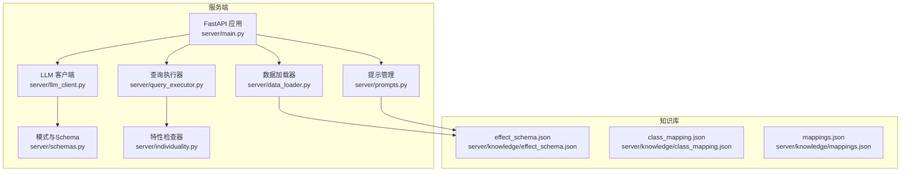
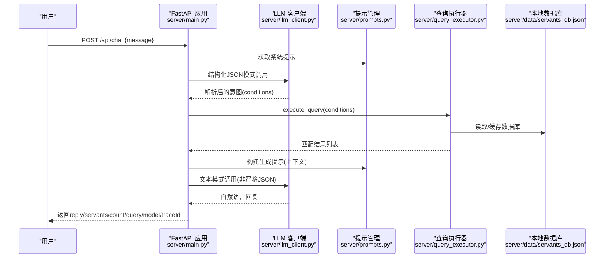
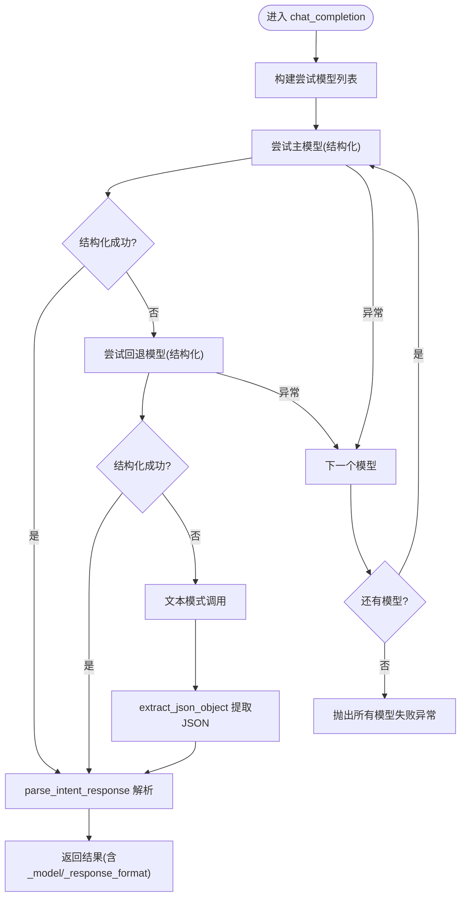
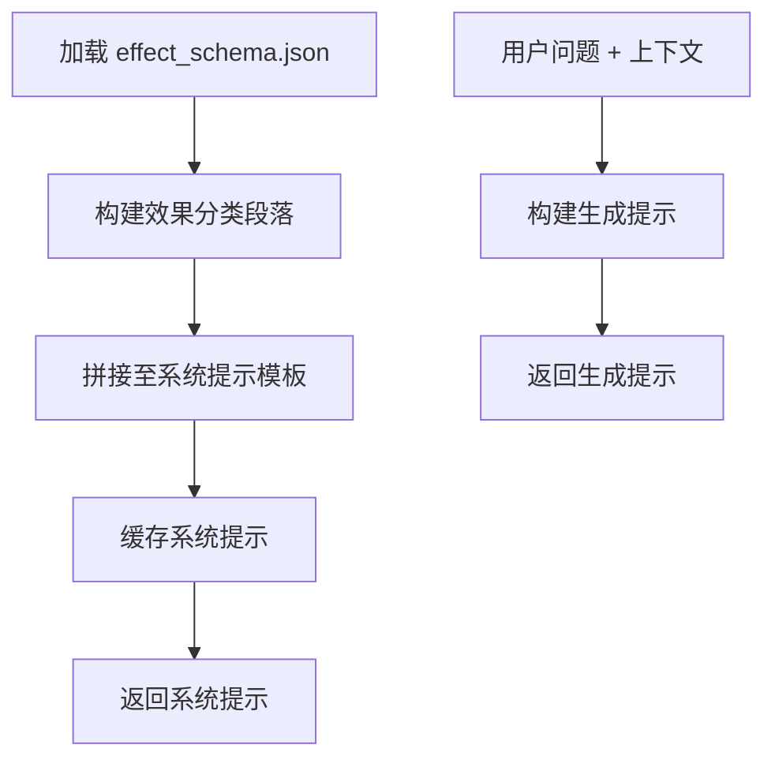
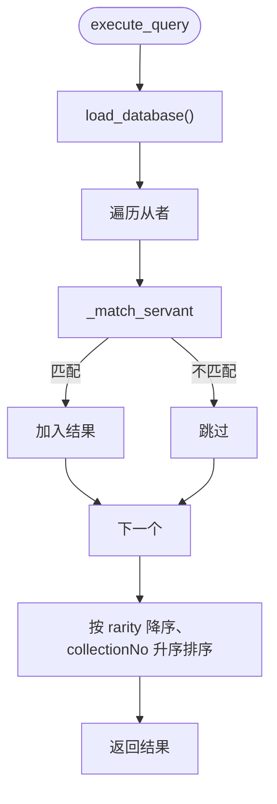
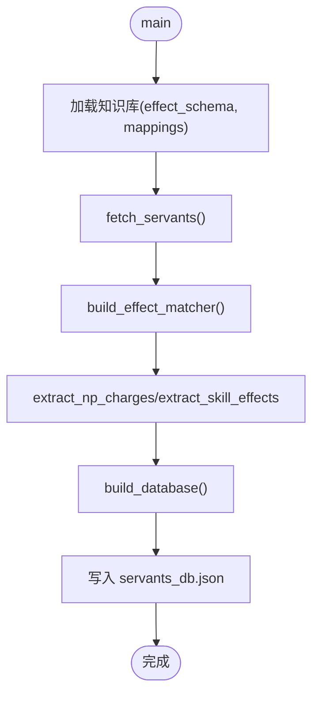
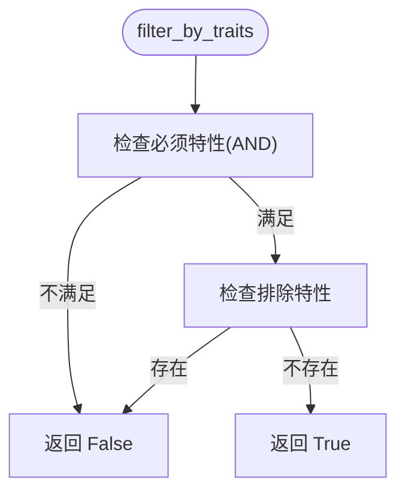
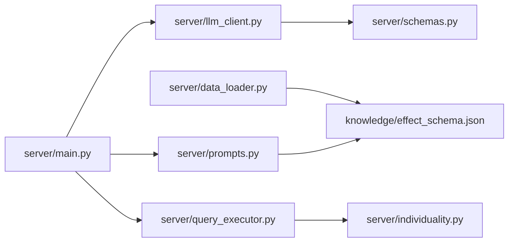

# 核心模块

<cite>
**本文引用的文件**
- [server/main.py](file://server/main.py)
- [server/llm_client.py](file://server/llm_client.py)
- [server/prompts.py](file://server/prompts.py)
- [server/query_executor.py](file://server/query_executor.py)
- [server/data_loader.py](file://server/data_loader.py)
- [server/schemas.py](file://server/schemas.py)
- [server/individuality.py](file://server/individuality.py)
- [server/sync_chaldea.py](file://server/sync_chaldea.py)
- [server/knowledge/effect_schema.json](file://server/knowledge/effect_schema.json)
- [tests/test_llm_client.py](file://tests/test_llm_client.py)
- [tests/test_query_executor.py](file://tests/test_query_executor.py)
</cite>

## 目录
1. [简介](#简介)
2. [项目结构](#项目结构)
3. [核心组件](#核心组件)
4. [架构总览](#架构总览)
5. [详细组件分析](#详细组件分析)
6. [依赖关系分析](#依赖关系分析)
7. [性能考量](#性能考量)
8. [故障排查指南](#故障排查指南)
9. [结论](#结论)
10. [附录](#附录)

## 简介
本文件面向Laplace的核心模块，系统梳理LLM客户端、查询执行器、数据加载器与提示管理等关键组件的职责、接口设计、内部协作机制与数据流。文档提供架构图、序列图、流程图与最佳实践，帮助开发者快速理解与扩展系统。

## 项目结构
Laplace采用分层清晰的服务端架构：
- 服务入口：FastAPI应用，负责路由、CORS、静态资源挂载与聊天链路编排
- LLM层：封装OpenAI兼容的聊天补全调用，支持结构化输出与多模型回退
- 提示层：动态构建系统提示与生成阶段提示，注入知识库
- 查询层：在本地预加载的从者数据库上执行多条件筛选
- 数据层：从Atlas Academy API抓取数据，结合知识库生成通用数据库
- 知识库：从Chaldea源码镜像同步，生成效果分类、职阶映射、多语言映射等



图表来源
- [server/main.py:1-228](file://server/main.py#L1-L228)
- [server/llm_client.py:1-247](file://server/llm_client.py#L1-L247)
- [server/prompts.py:1-208](file://server/prompts.py#L1-L208)
- [server/query_executor.py:1-305](file://server/query_executor.py#L1-L305)
- [server/data_loader.py:1-363](file://server/data_loader.py#L1-L363)
- [server/schemas.py:1-81](file://server/schemas.py#L1-L81)
- [server/individuality.py:1-78](file://server/individuality.py#L1-L78)
- [server/knowledge/effect_schema.json:1-694](file://server/knowledge/effect_schema.json#L1-L694)

章节来源
- [server/main.py:1-228](file://server/main.py#L1-L228)
- [server/llm_client.py:1-247](file://server/llm_client.py#L1-L247)
- [server/prompts.py:1-208](file://server/prompts.py#L1-L208)
- [server/query_executor.py:1-305](file://server/query_executor.py#L1-L305)
- [server/data_loader.py:1-363](file://server/data_loader.py#L1-L363)
- [server/schemas.py:1-81](file://server/schemas.py#L1-L81)
- [server/individuality.py:1-78](file://server/individuality.py#L1-L78)
- [server/knowledge/effect_schema.json:1-694](file://server/knowledge/effect_schema.json#L1-L694)

## 核心组件
- LLM客户端：统一LLM调用入口，支持结构化JSON模式、响应格式降级与多模型回退
- 提示管理：动态构建系统提示，注入效果分类与中文别名；第二阶段生成提示用于RAG
- 查询执行器：在本地数据库上执行多条件筛选，支持NP自充、效果、特性、卡色、宝具等
- 数据加载器：从Atlas Academy API抓取数据，结合知识库生成通用数据库
- 模式与Schema：定义意图解析的结构化JSON模式，确保LLM输出严格符合预期
- 特性检查器：实现FGO特性匹配逻辑（含正负特性）

章节来源
- [server/llm_client.py:35-126](file://server/llm_client.py#L35-L126)
- [server/prompts.py:46-160](file://server/prompts.py#L46-L160)
- [server/query_executor.py:53-261](file://server/query_executor.py#L53-L261)
- [server/data_loader.py:332-359](file://server/data_loader.py#L332-L359)
- [server/schemas.py:16-80](file://server/schemas.py#L16-L80)
- [server/individuality.py:58-77](file://server/individuality.py#L58-L77)

## 架构总览
下图展示一次典型聊天请求的端到端流程：前端发起请求，FastAPI编排LLM解析意图、执行查询、生成自然语言回复，并记录链路追踪。



图表来源
- [server/main.py:87-218](file://server/main.py#L87-L218)
- [server/llm_client.py:35-126](file://server/llm_client.py#L35-L126)
- [server/prompts.py:175-207](file://server/prompts.py#L175-L207)
- [server/query_executor.py:53-87](file://server/query_executor.py#L53-L87)

章节来源
- [server/main.py:87-218](file://server/main.py#L87-L218)

## 详细组件分析

### LLM客户端
职责
- 对接OpenAI兼容的聊天补全接口
- 优先使用结构化response_format进行JSON模式调用
- 在模型不支持结构化输出时自动降级为文本模式
- 支持主模型与多个回退模型的顺序尝试
- 解析并验证LLM输出，提取JSON片段，返回标准化结构

关键接口
- chat_completion(system_prompt, user_message, model, max_tokens, temperature, json_mode)
- _call_model(model, system_prompt, user_message, ...)
- _post_chat_completion(model, system_prompt, user_message, ...)
- parse_intent_response(content)
- extract_json_object(text)

错误处理
- 捕获HTTP错误与响应格式错误，触发回退策略
- 当所有模型均失败时抛出异常



图表来源
- [server/llm_client.py:35-126](file://server/llm_client.py#L35-L126)
- [server/llm_client.py:129-168](file://server/llm_client.py#L129-L168)
- [server/llm_client.py:171-214](file://server/llm_client.py#L171-L214)

章节来源
- [server/llm_client.py:35-126](file://server/llm_client.py#L35-L126)
- [server/llm_client.py:129-168](file://server/llm_client.py#L129-L168)
- [server/llm_client.py:171-214](file://server/llm_client.py#L171-L214)
- [tests/test_llm_client.py:89-125](file://tests/test_llm_client.py#L89-L125)

### 提示管理
职责
- 动态加载知识库，构建系统提示，注入效果分类与中文别名
- 生成第二阶段RAG生成提示，基于检索上下文生成自然语言回复
- 缓存构建好的系统提示，避免重复加载

关键接口
- get_system_prompt(): 返回系统提示
- get_generation_prompt(user_query, context_json): 返回生成提示



图表来源
- [server/prompts.py:15-43](file://server/prompts.py#L15-L43)
- [server/prompts.py:46-160](file://server/prompts.py#L46-L160)
- [server/prompts.py:175-207](file://server/prompts.py#L175-L207)

章节来源
- [server/prompts.py:15-43](file://server/prompts.py#L15-L43)
- [server/prompts.py:46-160](file://server/prompts.py#L46-L160)
- [server/prompts.py:175-207](file://server/prompts.py#L175-L207)

### 查询执行器
职责
- 在本地预加载的从者数据库上执行多条件筛选
- 支持NP自充百分比、稀有度、职阶、名称（含昵称映射）、技能效果（单/多/逻辑OR/AND）、目标类型、特性（含正负特性）、性别、阵营、卡色、宝具颜色与目标类型
- 返回排序后的结果（稀有度降序，collectionNo升序）

关键接口
- execute_query(conditions): 主入口
- _match_servant(servant, conditions): 单条匹配逻辑
- _match_effect(servant, effect_name, target_type): 效果匹配
- load_database()/load_nicknames(): 缓存加载



图表来源
- [server/query_executor.py:53-87](file://server/query_executor.py#L53-L87)
- [server/query_executor.py:90-261](file://server/query_executor.py#L90-L261)

章节来源
- [server/query_executor.py:53-87](file://server/query_executor.py#L53-L87)
- [server/query_executor.py:90-261](file://server/query_executor.py#L90-L261)
- [server/individuality.py:58-77](file://server/individuality.py#L58-L77)
- [tests/test_query_executor.py:123-171](file://tests/test_query_executor.py#L123-L171)

### 数据加载器
职责
- 从Atlas Academy API拉取全量从者数据
- 基于effect_schema.json构建效果匹配索引
- 提取NP自充、技能效果、卡色、宝具颜色与目标类型
- 生成通用数据库servants_db.json，供查询执行器使用

关键接口
- fetch_servants(): 拉取数据
- build_effect_matcher(effects): 构建funcType/buffType索引
- extract_np_charges(servant): 提取NP自充
- extract_skill_effects(servant, matcher): 提取技能效果
- build_database(servants, matcher, name_mapping): 生成通用数据库



图表来源
- [server/data_loader.py:332-359](file://server/data_loader.py#L332-L359)
- [server/data_loader.py:44-52](file://server/data_loader.py#L44-L52)
- [server/data_loader.py:64-84](file://server/data_loader.py#L64-L84)
- [server/data_loader.py:113-137](file://server/data_loader.py#L113-L137)
- [server/data_loader.py:181-228](file://server/data_loader.py#L181-L228)
- [server/data_loader.py:231-329](file://server/data_loader.py#L231-L329)

章节来源
- [server/data_loader.py:332-359](file://server/data_loader.py#L332-L359)
- [server/data_loader.py:44-52](file://server/data_loader.py#L44-L52)
- [server/data_loader.py:64-84](file://server/data_loader.py#L64-L84)
- [server/data_loader.py:113-137](file://server/data_loader.py#L113-L137)
- [server/data_loader.py:181-228](file://server/data_loader.py#L181-L228)
- [server/data_loader.py:231-329](file://server/data_loader.py#L231-L329)

### 模式与Schema
职责
- 定义IntentResponse与QueryConditions的Pydantic模型
- 提供JSON Schema，用于LLM结构化输出的response_format
- 规范字段类型、默认值与空值处理

```mermaid
classDiagram
class NumericCondition {
+op : "eq"|"gte"|"lte"|"gt"|"lt"
+value : int
}
class QueryConditions {
+npCharge : NumericCondition?
+rarity : NumericCondition?
+className : string?
+name : string?
+skillEffect : string?
+skillEffects : string[]?
+skillEffectsOp : "and"|"or"?
+targetType : "self"|"party"|"enemy"?
+traits : int[]?
+excludeTraits : int[]?
+gender : "male"|"female"|"unknown"?
+attribute : "earth"|"sky"|"human"|"star"|"beast"?
+cards : {"buster"|"arts"|"quick" : int}?
+npCard : "buster"|"arts"|"quick"?
+npTarget : "one"|"all"|"support"?
}
class IntentResponse {
+intent : "query_servants"
+conditions : QueryConditions
+responseTemplate : string?
}
IntentResponse --> QueryConditions : "包含"
QueryConditions --> NumericCondition : "包含"
```

图表来源
- [server/schemas.py:16-80](file://server/schemas.py#L16-L80)

章节来源
- [server/schemas.py:16-80](file://server/schemas.py#L16-L80)

### 特性检查器
职责
- 实现FGO特性匹配逻辑：支持必须拥有（AND）与不能拥有（排除）
- 支持带符号特性（正数为必须，负数为不能拥有）



图表来源
- [server/individuality.py:58-77](file://server/individuality.py#L58-L77)

章节来源
- [server/individuality.py:58-77](file://server/individuality.py#L58-L77)

## 依赖关系分析
- 服务入口依赖LLM客户端、提示管理、查询执行器与日志记录
- 查询执行器依赖特性检查器与本地数据库缓存
- 数据加载器依赖知识库（effect_schema.json等）
- LLM客户端依赖模式与Schema进行结构化输出
- 提示管理依赖知识库动态注入效果分类



图表来源
- [server/main.py:14-17](file://server/main.py#L14-L17)
- [server/llm_client.py:16](file://server/llm_client.py#L16)
- [server/prompts.py:12](file://server/prompts.py#L12)
- [server/query_executor.py:12](file://server/query_executor.py#L12)
- [server/data_loader.py:46](file://server/data_loader.py#L46)

章节来源
- [server/main.py:14-17](file://server/main.py#L14-L17)
- [server/llm_client.py:16](file://server/llm_client.py#L16)
- [server/prompts.py:12](file://server/prompts.py#L12)
- [server/query_executor.py:12](file://server/query_executor.py#L12)
- [server/data_loader.py:46](file://server/data_loader.py#L46)

## 性能考量
- 数据库缓存：查询执行器与FastAPI在启动时预加载数据库，避免重复IO
- 本地化：所有数据与知识库均本地存储，减少网络延迟
- 限流与超时：LLM客户端设置异步HTTP超时，避免阻塞
- 结果截断：前端返回限制为固定数量，避免响应过大
- 索引优化：数据加载器构建funcType/buffType索引，加速效果匹配
- 降级策略：结构化输出失败时自动降级为文本模式，保证可用性

[本节为通用性能讨论，无需具体文件分析]

## 故障排查指南
常见问题与定位方法
- LLM调用失败
  - 检查BASE_URL/API_KEY/LLM_MODEL/LLM_FALLBACK_MODELS环境变量
  - 观察结构化输出失败时的回退日志
  - 参考单元测试用例验证回退逻辑
- JSON解析失败
  - 确认LLM输出符合IntentResponse模式
  - 检查parse_intent_response与extract_json_object的错误分支
- 查询结果为空
  - 核对conditions字段是否为空或非法
  - 检查昵称映射与名称规范化逻辑
  - 确认数据库已正确生成并缓存
- 知识库缺失
  - 运行知识库同步脚本生成effect_schema.json等文件

章节来源
- [server/llm_client.py:31-33](file://server/llm_client.py#L31-L33)
- [server/llm_client.py:171-178](file://server/llm_client.py#L171-L178)
- [server/llm_client.py:236-246](file://server/llm_client.py#L236-L246)
- [tests/test_llm_client.py:81-87](file://tests/test_llm_client.py#L81-L87)
- [server/main.py:101-111](file://server/main.py#L101-L111)
- [server/main.py:189-196](file://server/main.py#L189-L196)

## 结论
Laplace通过严格的结构化意图解析与本地化数据查询，实现了从自然语言到精准结果的端到端流程。LLM客户端、提示管理、查询执行器与数据加载器协同工作，既保证了输出质量，又兼顾了性能与可维护性。建议后续持续同步知识库、优化匹配索引与缓存策略，并引入更细粒度的监控与追踪。

[本节为总结性内容，无需具体文件分析]

## 附录

### 配置选项与环境变量
- LLM_BASE_URL：LLM基础URL，默认值见源码
- LLM_API_KEY：LLM鉴权密钥
- LLM_MODEL：主模型名称
- LLM_FALLBACK_MODELS：回退模型列表（逗号分隔）

章节来源
- [server/llm_client.py:21-28](file://server/llm_client.py#L21-L28)

### 使用模式与示例
- 结构化意图解析：系统提示注入效果分类，要求LLM输出严格JSON
- RAG生成阶段：基于检索上下文生成自然语言回复，避免先验知识
- 查询条件：支持NP自充、稀有度、职阶、名称、技能效果、特性、性别、阵营、卡色、宝具颜色与目标类型

章节来源
- [server/prompts.py:46-160](file://server/prompts.py#L46-L160)
- [server/main.py:175-185](file://server/main.py#L175-L185)
- [server/query_executor.py:53-76](file://server/query_executor.py#L53-L76)