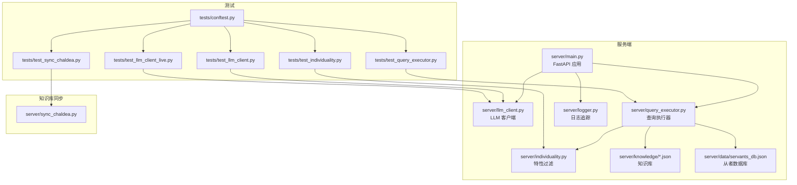
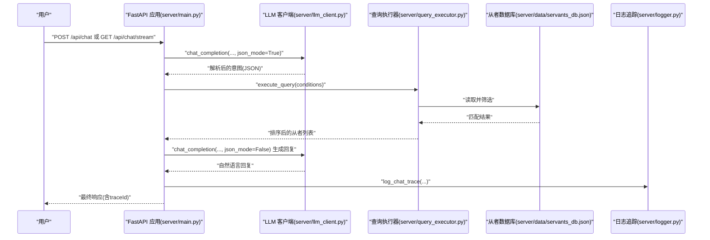
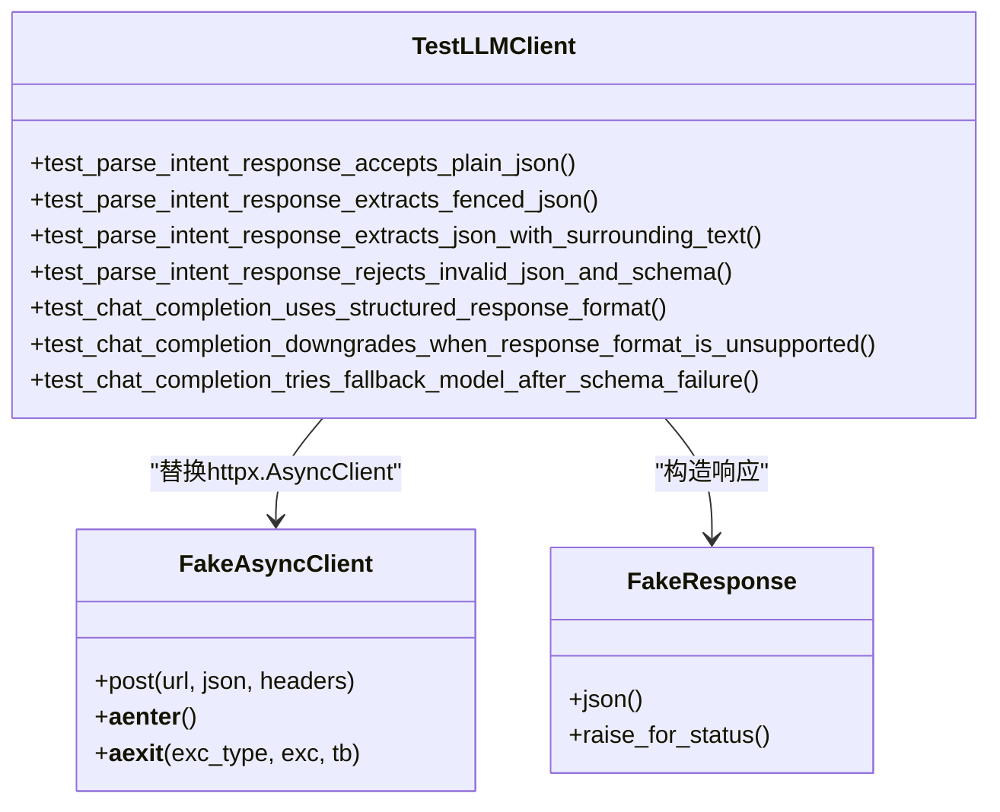
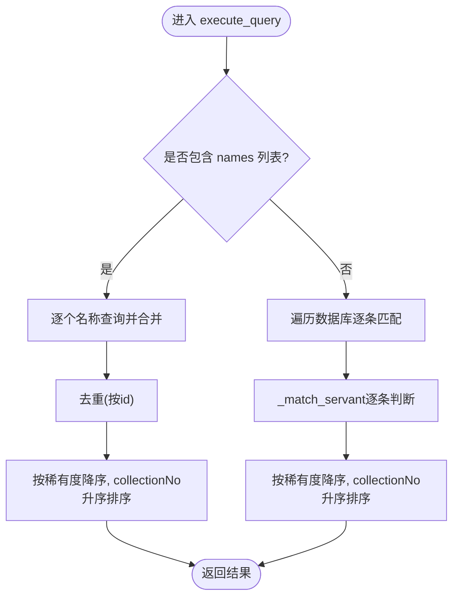
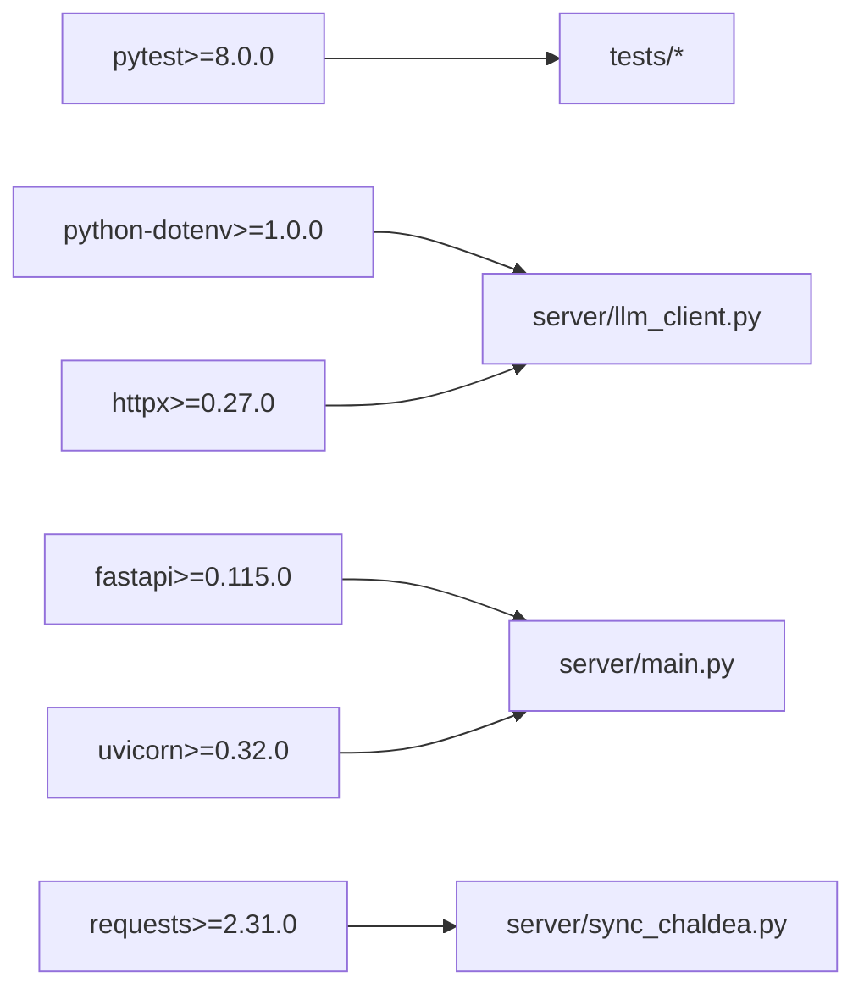

# 测试与部署

<cite>
**本文引用的文件**
- [server/main.py](file://server/main.py)
- [server/llm_client.py](file://server/llm_client.py)
- [server/query_executor.py](file://server/query_executor.py)
- [server/individuality.py](file://server/individuality.py)
- [server/sync_chaldea.py](file://server/sync_chaldea.py)
- [server/logger.py](file://server/logger.py)
- [server/requirements.txt](file://server/requirements.txt)
- [tests/conftest.py](file://tests/conftest.py)
- [tests/test_llm_client.py](file://tests/test_llm_client.py)
- [tests/test_query_executor.py](file://tests/test_query_executor.py)
- [tests/test_sync_chaldea.py](file://tests/test_sync_chaldea.py)
- [tests/test_individuality.py](file://tests/test_individuality.py)
- [tests/test_llm_client_live.py](file://tests/test_llm_client_live.py)
</cite>

## 目录
1. [引言](#引言)
2. [项目结构](#项目结构)
3. [核心组件](#核心组件)
4. [架构总览](#架构总览)
5. [详细组件分析](#详细组件分析)
6. [依赖分析](#依赖分析)
7. [性能考虑](#性能考虑)
8. [故障排除指南](#故障排除指南)
9. [结论](#结论)
10. [附录](#附录)

## 引言
本指南面向Laplace项目的测试与部署，覆盖测试策略（单元测试、集成测试、端到端测试）、测试用例设计原则与编写规范、测试环境配置与模拟对象使用、部署流程与生产环境配置、容器化与Docker方案、监控与日志、性能与压力测试、CI/CD自动化部署策略，以及运维支持与故障排除建议。文档基于仓库现有代码与测试文件进行系统化梳理，确保读者能够快速落地实践。

## 项目结构
Laplace采用“服务端FastAPI + 知识库同步 + 测试”三层组织方式：
- 服务端：FastAPI应用、LLM客户端、查询执行器、日志追踪、静态资源挂载
- 知识库同步：从Chaldea源码解析并生成JSON知识库
- 测试：pytest测试套件，覆盖LLM客户端、查询执行器、特性过滤、同步脚本等

图表来源
- [server/main.py:114-365](file://server/main.py#L114-L365)
- [server/llm_client.py:135-254](file://server/llm_client.py#L135-L254)
- [server/query_executor.py:41-343](file://server/query_executor.py#L41-L343)
- [server/individuality.py:1-78](file://server/individuality.py#L1-L78)
- [server/logger.py:38-55](file://server/logger.py#L38-L55)
- [tests/test_llm_client.py:1-150](file://tests/test_llm_client.py#L1-L150)
- [tests/test_query_executor.py:1-172](file://tests/test_query_executor.py#L1-L172)
- [tests/test_sync_chaldea.py:1-58](file://tests/test_sync_chaldea.py#L1-L58)
- [tests/test_individuality.py:1-26](file://tests/test_individuality.py#L1-L26)
- [tests/test_llm_client_live.py:1-36](file://tests/test_llm_client_live.py#L1-L36)
- [tests/conftest.py:1-8](file://tests/conftest.py#L1-L8)
- [server/sync_chaldea.py:308-429](file://server/sync_chaldea.py#L308-L429)

章节来源
- [server/main.py:114-365](file://server/main.py#L114-L365)
- [server/llm_client.py:135-254](file://server/llm_client.py#L135-L254)
- [server/query_executor.py:41-343](file://server/query_executor.py#L41-L343)
- [server/individuality.py:1-78](file://server/individuality.py#L1-L78)
- [server/logger.py:38-55](file://server/logger.py#L38-L55)
- [tests/test_llm_client.py:1-150](file://tests/test_llm_client.py#L1-L150)
- [tests/test_query_executor.py:1-172](file://tests/test_query_executor.py#L1-L172)
- [tests/test_sync_chaldea.py:1-58](file://tests/test_sync_chaldea.py#L1-L58)
- [tests/test_individuality.py:1-26](file://tests/test_individuality.py#L1-L26)
- [tests/test_llm_client_live.py:1-36](file://tests/test_llm_client_live.py#L1-L36)
- [tests/conftest.py:1-8](file://tests/conftest.py#L1-L8)
- [server/sync_chaldea.py:308-429](file://server/sync_chaldea.py#L308-L429)

## 核心组件
- FastAPI应用与路由：提供REST与SSE两类接口，启动时预加载数据库，挂载前端静态资源
- LLM客户端：封装Responses API调用，支持结构化输出、降级策略与多模型回退
- 查询执行器：在本地数据库与知识库上执行多条件筛选，支持多从者对比、昵称映射、效果与特性过滤
- 特性过滤器：实现正/负特性分离与AND/OR逻辑校验
- 日志追踪：统一记录查询链路，便于排障与审计
- 知识库同步：从Chaldea源码解析并生成JSON知识库文件

章节来源
- [server/main.py:144-365](file://server/main.py#L144-L365)
- [server/llm_client.py:41-254](file://server/llm_client.py#L41-L254)
- [server/query_executor.py:53-343](file://server/query_executor.py#L53-L343)
- [server/individuality.py:8-78](file://server/individuality.py#L8-L78)
- [server/logger.py:38-55](file://server/logger.py#L38-L55)
- [server/sync_chaldea.py:308-429](file://server/sync_chaldea.py#L308-L429)

## 架构总览
下图展示从用户请求到响应的端到端流程，包括意图解析、数据检索与自然语言生成三个阶段。

图表来源
- [server/main.py:150-355](file://server/main.py#L150-L355)
- [server/llm_client.py:41-132](file://server/llm_client.py#L41-L132)
- [server/query_executor.py:53-116](file://server/query_executor.py#L53-L116)
- [server/logger.py:38-55](file://server/logger.py#L38-L55)

## 详细组件分析

### LLM客户端测试与模拟
- 测试策略
  - 单元测试：通过pytest与monkeypatch替换httpx.AsyncClient，构造FakeResponse/FakeAsyncClient，验证结构化输出、降级逻辑与多模型回退
  - 行为验证：覆盖JSON模式提取、文本回退、错误抛出与模型切换
  - 端到端测试：可选的实时LLM测试，通过环境变量开关启用
- 设计原则
  - 用例覆盖：正常路径、异常路径、边界条件（空内容、不完整JSON、响应格式不支持）
  - 可重复性：固定模型与响应格式，确保测试稳定
  - 可观测性：断言请求参数（instructions/input/text.format）与响应格式标记
- 编写规范
  - fixture集中管理mock注入，减少重复代码
  - 使用明确的断言标签（如“response_format”、“model”）定位问题
  - 对真实API调用设置显式开关，避免CI误触发

图表来源
- [tests/test_llm_client.py:12-73](file://tests/test_llm_client.py#L12-L73)
- [tests/test_llm_client.py:106-150](file://tests/test_llm_client.py#L106-L150)
- [server/llm_client.py:41-132](file://server/llm_client.py#L41-L132)

章节来源
- [tests/test_llm_client.py:1-150](file://tests/test_llm_client.py#L1-L150)
- [tests/test_llm_client_live.py:1-36](file://tests/test_llm_client_live.py#L1-L36)
- [server/llm_client.py:24-34](file://server/llm_client.py#L24-L34)

### 查询执行器测试与数据流
- 测试策略
  - 单元测试：通过setup_module/teardown_module注入测试数据库与昵称映射，覆盖NP充能、稀有度、职阶、昵称、效果、特性、性别、阵营、配卡、宝具等多条件组合
  - 数据驱动：使用固定样例数据，保证断言可预期
- 设计原则
  - 条件组合：AND/OR效果、包含/排除特性、多从者对比
  - 名称匹配：精确匹配、子串匹配、昵称映射与额外过滤
  - 排序规则：稀有度降序、collectionNo升序
- 编写规范
  - 断言结果名称列表，避免顺序依赖
  - 对多从者对比场景，确保去重与排序一致性

图表来源
- [server/query_executor.py:53-116](file://server/query_executor.py#L53-L116)
- [server/query_executor.py:119-343](file://server/query_executor.py#L119-L343)
- [tests/test_query_executor.py:104-172](file://tests/test_query_executor.py#L104-L172)

章节来源
- [tests/test_query_executor.py:1-172](file://tests/test_query_executor.py#L1-L172)
- [server/query_executor.py:41-343](file://server/query_executor.py#L41-L343)

### 特性过滤测试
- 测试策略
  - 单元测试：验证正/负特性分离、部分匹配、AND/OR逻辑与排除规则
- 设计原则
  - 正特性为必须拥有，负特性为禁止拥有
  - 多条件AND（全部满足）与OR（任一满足）可配置
- 编写规范
  - 使用典型特征ID集合，覆盖包含/不包含、正负混合场景

章节来源
- [tests/test_individuality.py:1-26](file://tests/test_individuality.py#L1-L26)
- [server/individuality.py:8-78](file://server/individuality.py#L8-L78)

### 知识库同步测试
- 测试策略
  - 单元测试：临时写入Dart源码片段，验证枚举解析与效果分类提取
- 设计原则
  - 幂等：重复运行覆盖旧文件
  - 可追溯：生成_meta.json记录来源与版本
- 编写规范
  - 通过tmp_path隔离测试文件，避免污染工作区

章节来源
- [tests/test_sync_chaldea.py:1-58](file://tests/test_sync_chaldea.py#L1-L58)
- [server/sync_chaldea.py:308-429](file://server/sync_chaldea.py#L308-L429)

## 依赖分析
- 测试依赖
  - pytest：测试框架
  - httpx：异步HTTP客户端，用于LLM客户端测试中的模拟
  - python-dotenv：加载.env环境变量
- 运行时依赖
  - fastapi、uvicorn：Web服务
  - httpx、requests：HTTP请求
- 测试与运行时依赖分离，确保CI与生产环境最小化

图表来源
- [server/requirements.txt:1-7](file://server/requirements.txt#L1-L7)
- [tests/test_llm_client.py:3-4](file://tests/test_llm_client.py#L3-L4)
- [server/llm_client.py:19-20](file://server/llm_client.py#L19-L20)
- [server/main.py:8-22](file://server/main.py#L8-L22)
- [server/sync_chaldea.py:17-22](file://server/sync_chaldea.py#L17-L22)

章节来源
- [server/requirements.txt:1-7](file://server/requirements.txt#L1-L7)

## 性能考虑
- 查询性能
  - 数据库加载：启动时一次性加载，后续缓存命中
  - 匹配算法：线性扫描+早期返回，复杂度O(N)，N为从者数量
  - 排序：按稀有度与collectionNo排序，避免过度计算
- LLM调用
  - 结构化输出优先，失败自动降级为文本回退
  - 多模型回退：主模型失败自动切换备选模型
  - 超时控制：统一超时阈值，避免阻塞
- 响应大小控制
  - 前端返回上限限制，避免响应过大
- 建议
  - 大规模数据时考虑索引或分页
  - 对热点查询引入内存缓存
  - 在高并发场景评估并发连接与限流策略

章节来源
- [server/query_executor.py:41-116](file://server/query_executor.py#L41-L116)
- [server/llm_client.py:66-84](file://server/llm_client.py#L66-L84)
- [server/main.py:232-242](file://server/main.py#L232-L242)

## 故障排除指南
- LLM调用失败
  - 现象：意图解析阶段报错或返回错误响应
  - 排查：检查LLM_BASE_URL、LLM_API_KEY、LLM_MODEL与LLM_FALLBACK_MODELS配置；确认网络连通与鉴权
  - 日志：查看traceId与错误字段，结合日志文件定位
- 查询无结果或结果异常
  - 现象：execute_query返回空或排序不符合预期
  - 排查：核对条件键名与运算符；检查昵称映射与特性过滤逻辑
- SSE流异常
  - 现象：SSE中断或事件缺失
  - 排查：确认CORS配置与响应头设置；检查生成阶段异常回退逻辑
- 日志与追踪
  - 日志文件位置：server/logs/query_trace.jsonl
  - 字段：traceId、query、intent、results_count、reply、context、error

章节来源
- [server/llm_client.py:24-34](file://server/llm_client.py#L24-L34)
- [server/main.py:164-174](file://server/main.py#L164-L174)
- [server/main.py:263-267](file://server/main.py#L263-L267)
- [server/logger.py:38-55](file://server/logger.py#L38-L55)

## 结论
本指南基于仓库现有代码与测试文件，提供了从测试策略、测试用例设计、测试环境配置到部署与运维的完整实践路径。通过单元测试、集成测试与可选的端到端测试，结合日志追踪与知识库同步机制，Laplace能够在可控成本下实现高质量交付与稳定运行。建议在CI中默认运行单元与集成测试，在具备真实密钥与网络条件时再开启端到端测试。

## 附录

### 测试策略与用例设计
- 单元测试
  - 覆盖核心函数与边界条件，使用fixture与mock隔离外部依赖
- 集成测试
  - 覆盖模块间协作（LLM客户端与查询执行器），验证真实数据路径
- 端到端测试
  - 通过SSE或REST接口验证完整链路，必要时启用实时LLM测试

章节来源
- [tests/test_llm_client.py:1-150](file://tests/test_llm_client.py#L1-L150)
- [tests/test_query_executor.py:1-172](file://tests/test_query_executor.py#L1-L172)
- [tests/test_sync_chaldea.py:1-58](file://tests/test_sync_chaldea.py#L1-L58)
- [tests/test_individuality.py:1-26](file://tests/test_individuality.py#L1-L26)
- [tests/test_llm_client_live.py:1-36](file://tests/test_llm_client_live.py#L1-L36)

### 测试环境配置与模拟对象
- 环境变量
  - LLM_BASE_URL、LLM_API_KEY、LLM_MODEL、LLM_FALLBACK_MODELS
- 模拟对象
  - httpx.AsyncClient替换为FakeAsyncClient
  - responses API响应包装为FakeResponse
- 运行方式
  - pytest tests/ --co -q 查看用例
  - pytest tests/test_llm_client.py::test_chat_completion_uses_structured_response_format -v

章节来源
- [server/llm_client.py:24-34](file://server/llm_client.py#L24-L34)
- [tests/test_llm_client.py:66-73](file://tests/test_llm_client.py#L66-L73)
- [tests/conftest.py:1-8](file://tests/conftest.py#L1-L8)

### 部署流程与生产环境配置
- 依赖安装
  - 使用server/requirements.txt安装运行时依赖
- 环境准备
  - 准备.env文件，设置LLM相关环境变量
  - 确保知识库与从者数据库文件存在
- 启动服务
  - 使用uvicorn启动FastAPI应用
- 健康检查
  - 访问/health端点确认服务可用

章节来源
- [server/requirements.txt:1-7](file://server/requirements.txt#L1-L7)
- [server/main.py:358-361](file://server/main.py#L358-L361)
- [server/llm_client.py:24-34](file://server/llm_client.py#L24-L34)

### 容器化部署与Docker配置
- 建议
  - 使用Python官方镜像作为基础镜像
  - 复制requirements.txt后执行pip安装，随后复制源码
  - 暴露服务端口，挂载日志目录与知识库目录
  - 通过环境变量注入LLM配置
- 注意
  - Dockerfile未在仓库中提供，以上为通用实践建议

### 监控与日志
- 日志
  - JSONL格式写入server/logs/query_trace.jsonl
  - 字段包含traceId、query、intent、results_count、reply、context、error
- 建议
  - 集成日志收集系统（如Filebeat/Fluent Bit）与可视化平台（如Grafana）

章节来源
- [server/logger.py:38-55](file://server/logger.py#L38-L55)

### 性能与压力测试
- 方法
  - 使用压测工具（如wrk、k6、Locust）对/health、/api/chat、/api/chat/stream进行基准测试
  - 关注P50/P95延迟、吞吐量与错误率
- 关注点
  - LLM调用延迟与回退策略
  - 数据库查询与排序开销
  - SSE流式响应的稳定性

### CI/CD流程与自动化部署
- 建议流水线步骤
  - 安装依赖（pip install -r server/requirements.txt）
  - 运行单元与集成测试（pytest tests/ -v）
  - 可选：运行实时LLM测试（RUN_LIVE_LLM_TESTS=1）
  - 构建镜像与推送（如需容器化）
  - 部署到目标环境并健康检查
- 触发条件
  - 代码提交或PR合并触发测试与构建

### 运维支持与故障排除清单
- 常见问题
  - LLM鉴权失败：检查LLM_API_KEY与Base URL
  - 数据库加载失败：确认servants_db.json存在且可读
  - SSE断流：检查CORS与响应头
  - 日志为空：确认日志目录权限与uvicorn日志级别
- 工具
  - curl或Postman验证REST/SSE端点
  - 查看日志文件定位traceId