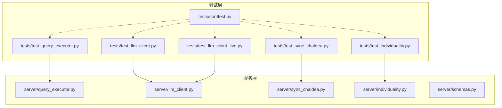
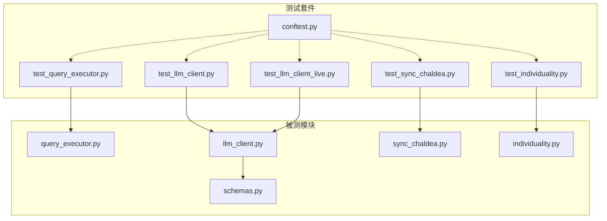
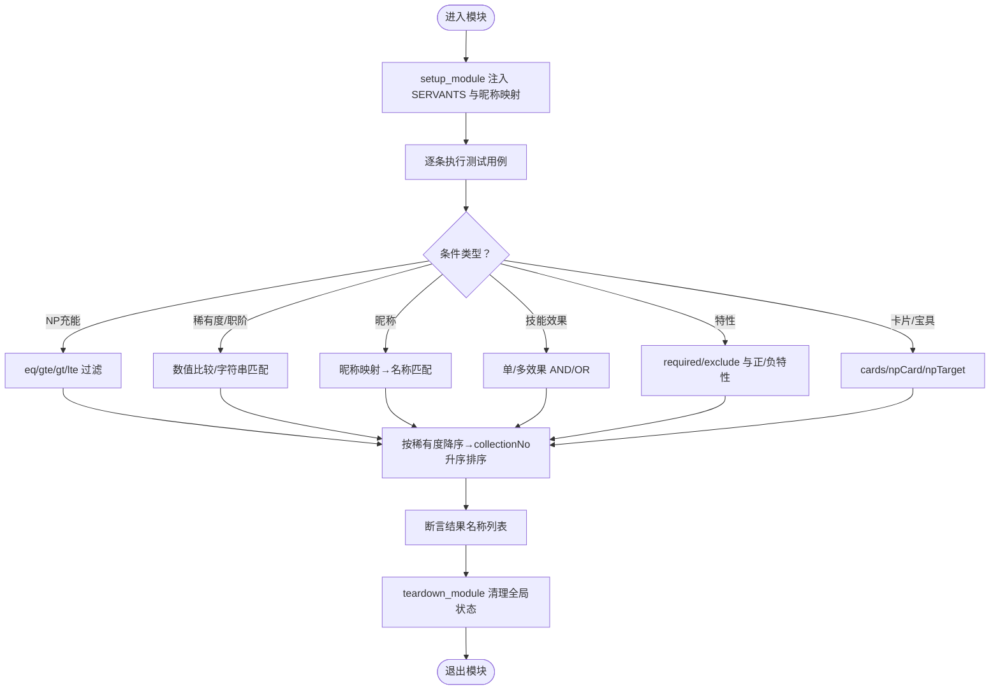
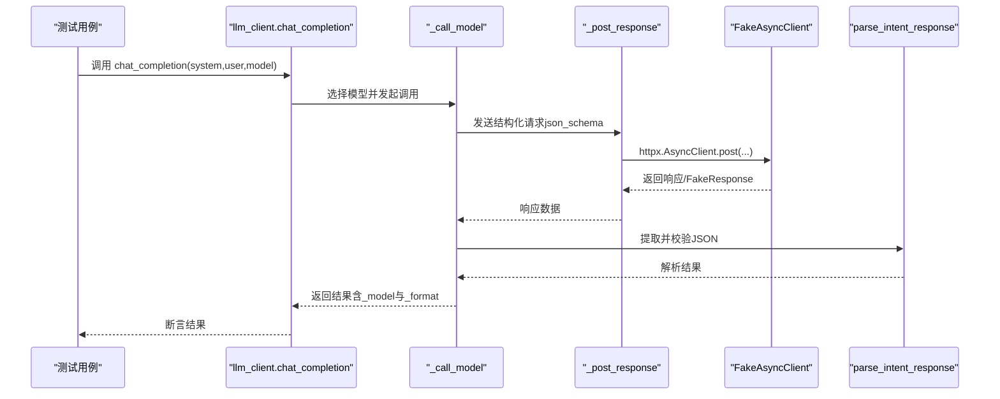
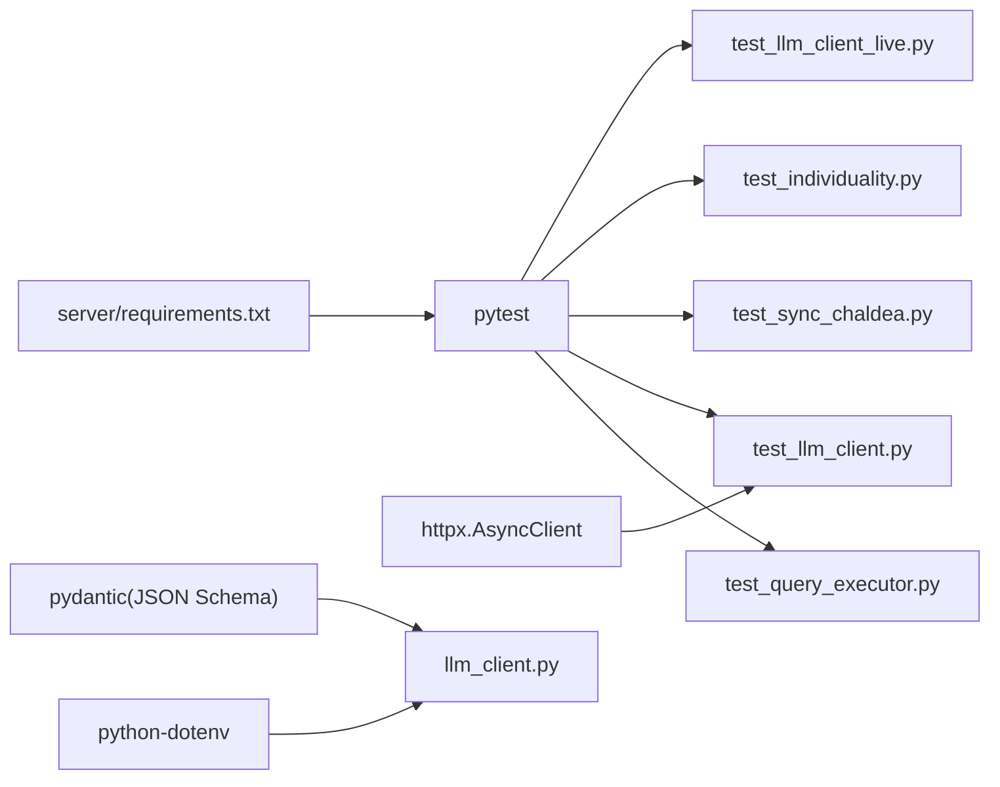

# 测试指南

<cite>
**本文引用的文件**   
- [tests/conftest.py](file://tests/conftest.py)
- [tests/test_query_executor.py](file://tests/test_query_executor.py)
- [tests/test_llm_client.py](file://tests/test_llm_client.py)
- [tests/test_llm_client_live.py](file://tests/test_llm_client_live.py)
- [tests/test_sync_chaldea.py](file://tests/test_sync_chaldea.py)
- [tests/test_individuality.py](file://tests/test_individuality.py)
- [server/query_executor.py](file://server/query_executor.py)
- [server/llm_client.py](file://server/llm_client.py)
- [server/sync_chaldea.py](file://server/sync_chaldea.py)
- [server/individuality.py](file://server/individuality.py)
- [server/schemas.py](file://server/schemas.py)
- [server/requirements.txt](file://server/requirements.txt)
</cite>

## 目录
1. [引言](#引言)
2. [项目结构](#项目结构)
3. [核心组件](#核心组件)
4. [架构总览](#架构总览)
5. [详细组件分析](#详细组件分析)
6. [依赖分析](#依赖分析)
7. [性能考虑](#性能考虑)
8. [故障排查指南](#故障排查指南)
9. [结论](#结论)
10. [附录](#附录)

## 引言
本测试指南面向Laplace项目的开发者与质量保障人员，系统阐述测试策略、pytest配置与运行方式、各模块测试用例设计思路、测试环境配置与setup/teardown流程、Mock对象与测试数据准备方法、测试规范与最佳实践，以及单元测试、集成测试与端到端测试的实施要点。同时给出覆盖率要求与结果解读建议，并提供常见问题排查方案。

## 项目结构
Laplace采用“功能分层 + 模块化”的组织方式：
- server：核心业务逻辑（查询执行器、LLM客户端、知识同步脚本、领域模型与校验）
- tests：pytest测试套件，按模块划分用例，包含基础配置与Live测试
- extractor：独立工具模块（与测试相关性较低）

图表来源
- [tests/test_query_executor.py:1-172](file://tests/test_query_executor.py#L1-L172)
- [tests/test_llm_client.py:1-150](file://tests/test_llm_client.py#L1-L150)
- [tests/test_sync_chaldea.py:1-58](file://tests/test_sync_chaldea.py#L1-L58)
- [tests/test_individuality.py:1-26](file://tests/test_individuality.py#L1-L26)
- [tests/test_llm_client_live.py:1-36](file://tests/test_llm_client_live.py#L1-L36)
- [tests/conftest.py:1-8](file://tests/conftest.py#L1-L8)
- [server/query_executor.py:1-343](file://server/query_executor.py#L1-L343)
- [server/llm_client.py:1-254](file://server/llm_client.py#L1-L254)
- [server/sync_chaldea.py:1-429](file://server/sync_chaldea.py#L1-L429)
- [server/individuality.py:1-78](file://server/individuality.py#L1-L78)
- [server/schemas.py:1-92](file://server/schemas.py#L1-L92)

章节来源
- [tests/conftest.py:1-8](file://tests/conftest.py#L1-L8)
- [server/requirements.txt:1-7](file://server/requirements.txt#L1-L7)

## 核心组件
- 查询执行器：负责将LLM解析出的意图与条件在本地知识库上进行筛选与排序，支持多条件AND/OR、特性过滤、昵称映射、多从者对比等。
- LLM客户端：封装Responses API调用，支持结构化输出（json_schema）、降级策略（text fallback）、多模型回退、响应解析与校验。
- 知识同步脚本：从Chaldea源码解析Dart枚举与效果分类，生成JSON知识库并记录元信息。
- 特性检查器：实现FGO特性匹配逻辑（正/负特性分离与AND/OR语义）。
- Pydantic模型与Schema：定义意图响应与查询条件的结构化约束，用于LLM输出校验与测试断言。

章节来源
- [server/query_executor.py:1-343](file://server/query_executor.py#L1-L343)
- [server/llm_client.py:1-254](file://server/llm_client.py#L1-L254)
- [server/sync_chaldea.py:1-429](file://server/sync_chaldea.py#L1-L429)
- [server/individuality.py:1-78](file://server/individuality.py#L1-L78)
- [server/schemas.py:1-92](file://server/schemas.py#L1-L92)

## 架构总览
下图展示测试与被测模块之间的交互关系，以及关键Mock注入点与数据准备位置。

图表来源
- [tests/test_query_executor.py:1-172](file://tests/test_query_executor.py#L1-L172)
- [tests/test_llm_client.py:1-150](file://tests/test_llm_client.py#L1-L150)
- [tests/test_sync_chaldea.py:1-58](file://tests/test_sync_chaldea.py#L1-L58)
- [tests/test_individuality.py:1-26](file://tests/test_individuality.py#L1-L26)
- [tests/test_llm_client_live.py:1-36](file://tests/test_llm_client_live.py#L1-L36)
- [tests/conftest.py:1-8](file://tests/conftest.py#L1-L8)
- [server/query_executor.py:1-343](file://server/query_executor.py#L1-L343)
- [server/llm_client.py:1-254](file://server/llm_client.py#L1-L254)
- [server/sync_chaldea.py:1-429](file://server/sync_chaldea.py#L1-L429)
- [server/individuality.py:1-78](file://server/individuality.py#L1-L78)
- [server/schemas.py:1-92](file://server/schemas.py#L1-L92)

## 详细组件分析

### 查询执行器测试（test_query_executor.py）
- 测试目标：验证多条件筛选、昵称映射、多效果AND/OR、特性过滤、卡片与宝具字段匹配等。
- 数据准备：通过模块级setup/teardown注入内存数据库与昵称映射，避免读取真实文件。
- 断言策略：基于返回从者名称列表进行断言，确保排序与过滤逻辑正确。
- 关键点：
  - 使用全局变量模拟内存数据库，便于快速迭代与隔离。
  - 对昵称映射进行分级匹配（精确→子串→反向子串），覆盖多种输入形态。
  - 多效果AND/OR逻辑通过skillEffects与skillEffectsOp控制。
  - 特性过滤使用individuality模块的filter_by_traits。

图表来源
- [tests/test_query_executor.py:104-172](file://tests/test_query_executor.py#L104-L172)
- [server/query_executor.py:53-117](file://server/query_executor.py#L53-L117)
- [server/individuality.py:58-78](file://server/individuality.py#L58-L78)

章节来源
- [tests/test_query_executor.py:1-172](file://tests/test_query_executor.py#L1-L172)
- [server/query_executor.py:1-343](file://server/query_executor.py#L1-L343)
- [server/individuality.py:1-78](file://server/individuality.py#L1-L78)

### LLM客户端测试（test_llm_client.py）
- 测试目标：验证JSON解析、结构化输出格式、降级策略、多模型回退、响应格式错误识别。
- Mock策略：通过monkeypatch替换httpx.AsyncClient与llm_client内部常量，构造可控的异步HTTP响应。
- 关键点：
  - 使用FakeAsyncClient记录请求参数与响应序列，支持异常注入。
  - parse_intent_response对纯JSON、带围栏标记文本、混合文本中的JSON均能提取并校验。
  - _call_model在json_schema失败时自动降级为text fallback。
  - 多模型回退：PRIMARY_MODEL与FALLBACK_MODELS依次尝试。

图表来源
- [tests/test_llm_client.py:66-150](file://tests/test_llm_client.py#L66-L150)
- [server/llm_client.py:41-132](file://server/llm_client.py#L41-L132)
- [server/schemas.py:79-92](file://server/schemas.py#L79-L92)

章节来源
- [tests/test_llm_client.py:1-150](file://tests/test_llm_client.py#L1-L150)
- [server/llm_client.py:1-254](file://server/llm_client.py#L1-L254)
- [server/schemas.py:1-92](file://server/schemas.py#L1-L92)

### 同步脚本测试（test_sync_chaldea.py）
- 测试目标：验证Dart枚举解析、效果分类提取、中文别名映射、临时文件生成与断言。
- 数据准备：使用tmp_path创建临时Dart源文件，写入测试数据，避免污染真实文件。
- 关键点：
  - parse_dart_enum支持多种枚举定义格式，提取name/value/label/baseClassId。
  - parse_effect_schema解析静态字段、构造函数形式的效果定义，生成分类与类型映射。
  - 断言涵盖buff/func类型、类别分类、中文别名存在性。

章节来源
- [tests/test_sync_chaldea.py:1-58](file://tests/test_sync_chaldea.py#L1-L58)
- [server/sync_chaldea.py:1-429](file://server/sync_chaldea.py#L1-L429)

### 特性检查器测试（test_individuality.py）
- 测试目标：验证正/负特性分离、部分匹配、AND逻辑排除。
- 关键点：
  - divide_unsigned_and_signed将带符号特性拆分为正/负集合。
  - check_signed_individualities实现“至少满足一个正特性且不满足任何负特性”的判定。
  - filter_by_traits提供高层接口，用于查询场景的AND逻辑。

章节来源
- [tests/test_individuality.py:1-26](file://tests/test_individuality.py#L1-L26)
- [server/individuality.py:1-78](file://server/individuality.py#L1-L78)

### Live LLM测试（test_llm_client_live.py）
- 测试目标：端到端调用真实LLM API，验证结构化输出与降级路径。
- 运行条件：通过环境变量开关，仅在明确启用时执行。
- 关键点：
  - 使用pytest.skipif按环境变量动态禁用。
  - 断言intent与conditions结构，以及响应格式标识。

章节来源
- [tests/test_llm_client_live.py:1-36](file://tests/test_llm_client_live.py#L1-L36)
- [server/llm_client.py:1-254](file://server/llm_client.py#L1-L254)

## 依赖分析
- 测试框架：pytest（版本要求见server/requirements.txt），conftest统一注入项目根路径，确保测试可导入server模块。
- 异步HTTP：httpx.AsyncClient被Mock，便于在同步测试中模拟异步行为。
- 结构化校验：Pydantic模型与JSON Schema用于LLM输出的严格校验。
- 环境变量：LLM客户端读取环境变量配置，Live测试需设置相应变量以启用。

图表来源
- [server/requirements.txt:1-7](file://server/requirements.txt#L1-L7)
- [tests/test_llm_client.py:1-150](file://tests/test_llm_client.py#L1-L150)
- [server/llm_client.py:1-254](file://server/llm_client.py#L1-L254)
- [server/schemas.py:1-92](file://server/schemas.py#L1-L92)

章节来源
- [server/requirements.txt:1-7](file://server/requirements.txt#L1-L7)
- [tests/conftest.py:1-8](file://tests/conftest.py#L1-L8)

## 性能考虑
- 测试执行速度
  - 查询执行器测试使用内存数据库与全局缓存清理，避免IO开销。
  - LLM客户端测试通过Mock异步HTTP，避免真实网络延迟。
  - 同步脚本测试使用tmp_path，避免磁盘写入竞争。
- 内存与并发
  - 测试中尽量复用Mock对象与固定数据，减少重复初始化。
  - 在多线程/异步场景下，注意pytest的事件循环与上下文管理器使用。
- 断言粒度
  - 优先断言关键字段与结构，避免过度断言导致脆弱性。
  - 对排序与去重逻辑，使用稳定的数据集与明确的期望顺序。

## 故障排查指南
- LLM响应格式错误
  - 现象：结构化输出失败，出现“response_format/json_schema/structured/schema”相关提示。
  - 处理：确认模型网关支持text.format；若不支持，触发降级为text fallback；检查环境变量LLM_BASE_URL与LLM_API_KEY。
- JSON解析失败
  - 现象：parse_intent_response抛出校验错误或空内容。
  - 处理：检查LLM输出是否包含完整JSON对象；必要时保留围栏标记或清理多余文本。
- 多模型回退未生效
  - 现象：PRIMARY_MODEL失败后未尝试FALLBACK_MODELS。
  - 处理：确认FALLBACK_MODELS配置非空；检查异常捕获与错误传播。
- 查询结果为空或排序异常
  - 现象：execute_query返回空列表或排序不符合预期。
  - 处理：核对conditions字段与全局数据库状态；确认setup/teardown是否正确注入与清理。
- Live测试未执行
  - 现象：test_llm_client_live.py被跳过。
  - 处理：设置环境变量RUN_LIVE_LLM_TESTS=1后重新运行。

章节来源
- [server/llm_client.py:1-254](file://server/llm_client.py#L1-L254)
- [tests/test_llm_client_live.py:1-36](file://tests/test_llm_client_live.py#L1-L36)
- [tests/test_query_executor.py:1-172](file://tests/test_query_executor.py#L1-L172)

## 结论
Laplace的测试体系以pytest为核心，结合Mock与结构化Schema，实现了对查询执行器、LLM客户端、知识同步脚本与特性检查器的全面覆盖。通过模块级setup/teardown与临时文件机制，测试具备高隔离性与可重复性。建议持续完善覆盖率与断言策略，确保在LLM输出不稳定或模型切换时仍能保持稳健。

## 附录

### 测试策略与运行方式
- 运行命令
  - 基础运行：pytest
  - 指定测试：pytest tests/test_xxx.py
  - Live测试：RUN_LIVE_LLM_TESTS=1 pytest tests/test_llm_client_live.py
- 配置说明
  - conftest统一将项目根目录加入sys.path，确保导入server模块。
  - requirements.txt声明pytest版本要求，保证测试环境一致性。

章节来源
- [tests/conftest.py:1-8](file://tests/conftest.py#L1-L8)
- [server/requirements.txt:1-7](file://server/requirements.txt#L1-L7)

### 测试用例设计规范与最佳实践
- 命名与组织
  - 用例命名清晰表达意图，按模块划分文件。
  - 使用pytest fixtures与autouse机制统一Mock与环境准备。
- 断言策略
  - 优先断言结构与关键字段，避免对不稳定输出做深度断言。
  - 对排序与去重逻辑，提供明确的输入与期望输出。
- Mock与隔离
  - 使用monkeypatch替换外部依赖（如httpx.AsyncClient）。
  - 通过tmp_path生成临时文件，避免共享状态。
- 数据准备
  - 在模块级setup注入内存数据库与映射表，teardown清理全局状态。
  - 对于LLM测试，准备多样化的响应样例（成功、失败、降级）。

### 单元测试、集成测试与端到端测试
- 单元测试
  - 针对函数与小模块（如parse_intent_response、divide_unsigned_and_signed、parse_dart_enum）。
  - 使用最小化依赖与Mock，确保测试快速且稳定。
- 集成测试
  - 覆盖模块间协作（如llm_client与schemas、query_executor与individuality）。
  - 通过conftest统一导入路径，确保模块间可见性。
- 端到端测试
  - Live LLM测试验证真实API链路与降级策略。
  - 通过环境变量控制开关，避免CI误触发。

### 测试覆盖率与结果解读
- 覆盖率要求
  - 建议核心模块（query_executor、llm_client、individuality、sync_chaldea）达到较高覆盖率（如>80%）。
  - 对分支与异常路径（如降级、空输入、边界值）重点覆盖。
- 结果解读
  - 关注失败用例的断言点与Mock注入是否合理。
  - 对LLM相关测试，区分结构化输出与文本降级两种路径的覆盖率。