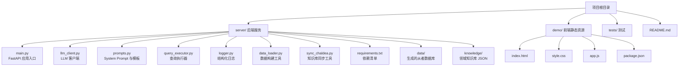
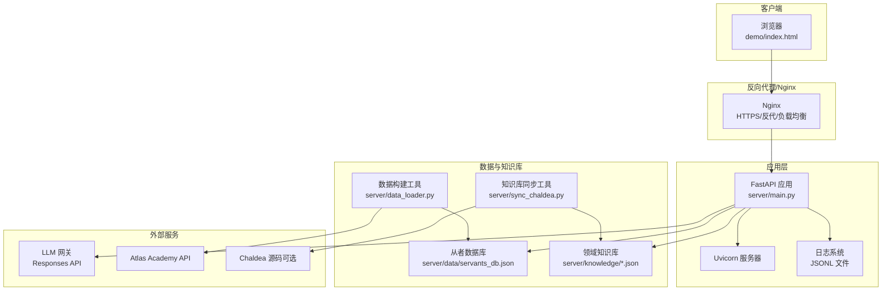
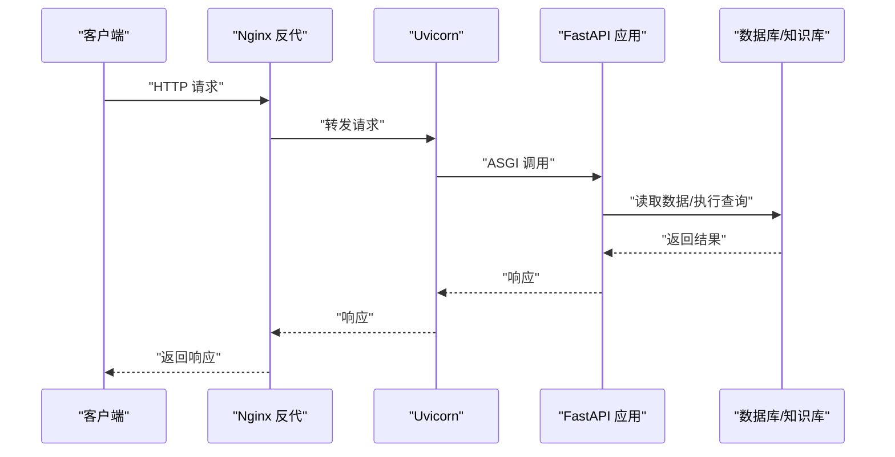
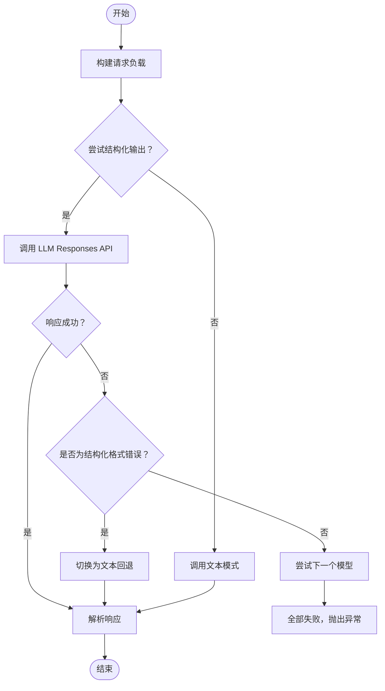
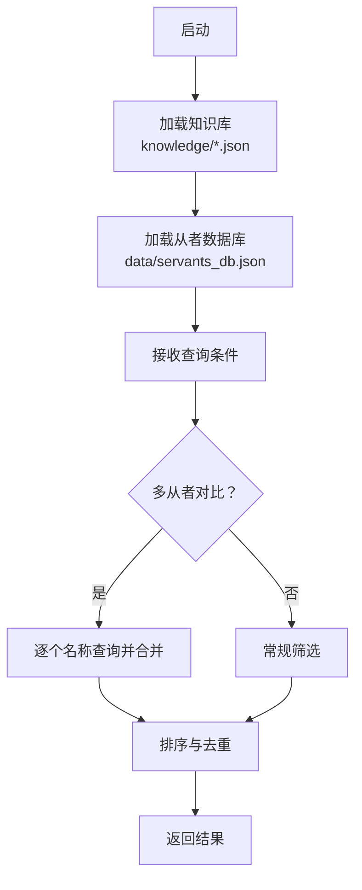
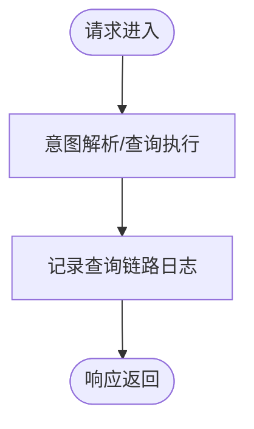
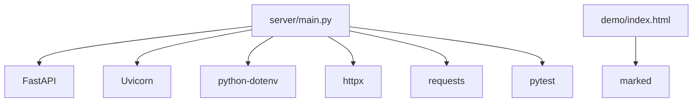

# 部署指南

<cite>
**本文引用的文件**   
- [server/main.py](file://server/main.py)
- [server/requirements.txt](file://server/requirements.txt)
- [server/logger.py](file://server/logger.py)
- [server/prompts.py](file://server/prompts.py)
- [server/llm_client.py](file://server/llm_client.py)
- [server/query_executor.py](file://server/query_executor.py)
- [server/data_loader.py](file://server/data_loader.py)
- [server/sync_chaldea.py](file://server/sync_chaldea.py)
- [README.md](file://README.md)
- [demo/package.json](file://demo/package.json)
</cite>

## 目录
1. [简介](#简介)
2. [项目结构](#项目结构)
3. [核心组件](#核心组件)
4. [架构总览](#架构总览)
5. [详细组件分析](#详细组件分析)
6. [依赖分析](#依赖分析)
7. [性能考虑](#性能考虑)
8. [故障排除指南](#故障排除指南)
9. [结论](#结论)
10. [附录](#附录)

## 简介
本指南面向生产环境部署 Laplace（对话式 FGO 数据助手），涵盖以下要点：
- Python 环境准备与依赖安装
- FastAPI 应用部署与 Uvicorn 启动
- 环境变量与配置文件管理
- 日志系统与监控方案
- Docker 容器化部署流程
- Nginx 反向代理与负载均衡
- SSL 证书与 HTTPS 启用
- 性能优化与资源监控
- 故障排除与运维操作

## 项目结构
Laplace 采用后端（FastAPI + Uvicorn）+ 前端（静态 HTML/CSS/JS）的双层结构，核心服务位于 server 目录，前端资源位于 demo 目录。

图表来源
- [README.md:104-127](file://README.md#L104-L127)
- [server/main.py:114-118](file://server/main.py#L114-L118)
- [server/requirements.txt:1-7](file://server/requirements.txt#L1-7)

章节来源
- [README.md:104-127](file://README.md#L104-L127)
- [server/main.py:114-118](file://server/main.py#L114-L118)
- [server/requirements.txt:1-7](file://server/requirements.txt#L1-7)

## 核心组件
- FastAPI 应用入口与路由：提供 /api/chat、/api/chat/stream、/api/health 等端点，并挂载前端静态资源。
- LLM 客户端：封装 Responses API 调用、结构化输出解析与多模型回退。
- 查询执行器：基于预加载数据库执行多条件筛选，支持效果、NP 充能、职阶、稀有度、特性、性别、阵营、配卡、宝具颜色与目标类型等。
- 日志系统：以 JSONL 格式记录查询链路，便于审计与追踪。
- 知识库与数据管线：从 Chaldea 源码解析领域知识，从 Atlas Academy API 拉取全量从者数据，生成可查询的 JSON 数据库。

章节来源
- [server/main.py:144-365](file://server/main.py#L144-L365)
- [server/llm_client.py:41-254](file://server/llm_client.py#L41-L254)
- [server/query_executor.py:53-343](file://server/query_executor.py#L53-L343)
- [server/logger.py:38-55](file://server/logger.py#L38-L55)
- [server/sync_chaldea.py:308-429](file://server/sync_chaldea.py#L308-L429)
- [server/data_loader.py:332-363](file://server/data_loader.py#L332-L363)

## 架构总览
下图展示了生产部署的关键组件与交互关系，包括应用、LLM 网关、数据存储与前端静态资源。

图表来源
- [server/main.py:144-365](file://server/main.py#L144-L365)
- [server/llm_client.py:135-174](file://server/llm_client.py#L135-L174)
- [server/data_loader.py:91-102](file://server/data_loader.py#L91-L102)
- [server/sync_chaldea.py:313-318](file://server/sync_chaldea.py#L313-L318)
- [server/logger.py:7-11](file://server/logger.py#L7-L11)

## 详细组件分析

### FastAPI 应用与 Uvicorn 部署
- 应用入口：server/main.py 创建 FastAPI 实例，注册中间件（CORS），定义健康检查、聊天接口与 SSE 流式接口，并挂载前端静态资源。
- 启动方式：推荐使用 Uvicorn 作为 ASGI 服务器，支持多进程与高并发。
- 生产建议：
  - 使用进程池与线程池参数控制并发。
  - 配置 keep-alive、超时与缓冲区大小。
  - 通过反向代理暴露服务，统一接入安全与限流策略。

图表来源
- [server/main.py:144-365](file://server/main.py#L144-L365)

章节来源
- [server/main.py:114-118](file://server/main.py#L114-L118)
- [server/main.py:144-365](file://server/main.py#L144-L365)

### LLM 客户端与多模型回退
- LLM 客户端封装 Responses API 调用，支持结构化输出（json_schema）与文本回退解析。
- 环境变量：
  - LLM_BASE_URL：LLM 网关基础地址
  - LLM_API_KEY：访问密钥
  - LLM_MODEL：主模型名称
  - LLM_FALLBACK_MODELS：逗号分隔的备用模型列表
- 错误处理：当结构化输出失败时自动降级为文本解析；若所有模型均失败，抛出异常。

图表来源
- [server/llm_client.py:41-132](file://server/llm_client.py#L41-L132)
- [server/llm_client.py:135-174](file://server/llm_client.py#L135-L174)

章节来源
- [server/llm_client.py:24-35](file://server/llm_client.py#L24-L35)
- [server/llm_client.py:41-132](file://server/llm_client.py#L41-L132)
- [server/llm_client.py:135-174](file://server/llm_client.py#L135-L174)

### 查询执行器与数据加载
- 查询执行器：从预加载数据库中筛选符合条件的从者，支持多条件组合与排序。
- 数据加载器：从 Atlas Academy API 拉取全量从者数据，结合知识库生成通用数据库。
- 知识库同步：从 Chaldea Dart 源码解析枚举与效果分类，生成 JSON 知识库。

图表来源
- [server/query_executor.py:53-116](file://server/query_executor.py#L53-L116)
- [server/data_loader.py:332-363](file://server/data_loader.py#L332-L363)
- [server/sync_chaldea.py:308-429](file://server/sync_chaldea.py#L308-L429)

章节来源
- [server/query_executor.py:41-50](file://server/query_executor.py#L41-L50)
- [server/query_executor.py:53-116](file://server/query_executor.py#L53-L116)
- [server/data_loader.py:91-102](file://server/data_loader.py#L91-L102)
- [server/sync_chaldea.py:313-318](file://server/sync_chaldea.py#L313-L318)

### 日志系统与追踪
- 日志格式：JSONL，包含时间戳、级别与查询链路关键字段（如 traceId、query、intent、results_count、reply、context、error）。
- 日志位置：server/logs/query_trace.jsonl。
- 使用建议：结合日志收集与可视化工具（如 ELK/Fluentd/Promtail + Grafana）实现链路追踪与告警。

图表来源
- [server/logger.py:38-55](file://server/logger.py#L38-L55)

章节来源
- [server/logger.py:7-11](file://server/logger.py#L7-L11)
- [server/logger.py:38-55](file://server/logger.py#L38-L55)

### 前端静态资源
- 前端位于 demo/，包含 HTML、CSS、JS 与依赖声明。
- 生产部署时建议通过反向代理提供静态资源，或打包至应用内。

章节来源
- [demo/package.json:1-6](file://demo/package.json#L1-L6)
- [server/main.py:363-365](file://server/main.py#L363-L365)

## 依赖分析
- 运行时依赖（server/requirements.txt）：FastAPI、Uvicorn、HTTP 客户端、dotenv、requests、pytest。
- 前端依赖（demo/package.json）：marked（Markdown 渲染）。

图表来源
- [server/requirements.txt:1-7](file://server/requirements.txt#L1-L7)
- [demo/package.json:1-6](file://demo/package.json#L1-L6)

章节来源
- [server/requirements.txt:1-7](file://server/requirements.txt#L1-L7)
- [demo/package.json:1-6](file://demo/package.json#L1-L6)

## 性能考虑
- 并发与进程：通过 Uvicorn 的 workers 与 threads 参数平衡吞吐与延迟。
- 超时与缓冲：合理设置 LLM 调用超时与响应缓冲，避免慢请求阻塞。
- 数据预热：应用启动时预加载数据库与知识库，减少首次查询延迟。
- 前端静态资源：通过 CDN 或反代缓存提升页面加载速度。
- 监控指标：采集请求延迟、错误率、LLM 调用耗时与数据库查询耗时，结合告警系统。

## 故障排除指南
- LLM 连接失败或解析失败
  - 检查 LLM_BASE_URL、LLM_API_KEY、LLM_MODEL 与 LLM_FALLBACK_MODELS 是否正确配置。
  - 观察日志中 error 字段与 traceId，定位具体环节（意图解析或生成阶段）。
- 数据库或知识库缺失
  - 确认 knowledge/*.json 与 data/servants_db.json 是否存在。
  - 若缺失，运行知识库同步与数据构建脚本。
- 健康检查
  - 访问 /api/health，确认服务状态为 ok。
- 日志排查
  - 查看 server/logs/query_trace.jsonl，结合 traceId 追踪完整链路。

章节来源
- [server/llm_client.py:24-35](file://server/llm_client.py#L24-L35)
- [server/logger.py:38-55](file://server/logger.py#L38-L55)
- [server/main.py:358-361](file://server/main.py#L358-L361)

## 结论
Laplace 的生产部署以 FastAPI + Uvicorn 为核心，结合 LLM Responses API 与本地知识库/数据库实现高性能、可追踪的对话式查询服务。通过合理的环境变量管理、日志与监控体系、容器化与反向代理配置，可稳定支撑生产流量与运维需求。

## 附录

### A. 生产环境部署步骤
- 准备 Python 环境
  - 使用 Python 3.12+，创建并激活虚拟环境。
- 安装依赖
  - 在 server/ 目录安装运行时依赖。
- 配置环境变量
  - 复制 .env.example 为 .env，填写 LLM_BASE_URL、LLM_API_KEY、LLM_MODEL、LLM_FALLBACK_MODELS。
- 初始化知识库与数据
  - 运行知识库同步脚本生成 knowledge/*.json。
  - 运行数据加载脚本生成 data/servants_db.json。
- 启动服务
  - 使用 Uvicorn 启动 FastAPI 应用，建议开启多进程与线程池。
- 验证
  - 访问 /api/health 与前端页面，确认功能正常。

章节来源
- [README.md:36-80](file://README.md#L36-L80)
- [server/requirements.txt:1-7](file://server/requirements.txt#L1-7)
- [server/sync_chaldea.py:308-429](file://server/sync_chaldea.py#L308-L429)
- [server/data_loader.py:332-363](file://server/data_loader.py#L332-L363)
- [server/main.py:358-361](file://server/main.py#L358-L361)

### B. Docker 容器化部署（流程建议）
- 编写 Dockerfile
  - 基于官方 Python 镜像，创建工作目录，复制依赖与源码，安装依赖，暴露端口，设置启动命令。
- 构建镜像
  - 使用 docker build 命令构建镜像。
- 运行容器
  - 挂载 .env、知识库与数据库目录，映射端口，设置环境变量。
- 注意事项
  - 将 .env、knowledge 与 data 目录持久化，避免重启丢失。
  - 在容器内预热知识库与数据库，缩短冷启动时间。

章节来源
- [server/requirements.txt:1-7](file://server/requirements.txt#L1-7)
- [server/sync_chaldea.py:308-429](file://server/sync_chaldea.py#L308-L429)
- [server/data_loader.py:332-363](file://server/data_loader.py#L332-L363)

### C. Nginx 反向代理与负载均衡
- 反代配置
  - 将 /api/* 转发至 Uvicorn 实例，静态资源指向 demo/。
- 负载均衡
  - 多实例部署时，通过 upstream 配置多台 Uvicorn 实例，实现水平扩展。
- 缓存与压缩
  - 对静态资源启用缓存与 gzip 压缩，提升响应速度。

章节来源
- [server/main.py:363-365](file://server/main.py#L363-L365)

### D. SSL 证书与 HTTPS
- 证书申请与安装
  - 使用 Let’s Encrypt 或商业证书颁发机构获取证书。
- Nginx 配置
  - 在监听 443 端口时启用 SSL，配置证书路径与加密套件。
- 重定向
  - 将 80 端口请求重定向至 443，确保全站 HTTPS。

章节来源
- [server/main.py:114-118](file://server/main.py#L114-L118)

### E. 监控与告警
- 指标采集
  - 请求 QPS、P95/P99 延迟、错误率、LLM 调用耗时、数据库查询耗时。
- 日志采集
  - 采集 JSONL 日志，解析 traceId 与错误信息，建立链路追踪。
- 可视化
  - 使用 Prometheus + Grafana 展示关键指标与告警。

章节来源
- [server/logger.py:38-55](file://server/logger.py#L38-L55)