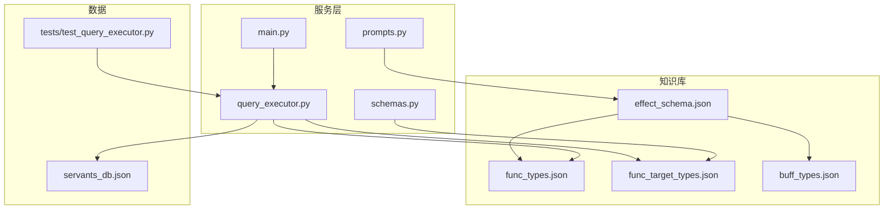
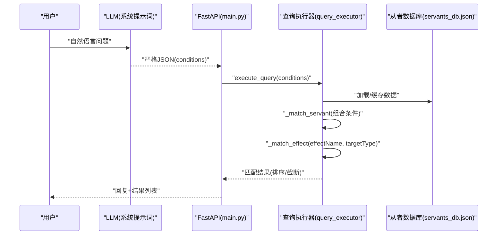
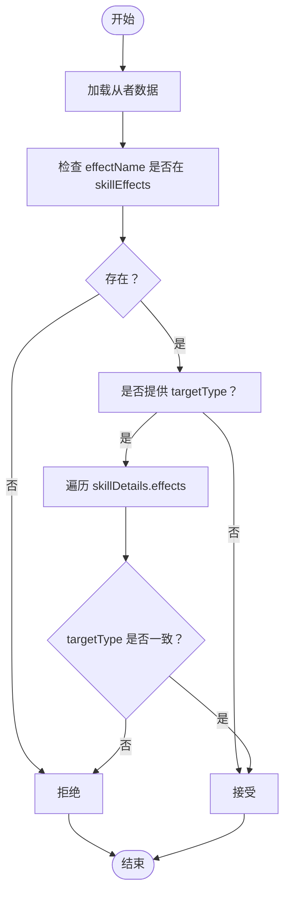
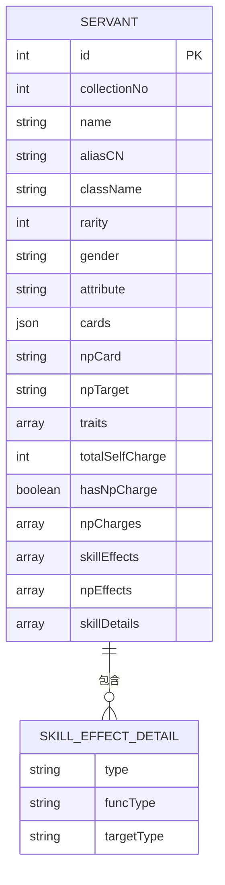
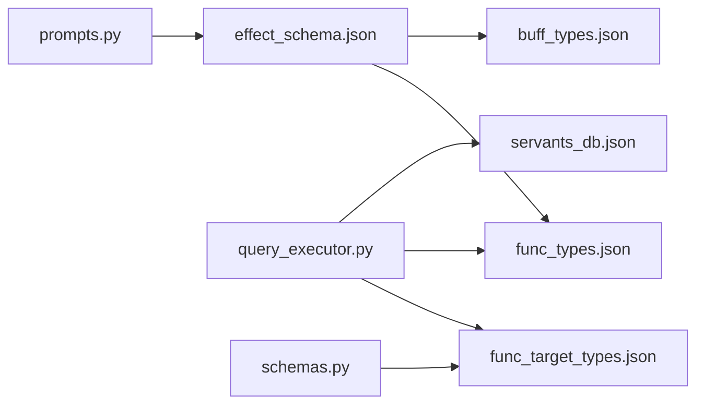

# 函数类型系统

<cite>
**本文引用的文件**
- [server/knowledge/func_types.json](file://server/knowledge/func_types.json)
- [server/knowledge/func_target_types.json](file://server/knowledge/func_target_types.json)
- [server/knowledge/effect_schema.json](file://server/knowledge/effect_schema.json)
- [server/knowledge/buff_types.json](file://server/knowledge/buff_types.json)
- [server/query_executor.py](file://server/query_executor.py)
- [server/schemas.py](file://server/schemas.py)
- [server/main.py](file://server/main.py)
- [server/prompts.py](file://server/prompts.py)
- [tests/test_query_executor.py](file://tests/test_query_executor.py)
- [server/data/servants_db.json](file://server/data/servants_db.json)
</cite>

## 目录
1. [引言](#引言)
2. [项目结构](#项目结构)
3. [核心组件](#核心组件)
4. [架构总览](#架构总览)
5. [详细组件分析](#详细组件分析)
6. [依赖分析](#依赖分析)
7. [性能考虑](#性能考虑)
8. [故障排查指南](#故障排查指南)
9. [结论](#结论)
10. [附录](#附录)

## 引言
本文件系统性梳理 Laplace 项目中的“函数类型系统”，重点围绕两类核心枚举：
- funcTypes：技能/宝具效果的“功能类型”（如造成伤害、回复 HP、充能、即死等）
- func_target_types：效果的“目标类型”（如自身、全体己方、敌方、随机、场地上限等）

文档将解释设计原理、应用场景、类型语义与作用机制，并给出扩展方法、自定义规则、查询匹配策略与可视化图示，帮助开发者与运营人员高效使用与维护。

## 项目结构
与函数类型系统直接相关的知识库与实现文件如下：
- 知识库
  - func_types.json：函数类型枚举定义
  - func_target_types.json：函数目标类型枚举定义
  - effect_schema.json：效果名称、别名与 funcTypes/buffTypes 映射
  - buff_types.json：强化/弱化效果类型（BuffType）枚举
- 实现
  - query_executor.py：查询执行器，负责按条件筛选从者，含效果与目标类型匹配逻辑
  - schemas.py：LLM 意图解析的 Pydantic 模型（包含 targetType 等字段）
  - main.py：服务入口，调用 LLM 与查询执行器
  - prompts.py：系统提示词，注入效果分类与映射规则
  - tests/test_query_executor.py：单元测试，覆盖效果与目标类型匹配
  - server/data/servants_db.json：从者数据样例，包含 skillDetails.effects.funcType/targetType

**图表来源**
- [server/knowledge/func_types.json:1-527](file://server/knowledge/func_types.json#L1-L527)
- [server/knowledge/func_target_types.json:1-147](file://server/knowledge/func_target_types.json#L1-L147)
- [server/knowledge/effect_schema.json:1-694](file://server/knowledge/effect_schema.json#L1-L694)
- [server/knowledge/buff_types.json:1-991](file://server/knowledge/buff_types.json#L1-L991)
- [server/query_executor.py:1-305](file://server/query_executor.py#L1-L305)
- [server/schemas.py:1-81](file://server/schemas.py#L1-L81)
- [server/main.py:1-228](file://server/main.py#L1-L228)
- [server/prompts.py:1-208](file://server/prompts.py#L1-L208)
- [tests/test_query_executor.py:1-172](file://tests/test_query_executor.py#L1-L172)
- [server/data/servants_db.json:1-200](file://server/data/servants_db.json#L1-L200)

**章节来源**
- [server/knowledge/func_types.json:1-527](file://server/knowledge/func_types.json#L1-L527)
- [server/knowledge/func_target_types.json:1-147](file://server/knowledge/func_target_types.json#L1-L147)
- [server/knowledge/effect_schema.json:1-694](file://server/knowledge/effect_schema.json#L1-L694)
- [server/knowledge/buff_types.json:1-991](file://server/knowledge/buff_types.json#L1-L991)
- [server/query_executor.py:1-305](file://server/query_executor.py#L1-L305)
- [server/schemas.py:1-81](file://server/schemas.py#L1-L81)
- [server/main.py:1-228](file://server/main.py#L1-L228)
- [server/prompts.py:1-208](file://server/prompts.py#L1-L208)
- [tests/test_query_executor.py:1-172](file://tests/test_query_executor.py#L1-L172)
- [server/data/servants_db.json:1-200](file://server/data/servants_db.json#L1-L200)

## 核心组件
- 函数类型（funcTypes）
  - 定义：在 func_types.json 中，以枚举形式列出所有功能类型及其数值标识，涵盖战斗、状态、效果、数值、事件等类别。
  - 作用：描述效果的“功能语义”，如造成伤害、回复 HP、充能、即死、减 CD、经验/掉率加成等。
  - 应用：在从者技能/宝具的详细效果中，通过 funcType 字段标注具体功能类型，便于查询与匹配。

- 函数目标类型（func_target_types）
  - 定义：在 func_target_types.json 中，枚举了效果施加的目标与范围，如 self、party、enemy、random、field* 等。
  - 作用：限定效果影响的对象集合与选择方式，如“自身”“全体己方”“敌方随机”“场上全部”等。
  - 应用：配合 skillDetails.effects.targetType 使用，实现“效果+目标”的双条件匹配。

- 效果映射（effect_schema.json）
  - 定义：提供 effectName 与其中文别名、分类（attack/defence/debuff/others），并标注其关联的 funcTypes 与 buffTypes。
  - 作用：将自然语言描述映射到标准 effectName，并指导查询侧如何匹配 funcType/targetType。

- 查询执行器（query_executor）
  - 功能：根据 LLM 解析出的条件，遍历从者数据库，按 NP 充能、稀有度、职阶、名称、效果、特性、卡组、宝具颜色/目标等维度筛选。
  - 关键逻辑：_match_effect 支持按 effectName 与 targetType 双重匹配；_match_servant 组合多条件。

- 模型与提示词
  - schemas.py：定义 QueryConditions，其中包含 targetType 字段，用于约束效果目标类型。
  - prompts.py：构建系统提示词，注入 effect 分类与映射规则，确保 LLM 输出严格 JSON 并正确映射效果名。

**章节来源**
- [server/knowledge/func_types.json:1-527](file://server/knowledge/func_types.json#L1-L527)
- [server/knowledge/func_target_types.json:1-147](file://server/knowledge/func_target_types.json#L1-L147)
- [server/knowledge/effect_schema.json:1-694](file://server/knowledge/effect_schema.json#L1-L694)
- [server/query_executor.py:264-289](file://server/query_executor.py#L264-L289)
- [server/schemas.py:25-44](file://server/schemas.py#L25-L44)
- [server/prompts.py:15-43](file://server/prompts.py#L15-L43)

## 架构总览
下图展示从“用户意图解析”到“效果与目标类型匹配”的端到端流程：

**图表来源**
- [server/main.py:87-218](file://server/main.py#L87-L218)
- [server/prompts.py:167-172](file://server/prompts.py#L167-L172)
- [server/query_executor.py:53-87](file://server/query_executor.py#L53-L87)
- [server/data/servants_db.json:1-200](file://server/data/servants_db.json#L1-L200)

## 详细组件分析

### 函数类型（funcTypes）设计与应用
- 设计原理
  - 以“功能语义”为中心，将效果抽象为统一的功能类型，便于跨技能/宝具复用与匹配。
  - 类别覆盖战斗（damage/damageNp）、状态（addState/subState/releaseState）、效果（gainHp/gainNp/lossNp）、数值（expUp/qpUp/eventDropUp）、环境（field*/battle*/route*）等。
- 应用场景
  - 战斗相关：damage、damageNp、damageNpPierce、damageNpIndividual、damageNpStateIndividual、damageNpRare、damageNpHpratioHigh/Low、damageNpAndOrCheckIndividuality、damageNpBattlePointPhase 等。
  - 状态相关：addState、addStateShort、subState、releaseState、shortenSkill、extendSkill、shortenBuffturn、extendBuffturn、shortenBuffcount、extendBuffcount 等。
  - 效果相关：gainHp、gainNp、gainStar、gainHpFromTargets、gainNpFromTargets、gainNpIndividualSum、gainNpTargetSum、gainNpCriticalstarSum、gainMultiplyNp、lossNp、lossHp、lossHpPer、lossHpPerSafe、instantDeath、forceInstantDeath 等。
  - 其他：expUp、qpUp、dropUp、friendPointUp、eventDropUp/RateUp、eventPointUp/RateUp、buddyPointUp、classDropUp、enemyEncountRate/ProbDown、movePosition、revival、transformServant、addFieldChangeToField、subFieldBuff、setQuestRouteFlag、lastUsePlayerSkillCopy、changeEnemyMasterFace、displayBattleMessage、generateBattleSkillDrop、enableMasterSkill/CommandSpell、battleModelChange、gainNpFromOtherUsedNpValue、hastenNpturnFromOtherUsedNpturn、damageFuncType164/165 等。

- 作用机制
  - 在从者数据的 skillDetails.effects 中，每个效果项包含 type、funcType、targetType 等字段，funcType 描述效果功能，targetType 描述目标范围。
  - 查询时，若仅提供 effectName，则快速路径检查 skillEffects 集合；若提供 targetType，则进一步核对详细 effects 中的 funcType/targetType。

**章节来源**
- [server/knowledge/func_types.json:1-527](file://server/knowledge/func_types.json#L1-L527)
- [server/data/servants_db.json:69-135](file://server/data/servants_db.json#L69-L135)
- [server/query_executor.py:264-289](file://server/query_executor.py#L264-L289)

### 函数目标类型（func_target_types）设计与应用
- 设计原理
  - 以“对象集合与选择策略”为核心，覆盖 self、party、enemy、random、field*、noTarget 等。
  - 支持“随机”“另一目标”“我方/敌方前后位置”“我方/敌方最低 HP”“范围/全场/随机场”等复杂选择。
- 应用场景
  - self：自身生效（如 invincible、gainStar、upBuster）。
  - party/enemy：全体己方/敌方（如 upAtk、upArts、reduceHp）。
  - ptOne/ptAnother/ptAll/ptOther/ptRandom/ptFull/ptselectOneSub/ptselectSub 等：我方侧的单体、另一目标、全体、其他、随机、满员、选择子从者等。
  - enemyOne/.../enemyFull/...：敌方侧对应集合。
  - field*：场地上限、随机场、全场等。
  - noTarget：无目标效果（如某些环境/事件类效果）。

- 作用机制
  - 查询时，若指定 targetType，则在 _match_effect 中检查详细 effects 的 targetType 是否一致。
  - 若未指定 targetType，则仅检查 effectName 是否存在于 skillEffects 集合中。

**章节来源**
- [server/knowledge/func_target_types.json:1-147](file://server/knowledge/func_target_types.json#L1-L147)
- [server/query_executor.py:281-287](file://server/query_executor.py#L281-L287)

### 效果映射与查询匹配策略
- 效果映射（effect_schema.json）
  - 提供 effectName 与中文别名列表，便于 LLM 与用户自然语言交互。
  - 每个 effect 可标注 funcTypes 与 buffTypes，用于交叉验证与扩展。
- 查询匹配策略
  - 单效果匹配：_match_effect 先检查 effectName 是否在 skillEffects 中，再按 targetType 过滤详细 effects。
  - 多效果匹配：支持 AND/OR 组合，OR 时只要满足其一即可，AND 时需全部满足。
  - 目标类型筛选：若未提供 targetType，则不限制目标；若提供，则必须与 effects 中 targetType 一致。

**图表来源**
- [server/query_executor.py:264-289](file://server/query_executor.py#L264-L289)

**章节来源**
- [server/knowledge/effect_schema.json:1-694](file://server/knowledge/effect_schema.json#L1-L694)
- [server/query_executor.py:264-289](file://server/query_executor.py#L264-L289)
- [tests/test_query_executor.py:143-157](file://tests/test_query_executor.py#L143-L157)

### 类型定义与扩展方法
- 扩展步骤
  - 在 func_types.json 中新增 funcType 条目，确保 name 唯一、value 有序增长。
  - 在 effect_schema.json 中为 effectName 增加 funcTypes 映射，或在现有 effect 下追加新的 funcType。
  - 在 func_target_types.json 中新增 targetType 条目，明确目标集合与选择策略。
  - 在查询侧（如 query_executor）无需修改即可支持新类型，因为匹配逻辑基于枚举值而非硬编码分支。
- 自定义规则
  - targetType 与 funcType 的组合应符合游戏语义，避免冲突（如 self 与 enemy 同时出现）。
  - 对于“无目标”效果，使用 noTarget；对于“场地上限/随机场/全场”等，使用 field* 类型。
  - 对于多效果组合，通过 skillEffects 与 skillEffectsOp 控制 AND/OR 逻辑。

**章节来源**
- [server/knowledge/func_types.json:1-527](file://server/knowledge/func_types.json#L1-L527)
- [server/knowledge/func_target_types.json:1-147](file://server/knowledge/func_target_types.json#L1-L147)
- [server/knowledge/effect_schema.json:1-694](file://server/knowledge/effect_schema.json#L1-L694)
- [server/query_executor.py:200-220](file://server/query_executor.py#L200-L220)

### 具体类型示例与数据模型
- 从者数据样例（节选）
  - skillEffects：从者拥有的效果集合（字符串）
  - skillDetails.effects：详细效果列表，包含 type、funcType、targetType
  - npEffects：宝具附带效果集合
- 示例路径
  - [server/data/servants_db.json:59-135](file://server/data/servants_db.json#L59-L135)

**图表来源**
- [server/data/servants_db.json:1-200](file://server/data/servants_db.json#L1-L200)

**章节来源**
- [server/data/servants_db.json:1-200](file://server/data/servants_db.json#L1-L200)

## 依赖分析
- 知识库依赖
  - effect_schema.json 依赖 func_types.json 与 buff_types.json 的枚举值，用于建立 effectName 与功能/强化类型的关系。
- 执行器依赖
  - query_executor 依赖 knowledge 中的枚举定义进行匹配；依赖 servants_db.json 的结构进行遍历与筛选。
- 模型与提示词依赖
  - schemas.py 的 QueryConditions 中的 targetType 字段与 func_target_types.json 对齐。
  - prompts.py 注入 effect 分类与映射，确保 LLM 输出严格 JSON 并正确映射效果名。

**图表来源**
- [server/knowledge/effect_schema.json:1-694](file://server/knowledge/effect_schema.json#L1-L694)
- [server/knowledge/func_types.json:1-527](file://server/knowledge/func_types.json#L1-L527)
- [server/knowledge/buff_types.json:1-991](file://server/knowledge/buff_types.json#L1-L991)
- [server/knowledge/func_target_types.json:1-147](file://server/knowledge/func_target_types.json#L1-L147)
- [server/query_executor.py:1-305](file://server/query_executor.py#L1-L305)
- [server/schemas.py:25-44](file://server/schemas.py#L25-L44)
- [server/prompts.py:15-43](file://server/prompts.py#L15-L43)

**章节来源**
- [server/knowledge/effect_schema.json:1-694](file://server/knowledge/effect_schema.json#L1-L694)
- [server/query_executor.py:1-305](file://server/query_executor.py#L1-L305)
- [server/schemas.py:25-44](file://server/schemas.py#L25-L44)
- [server/prompts.py:15-43](file://server/prompts.py#L15-L43)

## 性能考虑
- 快速路径
  - _match_effect 先检查 effectName 是否在 skillEffects 集合中，避免不必要的详细遍历。
- 缓存与预加载
  - main.py 在启动时预加载数据库，减少首次查询延迟。
- 排序与截断
  - 结果按稀有度降序、collectionNo 升序排序，并限制返回数量，避免响应过大。
- 建议
  - 对高频查询（如 effectName/targetType 组合）可考虑在查询执行器内增加二级缓存。
  - 对大规模数据，可在数据库层引入索引（如 effectName、targetType、funcType）以加速匹配。

**章节来源**
- [server/query_executor.py:53-87](file://server/query_executor.py#L53-L87)
- [server/main.py:81-84](file://server/main.py#L81-L84)

## 故障排查指南
- 常见问题
  - 效果名不匹配：确认 effectName 与 effect_schema.json 中的别名一致，或检查是否遗漏 funcTypes 映射。
  - 目标类型不生效：确认查询条件中提供了 targetType，且从者数据的 effects 中 targetType 与之匹配。
  - 多效果组合错误：检查 skillEffectsOp 设置为 "and"/"or"，并确保数组非空。
- 测试参考
  - 单效果与目标类型匹配：[tests/test_query_executor.py:143-148](file://tests/test_query_executor.py#L143-L148)
  - 多效果 OR/AND 匹配：[tests/test_query_executor.py:150-157](file://tests/test_query_executor.py#L150-L157)
- 日志与追踪
  - main.py 中记录 traceId 与链路日志，便于定位 LLM 解析与生成阶段的问题。

**章节来源**
- [tests/test_query_executor.py:143-157](file://tests/test_query_executor.py#L143-L157)
- [server/main.py:91-111](file://server/main.py#L91-L111)
- [server/main.py:197-205](file://server/main.py#L197-L205)

## 结论
函数类型系统通过 funcTypes 与 func_target_types 的清晰分离，实现了对 FGO 技能/宝具效果的结构化表达与高效匹配。配合 effect_schema.json 的映射与 query_executor 的查询逻辑，系统能够稳定支持战斗、状态、效果等多维筛选，并具备良好的扩展性与可维护性。建议在新增类型时严格遵循扩展流程与自定义规则，确保类型语义一致与查询性能。

## 附录
- 关键字段说明
  - effectName：效果名称（如 gainNp、invincible、avoidance）
  - funcType：功能类型（如 gainNp、damageNp、addState）
  - targetType：目标类型（如 self、party、enemy、ptRandom、fieldAll）
  - skillEffects：从者拥有的效果集合
  - skillDetails.effects：详细效果列表，包含 type、funcType、targetType
- 示例路径
  - [server/data/servants_db.json:59-135](file://server/data/servants_db.json#L59-L135)
  - [server/knowledge/func_types.json:1-527](file://server/knowledge/func_types.json#L1-L527)
  - [server/knowledge/func_target_types.json:1-147](file://server/knowledge/func_target_types.json#L1-L147)
  - [server/knowledge/effect_schema.json:1-694](file://server/knowledge/effect_schema.json#L1-L694)