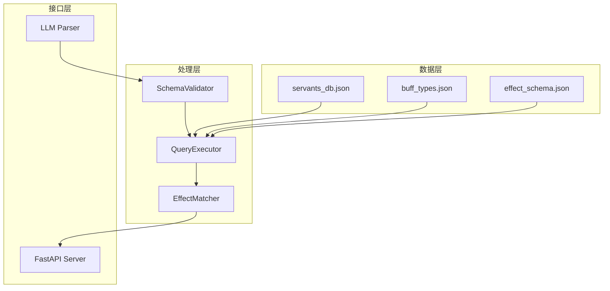
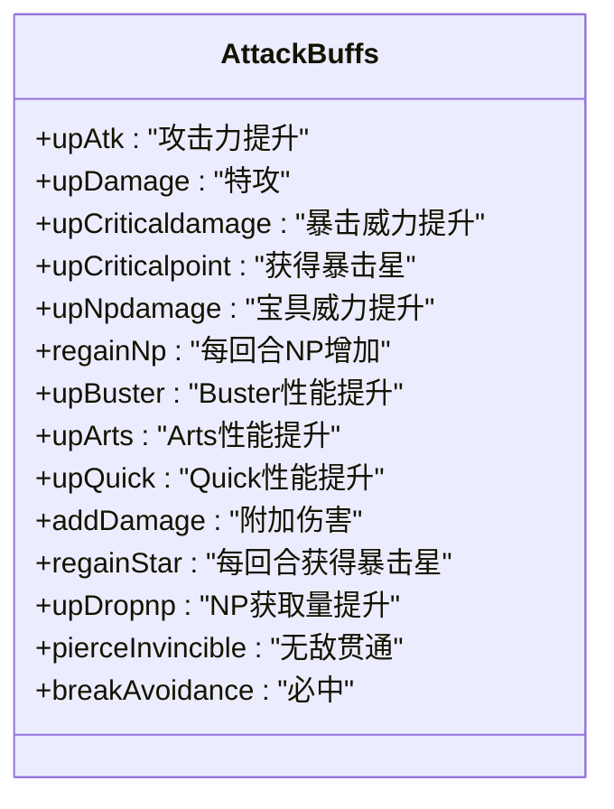
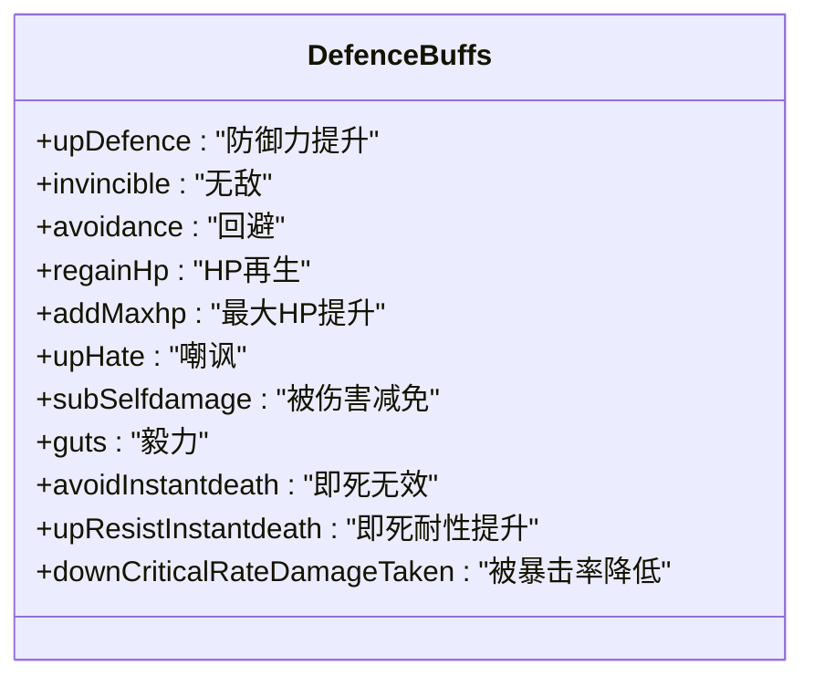
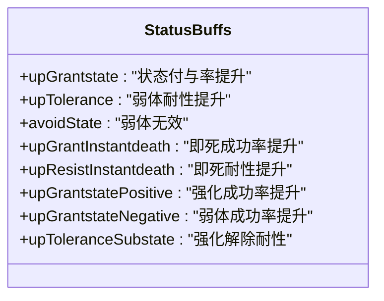
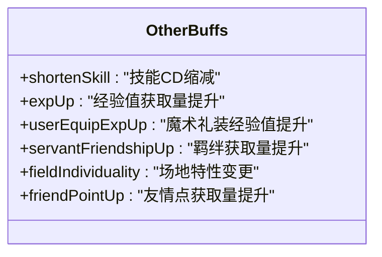
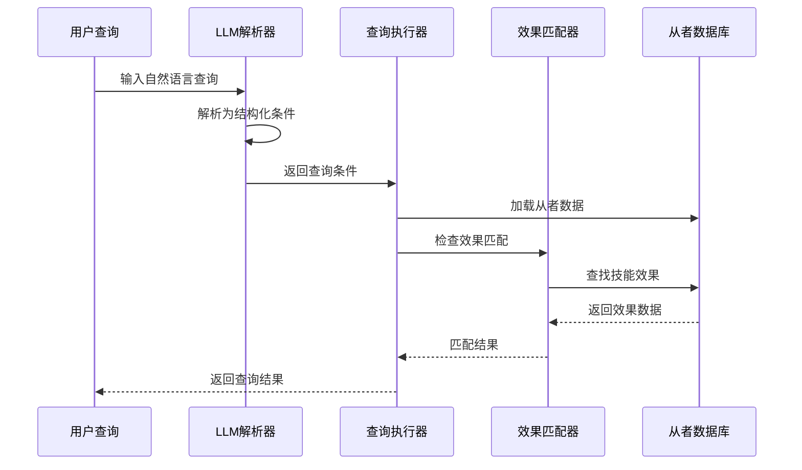
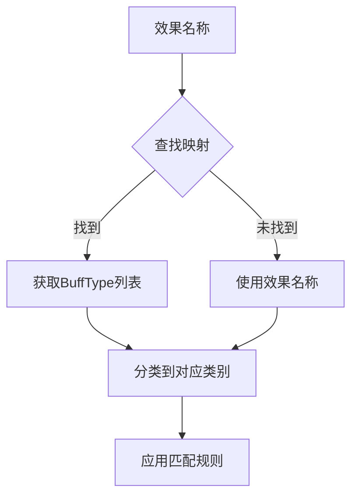

# 增益类型系统

<cite>
**本文档引用的文件**
- [buff_types.json](file://server/knowledge/buff_types.json)
- [effect_schema.json](file://server/knowledge/effect_schema.json)
- [func_types.json](file://server/knowledge/func_types.json)
- [func_target_types.json](file://server/knowledge/func_target_types.json)
- [schemas.py](file://server/schemas.py)
- [query_executor.py](file://server/query_executor.py)
- [main.py](file://server/main.py)
- [servants_db.json](file://server/data/servants_db.json)
</cite>

## 目录
1. [简介](#简介)
2. [系统架构概览](#系统架构概览)
3. [核心概念](#核心概念)
4. [增益类型分类体系](#增益类型分类体系)
5. [效果匹配机制](#效果匹配机制)
6. [详细类型分析](#详细类型分析)
7. [扩展与维护策略](#扩展与维护策略)
8. [使用示例](#使用示例)
9. [性能考虑](#性能考虑)
10. [故障排除指南](#故障排除指南)
11. [结论](#结论)

## 简介

Laplace增益类型系统是基于Fate/Grand Order（FGO）游戏机制设计的一套完整的从者效果分类和匹配系统。该系统通过标准化的效果枚举值、分类映射和匹配算法，为AI驱动的从者查询提供了精确的语义理解能力。

系统的核心价值在于：
- **标准化效果标识**：统一的buffTypes枚举确保不同来源的数据能够一致识别
- **智能效果匹配**：支持按效果名称、目标类型、功能类型等多种维度进行精确匹配
- **可扩展架构**：模块化的设计允许轻松添加新的效果类型和分类规则
- **多语言支持**：内置效果名称的中文翻译映射

## 系统架构概览

**图表来源**
- [query_executor.py:53-87](file://server/query_executor.py#L53-L87)
- [schemas.py:25-44](file://server/schemas.py#L25-L44)

## 核心概念

### BuffType枚举系统

系统采用统一的BuffType枚举来标识所有可能的增益效果。每个效果都有唯一的数值标识符，确保在不同平台间的一致性。

### 效果分类体系

效果按照功能特性分为四大类别：
- **攻击类**：提升攻击力、宝具威力、暴击率等
- **防御类**：提升防御力、无敌、回避等
- **状态类**：状态赋予、解除、耐性等
- **其他类**：特殊功能、经验获取等

### 功能类型映射

每个效果都关联到具体的功能实现类型，这些类型描述了效果的实际行为机制。

## 增益类型分类体系

### 攻击增益类型

攻击增益类型主要提升从者的输出能力，包括但不限于：

**图表来源**
- [buff_types.json:51-81](file://server/knowledge/buff_types.json#L51-L81)
- [effect_schema.json:11-121](file://server/knowledge/effect_schema.json#L11-L121)

### 防御增益类型

防御增益类型专注于提升从者的生存能力：

**图表来源**
- [buff_types.json:187-229](file://server/knowledge/buff_types.json#L187-L229)
- [effect_schema.json:145-224](file://server/knowledge/effect_schema.json#L145-L224)

### 状态增益类型

状态增益类型涉及从者与敌人的交互效果：

**图表来源**
- [buff_types.json:231-289](file://server/knowledge/buff_types.json#L231-L289)
- [effect_schema.json:237-301](file://server/knowledge/effect_schema.json#L237-L301)

### 其他增益类型

其他增益类型涵盖特殊功能和辅助效果：

**图表来源**
- [effect_schema.json:362-424](file://server/knowledge/effect_schema.json#L362-L424)

## 效果匹配机制

### 基础匹配流程

系统采用两阶段匹配机制来确保精确的效果识别：

**图表来源**
- [query_executor.py:90-261](file://server/query_executor.py#L90-L261)

### 效果匹配算法

效果匹配算法支持多种匹配模式：

#### 单效果匹配
当查询指定单一效果时，系统会：
1. 检查从者的`skillEffects`集合
2. 如果需要按目标类型筛选，进一步检查`skillDetails`
3. 精确匹配效果名称和目标类型

#### 多效果组合匹配
支持"AND"和"OR"两种组合逻辑：
- **AND组合**：必须同时满足所有指定效果
- **OR组合**：满足任一指定效果即可

#### 目标类型筛选
效果可以按目标类型进一步细分：
- `self`：自身
- `party`：己方全体
- `enemy`：敌方全体

**章节来源**
- [query_executor.py:264-289](file://server/query_executor.py#L264-L289)

### 效果分类映射

系统通过effect_schema.json建立效果与BuffType的映射关系：

**图表来源**
- [effect_schema.json:10-694](file://server/knowledge/effect_schema.json#L10-L694)

## 详细类型分析

### 攻击增益类型详解

#### 基础攻击提升
- `upAtk`：攻击力提升，适用于所有战斗场景
- `upDamage`：特攻，针对特定个体性效果
- `upCriticaldamage`：暴击威力提升，显著影响输出波动

#### 卡牌性能提升
- `upBuster`：Buster性能提升，配合红卡攻击
- `upArts`：Arts性能提升，配合蓝卡攻击  
- `upQuick`：Quick性能提升，配合绿卡攻击

#### 宝具相关增益
- `upNpdamage`：宝具威力提升，增强宝具伤害
- `regainNp`：每回合NP增加，改善资源循环
- `upDropnp`：NP获取量提升，提高NP效率

**章节来源**
- [buff_types.json:51-81](file://server/knowledge/buff_types.json#L51-L81)
- [effect_schema.json:426-481](file://server/knowledge/effect_schema.json#L426-L481)

### 防御增益类型详解

#### 基础防御提升
- `upDefence`：防御力提升，直接降低受到伤害
- `addMaxhp`：最大HP提升，增加生存上限
- `regainHp`：HP再生，持续恢复生命值

#### 无敌与回避
- `invincible`：无敌，免疫所有伤害
- `avoidance`：回避，避免受到攻击
- `avoidInstantdeath`：即死无效，抵抗即死效果

#### 毅力系统
- `guts`：毅力，低HP时的生存能力
- `gutsRatio`：毅力比例，按百分比触发

**章节来源**
- [buff_types.json:187-229](file://server/knowledge/buff_types.json#L187-L229)
- [effect_schema.json:145-224](file://server/knowledge/effect_schema.json#L145-L224)

### 状态增益类型详解

#### 状态赋予
- `upGrantstate`：状态付与率提升，增加成功施加状态的概率
- `upGrantstatePositive`：强化成功率提升
- `upGrantstateNegative`：弱体成功率提升

#### 状态耐性
- `upTolerance`：弱体耐性提升，减少被施加负面状态的概率
- `upToleranceSubstate`：强化解除耐性，提高解除强化效果的能力

#### 即死抗性
- `upResistInstantdeath`：即死耐性提升
- `upGrantInstantdeath`：即死成功率提升
- `avoidInstantdeath`：即死无效

**章节来源**
- [buff_types.json:231-289](file://server/knowledge/buff_types.json#L231-L289)
- [effect_schema.json:237-301](file://server/knowledge/effect_schema.json#L237-L301)

## 扩展与维护策略

### 类型扩展方法

#### 添加新效果类型
1. 在`buff_types.json`中添加新的效果定义
2. 更新`effect_schema.json`中的映射关系
3. 在`func_types.json`中添加对应的函数类型
4. 更新`func_target_types.json`中的目标类型

#### 维护最佳实践
- **版本控制**：每次修改都要记录变更历史
- **兼容性检查**：确保新类型不影响现有功能
- **测试覆盖**：为新类型编写单元测试
- **文档同步**：及时更新相关文档

### 数据一致性保证

系统通过以下机制确保数据一致性：

**图表来源**
- [buff_types.json:1-991](file://server/knowledge/buff_types.json#L1-L991)

### 性能优化策略

#### 缓存机制
- 预加载效果映射表到内存
- 缓存常用的匹配结果
- 使用索引加速效果查找

#### 查询优化
- 优先检查技能效果集合
- 按需加载详细技能数据
- 实现效果名称的快速查找

**章节来源**
- [query_executor.py:17-50](file://server/query_executor.py#L17-L50)

## 使用示例

### 基本效果查询

查询具有特定效果的从者：
- "寻找有攻击力提升的从者"
- "需要宝具威力提升的从者"
- "要求无敌状态的从者"

### 复合效果查询

查询具有多重效果的从者：
- "同时需要攻击力提升和宝具威力提升"
- "寻找既可提升防御又可回避的从者"

### 目标类型限定查询

指定效果的目标类型：
- "需要对己方全体生效的攻击力提升"
- "寻找对敌方单体造成伤害的从者"

## 性能考虑

### 内存使用优化

系统采用懒加载策略：
- 仅在需要时加载数据库文件
- 缓存效果映射表减少重复解析
- 使用生成器模式处理大量数据

### 查询性能优化

- 实现效果名称的哈希索引
- 优化多效果组合的匹配算法
- 减少不必要的字符串比较操作

## 故障排除指南

### 常见问题及解决方案

#### 效果名称不匹配
**问题**：查询结果为空或不准确
**解决**：检查效果名称的拼写和大小写，确认是否在effect_schema.json中有正确映射

#### 目标类型错误
**问题**：效果匹配结果不符合预期
**解决**：确认查询中指定的目标类型是否正确，检查skillDetails中的targetType字段

#### 性能问题
**问题**：查询响应时间过长
**解决**：检查数据库文件是否完整，确认缓存机制正常工作

### 调试工具

系统提供了以下调试功能：
- 详细的日志记录
- 查询条件验证
- 结果统计和分析

**章节来源**
- [main.py:94-111](file://server/main.py#L94-L111)

## 结论

Laplace增益类型系统通过标准化的效果枚举、智能的匹配算法和灵活的扩展机制，为FGO从者查询提供了强大而精确的技术基础。系统的设计充分考虑了实用性、可维护性和扩展性，能够适应不断变化的游戏内容和用户需求。

未来的发展方向包括：
- 进一步优化匹配算法的准确性
- 增强多语言支持能力
- 扩展更多效果类型的分类和映射
- 提升系统的整体性能和稳定性

该系统不仅为当前的应用提供了坚实的技术支撑，也为未来的功能扩展奠定了良好的基础。