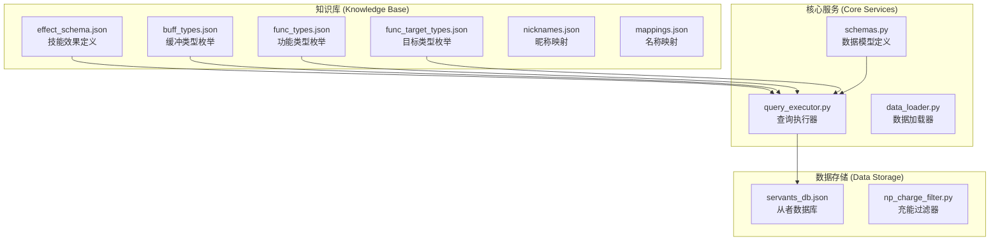
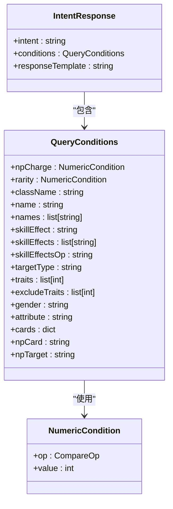
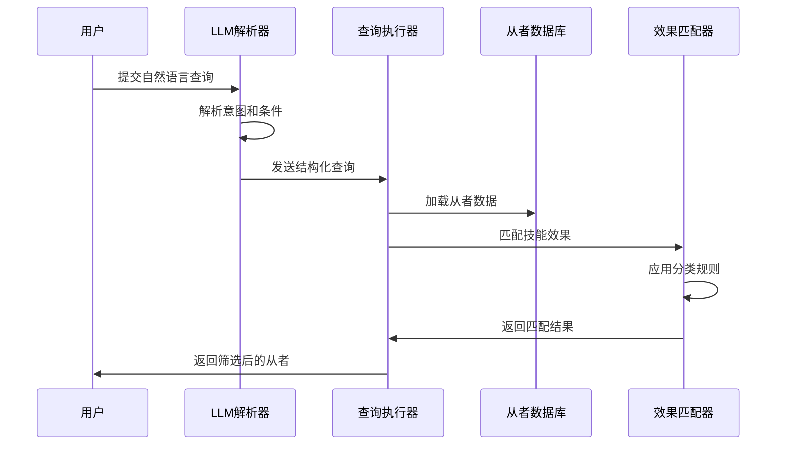
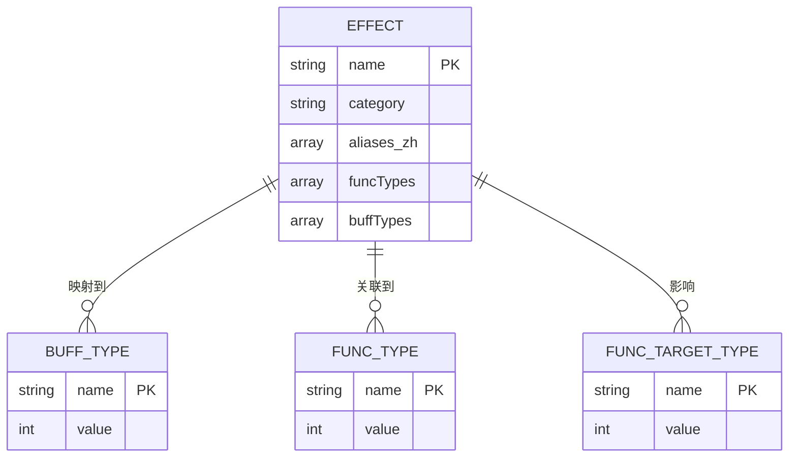
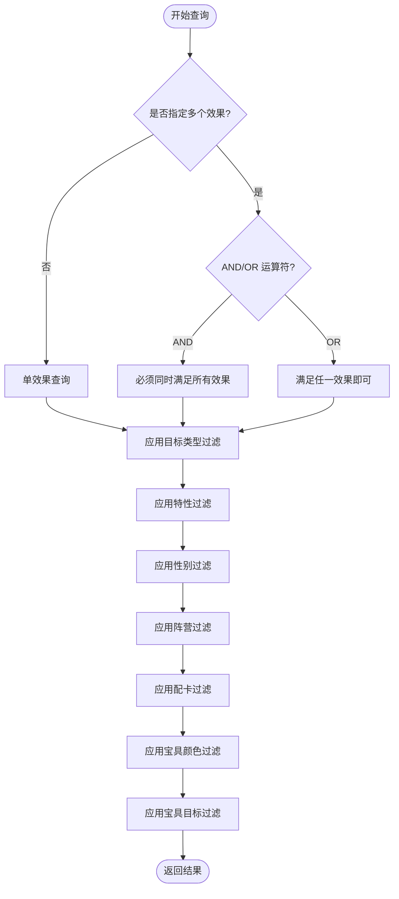
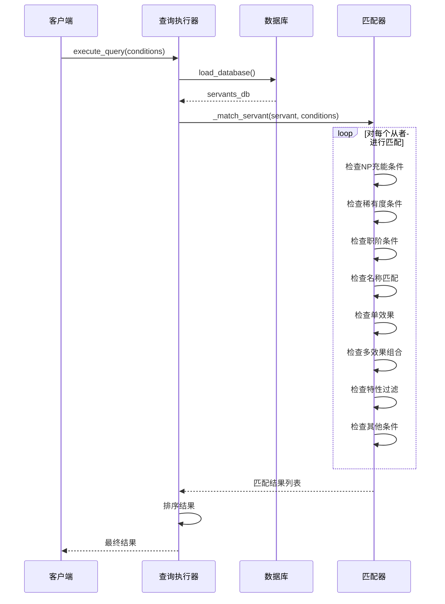
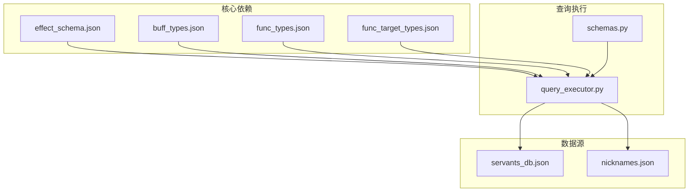

# 技能效果分类体系

<cite>
**本文档引用的文件**
- [effect_schema.json](file://server/knowledge/effect_schema.json)
- [buff_types.json](file://server/knowledge/buff_types.json)
- [func_types.json](file://server/knowledge/func_types.json)
- [func_target_types.json](file://server/knowledge/func_target_types.json)
- [schemas.py](file://server/schemas.py)
- [query_executor.py](file://server/query_executor.py)
- [servants_db.json](file://server/data/servants_db.json)
- [servants_np_charge.json](file://demo/data/servants_np_charge.json)
- [nicknames.json](file://server/knowledge/nicknames.json)
</cite>

## 目录
1. [引言](#引言)
2. [项目结构](#项目结构)
3. [核心组件](#核心组件)
4. [架构概览](#架构概览)
5. [详细组件分析](#详细组件分析)
6. [依赖关系分析](#依赖关系分析)
7. [性能考虑](#性能考虑)
8. [故障排除指南](#故障排除指南)
9. [结论](#结论)

## 引言

Laplace项目的技能效果分类体系是构建从者筛选和配卡推荐系统的核心基础。该体系通过标准化的技能效果定义、分类规则和匹配算法，为用户提供了精确的从者查询和推荐能力。

本体系定义了55种技能效果，按照攻击类、防御类、负面效果类和其他类别进行科学分类，每种效果都有明确的功能类型对应关系和中文别名映射。这种设计不仅支持复杂的技能组合查询，还能为从者筛选和配卡推荐提供强大的数据支撑。

## 项目结构

Laplace项目采用模块化架构，技能效果分类体系主要分布在以下关键目录中：

**图表来源**
- [effect_schema.json:1-694](file://server/knowledge/effect_schema.json#L1-L694)
- [schemas.py:1-92](file://server/schemas.py#L1-L92)
- [query_executor.py:1-343](file://server/query_executor.py#L1-L343)

**章节来源**
- [effect_schema.json:1-694](file://server/knowledge/effect_schema.json#L1-L694)
- [schemas.py:1-92](file://server/schemas.py#L1-L92)

## 核心组件

### 技能效果分类体系

技能效果分类体系基于55种标准化的效果定义，按照四大类别进行组织：

#### 攻击类效果 (18种)
攻击类效果直接增强从者的输出能力，包括伤害提升、NP获取、暴击效果等。

#### 防御类效果 (12种)
防御类效果保护从者免受伤害或提供生存能力，包括减伤、无敌、回避等。

#### 负面效果类 (14种)
负面效果类影响敌方或战场环境，包括状态赋予、即死、耐性降低等。

#### 其他类效果 (11种)
其他类效果涵盖特殊功能，如经验获取、道具获取、场地变更等。

### 数据模型定义

系统使用Pydantic模型定义查询条件和响应格式：

**图表来源**
- [schemas.py:16-86](file://server/schemas.py#L16-L86)

**章节来源**
- [schemas.py:16-86](file://server/schemas.py#L16-L86)

## 架构概览

技能效果分类体系的运行架构采用分层设计，确保查询效率和准确性：

**图表来源**
- [query_executor.py:53-116](file://server/query_executor.py#L53-L116)
- [schemas.py:79-86](file://server/schemas.py#L79-L86)

## 详细组件分析

### 技能效果分类标准

技能效果的分类基于其功能特性和对战斗的影响程度：

#### 攻击类效果 (Attack Effects)
- **定义**: 直接增强从者输出能力的效果
- **特征**: 提升伤害、NP获取、暴击概率等
- **典型效果**: `addDamage`, `upCriticaldamage`, `upNpdamage`, `gainNp`

#### 防御类效果 (Defense Effects)
- **定义**: 保护从者免受伤害或提供生存能力的效果
- **特征**: 减少受到的伤害、提供无敌状态、提高回避率等
- **典型效果**: `subSelfdamage`, `invincible`, `avoidance`, `upDefence`

#### 负面效果类 (Debuff Effects)
- **定义**: 对敌方或战场环境产生不利影响的效果
- **特征**: 降低敌方能力、施加负面状态、改变战斗条件等
- **典型效果**: `reduceHp`, `upGrantstate`, `instantDeath`, `upToleranceSubstate`

#### 其他类效果 (Other Effects)
- **定义**: 特殊功能效果，不直接参与战斗
- **特征**: 获取经验值、道具、改变场地等
- **典型效果**: `expUp`, `servantFriendshipUp`, `fieldIndividuality`, `triggerFunc`

### 技能效果数据结构

每个技能效果包含以下关键信息：

**图表来源**
- [effect_schema.json:10-694](file://server/knowledge/effect_schema.json#L10-L694)
- [buff_types.json:1-991](file://server/knowledge/buff_types.json#L1-L991)
- [func_types.json:1-527](file://server/knowledge/func_types.json#L1-L527)

### 中文别名映射系统

系统支持多种中文表达方式，通过别名映射实现灵活查询：

| 英文效果名 | 中文别名 | 用途场景 |
|------------|----------|----------|
| `addDamage` | 附加伤害 | 提升基础伤害输出 |
| `upCriticaldamage` | 暴击威力提升, 暴击伤害, 爆伤 | 增强暴击效果 |
| `upCriticalpoint` | 获得暴击星, 产星, 出星 | 提高暴击星获取 |
| `regainStar` | 每回合获得暴击星, 出星状态 | 持续获得暴击星 |
| `upNpdamage` | 宝具威力提升, 宝威, 宝伤 | 增强宝具伤害 |

### 技能效果组合规则

系统支持多效果组合查询，采用灵活的逻辑运算：

**图表来源**
- [query_executor.py:238-258](file://server/query_executor.py#L238-L258)

**章节来源**
- [query_executor.py:238-258](file://server/query_executor.py#L238-L258)

### 匹配算法和优先级处理

技能效果匹配采用多阶段算法，确保查询的准确性和效率：

1. **快速路径**: 首先检查技能效果集合，避免不必要的详细匹配
2. **目标类型过滤**: 根据指定的目标类型进行精确匹配
3. **功能类型验证**: 验证效果的功能类型是否符合预期
4. **优先级排序**: 按稀有度降序、收藏编号升序排列结果

### 查询执行流程

**图表来源**
- [query_executor.py:53-116](file://server/query_executor.py#L53-L116)

**章节来源**
- [query_executor.py:53-116](file://server/query_executor.py#L53-L116)

## 依赖关系分析

技能效果分类体系的依赖关系体现了清晰的模块化设计：

**图表来源**
- [effect_schema.json:1-694](file://server/knowledge/effect_schema.json#L1-L694)
- [query_executor.py:1-343](file://server/query_executor.py#L1-L343)

### 关键依赖关系

1. **effect_schema.json** 为整个系统提供技能效果的权威定义
2. **buff_types.json** 和 **func_types.json** 提供功能类型的枚举值
3. **schemas.py** 定义了查询条件的数据结构
4. **query_executor.py** 实现了查询逻辑和匹配算法

**章节来源**
- [query_executor.py:1-343](file://server/query_executor.py#L1-L343)

## 性能考虑

技能效果分类体系在设计时充分考虑了性能优化：

### 缓存策略
- 从者数据库采用全局缓存机制，避免重复加载
- 昵称映射同样使用缓存，提高查询效率

### 匹配优化
- 使用快速路径算法，先检查技能效果集合
- 支持多效果的短路求值，提高AND查询效率
- 采用分级匹配策略，优先精确匹配

### 内存管理
- 按需加载数据，避免内存占用过高
- 结果去重和排序在内存中完成，保证查询速度

## 故障排除指南

### 常见问题及解决方案

#### 技能效果未匹配
**问题**: 查询结果中缺少预期的从者
**原因**: 效果名称拼写错误或使用了非标准别名
**解决**: 检查效果名称是否在别名映射中，或使用标准英文名称

#### 多效果查询失败
**问题**: 多效果AND查询返回空结果
**原因**: 从者不满足所有指定效果
**解决**: 检查效果组合的合理性，考虑使用OR运算符

#### 性能问题
**问题**: 查询响应时间过长
**原因**: 数据库过大或查询条件过于复杂
**解决**: 优化查询条件，使用更精确的过滤器

**章节来源**
- [query_executor.py:22-50](file://server/query_executor.py#L22-L50)

## 结论

Laplace项目的技能效果分类体系通过标准化的55种效果定义、科学的分类方法和高效的匹配算法，为从者筛选和配卡推荐提供了坚实的技术基础。

该体系的主要优势包括：
- **完整性**: 覆盖了游戏中的主要技能效果类型
- **灵活性**: 支持复杂的多效果组合查询
- **可扩展性**: 模块化设计便于添加新的效果类型
- **高效性**: 优化的匹配算法确保查询性能

通过这个分类体系，用户可以精确地找到符合特定需求的从者，为游戏策略制定提供有力支持。系统的持续演进将为更多游戏内容提供智能化的筛选和推荐能力。