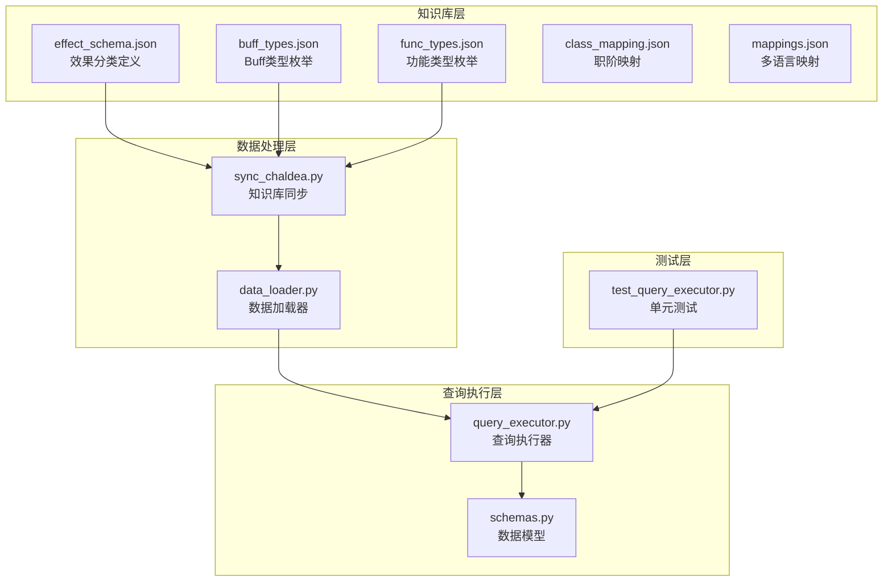
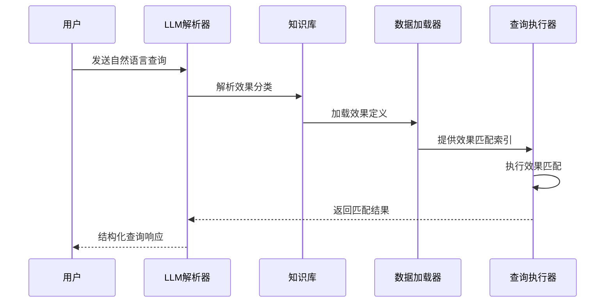
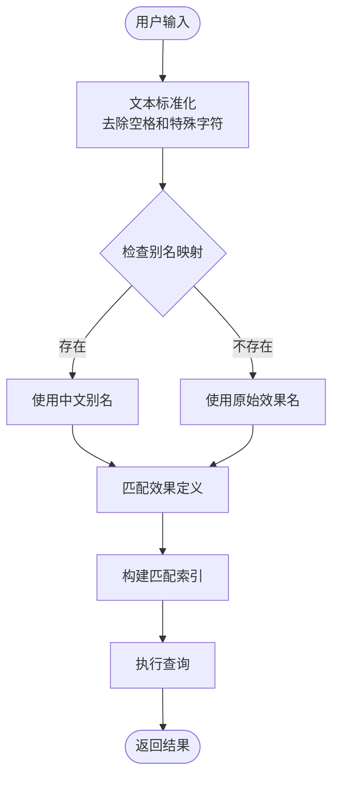
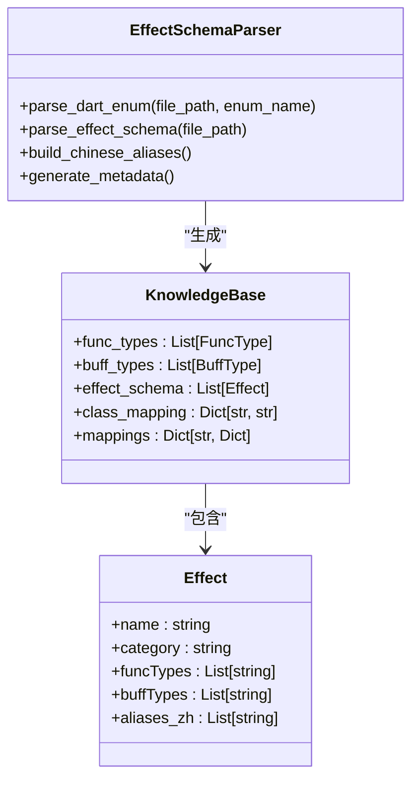
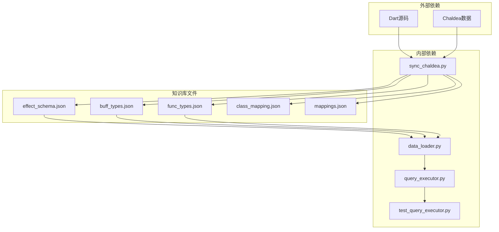

# 效果分类体系

<cite>
**本文档引用的文件**
- [effect_schema.json](file://server/knowledge/effect_schema.json)
- [buff_types.json](file://server/knowledge/buff_types.json)
- [func_types.json](file://server/knowledge/func_types.json)
- [sync_chaldea.py](file://server/sync_chaldea.py)
- [data_loader.py](file://server/data_loader.py)
- [query_executor.py](file://server/query_executor.py)
- [schemas.py](file://server/schemas.py)
- [test_query_executor.py](file://tests/test_query_executor.py)
</cite>

## 目录
1. [简介](#简介)
2. [项目结构](#项目结构)
3. [核心组件](#核心组件)
4. [架构概览](#架构概览)
5. [详细组件分析](#详细组件分析)
6. [依赖关系分析](#依赖关系分析)
7. [性能考虑](#性能考虑)
8. [故障排除指南](#故障排除指南)
9. [结论](#结论)

## 简介

Laplace项目的效果分类体系是一个基于游戏《Fate/Grand Order》（FGO）技能效果的知识库系统。该系统通过标准化的效果分类、属性定义和别名系统，为从者查询和技能分析提供了统一的数据模型和查询接口。

效果分类体系的核心目标是：
- 提供统一的效果分类标准（attack、defence、debuff、others）
- 支持多语言查询（中文别名系统）
- 实现灵活的效果匹配和组合查询
- 为自然语言处理提供结构化数据支持

## 项目结构

Laplace项目采用模块化的架构设计，效果分类体系主要分布在以下目录结构中：



**图表来源**
- [effect_schema.json:1-694](file://server/knowledge/effect_schema.json#L1-L694)
- [sync_chaldea.py:1-429](file://server/sync_chaldea.py#L1-L429)
- [data_loader.py:1-363](file://server/data_loader.py#L1-L363)
- [query_executor.py:1-305](file://server/query_executor.py#L1-L305)

**章节来源**
- [effect_schema.json:1-694](file://server/knowledge/effect_schema.json#L1-L694)
- [sync_chaldea.py:1-429](file://server/sync_chaldea.py#L1-L429)

## 核心组件

### 效果分类定义

效果分类体系基于四个主要类别构建：

| 分类类别 | 描述 | 示例效果 |
|---------|------|----------|
| attack | 攻击类效果 | `upAtk`、`upCriticaldamage`、`gainNp`、`upDamage` |
| defence | 防御类效果 | `invincible`、`avoidance`、`subSelfdamage`、`regainHp` |
| debuff | 弱化类效果 | `instantDeath`、`upGrantstate`、`upToleranceSubstate`、`reduceHp` |
| others | 其他效果 | `shortenSkill`、`expUp`、`fieldIndividuality`、`triggerFunc` |

### 效果属性定义

每个效果都具有以下标准化属性：

```mermaid
erDiagram
EFFECT {
string name PK
string category
array funcTypes
array buffTypes
array aliases_zh
}
FUNC_TYPE {
string name
int value
}
BUFF_TYPE {
string name
int value
}
EFFECT }o|--|| FUNC_TYPE : "uses"
EFFECT }o|--|| BUFF_TYPE : "uses"
```

**图表来源**
- [effect_schema.json:10-694](file://server/knowledge/effect_schema.json#L10-L694)

**章节来源**
- [effect_schema.json:10-694](file://server/knowledge/effect_schema.json#L10-L694)

## 架构概览

效果分类体系采用分层架构设计，确保了系统的可扩展性和维护性：



**图表来源**
- [sync_chaldea.py:355-363](file://server/sync_chaldea.py#L355-L363)
- [data_loader.py:64-84](file://server/data_loader.py#L64-L84)
- [query_executor.py:53-87](file://server/query_executor.py#L53-L87)

## 详细组件分析

### 效果分类标准

效果分类标准基于游戏机制和效果功能进行设计：

#### 攻击类效果（attack）
攻击类效果直接增强从者的战斗能力：
- **攻击力提升**：`upAtk`、`upArts`、`upQuick`、`upBuster`
- **暴击效果**：`upCriticaldamage`、`upCriticalpoint`、`upStarweight`
- **NP相关**：`gainNp`、`regainNp`、`upNpdamage`、`upDropnp`
- **伤害增强**：`addDamage`、`upDamage`、`damageNpSP`

#### 防御类效果（defence）
防御类效果保护从者免受伤害：
- **生存能力**：`invincible`、`avoidance`、`guts`
- **伤害减免**：`subSelfdamage`、`regainHp`、`addMaxhp`
- **嘲讽控制**：`upHate`、`downCriticalRateDamageTaken`

#### 弱化类效果（debuff）
弱化类效果对敌人施加负面状态：
- **即死效果**：`instantDeath`、`avoidInstantdeath`、`upResistInstantdeath`
- **状态赋予**：`upGrantstate`、`upGrantstatePositive`、`upGrantstateNegative`
- **抗性变化**：`upTolerance`、`upToleranceSubstate`、`avoidStateNegative`

#### 其他效果（others）
其他功能性效果：
- **技能管理**：`shortenSkill`、`expUp`、`triggerFunc`
- **资源获取**：`servantFriendshipUp`、`qpUp`、`friendPointUp`
- **环境影响**：`fieldIndividuality`、`eventDropUp`

### 别名系统设计

中文别名系统支持自然语言查询和模糊匹配：



**图表来源**
- [sync_chaldea.py:207-270](file://server/sync_chaldea.py#L207-L270)
- [query_executor.py:22-26](file://server/query_executor.py#L22-L26)

**章节来源**
- [sync_chaldea.py:207-270](file://server/sync_chaldea.py#L207-L270)

### 效果匹配算法

效果匹配算法采用多级索引策略：

#### 一级匹配（快速路径）
1. **集合检查**：首先检查`skillEffects`集合
2. **快速过滤**：排除不在集合中的效果
3. **目标类型验证**：如需按目标类型筛选

#### 二级匹配（详细验证）
1. **技能详情遍历**：检查每个技能的详细效果
2. **目标类型匹配**：验证效果的目标类型
3. **精确匹配**：确保效果名称完全匹配

**章节来源**
- [query_executor.py:264-289](file://server/query_executor.py#L264-L289)

### 知识库同步机制

知识库同步机制确保效果分类的准确性和时效性：



**图表来源**
- [sync_chaldea.py:43-84](file://server/sync_chaldea.py#L43-L84)
- [sync_chaldea.py:91-203](file://server/sync_chaldea.py#L91-L203)

**章节来源**
- [sync_chaldea.py:321-363](file://server/sync_chaldea.py#L321-L363)

## 依赖关系分析

效果分类体系的依赖关系呈现清晰的层次结构：



**图表来源**
- [sync_chaldea.py:26-36](file://server/sync_chaldea.py#L26-L36)
- [data_loader.py:44-61](file://server/data_loader.py#L44-L61)
- [query_executor.py:14-15](file://server/query_executor.py#L14-L15)

**章节来源**
- [data_loader.py:44-61](file://server/data_loader.py#L44-L61)
- [query_executor.py:14-15](file://server/query_executor.py#L14-L15)

## 性能考虑

### 缓存策略
- **全局缓存**：数据库和昵称映射采用全局缓存机制
- **索引构建**：效果匹配器构建快速查找索引
- **内存优化**：避免重复加载和计算

### 查询优化
- **早期退出**：不满足条件时立即返回
- **快速路径**：优先检查集合存在性
- **批量处理**：支持多效果组合查询

## 故障排除指南

### 常见问题及解决方案

#### 效果无法匹配
1. **检查效果名称**：确认效果名称拼写正确
2. **验证分类**：确认效果属于正确的分类
3. **检查别名**：验证中文别名是否正确配置

#### 查询结果为空
1. **检查数据完整性**：确认从者数据库已正确加载
2. **验证条件设置**：检查查询条件是否过于严格
3. **测试单个效果**：单独测试效果查询以定位问题

#### 性能问题
1. **检查缓存**：确认缓存机制正常工作
2. **优化查询**：减少不必要的条件组合
3. **监控内存**：定期检查内存使用情况

**章节来源**
- [query_executor.py:41-50](file://server/query_executor.py#L41-L50)
- [test_query_executor.py:123-172](file://tests/test_query_executor.py#L123-L172)

## 结论

Laplace项目的效果分类体系通过标准化的分类方法、完善的属性定义和智能的别名系统，为FGO从者查询提供了强大而灵活的技术基础。该体系的主要优势包括：

1. **标准化程度高**：统一的效果分类和属性定义
2. **扩展性强**：支持新效果类型的添加和现有效果的修改
3. **查询友好**：支持多语言和自然语言查询
4. **性能优化**：采用多级缓存和快速匹配算法
5. **维护便利**：清晰的代码结构和完善的测试覆盖

该体系为后续的功能扩展和性能优化奠定了坚实的基础，能够适应不断变化的游戏内容和用户需求。