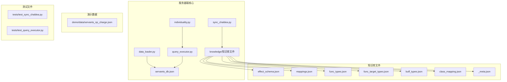
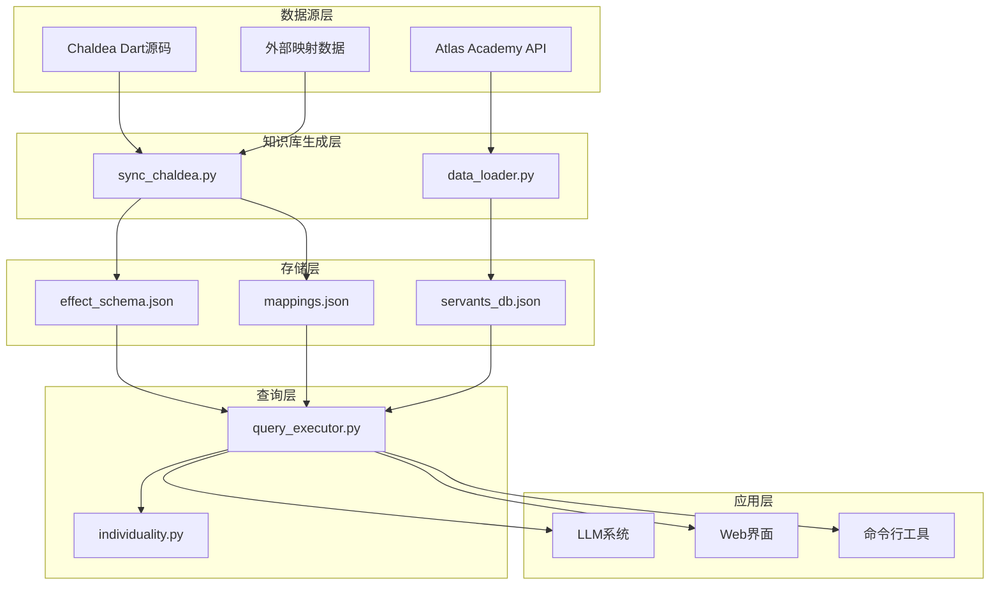
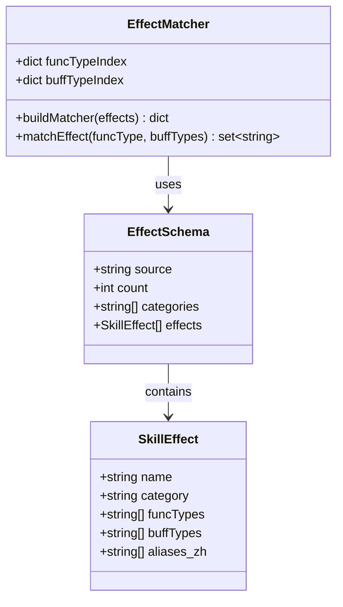
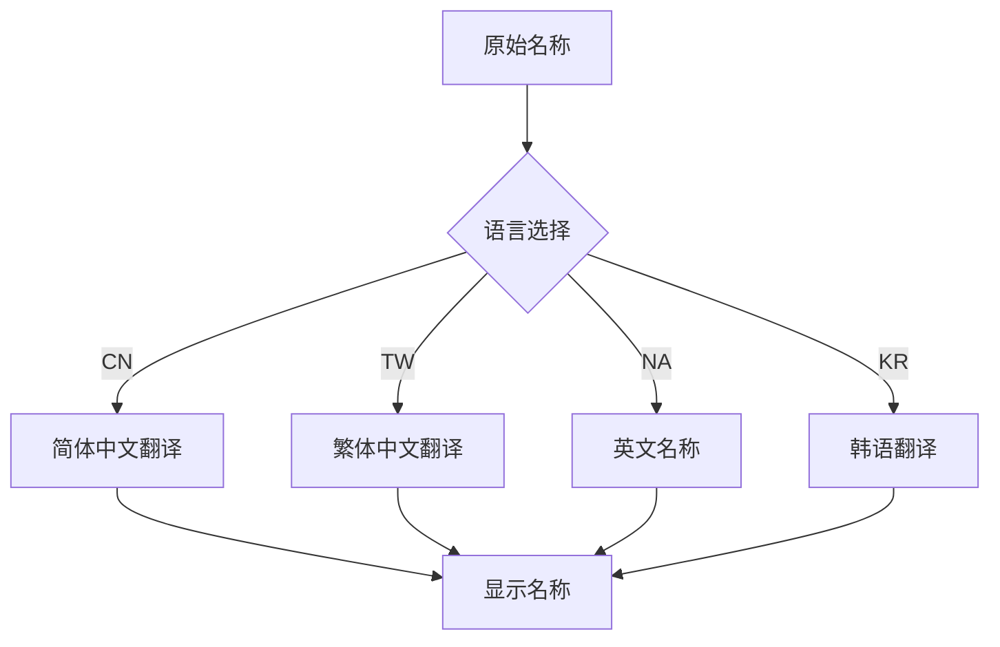
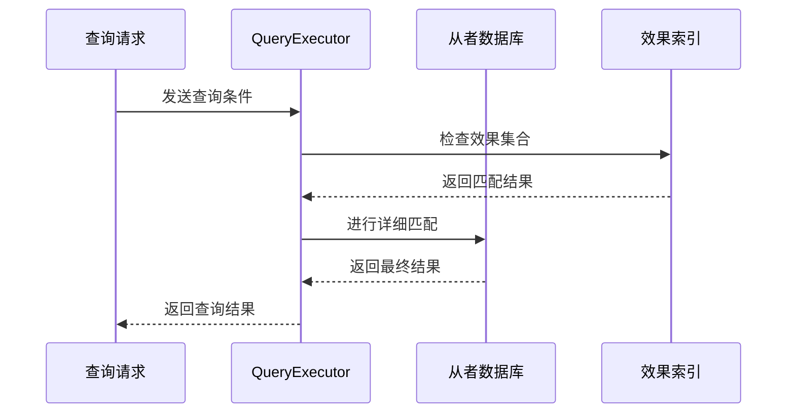
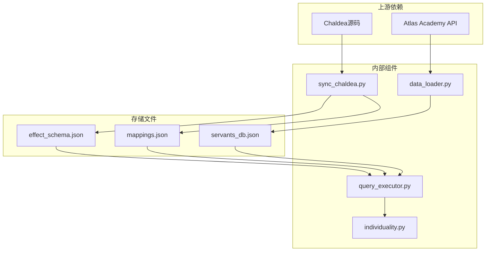
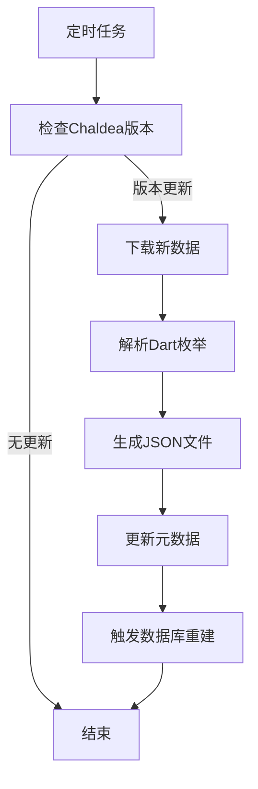

# 映射数据库系统

<cite>
**本文档引用的文件**
- [server/data_loader.py](file://server/data_loader.py)
- [server/sync_chaldea.py](file://server/sync_chaldea.py)
- [server/query_executor.py](file://server/query_executor.py)
- [server/individuality.py](file://server/individuality.py)
- [server/knowledge/_meta.json](file://server/knowledge/_meta.json)
- [server/knowledge/mappings.json](file://server/knowledge/mappings.json)
- [server/knowledge/effect_schema.json](file://server/knowledge/effect_schema.json)
- [server/knowledge/func_types.json](file://server/knowledge/func_types.json)
- [server/knowledge/func_target_types.json](file://server/knowledge/func_target_types.json)
- [server/knowledge/buff_types.json](file://server/knowledge/buff_types.json)
- [server/knowledge/class_mapping.json](file://server/knowledge/class_mapping.json)
- [demo/data/servants_np_charge.json](file://demo/data/servants_np_charge.json)
- [tests/test_sync_chaldea.py](file://tests/test_sync_chaldea.py)
- [tests/test_query_executor.py](file://tests/test_query_executor.py)
</cite>

## 目录
1. [简介](#简介)
2. [项目结构](#项目结构)
3. [核心组件](#核心组件)
4. [架构概览](#架构概览)
5. [详细组件分析](#详细组件分析)
6. [依赖关系分析](#依赖关系分析)
7. [性能考虑](#性能考虑)
8. [故障排除指南](#故障排除指南)
9. [结论](#结论)
10. [附录](#附录)

## 简介

Laplace项目的映射数据库系统是一个专门为Fate/Grand Order（FGO）游戏设计的知识库管理系统。该系统通过从Chaldea源码中提取领域知识，构建了完整的技能效果映射数据库，支持从者属性映射、技能效果别名映射等功能。

该系统的核心价值在于：
- **标准化技能效果分类**：通过effect_schema.json提供统一的效果分类体系
- **多语言支持**：通过mappings.json支持从者名称的多语言翻译
- **实时数据同步**：通过sync_chaldea.py实现与上游数据源的自动同步
- **高效查询优化**：通过data_loader.py构建索引和缓存机制

## 项目结构

Laplace项目的映射数据库系统采用模块化设计，主要包含以下核心目录和文件：

**图表来源**
- [server/data_loader.py:1-363](file://server/data_loader.py#L1-L363)
- [server/sync_chaldea.py:1-429](file://server/sync_chaldea.py#L1-L429)

**章节来源**
- [server/data_loader.py:1-363](file://server/data_loader.py#L1-L363)
- [server/sync_chaldea.py:1-429](file://server/sync_chaldea.py#L1-L429)

## 核心组件

### 知识库同步引擎

sync_chaldea.py是整个映射数据库系统的核心组件，负责从Chaldea源码中提取和生成各类知识库文件。

**主要功能**：
- **Dart枚举解析**：从func.dart、buff.dart、effect.dart中提取枚举定义
- **技能效果分类**：解析SkillEffect的分类和别名映射
- **多语言映射**：下载并处理从者名称的多语言翻译
- **元数据管理**：生成_version追踪信息

**章节来源**
- [server/sync_chaldea.py:1-429](file://server/sync_chaldea.py#L1-L429)

### 数据加载器

data_loader.py负责将上游数据转换为查询友好的格式，并建立各种索引以优化查询性能。

**核心功能**：
- **效果匹配索引**：构建funcType和buffType的快速查找索引
- **NP充能提取**：从技能效果中提取NP充能相关信息
- **技能效果提取**：解析从者的技能效果并进行分类
- **数据库构建**：生成最终的servants_db.json文件

**章节来源**
- [server/data_loader.py:1-363](file://server/data_loader.py#L1-L363)

### 查询执行器

query_executor.py提供高效的查询接口，支持多种筛选条件和组合查询。

**查询能力**：
- **NP充能筛选**：支持精确匹配和范围查询
- **效果组合查询**：支持AND/OR逻辑的多效果筛选
- **特性匹配**：支持正负特性混合的复杂条件
- **多语言名称匹配**：支持昵称映射和多语言名称查询

**章节来源**
- [server/query_executor.py:1-343](file://server/query_executor.py#L1-L343)

## 架构概览

映射数据库系统采用分层架构设计，确保了数据的一致性和查询的高效性：

**图表来源**
- [server/sync_chaldea.py:308-429](file://server/sync_chaldea.py#L308-L429)
- [server/data_loader.py:332-363](file://server/data_loader.py#L332-L363)
- [server/query_executor.py:53-117](file://server/query_executor.py#L53-L117)

## 详细组件分析

### 技能效果映射系统

技能效果映射系统是整个数据库的核心，通过effect_schema.json提供统一的效果分类标准。

#### 效果分类体系

系统将技能效果分为四大类别：
- **攻击类**：upAtk、upCriticaldamage、upCriticalpoint等
- **防御类**：invincible、subSelfdamage、upDefence等  
- **弱化类**：instantDeath、reduceHp、upGrantstate等
- **其他类**：expUp、qpUp、friendPointUp等

**图表来源**
- [server/knowledge/effect_schema.json:10-694](file://server/knowledge/effect_schema.json#L10-L694)
- [server/data_loader.py:64-84](file://server/data_loader.py#L64-L84)

#### 效果别名映射

系统提供了丰富的中文别名映射，便于用户理解和查询：

| 英文效果 | 中文别名 | 用途场景 |
|---------|---------|----------|
| gainNp | NP增加、自充、充能、群充、NP获取 | NP充能效果 |
| upAtk | 攻击力提升、加攻 | 攻击力增强 |
| invincible | 无敌 | 防御类效果 |
| upCriticaldamage | 暴击威力提升、暴击伤害、爆伤 | 暴击类效果 |

**章节来源**
- [server/knowledge/effect_schema.json:18-692](file://server/knowledge/effect_schema.json#L18-L692)
- [server/sync_chaldea.py:206-270](file://server/sync_chaldea.py#L206-L270)

### 从者属性映射系统

从者属性映射系统通过mappings.json提供多语言支持和属性转换。

#### 多语言名称映射

系统支持从者名称的多语言翻译，包括：
- **CN（简体中文）**：主要的中文翻译
- **TW（繁体中文）**：台湾地区的中文翻译  
- **NA（英文）**：英文名称
- **KR（韩文）**：韩语翻译

**图表来源**
- [server/knowledge/mappings.json:1-800](file://server/knowledge/mappings.json#L1-L800)

#### 职阶映射系统

class_mapping.json提供完整的职阶信息，包括：
- **可用职阶**：14种可使用的职阶（saber、archer、lancer等）
- **职阶标签**：日文标签（剣、弓、槍等）
- **基础职阶**：支持职阶转换的基础信息

**章节来源**
- [server/knowledge/class_mapping.json:6-77](file://server/knowledge/class_mapping.json#L6-L77)
- [server/knowledge/mappings.json:1-800](file://server/knowledge/mappings.json#L1-L800)

### NP充能映射系统

NP充能映射系统专门处理从者的NP获取和充能效果。

#### 充能效果识别

系统通过以下规则识别有效的NP充能效果：
- **funcType过滤**：只接受gainNp系列函数类型
- **目标类型验证**：只接受self、ptAll、ptOne等目标类型
- **数值有效性**：确保技能Lv.10的数值大于0

#### 充能统计计算

系统计算以下充能统计数据：
- **最大自充百分比**：单个技能的最大自充效果
- **最大群充百分比**：单个技能的最大群体充能效果  
- **总充能百分比**：所有技能充能效果的总和

**章节来源**
- [server/data_loader.py:113-137](file://server/data_loader.py#L113-L137)
- [server/data_loader.py:240-246](file://server/data_loader.py#L240-L246)

### 查询优化策略

查询执行器采用了多种优化策略来提高查询性能：

#### 快速路径优化

**图表来源**
- [server/query_executor.py:302-327](file://server/query_executor.py#L302-L327)

#### 缓存机制

系统实现了多层次的缓存机制：
- **全局数据库缓存**：servants_db.json的内存缓存
- **昵称映射缓存**：昵称到实际名称的映射缓存
- **元数据缓存**：知识库版本信息的缓存

**章节来源**
- [server/query_executor.py:17-50](file://server/query_executor.py#L17-L50)

## 依赖关系分析

映射数据库系统的依赖关系相对简单，主要遵循单向依赖原则：

**图表来源**
- [server/sync_chaldea.py:313-318](file://server/sync_chaldea.py#L313-L318)
- [server/data_loader.py:91-102](file://server/data_loader.py#L91-L102)

### 组件耦合度分析

- **sync_chaldea.py**：高度独立，只依赖上游数据源
- **data_loader.py**：依赖sync_chaldea.py生成的知识库文件
- **query_executor.py**：依赖data_loader.py生成的数据库文件
- **individuality.py**：被query_executor.py依赖

这种设计确保了系统的可维护性和可扩展性。

**章节来源**
- [server/sync_chaldea.py:1-429](file://server/sync_chaldea.py#L1-L429)
- [server/data_loader.py:1-363](file://server/data_loader.py#L1-L363)
- [server/query_executor.py:1-343](file://server/query_executor.py#L1-L343)

## 性能考虑

### 时间复杂度分析

- **知识库同步**：O(n)时间复杂度，其中n为枚举项数量
- **效果匹配**：O(k)时间复杂度，其中k为效果数量
- **查询执行**：O(m×k)时间复杂度，其中m为从者数量，k为效果匹配数量

### 空间复杂度分析

- **效果索引**：O(k)空间复杂度
- **数据库文件**：O(m×d)空间复杂度，其中d为平均数据密度
- **缓存机制**：O(m+d)空间复杂度

### 优化建议

1. **索引优化**：可以考虑为常用查询条件建立二级索引
2. **增量更新**：实现知识库的增量同步机制
3. **并行处理**：利用多核CPU加速数据处理
4. **内存管理**：优化大数据集的内存使用

## 故障排除指南

### 常见问题及解决方案

#### 知识库文件缺失

**问题症状**：运行data_loader.py时报错，提示缺少effect_schema.json

**解决方案**：
1. 确保已运行sync_chaldea.py生成知识库文件
2. 检查chaldea-center/chaldea仓库是否存在
3. 验证网络连接是否正常

#### 查询结果为空

**问题症状**：查询执行器返回空结果

**排查步骤**：
1. 检查servants_db.json文件是否正确生成
2. 验证查询条件是否正确
3. 确认效果名称拼写是否准确

#### 性能问题

**问题症状**：查询响应时间过长

**优化措施**：
1. 检查系统内存使用情况
2. 验证数据库文件是否完整
3. 考虑增加硬件资源

**章节来源**
- [server/data_loader.py:44-52](file://server/data_loader.py#L44-L52)
- [server/query_executor.py:41-50](file://server/query_executor.py#L41-L50)

## 结论

Laplace项目的映射数据库系统通过精心设计的架构和实现，成功地解决了FGO游戏数据的标准化和查询优化问题。系统的主要优势包括：

1. **完整性**：覆盖了从者的所有关键属性和技能效果
2. **准确性**：基于官方Chaldea源码的数据提取
3. **可扩展性**：模块化的架构设计便于功能扩展
4. **高效性**：通过索引和缓存机制优化查询性能

该系统为后续的AI助手和数据分析应用奠定了坚实的基础，能够支持复杂的查询需求和多样化的应用场景。

## 附录

### 数据库维护流程

#### 手动添加映射关系

1. **编辑知识库文件**：修改相应的JSON文件
2. **验证格式**：确保JSON格式正确
3. **更新元数据**：修改_meta.json文件中的文件计数
4. **重新生成数据库**：运行data_loader.py重新生成数据库文件

#### 自动同步机制

系统支持定期自动同步上游数据源：

**图表来源**
- [server/sync_chaldea.py:276-289](file://server/sync_chaldea.py#L276-L289)

### 备份和恢复策略

#### 备份方案

1. **版本控制**：使用Git管理所有知识库文件的版本
2. **定期导出**：定期导出完整的数据库文件
3. **云存储**：将重要数据备份到云端存储服务

#### 恢复流程

1. **验证备份完整性**：检查备份文件的完整性
2. **停止服务**：暂停相关服务进程
3. **替换文件**：用备份文件替换当前文件
4. **重启服务**：重新启动服务并验证功能

### 冲突解决和优先级处理

系统采用以下机制处理映射关系的冲突：

1. **明确性优先**：更具体的映射优先于通用映射
2. **最新优先**：最新的数据版本优先于历史版本
3. **人工干预**：对于无法自动解决的冲突，提供人工干预接口
4. **版本追踪**：通过_meta.json文件追踪每次更新的版本信息

**章节来源**
- [server/knowledge/_meta.json:1-12](file://server/knowledge/_meta.json#L1-L12)
- [server/sync_chaldea.py:396-413](file://server/sync_chaldea.py#L396-L413)