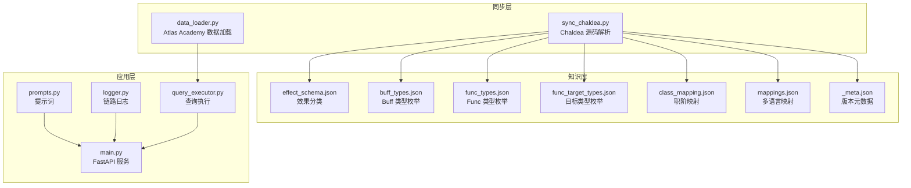
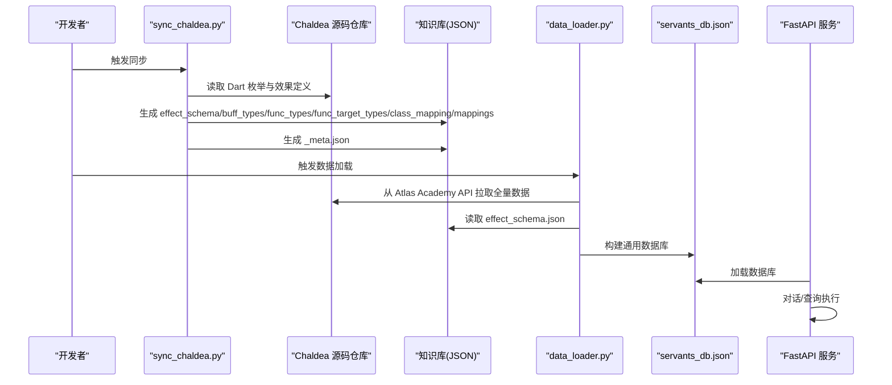
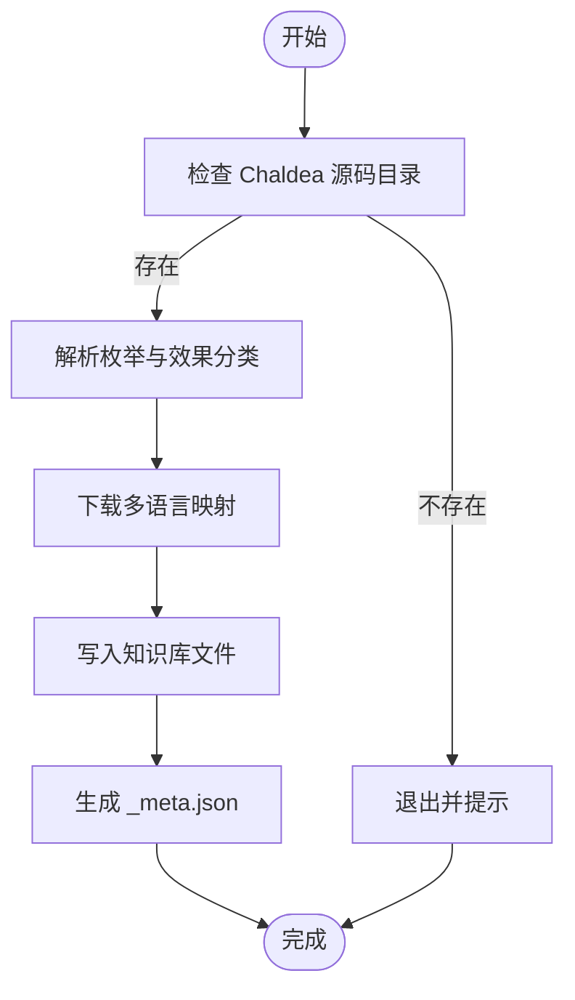
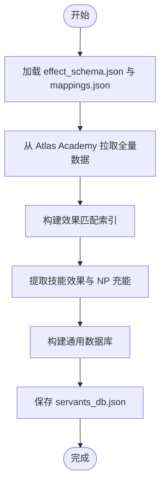
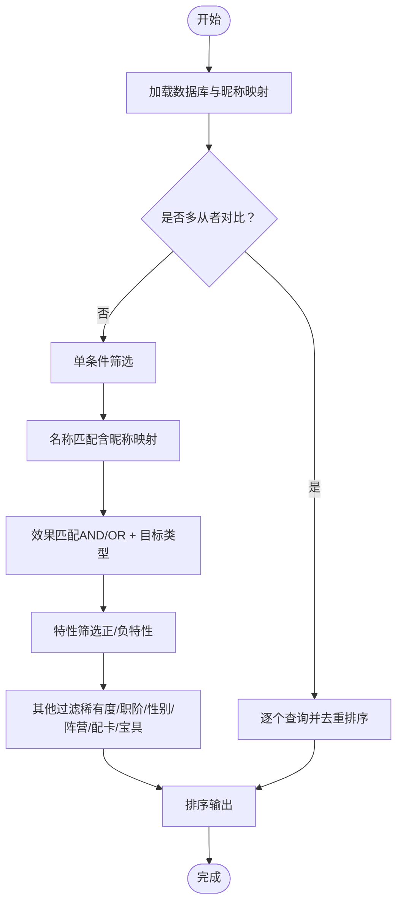
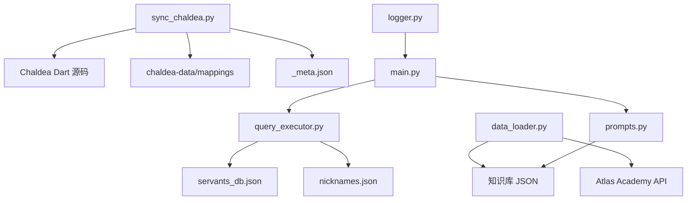

# 知识库同步机制

<cite>
**本文档引用的文件**
- [server/sync_chaldea.py](file://server/sync_chaldea.py)
- [server/data_loader.py](file://server/data_loader.py)
- [server/query_executor.py](file://server/query_executor.py)
- [server/prompts.py](file://server/prompts.py)
- [server/individuality.py](file://server/individuality.py)
- [server/logger.py](file://server/logger.py)
- [server/main.py](file://server/main.py)
- [server/knowledge/_meta.json](file://server/knowledge/_meta.json)
- [server/knowledge/effect_schema.json](file://server/knowledge/effect_schema.json)
- [server/knowledge/buff_types.json](file://server/knowledge/buff_types.json)
- [server/knowledge/func_types.json](file://server/knowledge/func_types.json)
- [server/knowledge/func_target_types.json](file://server/knowledge/func_target_types.json)
- [server/knowledge/class_mapping.json](file://server/knowledge/class_mapping.json)
- [server/knowledge/mappings.json](file://server/knowledge/mappings.json)
- [tests/test_sync_chaldea.py](file://tests/test_sync_chaldea.py)
</cite>

## 目录
1. [简介](#简介)
2. [项目结构](#项目结构)
3. [核心组件](#核心组件)
4. [架构概览](#架构概览)
5. [详细组件分析](#详细组件分析)
6. [依赖分析](#依赖分析)
7. [性能考虑](#性能考虑)
8. [故障排除指南](#故障排除指南)
9. [结论](#结论)
10. [附录](#附录)

## 简介
本文件系统性阐述 Laplace 项目的知识库同步机制，聚焦于从 Chaldea Dart 源码自动抽取 FGO 领域知识（枚举、效果分类、职阶映射等），生成标准化 JSON 知识库文件，并驱动后续的 LLM 对话与查询执行。文档涵盖：
- 数据抓取、解析与转换的完整流程
- 同步脚本工作原理与执行策略（幂等、覆盖式生成）
- 知识库版本管理与变更追踪
- 错误处理与重试机制
- 扩展新知识源与同步规则的方法
- 性能优化与并发控制策略
- 同步结果验证与质量保证

## 项目结构
Laplace 的知识库同步围绕 server 目录展开，核心文件包括：
- 同步脚本：从 Chaldea 源码解析并生成知识库
- 数据加载器：从 Atlas Academy API 拉取全量数据，结合知识库构建通用数据库
- 查询执行器：基于知识库与数据库执行条件筛选
- 提示词与日志：支撑 LLM 对话与链路追踪
- 知识库文件：JSON 结构化存储，包含版本元数据

图表来源
- [server/sync_chaldea.py](file://server/sync_chaldea.py)
- [server/data_loader.py](file://server/data_loader.py)
- [server/query_executor.py](file://server/query_executor.py)
- [server/prompts.py](file://server/prompts.py)
- [server/logger.py](file://server/logger.py)
- [server/main.py](file://server/main.py)

章节来源
- [server/sync_chaldea.py](file://server/sync_chaldea.py)
- [server/data_loader.py](file://server/data_loader.py)
- [server/knowledge/_meta.json](file://server/knowledge/_meta.json)

## 核心组件
- 同步脚本（sync_chaldea.py）
  - 从 Chaldea Dart 源码解析枚举与效果分类
  - 生成 JSON 知识库文件与版本元数据
  - 下载多语言映射数据
  - 幂等覆盖写入，支持重复运行
- 数据加载器（data_loader.py）
  - 从 Atlas Academy API 拉取全量从者数据
  - 基于知识库提取技能效果与 NP 充能
  - 构建通用数据库（servants_db.json）
- 查询执行器（query_executor.py）
  - 加载数据库与昵称映射
  - 执行多条件组合查询（NP 充能、效果、职阶、特性等）
  - 支持多从者对比与排序
- 提示词与日志（prompts.py、logger.py）
  - 动态注入知识库构建系统提示
  - 记录完整查询链路日志
- FastAPI 服务（main.py）
  - 对外提供对话与流式对话接口
  - 集成 LLM 与查询执行器

章节来源
- [server/sync_chaldea.py](file://server/sync_chaldea.py)
- [server/data_loader.py](file://server/data_loader.py)
- [server/query_executor.py](file://server/query_executor.py)
- [server/prompts.py](file://server/prompts.py)
- [server/logger.py](file://server/logger.py)
- [server/main.py](file://server/main.py)

## 架构概览
下图展示从 Chaldea 源码到知识库，再到数据加载与查询执行的整体流程。

图表来源
- [server/sync_chaldea.py](file://server/sync_chaldea.py)
- [server/data_loader.py](file://server/data_loader.py)
- [server/main.py](file://server/main.py)

## 详细组件分析

### 同步脚本（sync_chaldea.py）
- 设计原则
  - 纯正则解析，不依赖 Dart SDK
  - 幂等操作，重复运行覆盖旧文件
  - 生成 _meta.json 追踪版本
- 关键流程
  - 检查 Chaldea 源码目录是否存在
  - 解析 FuncType、FuncTargetType、BuffType 枚举
  - 解析 SkillEffect 效果分类（含中文别名）
  - 解析 SvtClass 枚举并筛选可用职阶
  - 下载多语言映射数据（svt_names、traits）
  - 生成各知识库文件与元数据
- 错误处理
  - 源码目录缺失时终止并提示
  - Git 提交号获取失败时回退为 "unknown"
  - 远程映射下载失败时记录警告并返回空字典
- 幂等与覆盖
  - 所有输出文件均覆盖写入，确保重复执行一致性

图表来源
- [server/sync_chaldea.py](file://server/sync_chaldea.py)

章节来源
- [server/sync_chaldea.py](file://server/sync_chaldea.py)
- [tests/test_sync_chaldea.py](file://tests/test_sync_chaldea.py)

### 数据加载器（data_loader.py）
- 作用
  - 从 Atlas Academy API 拉取全量从者数据
  - 基于 effect_schema.json 构建效果匹配索引
  - 提取技能效果、NP 充能、宝具效果与卡色构成
  - 生成通用数据库（servants_db.json）
- 关键逻辑
  - 加载 effect_schema.json 与 mappings.json
  - 构建 funcType/buffType 索引，加速效果匹配
  - 提取 NP 充能（self/party），计算最大与总充能
  - 解析宝具颜色与目标类型
  - 基于多语言映射补充中文名
- 错误处理
  - 知识库缺失时降级为仅提取 NP 充能数据
  - API 请求超时与状态码异常时抛出异常

图表来源
- [server/data_loader.py](file://server/data_loader.py)

章节来源
- [server/data_loader.py](file://server/data_loader.py)

### 查询执行器（query_executor.py）
- 作用
  - 在预加载的通用数据库上执行多条件组合查询
  - 支持 NP 充能、稀有度、职阶、名称、技能效果、特性、性别、阵营、配卡、宝具颜色与目标等
- 关键逻辑
  - 加载数据库与昵称映射（缓存）
  - 多从者对比查询（names 字段）
  - 名称匹配（支持昵称映射与分级匹配策略）
  - 效果匹配（支持 AND/OR 逻辑与目标类型筛选）
  - 特性筛选（正负特性分离与排斥逻辑）
  - 排序（稀有度降序 → collectionNo 升序）

图表来源
- [server/query_executor.py](file://server/query_executor.py)
- [server/individuality.py](file://server/individuality.py)

章节来源
- [server/query_executor.py](file://server/query_executor.py)
- [server/individuality.py](file://server/individuality.py)

### 提示词与日志（prompts.py、logger.py）
- 提示词（prompts.py）
  - 动态加载 effect_schema.json，构建系统提示
  - 明确输出格式与字段说明，确保 LLM 严格返回 JSON
- 日志（logger.py）
  - 记录完整查询链路（traceId、意图、结果数量、回复、上下文、错误）
  - JSONL 格式便于后续分析与审计

章节来源
- [server/prompts.py](file://server/prompts.py)
- [server/logger.py](file://server/logger.py)

### FastAPI 服务（main.py）
- 作用
  - 提供 /api/chat 与 /api/chat/stream 接口
  - 集成 LLM 与查询执行器，构建上下文并生成自然语言回复
- 关键逻辑
  - 启动时预加载数据库
  - 意图解析与查询执行两阶段
  - SSE 流式返回，分阶段推送思考与结果
  - 错误降级与 traceId 记录

章节来源
- [server/main.py](file://server/main.py)

## 依赖分析
- 同步脚本依赖
  - Chaldea 源码目录（lib/models/gamedata 下的 func.dart、buff.dart、effect.dart、common.dart）
  - 远程映射数据（chaldea-data/mappings）
  - Git 命令获取提交号
- 数据加载器依赖
  - Atlas Academy API
  - 知识库文件（effect_schema.json、mappings.json）
- 查询执行器依赖
  - 通用数据库（servants_db.json）
  - 昵称映射（nicknames.json）
- 知识库文件
  - effect_schema.json：效果分类与中文别名
  - buff_types.json、func_types.json、func_target_types.json：类型枚举
  - class_mapping.json：职阶映射
  - mappings.json：多语言映射
  - _meta.json：版本元数据

图表来源
- [server/sync_chaldea.py](file://server/sync_chaldea.py)
- [server/data_loader.py](file://server/data_loader.py)
- [server/query_executor.py](file://server/query_executor.py)
- [server/prompts.py](file://server/prompts.py)
- [server/logger.py](file://server/logger.py)
- [server/main.py](file://server/main.py)

章节来源
- [server/sync_chaldea.py](file://server/sync_chaldea.py)
- [server/data_loader.py](file://server/data_loader.py)
- [server/query_executor.py](file://server/query_executor.py)
- [server/knowledge/_meta.json](file://server/knowledge/_meta.json)

## 性能考虑
- 同步脚本
  - 正则解析速度快，避免引入 Dart SDK 依赖
  - 幂等覆盖写入，避免重复 IO
  - 远程映射下载设置超时，失败时快速降级
- 数据加载器
  - 构建效果匹配索引（funcType/buffType）显著提升查询效率
  - 仅提取必要字段，减少内存占用
  - API 请求设置超时，避免阻塞
- 查询执行器
  - 数据库预加载与缓存（全局变量）
  - 名称匹配采用分级策略，优先精确匹配
  - 效果匹配先集合后明细，减少不必要的遍历
- FastAPI 服务
  - SSE 流式返回，改善用户体验
  - 限制返回条目数量，避免响应过大

## 故障排除指南
- 同步脚本
  - 未找到 Chaldea 源码：确认 chaldea-center/chaldea 目录存在
  - Git 提交号获取失败：检查本地 git 环境与权限
  - 远程映射下载失败：检查网络与超时设置
- 数据加载器
  - effect_schema.json 不存在：先运行同步脚本
  - Atlas Academy API 超时/错误：检查网络与服务状态
- 查询执行器
  - servants_db.json 不存在：先运行数据加载器
  - 名称匹配异常：检查昵称映射与规范化规则
- 日志与追踪
  - 查看 logs/query_trace.jsonl 获取完整链路信息
  - 发生错误时 traceId 会记录在响应头或日志中

章节来源
- [server/sync_chaldea.py](file://server/sync_chaldea.py)
- [server/data_loader.py](file://server/data_loader.py)
- [server/query_executor.py](file://server/query_executor.py)
- [server/logger.py](file://server/logger.py)

## 结论
Laplace 的知识库同步机制通过“纯正则解析 + 幂等覆盖 + 元数据追踪”的设计，实现了从 Chaldea 源码到 JSON 知识库的自动化生成，并与数据加载器、查询执行器形成闭环。该机制具备良好的可扩展性与可维护性，能够支持后续新增知识源与同步规则，同时通过索引构建与缓存策略保障查询性能。

## 附录

### 知识库版本管理与变更追踪
- 元数据文件（_meta.json）
  - 记录同步时间、Chaldea 提交号、源码路径与各文件计数
  - 用于版本追踪与变更审计
- 变更检测建议
  - 对比不同版本的 _meta.json 中的 syncedAt 与 chaldeaCommit
  - 对比各知识库文件的 count 与具体条目变化

章节来源
- [server/knowledge/_meta.json](file://server/knowledge/_meta.json)

### 扩展新知识源与同步规则
- 新增 Dart 源文件
  - 在同步脚本中添加对应文件路径与解析逻辑
  - 定义新的解析函数（参考 parse_dart_enum 与 parse_effect_schema）
- 新增远程映射
  - 在同步脚本中添加 download_mapping_data 的调用
  - 在知识库中新增对应 JSON 文件
- 新增查询条件
  - 在查询执行器中扩展条件分支与过滤逻辑
  - 在提示词中补充系统提示与字段说明
- 新增测试
  - 为新增解析逻辑编写单元测试，参考 test_sync_chaldea.py

章节来源
- [server/sync_chaldea.py](file://server/sync_chaldea.py)
- [server/query_executor.py](file://server/query_executor.py)
- [server/prompts.py](file://server/prompts.py)
- [tests/test_sync_chaldea.py](file://tests/test_sync_chaldea.py)

### 同步结果验证与质量保证
- 单元测试
  - 针对解析函数的测试用例，验证枚举与效果分类提取正确性
- 端到端验证
  - 运行同步脚本与数据加载器，检查生成文件完整性
  - 使用 FastAPI 服务进行查询验证，核对返回结果与预期一致
- 日志审计
  - 通过日志文件分析链路与错误，定位问题

章节来源
- [tests/test_sync_chaldea.py](file://tests/test_sync_chaldea.py)
- [server/logger.py](file://server/logger.py)