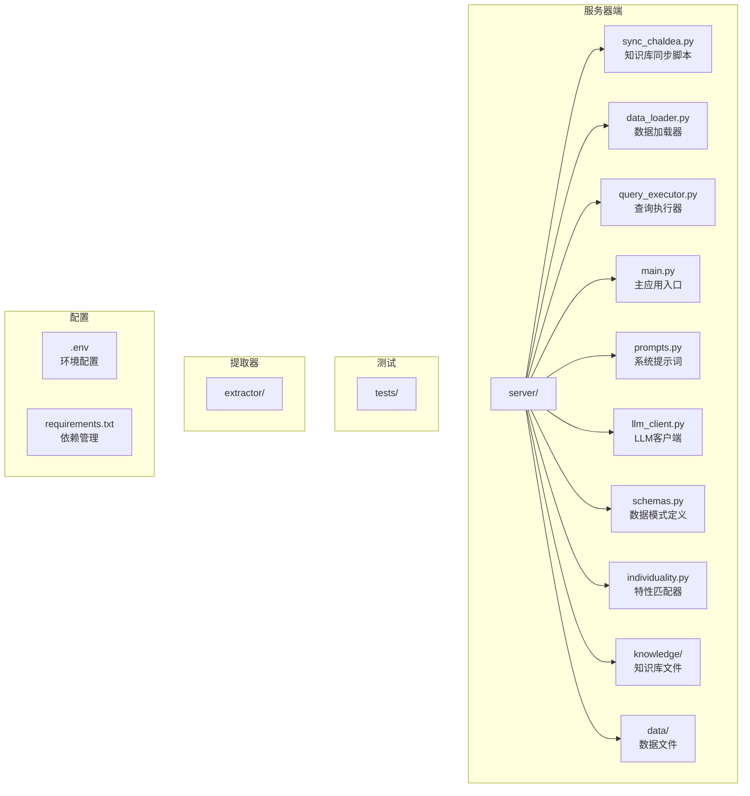
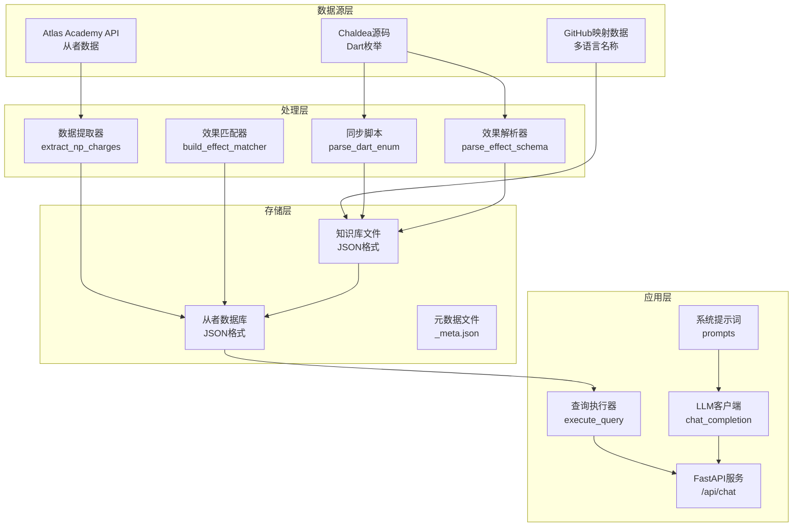
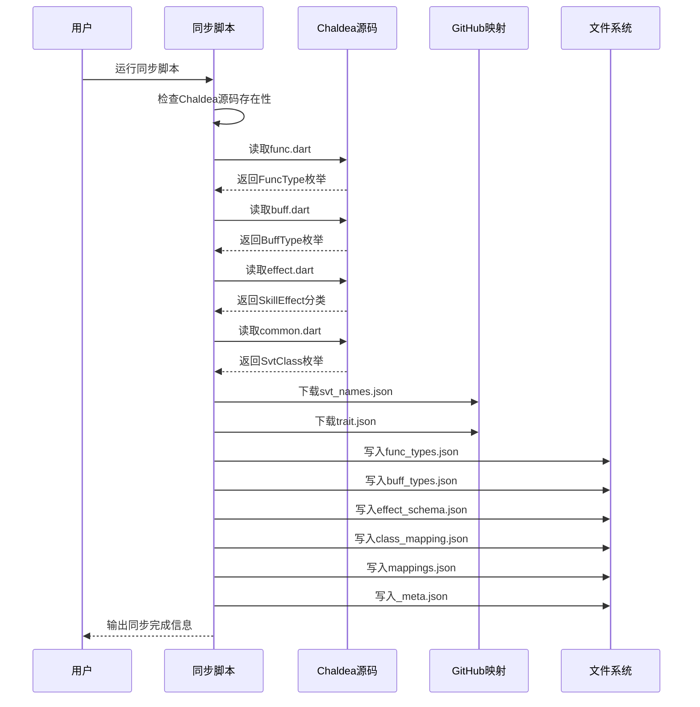
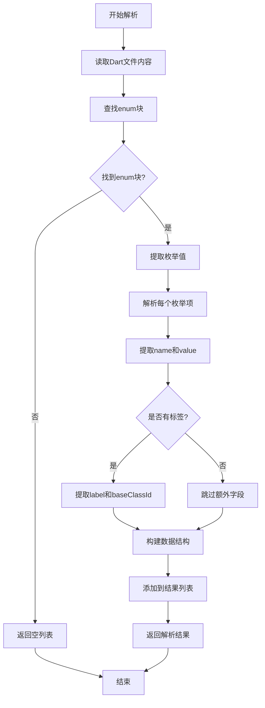
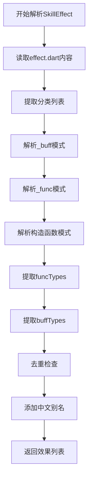
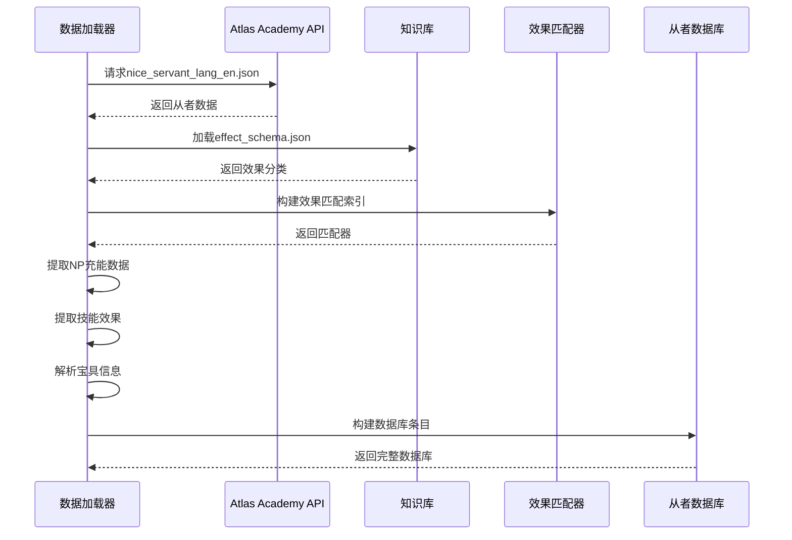
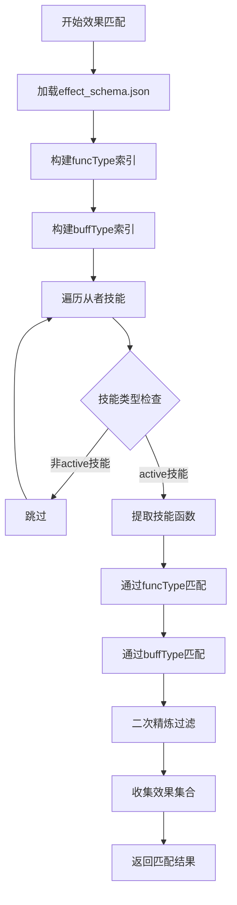
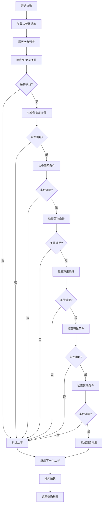
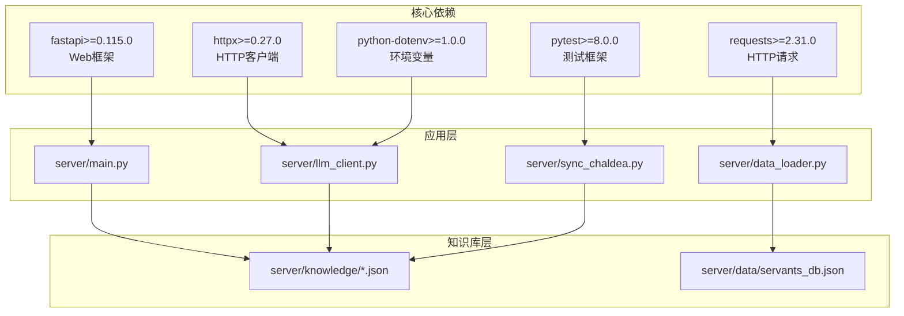
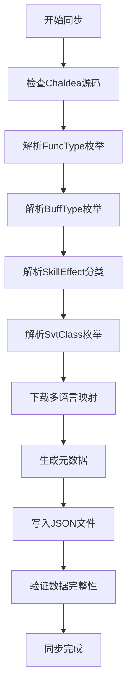

# 知识库同步系统

<cite>
**本文档引用的文件**
- [server/sync_chaldea.py](file://server/sync_chaldea.py)
- [server/data_loader.py](file://server/data_loader.py)
- [server/query_executor.py](file://server/query_executor.py)
- [server/main.py](file://server/main.py)
- [server/prompts.py](file://server/prompts.py)
- [server/llm_client.py](file://server/llm_client.py)
- [server/schemas.py](file://server/schemas.py)
- [server/individuality.py](file://server/individuality.py)
- [server/knowledge/_meta.json](file://server/knowledge/_meta.json)
- [server/knowledge/effect_schema.json](file://server/knowledge/effect_schema.json)
- [server/knowledge/buff_types.json](file://server/knowledge/buff_types.json)
- [server/knowledge/func_types.json](file://server/knowledge/func_types.json)
- [tests/test_sync_chaldea.py](file://tests/test_sync_chaldea.py)
- [server/requirements.txt](file://server/requirements.txt)
- [extractor/requirements.txt](file://extractor/requirements.txt)
</cite>

## 目录
1. [简介](#简介)
2. [项目结构](#项目结构)
3. [核心组件](#核心组件)
4. [架构概览](#架构概览)
5. [详细组件分析](#详细组件分析)
6. [依赖分析](#依赖分析)
7. [性能考虑](#性能考虑)
8. [故障排除指南](#故障排除指南)
9. [结论](#结论)
10. [附录](#附录)

## 简介

Laplace知识库同步系统是一个自动化工具链，负责从Chaldea源码中提取FGO游戏领域的结构化知识，并生成可供AI系统和查询执行器使用的JSON知识库文件。该系统实现了从源码解析、数据转换到存储的完整流水线，确保知识库的准确性和时效性。

系统的核心价值在于：
- **自动化知识提取**：从Chaldea Dart源码中自动解析枚举、效果分类和职阶映射
- **多语言支持**：生成包含中文别名的多语言映射数据
- **版本追踪**：通过元数据文件记录Chaldea仓库的提交信息
- **幂等操作**：支持重复运行，覆盖旧文件而不破坏现有数据

## 项目结构

项目采用清晰的分层架构，主要包含以下核心目录：



**图表来源**
- [server/sync_chaldea.py:1-429](file://server/sync_chaldea.py#L1-L429)
- [server/data_loader.py:1-363](file://server/data_loader.py#L1-L363)

**章节来源**
- [server/sync_chaldea.py:1-429](file://server/sync_chaldea.py#L1-L429)
- [server/data_loader.py:1-363](file://server/data_loader.py#L1-L363)

## 核心组件

### 知识库同步脚本

同步脚本是整个系统的核心，负责从Chaldea源码中提取结构化数据并生成JSON知识库文件。其主要功能包括：

1. **Dart枚举解析**：从func.dart、buff.dart和common.dart中提取枚举定义
2. **技能效果分类**：解析SkillEffect的分类和映射关系
3. **多语言映射**：下载并整合从者名称和特性映射数据
4. **元数据生成**：记录同步时间和版本信息

### 数据加载器

数据加载器负责从Atlas Academy API获取最新的从者数据，基于知识库进行效果提取和数据库构建。其核心功能包括：

1. **API数据抓取**：从外部API获取全量从者数据
2. **效果匹配**：利用知识库中的效果分类进行精准匹配
3. **数据库构建**：生成统一的从者数据库格式
4. **性能优化**：通过索引和缓存提高查询效率

### 查询执行器

查询执行器提供强大的从者查询能力，支持复杂的多条件组合查询：

1. **条件解析**：支持NP充能、稀有度、职阶、效果等多种查询条件
2. **特性匹配**：实现正负特性组合的复杂逻辑判断
3. **排序算法**：按稀有度和收藏编号进行智能排序
4. **结果过滤**：提供精确的结果集过滤和排序

**章节来源**
- [server/sync_chaldea.py:308-429](file://server/sync_chaldea.py#L308-L429)
- [server/data_loader.py:332-363](file://server/data_loader.py#L332-L363)
- [server/query_executor.py:53-305](file://server/query_executor.py#L53-L305)

## 架构概览

系统采用分层架构设计，各组件职责明确，耦合度低：



**图表来源**
- [server/sync_chaldea.py:308-429](file://server/sync_chaldea.py#L308-L429)
- [server/data_loader.py:332-363](file://server/data_loader.py#L332-L363)
- [server/main.py:87-218](file://server/main.py#L87-L218)

## 详细组件分析

### 同步脚本工作原理

同步脚本实现了完整的数据处理流水线：



**图表来源**
- [server/sync_chaldea.py:308-429](file://server/sync_chaldea.py#L308-L429)

#### 枚举解析器实现

枚举解析器使用正则表达式从Dart源码中提取结构化数据：



**图表来源**
- [server/sync_chaldea.py:43-84](file://server/sync_chaldea.py#L43-L84)

#### 技能效果分类解析

技能效果分类解析器处理复杂的SkillEffect定义：



**图表来源**
- [server/sync_chaldea.py:91-203](file://server/sync_chaldea.py#L91-L203)

**章节来源**
- [server/sync_chaldea.py:43-203](file://server/sync_chaldea.py#L43-L203)

### 数据加载器处理流程

数据加载器实现了从原始API数据到结构化数据库的转换：



**图表来源**
- [server/data_loader.py:332-363](file://server/data_loader.py#L332-L363)

#### 效果匹配算法

效果匹配器实现了高效的从者效果识别：



**图表来源**
- [server/data_loader.py:64-84](file://server/data_loader.py#L64-L84)

**章节来源**
- [server/data_loader.py:64-228](file://server/data_loader.py#L64-L228)

### 查询执行器实现

查询执行器提供了灵活的从者查询接口：



**图表来源**
- [server/query_executor.py:53-305](file://server/query_executor.py#L53-L305)

**章节来源**
- [server/query_executor.py:53-305](file://server/query_executor.py#L53-L305)

## 依赖分析

系统依赖关系清晰，主要依赖包括：



**图表来源**
- [server/requirements.txt:1-7](file://server/requirements.txt#L1-L7)
- [extractor/requirements.txt:1-2](file://extractor/requirements.txt#L1-L2)

**章节来源**
- [server/requirements.txt:1-7](file://server/requirements.txt#L1-L7)
- [extractor/requirements.txt:1-2](file://extractor/requirements.txt#L1-L2)

## 性能考虑

系统在多个层面进行了性能优化：

### 缓存策略
- **数据库缓存**：查询执行器使用全局缓存避免重复加载
- **效果匹配缓存**：构建一次性索引避免重复计算
- **系统提示词缓存**：避免重复构建提示词模板

### 算法优化
- **集合操作**：使用集合进行快速查找和去重
- **早期退出**：在条件不满足时立即跳过后续检查
- **批量处理**：支持批量数据处理和索引构建

### 内存管理
- **流式处理**：大文件采用流式读取避免内存溢出
- **增量更新**：支持部分数据更新而非全量重建
- **资源清理**：及时释放不再使用的资源

## 故障排除指南

### 常见问题及解决方案

#### Chaldea源码未找到
**症状**：同步脚本报错提示未找到Chaldea源码
**解决方案**：
1. 确认chaldea-center/chaldea目录存在
2. 检查Git仓库是否正确克隆
3. 验证文件权限设置

#### API请求超时
**症状**：数据加载器在请求Atlas Academy API时超时
**解决方案**：
1. 检查网络连接稳定性
2. 增加请求超时时间
3. 使用代理服务器访问

#### JSON解析错误
**症状**：系统提示JSON格式错误
**解决方案**：
1. 验证JSON文件完整性
2. 检查编码格式（UTF-8）
3. 使用在线JSON验证工具

#### LLM调用失败
**症状**：聊天接口无法连接到LLM服务
**解决方案**：
1. 检查LLM_BASE_URL配置
2. 验证API密钥有效性
3. 测试网络连通性

**章节来源**
- [server/sync_chaldea.py:313-318](file://server/sync_chaldea.py#L313-L318)
- [server/data_loader.py:94-96](file://server/data_loader.py#L94-L96)
- [server/llm_client.py:63-78](file://server/llm_client.py#L63-L78)

## 结论

Laplace知识库同步系统通过自动化的方式实现了从Chaldea源码到结构化知识库的完整转换，为后续的AI查询和数据分析奠定了坚实基础。系统的主要优势包括：

1. **自动化程度高**：从源码解析到数据生成的全流程自动化
2. **准确性保证**：基于官方源码的数据提取，确保信息准确性
3. **扩展性强**：模块化设计便于功能扩展和维护
4. **性能优化**：多层缓存和索引机制确保高效运行

未来可以考虑的功能改进包括：
- 增加增量同步机制
- 实现数据版本对比功能
- 添加更多的错误恢复机制
- 优化大规模数据处理性能

## 附录

### 同步配置示例

#### 环境变量配置
```bash
# LLM服务配置
LLM_BASE_URL=https://api.example.com/v1
LLM_API_KEY=your_api_key_here
LLM_MODEL=gpt-4-turbo
LLM_FALLBACK_MODELS=claude-3-opus,gpt-3.5-turbo
```

#### 同步命令示例
```bash
# 基础同步
python3 server/sync_chaldea.py

# 检查同步状态
cat server/knowledge/_meta.json
```

### 数据更新流程



**图表来源**
- [server/sync_chaldea.py:308-429](file://server/sync_chaldea.py#L308-L429)

### 测试验证

系统包含完整的测试套件，确保核心功能的正确性：

- **单元测试**：针对枚举解析和效果分类的测试
- **集成测试**：验证完整同步流程的正确性
- **回归测试**：确保功能变更不影响现有功能

**章节来源**
- [tests/test_sync_chaldea.py:1-58](file://tests/test_sync_chaldea.py#L1-L58)