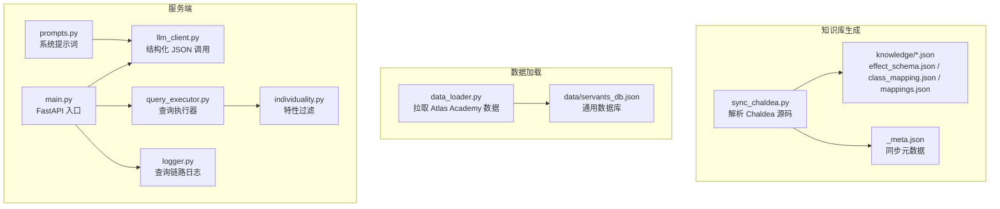
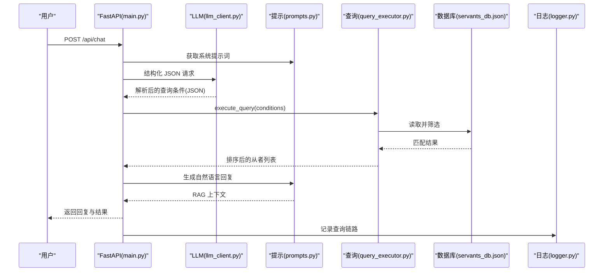
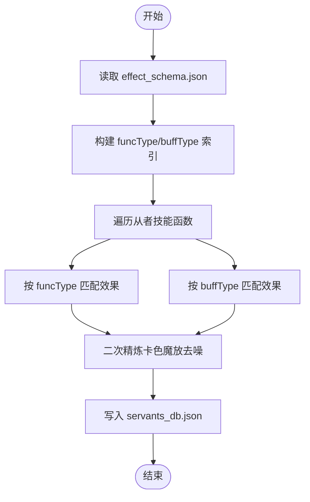
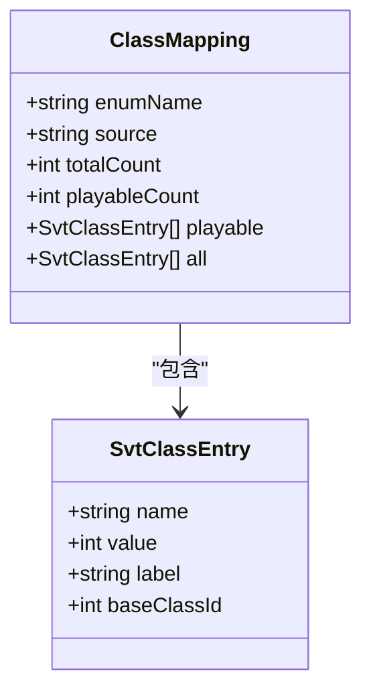
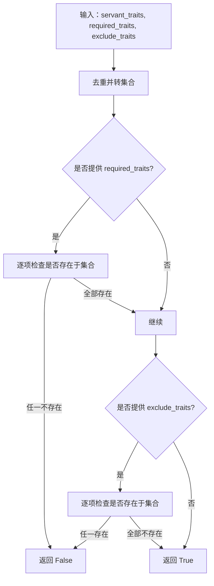
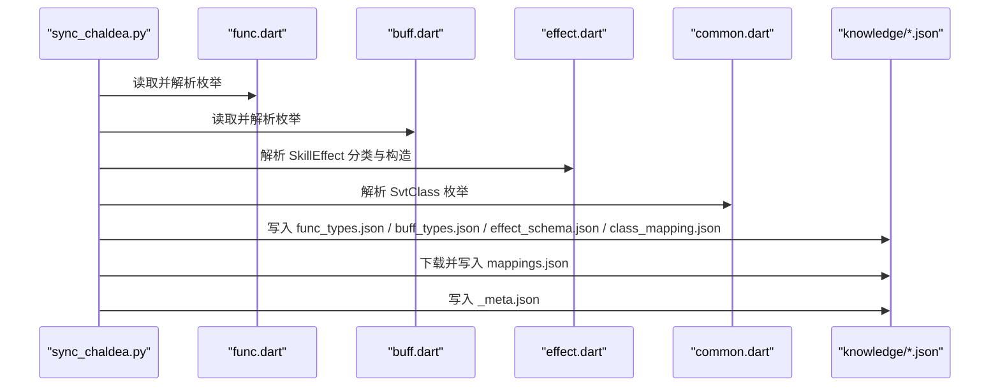
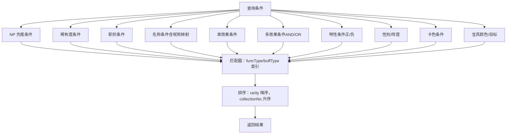
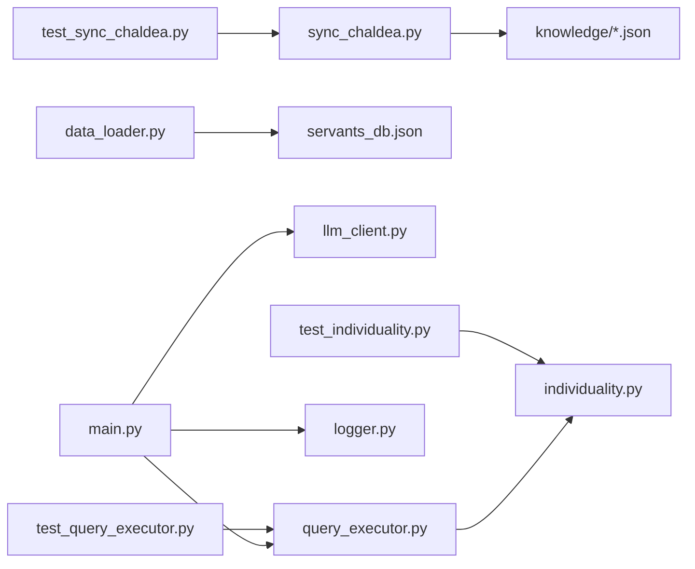

# 知识库系统

<cite>
**本文引用的文件**
- [server/sync_chaldea.py](file://server/sync_chaldea.py)
- [server/knowledge/effect_schema.json](file://server/knowledge/effect_schema.json)
- [server/knowledge/class_mapping.json](file://server/knowledge/class_mapping.json)
- [server/knowledge/mappings.json](file://server/knowledge/mappings.json)
- [server/knowledge/_meta.json](file://server/knowledge/_meta.json)
- [server/data_loader.py](file://server/data_loader.py)
- [server/query_executor.py](file://server/query_executor.py)
- [server/individuality.py](file://server/individuality.py)
- [server/prompts.py](file://server/prompts.py)
- [server/llm_client.py](file://server/llm_client.py)
- [server/main.py](file://server/main.py)
- [server/schemas.py](file://server/schemas.py)
- [server/logger.py](file://server/logger.py)
- [tests/test_sync_chaldea.py](file://tests/test_sync_chaldea.py)
- [tests/test_query_executor.py](file://tests/test_query_executor.py)
- [tests/test_individuality.py](file://tests/test_individuality.py)
- [demo/data/servants_np_charge.json](file://demo/data/servants_np_charge.json)
</cite>

## 目录
1. [简介](#简介)
2. [项目结构](#项目结构)
3. [核心组件](#核心组件)
4. [架构总览](#架构总览)
5. [详细组件分析](#详细组件分析)
6. [依赖关系分析](#依赖关系分析)
7. [性能考量](#性能考量)
8. [故障排查指南](#故障排查指南)
9. [结论](#结论)
10. [附录](#附录)

## 简介
本文件系统性梳理 Laplace 知识库系统的设计与实现，重点解释以下主题：
- 效果分类体系：如何从 Chaldea 源码中抽取技能效果，建立 attack/defence/debuff/others 分类，并配套中文别名。
- 职阶映射：从 SvtClass 枚举生成可玩与全部职阶清单，支持中文标签与基础职阶映射。
- 特性 ID 系统：解析带符号特性（正/负）并提供查询过滤逻辑。
- JSON 配置文件结构与用途：effect_schema.json、class_mapping.json、mappings.json、_meta.json 的字段语义与来源。
- 知识库同步机制：从 Chaldea 源码与外部数据源下载映射，生成稳定的知识库文件。
- 数据模型与查询优化策略：如何在本地数据库上进行高效筛选与排序。

## 项目结构
Laplace 采用分层清晰的服务端架构：
- server/sync_chaldea.py：从 Chaldea 源码解析并生成知识库 JSON 文件。
- server/knowledge/*：知识库 JSON 文件与元数据。
- server/data_loader.py：从 Atlas Academy API 拉取从者数据，结合知识库构建通用数据库。
- server/query_executor.py：基于结构化查询条件在数据库上执行筛选。
- server/main.py：FastAPI 入口，集成 LLM、提示词与日志。
- server/individuality.py：特性过滤逻辑（含正负特性）。
- server/prompts.py：系统提示词与效果列表注入。
- server/llm_client.py：结构化 JSON 输出的 LLM 客户端。
- server/schemas.py：LLM 与查询执行器之间的结构化契约。
- server/logger.py：查询链路日志记录。
- tests/*：对同步、查询与特性过滤的单元测试。
- demo/data/servants_np_charge.json：演示数据样例。

**图表来源**
- [server/sync_chaldea.py:1-429](file://server/sync_chaldea.py#L1-L429)
- [server/data_loader.py:1-363](file://server/data_loader.py#L1-L363)
- [server/main.py:1-228](file://server/main.py#L1-L228)
- [server/prompts.py:1-208](file://server/prompts.py#L1-L208)
- [server/llm_client.py:1-247](file://server/llm_client.py#L1-L247)
- [server/query_executor.py:1-305](file://server/query_executor.py#L1-L305)
- [server/individuality.py:1-78](file://server/individuality.py#L1-L78)
- [server/logger.py:1-55](file://server/logger.py#L1-L55)

**章节来源**
- [server/sync_chaldea.py:1-429](file://server/sync_chaldea.py#L1-L429)
- [server/data_loader.py:1-363](file://server/data_loader.py#L1-L363)
- [server/main.py:1-228](file://server/main.py#L1-L228)

## 核心组件
- 知识库同步器：从 Chaldea 源码解析枚举与效果分类，生成 effect_schema.json、class_mapping.json、func_types.json、func_target_types.json、buff_types.json，并下载多语言映射生成 mappings.json。
- 效果分类与中文别名：在 effect_schema.json 中定义效果名、分类、funcTypes/buffTypes 映射及 aliases_zh。
- 职阶映射：class_mapping.json 提供 playable/all 两类清单，含中文标签与基础职阶映射。
- 多语言映射：mappings.json 提供从者名多语言映射与特性映射。
- 通用数据库构建：data_loader.py 从 Atlas Academy API 拉取数据，结合知识库提取效果、NP 充能、卡色与宝具特征，生成 servants_db.json。
- 查询执行器：query_executor.py 基于结构化条件在数据库上执行筛选与排序。
- 特性过滤：individuality.py 实现带符号特性（正/负）的 AND/OR 逻辑。
- LLM 客户端与提示词：llm_client.py 保证结构化 JSON 输出，prompts.py 注入效果分类与规则。
- FastAPI 入口：main.py 组织意图解析、查询执行与自然语言回复生成。

**章节来源**
- [server/sync_chaldea.py:308-429](file://server/sync_chaldea.py#L308-L429)
- [server/knowledge/effect_schema.json:1-694](file://server/knowledge/effect_schema.json#L1-L694)
- [server/knowledge/class_mapping.json:1-478](file://server/knowledge/class_mapping.json#L1-L478)
- [server/knowledge/mappings.json:1-800](file://server/knowledge/mappings.json#L1-L800)
- [server/data_loader.py:44-363](file://server/data_loader.py#L44-L363)
- [server/query_executor.py:53-305](file://server/query_executor.py#L53-L305)
- [server/individuality.py:8-78](file://server/individuality.py#L8-L78)
- [server/prompts.py:15-208](file://server/prompts.py#L15-L208)
- [server/llm_client.py:35-247](file://server/llm_client.py#L35-L247)
- [server/main.py:87-228](file://server/main.py#L87-L228)

## 架构总览
系统分为三层：
- 知识库层：由 sync_chaldea.py 生成的 JSON 文件，包含效果分类、职阶映射与多语言映射。
- 数据层：由 data_loader.py 生成的 servants_db.json，包含从者属性、效果、NP 充能、卡色与宝具特征。
- 服务层：main.py 作为入口，通过 LLM 解析用户意图，调用 query_executor 执行查询，并生成自然语言回复。

**图表来源**
- [server/main.py:87-218](file://server/main.py#L87-L218)
- [server/llm_client.py:35-126](file://server/llm_client.py#L35-L126)
- [server/prompts.py:175-207](file://server/prompts.py#L175-L207)
- [server/query_executor.py:53-87](file://server/query_executor.py#L53-L87)
- [server/logger.py:38-55](file://server/logger.py#L38-L55)

## 详细组件分析

### 效果分类体系与中文别名管理
- 分类维度：attack、defence、debuff、others 四类，来源于 effect.dart 中的 kAttack/kDefence/kDebuffRelated/kOthers 列表。
- 效果来源：支持三种形式：
  - SkillEffect._buff('name', BuffType.xxx)
  - SkillEffect._func('name', FuncType.xxx)
  - SkillEffect('name', funcTypes:[...], buffTypes:[...])
- 中文别名：通过 EFFECT_ALIASES_ZH 手动维护，统一注入到 effect_schema.json 的 aliases_zh 字段。
- 使用方式：data_loader 在构建数据库时，通过 build_effect_matcher 建立 funcType/buffType 到效果名的索引，从而在提取技能效果时快速匹配。

**图表来源**
- [server/data_loader.py:64-228](file://server/data_loader.py#L64-L228)
- [server/sync_chaldea.py:206-270](file://server/sync_chaldea.py#L206-L270)

**章节来源**
- [server/sync_chaldea.py:91-204](file://server/sync_chaldea.py#L91-L204)
- [server/knowledge/effect_schema.json:1-694](file://server/knowledge/effect_schema.json#L1-L694)
- [server/data_loader.py:64-228](file://server/data_loader.py#L64-L228)

### 职阶映射与中文标签
- 来源：common.dart 中的 SvtClass 枚举，解析为 name/value/label/baseClassId 等字段。
- 可用职阶：通过 value 范围筛选（1-28），排除 beast/lore/unknown 等特殊类别。
- 全量职阶：包含 lore grand、beast 系列、unknown、OTHER/ALL/EXTRA/MIX 等扩展值。
- 使用：main.py 在返回结果时将英文职阶名映射为中文标签，便于展示。

**图表来源**
- [server/knowledge/class_mapping.json:1-478](file://server/knowledge/class_mapping.json#L1-L478)
- [server/sync_chaldea.py:368-384](file://server/sync_chaldea.py#L368-L384)

**章节来源**
- [server/sync_chaldea.py:368-384](file://server/sync_chaldea.py#L368-L384)
- [server/knowledge/class_mapping.json:1-478](file://server/knowledge/class_mapping.json#L1-L478)

### 特性 ID 系统与过滤逻辑
- 特性 ID：整数标识，正数表示“必须拥有”，负数表示“不能拥有”（取绝对值后判断）。
- 过滤策略：
  - filter_by_traits：AND 逻辑（必须拥有所有 required_traits，且不包含 exclude_traits）。
  - check_signed_individualities：支持混合正/负特性，先分离再分别校验。
- 与数据库交互：query_executor 在执行查询时，将从者 traits 与查询条件对比，实现精确过滤。

**图表来源**
- [server/individuality.py:58-78](file://server/individuality.py#L58-L78)
- [server/query_executor.py:221-227](file://server/query_executor.py#L221-L227)

**章节来源**
- [server/individuality.py:8-78](file://server/individuality.py#L8-L78)
- [server/query_executor.py:221-227](file://server/query_executor.py#L221-L227)

### JSON 配置文件结构与用途
- effect_schema.json
  - source：effect.dart
  - count：效果总数
  - categories：attack/defence/debuff/others
  - effects：每个效果包含 name/category/funcTypes/buffTypes/aliases_zh
- class_mapping.json
  - enumName：SvtClass
  - source：common.dart
  - totalCount/playableCount：总数与可玩数
  - playable/all：可玩与全量职阶列表，含 name/value/label/baseClassId
- mappings.json
  - svt_names：从者名多语言映射（JP/CN/TW/NA/KR）
  - traits：特性映射（来自 chaldea-data）
- _meta.json
  - syncedAt：同步时间
  - chaldeaCommit：Chaldea 仓库提交号
  - chaldeaPath：Chaldea 本地路径
  - files：各知识库文件的条目数

**章节来源**
- [server/knowledge/effect_schema.json:1-694](file://server/knowledge/effect_schema.json#L1-L694)
- [server/knowledge/class_mapping.json:1-478](file://server/knowledge/class_mapping.json#L1-L478)
- [server/knowledge/mappings.json:1-800](file://server/knowledge/mappings.json#L1-L800)
- [server/knowledge/_meta.json:1-12](file://server/knowledge/_meta.json#L1-L12)

### 知识库同步机制与 Chaldea 源码解析
- 依赖：需要本地存在 chaldea-center/chaldea 仓库，路径为 server/sync_chaldea.py 中定义。
- 解析流程：
  - 解析 FuncType/FuncTargetType/BuffType 枚举，生成 values 列表。
  - 解析 SkillEffect 分类，识别 kAttack/kDefence/kDebuffRelated/kOthers，建立分类映射。
  - 从 effect.dart 中提取三种形式的 SkillEffect 定义，补充 funcTypes/buffTypes。
  - 下载 mappings.json 中的 svt_names 与 trait 映射。
  - 生成 _meta.json 记录同步时间、Chaldea 提交号与文件条目数。
- 幂等性：重复运行会覆盖旧文件，确保知识库与上游源码一致。

**图表来源**
- [server/sync_chaldea.py:308-429](file://server/sync_chaldea.py#L308-L429)

**章节来源**
- [server/sync_chaldea.py:308-429](file://server/sync_chaldea.py#L308-L429)

### 数据模型与查询优化策略
- 数据模型要点
  - 从者实体：id/collectionNo/name/originalName/aliasCN/rarity/className/faceUrl/traits/gender/attribute/cards/npCard/npTarget/npCharges/maxSelfCharge/maxPartyCharge/totalSelfCharge/hasNpCharge/skillEffects/npEffects/skillDetails
  - 效果索引：build_effect_matcher 将 effect_schema.json 的 funcTypes/buffTypes 映射到效果名，加速匹配。
- 查询优化
  - 快速路径：先用 skillEffects 集合判断是否包含目标效果，再按需检查 skillDetails 的 targetType。
  - 排序：按 rarity 降序、collectionNo 升序，兼顾稀有度与图鉴编号。
  - 子串与昵称：normalize_text 规范化名称，支持昵称映射与多语言名匹配。
  - 特性过滤：先将 servant_traits 转为集合，再进行 AND/OR 判断，避免重复扫描。

**图表来源**
- [server/query_executor.py:53-305](file://server/query_executor.py#L53-L305)
- [server/data_loader.py:64-84](file://server/data_loader.py#L64-L84)

**章节来源**
- [server/query_executor.py:53-305](file://server/query_executor.py#L53-L305)
- [server/data_loader.py:64-84](file://server/data_loader.py#L64-L84)

## 依赖关系分析
- 同步器依赖 Chaldea 源码与外部映射数据，生成知识库文件。
- 数据加载器依赖知识库与 Atlas Academy API，生成通用数据库。
- 服务端入口依赖 LLM、提示词、查询执行器与日志模块。
- 测试覆盖同步、查询与特性过滤的关键路径。

**图表来源**
- [server/sync_chaldea.py:308-429](file://server/sync_chaldea.py#L308-L429)
- [server/data_loader.py:332-363](file://server/data_loader.py#L332-L363)
- [server/main.py:81-218](file://server/main.py#L81-L218)
- [server/query_executor.py:53-305](file://server/query_executor.py#L53-L305)
- [server/individuality.py:58-78](file://server/individuality.py#L58-L78)
- [tests/test_sync_chaldea.py:1-58](file://tests/test_sync_chaldea.py#L1-L58)
- [tests/test_query_executor.py:1-172](file://tests/test_query_executor.py#L1-L172)
- [tests/test_individuality.py:1-26](file://tests/test_individuality.py#L1-L26)

**章节来源**
- [server/main.py:81-218](file://server/main.py#L81-L218)
- [tests/test_sync_chaldea.py:1-58](file://tests/test_sync_chaldea.py#L1-L58)
- [tests/test_query_executor.py:1-172](file://tests/test_query_executor.py#L1-L172)
- [tests/test_individuality.py:1-26](file://tests/test_individuality.py#L1-L26)

## 性能考量
- 索引构建：在加载知识库后建立 funcType/buffType 到效果名的映射，避免每次查询重复解析。
- 集合化查询：将 servant_traits 转换为集合，提高特性过滤效率。
- 快速路径：先用 skillEffects 集合判断，再按需深入 skillDetails。
- 排序成本：按 rarity/collectionNo 排序为 O(n log n)，建议在结果集较大时限制返回数量。
- LLM 调用：优先使用 response_format 的 JSON Schema，失败时自动降级为文本提取，保证稳定性。

[本节为通用指导，无需具体文件分析]

## 故障排查指南
- 同步失败
  - 现象：提示未找到 Chaldea 源码路径。
  - 处理：确认 chaldea-center/chaldea 是否存在，或调整路径配置。
  - 参考：[server/sync_chaldea.py:313-318](file://server/sync_chaldea.py#L313-L318)
- LLM 结构化输出失败
  - 现象：模型网关拒绝 response_format/json_schema。
  - 处理：自动降级为文本提取并解析 JSON 对象。
  - 参考：[server/llm_client.py:102-126](file://server/llm_client.py#L102-L126)
- 查询无结果
  - 现象：条件过于严格或名称未命中。
  - 处理：检查昵称映射、规范化文本、目标类型筛选。
  - 参考：[server/query_executor.py:133-192](file://server/query_executor.py#L133-L192)
- 日志定位
  - 使用 logger 记录完整链路，包含 traceId、查询、意图、结果数、回复与上下文。
  - 参考：[server/logger.py:38-55](file://server/logger.py#L38-L55)

**章节来源**
- [server/sync_chaldea.py:313-318](file://server/sync_chaldea.py#L313-L318)
- [server/llm_client.py:102-126](file://server/llm_client.py#L102-L126)
- [server/query_executor.py:133-192](file://server/query_executor.py#L133-L192)
- [server/logger.py:38-55](file://server/logger.py#L38-L55)

## 结论
Laplace 知识库系统通过从 Chaldea 源码与外部映射数据生成稳定的 JSON 知识库，结合本地数据库与结构化查询，实现了对 FGO 从者数据的高效检索与自然语言回复。其设计强调：
- 可维护性：知识库文件与同步脚本解耦，便于上游变更追踪与幂等更新。
- 可扩展性：效果分类、职阶与特性均可通过 JSON 配置扩展。
- 可靠性：LLM 结构化输出与降级策略、特性过滤的严谨逻辑、查询链路日志。

[本节为总结，无需具体文件分析]

## 附录
- 演示数据：demo/data/servants_np_charge.json 展示了按精确自充百分比的查询结果结构。
- 测试用例：tests/* 覆盖同步、查询与特性过滤的核心场景，建议在修改上游源码或知识库后运行。

**章节来源**
- [demo/data/servants_np_charge.json:1-800](file://demo/data/servants_np_charge.json#L1-L800)
- [tests/test_sync_chaldea.py:1-58](file://tests/test_sync_chaldea.py#L1-L58)
- [tests/test_query_executor.py:1-172](file://tests/test_query_executor.py#L1-L172)
- [tests/test_individuality.py:1-26](file://tests/test_individuality.py#L1-L26)