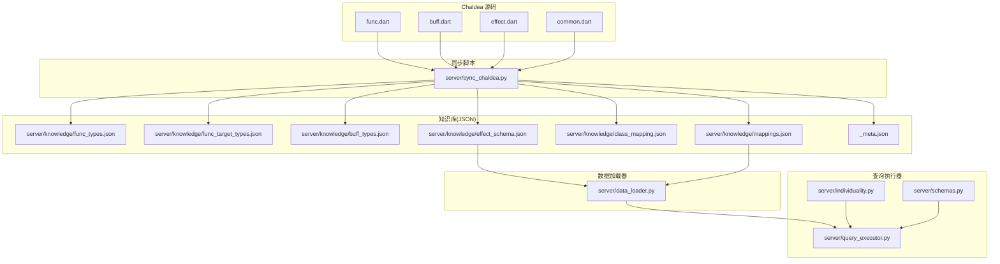
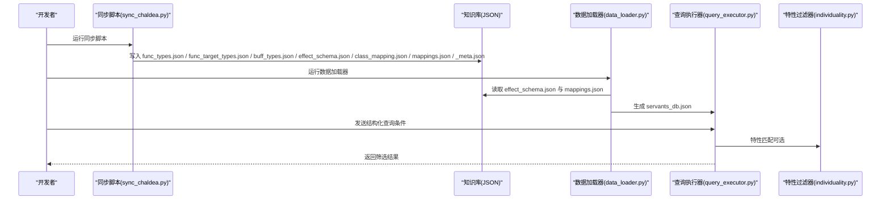
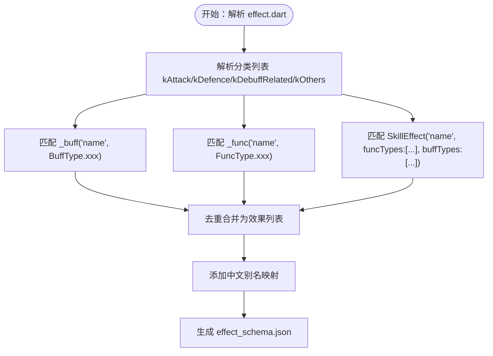
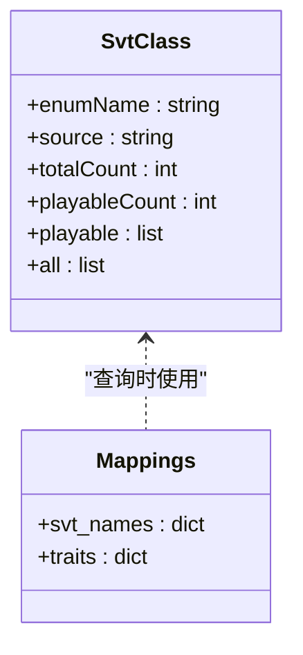
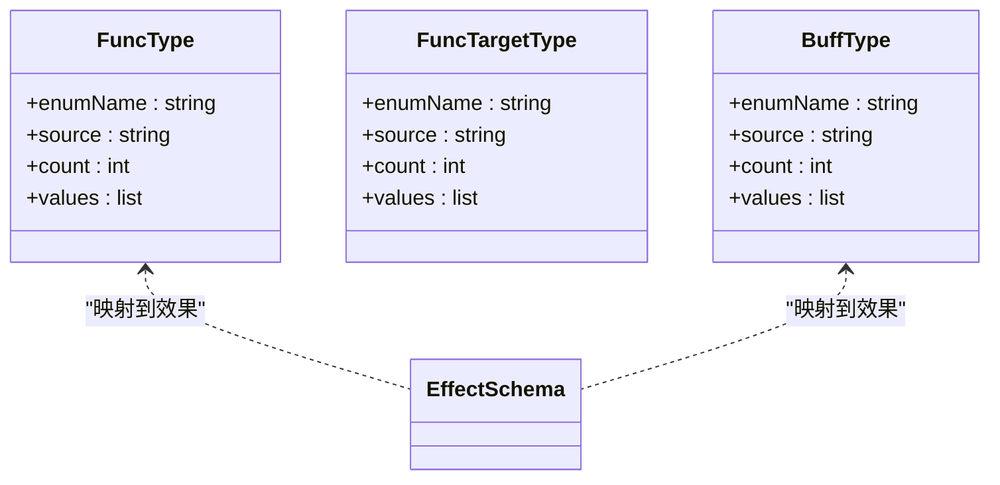
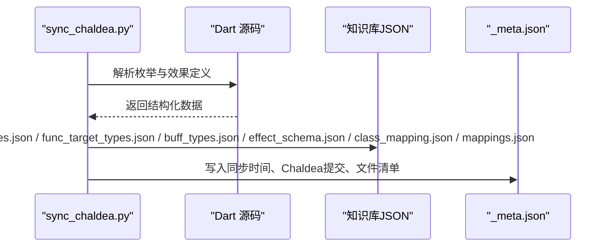
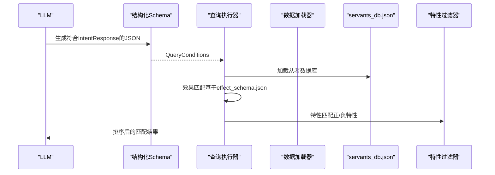
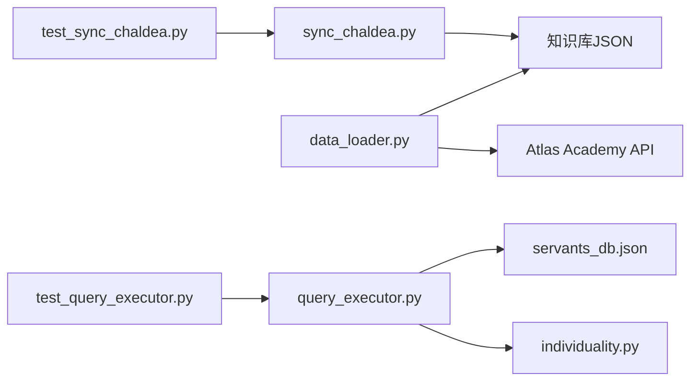

# 知识库系统

<cite>
**本文引用的文件**
- [server/sync_chaldea.py](file://server/sync_chaldea.py)
- [server/data_loader.py](file://server/data_loader.py)
- [server/query_executor.py](file://server/query_executor.py)
- [server/individuality.py](file://server/individuality.py)
- [server/schemas.py](file://server/schemas.py)
- [server/knowledge/_meta.json](file://server/knowledge/_meta.json)
- [server/knowledge/buff_types.json](file://server/knowledge/buff_types.json)
- [server/knowledge/class_mapping.json](file://server/knowledge/class_mapping.json)
- [server/knowledge/effect_schema.json](file://server/knowledge/effect_schema.json)
- [server/knowledge/func_target_types.json](file://server/knowledge/func_target_types.json)
- [server/knowledge/func_types.json](file://server/knowledge/func_types.json)
- [server/knowledge/mappings.json](file://server/knowledge/mappings.json)
- [tests/test_sync_chaldea.py](file://tests/test_sync_chaldea.py)
- [tests/test_query_executor.py](file://tests/test_query_executor.py)
</cite>

## 目录
1. [简介](#简介)
2. [项目结构](#项目结构)
3. [核心组件](#核心组件)
4. [架构总览](#架构总览)
5. [详细组件分析](#详细组件分析)
6. [依赖关系分析](#依赖关系分析)
7. [性能考量](#性能考量)
8. [故障排查指南](#故障排查指南)
9. [结论](#结论)
10. [附录](#附录)

## 简介
本文件面向Laplace项目的知识库系统，系统性说明以下内容：
- 技能效果分类体系的构建原理与55种技能效果的定义及中文别名映射
- 职阶映射系统的实现与多语言支持
- 功能类型（FuncType）与效果类型（Effect Schema）的分类标准
- 知识库的同步机制（从Chaldea源码提取知识的自动化流程）
- 知识库的维护策略与更新频率建议
- 知识库扩展与定制方法
- 知识库数据结构定义与示例
- 知识库在查询过程中的作用与影响

## 项目结构
知识库系统由“同步脚本 + 知识库JSON + 数据加载器 + 查询执行器 + 特性过滤器 + LLM结构化Schema”组成，形成从Chaldea源码到本地知识库再到查询执行的完整链路。

图表来源
- [server/sync_chaldea.py:32-36](file://server/sync_chaldea.py#L32-L36)
- [server/knowledge/func_types.json:1-527](file://server/knowledge/func_types.json#L1-L527)
- [server/knowledge/func_target_types.json:1-147](file://server/knowledge/func_target_types.json#L1-L147)
- [server/knowledge/buff_types.json:1-991](file://server/knowledge/buff_types.json#L1-L991)
- [server/knowledge/effect_schema.json:1-694](file://server/knowledge/effect_schema.json#L1-L694)
- [server/knowledge/class_mapping.json:1-478](file://server/knowledge/class_mapping.json#L1-L478)
- [server/knowledge/mappings.json:1-6530](file://server/knowledge/mappings.json#L1-L6530)
- [server/data_loader.py:44-62](file://server/data_loader.py#L44-L62)
- [server/query_executor.py:53-88](file://server/query_executor.py#L53-L88)
- [server/individuality.py:58-77](file://server/individuality.py#L58-L77)
- [server/schemas.py:25-44](file://server/schemas.py#L25-L44)

章节来源
- [server/sync_chaldea.py:32-36](file://server/sync_chaldea.py#L32-L36)
- [server/knowledge/_meta.json:1-12](file://server/knowledge/_meta.json#L1-L12)

## 核心组件
- 同步脚本：从Chaldea Dart源码解析枚举与效果分类，生成JSON知识库，并记录元数据
- 知识库JSON：包含功能类型、目标类型、Buff类型、效果分类、职阶映射、多语言映射
- 数据加载器：从Atlas Academy API抓取从者数据，结合知识库提取技能效果与NP充能
- 查询执行器：接收LLM结构化意图，按条件筛选从者
- 特性过滤器：实现FGO特性（含正负号）的匹配逻辑
- 结构化Schema：约束LLM输出，确保查询意图可执行

章节来源
- [server/sync_chaldea.py:308-429](file://server/sync_chaldea.py#L308-L429)
- [server/data_loader.py:44-62](file://server/data_loader.py#L44-L62)
- [server/query_executor.py:53-88](file://server/query_executor.py#L53-L88)
- [server/individuality.py:58-77](file://server/individuality.py#L58-L77)
- [server/schemas.py:25-44](file://server/schemas.py#L25-L44)

## 架构总览
知识库系统采用“抽取-存储-应用”的三层架构：
- 抽取层：同步脚本解析Chaldea源码，生成标准化JSON
- 存储层：知识库JSON文件，带元数据追踪
- 应用层：数据加载器与查询执行器，配合特性过滤与结构化Schema

图表来源
- [server/sync_chaldea.py:308-429](file://server/sync_chaldea.py#L308-L429)
- [server/data_loader.py:332-363](file://server/data_loader.py#L332-L363)
- [server/query_executor.py:53-88](file://server/query_executor.py#L53-L88)
- [server/individuality.py:58-77](file://server/individuality.py#L58-L77)

## 详细组件分析

### 技能效果分类体系与55种效果
- 分类维度
  - 攻击类：如“攻击力提升”“宝具威力提升”“特攻”“即死”等
  - 防御类：如“无敌”“回避”“被伤害减免”“即死耐性提升”等
  - 弱体类：如“状态付与率提升”“弱体成功率提升”“弱体无效”等
  - 其他类：如“技能CD缩减”“经验值获取量提升”“活动掉落提升”等
- 关键映射
  - 效果名 ↔ 功能类型（FuncType）：如“NP增加”映射到FuncType.gainNp
  - 效果名 ↔ Buff类型（BuffType）：如“攻击力提升”映射到BuffType.upAtk
  - 效果名 ↔ 中文别名：如“攻击力提升”“加攻”
- 55种效果的来源
  - 由同步脚本解析effect.dart中的SkillEffect静态定义，自动聚合分类、FuncType/BuffType映射，并补充中文别名

图表来源
- [server/sync_chaldea.py:91-204](file://server/sync_chaldea.py#L91-L204)
- [server/knowledge/effect_schema.json:1-694](file://server/knowledge/effect_schema.json#L1-L694)

章节来源
- [server/sync_chaldea.py:91-204](file://server/sync_chaldea.py#L91-L204)
- [server/knowledge/effect_schema.json:1-694](file://server/knowledge/effect_schema.json#L1-L694)
- [tests/test_sync_chaldea.py:26-58](file://tests/test_sync_chaldea.py#L26-L58)

### 职阶映射系统与多语言支持
- 职阶枚举（SvtClass）
  - 来源：common.dart中的SvtClass枚举
  - 结构：包含总数、可用职阶数量、可用职阶列表、全部职阶列表
  - 可用职阶：筛选值域限定为玩家可选范围
- 多语言映射
  - 来源：从chaldea-data下载svt_names.json与trait.json
  - 结构：svt_names包含JP/CN/TW/NA/KR等语言的名称映射；traits为特性ID映射
- 同步流程
  - 同步脚本下载并写入mappings.json，供数据加载器与查询执行器使用

图表来源
- [server/knowledge/class_mapping.json:1-478](file://server/knowledge/class_mapping.json#L1-L478)
- [server/knowledge/mappings.json:1-6530](file://server/knowledge/mappings.json#L1-L6530)

章节来源
- [server/sync_chaldea.py:368-394](file://server/sync_chaldea.py#L368-L394)
- [server/knowledge/class_mapping.json:1-478](file://server/knowledge/class_mapping.json#L1-L478)
- [server/knowledge/mappings.json:1-6530](file://server/knowledge/mappings.json#L1-L6530)

### 功能类型与效果类型分类标准
- 功能类型（FuncType）
  - 来源：func.dart中的FuncType枚举
  - 用途：描述技能/宝具函数的行为（如伤害、NP获取、状态赋予、即死等）
  - 示例：gainNp、damage、addState、instantDeath等
- 目标类型（FuncTargetType）
  - 来源：func.dart中的FuncTargetType枚举
  - 用途：描述函数作用对象（自身、全体、敌人、随机等）
- Buff类型（BuffType）
  - 来源：buff.dart中的BuffType枚举
  - 用途：描述状态效果（如加攻、无敌、回避、即死耐性等）

图表来源
- [server/knowledge/func_types.json:1-527](file://server/knowledge/func_types.json#L1-L527)
- [server/knowledge/func_target_types.json:1-147](file://server/knowledge/func_target_types.json#L1-L147)
- [server/knowledge/buff_types.json:1-991](file://server/knowledge/buff_types.json#L1-L991)
- [server/knowledge/effect_schema.json:1-694](file://server/knowledge/effect_schema.json#L1-L694)

章节来源
- [server/knowledge/func_types.json:1-527](file://server/knowledge/func_types.json#L1-L527)
- [server/knowledge/func_target_types.json:1-147](file://server/knowledge/func_target_types.json#L1-L147)
- [server/knowledge/buff_types.json:1-991](file://server/knowledge/buff_types.json#L1-L991)
- [server/knowledge/effect_schema.json:1-694](file://server/knowledge/effect_schema.json#L1-L694)

### 知识库同步机制（从Chaldea源码提取）
- 抽取范围
  - FuncType：功能类型枚举
  - FuncTargetType：目标类型枚举
  - BuffType：Buff类型枚举
  - SkillEffect：效果分类与映射
  - SvtClass：职阶映射
  - 多语言映射：svt_names.json、trait.json
- 抽取策略
  - 正则解析Dart源码，不依赖SDK
  - 幂等写入，重复运行覆盖旧文件
  - 生成元数据文件记录同步时间、Chaldea提交、文件大小
- 下载与校验
  - 从chaldea-data下载映射数据
  - 记录Chaldea仓库commit作为版本依据

图表来源
- [server/sync_chaldea.py:308-429](file://server/sync_chaldea.py#L308-L429)
- [server/knowledge/_meta.json:1-12](file://server/knowledge/_meta.json#L1-L12)

章节来源
- [server/sync_chaldea.py:308-429](file://server/sync_chaldea.py#L308-L429)
- [server/knowledge/_meta.json:1-12](file://server/knowledge/_meta.json#L1-L12)

### 知识库在查询过程中的作用与影响
- 数据加载阶段
  - 读取effect_schema.json构建效果匹配索引（按FuncType与BuffType）
  - 读取mappings.json进行多语言名称映射
  - 从Atlas Academy API抓取从者数据，提取NP充能与技能效果
- 查询执行阶段
  - 接收结构化查询条件（稀有度、职阶、名称、效果、特性、性别、阵营、配卡、宝具颜色/目标等）
  - 通过效果匹配索引快速定位候选从者
  - 特性过滤器按正负号规则严格匹配
  - 最终按稀有度与编号排序返回结果

图表来源
- [server/schemas.py:25-44](file://server/schemas.py#L25-L44)
- [server/query_executor.py:53-88](file://server/query_executor.py#L53-L88)
- [server/data_loader.py:332-363](file://server/data_loader.py#L332-L363)
- [server/individuality.py:58-77](file://server/individuality.py#L58-L77)

章节来源
- [server/schemas.py:25-44](file://server/schemas.py#L25-L44)
- [server/query_executor.py:53-88](file://server/query_executor.py#L53-L88)
- [server/data_loader.py:332-363](file://server/data_loader.py#L332-L363)
- [server/individuality.py:58-77](file://server/individuality.py#L58-L77)

## 依赖关系分析
- 同步脚本依赖Chaldea源码路径与网络访问
- 数据加载器依赖知识库JSON与外部API
- 查询执行器依赖数据库缓存与特性过滤器
- 测试覆盖了同步脚本与查询执行器的关键行为

图表来源
- [server/sync_chaldea.py:308-429](file://server/sync_chaldea.py#L308-L429)
- [server/data_loader.py:91-102](file://server/data_loader.py#L91-L102)
- [server/query_executor.py:41-50](file://server/query_executor.py#L41-L50)
- [tests/test_sync_chaldea.py:1-58](file://tests/test_sync_chaldea.py#L1-L58)
- [tests/test_query_executor.py:1-172](file://tests/test_query_executor.py#L1-L172)

章节来源
- [server/sync_chaldea.py:308-429](file://server/sync_chaldea.py#L308-L429)
- [server/data_loader.py:91-102](file://server/data_loader.py#L91-L102)
- [server/query_executor.py:41-50](file://server/query_executor.py#L41-L50)
- [tests/test_sync_chaldea.py:1-58](file://tests/test_sync_chaldea.py#L1-L58)
- [tests/test_query_executor.py:1-172](file://tests/test_query_executor.py#L1-L172)

## 性能考量
- 索引构建：数据加载器在启动时一次性构建效果匹配索引，避免每次查询重复扫描
- 缓存策略：查询执行器对数据库与昵称映射进行全局缓存，减少IO开销
- 精细化匹配：通过目标类型过滤与卡色效果二次精炼，减少误判带来的额外计算
- API限流：数据加载器对外部API请求设置超时，避免阻塞

章节来源
- [server/data_loader.py:64-84](file://server/data_loader.py#L64-L84)
- [server/query_executor.py:17-26](file://server/query_executor.py#L17-L26)

## 故障排查指南
- 同步失败
  - 确认Chaldea源码路径存在且可读
  - 检查网络连通性以下载映射数据
  - 查看元数据文件确认Chaldea提交与文件清单
- 查询无结果
  - 检查effect_schema.json是否正确加载
  - 核对查询条件（效果名、目标类型、特性ID）是否与知识库一致
  - 使用“OR”组合查询验证效果名拼写
- 名称匹配问题
  - 检查mappings.json是否加载成功
  - 使用昵称映射文件辅助名称规范化匹配
- 特性匹配异常
  - 确认特性ID正负号含义（负数表示排斥）
  - 检查查询条件中排除特性是否与从者实际特性冲突

章节来源
- [server/sync_chaldea.py:313-318](file://server/sync_chaldea.py#L313-L318)
- [server/query_executor.py:133-192](file://server/query_executor.py#L133-L192)
- [server/individuality.py:58-77](file://server/individuality.py#L58-L77)

## 结论
Laplace的知识库系统通过从Chaldea源码自动化抽取，形成标准化的JSON知识库，并在数据加载与查询执行阶段发挥关键作用。其设计强调：
- 可维护性：同步脚本幂等、元数据追踪、正则解析不依赖SDK
- 可扩展性：效果分类、职阶映射、多语言映射均可增量更新
- 可靠性：测试覆盖关键流程，查询执行器具备缓存与索引优化
建议定期同步Chaldea源码，保持知识库与游戏最新版本一致，并持续完善中文别名与多语言映射。

## 附录

### 知识库数据结构定义与示例
- 元数据（_meta.json）
  - 字段：syncedAt、chaldeaCommit、chaldeaPath、files
  - 示例：见文件内容
- 功能类型（func_types.json）
  - 字段：enumName、source、count、values
  - values项：name、value
- 目标类型（func_target_types.json）
  - 字段：enumName、source、count、values
  - values项：name、value
- Buff类型（buff_types.json）
  - 字段：enumName、source、count、values
  - values项：name、value（部分条目可能包含label/baseClassId）
- 效果分类（effect_schema.json）
  - 字段：source、count、categories、effects
  - effects项：name、category、funcTypes、buffTypes、aliases_zh
- 职阶映射（class_mapping.json）
  - 字段：enumName、source、totalCount、playableCount、playable、all
  - playable/all项：name、value（部分包含label/baseClassId）
- 多语言映射（mappings.json）
  - 字段：svt_names、traits
  - svt_names项：原始名 → 多语言映射
  - traits项：特性ID → 名称映射

章节来源
- [server/knowledge/_meta.json:1-12](file://server/knowledge/_meta.json#L1-L12)
- [server/knowledge/func_types.json:1-527](file://server/knowledge/func_types.json#L1-L527)
- [server/knowledge/func_target_types.json:1-147](file://server/knowledge/func_target_types.json#L1-L147)
- [server/knowledge/buff_types.json:1-991](file://server/knowledge/buff_types.json#L1-L991)
- [server/knowledge/effect_schema.json:1-694](file://server/knowledge/effect_schema.json#L1-L694)
- [server/knowledge/class_mapping.json:1-478](file://server/knowledge/class_mapping.json#L1-L478)
- [server/knowledge/mappings.json:1-6530](file://server/knowledge/mappings.json#L1-L6530)

### 维护策略与更新频率
- 更新频率建议
  - 游戏版本更新后，同步Chaldea源码并重新运行同步脚本
  - 建议每周或按需运行，确保效果分类与职阶映射及时更新
- 维护要点
  - 保持同步脚本对新语法的兼容（正则适配）
  - 扩展中文别名映射，提升查询体验
  - 定期校验mappings.json完整性与准确性

章节来源
- [server/sync_chaldea.py:308-429](file://server/sync_chaldea.py#L308-L429)

### 扩展与定制指南
- 扩展效果分类
  - 在effect.dart中新增SkillEffect定义，同步脚本会自动识别
  - 为效果添加中文别名，完善aliases_zh
- 扩展职阶映射
  - 在common.dart中新增SvtClass条目，同步脚本会自动收录
  - 如需特殊label/baseClassId，保持与现有结构一致
- 扩展多语言映射
  - 从chaldea-data下载最新svt_names.json与trait.json，替换mappings.json
- 查询条件定制
  - 在结构化Schema中扩展字段，确保LLM输出与执行器解析一致
  - 在查询执行器中增加新的过滤逻辑（如新属性、新组合条件）

章节来源
- [server/sync_chaldea.py:206-270](file://server/sync_chaldea.py#L206-L270)
- [server/schemas.py:25-44](file://server/schemas.py#L25-L44)
- [server/query_executor.py:53-88](file://server/query_executor.py#L53-L88)