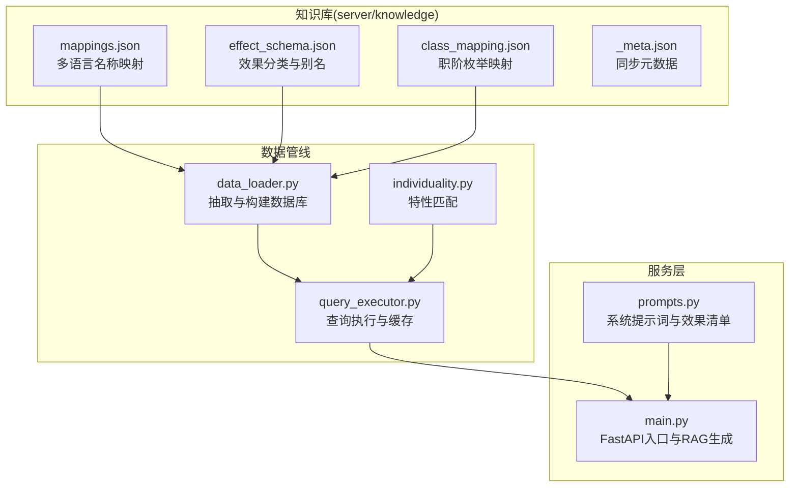
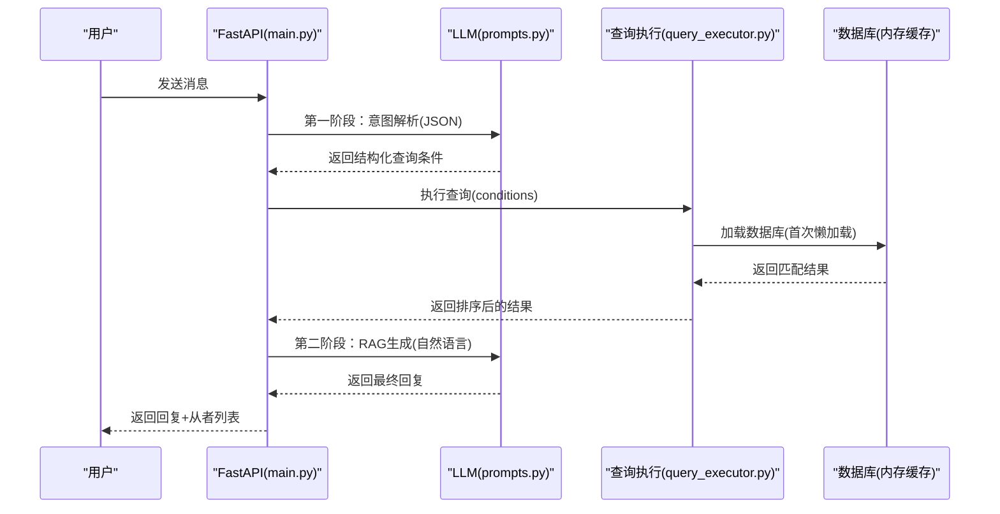
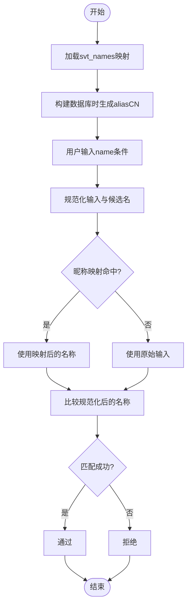
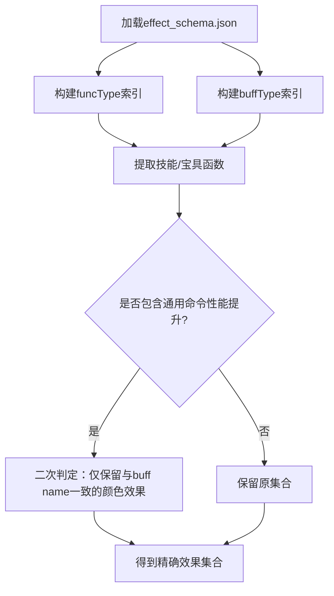
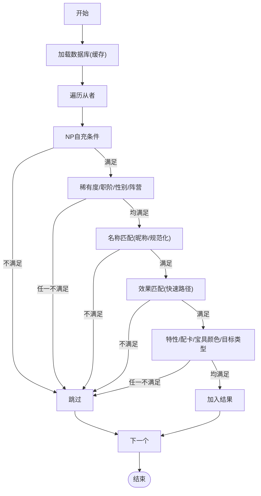
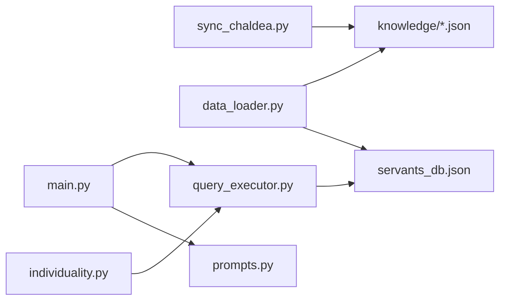

# 知识映射系统

<cite>
**本文引用的文件**
- [server/knowledge/mappings.json](file://server/knowledge/mappings.json)
- [server/knowledge/_meta.json](file://server/knowledge/_meta.json)
- [server/knowledge/effect_schema.json](file://server/knowledge/effect_schema.json)
- [server/knowledge/class_mapping.json](file://server/knowledge/class_mapping.json)
- [server/data_loader.py](file://server/data_loader.py)
- [server/query_executor.py](file://server/query_executor.py)
- [server/main.py](file://server/main.py)
- [server/sync_chaldea.py](file://server/sync_chaldea.py)
- [server/individuality.py](file://server/individuality.py)
- [server/prompts.py](file://server/prompts.py)
- [tests/test_query_executor.py](file://tests/test_query_executor.py)
</cite>

## 目录
1. [简介](#简介)
2. [项目结构](#项目结构)
3. [核心组件](#核心组件)
4. [架构总览](#架构总览)
5. [详细组件分析](#详细组件分析)
6. [依赖分析](#依赖分析)
7. [性能考量](#性能考量)
8. [故障排查指南](#故障排查指南)
9. [结论](#结论)
10. [附录](#附录)

## 简介
本文件面向Laplace知识映射系统，围绕以下目标展开：
- 解释mappings.json中各种映射关系的设计原理与实现机制
- 说明元数据系统（_meta.json）如何管理知识库的整体结构与版本信息
- 阐述映射系统的查询优化策略与缓存机制
- 提供映射系统的扩展方法与维护最佳实践
- 给出具体映射规则示例与查询匹配逻辑说明

## 项目结构
Laplace采用“知识库 + 数据抽取 + 查询执行 + API服务”的分层架构。核心知识库位于server/knowledge目录，包含效果分类、枚举映射、多语言名称映射等；数据抽取与构建在server/data_loader.py中完成；查询执行在server/query_executor.py中完成；FastAPI入口在server/main.py中；知识库同步在server/sync_chaldea.py中完成。

图表来源
- [server/knowledge/mappings.json](file://server/knowledge/mappings.json)
- [server/knowledge/effect_schema.json](file://server/knowledge/effect_schema.json)
- [server/knowledge/class_mapping.json](file://server/knowledge/class_mapping.json)
- [server/knowledge/_meta.json](file://server/knowledge/_meta.json)
- [server/data_loader.py](file://server/data_loader.py)
- [server/query_executor.py](file://server/query_executor.py)
- [server/individuality.py](file://server/individuality.py)
- [server/prompts.py](file://server/prompts.py)
- [server/main.py](file://server/main.py)

章节来源
- [server/data_loader.py:1-363](file://server/data_loader.py#L1-L363)
- [server/query_executor.py:1-305](file://server/query_executor.py#L1-L305)
- [server/main.py:1-228](file://server/main.py#L1-L228)
- [server/sync_chaldea.py:1-429](file://server/sync_chaldea.py#L1-L429)

## 核心组件
- 知识库文件
  - mappings.json：多语言名称映射（如从者名的CN/TW/NA/KR等）
  - effect_schema.json：技能效果分类、funcType/buffType映射及中文别名
  - class_mapping.json：职阶枚举与可玩职阶集合
  - _meta.json：同步时间、Chaldea提交号、文件清单等元数据
- 数据管线
  - data_loader.py：从Atlas Academy API抓取数据，结合知识库构建通用数据库
  - query_executor.py：加载数据库并执行查询，内置缓存与快速路径
  - individuality.py：特性匹配逻辑（含正负特性分离与AND/OR语义）
- 服务层
  - prompts.py：系统提示词，注入效果清单与查询约束
  - main.py：FastAPI入口，RAG生成最终回复

章节来源
- [server/knowledge/mappings.json:1-800](file://server/knowledge/mappings.json#L1-L800)
- [server/knowledge/effect_schema.json:1-694](file://server/knowledge/effect_schema.json#L1-L694)
- [server/knowledge/class_mapping.json:1-478](file://server/knowledge/class_mapping.json#L1-L478)
- [server/knowledge/_meta.json:1-12](file://server/knowledge/_meta.json#L1-L12)
- [server/data_loader.py:44-329](file://server/data_loader.py#L44-L329)
- [server/query_executor.py:41-305](file://server/query_executor.py#L41-L305)
- [server/individuality.py:8-78](file://server/individuality.py#L8-L78)
- [server/prompts.py:15-208](file://server/prompts.py#L15-L208)
- [server/main.py:35-48](file://server/main.py#L35-L48)

## 架构总览
系统通过“知识库同步 → 数据抽取构建 → 查询执行 → API服务”的流水线工作。知识库同步脚本从Chaldea源码解析枚举与效果定义，生成JSON文件并记录元数据；数据抽取脚本加载知识库，从外部API抓取数据并构建通用数据库；查询执行器加载数据库并执行条件过滤；FastAPI入口负责意图解析、查询执行与RAG生成。

图表来源
- [server/main.py:87-218](file://server/main.py#L87-L218)
- [server/prompts.py:175-207](file://server/prompts.py#L175-L207)
- [server/query_executor.py:53-87](file://server/query_executor.py#L53-L87)
- [server/query_executor.py:41-50](file://server/query_executor.py#L41-L50)

## 详细组件分析

### mappings.json：多语言名称映射与设计原理
- 设计目标
  - 将英文原名与多语言译名进行统一映射，便于中文检索与展示
  - 为昵称映射提供基础，支持模糊匹配与规范化
- 结构特征
  - 顶层键为svt_names，值为从者名到各语言的映射字典
  - 每个从者名下包含JP/CN/TW/NA/KR等键，缺失值可能为null
- 实现机制
  - 在数据抽取阶段加载svt_names映射，用于为从者生成aliasCN
  - 在查询阶段，昵称映射文件nicknames.json与normalize_text配合，支持昵称到正式名称的转换与模糊匹配
- 查询匹配逻辑
  - 名称匹配时，先尝试昵称映射，再对比英文、中文、日文规范化后的名称
  - 规范化规则去除空白、标点与常见分隔符，提高匹配鲁棒性

图表来源
- [server/data_loader.py:54-61](file://server/data_loader.py#L54-L61)
- [server/query_executor.py:133-191](file://server/query_executor.py#L133-L191)
- [server/query_executor.py:22-26](file://server/query_executor.py#L22-L26)

章节来源
- [server/knowledge/mappings.json:1-800](file://server/knowledge/mappings.json#L1-L800)
- [server/data_loader.py:54-61](file://server/data_loader.py#L54-L61)
- [server/query_executor.py:133-191](file://server/query_executor.py#L133-L191)
- [server/query_executor.py:22-26](file://server/query_executor.py#L22-L26)

### 元数据系统（_meta.json）：版本与结构管理
- 元数据字段
  - syncedAt：同步完成的时间戳
  - chaldeaCommit：Chaldea仓库的提交号
  - chaldeaPath：Chaldea仓库本地路径
  - files：各知识库文件的条目数量
- 作用
  - 追踪知识库来源与版本，便于审计与回溯
  - 为同步脚本提供一致性校验与幂等保障
- 维护建议
  - 同步完成后自动更新，避免手工修改
  - 在CI中校验文件数量与版本号一致性

章节来源
- [server/knowledge/_meta.json:1-12](file://server/knowledge/_meta.json#L1-L12)
- [server/sync_chaldea.py:396-412](file://server/sync_chaldea.py#L396-L412)

### 效果分类与匹配：effect_schema.json与data_loader.py
- 效果分类
  - categories：attack/defence/debuff/others四大类
  - effects：每个效果包含name、category、funcTypes、buffTypes、aliases_zh
- 匹配索引
  - data_loader.py构建“funcType→效果名集合”和“buffType→效果名集合”的倒排索引
  - 通过函数类型与状态类型快速定位可能的效果集合
- 卡色净化
  - refine_card_effects针对“通用命令性能提升”与“具体颜色提升”进行二次判定，避免误判三色提升

图表来源
- [server/data_loader.py:64-84](file://server/data_loader.py#L64-L84)
- [server/data_loader.py:151-178](file://server/data_loader.py#L151-L178)
- [server/knowledge/effect_schema.json:10-694](file://server/knowledge/effect_schema.json#L10-L694)

章节来源
- [server/data_loader.py:64-84](file://server/data_loader.py#L64-L84)
- [server/data_loader.py:151-178](file://server/data_loader.py#L151-L178)
- [server/knowledge/effect_schema.json:10-694](file://server/knowledge/effect_schema.json#L10-L694)

### 职阶映射：class_mapping.json
- 用途
  - 提供SvtClass枚举与可玩职阶集合，便于查询时的职阶过滤
- 结构
  - enumName/source/count：元信息
  - playable/all：可玩与全部职阶列表
- 查询应用
  - 在查询执行器中，className条件会与该映射进行大小写不敏感的匹配

章节来源
- [server/knowledge/class_mapping.json:1-478](file://server/knowledge/class_mapping.json#L1-L478)
- [server/query_executor.py:127-131](file://server/query_executor.py#L127-L131)

### 查询执行与缓存：query_executor.py
- 缓存策略
  - 全局变量缓存servants_db与nicknames，进程内常驻，避免重复IO
  - 数据库加载时打印统计信息，便于监控
- 快速路径
  - 对skillEffect进行快速集合包含判断，若不在集合中直接拒绝
  - 对目标类型筛选时，再遍历详细技能效果列表
- 条件组合
  - 支持NP自充、稀有度、职阶、名称、效果（单/多）、特性、性别、阵营、配卡、宝具颜色与目标类型等多维条件
  - 多效果AND/OR逻辑通过skillEffectsOp控制
- 排序
  - 按稀有度降序、collectionNo升序排序

图表来源
- [server/query_executor.py:53-87](file://server/query_executor.py#L53-L87)
- [server/query_executor.py:90-261](file://server/query_executor.py#L90-L261)
- [server/query_executor.py:264-289](file://server/query_executor.py#L264-L289)

章节来源
- [server/query_executor.py:17-50](file://server/query_executor.py#L17-L50)
- [server/query_executor.py:53-87](file://server/query_executor.py#L53-L87)
- [server/query_executor.py:90-261](file://server/query_executor.py#L90-L261)
- [server/query_executor.py:264-289](file://server/query_executor.py#L264-L289)

### 特性匹配：individuality.py
- 正负特性分离
  - 将查询条件中的特性ID按正负分离，正数为必须拥有，负数为不能拥有
- 逻辑语义
  - 必须拥有（AND）：查询条件中的正特性集合需全部存在于从者特性集中
  - 不可拥有（排除）：查询条件中的负特性集合与从者特性集交集为空
- 应用
  - 在查询执行器中，先检查必须拥有，再检查排除条件，满足才通过

章节来源
- [server/individuality.py:8-78](file://server/individuality.py#L8-L78)
- [server/query_executor.py:221-227](file://server/query_executor.py#L221-L227)

### 知识库同步：sync_chaldea.py
- 功能
  - 从Chaldea源码解析枚举与效果定义，生成JSON知识库
  - 下载多语言映射与特性映射，生成mappings.json
  - 生成_meta.json记录同步元数据
- 正则解析
  - 使用正则表达式解析Dart枚举与效果定义，避免依赖Dart SDK
- 幂等性
  - 重复运行覆盖旧文件，保证一致性

章节来源
- [server/sync_chaldea.py:43-84](file://server/sync_chaldea.py#L43-L84)
- [server/sync_chaldea.py:91-203](file://server/sync_chaldea.py#L91-L203)
- [server/sync_chaldea.py:308-418](file://server/sync_chaldea.py#L308-L418)

### API服务与提示词：main.py与prompts.py
- API服务
  - 启动时预加载数据库，减少首请求延迟
  - 两阶段LLM流程：意图解析(JSON)与RAG生成(自然语言)
  - 限制返回数量，避免响应过大
- 提示词
  - 注入效果分类清单，约束LLM输出严格JSON
  - 提供中文别名映射与查询字段说明，降低歧义

章节来源
- [server/main.py:81-84](file://server/main.py#L81-L84)
- [server/main.py:87-218](file://server/main.py#L87-L218)
- [server/prompts.py:15-43](file://server/prompts.py#L15-L43)
- [server/prompts.py:167-172](file://server/prompts.py#L167-L172)

## 依赖分析
- 组件耦合
  - data_loader.py依赖effect_schema.json与mappings.json构建索引与数据库
  - query_executor.py依赖data_loader.py生成的数据库与效果索引
  - main.py依赖query_executor.py与prompts.py完成意图解析与RAG生成
  - sync_chaldea.py生成知识库文件并更新_meta.json
- 外部依赖
  - Atlas Academy API：提供从者数据
  - Chaldea源码：提供效果与枚举定义
- 潜在循环依赖
  - 无直接循环依赖，模块职责清晰

图表来源
- [server/sync_chaldea.py:308-418](file://server/sync_chaldea.py#L308-L418)
- [server/data_loader.py:44-329](file://server/data_loader.py#L44-L329)
- [server/query_executor.py:41-87](file://server/query_executor.py#L41-L87)
- [server/main.py:87-218](file://server/main.py#L87-L218)
- [server/prompts.py:15-43](file://server/prompts.py#L15-L43)
- [server/individuality.py:58-78](file://server/individuality.py#L58-L78)

章节来源
- [server/sync_chaldea.py:308-418](file://server/sync_chaldea.py#L308-L418)
- [server/data_loader.py:44-329](file://server/data_loader.py#L44-L329)
- [server/query_executor.py:41-87](file://server/query_executor.py#L41-L87)
- [server/main.py:87-218](file://server/main.py#L87-L218)
- [server/prompts.py:15-43](file://server/prompts.py#L15-L43)
- [server/individuality.py:58-78](file://server/individuality.py#L58-L78)

## 性能考量
- 缓存策略
  - 全局缓存servants_db与nicknames，避免重复读取与解析
  - 启动时预加载数据库，降低首请求延迟
- 快速路径
  - 先用集合快速判断效果存在性，再按需进入详细匹配
  - 对NP自充等数值条件使用早期短路判断
- I/O与网络
  - 知识库文件为静态JSON，读取成本低
  - 外部API请求设置超时，避免阻塞
- 排序与返回限制
  - 查询结果按稀有度与collectionNo排序，前端限制返回数量，避免响应过大

章节来源
- [server/query_executor.py:17-50](file://server/query_executor.py#L17-L50)
- [server/main.py:81-84](file://server/main.py#L81-L84)
- [server/data_loader.py:92-102](file://server/data_loader.py#L92-L102)

## 故障排查指南
- 知识库缺失
  - 若effect_schema.json不存在，data_loader.py会提示并仅提取NP充能数据
  - 若mappings.json不存在，svt_names映射为空
- 同步失败
  - 检查Chaldea源码路径与网络连通性
  - 查看_meta.json中的chaldeaCommit与同步时间
- 查询无结果
  - 检查昵称映射与名称规范化规则
  - 确认效果名称与中文别名映射是否正确
  - 核对特性ID是否为正数（必须拥有）或负数（排除）
- 测试验证
  - 使用测试用例验证NP自充、稀有度、职阶、昵称、效果、特性、配卡、宝具颜色与目标类型等场景

章节来源
- [server/data_loader.py:44-52](file://server/data_loader.py#L44-L52)
- [server/sync_chaldea.py:313-317](file://server/sync_chaldea.py#L313-L317)
- [tests/test_query_executor.py:123-171](file://tests/test_query_executor.py#L123-L171)

## 结论
Laplace知识映射系统通过结构化的知识库与高效的查询执行实现了对FGO从者数据的智能检索。mappings.json提供多语言名称映射与昵称支持，effect_schema.json提供效果分类与快速匹配索引，_meta.json确保版本与来源可追溯。查询执行器采用缓存与快速路径策略，结合特性匹配与多维条件组合，满足复杂查询需求。同步脚本保证知识库的持续更新与一致性。

## 附录
- 映射规则示例
  - 从者名映射：svt_names中CN键用于生成aliasCN，便于中文检索
  - 效果别名：effect_schema.json中aliases_zh提供中文别名，便于用户自然语言表达
  - 职阶映射：class_mapping.json提供可玩职阶集合，支持大小写不敏感匹配
- 查询匹配逻辑要点
  - 名称：昵称映射 → 规范化比较 → 英/中/日三语候选
  - 效果：集合快速判断 → 目标类型二次判定
  - 特性：正特性AND、负特性排除
  - 多效果：AND/OR由skillEffectsOp控制
- 扩展与维护最佳实践
  - 通过sync_chaldea.py解析Chaldea源码生成知识库，保持与游戏数据同步
  - 在effect_schema.json中新增效果时，补充funcTypes/buffTypes与中文别名
  - 在mappings.json中新增多语言名称时，确保缺失值为null而非空字符串
  - 通过_meta.json记录同步信息，便于审计与回溯
  - 在query_executor.py中新增条件时，遵循快速路径与早期短路原则

章节来源
- [server/knowledge/mappings.json:1-800](file://server/knowledge/mappings.json#L1-L800)
- [server/knowledge/effect_schema.json:10-694](file://server/knowledge/effect_schema.json#L10-L694)
- [server/knowledge/class_mapping.json:1-478](file://server/knowledge/class_mapping.json#L1-L478)
- [server/sync_chaldea.py:308-418](file://server/sync_chaldea.py#L308-L418)
- [server/query_executor.py:90-261](file://server/query_executor.py#L90-L261)
- [tests/test_query_executor.py:123-171](file://tests/test_query_executor.py#L123-L171)