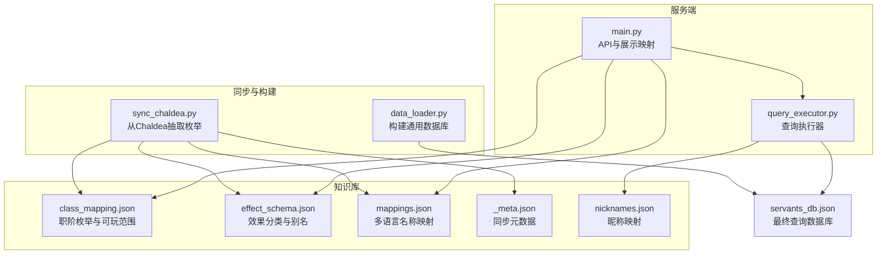
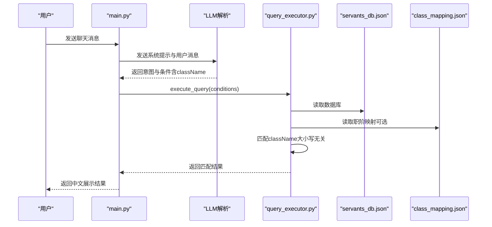
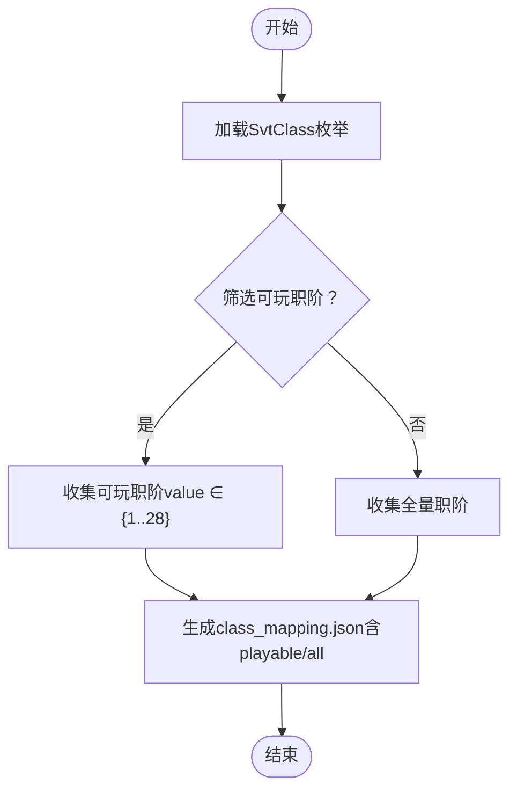
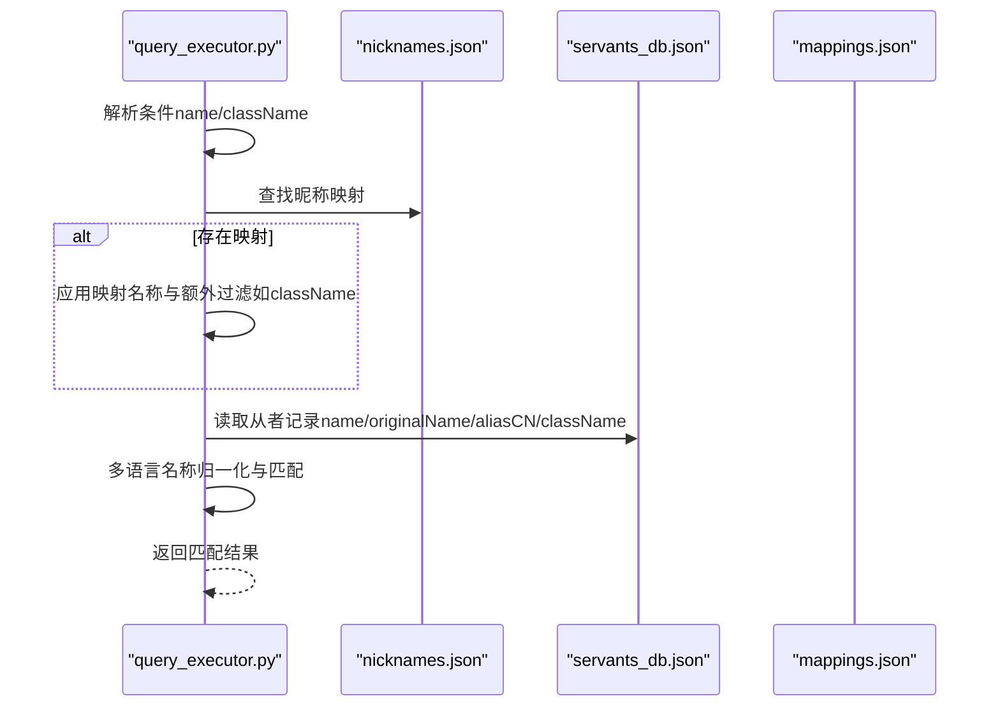
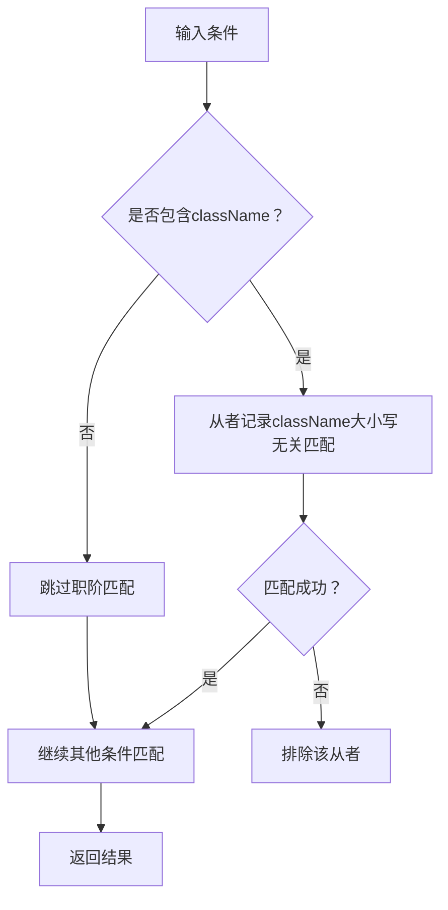
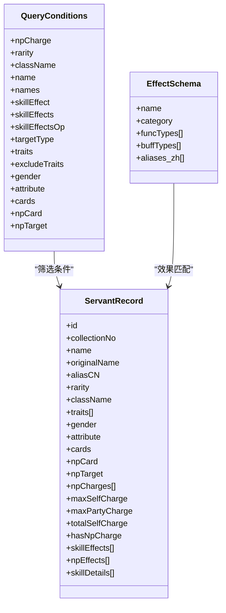
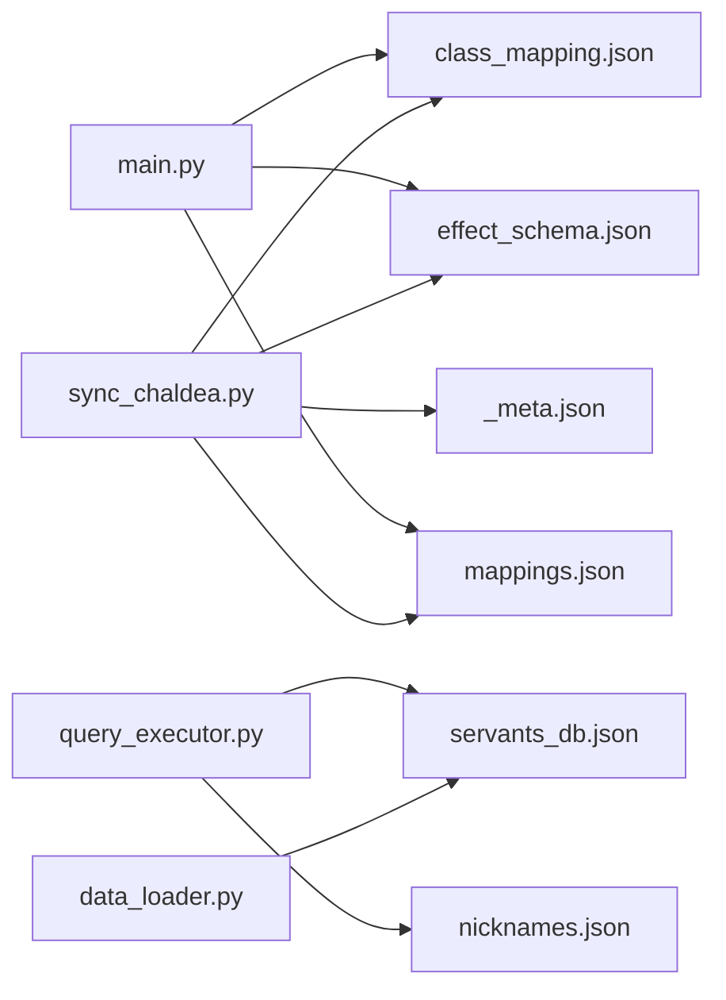

# 职阶映射系统

<cite>
**本文引用的文件**
- [class_mapping.json](file://server/knowledge/class_mapping.json)
- [sync_chaldea.py](file://server/sync_chaldea.py)
- [schemas.py](file://server/schemas.py)
- [query_executor.py](file://server/query_executor.py)
- [main.py](file://server/main.py)
- [data_loader.py](file://server/data_loader.py)
- [mappings.json](file://server/knowledge/mappings.json)
- [_meta.json](file://server/knowledge/_meta.json)
- [nicknames.json](file://server/knowledge/nicknames.json)
- [effect_schema.json](file://server/knowledge/effect_schema.json)
- [servants_db.json](file://server/data/servants_db.json)
</cite>

## 目录
1. [简介](#简介)
2. [项目结构](#项目结构)
3. [核心组件](#核心组件)
4. [架构总览](#架构总览)
5. [详细组件分析](#详细组件分析)
6. [依赖分析](#依赖分析)
7. [性能考虑](#性能考虑)
8. [故障排查指南](#故障排查指南)
9. [结论](#结论)
10. [附录](#附录)

## 简介
本文件面向Laplace项目的职阶映射系统，系统性阐述职阶枚举的定义来源、多语言支持机制、职阶分类标准与范围、查询条件解析中的映射实现、数据结构与扩展方法、以及在从者筛选与技能效果匹配中的应用，并给出维护策略与更新流程建议。文档同时提供可视化图表帮助理解代码与数据流。

## 项目结构
职阶映射系统主要分布在以下模块与知识库文件中：
- 知识库与同步：class_mapping.json、effect_schema.json、mappings.json、_meta.json、nicknames.json
- 服务端逻辑：sync_chaldea.py（从Chaldea源码抽取枚举）、data_loader.py（构建通用数据库）、query_executor.py（查询执行器）、main.py（API层与展示映射）
- 数据输出：servants_db.json（最终查询数据库）

**图表来源**
- [class_mapping.json:1-478](file://server/knowledge/class_mapping.json#L1-L478)
- [sync_chaldea.py:308-429](file://server/sync_chaldea.py#L308-L429)
- [data_loader.py:332-363](file://server/data_loader.py#L332-L363)
- [query_executor.py:53-116](file://server/query_executor.py#L53-L116)
- [main.py:24-51](file://server/main.py#L24-L51)

**章节来源**
- [class_mapping.json:1-478](file://server/knowledge/class_mapping.json#L1-L478)
- [sync_chaldea.py:308-429](file://server/sync_chaldea.py#L308-L429)
- [data_loader.py:332-363](file://server/data_loader.py#L332-L363)
- [query_executor.py:53-116](file://server/query_executor.py#L53-L116)
- [main.py:24-51](file://server/main.py#L24-L51)

## 核心组件
- 职阶枚举与分类：来自Chaldea源码的SvtClass枚举，经sync_chaldea.py解析生成class_mapping.json，包含总数、可玩数量、可玩职阶列表与全量职阶列表，并标注label（如日文简称）与baseClassId（用于Grand系列）。
- 多语言支持：mappings.json提供从者原名到多语言（CN/TW/NA/KR）的映射；nicknames.json提供昵称到正式名称及可选的额外过滤条件（如className）。
- 查询执行器：query_executor.py在执行查询时，将className条件与从者记录中的className进行大小写无关的匹配；同时支持昵称映射与额外过滤条件。
- 展示映射：main.py提供中文展示映射（CLASS_MAP、NP_CARD_MAP、NP_TARGET_MAP），用于将内部枚举值转换为中文展示。
- 效果分类：effect_schema.json提供效果名称与中文别名，配合data_loader.py构建技能效果索引，支撑技能效果筛选。

**章节来源**
- [class_mapping.json:1-478](file://server/knowledge/class_mapping.json#L1-L478)
- [sync_chaldea.py:368-394](file://server/sync_chaldea.py#L368-L394)
- [mappings.json:1-800](file://server/knowledge/mappings.json#L1-L800)
- [nicknames.json:1-51](file://server/knowledge/nicknames.json#L1-L51)
- [query_executor.py:156-161](file://server/query_executor.py#L156-L161)
- [main.py:24-51](file://server/main.py#L24-L51)
- [effect_schema.json:1-694](file://server/knowledge/effect_schema.json#L1-L694)

## 架构总览
职阶映射系统的关键流程如下：
- 同步阶段：sync_chaldea.py从Chaldea源码抽取SvtClass等枚举，生成class_mapping.json；同时下载mappings.json与traits映射，生成_meta.json记录同步信息。
- 构建阶段：data_loader.py读取effect_schema.json与mappings.json，构建通用数据库servants_db.json，其中包含className、技能效果、卡色、宝具信息等字段。
- 查询阶段：main.py接收用户意图解析结果，调用query_executor.execute_query，执行多条件筛选（含className），返回结果并进行中文展示映射。
- 展示阶段：main.py将内部枚举值（如className、npCard、npTarget）映射为中文展示，结合效果别名（effect_schema.json）进行翻译。

**图表来源**
- [main.py:150-242](file://server/main.py#L150-L242)
- [query_executor.py:53-116](file://server/query_executor.py#L53-L116)
- [class_mapping.json:1-478](file://server/knowledge/class_mapping.json#L1-L478)

**章节来源**
- [main.py:150-242](file://server/main.py#L150-L242)
- [query_executor.py:53-116](file://server/query_executor.py#L53-L116)

## 详细组件分析

### 职阶枚举与分类
- 来源与生成：sync_chaldea.py解析Chaldea的SvtClass枚举，筛选出玩家可使用的职阶（如saber/archer/lancer/rider/caster/assassin/berserker/shielder/ruler/alterego/avenger/moonCancer/foreigner/pretender等），并生成class_mapping.json。
- 结构要点：
  - enumName、source、totalCount、playableCount
  - playable：可玩职阶列表，包含name、value、label（日文简称）
  - all：全量职阶列表，包含基础职阶与Grand系列、Beast系列、Unknown/OTHER/MIX等特殊项
  - baseClassId：用于Grand系列职阶与基础职阶的关联
- 职阶范围与标准：
  - 传统职阶：saber、archer、lancer、rider、caster、assassin、berserker、shielder、ruler、alterego、avenger
  - 特殊职阶：moonCancer、foreigner、pretender、beast系列（含beastI/beastII/beastIII/beastIV/beastUnknown等）、Grand系列（对应基础职阶的强化形态）、OTHER/ALL/EXTRA/MIX等占位/聚合项
  - 可玩范围：sync_chaldea.py明确筛选了可玩职阶集合，用于构建可玩职阶列表

**图表来源**
- [sync_chaldea.py:368-394](file://server/sync_chaldea.py#L368-L394)
- [class_mapping.json:1-478](file://server/knowledge/class_mapping.json#L1-L478)

**章节来源**
- [sync_chaldea.py:368-394](file://server/sync_chaldea.py#L368-L394)
- [class_mapping.json:1-478](file://server/knowledge/class_mapping.json#L1-L478)

### 多语言支持机制
- 从者名称多语言映射：mappings.json提供从者原名到多语言（CN/TW/NA/KR）的映射，data_loader.py在构建数据库时读取该映射，将aliasCN写入记录。
- 昵称映射与额外过滤：nicknames.json提供昵称到正式名称的映射，且支持附加过滤条件（如className），query_executor在名称匹配时会优先尝试昵称映射，并根据映射结果应用额外过滤。
- 展示层映射：main.py提供CLASS_MAP、NP_CARD_MAP、NP_TARGET_MAP，将内部枚举值映射为中文展示。

**图表来源**
- [query_executor.py:162-230](file://server/query_executor.py#L162-L230)
- [nicknames.json:1-51](file://server/knowledge/nicknames.json#L1-L51)
- [mappings.json:1-800](file://server/knowledge/mappings.json#L1-L800)

**章节来源**
- [query_executor.py:162-230](file://server/query_executor.py#L162-L230)
- [nicknames.json:1-51](file://server/knowledge/nicknames.json#L1-L51)
- [mappings.json:1-800](file://server/knowledge/mappings.json#L1-L800)

### 职阶映射在查询条件解析中的作用与实现
- 条件字段：schemas.py定义了QueryConditions，其中className为字符串类型，支持单从者查询与多从者对比（names字段）。
- 匹配逻辑：
  - 直接匹配：当conditions包含className时，query_executor对从者记录的className进行大小写无关匹配。
  - 昵称映射：若name存在且命中nicknames.json映射，且映射中包含className，则进一步校验从者className是否一致。
- 多从者对比：当names为非空列表时，分别对每个名称执行查询，合并去重后按稀有度与collectionNo排序。

**图表来源**
- [schemas.py:25-46](file://server/schemas.py#L25-L46)
- [query_executor.py:156-161](file://server/query_executor.py#L156-L161)

**章节来源**
- [schemas.py:25-46](file://server/schemas.py#L25-L46)
- [query_executor.py:156-161](file://server/query_executor.py#L156-L161)

### 职阶数据结构与扩展方法
- class_mapping.json结构要点：
  - enumName、source、totalCount、playableCount
  - playable：可玩职阶数组，元素包含name、value、label（可选）、baseClassId（可选）
  - all：全量职阶数组，包含基础职阶、Grand系列、Beast系列、特殊项等
- 扩展方法：
  - 在Chaldea源码中新增SvtClass枚举项后，重新运行sync_chaldea.py生成class_mapping.json
  - 若需新增可玩职阶范围，可在sync_chaldea.py中调整筛选集合
  - 若需新增展示映射，可在main.py的CLASS_MAP中添加映射条目

**章节来源**
- [class_mapping.json:1-478](file://server/knowledge/class_mapping.json#L1-L478)
- [sync_chaldea.py:368-394](file://server/sync_chaldea.py#L368-L394)
- [main.py:24-51](file://server/main.py#L24-L51)

### 职阶映射在从者筛选与技能效果匹配中的应用
- 从者筛选：className作为筛选条件之一，与稀有度、性别、阵营、卡色、宝具颜色/目标等条件共同作用，最终按稀有度与collectionNo排序。
- 技能效果匹配：effect_schema.json提供效果名称与中文别名，data_loader.py构建效果索引，query_executor在匹配技能效果时先快速检查集合，再按目标类型进行细粒度匹配。

**图表来源**
- [schemas.py:25-46](file://server/schemas.py#L25-L46)
- [effect_schema.json:1-694](file://server/knowledge/effect_schema.json#L1-L694)
- [servants_db.json:1-200](file://server/data/servants_db.json#L1-L200)

**章节来源**
- [schemas.py:25-46](file://server/schemas.py#L25-L46)
- [effect_schema.json:1-694](file://server/knowledge/effect_schema.json#L1-L694)
- [servants_db.json:1-200](file://server/data/servants_db.json#L1-L200)

## 依赖分析
- 同步依赖：sync_chaldea.py依赖Chaldea源码目录（chaldea-center/chaldea）与GitHub上的mappings数据，生成class_mapping.json、effect_schema.json、mappings.json与_meta.json。
- 构建依赖：data_loader.py依赖effect_schema.json与mappings.json，生成servants_db.json。
- 查询依赖：query_executor.py依赖servants_db.json与nicknames.json，执行筛选。
- 展示依赖：main.py依赖class_mapping.json、effect_schema.json与mappings.json，进行中文展示映射。

**图表来源**
- [sync_chaldea.py:308-429](file://server/sync_chaldea.py#L308-L429)
- [data_loader.py:332-363](file://server/data_loader.py#L332-L363)
- [query_executor.py:53-116](file://server/query_executor.py#L53-L116)
- [main.py:24-51](file://server/main.py#L24-L51)

**章节来源**
- [sync_chaldea.py:308-429](file://server/sync_chaldea.py#L308-L429)
- [data_loader.py:332-363](file://server/data_loader.py#L332-L363)
- [query_executor.py:53-116](file://server/query_executor.py#L53-L116)
- [main.py:24-51](file://server/main.py#L24-L51)

## 性能考虑
- 缓存策略：query_executor.py与main.py均采用全局缓存（servants_db、nicknames、effect翻译映射），避免重复加载与计算。
- 匹配优化：名称匹配采用分级策略（精确→子串→反向子串），并进行归一化处理，减少误判与重复计算。
- 排序与限制：查询结果按稀有度降序、collectionNo升序排序，并限制返回数量，避免响应过大。

[本节为通用指导，无需具体文件引用]

## 故障排查指南
- 同步失败：检查Chaldea源码目录是否存在，网络是否可达，GitHub mappings数据是否可下载。
- 职阶不生效：确认className条件与从者记录中的className大小写无关匹配是否正确；若使用昵称映射，检查nicknames.json中是否包含className附加过滤。
- 展示异常：确认main.py中的CLASS_MAP、NP_CARD_MAP、NP_TARGET_MAP是否包含所需映射；检查effect_schema.json是否加载成功。
- 数据缺失：确认servants_db.json是否生成，effect_schema.json与mappings.json是否存在于knowledge目录。

**章节来源**
- [sync_chaldea.py:313-318](file://server/sync_chaldea.py#L313-L318)
- [query_executor.py:156-161](file://server/query_executor.py#L156-L161)
- [main.py:36-51](file://server/main.py#L36-L51)
- [data_loader.py:332-363](file://server/data_loader.py#L332-L363)

## 结论
Laplace的职阶映射系统通过从Chaldea源码抽取SvtClass枚举，结合mappings与nicknames实现多语言与昵称映射，配合查询执行器与展示映射，实现了对从者筛选与技能效果匹配的完整支持。系统具备清晰的同步、构建、查询与展示分层，便于维护与扩展。

[本节为总结，无需具体文件引用]

## 附录

### 维护策略与更新流程
- 更新Chaldea源码：在chaldea-center/chaldea中更新SvtClass等枚举定义。
- 重新同步：运行sync_chaldea.py生成class_mapping.json、effect_schema.json、mappings.json与_meta.json。
- 重建数据库：运行data_loader.py生成servants_db.json。
- 验证与部署：验证查询与展示映射，部署至生产环境。

**章节来源**
- [sync_chaldea.py:308-429](file://server/sync_chaldea.py#L308-L429)
- [data_loader.py:332-363](file://server/data_loader.py#L332-L363)
- [_meta.json:1-12](file://server/knowledge/_meta.json#L1-L12)