# 职阶映射系统

<cite>
**本文档引用的文件**
- [class_mapping.json](file://server/knowledge/class_mapping.json)
- [mappings.json](file://server/knowledge/mappings.json)
- [sync_chaldea.py](file://server/sync_chaldea.py)
- [data_loader.py](file://server/data_loader.py)
- [query_executor.py](file://server/query_executor.py)
- [main.py](file://server/main.py)
- [prompts.py](file://server/prompts.py)
- [nicknames.json](file://server/knowledge/nicknames.json)
- [_meta.json](file://server/knowledge/_meta.json)
</cite>

## 目录
1. [简介](#简介)
2. [项目结构](#项目结构)
3. [核心组件](#核心组件)
4. [架构概览](#架构概览)
5. [详细组件分析](#详细组件分析)
6. [依赖关系分析](#依赖关系分析)
7. [性能考虑](#性能考虑)
8. [故障排除指南](#故障排除指南)
9. [结论](#结论)
10. [附录](#附录)

## 简介

Laplace职阶映射系统是一个完整的从者职阶标准化和查询映射解决方案。该系统实现了从英文职阶名称到中文职阶名称的自动映射，支持多种输入形式的别名识别，并提供了高效的查询优化策略。

系统的核心功能包括：
- 英文职阶到中文职阶的标准化映射
- 职阶别名系统的多语言支持
- 职阶属性映射的实现原理
- 查询优化策略和扩展方法
- 维护指南和映射规则示例

## 项目结构

Laplace项目采用模块化架构，职阶映射系统主要分布在以下目录结构中：

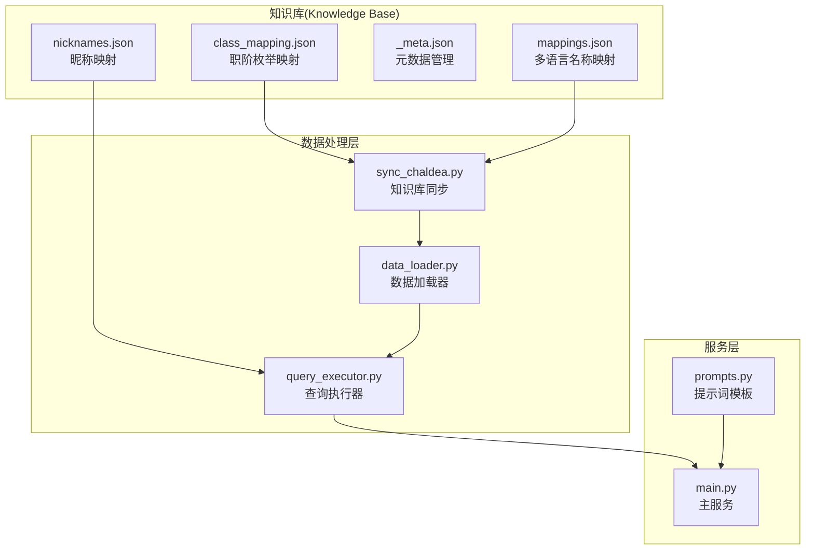

**图表来源**
- [class_mapping.json:1-478](file://server/knowledge/class_mapping.json#L1-L478)
- [sync_chaldea.py:308-429](file://server/sync_chaldea.py#L308-L429)
- [data_loader.py:1-363](file://server/data_loader.py#L1-L363)
- [query_executor.py:1-305](file://server/query_executor.py#L1-L305)
- [main.py:1-228](file://server/main.py#L1-L228)

**章节来源**
- [class_mapping.json:1-478](file://server/knowledge/class_mapping.json#L1-L478)
- [sync_chaldea.py:308-429](file://server/sync_chaldea.py#L308-L429)

## 核心组件

### 职阶枚举映射系统

职阶枚举映射系统是整个职阶映射的基础，它从Chaldea源码中提取了完整的职阶枚举信息，并进行了标准化处理。

#### 主要特征
- **完整职阶列表**：包含78个职阶定义
- **玩家可用职阶**：筛选出14个可玩职阶
- **中文标签支持**：为每个职阶提供中文标签
- **基础类继承**：支持职阶继承关系

#### 职阶分类结构

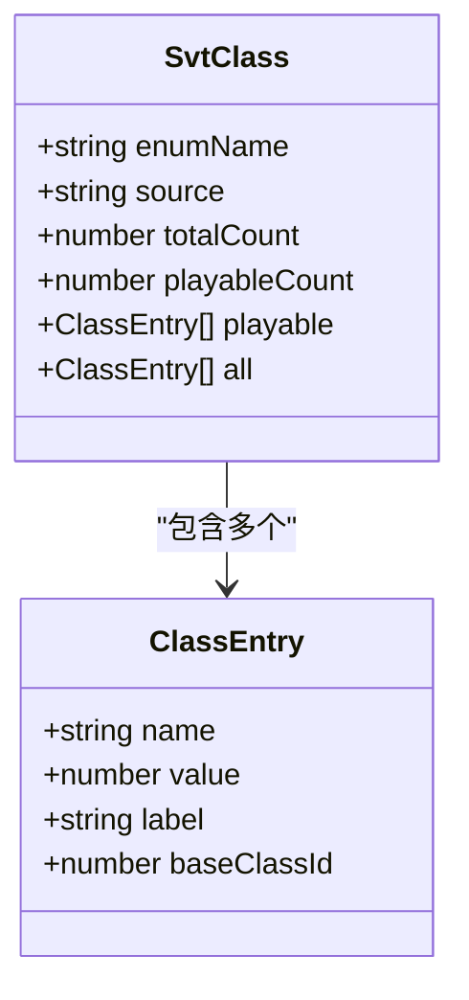

**图表来源**
- [class_mapping.json:1-478](file://server/knowledge/class_mapping.json#L1-L478)

**章节来源**
- [class_mapping.json:1-478](file://server/knowledge/class_mapping.json#L1-L478)

### 多语言名称映射系统

多语言名称映射系统负责从者名称的国际化处理，支持日文、中文、繁体中文、英文和韩文的统一管理。

#### 映射范围
- **从者名称**：约6500个从者的多语言名称
- **特性映射**：特性ID到多语言描述的映射
- **职阶映射**：职阶ID到多语言描述的映射

#### 映射结构

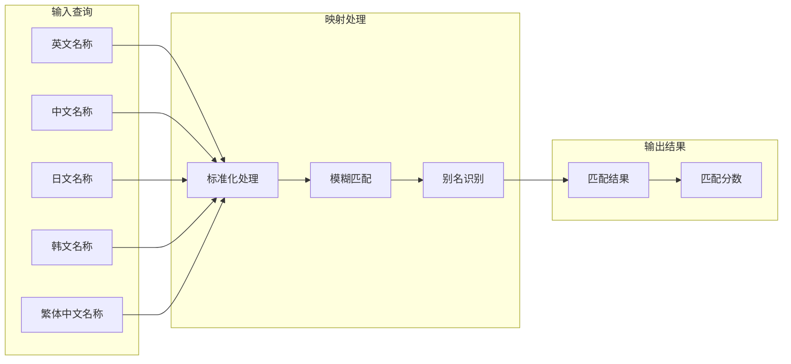

**图表来源**
- [mappings.json:1-800](file://server/knowledge/mappings.json#L1-L800)
- [query_executor.py:22-26](file://server/query_executor.py#L22-L26)

**章节来源**
- [mappings.json:1-800](file://server/knowledge/mappings.json#L1-L800)
- [query_executor.py:22-26](file://server/query_executor.py#L22-L26)

### 昵称映射系统

昵称映射系统专门处理用户常用的从者昵称，提供灵活的别名识别功能。

#### 昵称映射特点
- **多层级映射**：支持字符串和对象两种映射方式
- **职阶约束**：部分昵称包含职阶限制
- **模糊匹配**：支持昵称的标准化匹配

#### 昵称映射结构

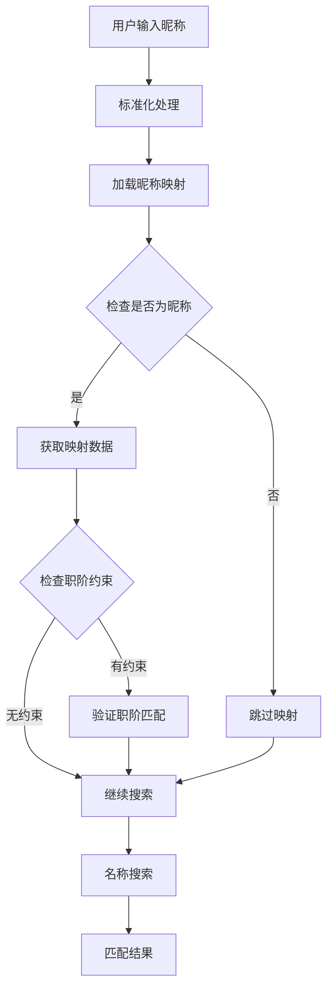

**图表来源**
- [nicknames.json:1-51](file://server/knowledge/nicknames.json#L1-L51)
- [query_executor.py:133-191](file://server/query_executor.py#L133-L191)

**章节来源**
- [nicknames.json:1-51](file://server/knowledge/nicknames.json#L1-L51)
- [query_executor.py:133-191](file://server/query_executor.py#L133-L191)

## 架构概览

Laplace职阶映射系统采用分层架构设计，确保了系统的可扩展性和维护性。

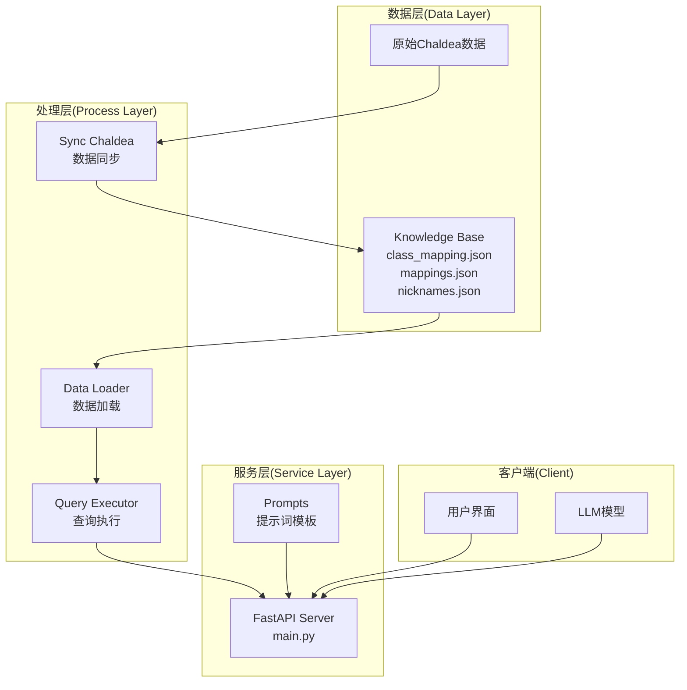

**图表来源**
- [sync_chaldea.py:308-429](file://server/sync_chaldea.py#L308-L429)
- [data_loader.py:332-363](file://server/data_loader.py#L332-L363)
- [query_executor.py:53-87](file://server/query_executor.py#L53-L87)
- [main.py:81-228](file://server/main.py#L81-L228)

## 详细组件分析

### 职阶标准化处理机制

职阶标准化处理机制是系统的核心功能之一，它确保了不同输入形式的职阶名称能够被正确识别和处理。

#### 标准化流程

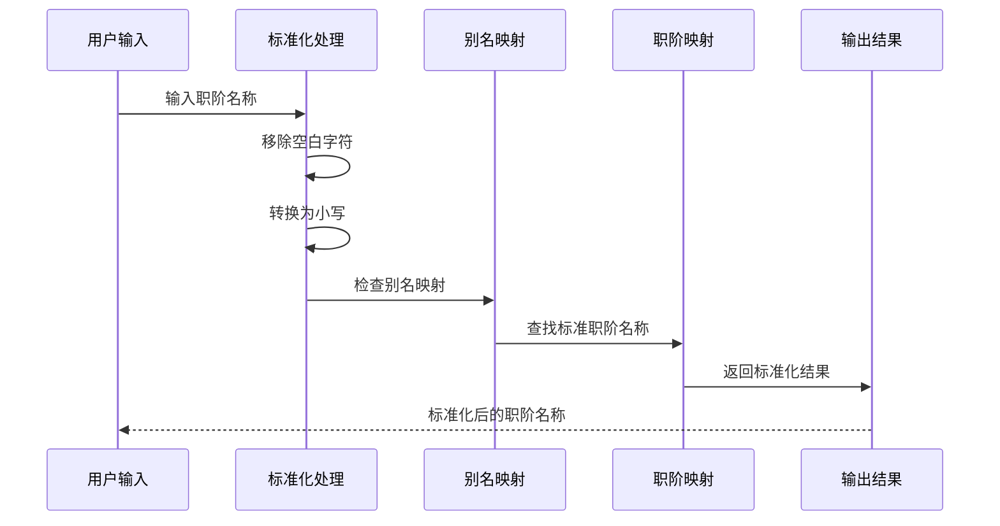

**图表来源**
- [prompts.py:123-137](file://server/prompts.py#L123-L137)
- [main.py:24-31](file://server/main.py#L24-L31)

#### 英文到中文映射规则

系统支持以下英文职阶到中文职阶的映射：

| 英文职阶 | 中文职阶 | 别名支持 |
|---------|---------|----------|
| saber | 剑阶 | 剑士、Saber |
| archer | 弓阶 | 弓兵、Archer |
| lancer | 枪阶 | 枪兵、Lancer |
| rider | 骑阶 | 骑兵、Rider |
| caster | 术阶 | 术士、法师、Caster |
| assassin | 杀阶 | 刺客、Assassin |
| berserker | 狂阶 | 狂战士、Berserker |
| ruler | 裁定者/尺阶 | Ruler |
| avenger | 复仇者/仇阶 | Avenger |
| moonCancer | 月之癌/月癌 | MoonCancer |
| alterEgo | 他人格/AE阶 | AlterEgo |
| foreigner | 降临者/外神 | Foreigner |
| pretender | 伪装者 | Pretender |

**章节来源**
- [prompts.py:123-137](file://server/prompts.py#L123-L137)
- [main.py:24-31](file://server/main.py#L24-L31)

### 职阶别名系统

职阶别名系统支持多种输入形式，包括英文、中文、拼音和缩写等多种表达方式。

#### 别名识别算法

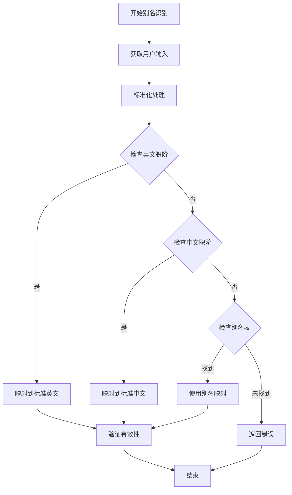

**图表来源**
- [query_executor.py:127-132](file://server/query_executor.py#L127-L132)
- [main.py:24-31](file://server/main.py#L24-L31)

#### 别名支持示例

系统支持以下类型的职阶别名：

- **完全匹配**：`"剑阶"` → `"saber"`
- **部分匹配**：`"剑士"` → `"saber"`
- **缩写形式**：`"saber"` → `"saber"`
- **混合形式**：`"剑"` → `"saber"`

**章节来源**
- [query_executor.py:127-132](file://server/query_executor.py#L127-L132)
- [main.py:24-31](file://server/main.py#L24-L31)

### 职阶属性映射实现原理

职阶属性映射实现原理涉及多个层面的数据处理和映射机制。

#### 属性映射结构

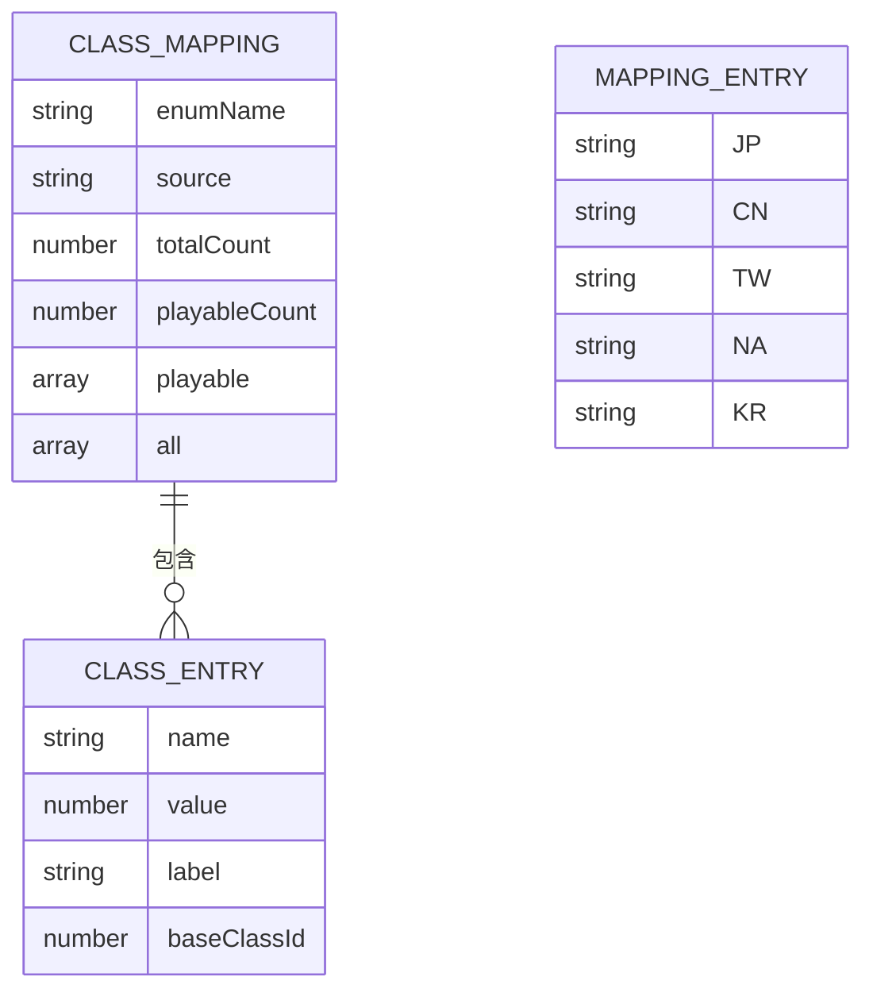

**图表来源**
- [class_mapping.json:1-478](file://server/knowledge/class_mapping.json#L1-L478)
- [mappings.json:1-800](file://server/knowledge/mappings.json#L1-L800)

#### 映射查询流程

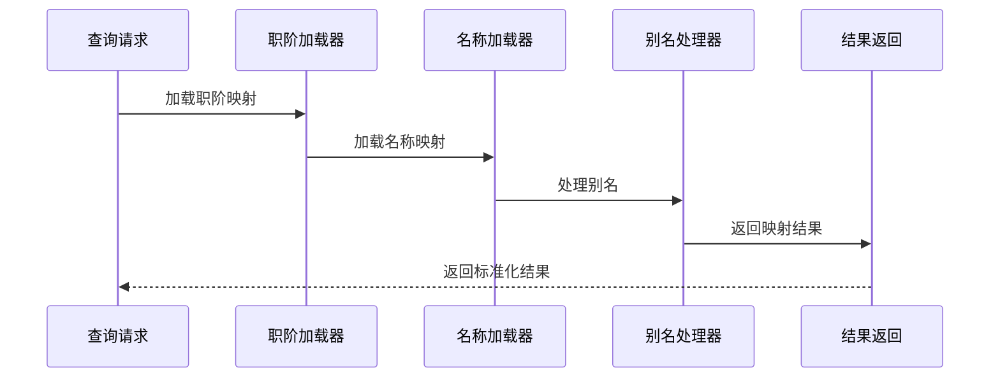

**图表来源**
- [data_loader.py:44-61](file://server/data_loader.py#L44-L61)
- [sync_chaldea.py:368-394](file://server/sync_chaldea.py#L368-L394)

**章节来源**
- [data_loader.py:44-61](file://server/data_loader.py#L44-L61)
- [sync_chaldea.py:368-394](file://server/sync_chaldea.py#L368-L394)

### 查询优化策略

查询优化策略确保了系统在处理大量数据时仍能保持高效的响应速度。

#### 优化技术

1. **索引构建**：为常用查询字段建立索引
2. **缓存机制**：缓存频繁访问的数据
3. **早期过滤**：在查询过程中尽早排除不匹配项
4. **批量处理**：支持批量数据处理和查询

#### 查询执行流程

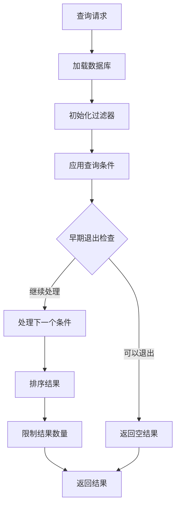

**图表来源**
- [query_executor.py:53-87](file://server/query_executor.py#L53-L87)
- [query_executor.py:90-261](file://server/query_executor.py#L90-L261)

**章节来源**
- [query_executor.py:53-87](file://server/query_executor.py#L53-L87)
- [query_executor.py:90-261](file://server/query_executor.py#L90-L261)

## 依赖关系分析

职阶映射系统的依赖关系相对简单，主要依赖于知识库文件和核心处理模块。

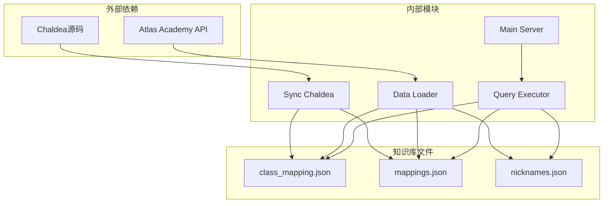

**图表来源**
- [sync_chaldea.py:313-318](file://server/sync_chaldea.py#L313-L318)
- [data_loader.py:20-23](file://server/data_loader.py#L20-L23)
- [query_executor.py:14-15](file://server/query_executor.py#L14-L15)

**章节来源**
- [sync_chaldea.py:313-318](file://server/sync_chaldea.py#L313-L318)
- [data_loader.py:20-23](file://server/data_loader.py#L20-L23)
- [query_executor.py:14-15](file://server/query_executor.py#L14-L15)

## 性能考虑

职阶映射系统在设计时充分考虑了性能优化，采用了多种策略来确保系统的高效运行。

### 缓存策略

系统采用了多层次的缓存策略：

1. **数据库缓存**：预加载的从者数据库缓存在内存中
2. **映射缓存**：职阶映射和名称映射缓存在全局变量中
3. **效果索引缓存**：效果匹配索引缓存在内存中

### 查询优化

1. **早期退出**：在发现不匹配条件时立即停止处理
2. **索引查找**：使用字典进行O(1)时间复杂度的查找
3. **批量处理**：支持批量数据处理减少重复计算

### 内存管理

1. **懒加载**：知识库文件采用懒加载策略
2. **及时释放**：不再使用的数据及时释放内存
3. **内存监控**：定期监控内存使用情况

## 故障排除指南

### 常见问题及解决方案

#### 职阶映射失效

**问题描述**：用户输入的职阶名称无法正确识别

**可能原因**：
1. 职阶名称不在映射表中
2. 输入格式不正确
3. 昵称映射配置错误

**解决步骤**：
1. 检查输入的职阶名称是否在支持列表中
2. 验证输入格式是否符合要求
3. 更新昵称映射配置文件

#### 数据加载失败

**问题描述**：系统无法加载职阶映射数据

**可能原因**：
1. 知识库文件缺失
2. 文件权限问题
3. 网络连接问题

**解决步骤**：
1. 检查知识库文件是否存在
2. 验证文件权限设置
3. 检查网络连接状态
4. 重新运行数据同步脚本

#### 查询性能问题

**问题描述**：查询响应时间过长

**可能原因**：
1. 数据库过大
2. 查询条件过于复杂
3. 缓存未生效

**解决步骤**：
1. 优化查询条件
2. 清理不必要的查询参数
3. 检查缓存配置
4. 考虑分页查询

**章节来源**
- [query_executor.py:41-50](file://server/query_executor.py#L41-L50)
- [sync_chaldea.py:313-318](file://server/sync_chaldea.py#L313-L318)

## 结论

Laplace职阶映射系统是一个设计精良、功能完整的从者职阶标准化解决方案。系统通过多层映射机制、智能别名识别和高效的查询优化策略，为用户提供了准确、便捷的职阶查询体验。

### 系统优势

1. **全面性**：支持78个职阶的完整映射
2. **灵活性**：支持多种输入形式和别名识别
3. **高效性**：采用多层缓存和优化查询策略
4. **可维护性**：模块化设计便于扩展和维护

### 扩展建议

1. **增加更多别名**：持续收集用户常用的职阶别名
2. **优化性能**：考虑使用更高级的索引技术
3. **增强错误处理**：改进异常处理和错误报告机制
4. **添加监控**：增加系统性能监控和日志记录

## 附录

### 映射规则示例

#### 职阶映射规则

| 输入形式 | 标准化结果 | 说明 |
|---------|-----------|------|
| "剑士" | "saber" | 中文别名 |
| "Archer" | "archer" | 英文标准 |
| "弓兵" | "archer" | 中文别名 |
| "Lancer" | "lancer" | 英文标准 |
| "枪阶" | "lancer" | 中文标准 |

#### 别名映射示例

| 昵称 | 映射目标 | 职阶约束 | 说明 |
|------|---------|----------|------|
| "呆毛" | "阿尔托莉雅·潘德拉贡" | saber | 常用昵称 |
| "闪闪" | "吉尔伽美什" | 无 | 金闪闪 |
| "大帝" | "伊斯坎达尔" | 无 | 地球最强 |
| "水C呆" | "阿尔托莉雅·卡斯特" | berserker | 职阶约束 |

### 维护指南

#### 日常维护任务

1. **数据同步**：定期更新Chaldea源码数据
2. **映射更新**：根据用户反馈更新别名映射
3. **性能监控**：监控系统性能指标
4. **错误排查**：及时处理用户反馈的问题

#### 扩展方法

1. **添加新职阶**：在class_mapping.json中添加新职阶
2. **更新别名**：在nicknames.json中添加新的昵称映射
3. **修改映射规则**：在prompts.py中调整映射规则
4. **优化查询**：在query_executor.py中优化查询逻辑

**章节来源**
- [class_mapping.json:1-478](file://server/knowledge/class_mapping.json#L1-L478)
- [nicknames.json:1-51](file://server/knowledge/nicknames.json#L1-L51)
- [prompts.py:123-137](file://server/prompts.py#L123-L137)