# AI集成架构

<cite>
**本文档引用的文件**
- [llm_client.py](file://server/llm_client.py)
- [prompts.py](file://server/prompts.py)
- [main.py](file://server/main.py)
- [schemas.py](file://server/schemas.py)
- [query_executor.py](file://server/query_executor.py)
- [logger.py](file://server/logger.py)
- [test_llm_client.py](file://tests/test_llm_client.py)
- [test_llm_client_live.py](file://tests/test_llm_client_live.py)
- [effect_schema.json](file://server/knowledge/effect_schema.json)
- [nicknames.json](file://server/knowledge/nicknames.json)
- [individuality.py](file://server/individuality.py)
- [data_loader.py](file://server/data_loader.py)
</cite>

## 目录
1. [简介](#简介)
2. [项目结构](#项目结构)
3. [核心组件](#核心组件)
4. [架构概览](#架构概览)
5. [详细组件分析](#详细组件分析)
6. [依赖关系分析](#依赖关系分析)
7. [性能考量](#性能考量)
8. [故障排除指南](#故障排除指南)
9. [结论](#结论)

## 简介

Laplace项目采用双阶段AI处理架构，专为FGO（命运冠位指定）从者数据查询而设计。该架构通过LLM客户端实现多模型支持，结合严格的提示词工程和结构化输出验证，确保从自然语言到精确查询的可靠转换。

系统采用两阶段处理流程：第一阶段进行意图解析和结构化查询生成，第二阶段进行自然语言生成和RAG（检索增强生成）。这种设计既保证了查询的准确性，又提供了流畅的用户体验。

## 项目结构

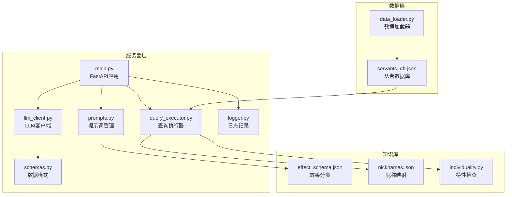

**图表来源**
- [main.py:1-365](file://server/main.py#L1-L365)
- [llm_client.py:1-254](file://server/llm_client.py#L1-L254)
- [prompts.py:1-219](file://server/prompts.py#L1-L219)

**章节来源**
- [main.py:114-148](file://server/main.py#L114-L148)
- [llm_client.py:24-34](file://server/llm_client.py#L24-L34)

## 核心组件

### LLM客户端架构

LLM客户端采用响应式设计，支持多模型回退和结构化输出验证：

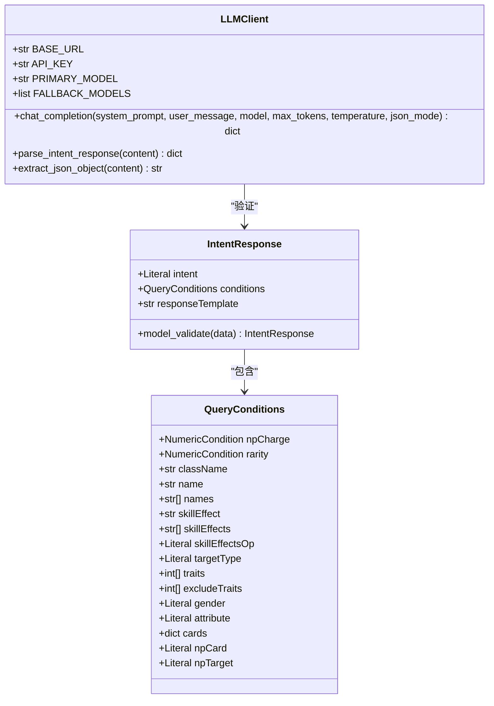

**图表来源**
- [llm_client.py:41-132](file://server/llm_client.py#L41-L132)
- [schemas.py:79-92](file://server/schemas.py#L79-L92)

### 提示词工程体系

系统采用分层提示词设计，包含系统提示词和生成提示词：

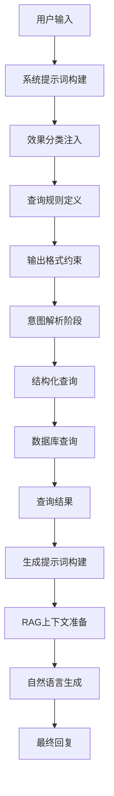

**图表来源**
- [prompts.py:46-171](file://server/prompts.py#L46-L171)
- [prompts.py:186-218](file://server/prompts.py#L186-L218)

**章节来源**
- [llm_client.py:41-132](file://server/llm_client.py#L41-L132)
- [schemas.py:79-92](file://server/schemas.py#L79-L92)

## 架构概览

Laplace采用双阶段AI处理架构，实现了从自然语言到精确查询的转换：

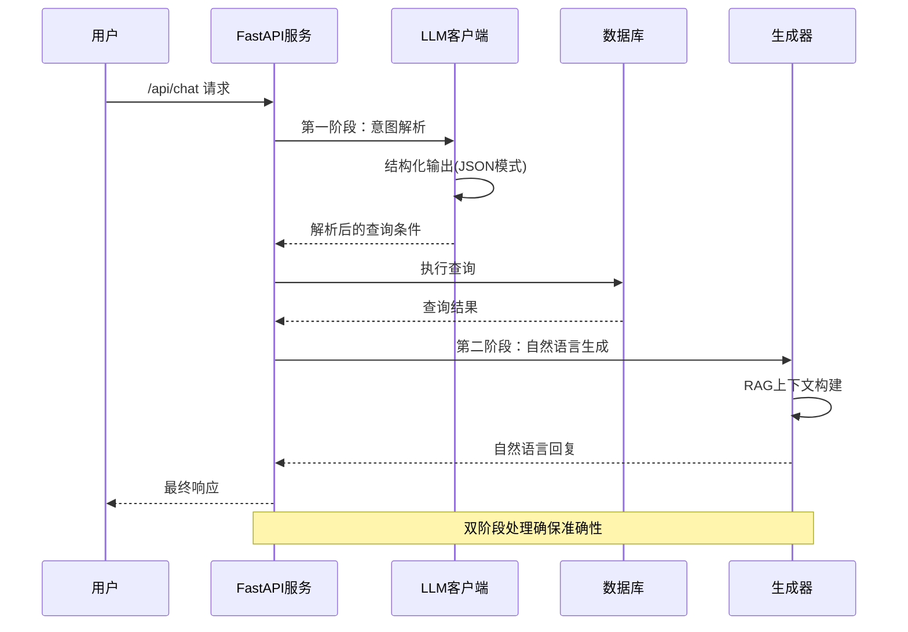

**图表来源**
- [main.py:150-242](file://server/main.py#L150-L242)
- [main.py:245-355](file://server/main.py#L245-L355)

## 详细组件分析

### LLM客户端实现

#### 多模型支持策略

LLM客户端实现了智能的多模型回退机制：

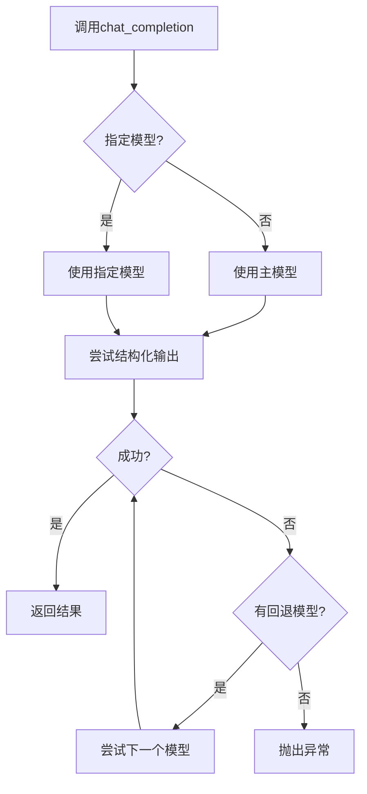

**图表来源**
- [llm_client.py:66-84](file://server/llm_client.py#L66-L84)
- [llm_client.py:87-132](file://server/llm_client.py#L87-L132)

#### 结构化输出验证机制

系统采用严格的JSON模式验证：

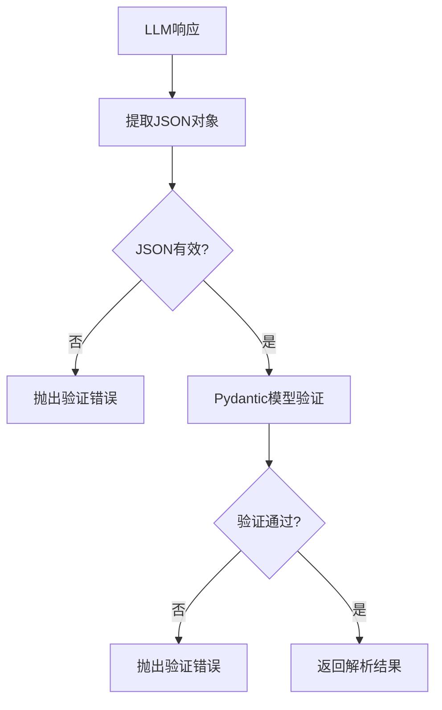

**图表来源**
- [llm_client.py:176-183](file://server/llm_client.py#L176-L183)
- [llm_client.py:186-219](file://server/llm_client.py#L186-L219)

**章节来源**
- [llm_client.py:41-132](file://server/llm_client.py#L41-L132)
- [llm_client.py:176-219](file://server/llm_client.py#L176-L219)

### 提示词工程设计

#### 系统提示词构建策略

系统提示词采用动态构建方式，包含以下关键要素：

1. **效果分类注入**：从effect_schema.json动态加载55种效果类型
2. **查询规则定义**：明确支持的查询条件和输出格式
3. **名称映射规则**：处理昵称和别名映射
4. **多从者对比支持**：区分单从者和多从者查询场景

#### 生成提示词设计

生成提示词专注于RAG阶段的自然语言生成：

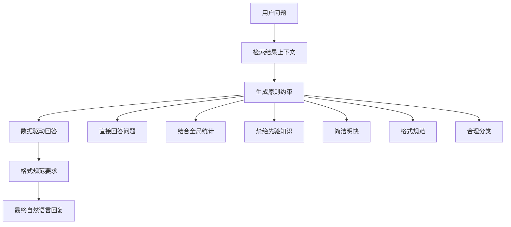

**图表来源**
- [prompts.py:186-218](file://server/prompts.py#L186-L218)

**章节来源**
- [prompts.py:46-171](file://server/prompts.py#L46-L171)
- [prompts.py:186-218](file://server/prompts.py#L186-L218)

### 两阶段AI处理流程

#### 阶段一：意图解析（JSON模式）

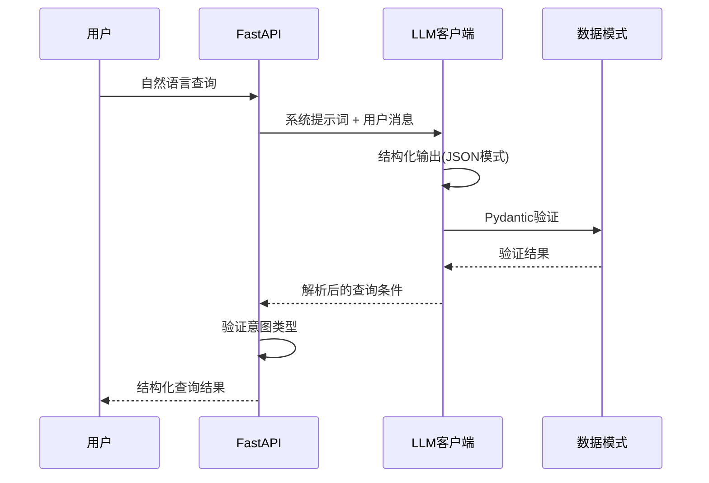

**图表来源**
- [main.py:156-189](file://server/main.py#L156-L189)
- [llm_client.py:176-183](file://server/llm_client.py#L176-L183)

#### 阶段二：自然语言生成（纯文本模式）

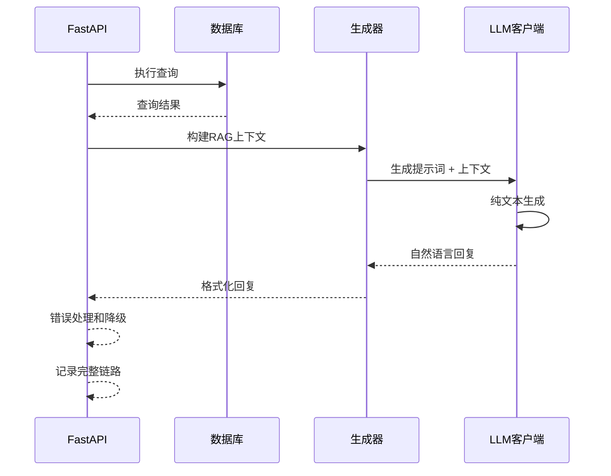

**图表来源**
- [main.py:191-242](file://server/main.py#L191-L242)
- [main.py:245-355](file://server/main.py#L245-L355)

**章节来源**
- [main.py:150-242](file://server/main.py#L150-L242)
- [main.py:245-355](file://server/main.py#L245-L355)

### 查询执行器

查询执行器负责将结构化查询条件转换为数据库查询：

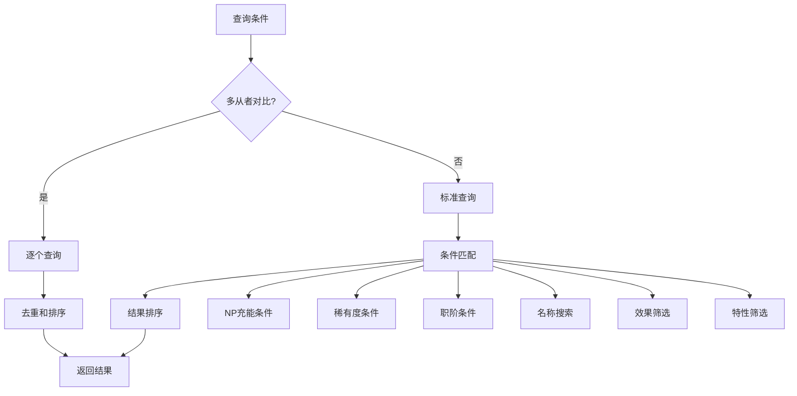

**图表来源**
- [query_executor.py:53-116](file://server/query_executor.py#L53-L116)
- [query_executor.py:119-299](file://server/query_executor.py#L119-L299)

**章节来源**
- [query_executor.py:53-116](file://server/query_executor.py#L53-L116)
- [query_executor.py:119-299](file://server/query_executor.py#L119-L299)

## 依赖关系分析

### 组件耦合度分析

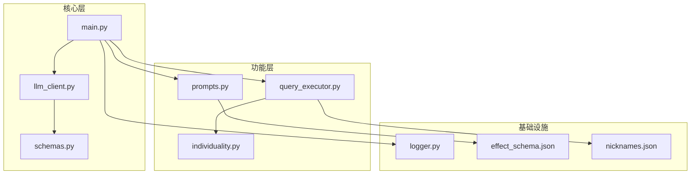

**图表来源**
- [main.py:17-21](file://server/main.py#L17-L21)
- [llm_client.py:22](file://server/llm_client.py#L22)

### 外部依赖管理

系统对外部依赖采用环境变量配置：

| 环境变量 | 默认值 | 用途 |
|---------|--------|------|
| LLM_BASE_URL | https://x.obao.cloud/v1 | LLM服务基础URL |
| LLM_API_KEY | "" | API密钥 |
| LLM_MODEL | claude-sonnet-4-6 | 主模型名称 |
| LLM_FALLBACK_MODELS | Deepseek-V4-Flash,gpt-5.4 | 回退模型列表 |

**章节来源**
- [llm_client.py:27-34](file://server/llm_client.py#L27-L34)
- [main.py:17-21](file://server/main.py#L17-L21)

## 性能考量

### 温度参数调优策略

系统采用保守的温度设置以确保输出稳定性：

- **意图解析阶段**：temperature=0.1，确保结构化输出的一致性
- **生成阶段**：temperature=0.1，保持回答的准确性和一致性

### 模型选择策略

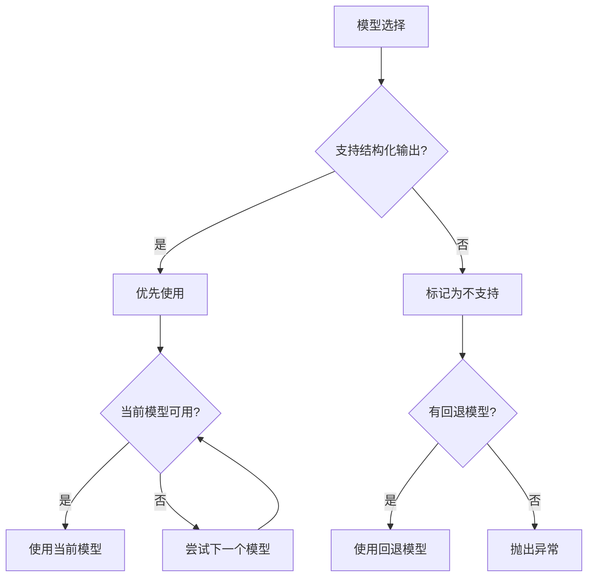

**图表来源**
- [llm_client.py:66-84](file://server/llm_client.py#L66-L84)
- [llm_client.py:108-132](file://server/llm_client.py#L108-L132)

### 成本控制建议

1. **令牌限制**：max_tokens默认1024，可根据需求调整
2. **模型选择**：优先选择性价比高的模型
3. **缓存策略**：系统已实现提示词缓存和数据库预加载
4. **错误处理**：自动回退机制避免重复调用

## 故障排除指南

### 常见错误类型及处理

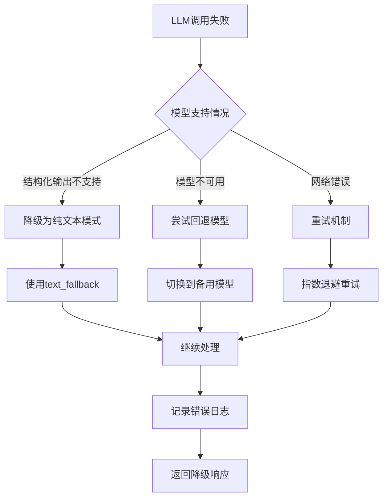

**图表来源**
- [llm_client.py:118-132](file://server/llm_client.py#L118-L132)
- [llm_client.py:167-173](file://server/llm_client.py#L167-L173)

### 日志记录和监控

系统提供完整的链路追踪：

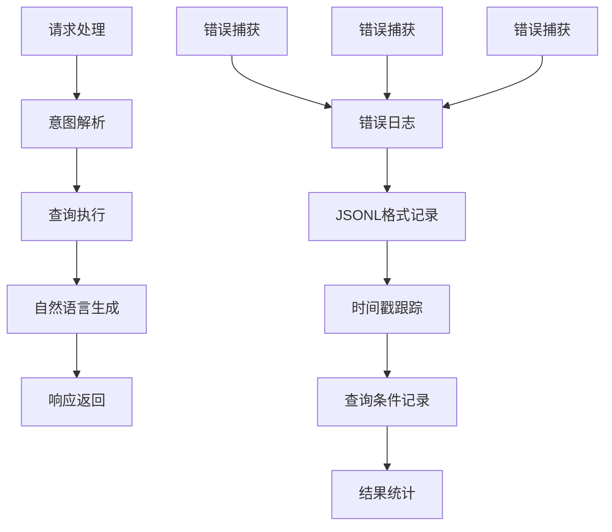

**图表来源**
- [logger.py:38-55](file://server/logger.py#L38-L55)

**章节来源**
- [logger.py:38-55](file://server/logger.py#L38-L55)
- [test_llm_client.py:98-104](file://tests/test_llm_client.py#L98-L104)

## 结论

Laplace项目的AI集成架构展现了现代LLM应用的最佳实践：

### 核心优势

1. **双阶段处理**：确保从自然语言到精确查询的可靠转换
2. **多模型支持**：智能回退机制提高系统可用性
3. **严格验证**：Pydantic模型验证确保输出质量
4. **提示词工程**：精心设计的提示词模板提升理解准确性
5. **性能优化**：合理的温度设置和成本控制策略

### 设计亮点

- **结构化输出**：通过JSON模式确保查询条件的准确性
- **RAG增强**：结合检索结果生成更可信的回答
- **错误处理**：完善的降级策略保证用户体验
- **监控追踪**：完整的日志记录便于问题诊断

### 改进建议

1. **模型监控**：增加模型性能指标监控
2. **缓存优化**：实现查询结果缓存机制
3. **A/B测试**：支持不同提示词版本的对比测试
4. **成本分析**：增加详细的API调用成本统计

该架构为其他领域的AI应用提供了优秀的参考模板，特别是在需要精确查询和可靠输出的场景中。