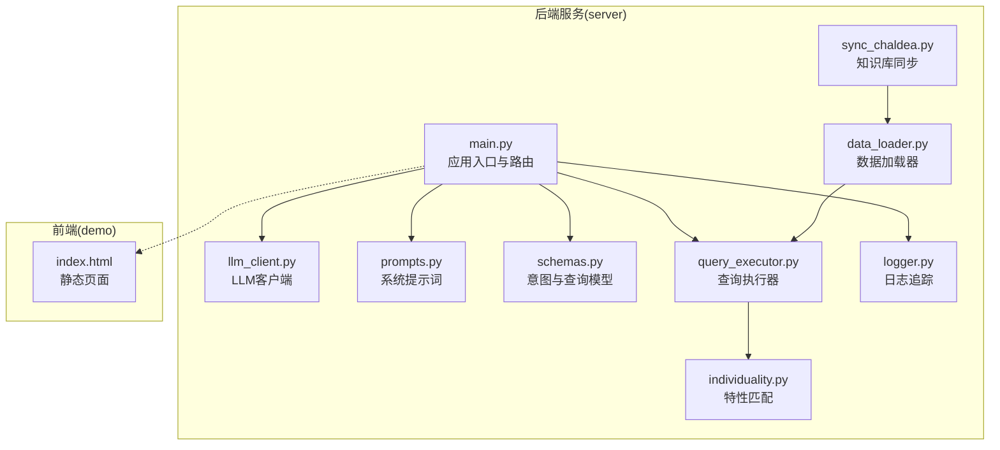
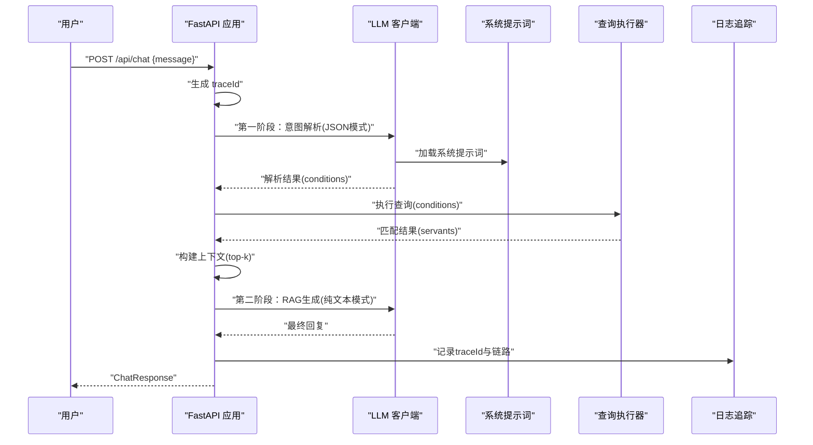
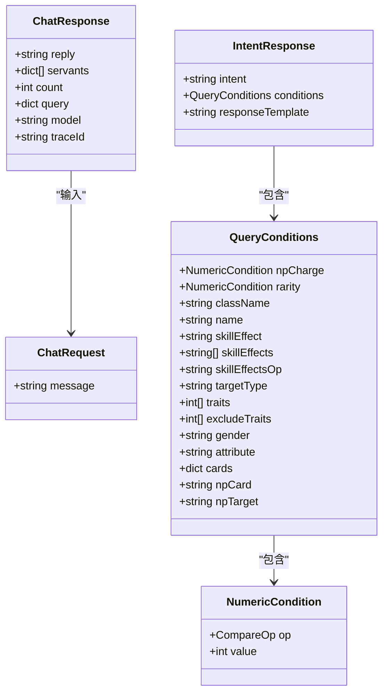
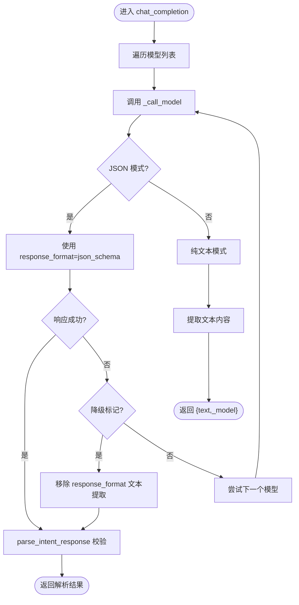
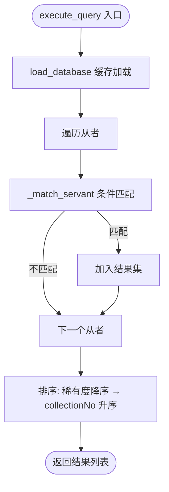
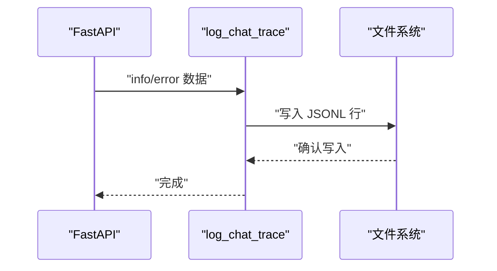
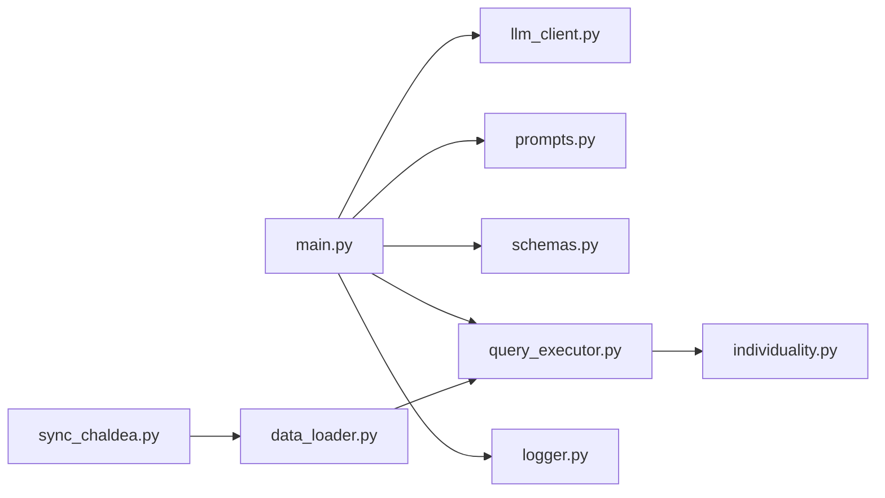

# FastAPI 应用架构

<cite>
**本文引用的文件**
- [server/main.py](file://server/main.py)
- [server/schemas.py](file://server/schemas.py)
- [server/llm_client.py](file://server/llm_client.py)
- [server/query_executor.py](file://server/query_executor.py)
- [server/logger.py](file://server/logger.py)
- [server/prompts.py](file://server/prompts.py)
- [server/individuality.py](file://server/individuality.py)
- [server/data_loader.py](file://server/data_loader.py)
- [server/sync_chaldea.py](file://server/sync_chaldea.py)
- [server/requirements.txt](file://server/requirements.txt)
- [demo/index.html](file://demo/index.html)
- [tests/test_llm_client.py](file://tests/test_llm_client.py)
- [tests/conftest.py](file://tests/conftest.py)
</cite>

## 目录
1. [简介](#简介)
2. [项目结构](#项目结构)
3. [核心组件](#核心组件)
4. [架构总览](#架构总览)
5. [详细组件分析](#详细组件分析)
6. [依赖分析](#依赖分析)
7. [性能考虑](#性能考虑)
8. [故障排查指南](#故障排查指南)
9. [结论](#结论)
10. [附录](#附录)

## 简介
本文件面向Laplace的FastAPI应用，系统化梳理其架构设计与实现细节，重点覆盖：
- 应用入口点配置：CORS中间件、静态文件挂载、路由定义
- 核心API端点：/api/chat的双阶段查询流程与/api/health健康检查
- 数据模型：ChatRequest/ChatResponse与LLM意图模型IntentResponse及查询条件模型
- 中间件与异常处理：CORS与静态文件挂载、全局异常处理机制
- 请求处理流程：从用户输入到最终响应的完整链路
- 日志系统：traceId生成与聊天追踪机制
- 部署与性能优化建议

## 项目结构
Laplace采用分层与功能模块化的组织方式：
- server：后端服务核心，包含FastAPI应用、LLM客户端、查询执行器、提示词、日志、数据加载与知识库同步脚本
- demo：前端静态资源，通过FastAPI静态文件挂载提供Web界面
- tests：单元测试，覆盖LLM客户端行为与响应格式
- extractor：抽取器相关（当前与FastAPI主流程无直接耦合）

图表来源
- [server/main.py:1-228](file://server/main.py#L1-L228)
- [server/llm_client.py:1-247](file://server/llm_client.py#L1-L247)
- [server/prompts.py:1-208](file://server/prompts.py#L1-L208)
- [server/schemas.py:1-81](file://server/schemas.py#L1-L81)
- [server/query_executor.py:1-305](file://server/query_executor.py#L1-L305)
- [server/logger.py:1-55](file://server/logger.py#L1-L55)
- [server/individuality.py:1-78](file://server/individuality.py#L1-L78)
- [server/data_loader.py:1-363](file://server/data_loader.py#L1-L363)
- [server/sync_chaldea.py:1-429](file://server/sync_chaldea.py#L1-L429)
- [demo/index.html:1-72](file://demo/index.html#L1-L72)

章节来源
- [server/main.py:1-228](file://server/main.py#L1-L228)
- [demo/index.html:1-72](file://demo/index.html#L1-L72)

## 核心组件
- 应用实例与中间件
  - FastAPI实例初始化，设置标题、描述与版本
  - CORS中间件允许任意源、方法与头
  - 启动事件预加载数据库
  - 静态文件挂载至根路径，提供demo前端页面
- 数据模型
  - ChatRequest：message字段
  - ChatResponse：reply、servants、count、query、model、traceId
  - IntentResponse与QueryConditions：LLM意图解析与查询条件的结构化约束
- API端点
  - /api/chat：双阶段查询（意图解析→执行查询→RAG生成）
  - /api/health：健康检查

章节来源
- [server/main.py:51-228](file://server/main.py#L51-L228)
- [server/schemas.py:16-81](file://server/schemas.py#L16-L81)

## 架构总览
下图展示了Laplace的端到端请求处理链路，从FastAPI路由到LLM、查询执行器与日志追踪。

图表来源
- [server/main.py:87-218](file://server/main.py#L87-L218)
- [server/llm_client.py:35-126](file://server/llm_client.py#L35-L126)
- [server/prompts.py:167-207](file://server/prompts.py#L167-L207)
- [server/query_executor.py:53-87](file://server/query_executor.py#L53-L87)
- [server/logger.py:38-55](file://server/logger.py#L38-L55)

## 详细组件分析

### 应用入口与路由
- CORS中间件：允许任意来源、方法与头，便于前后端分离开发与跨域访问
- 静态文件挂载：将demo目录作为静态资源根路径，HTML为默认入口
- 启动事件：预加载数据库，减少首次查询延迟
- 路由定义：
  - POST /api/chat：双阶段查询与回复
  - GET /api/health：健康检查

章节来源
- [server/main.py:57-63](file://server/main.py#L57-L63)
- [server/main.py:81-84](file://server/main.py#L81-L84)
- [server/main.py:221-227](file://server/main.py#L221-L227)

### 数据模型定义
- ChatRequest/ChatResponse
  - ChatRequest：message字符串
  - ChatResponse：reply字符串、servants列表、count整数、query字典、model字符串、traceId可空
- LLM意图模型与查询条件
  - IntentResponse：固定intent为"query_servants"，conditions为QueryConditions
  - QueryConditions：支持NP自充、稀有度、职阶、名称、技能效果、目标类型、特性、性别、阵营、指令卡、宝具颜色与目标类型等字段，具备字段清理与校验逻辑

图表来源
- [server/main.py:66-79](file://server/main.py#L66-L79)
- [server/schemas.py:16-81](file://server/schemas.py#L16-L81)

章节来源
- [server/main.py:66-79](file://server/main.py#L66-L79)
- [server/schemas.py:16-81](file://server/schemas.py#L16-L81)

### LLM客户端与提示词
- LLM客户端
  - 支持主模型与备用模型轮询调用
  - JSON模式优先使用response_format=json_schema进行结构化输出；若网关不支持则降级为文本提取
  - 结构化解析与校验，抛出异常以便上层捕获
- 系统提示词
  - 动态注入效果分类与中文映射，确保LLM输出严格符合IntentResponse模式
  - 提供丰富的示例与字段说明，指导模型遵循输出格式

图表来源
- [server/llm_client.py:35-126](file://server/llm_client.py#L35-L126)
- [server/llm_client.py:129-168](file://server/llm_client.py#L129-L168)
- [server/llm_client.py:171-178](file://server/llm_client.py#L171-L178)
- [server/prompts.py:167-172](file://server/prompts.py#L167-L172)

章节来源
- [server/llm_client.py:35-126](file://server/llm_client.py#L35-L126)
- [server/llm_client.py:129-168](file://server/llm_client.py#L129-L168)
- [server/llm_client.py:171-178](file://server/llm_client.py#L171-L178)
- [server/prompts.py:167-172](file://server/prompts.py#L167-L172)

### 查询执行器
- 数据加载：全局缓存servants_db与昵称映射，避免重复IO
- 查询逻辑：支持NP自充、稀有度、职阶、名称（含昵称映射）、技能效果（单/多效果与逻辑关系）、特性（含正负特性）、性别、阵营、指令卡、宝具颜色与目标类型等多维条件
- 排序规则：按稀有度降序、collectionNo升序

图表来源
- [server/query_executor.py:53-87](file://server/query_executor.py#L53-L87)
- [server/query_executor.py:90-261](file://server/query_executor.py#L90-L261)
- [server/individuality.py:58-77](file://server/individuality.py#L58-L77)

章节来源
- [server/query_executor.py:53-87](file://server/query_executor.py#L53-L87)
- [server/query_executor.py:90-261](file://server/query_executor.py#L90-L261)
- [server/individuality.py:58-77](file://server/individuality.py#L58-L77)

### 日志追踪与聊天链路
- traceId：每次请求生成8位十六进制标识，贯穿意图解析、查询执行与最终回复
- 日志格式：JSONL，包含时间戳、级别与traceId、查询、意图、结果数量、回复、上下文、错误等字段
- 记录位置：server/logs/query_trace.jsonl

图表来源
- [server/logger.py:38-55](file://server/logger.py#L38-L55)

章节来源
- [server/logger.py:38-55](file://server/logger.py#L38-L55)

### 健康检查端点
- /api/health：返回服务状态与服务名，便于容器编排与负载均衡探活

章节来源
- [server/main.py:221-224](file://server/main.py#L221-L224)

### 前端静态资源
- demo/index.html：通过StaticFiles挂载至根路径，提供交互式聊天界面

章节来源
- [server/main.py:226-227](file://server/main.py#L226-L227)
- [demo/index.html:1-72](file://demo/index.html#L1-L72)

## 依赖分析
- 外部依赖
  - FastAPI、Uvicorn、httpx、python-dotenv、requests、pytest
- 内部模块耦合
  - main.py依赖llm_client、prompts、query_executor、logger
  - llm_client依赖schemas进行结构化解析
  - query_executor依赖individuality与知识库文件
  - data_loader与sync_chaldea负责知识库与数据库生成

图表来源
- [server/main.py:14-18](file://server/main.py#L14-L18)
- [server/llm_client.py:16](file://server/llm_client.py#L16)
- [server/query_executor.py:12-15](file://server/query_executor.py#L12-L15)
- [server/data_loader.py:22-23](file://server/data_loader.py#L22-L23)
- [server/sync_chaldea.py:29](file://server/sync_chaldea.py#L29)

章节来源
- [server/requirements.txt:1-7](file://server/requirements.txt#L1-L7)
- [server/main.py:14-18](file://server/main.py#L14-L18)
- [server/llm_client.py:16](file://server/llm_client.py#L16)
- [server/query_executor.py:12-15](file://server/query_executor.py#L12-L15)
- [server/data_loader.py:22-23](file://server/data_loader.py#L22-L23)
- [server/sync_chaldea.py:29](file://server/sync_chaldea.py#L29)

## 性能考虑
- 预热与缓存
  - 启动时加载数据库，后续查询避免重复IO
  - 效果映射与昵称映射按需加载并缓存
- 模型降级与超时
  - JSON模式失败自动降级为文本模式
  - httpx异步客户端设置合理超时，避免阻塞
- 响应裁剪
  - 返回给前端的servants限制数量，避免响应过大
- 排序与截断
  - 查询结果按稀有度与collectionNo排序，top-k作为RAG上下文，控制上下文大小
- 建议
  - 在生产环境启用Gunicorn/Uvicorn多进程/多核
  - 对LLM调用增加重试与熔断策略
  - 对日志写入使用异步批处理

## 故障排查指南
- LLM调用失败
  - 现象：第一阶段解析异常或第二阶段生成异常
  - 处理：检查LLM_BASE_URL、LLM_API_KEY、LLM_MODEL与LLM_FALLBACK_MODELS配置；查看日志中的traceId定位具体请求
- JSON模式不被支持
  - 现象：响应包含response_format相关错误
  - 处理：客户端会自动降级为文本模式；可在网关侧确认json_schema支持情况
- 查询无结果或结果异常
  - 现象：返回count为0或结果不符合预期
  - 处理：检查QueryConditions字段映射与逻辑（AND/OR、正负特性）；确认知识库与数据库是否最新
- 健康检查失败
  - 现象：/api/health返回异常
  - 处理：检查服务进程状态与端口监听

章节来源
- [server/llm_client.py:60-78](file://server/llm_client.py#L60-L78)
- [server/llm_client.py:129-168](file://server/llm_client.py#L129-L168)
- [server/main.py:101-111](file://server/main.py#L101-L111)
- [server/main.py:189-196](file://server/main.py#L189-L196)

## 结论
Laplace的FastAPI应用以清晰的分层与模块化设计实现了从自然语言到结构化查询再到自然语言回复的完整链路。通过严格的模型约束、稳健的降级策略与完善的日志追踪，系统在易用性与可靠性之间取得了良好平衡。建议在生产环境中进一步完善监控、限流与缓存策略，以提升整体吞吐与稳定性。

## 附录

### API定义概览
- POST /api/chat
  - 请求体：ChatRequest(message)
  - 响应体：ChatResponse(reply, servants, count, query, model, traceId)
- GET /api/health
  - 响应体：{"status": "ok", "service": "laplace"}

章节来源
- [server/main.py:87-218](file://server/main.py#L87-L218)
- [server/main.py:221-224](file://server/main.py#L221-L224)

### 测试要点
- LLM客户端测试覆盖：结构化解析、文本提取、响应格式降级、备用模型切换
- 测试配置：通过conftest.py将项目根路径加入sys.path，便于导入server包

章节来源
- [tests/test_llm_client.py:1-126](file://tests/test_llm_client.py#L1-L126)
- [tests/conftest.py:1-8](file://tests/conftest.py#L1-L8)