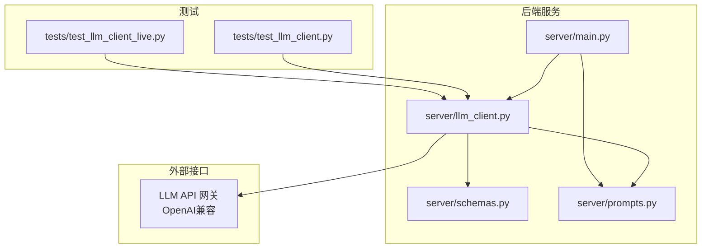
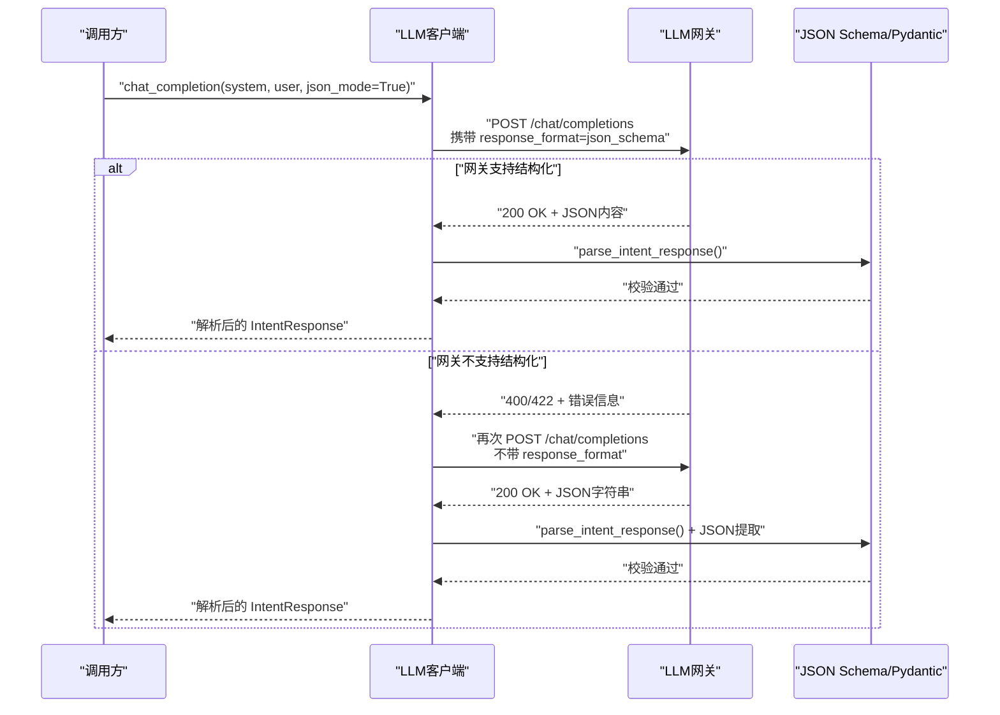
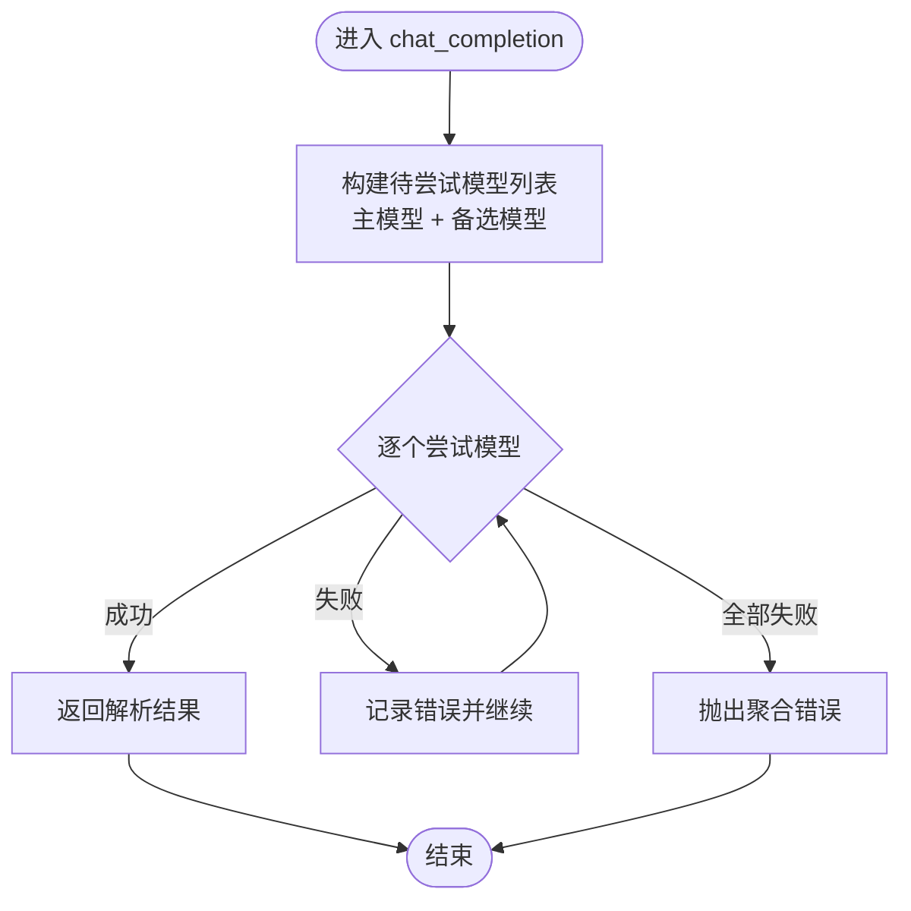
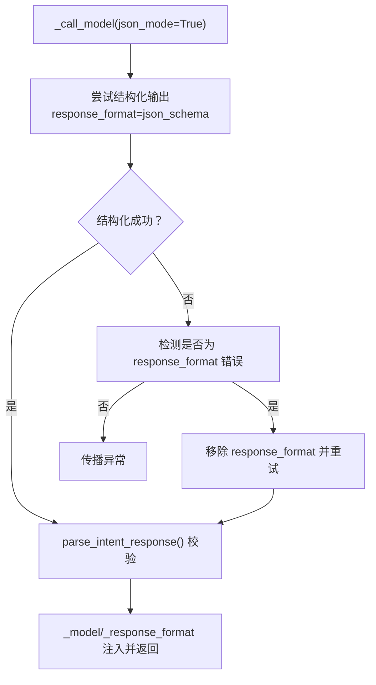
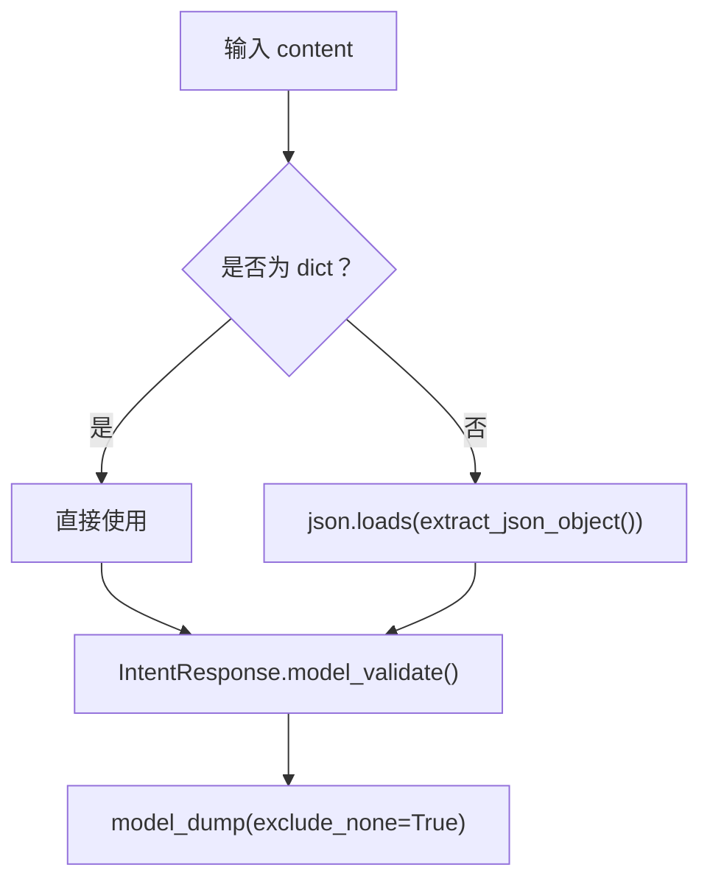
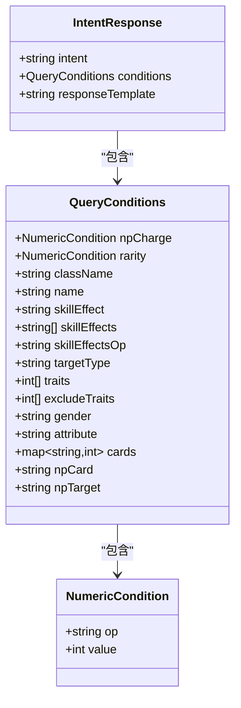
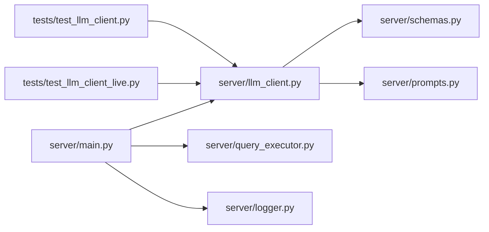

# LLM 客户端模块

<cite>
**本文引用的文件**
- [server/llm_client.py](file://server/llm_client.py)
- [server/schemas.py](file://server/schemas.py)
- [server/prompts.py](file://server/prompts.py)
- [server/main.py](file://server/main.py)
- [tests/test_llm_client.py](file://tests/test_llm_client.py)
- [tests/test_llm_client_live.py](file://tests/test_llm_client_live.py)
- [README.md](file://README.md)
</cite>

## 目录
1. [引言](#引言)
2. [项目结构](#项目结构)
3. [核心组件](#核心组件)
4. [架构总览](#架构总览)
5. [详细组件分析](#详细组件分析)
6. [依赖关系分析](#依赖关系分析)
7. [性能考量](#性能考量)
8. [故障排查指南](#故障排查指南)
9. [结论](#结论)
10. [附录](#附录)

## 引言
本文件面向Laplace项目的LLM客户端模块，系统性阐述其架构设计与实现细节，重点覆盖：
- 多模型轮询与故障转移策略
- 结构化输出验证（JSON Schema + Pydantic）
- chat_completion函数的实现原理（温度参数、模型选择、错误处理）
- IntentResponse等数据模型的定义与使用
- 与外部LLM API的交互协议（请求格式、响应解析、超时处理）
- 实战示例与常见问题处理
- 性能优化与最佳实践

## 项目结构
LLM客户端位于server/llm_client.py，配合schemas.py中的数据模型、prompts.py中的系统Prompt模板，以及main.py中的业务集成入口。测试用例位于tests/目录下，包含离线单元测试与可选的真实API调用Smoke测试。

图表来源
- [server/main.py:87-218](file://server/main.py#L87-L218)
- [server/llm_client.py:35-247](file://server/llm_client.py#L35-L247)
- [server/schemas.py:68-81](file://server/schemas.py#L68-L81)
- [server/prompts.py:46-172](file://server/prompts.py#L46-L172)
- [tests/test_llm_client.py:12-126](file://tests/test_llm_client.py#L12-L126)
- [tests/test_llm_client_live.py:15-35](file://tests/test_llm_client_live.py#L15-L35)

章节来源
- [README.md:93-116](file://README.md#L93-L116)
- [server/main.py:87-218](file://server/main.py#L87-L218)
- [server/llm_client.py:35-247](file://server/llm_client.py#L35-L247)
- [server/schemas.py:68-81](file://server/schemas.py#L68-L81)
- [server/prompts.py:46-172](file://server/prompts.py#L46-L172)
- [tests/test_llm_client.py:12-126](file://tests/test_llm_client.py#L12-L126)
- [tests/test_llm_client_live.py:15-35](file://tests/test_llm_client_live.py#L15-L35)

## 核心组件
- LLM客户端：负责与外部LLM API交互，封装多模型轮询、结构化输出与降级策略、错误处理与超时控制。
- 数据模型：IntentResponse与QueryConditions等Pydantic模型，定义意图解析的JSON Schema契约。
- Prompt模板：系统Prompt构建器，动态注入领域知识，确保输出严格符合JSON Schema。
- 业务集成：FastAPI路由在意图解析失败时进行降级与错误日志记录。

章节来源
- [server/llm_client.py:35-247](file://server/llm_client.py#L35-L247)
- [server/schemas.py:68-81](file://server/schemas.py#L68-L81)
- [server/prompts.py:46-172](file://server/prompts.py#L46-L172)
- [server/main.py:87-218](file://server/main.py#L87-L218)

## 架构总览
LLM客户端采用“结构化输出优先 + 文本回退 + 多模型轮询”的三层保障：
- 结构化输出：优先使用response_format=json_schema，由网关强制返回严格JSON。
- 文本回退：当网关不支持response_format时，自动降级为文本模式，再通过JSON提取与Schema校验。
- 多模型轮询：主模型失败则依次尝试备选模型，直至成功或全部失败。

图表来源
- [server/llm_client.py:35-126](file://server/llm_client.py#L35-L126)
- [server/llm_client.py:129-168](file://server/llm_client.py#L129-L168)
- [server/llm_client.py:171-178](file://server/llm_client.py#L171-L178)

## 详细组件分析

### 组件一：chat_completion与多模型轮询
- 入口函数：chat_completion接收system_prompt、user_message、model、max_tokens、temperature、json_mode等参数。
- 模型选择：优先使用传入model或主模型，随后依次尝试FALLBACK_MODELS中的备选模型。
- 错误处理：任一模型抛出异常即记录并继续下一个模型；若全部失败，抛出聚合错误。

图表来源
- [server/llm_client.py:35-78](file://server/llm_client.py#L35-L78)

章节来源
- [server/llm_client.py:35-78](file://server/llm_client.py#L35-L78)

### 组件二：结构化输出与故障转移
- 结构化优先：_call_model在json_mode=True时，先尝试response_format=json_schema。
- 不支持降级：当网关返回400/422且错误文本包含“response_format/json_schema/structured/schema”等关键词时，抛出LLMResponseFormatUnsupported，触发降级。
- 文本回退：移除response_format后重试，使用parse_intent_response提取JSON并用Pydantic校验。

图表来源
- [server/llm_client.py:81-126](file://server/llm_client.py#L81-L126)
- [server/llm_client.py:129-168](file://server/llm_client.py#L129-L168)
- [server/llm_client.py:236-247](file://server/llm_client.py#L236-L247)

章节来源
- [server/llm_client.py:81-126](file://server/llm_client.py#L81-L126)
- [server/llm_client.py:129-168](file://server/llm_client.py#L129-L168)
- [server/llm_client.py:236-247](file://server/llm_client.py#L236-L247)

### 组件三：JSON模式解析与Schema校验
- JSON提取：extract_json_object从LLM返回文本中提取首个完整JSON对象，支持带引号转义与嵌套括号匹配。
- 解析与校验：parse_intent_response将字符串或字典解析为IntentResponse对象，并排除空字段。
- 错误语义：当JSON不合法或不符合Schema时，抛出ValueError，便于上层统一捕获。

图表来源
- [server/llm_client.py:171-178](file://server/llm_client.py#L171-L178)
- [server/llm_client.py:181-214](file://server/llm_client.py#L181-L214)

章节来源
- [server/llm_client.py:171-178](file://server/llm_client.py#L171-L178)
- [server/llm_client.py:181-214](file://server/llm_client.py#L181-L214)

### 组件四：数据模型与JSON Schema契约
- IntentResponse：定义intent与conditions字段，其中intent固定为“query_servants”，conditions为QueryConditions对象。
- QueryConditions：涵盖NP自充、稀有度、职阶、名称、技能效果、目标类型、特性、性别、属性、指令卡、宝具颜色与目标等字段，含多个字段级校验器。
- JSON Schema：intent_response_json_schema()导出Pydantic模型的JSON Schema，供LLM网关用于response_format。

图表来源
- [server/schemas.py:16-81](file://server/schemas.py#L16-L81)

章节来源
- [server/schemas.py:16-81](file://server/schemas.py#L16-L81)

### 组件五：系统Prompt与领域知识注入
- Prompt构建：_build_system_prompt动态读取knowledge/effect_schema.json，将效果名称与中文别名映射注入系统Prompt，确保LLM输出严格遵循JSON Schema。
- 缓存策略：_cached_prompt缓存构建好的系统Prompt，避免重复IO。
- 生成阶段Prompt：get_generation_prompt为第二阶段RAG生成提供上下文，强调基于检索结果回答、不编造信息、格式规范等原则。

章节来源
- [server/prompts.py:15-172](file://server/prompts.py#L15-L172)
- [server/prompts.py:175-207](file://server/prompts.py#L175-L207)

### 组件六：与外部LLM API的交互协议
- 请求地址：BASE_URL + “/chat/completions”
- 请求头：Content-Type: application/json，Authorization: Bearer {API_KEY}
- 请求体：包含model、messages（system+user）、max_tokens、temperature；当json_mode=True且网关支持时附加response_format=json_schema。
- 超时控制：httpx.AsyncClient(timeout=30.0)设置超时。
- 错误处理：对400/422且包含response_format相关关键词的错误，抛出LLMResponseFormatUnsupported触发降级；否则raise_for_status()抛出HTTP异常。

章节来源
- [server/llm_client.py:21-28](file://server/llm_client.py#L21-L28)
- [server/llm_client.py:129-168](file://server/llm_client.py#L129-L168)

### 组件七：业务集成与错误降级
- FastAPI路由：/api/chat在意图解析失败时，打印错误、记录追踪日志并返回友好提示；在生成阶段失败时，回退到旧版回复模板。
- 温度参数：默认0.1，保证输出确定性；生成阶段使用0.1以减少幻觉。

章节来源
- [server/main.py:87-218](file://server/main.py#L87-L218)

## 依赖关系分析
- LLM客户端依赖：
  - httpx异步HTTP客户端
  - python-dotenv加载环境变量
  - pydantic进行JSON Schema校验
  - server.schemas.IntentResponse与intent_response_json_schema
  - server.prompts.get_system_prompt
- 业务集成依赖：
  - server.llm_client.chat_completion
  - server.query_executor.execute_query
  - server.logger.log_chat_trace

图表来源
- [server/llm_client.py:16-16](file://server/llm_client.py#L16-L16)
- [server/main.py:14-16](file://server/main.py#L14-L16)
- [tests/test_llm_client.py:6-6](file://tests/test_llm_client.py#L6-L6)
- [tests/test_llm_client_live.py:6-6](file://tests/test_llm_client_live.py#L6-L6)

章节来源
- [server/llm_client.py:16-16](file://server/llm_client.py#L16-L16)
- [server/main.py:14-16](file://server/main.py#L14-L16)
- [tests/test_llm_client.py:6-6](file://tests/test_llm_client.py#L6-L6)
- [tests/test_llm_client_live.py:6-6](file://tests/test_llm_client_live.py#L6-L6)

## 性能考量
- 确定性输出：temperature=0.1降低随机性，提高意图解析稳定性，减少重试次数。
- 超时控制：30秒超时避免长时间阻塞，提升整体吞吐。
- 结构化优先：优先使用response_format可减少后处理成本，提高成功率。
- 多模型轮询：在网关不支持结构化时快速切换，缩短平均延迟。
- 日志与追踪：记录TraceID与模型使用情况，便于定位瓶颈与优化。

[本节为通用性能建议，不直接分析具体文件]

## 故障排查指南
- 网络/鉴权错误
  - 现象：HTTP 4xx/5xx或连接超时
  - 排查：确认LLM_BASE_URL、LLM_API_KEY、LLM_MODEL、LLM_FALLBACK_MODELS配置正确；检查网络连通性
  - 参考：[server/llm_client.py:21-28](file://server/llm_client.py#L21-L28)、[server/llm_client.py:129-168](file://server/llm_client.py#L129-L168)
- 网关不支持结构化输出
  - 现象：400/422且错误文本包含response_format/json_schema/structured/schema
  - 处理：自动降级为文本模式；可在测试中观察“text_fallback”路径
  - 参考：[server/llm_client.py:164-167](file://server/llm_client.py#L164-L167)、[tests/test_llm_client.py:99-114](file://tests/test_llm_client.py#L99-L114)
- JSON解析失败
  - 现象：ValueError（空内容、无JSON对象、JSON不完整、Schema校验失败）
  - 处理：检查LLM输出是否严格遵循系统Prompt；必要时降低json_mode或调整Prompt
  - 参考：[server/llm_client.py:181-214](file://server/llm_client.py#L181-L214)、[server/llm_client.py:171-178](file://server/llm_client.py#L171-L178)
- 意图解析失败
  - 现象：/api/chat返回友好提示或回退模板
  - 处理：查看log_chat_trace日志，检查conditions是否为空或非法
  - 参考：[server/main.py:94-111](file://server/main.py#L94-L111)、[server/main.py:178-196](file://server/main.py#L178-L196)

章节来源
- [server/llm_client.py:21-28](file://server/llm_client.py#L21-L28)
- [server/llm_client.py:129-168](file://server/llm_client.py#L129-L168)
- [server/llm_client.py:164-167](file://server/llm_client.py#L164-L167)
- [server/llm_client.py:181-214](file://server/llm_client.py#L181-L214)
- [server/llm_client.py:171-178](file://server/llm_client.py#L171-L178)
- [server/main.py:94-111](file://server/main.py#L94-L111)
- [server/main.py:178-196](file://server/main.py#L178-L196)

## 结论
LLM客户端模块通过“结构化输出优先 + 文本回退 + 多模型轮询”的策略，在保证输出严格符合JSON Schema的同时，兼顾了对外部网关差异的兼容性与鲁棒性。结合Pydantic Schema与系统Prompt的领域知识注入，实现了高确定性的意图解析与稳定的业务集成。建议在生产环境中：
- 明确配置主/备模型，确保至少两种不同网关的可用性
- 保持系统Prompt与领域知识库的同步更新
- 在高并发场景下适当调整超时与重试策略
- 通过日志与追踪持续监控模型使用与失败率

[本节为总结性内容，不直接分析具体文件]

## 附录

### A. 调用示例（路径指引）
- 离线单元测试示例
  - 结构化输出路径验证：[tests/test_llm_client.py:89-97](file://tests/test_llm_client.py#L89-L97)
  - 网关不支持结构化时的降级路径验证：[tests/test_llm_client.py:99-114](file://tests/test_llm_client.py#L99-L114)
  - 主模型失败后备选模型的轮询验证：[tests/test_llm_client.py:116-125](file://tests/test_llm_client.py#L116-L125)
- 真实API Smoke测试
  - 启用真实调用：[tests/test_llm_client_live.py:9-12](file://tests/test_llm_client_live.py#L9-L12)
  - 示例调用与断言：[tests/test_llm_client_live.py:15-35](file://tests/test_llm_client_live.py#L15-L35)
- 业务集成调用
  - /api/chat路由中的意图解析与生成阶段调用：[server/main.py:94-100](file://server/main.py#L94-L100)、[server/main.py:180-185](file://server/main.py#L180-L185)

章节来源
- [tests/test_llm_client.py:89-125](file://tests/test_llm_client.py#L89-L125)
- [tests/test_llm_client_live.py:9-35](file://tests/test_llm_client_live.py#L9-L35)
- [server/main.py:94-100](file://server/main.py#L94-L100)
- [server/main.py:180-185](file://server/main.py#L180-L185)

### B. 环境变量与配置
- LLM_BASE_URL：LLM API基础URL，默认值见[server/llm_client.py:21-21](file://server/llm_client.py#L21-L21)
- LLM_API_KEY：API密钥，默认值见[server/llm_client.py:22-22](file://server/llm_client.py#L22-L22)
- LLM_MODEL：主模型，默认值见[server/llm_client.py:23-23](file://server/llm_client.py#L23-L23)
- LLM_FALLBACK_MODELS：备选模型列表，默认值见[server/llm_client.py:24-28](file://server/llm_client.py#L24-L28)
- 启用真实API测试：[README.md:87-89](file://README.md#L87-L89)

章节来源
- [server/llm_client.py:21-28](file://server/llm_client.py#L21-L28)
- [README.md:87-89](file://README.md#L87-L89)