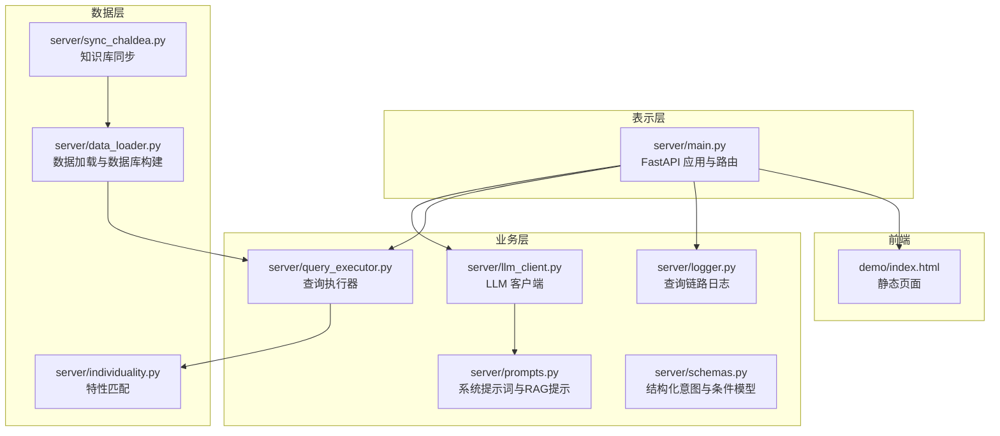
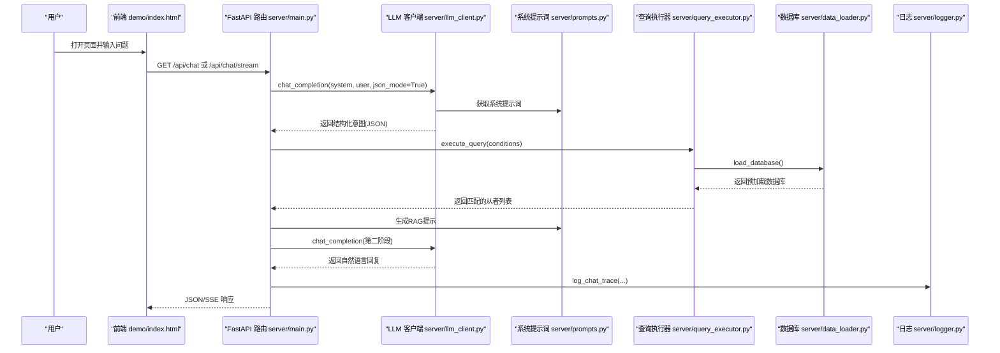
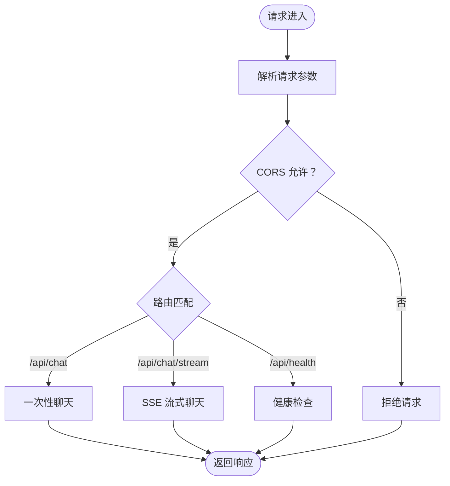
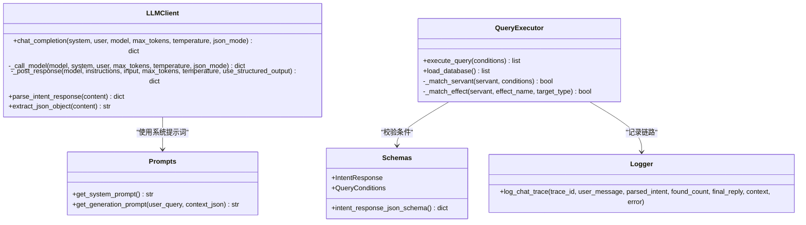
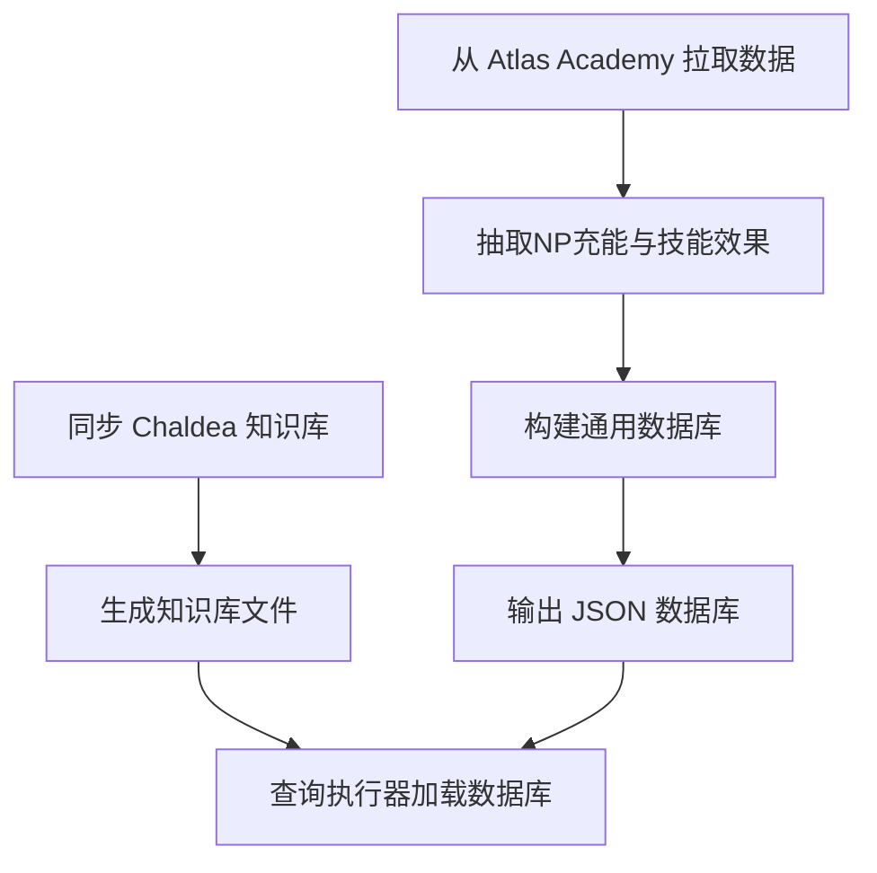

# 分层架构设计

<cite>
**本文引用的文件**
- [server/main.py](file://server/main.py)
- [server/llm_client.py](file://server/llm_client.py)
- [server/query_executor.py](file://server/query_executor.py)
- [server/data_loader.py](file://server/data_loader.py)
- [server/prompts.py](file://server/prompts.py)
- [server/schemas.py](file://server/schemas.py)
- [server/logger.py](file://server/logger.py)
- [server/individuality.py](file://server/individuality.py)
- [server/sync_chaldea.py](file://server/sync_chaldea.py)
- [demo/index.html](file://demo/index.html)
- [tests/test_llm_client.py](file://tests/test_llm_client.py)
- [tests/test_query_executor.py](file://tests/test_query_executor.py)
- [tests/conftest.py](file://tests/conftest.py)
</cite>

## 目录
1. [简介](#简介)
2. [项目结构](#项目结构)
3. [核心组件](#核心组件)
4. [架构总览](#架构总览)
5. [详细组件分析](#详细组件分析)
6. [依赖关系分析](#依赖关系分析)
7. [性能考量](#性能考量)
8. [故障排查指南](#故障排查指南)
9. [结论](#结论)
10. [附录](#附录)

## 简介
本文件面向Laplace项目的分层架构设计，围绕三层架构（表示层、业务层、数据层）进行系统化说明。文档重点阐述：
- 各层职责与边界：表示层负责API路由与前端静态资源挂载；业务层负责LLM集成与查询执行；数据层负责数据加载与知识库管理。
- 层间依赖与接口契约：通过FastAPI路由、LLM客户端、查询执行器、数据加载器之间的协作，形成清晰的调用链。
- 优势与收益：代码解耦、可测试性与可维护性增强；通过中间件与错误处理保障稳定性。
- 扩展性与演进策略：模块化设计便于横向扩展与纵向演进。
- 最佳实践与常见陷阱：接口契约、错误处理、日志追踪、缓存与降级策略等。

## 项目结构
Laplace采用以“server”为核心服务层、“demo”为前端静态资源、以及“tests”为测试层的组织方式。核心文件分布如下：
- 表示层：server/main.py（FastAPI应用、路由、CORS中间件、SSE流式端点、静态资源挂载）
- 业务层：server/llm_client.py（LLM客户端与响应格式降级）、server/prompts.py（系统提示词与RAG生成提示）、server/query_executor.py（查询执行器）、server/schemas.py（结构化意图与条件模型）、server/logger.py（查询链路日志）
- 数据层：server/data_loader.py（从Atlas Academy拉取数据并构建通用数据库）、server/sync_chaldea.py（从Chaldea源码同步知识库）、server/individuality.py（特性匹配逻辑）
- 前端：demo/index.html（静态页面，挂载于根路径）



图表来源
- [server/main.py:114-365](file://server/main.py#L114-L365)
- [server/llm_client.py:41-254](file://server/llm_client.py#L41-L254)
- [server/prompts.py:178-219](file://server/prompts.py#L178-L219)
- [server/query_executor.py:53-343](file://server/query_executor.py#L53-L343)
- [server/schemas.py:16-92](file://server/schemas.py#L16-L92)
- [server/logger.py:38-55](file://server/logger.py#L38-L55)
- [server/data_loader.py:332-363](file://server/data_loader.py#L332-L363)
- [server/sync_chaldea.py:308-429](file://server/sync_chaldea.py#L308-L429)
- [server/individuality.py:58-78](file://server/individuality.py#L58-L78)
- [demo/index.html:1-72](file://demo/index.html#L1-L72)

章节来源
- [server/main.py:114-365](file://server/main.py#L114-L365)
- [demo/index.html:1-72](file://demo/index.html#L1-L72)

## 核心组件
- 表示层（API与前端）
  - FastAPI应用与路由：提供REST端点（JSON与SSE）、CORS中间件、健康检查、静态资源挂载。
  - 关键路由：/api/chat（JSON响应）、/api/chat/stream（SSE流式响应）、/api/health（健康检查）。
- 业务层（LLM与查询）
  - LLM客户端：封装Responses API调用、结构化输出与降级策略、模型轮询与错误处理。
  - 系统提示词：构建系统提示词与RAG生成提示，注入知识库效果分类。
  - 查询执行器：加载数据库、执行多条件筛选、排序与去重、昵称映射与特性匹配。
  - 结构化意图模型：定义IntentResponse与QueryConditions，保证LLM输出与后端解析一致。
  - 日志追踪：记录完整查询链路，便于排障与审计。
- 数据层（数据加载与知识库）
  - 数据加载器：从Atlas Academy API抓取数据、抽取NP充能与技能效果、构建通用数据库。
  - 知识库同步：从Chaldea源码解析枚举与效果分类，生成JSON知识库。
  - 特性匹配：实现特性正负逻辑与AND/OR组合匹配。

章节来源
- [server/main.py:144-365](file://server/main.py#L144-L365)
- [server/llm_client.py:41-254](file://server/llm_client.py#L41-L254)
- [server/prompts.py:178-219](file://server/prompts.py#L178-L219)
- [server/query_executor.py:53-343](file://server/query_executor.py#L53-L343)
- [server/schemas.py:16-92](file://server/schemas.py#L16-L92)
- [server/logger.py:38-55](file://server/logger.py#L38-L55)
- [server/data_loader.py:332-363](file://server/data_loader.py#L332-L363)
- [server/sync_chaldea.py:308-429](file://server/sync_chaldea.py#L308-L429)
- [server/individuality.py:58-78](file://server/individuality.py#L58-L78)

## 架构总览
Laplace采用三层架构，层间通过明确的接口与契约协作：
- 表示层（Presentation Layer）
  - 通过FastAPI暴露HTTP接口，负责请求解析、CORS与静态资源挂载。
  - SSE流式端点将意图解析、数据检索、RAG生成三阶段逐步推送给前端。
- 业务层（Business Layer）
  - LLM客户端负责与外部模型网关交互，统一结构化输出与降级策略。
  - 查询执行器负责在预加载数据库上执行筛选，支持多条件AND/OR、昵称映射与特性匹配。
  - 系统提示词与RAG提示确保LLM输出严格遵循结构化契约。
- 数据层（Data Layer）
  - 数据加载器与知识库同步脚本负责从外部源与Chaldea源码提取领域知识，构建可查询的通用数据库。
  - 查询执行器加载本地JSON数据库，实现快速筛选与排序。



图表来源
- [server/main.py:150-355](file://server/main.py#L150-L355)
- [server/llm_client.py:41-132](file://server/llm_client.py#L41-L132)
- [server/prompts.py:186-219](file://server/prompts.py#L186-L219)
- [server/query_executor.py:53-116](file://server/query_executor.py#L53-L116)
- [server/logger.py:38-55](file://server/logger.py#L38-L55)

## 详细组件分析

### 表示层（FastAPI应用与前端）
- 职责
  - 提供REST API与SSE流式端点，支持CORS跨域访问。
  - 在启动时预加载数据库，保证查询性能。
  - 挂载前端静态资源，使浏览器可直接访问demo页面。
- 关键接口
  - POST /api/chat：一次性返回JSON结果。
  - GET /api/chat/stream：SSE流式返回，分阶段推送思考与结果。
  - GET /api/health：健康检查。
- 中间件与拦截器
  - CORS中间件允许任意来源、方法与头部，便于前端开发调试。
  - SSE响应设置必要的头部以避免代理缓冲。
- 错误处理
  - 意图解析失败与生成阶段失败均进行降级处理，返回友好提示并记录日志。



图表来源
- [server/main.py:120-127](file://server/main.py#L120-L127)
- [server/main.py:150-355](file://server/main.py#L150-L355)

章节来源
- [server/main.py:144-365](file://server/main.py#L144-L365)
- [demo/index.html:1-72](file://demo/index.html#L1-L72)

### 业务层（LLM集成与查询执行）
- LLM客户端
  - 支持主备模型轮询与结构化输出降级（text.format → 纯文本）。
  - 统一Responses API调用，封装错误处理与超时控制。
- 系统提示词与RAG提示
  - 动态注入知识库效果分类，确保LLM输出严格遵循结构化契约。
  - RAG阶段提示强调“基于检索结果回答”，避免先验知识。
- 查询执行器
  - 多条件筛选：NP充能、稀有度、职阶、名称、效果、特性、性别、阵营、配卡、宝具颜色与目标。
  - 支持多从者对比（names字段），并进行去重与排序。
  - 昵称映射与规范化匹配，提升名称查询体验。
- 结构化意图模型
  - IntentResponse与QueryConditions定义严格的JSON模式，确保前后端一致性。
- 日志追踪
  - 记录完整链路，包含traceId、用户问题、解析意图、结果数量、最终回复与上下文。



图表来源
- [server/llm_client.py:41-254](file://server/llm_client.py#L41-L254)
- [server/prompts.py:178-219](file://server/prompts.py#L178-L219)
- [server/query_executor.py:53-343](file://server/query_executor.py#L53-L343)
- [server/schemas.py:16-92](file://server/schemas.py#L16-L92)
- [server/logger.py:38-55](file://server/logger.py#L38-L55)

章节来源
- [server/llm_client.py:41-254](file://server/llm_client.py#L41-L254)
- [server/prompts.py:178-219](file://server/prompts.py#L178-L219)
- [server/query_executor.py:53-343](file://server/query_executor.py#L53-L343)
- [server/schemas.py:16-92](file://server/schemas.py#L16-L92)
- [server/logger.py:38-55](file://server/logger.py#L38-L55)

### 数据层（数据加载与知识库）
- 数据加载器
  - 从Atlas Academy API抓取全量从者数据，过滤正常从者并抽取NP充能与技能效果。
  - 构建通用数据库，包含从者ID、稀有度、职阶、头像URL、特性、性别、阵营、配卡、宝具颜色与目标、效果集合与详情、NP充能统计等。
  - 输出JSON文件供查询执行器加载。
- 知识库同步
  - 从Chaldea源码解析FuncType、BuffType、SkillEffect分类与SvtClass枚举。
  - 生成effect_schema.json、class_mapping.json、mappings.json等知识库文件。
- 特性匹配
  - 实现特性正负逻辑与AND/OR组合匹配，支持排除特性。



图表来源
- [server/data_loader.py:91-329](file://server/data_loader.py#L91-L329)
- [server/sync_chaldea.py:321-418](file://server/sync_chaldea.py#L321-L418)
- [server/query_executor.py:41-50](file://server/query_executor.py#L41-L50)

章节来源
- [server/data_loader.py:332-363](file://server/data_loader.py#L332-L363)
- [server/sync_chaldea.py:308-429](file://server/sync_chaldea.py#L308-L429)
- [server/individuality.py:58-78](file://server/individuality.py#L58-L78)

## 依赖关系分析
- 层内高内聚、层间低耦合
  - 表示层仅依赖业务层的LLM与查询接口，不直接依赖数据层细节。
  - 业务层通过LLM客户端与查询执行器协作，不直接依赖外部数据源。
  - 数据层独立负责数据与知识库的准备，查询执行器通过本地JSON文件访问。
- 关键依赖链
  - server/main.py → server/llm_client.py → server/prompts.py
  - server/main.py → server/query_executor.py → server/individuality.py
  - server/query_executor.py → server/schemas.py
  - server/data_loader.py ← server/sync_chaldea.py
- 循环依赖
  - 未发现循环依赖，模块职责清晰。

```mermaid
graph LR
MAIN["server/main.py"] --> LLM["server/llm_client.py"]
MAIN --> QUERY["server/query_executor.py"]
LLM --> PROMPT["server/prompts.py"]
QUERY --> IND["server/individuality.py"]
QUERY --> SCHEMA["server/schemas.py"]
DATA["server/data_loader.py"] <-- SYNC["server/sync_chaldea.py"]
```

图表来源
- [server/main.py:18-21](file://server/main.py#L18-L21)
- [server/llm_client.py:22-25](file://server/llm_client.py#L22-L25)
- [server/query_executor.py:12-15](file://server/query_executor.py#L12-L15)
- [server/data_loader.py:20-24](file://server/data_loader.py#L20-L24)
- [server/sync_chaldea.py:26-30](file://server/sync_chaldea.py#L26-L30)

章节来源
- [server/main.py:18-21](file://server/main.py#L18-L21)
- [server/llm_client.py:22-25](file://server/llm_client.py#L22-L25)
- [server/query_executor.py:12-15](file://server/query_executor.py#L12-L15)
- [server/data_loader.py:20-24](file://server/data_loader.py#L20-L24)
- [server/sync_chaldea.py:26-30](file://server/sync_chaldea.py#L26-L30)

## 性能考量
- 预加载数据库：在启动时加载JSON数据库，避免每次查询IO开销。
- 缓存与降级：昵称映射与效果匹配索引在内存中缓存，减少重复计算。
- SSE流式响应：前端可逐步接收阶段结果，改善用户体验。
- LLM调用优化：主备模型轮询与结构化输出降级，提高可用性与稳定性。
- 建议
  - 对大型数据库可考虑分页或增量更新策略。
  - 对LLM调用增加超时与重试上限，避免阻塞。
  - 对频繁查询的条件建立二级索引（如按稀有度、职阶分桶）。

[本节为通用性能建议，无需具体文件引用]

## 故障排查指南
- LLM调用失败
  - 现象：意图解析或生成阶段抛错，返回降级提示。
  - 排查：检查环境变量（LLM_BASE_URL、LLM_API_KEY、LLM_MODEL、LLM_FALLBACK_MODELS）与网关连通性。
  - 降级策略：客户端自动尝试备用模型；若仍失败，记录错误并返回友好提示。
- 数据库未加载
  - 现象：查询执行器报错或返回空结果。
  - 排查：确认server/data_loader.py已生成JSON数据库；检查server/main.py启动时是否调用load_database。
- 名称与昵称匹配异常
  - 现象：用户输入昵称无法命中。
  - 排查：检查昵称映射文件与规范化逻辑；确认输入大小写与空白字符处理。
- 日志追踪
  - 使用server/logger.py记录的traceId定位问题，核对intent、conditions与上下文。

章节来源
- [server/main.py:144-242](file://server/main.py#L144-L242)
- [server/llm_client.py:66-84](file://server/llm_client.py#L66-L84)
- [server/query_executor.py:41-50](file://server/query_executor.py#L41-L50)
- [server/logger.py:38-55](file://server/logger.py#L38-L55)

## 结论
Laplace的三层架构通过清晰的职责划分与接口契约，实现了表示层、业务层与数据层的有效解耦。FastAPI路由与CORS中间件保障了前端接入与跨域需求；LLM客户端与查询执行器通过结构化意图与RAG提示确保了输出质量与一致性；数据加载与知识库同步保证了领域知识的权威性与可维护性。整体设计具备良好的可测试性、可扩展性与可维护性，适合持续演进与功能扩展。

[本节为总结性内容，无需具体文件引用]

## 附录

### 分层设计最佳实践
- 接口契约
  - 使用Pydantic模型定义结构化输入输出，确保前后端一致性。
- 错误处理
  - 在业务层统一捕获与降级，向上游返回可读提示与traceId。
- 日志与追踪
  - 记录完整链路，便于问题定位与审计。
- 缓存与性能
  - 预加载数据库与内存缓存，减少IO与重复计算。
- 扩展性
  - 新增查询条件时，优先在查询执行器中扩展匹配逻辑，保持接口稳定。

### 常见陷阱
- 过度耦合：避免表示层直接依赖数据层细节。
- 信任先验知识：RAG阶段严格基于检索结果，避免模型“脑补”。
- 忽视降级：LLM调用失败时需有明确的降级策略与回退逻辑。
- 缺少日志：缺失traceId与上下文会导致问题难以复现。

[本节为通用指导，无需具体文件引用]