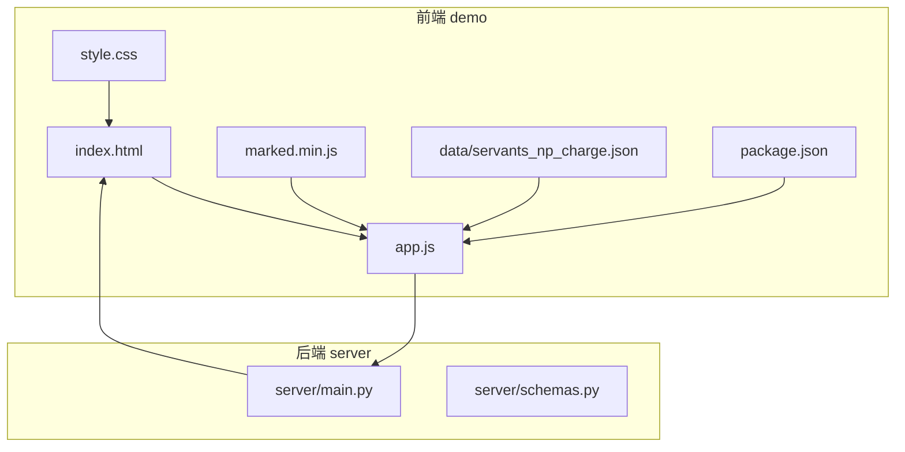
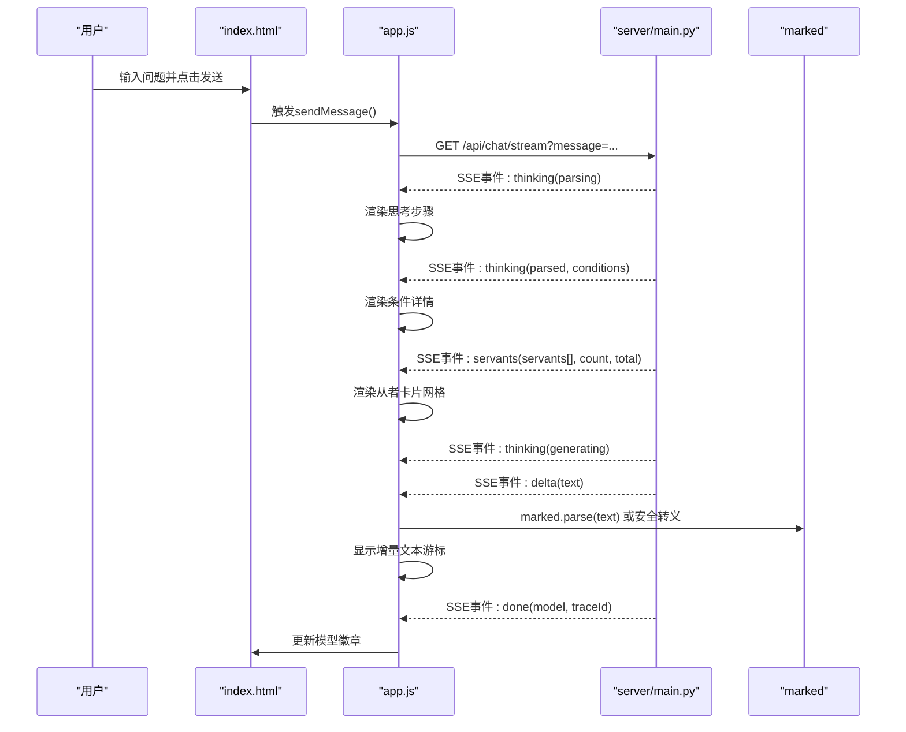
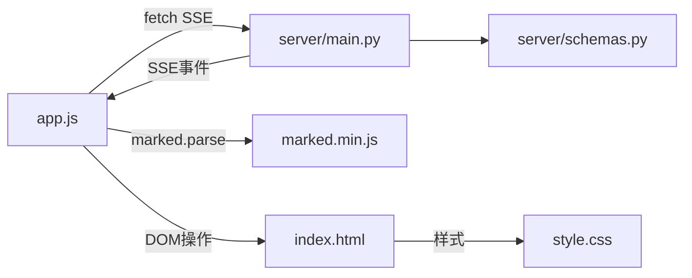

# 前端架构

<cite>
**本文引用的文件**
- [index.html](file://demo/index.html)
- [app.js](file://demo/app.js)
- [style.css](file://demo/style.css)
- [package.json](file://demo/package.json)
- [marked.min.js](file://demo/marked.min.js)
- [servants_np_charge.json](file://demo/data/servants_np_charge.json)
- [main.py](file://server/main.py)
- [schemas.py](file://server/schemas.py)
</cite>

## 目录
1. [简介](#简介)
2. [项目结构](#项目结构)
3. [核心组件](#核心组件)
4. [架构总览](#架构总览)
5. [详细组件分析](#详细组件分析)
6. [依赖关系分析](#依赖关系分析)
7. [性能考量](#性能考量)
8. [故障排查指南](#故障排查指南)
9. [结论](#结论)
10. [附录](#附录)

## 简介
本文件面向Laplace项目的前端架构，聚焦于基于原生JavaScript的聊天界面设计与实现。内容涵盖：
- HTML结构组织与语义化布局
- CSS样式系统与主题设计
- app.js中的核心功能：WebSocket/SSE流式连接、消息发送接收、实时UI更新
- 用户交互设计：输入框处理、消息历史展示、从者卡片渲染
- 响应式布局与移动端适配策略
- 前端与后端API的通信协议：HTTP请求、SSE事件流、错误状态管理
- 静态资源管理与文件组织
- 用户体验优化与性能考虑

## 项目结构
前端Demo位于demo目录，包含页面入口、脚本、样式与静态资源；后端服务位于server目录，提供FastAPI接口与SSE流式输出，并挂载前端静态资源。

图表来源
- [index.html:1-72](file://demo/index.html#L1-L72)
- [app.js:1-412](file://demo/app.js#L1-L412)
- [style.css:1-618](file://demo/style.css#L1-L618)
- [package.json:1-6](file://demo/package.json#L1-L6)
- [marked.min.js:1-7](file://demo/marked.min.js#L1-L7)
- [servants_np_charge.json:1-2055](file://demo/data/servants_np_charge.json#L1-L2055)
- [main.py:1-365](file://server/main.py#L1-L365)
- [schemas.py:1-92](file://server/schemas.py#L1-L92)

章节来源
- [index.html:1-72](file://demo/index.html#L1-L72)
- [app.js:1-412](file://demo/app.js#L1-L412)
- [style.css:1-618](file://demo/style.css#L1-L618)
- [package.json:1-6](file://demo/package.json#L1-L6)
- [marked.min.js:1-7](file://demo/marked.min.js#L1-L7)
- [servants_np_charge.json:1-2055](file://demo/data/servants_np_charge.json#L1-L2055)
- [main.py:1-365](file://server/main.py#L1-L365)
- [schemas.py:1-92](file://server/schemas.py#L1-L92)

## 核心组件
- 页面结构与头部导航：包含Logo、副标题与模型状态徽章
- 聊天区域：欢迎消息与消息容器
- 输入区：文本输入框与发送按钮，支持回车发送与建议芯片点击
- 样式系统：深色主题、渐变背景、动画与响应式网格
- Markdown渲染：通过marked库进行富文本渲染
- SSE流式渲染：分阶段事件（思考步骤、从者卡片、增量文本、完成/错误）

章节来源
- [index.html:14-67](file://demo/index.html#L14-L67)
- [style.css:84-158](file://demo/style.css#L84-L158)
- [style.css:159-175](file://demo/style.css#L159-L175)
- [style.css:489-574](file://demo/style.css#L489-L574)
- [app.js:39-87](file://demo/app.js#L39-L87)
- [app.js:157-177](file://demo/app.js#L157-L177)
- [app.js:215-226](file://demo/app.js#L215-L226)
- [app.js:228-246](file://demo/app.js#L228-L246)

## 架构总览
前端通过fetch发起SSE流式请求，后端以Server-Sent Events形式分阶段推送事件。前端解析事件并逐步渲染思考步骤、从者卡片与增量文本，最终完成并更新模型名称徽章。

图表来源
- [app.js:39-87](file://demo/app.js#L39-L87)
- [app.js:89-121](file://demo/app.js#L89-L121)
- [app.js:157-177](file://demo/app.js#L157-L177)
- [app.js:215-226](file://demo/app.js#L215-L226)
- [app.js:228-246](file://demo/app.js#L228-L246)
- [main.py:245-355](file://server/main.py#L245-L355)

章节来源
- [app.js:39-87](file://demo/app.js#L39-L87)
- [app.js:89-121](file://demo/app.js#L89-L121)
- [app.js:157-177](file://demo/app.js#L157-L177)
- [app.js:215-226](file://demo/app.js#L215-L226)
- [app.js:228-246](file://demo/app.js#L228-L246)
- [main.py:245-355](file://server/main.py#L245-L355)

## 详细组件分析

### HTML结构与语义化
- 头部：Logo组与模型徽章，用于展示当前AI模型状态
- 聊天区域：欢迎消息与消息容器，初始包含提示性建议芯片
- 输入区：输入框与发送按钮，底部注脚包含数据来源链接
- 引入：预连接字体、样式表、marked库与app脚本

章节来源
- [index.html:14-67](file://demo/index.html#L14-L67)

### CSS样式系统与主题设计
- 设计系统：自定义属性定义背景、文字、强调色、半径、阴影等
- 深色主题：背景采用深蓝紫基调，配合微妙光晕与径向渐变
- 动画与过渡：消息淡入、卡片入场、打字指示器、光点脉动
- 响应式：在小屏下调整消息宽度、卡片网格为单列、输入区内边距收缩
- 组件样式：消息气泡、头像、建议芯片、从者卡片网格、思考步骤、流式光标、输入区与滚动条

章节来源
- [style.css:6-57](file://demo/style.css#L6-L57)
- [style.css:71-82](file://demo/style.css#L71-L82)
- [style.css:178-250](file://demo/style.css#L178-L250)
- [style.css:288-391](file://demo/style.css#L288-L391)
- [style.css:415-487](file://demo/style.css#L415-L487)
- [style.css:489-574](file://demo/style.css#L489-L574)
- [style.css:600-618](file://demo/style.css#L600-L618)

### app.js核心功能实现
- API常量与DOM引用：定义API端点、类名映射、DOM节点
- 状态管理：isProcessing标志控制并发发送
- 思考步骤标签：解析、查询、生成阶段的消息文案
- 发送消息（SSE流）：禁用发送、清空输入、追加用户消息、创建流容器、fetch读取SSE、TextDecoder解码、parseSSE解析事件、handleStreamEvent分派事件
- SSE事件解析：按行切分，匹配event与data，JSON反序列化，保留未完整行
- 流式容器：创建assistant消息容器，包含思考步骤、卡片网格、Markdown区域
- 事件处理：
  - thinking：完成上一步骤、渲染当前步骤、解析parsed阶段的条件详情
  - servants：完成查询步骤、显示卡片网格、渲染从者卡片
  - delta：完成生成步骤、显示Markdown区域、增量渲染文本并插入光标
  - done：更新模型徽章
  - error：标记当前步骤为错误、显示错误消息
- 辅助函数：渲染思考步骤、完成步骤、追加消息、追加助手响应（含卡片）、创建卡片HTML、打字指示器、工具函数（星数、HTML转义、滚动到底部）
- 事件监听：发送按钮点击、回车发送、建议芯片点击、页面加载聚焦输入

章节来源
- [app.js:8-38](file://demo/app.js#L8-L38)
- [app.js:40-87](file://demo/app.js#L40-L87)
- [app.js:89-121](file://demo/app.js#L89-L121)
- [app.js:123-155](file://demo/app.js#L123-L155)
- [app.js:157-177](file://demo/app.js#L157-L177)
- [app.js:179-199](file://demo/app.js#L179-L199)
- [app.js:201-213](file://demo/app.js#L201-L213)
- [app.js:215-226](file://demo/app.js#L215-L226)
- [app.js:228-246](file://demo/app.js#L228-L246)
- [app.js:248-287](file://demo/app.js#L248-L287)
- [app.js:289-316](file://demo/app.js#L289-L316)
- [app.js:318-349](file://demo/app.js#L318-L349)
- [app.js:351-370](file://demo/app.js#L351-L370)
- [app.js:372-388](file://demo/app.js#L372-L388)
- [app.js:390-412](file://demo/app.js#L390-L412)

### 用户交互设计
- 输入框处理：回车发送、禁用发送按钮期间、自动聚焦
- 消息历史展示：用户消息右对齐、助手消息左对齐、消息气泡与头像
- 从者卡片渲染：网格布局、星级边框、名称与职业、自充百分比显示、延迟动画
- 建议芯片：点击自动填入输入框并触发发送
- 错误状态：错误消息气泡高亮、错误步骤图标

章节来源
- [index.html:41-46](file://demo/index.html#L41-L46)
- [app.js:269-287](file://demo/app.js#L269-L287)
- [app.js:318-349](file://demo/app.js#L318-L349)
- [style.css:288-391](file://demo/style.css#L288-L391)

### 响应式布局与移动端适配
- 小屏适配：消息最大宽度、卡片网格单列、输入区内边距减少
- 滚动行为：平滑滚动、容器溢出隐藏与自定义滚动条
- 字体与间距：基于变量的统一缩放

章节来源
- [style.css:600-618](file://demo/style.css#L600-L618)
- [style.css:160-165](file://demo/style.css#L160-L165)
- [style.css:582-598](file://demo/style.css#L582-L598)

### 前端与后端API通信协议
- 传统JSON端点：POST /api/chat 返回reply、servants、count、query、model、traceId
- SSE流式端点：GET /api/chat/stream 以SSE事件流推送：
  - thinking：parsing/parsed/querying/generating阶段消息
  - servants：从者列表与总数
  - delta：增量文本
  - done：模型名称与traceId
  - error：错误消息
- 前端SSE解析：按行解析event与data，JSON反序列化，保留未完整行
- 错误处理：捕获异常、移除流容器、显示失败消息、恢复发送状态

章节来源
- [main.py:150-242](file://server/main.py#L150-L242)
- [main.py:245-355](file://server/main.py#L245-L355)
- [app.js:8-10](file://demo/app.js#L8-L10)
- [app.js:39-87](file://demo/app.js#L39-L87)
- [app.js:89-121](file://demo/app.js#L89-L121)
- [app.js:157-177](file://demo/app.js#L157-L177)
- [app.js:228-246](file://demo/app.js#L228-L246)

### 静态资源管理与文件组织
- 静态资源：HTML、CSS、JS、marked库、数据样例
- 包管理：marked依赖声明
- 资源版本：CSS与JS通过查询参数版本化
- 后端挂载：FastAPI挂载demo目录为静态资源根路径

章节来源
- [package.json:1-6](file://demo/package.json#L1-L6)
- [index.html:9-11](file://demo/index.html#L9-L11)
- [index.html](file://demo/index.html#L69)
- [main.py:363-365](file://server/main.py#L363-L365)

## 依赖关系分析
- 前端依赖：
  - marked：Markdown渲染
  - fetch + ReadableStream + TextDecoder：SSE流读取与解码
  - DOM API：消息容器、输入框、按钮、徽章
- 后端依赖：
  - FastAPI：路由、CORS、SSE、静态文件挂载
  - Pydantic：请求/响应模型与校验
  - 异步：异步LLM调用与事件生成

图表来源
- [app.js:39-87](file://demo/app.js#L39-L87)
- [main.py:245-355](file://server/main.py#L245-L355)
- [marked.min.js:1-7](file://demo/marked.min.js#L1-L7)
- [index.html:1-72](file://demo/index.html#L1-L72)
- [style.css:1-618](file://demo/style.css#L1-L618)
- [schemas.py:1-92](file://server/schemas.py#L1-L92)

章节来源
- [app.js:39-87](file://demo/app.js#L39-L87)
- [main.py:245-355](file://server/main.py#L245-L355)
- [marked.min.js:1-7](file://demo/marked.min.js#L1-L7)
- [index.html:1-72](file://demo/index.html#L1-L72)
- [style.css:1-618](file://demo/style.css#L1-L618)
- [schemas.py:1-92](file://server/schemas.py#L1-L92)

## 性能考量
- 流式渲染：SSE分阶段推送，降低首屏等待时间
- DOM最小化更新：仅在事件到达时更新对应区域（思考步骤、卡片网格、Markdown区域）
- 动画与滚动：requestAnimationFrame滚动到底部，避免阻塞主线程
- 图片懒加载与降级：卡片图片onerror降级为SVG占位
- Markdown渲染：优先使用marked，兜底HTML转义，避免XSS风险
- 响应式网格：CSS Grid自动换列，减少JS计算
- 资源版本化：通过查询参数缓存控制

章节来源
- [app.js:384-388](file://demo/app.js#L384-L388)
- [app.js:318-349](file://demo/app.js#L318-L349)
- [app.js:221-226](file://demo/app.js#L221-L226)
- [style.css:327-332](file://demo/style.css#L327-L332)
- [style.css:288-391](file://demo/style.css#L288-L391)
- [index.html:9-11](file://demo/index.html#L9-L11)

## 故障排查指南
- 无法连接后端：SSE读取失败时移除流容器并显示失败消息，检查后端是否启动与CORS配置
- SSE解析错误：parseSSE对每行进行event/data匹配与JSON反序列化，若失败保留剩余行，确保后端事件格式正确
- 错误事件：收到error事件时，当前思考步骤标记为错误并显示错误消息
- 输入状态：发送过程中禁用按钮与输入，完成后恢复焦点
- 模型徽章：done事件更新模型名称，若为error则显示错误状态

章节来源
- [app.js:79-86](file://demo/app.js#L79-L86)
- [app.js:89-121](file://demo/app.js#L89-L121)
- [app.js:235-246](file://demo/app.js#L235-L246)
- [app.js:390-412](file://demo/app.js#L390-L412)
- [main.py:263-267](file://server/main.py#L263-L267)

## 结论
该前端架构以原生JavaScript为核心，结合SSE流式事件与CSS动画，实现了流畅的对话式从者查询体验。HTML结构清晰、样式系统可维护、交互细节完善，并通过marked实现Markdown渲染。后端以FastAPI提供稳定API与SSE事件流，前后端协作明确，具备良好的扩展性与可维护性。

## 附录
- 数据样例：演示用的从者自充数据集，可用于本地测试与示例渲染
- 包依赖：marked用于Markdown解析

章节来源
- [servants_np_charge.json:1-2055](file://demo/data/servants_np_charge.json#L1-L2055)
- [package.json:1-6](file://demo/package.json#L1-L6)