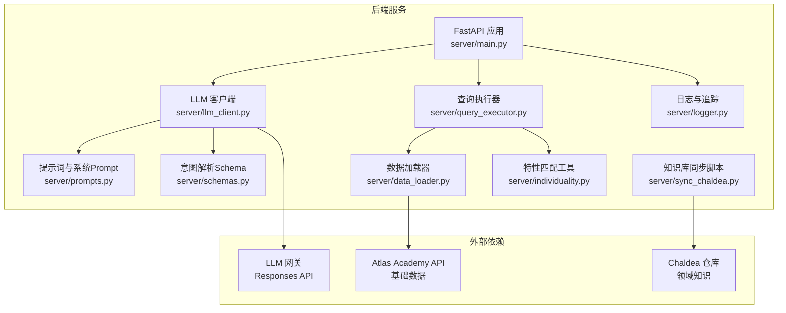
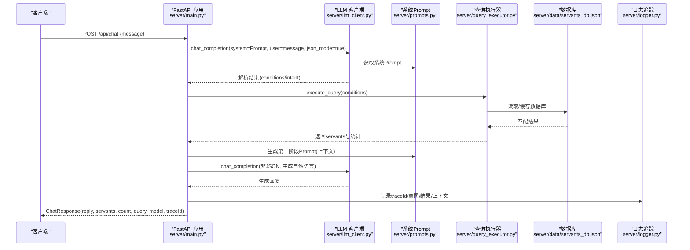
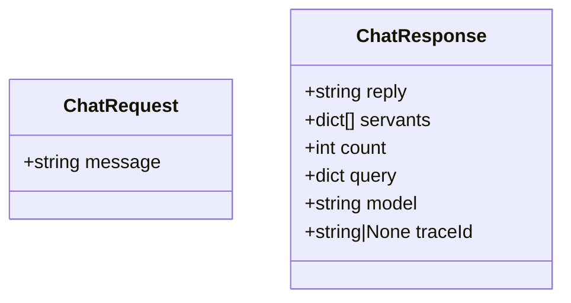
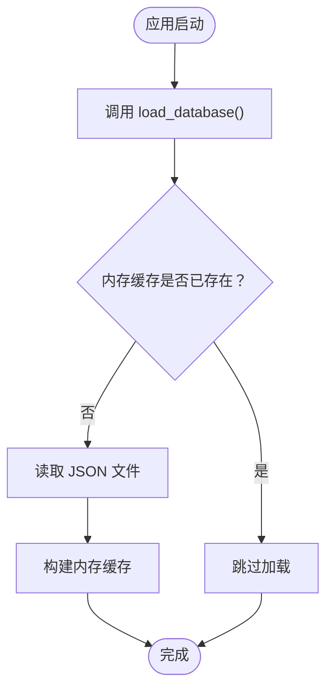
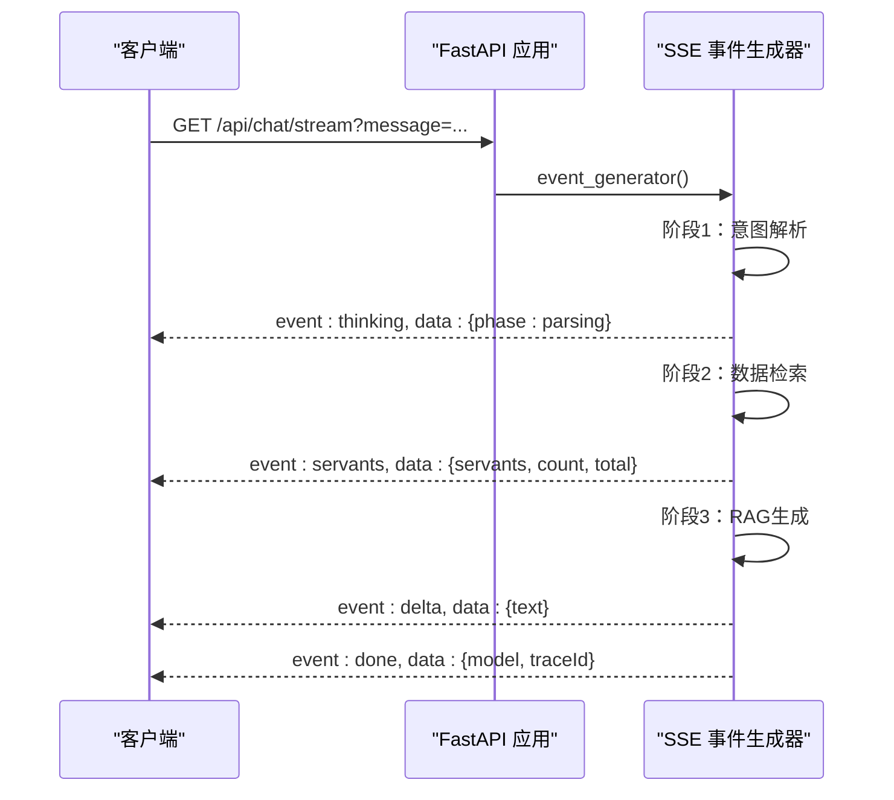
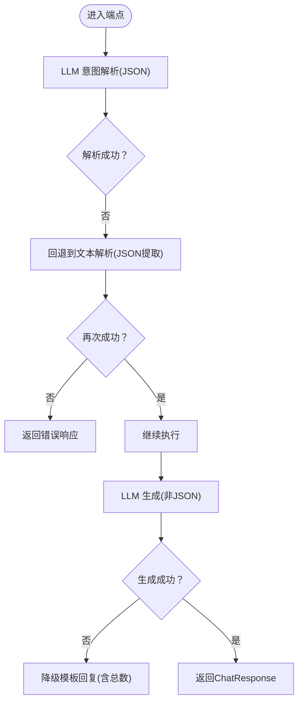
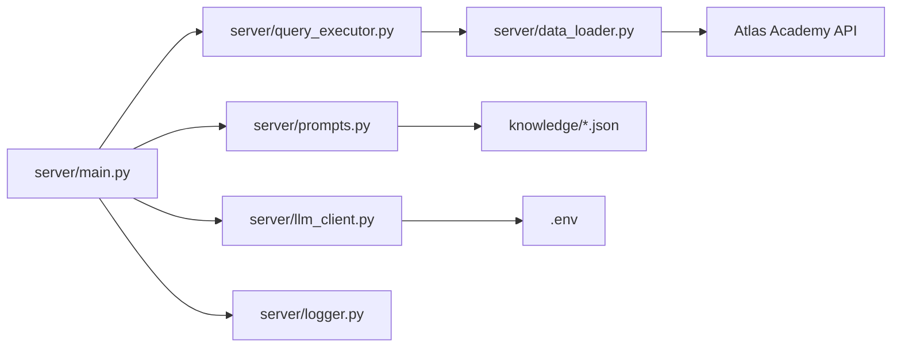

# 后端架构

<cite>
**本文引用的文件**
- [server/main.py](file://server/main.py)
- [server/schemas.py](file://server/schemas.py)
- [server/llm_client.py](file://server/llm_client.py)
- [server/prompts.py](file://server/prompts.py)
- [server/query_executor.py](file://server/query_executor.py)
- [server/data_loader.py](file://server/data_loader.py)
- [server/sync_chaldea.py](file://server/sync_chaldea.py)
- [server/logger.py](file://server/logger.py)
- [server/individuality.py](file://server/individuality.py)
- [server/requirements.txt](file://server/requirements.txt)
- [tests/test_query_executor.py](file://tests/test_query_executor.py)
- [tests/test_llm_client.py](file://tests/test_llm_client.py)
- [README.md](file://README.md)
</cite>

## 目录
1. [简介](#简介)
2. [项目结构](#项目结构)
3. [核心组件](#核心组件)
4. [架构总览](#架构总览)
5. [详细组件分析](#详细组件分析)
6. [依赖分析](#依赖分析)
7. [性能考虑](#性能考虑)
8. [故障排查指南](#故障排查指南)
9. [结论](#结论)
10. [附录](#附录)

## 简介
本文件面向Laplace项目的后端架构，围绕基于FastAPI的Web服务展开，涵盖应用初始化、CORS中间件配置、路由组织、请求/响应模型、启动事件与数据库预加载、RESTful API端点设计、异步编程模式、错误处理与异常降级、FastAPI配置与性能优化建议等内容。文档同时提供多类Mermaid图示，帮助读者快速把握系统结构与关键流程。

## 项目结构
后端位于server目录，采用“功能分层 + 数据/知识库分离”的组织方式：
- 应用入口与路由：server/main.py
- LLM交互与意图解析：server/llm_client.py、server/prompts.py、server/schemas.py
- 查询执行与数据预加载：server/query_executor.py、server/data_loader.py、server/sync_chaldea.py
- 日志与追踪：server/logger.py
- 特性匹配工具：server/individuality.py
- 依赖与运行：server/requirements.txt
- 测试：tests/test_query_executor.py、tests/test_llm_client.py
- 项目说明：README.md

图表来源
- [server/main.py:114-365](file://server/main.py#L114-L365)
- [server/llm_client.py:41-254](file://server/llm_client.py#L41-L254)
- [server/prompts.py:15-219](file://server/prompts.py#L15-L219)
- [server/schemas.py:16-92](file://server/schemas.py#L16-L92)
- [server/query_executor.py:41-343](file://server/query_executor.py#L41-L343)
- [server/data_loader.py:91-363](file://server/data_loader.py#L91-L363)
- [server/sync_chaldea.py:308-429](file://server/sync_chaldea.py#L308-L429)
- [server/logger.py:38-55](file://server/logger.py#L38-L55)

章节来源
- [README.md:104-127](file://README.md#L104-L127)
- [server/main.py:114-365](file://server/main.py#L114-L365)

## 核心组件
- FastAPI应用与中间件
  - 应用实例化、标题/描述/版本设置
  - CORS中间件允许任意来源/方法/头
- 请求/响应模型
  - ChatRequest：message字段
  - ChatResponse：reply、servants、count、query、model、traceId
- 启动事件与数据库预加载
  - startup事件中调用load_database，预加载从者数据库
- RESTful端点
  - POST /api/chat：标准JSON响应
  - GET /api/chat/stream：SSE流式响应，分阶段推送思考过程与结果
  - GET /api/health：健康检查
- 异步编程模式
  - 所有端点与LLM调用均使用async/await
- 错误处理与降级
  - LLM调用失败时的模型回退与异常捕获
  - 生成阶段失败时的降级文本模板
  - 严格的JSON Schema校验与回退策略

章节来源
- [server/main.py:114-365](file://server/main.py#L114-L365)
- [server/schemas.py:16-92](file://server/schemas.py#L16-L92)
- [server/llm_client.py:41-254](file://server/llm_client.py#L41-L254)
- [server/query_executor.py:41-343](file://server/query_executor.py#L41-L343)

## 架构总览
下图展示了从客户端请求到LLM解析、数据库检索、RAG生成与响应返回的端到端流程。

图表来源
- [server/main.py:150-242](file://server/main.py#L150-L242)
- [server/llm_client.py:41-132](file://server/llm_client.py#L41-L132)
- [server/prompts.py:178-219](file://server/prompts.py#L178-L219)
- [server/query_executor.py:53-116](file://server/query_executor.py#L53-L116)
- [server/logger.py:38-55](file://server/logger.py#L38-L55)

## 详细组件分析

### 应用初始化与中间件
- 应用实例化：设置title、description、version
- CORS中间件：允许任意来源、方法与头，便于前后端联调
- 静态文件挂载：将demo目录作为静态资源根路径，支持HTML页面直连

章节来源
- [server/main.py:114-127](file://server/main.py#L114-L127)
- [server/main.py:363-365](file://server/main.py#L363-L365)

### 请求/响应模型设计
- ChatRequest
  - 字段：message（用户输入）
  - 设计理念：最小必要字段，聚焦对话输入
- ChatResponse
  - 字段：reply（自然语言回复）、servants（匹配的从者列表，受MAX_RESULTS限制）、count（总数）、query（解析出的条件）、model（使用的模型标识）、traceId（追踪ID）
  - 设计理念：统一响应载体，承载意图解析、检索与生成的完整结果，便于前端渲染与调试

图表来源
- [server/main.py:129-142](file://server/main.py#L129-L142)

章节来源
- [server/main.py:129-142](file://server/main.py#L129-L142)

### 启动事件与数据库预加载
- startup事件：在应用启动时调用load_database，将从者数据库加载到内存，后续查询无需重复IO
- 预加载策略：全局变量缓存，首次访问时读取JSON文件并统计有效效果条目

图表来源
- [server/main.py:144-147](file://server/main.py#L144-L147)
- [server/query_executor.py:41-50](file://server/query_executor.py#L41-L50)

章节来源
- [server/main.py:144-147](file://server/main.py#L144-L147)
- [server/query_executor.py:41-50](file://server/query_executor.py#L41-L50)

### RESTful API端点设计
- /api/chat（POST）
  - 请求体：ChatRequest
  - 响应体：ChatResponse
  - 处理流程：意图解析（LLM JSON模式）→ 条件校验 → 数据检索（execute_query）→ 上下文预消化（_build_context）→ RAG生成（非JSON模式）→ 记录追踪日志
- /api/chat/stream（GET）
  - 查询参数：message
  - 响应：SSE流，分阶段推送thinking/delta/servants/done事件，支持前端逐步渲染
- /api/health（GET）
  - 响应：服务健康状态

图表来源
- [server/main.py:245-355](file://server/main.py#L245-L355)

章节来源
- [server/main.py:150-242](file://server/main.py#L150-L242)
- [server/main.py:245-355](file://server/main.py#L245-L355)
- [server/main.py:358-361](file://server/main.py#L358-L361)

### 异步编程模式与协程处理
- FastAPI端点均为异步函数，使用async/await
- LLM调用封装为异步函数，支持超时控制与回退模型
- SSE端点通过异步生成器逐段推送事件，避免阻塞

章节来源
- [server/main.py:150-242](file://server/main.py#L150-L242)
- [server/main.py:245-355](file://server/main.py#L245-L355)
- [server/llm_client.py:41-132](file://server/llm_client.py#L41-L132)

### 错误处理策略与异常降级
- LLM调用失败时的模型回退：依次尝试主模型与备用模型
- JSON结构化输出失败时的降级：回退到文本解析并提取JSON对象
- 生成阶段失败的降级：使用模板化回复，包含总数与提示
- 日志记录：统一记录traceId、查询、意图、结果、上下文与错误信息，便于追踪

图表来源
- [server/llm_client.py:66-84](file://server/llm_client.py#L66-L84)
- [server/llm_client.py:108-132](file://server/llm_client.py#L108-L132)
- [server/main.py:157-174](file://server/main.py#L157-L174)
- [server/main.py:214-221](file://server/main.py#L214-L221)

章节来源
- [server/llm_client.py:66-84](file://server/llm_client.py#L66-L84)
- [server/llm_client.py:108-132](file://server/llm_client.py#L108-L132)
- [server/main.py:157-174](file://server/main.py#L157-L174)
- [server/main.py:214-221](file://server/main.py#L214-L221)
- [server/logger.py:38-55](file://server/logger.py#L38-L55)

### LLM意图解析与Schema契约
- 系统Prompt：包含效果分类、字段说明、示例与格式约束
- 意图解析Schema：IntentResponse，约束intent与conditions结构
- JSON Schema校验：Pydantic模型验证，失败抛出异常
- 回退策略：当网关不支持response_format时，自动降级为text.format并回退到文本解析

章节来源
- [server/prompts.py:15-219](file://server/prompts.py#L15-L219)
- [server/schemas.py:79-92](file://server/schemas.py#L79-L92)
- [server/llm_client.py:176-183](file://server/llm_client.py#L176-L183)
- [server/llm_client.py:108-132](file://server/llm_client.py#L108-L132)

### 查询执行器与数据库预消化
- 数据库预加载：首次访问时从JSON文件读取并缓存
- 查询条件：支持NP自充、稀有度、职阶、名称、效果、特性、性别、阵营、配卡、宝具颜色与目标类型等
- 多从者对比：names字段支持对比多个从者，按稀有度与编号排序
- 预消化上下文：_build_context将原始数据翻译与精简，限制返回数量，避免响应过大

章节来源
- [server/query_executor.py:41-116](file://server/query_executor.py#L41-L116)
- [server/main.py:60-106](file://server/main.py#L60-L106)

### 知识库与数据加载
- 知识库同步：从Chaldea源码解析枚举与效果分类，生成JSON知识库
- 数据加载：从Atlas Academy API抓取全量从者数据，构建通用数据库
- 效果匹配：基于知识库建立funcType/buffType索引，提取技能效果与宝具效果

章节来源
- [server/sync_chaldea.py:308-429](file://server/sync_chaldea.py#L308-L429)
- [server/data_loader.py:91-363](file://server/data_loader.py#L91-L363)

### 日志与追踪
- JSONL格式日志：记录traceId、query、intent、results_count、reply、context、error
- 适配器：FileHandler + 自定义JsonlFormatter，保证可读性与可分析性

章节来源
- [server/logger.py:38-55](file://server/logger.py#L38-L55)

## 依赖分析
- 外部依赖
  - FastAPI、Uvicorn：Web框架与ASGI服务器
  - httpx：异步HTTP客户端
  - python-dotenv：环境变量加载
  - requests：数据加载器的HTTP客户端
- 内部模块耦合
  - main.py依赖llm_client、prompts、query_executor、logger
  - llm_client依赖schemas与环境变量
  - query_executor依赖data_loader生成的数据库与knowledge目录
  - sync_chaldea.py生成knowledge目录，供prompts与query_executor使用

图表来源
- [server/main.py:114-365](file://server/main.py#L114-L365)
- [server/llm_client.py:24-35](file://server/llm_client.py#L24-L35)
- [server/query_executor.py:14-16](file://server/query_executor.py#L14-L16)
- [server/data_loader.py:20-23](file://server/data_loader.py#L20-L23)

章节来源
- [server/requirements.txt:1-7](file://server/requirements.txt#L1-L7)
- [server/main.py:114-365](file://server/main.py#L114-L365)

## 性能考虑
- 预加载与缓存
  - 启动时一次性加载数据库，后续查询避免磁盘IO
  - 全局缓存servants_db与昵称映射，减少重复解析
- 响应大小控制
  - MAX_RESULTS限制返回数量，避免超大响应
  - MAX_CONTEXT_SIZE限制上下文展示数量
- 异步与并发
  - 使用async/await与异步HTTP客户端，提高并发吞吐
- LLM调用优化
  - 低温度与结构化输出，减少Token消耗与不确定性
  - 失败时快速回退，避免长时间等待
- SSE流式输出
  - 分阶段推送，前端可逐步渲染，改善用户体验

章节来源
- [server/main.py:56-58](file://server/main.py#L56-L58)
- [server/main.py:233-234](file://server/main.py#L233-L234)
- [server/llm_client.py:27-34](file://server/llm_client.py#L27-L34)

## 故障排查指南
- LLM调用失败
  - 现象：意图解析或生成阶段抛出异常
  - 排查：检查LLM_BASE_URL、LLM_API_KEY、LLM_MODEL与LLM_FALLBACK_MODELS配置；查看回退日志
- JSON Schema校验失败
  - 现象：parse_intent_response抛出校验错误
  - 排查：确认系统Prompt与JSON Schema一致；检查模型输出是否符合格式
- 数据库未加载
  - 现象：查询返回空或报错
  - 排查：确认startup事件已执行；检查servants_db.json是否存在；确认knowledge目录已生成
- SSE流异常
  - 现象：前端无法接收事件或断流
  - 排查：检查headers中的Cache-Control、Connection与X-Accel-Buffering；确认event_generator未提前退出

章节来源
- [server/llm_client.py:66-84](file://server/llm_client.py#L66-L84)
- [server/llm_client.py:176-183](file://server/llm_client.py#L176-L183)
- [server/query_executor.py:41-50](file://server/query_executor.py#L41-L50)
- [server/main.py:245-355](file://server/main.py#L245-L355)

## 结论
Laplace后端以FastAPI为核心，结合LLM意图解析、结构化Schema契约、数据库预加载与RAG生成，形成一套高可用、可观测、可扩展的对话式FGO数据查询系统。通过SSE流式交互与严格的错误降级策略，系统在保证准确性的同时提升了用户体验与稳定性。建议在生产环境中配合监控与限流策略，持续优化LLM调用与数据库查询性能。

## 附录
- FastAPI配置要点
  - CORS：允许任意来源/方法/头，便于本地开发与跨域联调
  - 静态文件：挂载demo目录，支持直接访问前端页面
  - 启动事件：预加载数据库，确保首次查询性能
- 性能优化建议
  - 使用连接池与异步客户端
  - 合理设置LLM温度与最大Token
  - 对热点数据增加缓存层级
  - 前端侧启用事件节流与增量渲染