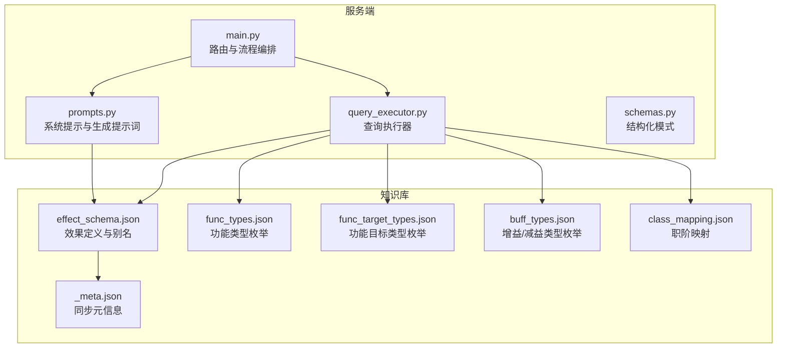
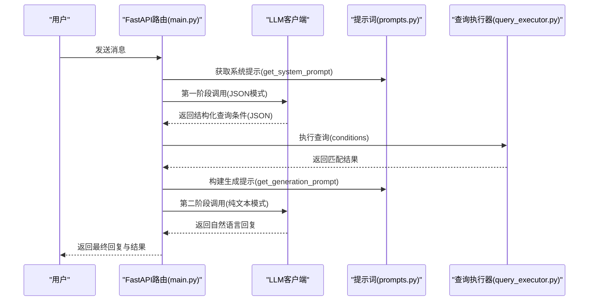
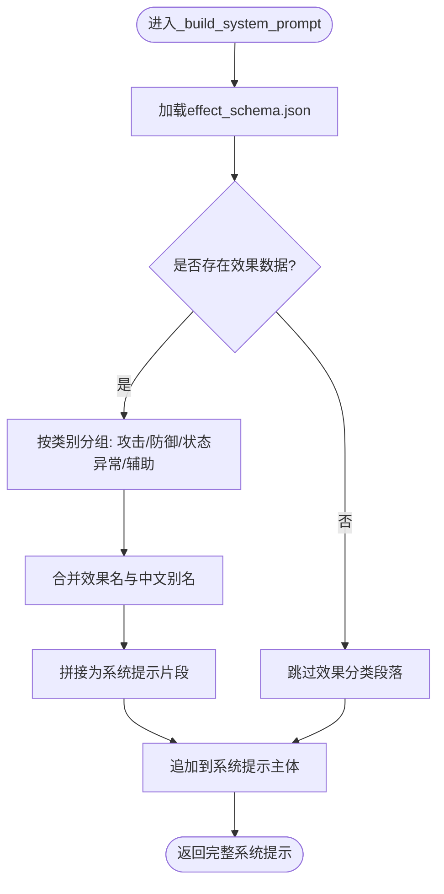
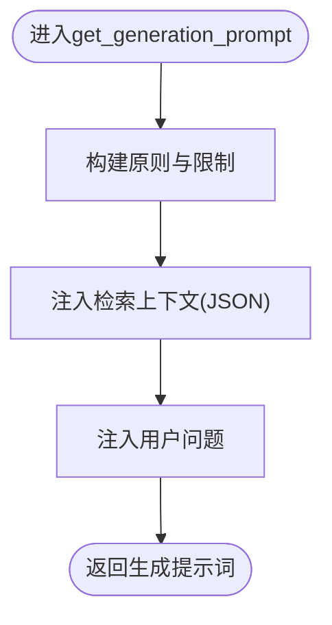
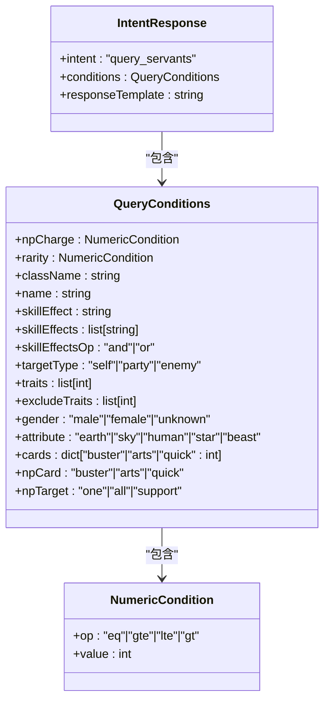
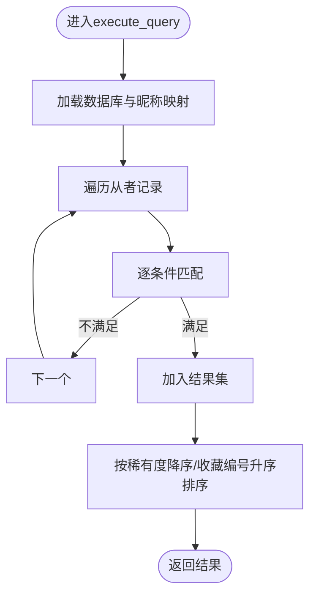
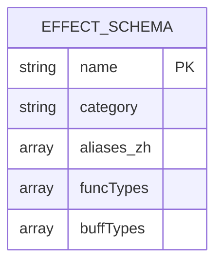
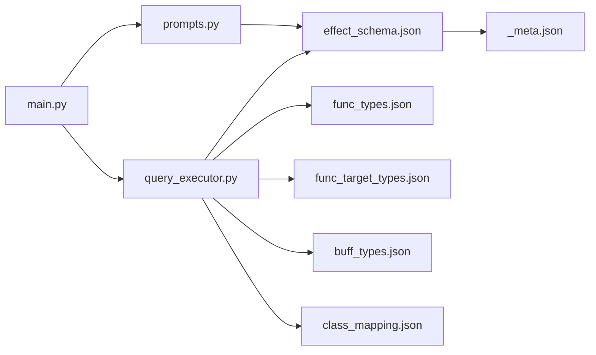

# 提示管理模块

<cite>
**本文引用的文件**
- [prompts.py](file://server/prompts.py)
- [main.py](file://server/main.py)
- [schemas.py](file://server/schemas.py)
- [query_executor.py](file://server/query_executor.py)
- [effect_schema.json](file://server/knowledge/effect_schema.json)
- [func_types.json](file://server/knowledge/func_types.json)
- [func_target_types.json](file://server/knowledge/func_target_types.json)
- [buff_types.json](file://server/knowledge/buff_types.json)
- [class_mapping.json](file://server/knowledge/class_mapping.json)
- [_meta.json](file://server/knowledge/_meta.json)
- [test_query_executor.py](file://tests/test_query_executor.py)
</cite>

## 目录
1. [简介](#简介)
2. [项目结构](#项目结构)
3. [核心组件](#核心组件)
4. [架构总览](#架构总览)
5. [详细组件分析](#详细组件分析)
6. [依赖分析](#依赖分析)
7. [性能考虑](#性能考虑)
8. [故障排查指南](#故障排查指南)
9. [结论](#结论)
10. [附录](#附录)

## 简介
本文件面向Laplace的提示管理模块，系统性阐述以下主题：
- 系统提示的构建原理与get_system_prompt函数的实现逻辑
- 动态效果注入机制：如何将技能效果信息嵌入提示词以提升查询准确性
- effect_schema.json的作用与结构：效果类型定义、中文别名映射与分类体系
- 提示词模板的设计原则：上下文构建、指令清晰度与输出格式控制
- 具体提示词示例与效果注入案例：如何根据不同查询场景调整提示策略
- 提示词优化最佳实践与调试方法

## 项目结构
提示管理模块位于server目录下，围绕提示词构建、效果注入与生成阶段提示词组织，配合知识库文件完成效果分类与映射。

图表来源
- [prompts.py:1-208](file://server/prompts.py#L1-L208)
- [main.py:1-228](file://server/main.py#L1-L228)
- [query_executor.py:1-305](file://server/query_executor.py#L1-L305)
- [effect_schema.json:1-694](file://server/knowledge/effect_schema.json#L1-L694)
- [func_types.json:1-527](file://server/knowledge/func_types.json#L1-L527)
- [func_target_types.json:1-147](file://server/knowledge/func_target_types.json#L1-L147)
- [buff_types.json:1-991](file://server/knowledge/buff_types.json#L1-L991)
- [class_mapping.json:1-478](file://server/knowledge/class_mapping.json#L1-L478)
- [_meta.json:1-12](file://server/knowledge/_meta.json#L1-L12)

章节来源
- [prompts.py:1-208](file://server/prompts.py#L1-L208)
- [main.py:1-228](file://server/main.py#L1-L228)

## 核心组件
- 系统提示构建器：负责动态加载知识库，构建技能效果分类列表，并生成严格的系统提示词，限定输出格式为JSON。
- 生成阶段提示词：在检索完成后，基于上下文生成自然语言回复的提示词，强调“仅依据检索结果回答”与“总数披露”等原则。
- 结构化模式：通过Pydantic模型定义意图解析后的查询条件，保证LLM输出与后端执行器的契约一致。
- 查询执行器：将LLM解析出的条件转化为数据库筛选逻辑，支持效果、充能、职阶、稀有度、特性、配卡、宝具颜色与目标类型等多维组合。

章节来源
- [prompts.py:15-160](file://server/prompts.py#L15-L160)
- [prompts.py:175-207](file://server/prompts.py#L175-L207)
- [schemas.py:16-76](file://server/schemas.py#L16-L76)
- [query_executor.py:53-261](file://server/query_executor.py#L53-L261)

## 架构总览
提示管理模块贯穿两阶段：意图解析（第一阶段）与自然语言生成（第二阶段）。系统提示用于约束LLM输出格式与能力边界；生成提示词用于指导LLM在严格上下文范围内生成自然语言回复。

图表来源
- [main.py:87-218](file://server/main.py#L87-L218)
- [prompts.py:167-207](file://server/prompts.py#L167-L207)
- [query_executor.py:53-87](file://server/query_executor.py#L53-L87)

## 详细组件分析

### 系统提示构建器（get_system_prompt）
- 动态效果注入：从effect_schema.json读取效果条目，按攻击、防御、状态异常、辅助四类分组，拼接效果名与中文别名，形成“效果分类”段落，供LLM在解析时进行映射。
- 输出格式约束：严格要求LLM输出JSON，包含intent与conditions字段，并给出字段说明与示例，确保后续执行器可稳定解析。
- 名称与别名规则：明确当用户使用昵称或别名时，保留原输入至name字段，由后端昵称映射表完成最终解析，避免误改名。
- 职阶中文映射：提供中文到英文职阶名的映射，便于用户自然语言表达与系统内部一致。

图表来源
- [prompts.py:15-60](file://server/prompts.py#L15-L60)

章节来源
- [prompts.py:15-60](file://server/prompts.py#L15-L60)
- [prompts.py:167-172](file://server/prompts.py#L167-L172)

### 生成阶段提示词（get_generation_prompt）
- 上下文原则：强调“仅依据检索结果回答”，禁止臆测或使用先验知识；对总数必须披露，不得以代表数量替代总数。
- 能力分类：明确区分skillEffects（主动技能效果）、npEffects（宝具效果）与totalSelfCharge（自充能力），并给出合理分类建议。
- 负向提示：通过内部字段（如__internal_card_buff_check）提示AI避免错误声明未明确提及的色卡强化，防止误导。
- 输出格式：要求直接输出自然语言回复，不包含JSON或代码块标签。

图表来源
- [prompts.py:175-207](file://server/prompts.py#L175-L207)

章节来源
- [prompts.py:175-207](file://server/prompts.py#L175-L207)

### 结构化模式（IntentResponse与QueryConditions）
- 通过Pydantic模型定义意图解析后的结构化契约，确保LLM输出与后端执行器一致。
- 关键字段覆盖：NP自充、稀有度、职阶、名称、单/多效果及逻辑关系、目标类型、特性集合、性别、阵营、配卡、宝具颜色与目标类型等。
- 字段校验：对空字符串与空容器进行归一化处理，避免解析歧义。

图表来源
- [schemas.py:16-76](file://server/schemas.py#L16-L76)

章节来源
- [schemas.py:16-76](file://server/schemas.py#L16-L76)

### 查询执行器（execute_query）
- 条件解析：将LLM输出的结构化条件映射为数据库筛选逻辑，支持精确匹配、范围比较、集合包含与排除等。
- 效果匹配：支持单效果与多效果AND/OR组合，必要时按目标类型（self/party/enemy）进一步验证。
- 名称与昵称：支持英文/日文/中文名与昵称映射，提升用户表达的灵活性。
- 排序策略：按稀有度降序、收藏编号升序排序，保证结果呈现顺序稳定。

图表来源
- [query_executor.py:53-87](file://server/query_executor.py#L53-L87)
- [query_executor.py:90-261](file://server/query_executor.py#L90-L261)

章节来源
- [query_executor.py:53-261](file://server/query_executor.py#L53-L261)

### 动态效果注入机制
- 效果来源：effect_schema.json定义了55种效果，含name、category、aliases_zh、funcTypes、buffTypes等字段。
- 分类体系：按attack、defence、debuff、others四类组织，便于系统提示中按类别列举。
- 映射与别名：中文别名用于用户自然语言表达与系统内部effectName之间的映射，提升解析鲁棒性。
- 注入流程：_load_effect_names从effect_schema.json读取，按类别聚合效果名与别名，拼接到系统提示中。

图表来源
- [effect_schema.json:10-694](file://server/knowledge/effect_schema.json#L10-L694)

章节来源
- [effect_schema.json:1-694](file://server/knowledge/effect_schema.json#L1-L694)
- [prompts.py:15-43](file://server/prompts.py#L15-L43)

### 提示词模板设计原则
- 上下文构建：系统提示中包含“效果分类”“输出格式要求”“字段说明”“示例”等，确保LLM理解查询边界与期望格式。
- 指令清晰度：明确“仅依据检索结果回答”“总数披露”“禁止臆测”等原则，降低生成偏差。
- 输出格式控制：第一阶段强制JSON模式，第二阶段强制纯文本模式，分别满足结构化解析与自然语言生成需求。

章节来源
- [prompts.py:46-160](file://server/prompts.py#L46-L160)
- [prompts.py:175-207](file://server/prompts.py#L175-L207)

### 提示词示例与效果注入案例
- 示例场景一：用户问“30自充的从者有哪些”。系统提示要求返回严格JSON，conditions中npCharge设置为等于30，其余字段为空。
- 示例场景二：用户问“有无敌技能的从者”。系统提示要求返回严格JSON，conditions中skillEffect设置为“invincible”，其余字段为空。
- 示例场景三：用户问“秩序善，且30自充以上的绿卡光炮从者有哪些”。系统提示要求返回严格JSON，conditions中traits为[300,303]，npCharge为gte 30，npCard为quick，npTarget为all。
- 示例场景四：用户问“三红配卡的从者”。系统提示要求返回严格JSON，conditions中cards为{"buster":3}，其余字段为空。

章节来源
- [prompts.py:138-158](file://server/prompts.py#L138-L158)
- [test_query_executor.py:123-171](file://tests/test_query_executor.py#L123-L171)

## 依赖分析
- prompts.py依赖知识库文件effect_schema.json，动态构建系统提示中的效果分类。
- main.py在路由层调用prompts.py获取系统提示与生成提示词，并在查询成功后构造上下文传递给生成阶段。
- query_executor.py依赖知识库文件func_types.json、func_target_types.json、buff_types.json与class_mapping.json，完成效果类型、功能类型、目标类型与职阶映射的解析与匹配。
- _meta.json记录知识库文件同步状态与数量，便于追踪数据一致性。

图表来源
- [prompts.py:15-43](file://server/prompts.py#L15-L43)
- [main.py:87-218](file://server/main.py#L87-L218)
- [query_executor.py:1-305](file://server/query_executor.py#L1-L305)
- [_meta.json:1-12](file://server/knowledge/_meta.json#L1-L12)

章节来源
- [prompts.py:15-43](file://server/prompts.py#L15-L43)
- [main.py:87-218](file://server/main.py#L87-L218)
- [query_executor.py:1-305](file://server/query_executor.py#L1-L305)
- [_meta.json:1-12](file://server/knowledge/_meta.json#L1-L12)

## 性能考虑
- 缓存策略：系统提示采用全局缓存，避免重复构建，降低冷启动开销。
- 上下文截断：生成阶段仅传递前若干条结果作为上下文，控制LLM输入长度，提升响应速度与稳定性。
- 查询优化：数据库侧按稀有度与收藏编号排序，减少前端渲染压力；条件匹配采用短路逻辑，尽早剔除不满足项。

章节来源
- [prompts.py:163-172](file://server/prompts.py#L163-L172)
- [main.py:132-173](file://server/main.py#L132-L173)
- [query_executor.py:85-87](file://server/query_executor.py#L85-L87)

## 故障排查指南
- LLM解析失败：检查系统提示是否正确注入，确认JSON模式开启与输出格式是否符合预期。
- 生成阶段异常：检查生成提示词是否正确注入检索上下文，确认总数披露与负向提示是否生效。
- 效果映射错误：核对effect_schema.json中效果名与中文别名，确保系统提示与查询执行器的映射一致。
- 职阶/昵称不识别：核对class_mapping.json与nicknames.json，确保映射表完整且与用户输入一致。

章节来源
- [main.py:94-126](file://server/main.py#L94-L126)
- [main.py:175-196](file://server/main.py#L175-L196)
- [effect_schema.json:1-694](file://server/knowledge/effect_schema.json#L1-L694)
- [class_mapping.json:1-478](file://server/knowledge/class_mapping.json#L1-L478)

## 结论
提示管理模块通过“系统提示动态注入+结构化输出+严格生成约束”的设计，实现了从自然语言到结构化查询再到自然语言回复的闭环。effect_schema.json作为效果知识库的核心，为系统提示与查询执行提供了统一的语义基础。配合Pydantic结构化模式与查询执行器的多维筛选，系统在准确性与鲁棒性之间取得良好平衡。

## 附录
- 提示词优化最佳实践
  - 在系统提示中明确“仅依据检索结果回答”，并在生成提示词中强调总数披露与禁止臆测。
  - 使用示例驱动，提供典型查询与期望输出，帮助LLM理解上下文边界。
  - 对多效果查询，明确AND/OR逻辑关系，避免歧义。
- 调试方法
  - 启用traceId记录完整链路，定位意图解析与生成阶段的异常点。
  - 逐步缩小问题范围：先验证系统提示输出是否符合JSON模式，再检查查询执行器的条件映射，最后检查生成提示词的上下文注入。