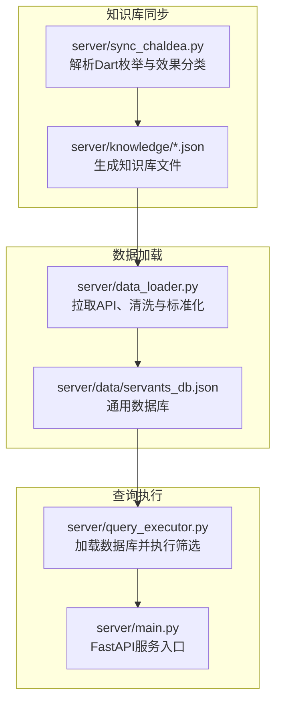
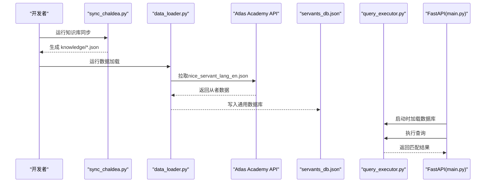
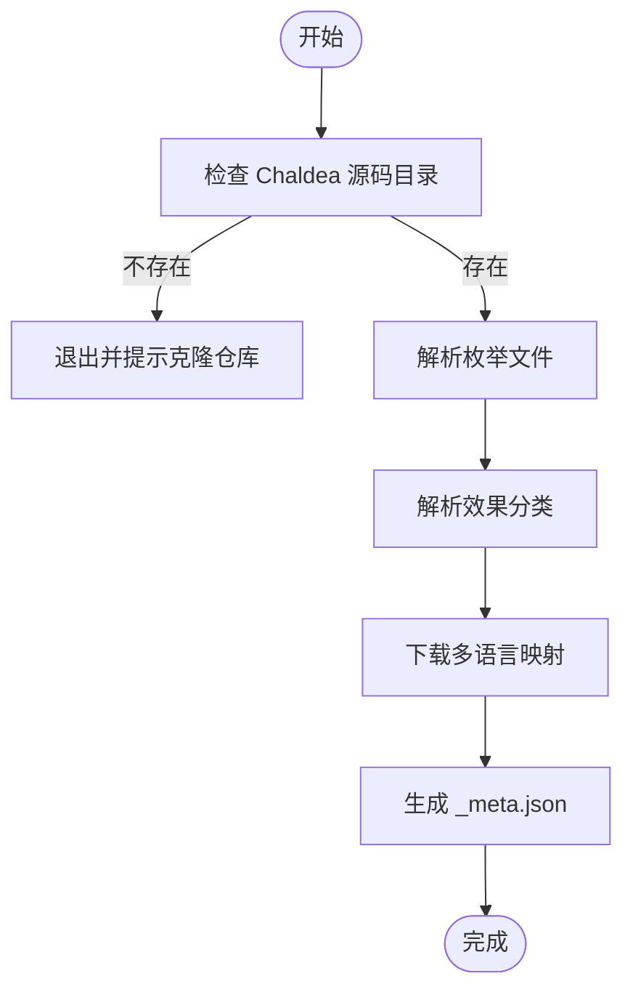
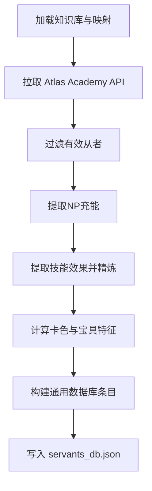
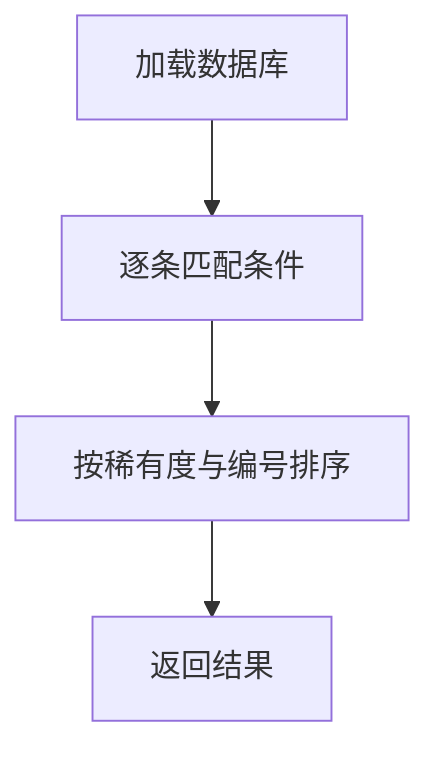
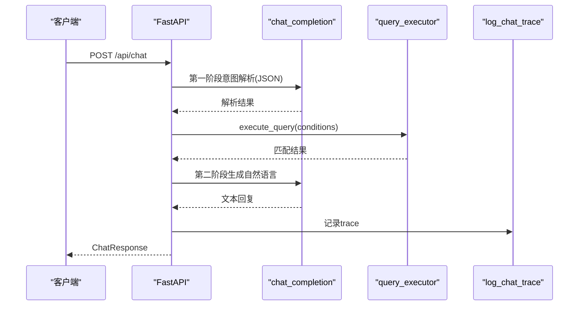
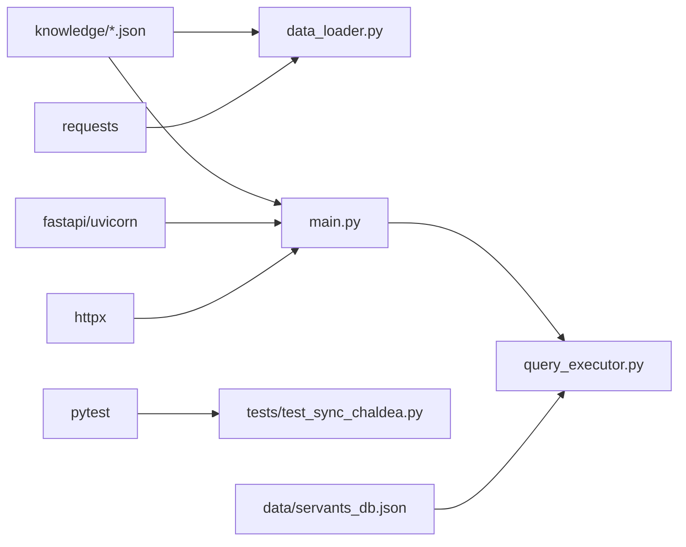

# 数据加载模块

<cite>
**本文引用的文件**
- [server/data_loader.py](file://server/data_loader.py)
- [server/sync_chaldea.py](file://server/sync_chaldea.py)
- [server/query_executor.py](file://server/query_executor.py)
- [server/main.py](file://server/main.py)
- [server/schemas.py](file://server/schemas.py)
- [server/requirements.txt](file://server/requirements.txt)
- [server/knowledge/_meta.json](file://server/knowledge/_meta.json)
- [server/knowledge/effect_schema.json](file://server/knowledge/effect_schema.json)
- [server/knowledge/func_types.json](file://server/knowledge/func_types.json)
- [server/knowledge/class_mapping.json](file://server/knowledge/class_mapping.json)
- [demo/data/servants_np_charge.json](file://demo/data/servants_np_charge.json)
- [tests/test_sync_chaldea.py](file://tests/test_sync_chaldea.py)
</cite>

## 目录
1. [简介](#简介)
2. [项目结构](#项目结构)
3. [核心组件](#核心组件)
4. [架构总览](#架构总览)
5. [详细组件分析](#详细组件分析)
6. [依赖分析](#依赖分析)
7. [性能考量](#性能考量)
8. [故障排查指南](#故障排查指南)
9. [结论](#结论)
10. [附录](#附录)

## 简介
本文件面向Laplace的数据加载模块，系统性阐述数据源集成、预处理管道、Chaldea源码解析、数据库初始化与查询执行的全流程。重点覆盖：
- Atlas Academy API的调用与数据获取流程
- 原始数据清洗、字段映射与格式标准化
- sync_chaldea.py中的Chaldea源码解析逻辑（版本同步、增量更新思路、数据完整性校验）
- 数据库初始化（表结构、索引、导入）
- 配置项与参数（API密钥、重试、超时）
- 数据质量保证与错误恢复策略（网络异常、格式错误）

## 项目结构
数据加载模块由“知识库同步”和“数据加载/查询执行”两大部分组成：
- 知识库同步：从Chaldea Dart源码抽取领域知识，生成effect_schema.json、枚举映射等JSON文件，供后续数据加载与查询使用
- 数据加载：从Atlas Academy API拉取从者数据，结合知识库进行效果提取与标准化，输出通用数据库；查询执行器加载该数据库并执行条件筛选

图表来源
- [server/sync_chaldea.py:308-418](file://server/sync_chaldea.py#L308-L418)
- [server/data_loader.py:332-359](file://server/data_loader.py#L332-L359)
- [server/query_executor.py:41-50](file://server/query_executor.py#L41-L50)
- [server/main.py:81-84](file://server/main.py#L81-L84)

章节来源
- [server/sync_chaldea.py:1-429](file://server/sync_chaldea.py#L1-L429)
- [server/data_loader.py:1-363](file://server/data_loader.py#L1-L363)
- [server/query_executor.py:1-305](file://server/query_executor.py#L1-L305)
- [server/main.py:1-228](file://server/main.py#L1-L228)

## 核心组件
- 知识库同步器：从Chaldea Dart源码解析枚举与效果分类，生成JSON知识库，并记录版本元数据
- 数据加载器：从Atlas Academy API抓取从者数据，提取NP充能与技能效果，构建通用数据库
- 查询执行器：加载数据库，按条件筛选并排序返回结果
- FastAPI服务：启动时预加载数据库，提供聊天接口与健康检查

章节来源
- [server/sync_chaldea.py:308-418](file://server/sync_chaldea.py#L308-L418)
- [server/data_loader.py:91-102](file://server/data_loader.py#L91-L102)
- [server/query_executor.py:41-87](file://server/query_executor.py#L41-L87)
- [server/main.py:81-84](file://server/main.py#L81-L84)

## 架构总览
数据流从外部API与Chaldea源码进入，经由知识库与数据加载两个阶段，最终形成可查询的通用数据库，并由查询执行器提供检索能力。

图表来源
- [server/sync_chaldea.py:308-418](file://server/sync_chaldea.py#L308-L418)
- [server/data_loader.py:91-102](file://server/data_loader.py#L91-L102)
- [server/data_loader.py:332-359](file://server/data_loader.py#L332-L359)
- [server/query_executor.py:41-87](file://server/query_executor.py#L41-L87)
- [server/main.py:81-84](file://server/main.py#L81-L84)

## 详细组件分析

### 知识库同步器（sync_chaldea.py）
- 功能职责
  - 解析Dart枚举：提取FuncType、FuncTargetType、BuffType、SvtClass等
  - 解析效果分类：从effect.dart提取SkillEffect的分类、funcTypes、buffTypes及中文别名
  - 下载多语言映射：从chaldea-data仓库下载svt_names.json与trait.json
  - 生成元数据：记录同步时间、Chaldea提交号、文件计数等
- 关键流程
  - 检查Chaldea源码目录存在性
  - 逐文件解析并写入JSON
  - 下载映射数据并写入mappings.json
  - 生成_meta.json记录版本信息
- 数据完整性校验
  - 通过元数据文件记录各文件数量，便于比对
  - 对缺失或解析失败的枚举/效果给出警告并继续执行
- 增量更新思路
  - 当前实现为幂等覆盖写入，重复运行会刷新旧文件
  - 可通过比较_meta.json中的chaldeaCommit与本地记录，实现“版本变更即触发更新”的增量策略

图表来源
- [server/sync_chaldea.py:313-318](file://server/sync_chaldea.py#L313-L318)
- [server/sync_chaldea.py:321-341](file://server/sync_chaldea.py#L321-L341)
- [server/sync_chaldea.py:354-363](file://server/sync_chaldea.py#L354-L363)
- [server/sync_chaldea.py:386-394](file://server/sync_chaldea.py#L386-L394)
- [server/sync_chaldea.py:396-412](file://server/sync_chaldea.py#L396-L412)

章节来源
- [server/sync_chaldea.py:1-429](file://server/sync_chaldea.py#L1-L429)
- [server/knowledge/_meta.json:1-12](file://server/knowledge/_meta.json#L1-L12)

### 数据加载器（data_loader.py）
- 功能职责
  - 从Atlas Academy API抓取nice_servant_lang_en.json
  - 加载知识库（effect_schema.json、mappings.json）
  - 提取NP充能与技能效果，构建通用数据库
  - 输出servants_db.json
- 关键流程
  - 加载知识库与名称映射
  - 从API拉取数据并过滤有效从者
  - 提取NP充能（self/party）、卡色构成、宝具类型与目标
  - 提取技能效果并进行二次精炼（避免卡色通用枚举污染）
  - 写入数据库文件
- 数据预处理
  - 字段映射：将数值型枚举映射为字符串标识
  - 格式标准化：统一效果名、目标类型分类、卡色映射
  - 兼容性：保留向后兼容字段（如npCharges）

图表来源
- [server/data_loader.py:337-347](file://server/data_loader.py#L337-L347)
- [server/data_loader.py:91-102](file://server/data_loader.py#L91-L102)
- [server/data_loader.py:231-329](file://server/data_loader.py#L231-L329)

章节来源
- [server/data_loader.py:1-363](file://server/data_loader.py#L1-L363)

### 查询执行器（query_executor.py）
- 功能职责
  - 预加载servants_db.json并缓存
  - 根据LLM解析出的条件执行筛选
  - 支持多条件组合（NP充能、稀有度、职阶、名称、效果、特性、性别、阵营、配卡、宝具颜色与目标等）
  - 排序规则：稀有度降序、collectionNo升序
- 关键流程
  - 加载数据库（带缓存）
  - 逐条匹配条件（数值比较、字符串匹配、效果集合与详细数据联动）
  - 排序并返回结果
- 名称匹配增强
  - 支持昵称映射与规范化（去除空格、符号、全角半角差异）
  - 支持英文/中文/日文名称模糊匹配

图表来源
- [server/query_executor.py:41-87](file://server/query_executor.py#L41-L87)
- [server/query_executor.py:90-261](file://server/query_executor.py#L90-L261)

章节来源
- [server/query_executor.py:1-305](file://server/query_executor.py#L1-L305)

### FastAPI服务入口（main.py）
- 功能职责
  - 启动时预加载数据库
  - 提供/chat接口：意图解析、查询执行、自然语言生成、日志追踪
  - 提供/health健康检查
- 错误处理
  - LLM解析失败时返回友好提示并记录traceId
  - 生成阶段失败时降级回模板回复

图表来源
- [server/main.py:87-218](file://server/main.py#L87-L218)
- [server/query_executor.py:53-87](file://server/query_executor.py#L53-L87)

章节来源
- [server/main.py:1-228](file://server/main.py#L1-L228)

## 依赖分析
- 外部依赖
  - requests：用于调用Atlas Academy API
  - httpx、fastapi、uvicorn：用于服务端
  - pytest：用于单元测试
- 内部依赖
  - knowledge/*.json：作为数据加载与查询的输入
  - data/servants_db.json：作为查询执行器的输入

图表来源
- [server/requirements.txt:1-7](file://server/requirements.txt#L1-L7)
- [server/data_loader.py:14-18](file://server/data_loader.py#L14-L18)
- [server/main.py:7-18](file://server/main.py#L7-L18)
- [tests/test_sync_chaldea.py:1-58](file://tests/test_sync_chaldea.py#L1-L58)

章节来源
- [server/requirements.txt:1-7](file://server/requirements.txt#L1-L7)
- [server/data_loader.py:14-18](file://server/data_loader.py#L14-L18)
- [server/main.py:7-18](file://server/main.py#L7-L18)

## 性能考量
- 数据加载阶段
  - API请求超时设置为较长时限，确保稳定获取全量数据
  - 仅保留有效从者（type为normal且collectionNo>0），减少后续处理开销
- 查询执行阶段
  - 预加载数据库并缓存，避免重复IO
  - 使用集合快速路径判断效果存在性，再按需检查详细数据
  - 排序采用稳定的多键排序，兼顾稀有度与编号
- I/O优化
  - JSON序列化使用ensure_ascii=False与缩进，便于调试但生产环境可考虑压缩存储

章节来源
- [server/data_loader.py:94](file://server/data_loader.py#L94)
- [server/query_executor.py:41-50](file://server/query_executor.py#L41-L50)
- [server/query_executor.py:275-289](file://server/query_executor.py#L275-L289)

## 故障排查指南
- 知识库同步失败
  - 现象：提示未找到Chaldea源码目录
  - 处理：按照提示克隆仓库至指定路径
  - 参考：[server/sync_chaldea.py:313-318](file://server/sync_chaldea.py#L313-L318)
- API请求失败
  - 现象：拉取从者数据时报错
  - 处理：检查网络连通性与超时设置；确认API地址可达
  - 参考：[server/data_loader.py:94](file://server/data_loader.py#L94)
- 数据库为空或效果缺失
  - 现象：查询结果为空或效果字段缺失
  - 处理：确认知识库文件存在且有效；检查effect_schema.json与mappings.json是否生成
  - 参考：[server/data_loader.py:44-61](file://server/data_loader.py#L44-L61)
- LLM解析失败
  - 现象：/api/chat返回错误提示
  - 处理：检查模型配置与网络；查看traceId定位日志
  - 参考：[server/main.py:101-111](file://server/main.py#L101-L111)
- 测试验证
  - 使用单元测试验证解析逻辑正确性
  - 参考：[tests/test_sync_chaldea.py:1-58](file://tests/test_sync_chaldea.py#L1-L58)

章节来源
- [server/sync_chaldea.py:313-318](file://server/sync_chaldea.py#L313-L318)
- [server/data_loader.py:94](file://server/data_loader.py#L94)
- [server/data_loader.py:44-61](file://server/data_loader.py#L44-L61)
- [server/main.py:101-111](file://server/main.py#L101-L111)
- [tests/test_sync_chaldea.py:1-58](file://tests/test_sync_chaldea.py#L1-L58)

## 结论
数据加载模块通过“知识库同步—数据加载—查询执行”的分层设计，实现了从Chaldea源码与Atlas Academy API到通用数据库与可查询服务的完整闭环。其特点在于：
- 纯正则解析Chaldea源码，无需Dart SDK
- 幂等覆盖写入，重复运行安全可靠
- 严格的字段映射与格式标准化，确保数据一致性
- 查询执行器具备完善的条件匹配与排序逻辑
- 服务端具备基础的错误处理与降级策略

## 附录

### 数据库初始化与导入
- 初始化步骤
  - 运行知识库同步：生成knowledge/*.json
  - 运行数据加载：生成data/servants_db.json
  - 启动服务：预加载数据库并提供查询接口
- 导入流程
  - 知识库：由sync_chaldea.py生成
  - 数据库：由data_loader.py生成
  - 查询：由query_executor.py加载

章节来源
- [server/sync_chaldea.py:308-418](file://server/sync_chaldea.py#L308-L418)
- [server/data_loader.py:332-359](file://server/data_loader.py#L332-L359)
- [server/query_executor.py:41-50](file://server/query_executor.py#L41-L50)

### 配置选项与参数说明
- API调用
  - Atlas Academy API地址与超时设置
  - 参考：[server/data_loader.py:20-21](file://server/data_loader.py#L20-L21)，[server/data_loader.py:94](file://server/data_loader.py#L94)
- 知识库与映射
  - effect_schema.json、mappings.json等文件位置
  - 参考：[server/data_loader.py:44-61](file://server/data_loader.py#L44-L61)
- 服务端参数
  - FastAPI中间件与路由定义
  - 参考：[server/main.py:51-63](file://server/main.py#L51-L63)，[server/main.py:221-224](file://server/main.py#L221-L224)
- 依赖管理
  - Python包依赖声明
  - 参考：[server/requirements.txt:1-7](file://server/requirements.txt#L1-L7)

章节来源
- [server/data_loader.py:20-21](file://server/data_loader.py#L20-L21)
- [server/data_loader.py:94](file://server/data_loader.py#L94)
- [server/data_loader.py:44-61](file://server/data_loader.py#L44-L61)
- [server/main.py:51-63](file://server/main.py#L51-L63)
- [server/main.py:221-224](file://server/main.py#L221-L224)
- [server/requirements.txt:1-7](file://server/requirements.txt#L1-L7)

### 数据质量保证与错误恢复
- 数据完整性校验
  - 通过_meta.json记录文件数量与Chaldea提交号，便于比对与审计
  - 参考：[server/knowledge/_meta.json:1-12](file://server/knowledge/_meta.json#L1-L12)
- 错误恢复策略
  - 知识库缺失时提示并继续执行（仅提取NP充能）
  - API请求失败时抛出HTTP异常，由上层捕获并记录
  - LLM解析失败时降级回模板回复
  - 参考：[server/data_loader.py:47-49](file://server/data_loader.py#L47-L49)，[server/data_loader.py:95](file://server/data_loader.py#L95)，[server/main.py:101-111](file://server/main.py#L101-L111)

章节来源
- [server/knowledge/_meta.json:1-12](file://server/knowledge/_meta.json#L1-L12)
- [server/data_loader.py:47-49](file://server/data_loader.py#L47-L49)
- [server/data_loader.py:95](file://server/data_loader.py#L95)
- [server/main.py:101-111](file://server/main.py#L101-L111)